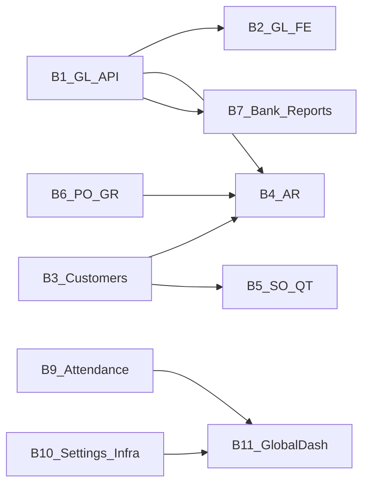

# Phase 0 — Implementation order & gap matrix

**อัปเดต:** 2026-04-19  
**อ้างอิง:** [Release_1.md](Requirements/Release_1.md), [Release_2.md](Requirements/Release_2.md), [Release_1_traceability_mermaid.md](Requirements/Release_1_traceability_mermaid.md), [Release_2_traceability_mermaid.md](Requirements/Release_2_traceability_mermaid.md), [SD_Flow](SD_Flow/), [UX_Flow](UX_Flow/), [UI_Flow_mockup/Page/_INDEX.md](UI_Flow_mockup/Page/_INDEX.md), โค้ด `erp_backend/`, `erp_frontend/`

เอกสารนี้เป็น **แหล่งอ้างอิงลำดับงาน** สำหรับ Phase 1–3 และ checklist ความครบของ Requirements

---

## 1) Checklist ความครบ — Release 1 (Feature 1.1–1.16)

| ID | Feature (Release_1) | SD_Flow / UX หลัก | BE สถานะโค้ดปัจจุบัน | FE สถานะโค้ดปัจจุบัน |
|----|---------------------|-------------------|----------------------|----------------------|
| R1-1.1 | Auth + RBAC | `SD_Flow/User_Login/login.md` | มี `/api/auth/*` | มี `/login`, session |
| R1-1.2 | HR Employee | `SD_Flow/HR/employee.md` | มี | มี |
| R1-1.3 | HR Organization | `SD_Flow/HR/organization.md` | มี | มี |
| R1-1.4 | HR Leave | `SD_Flow/HR/leaves.md` | มี | มี |
| R1-1.5 | HR Payroll | `SD_Flow/HR/employee.md` (run) | มี | มี |
| R1-1.6 | Finance Invoice AR | `SD_Flow/Finance/invoices.md` | มี (รวม payments + status transitions + paid/balance ตาม R2-3.2 บางส่วน) | มี (detail + payments + issue/cancel) |
| R1-1.7 | Finance Vendor | `SD_Flow/Finance/vendors.md` | มี | มี |
| R1-1.8 | Finance AP | `SD_Flow/Finance/ap.md` | มี | มี (รวม vendor-invoices path) |
| R1-1.9 | Accounting core (COA, Journal, Ledger, Integrations) | `SD_Flow/Finance/accounting_core.md` | **ตารางใน DB มี — routes ไม่ mount ใน `finance/index.ts` (ช่องว่าง)** | **ไม่มี routes ใน `router.tsx` สำหรับ COA/Journal** |
| R1-1.10 | Finance reports summary | `SD_Flow/Finance/reports.md` | มี `/reports/summary` | มี `/finance/reports` |
| R1-1.11 | PM Budget | `SD_Flow/PM/budgets.md` | มี | มี |
| R1-1.12 | PM Expense | `SD_Flow/PM/expense` | มี | มี |
| R1-1.13 | PM Progress | `SD_Flow/PM/progress.md` | มี | มี |
| R1-1.14 | PM Dashboard | `SD_Flow/PM/dashboard.md` | KPI ผ่าน progress/budget แยก — **ไม่มี global aggregate endpoint เดียว** | มี `/pm/dashboard` |
| R1-1.15 | Settings Users | `SD_Flow/User_Login/user_role_permission.md` | มี | มี |
| R1-1.16 | Settings Roles | เดียวกัน | มี | มี |

---

## 2) Checklist ความครบ — Release 2 (§3.1–3.13)

| § | Feature | SD_Flow หลัก | BE | FE (router + หน้า) |
|---|---------|--------------|----|---------------------|
| 3.1 | Customer management CRUD | `Finance/customers.md` | **B3:** `GET/POST/PATCH/DELETE` + options + activate ตาม `customers.md` (soft delete, 409 unpaid) | **B3:** `/finance/customers`, `/new`, `/:id/edit` |
| 3.2 | AR payment / aging | `Finance/invoices.md`, reports | **B4:** `invoice_payments`, `GET/POST .../invoices/:id/payments`, `PATCH .../status`, `GET /reports/ar-aging` | **B4:** invoice detail (record payment, history), Reports → AR aging tab |
| 3.3 | Thai tax VAT/WHT | `Finance/tax.md` | **ยังไม่มี tax hub API แยก** | **ยังไม่มี `/finance/tax/*`** |
| 3.4 | Financial statements | `Finance/reports.md` | **ยังไม่มี BS/PL/CF แยกตาม BR** | **ยังไม่มี hub รายงาน R2** |
| 3.5 | Cash / bank | `Finance/bank_accounts.md` | **ยังไม่มี** | **ยังไม่มี** |
| 3.6 | PO / GR | `Finance/purchase_orders.md` | **ยังไม่มี** | **ยังไม่มี** |
| 3.7 | Attendance & time | `HR/attendance_overtime.md` | **schema ใน hr.schema แต่ไม่มี migration ใน repo migrations** | **ยังไม่มี `/hr/attendance/*`** |
| 3.8 | Company / fiscal settings | `User_Login/settings_admin_r2.md` | **B10:** `/api/settings/company`, fiscal, notification-configs, audit | **B10:** `/settings/system` |
| 3.9 | Print / export | `Finance/document_exports.md` | **B10:** invoice + AP minimal ASCII PDF | **B10:** ปุ่มดาวน์โหลด PDF บน invoice detail |
| 3.10 | Notifications | settings SD | **B10:** `/api/notifications/*` + in-app table | **B10:** `/notifications`, header bell |
| 3.11 | Quotation / SO | `Finance/quotation_sales_orders.md` | **B5:** `quotations` + `sales_orders` + `so_items`, `GET/POST/PATCH` quotations & SO, status, `convert-to-so`, `convert-to-invoice`, `invoices.sales_order_id` | **B5:** `/finance/quotations`, `/sales-orders`, forms & detail + pipeline actions |
| 3.12 | Audit trail | settings SD | **B10:** `/api/settings/audit-logs` | **B10:** ส่วน audit ใน `/settings/system` |
| 3.13 | Global dashboard | `PM/global_dashboard.md` | **B11:** `GET /api/dashboard/summary` (trim ตามสิทธิ์ finance/hr/pm + alerts) | **B11:** `/dashboard`, Overview ใน sidebar, home redirect เมื่อมีสิทธิ์สรุป |

---

## 3) Gap matrix (สรุป — ประเภทงาน)

คอลัมน์ **Work type:** `refactor` | `net-new BE` | `net-new FE` | `full-stack new`

| Area | Work type | หมายเหตุสั้น |
|------|-----------|---------------|
| R1-1.9 GL / Journal / Ledger / Integrations | refactor + net-new BE + net-new FE | mount API + หน้า COA/Journal ตาม BR |
| R2-3.1 Customers | full-stack new | schema ขยาย + API + หน้า list/detail/form |
| R2-3.2 AR payments & aging | refactor + net-new | ขยาย invoice routes + รายงาน |
| R2-3.3–3.6 Tax, statements, bank, PO | ส่วนใหญ่ full-stack new | ตาม SD + migrations ใหญ่ |
| R2-3.7 Attendance | net-new BE + FE + **migration** | sync `hr.schema` กับ DB |
| R2-3.8–3.12 Settings / export / notif / audit | net-new | ตาม `settings_admin_r2.md` |
| R2-3.13 Global dashboard | net-new BE + FE | aggregate + หน้า `/` หรือ `/dashboard` |

---

## 4) Implementation batches (ลำดับแนะนำ)

ลำดับนี้ลดความเสี่ยง FK และ workflow (ปรับได้หลัง review backlog)

| Batch | Scope | พึ่งพา | SD / UX หลัก |
|-------|--------|--------|----------------|
| **B0** | Phase 0 เอกสารนี้ + `change.md` | — | — |
| **B1** | R1-1.9 — Chart of accounts + Journal entries API (และ permission seed) | ตารางมีใน DB | `accounting_core.md` |
| **B2** | R1-1.9 — หน้า FE COA + Journal (list/create ขั้นต่ำ) | B1 | `_INDEX` R1-09 |
| **B3** | R2-3.1 Customers — BE แล้ว FE | B1 เสร็จช่วยลด block บางส่วน | `customers.md`, R2-01 UI |
| **B4** | R2-3.2 AR payments + invoice status + aging report | B3 | `invoices.md` |
| **B5** | R2-3.11 Quotation / SO + เชื่อม Invoice | B3 | `quotation_sales_orders.md` |
| **B6** | R2-3.6 PO / GR / AP bridge | vendors, AP | `purchase_orders.md` |
| **B7** | R2-3.5 Bank + R2-3.4 Statements | GL มีข้อมูล | `bank_accounts.md`, `reports.md` |
| **B8** | R2-3.3 Tax hub | invoices/AP | `tax.md` |
| **B9** | R2-3.7 Attendance — migration + API + FE | employees | `attendance_overtime.md` |
| **B10** | R2-3.8 Company/fiscal, 3.9 export, 3.10 notif, 3.12 audit | settings | `settings_admin_r2.md`, `document_exports.md` |
| **B11** | R2-3.13 Global dashboard | B1–B10 บางส่วน | `global_dashboard.md` |
| **B12** | Phase 3 — E2E, smoke, api-contract-matrix, ปิด checklist | ทั้งหมด | — |

**สถานะ implement ใน repo:** **B1–B2** (GL), **B3** (Customers), **B4** (AR payments + aging), **B5** (Quotation / SO + invoice link), **B10** (settings / notifications / audit / minimal PDF), **B11** (`GET /api/dashboard/summary` + `/dashboard`) — รวม `GET /api/pm/global-dashboard/pm-snapshot` (PM-only), **B12** (smoke checklist + API contract matrix อัปเดต B10/B11 + contract test `userCanAccessDashboard`) — รายละเอียดดู [change.md](../change.md)

---

## 5) RBAC — permission ที่ควรเพิ่ม (ขั้นต่ำ)

| Permission | ใช้กับ | หมายเหตุ |
|------------|--------|----------|
| `finance:account:view` | COA list | เพิ่มใน seed + grant finance roles |
| `finance:account:create` | COA create | |
| `finance:account:edit` | COA patch / activate | |
| `finance:journal:view` | Journal list/detail | |
| `finance:journal:create` | Journal POST | |
| `pm:dashboard:view` หรือ `pm:global_dashboard:view` | Global / PM aggregate | อ้างอิง BR เมื่อล็อกชื่อ |
| `finance:customer:view` … `finance:customer:delete` | Customers (R2-3.1) | ดู seed — options ใช้ร่วมกับ `finance:invoice:create` |

(ชื่อ permission ให้ sync กับ `Release_1` / seed จริงเมื่อขยายฟีเจอร์)

---

## 6) Dependency graph (optional)

---

## 7) ไฟล์อ้างอิงโค้ดหลัก (baseline scan)

- Backend finance entry: [erp_backend/src/modules/finance/index.ts](../erp_backend/src/modules/finance/index.ts)
- Frontend router: [erp_frontend/src/app/router.tsx](../erp_frontend/src/app/router.tsx)
- API matrix FE: [erp_frontend/docs/api-contract-matrix.md](../erp_frontend/docs/api-contract-matrix.md)
