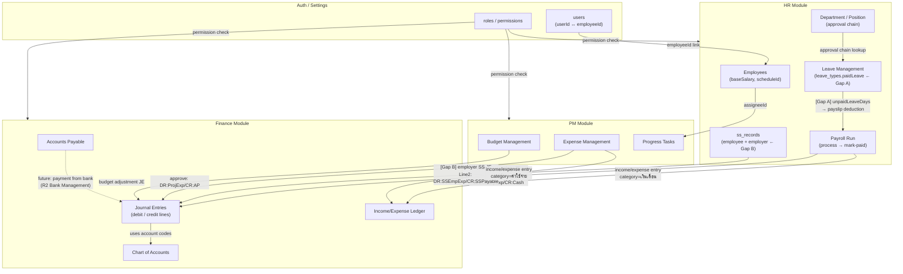

# Release 1 - Full Requirements Document

เอกสารนี้รวม feature ทั้งหมดของ Release 1 พร้อม detail ครบถ้วนในแบบ template มาตรฐาน
อ้างอิง SD_Flow: `Documents/SD_Flow/`
Traceability: `Documents/Release_1_traceability_mermaid.md`

---

## 1) เป้าหมาย Release 1

Release 1 วางรากฐาน ERP สำหรับ SME ไทย ครอบคลุม 4 โดเมนหลัก:

- **Auth + RBAC**: ระบบ authentication + granular permission control ระดับ API
- **HR**: จัดการพนักงาน, โครงสร้างองค์กร, การลา, payroll พร้อม SS + Tax
- **Finance**: AR invoices, Vendor, AP, accounting core (double-entry), cross-module auto-posting
- **PM**: Budget, Expense, Progress task tracking + Dashboard KPI
- **Settings**: User/Role/Permission management

**Target Users**: HR Admin, Finance Manager, PM Manager, Employee, super_admin
**Business Context**: Service-based SME ไทย — ทีมงานใช้ระบบ internal, ไม่มี self-registration

---

## 2) Features (Release 1)

---

### Feature 1.1: Auth + RBAC

#### Business Purpose
- **Authentication**: ป้องกันการเข้าใช้งานโดยไม่ได้รับอนุญาต — JWT-based login/logout/refresh
- **RBAC (Role-Based Access Control)**: ควบคุมสิทธิ์แบบละเอียดในระดับ `module:resource:action` ต่อ API
- **super_admin**: bypass permission checks ทั้งหมด ใช้สำหรับ system administrator
- Login response รวม permissions ทั้งหมดของ user เพื่อให้ FE ตัดสิน UI แสดงผล

#### DB Schema

**ตาราง `users`**
```sql
CREATE TABLE users (
  id            UUID PRIMARY KEY DEFAULT gen_random_uuid(),
  email         VARCHAR UNIQUE NOT NULL,
  passwordHash  VARCHAR NOT NULL,           -- bcrypt hash
  isActive      BOOLEAN DEFAULT TRUE,
  mustChangePassword BOOLEAN DEFAULT FALSE, -- force reset หลัง admin ตั้งรหัสผ่านเริ่มต้น
  lastLoginAt   TIMESTAMP,
  employeeId    UUID REFERENCES employees(id),  -- link to HR employee record
  createdAt     TIMESTAMP DEFAULT NOW(),
  updatedAt     TIMESTAMP
);
```

**ตาราง `roles`**
```sql
CREATE TABLE roles (
  id          UUID PRIMARY KEY DEFAULT gen_random_uuid(),
  name        VARCHAR UNIQUE NOT NULL,   -- 'super_admin', 'hr_admin', 'finance_manager'
  description VARCHAR,
  isSystem    BOOLEAN DEFAULT FALSE,     -- system roles ลบ/แก้ไม่ได้
  createdAt   TIMESTAMP DEFAULT NOW()
);
-- Seed roles: super_admin, hr_admin, finance_manager, pm_manager, employee
```

**ตาราง `permissions`**
```sql
CREATE TABLE permissions (
  id       UUID PRIMARY KEY DEFAULT gen_random_uuid(),
  module   VARCHAR NOT NULL,    -- hr, finance, pm, settings
  resource VARCHAR NOT NULL,    -- employee, invoice, budget, ...
  action   VARCHAR NOT NULL,    -- read, create, update, delete, approve
  code     VARCHAR UNIQUE NOT NULL  -- 'hr:employee:read', 'finance:invoice:create'
);
```

**ตาราง `role_permissions`**
```sql
CREATE TABLE role_permissions (
  roleId       UUID NOT NULL REFERENCES roles(id),
  permissionId UUID NOT NULL REFERENCES permissions(id),
  PRIMARY KEY (roleId, permissionId)
);
```

**ตาราง `user_roles`**
```sql
CREATE TABLE user_roles (
  userId UUID NOT NULL REFERENCES users(id),
  roleId UUID NOT NULL REFERENCES roles(id),
  PRIMARY KEY (userId, roleId)
);
```

**ตาราง `permission_audit_logs`**
```sql
CREATE TABLE permission_audit_logs (
  id           UUID PRIMARY KEY DEFAULT gen_random_uuid(),
  performedBy  UUID NOT NULL REFERENCES users(id),  -- ผู้ทำ action
  targetUserId UUID REFERENCES users(id),
  targetRoleId UUID REFERENCES roles(id),
  permissionId UUID REFERENCES permissions(id),
  action       VARCHAR NOT NULL,    -- 'grant' | 'revoke'
  createdAt    TIMESTAMP DEFAULT NOW()
);
```

#### API Endpoints

| Method | Path | คำอธิบาย |
|---|---|---|
| `POST` | `/api/auth/login` | Login ด้วย email/password → return JWT access + refresh token |
| `POST` | `/api/auth/logout` | Logout + invalidate refresh token |
| `POST` | `/api/auth/refresh` | Refresh access token ด้วย refresh token |
| `GET` | `/api/auth/me` | Get current user + employee info + permissions |
| `PATCH` | `/api/auth/me/password` | เปลี่ยนรหัสผ่านตัวเอง |

**Request Body (POST /login)**
```json
{ "email": "admin@company.com", "password": "P@ssw0rd" }
```

**Response Body (200 login)**
```json
{
  "data": {
    "accessToken": "eyJhbGci...",
    "refreshToken": "eyJhbGci...",
    "user": {
      "id": "usr_001",
      "email": "admin@company.com",
      "roles": ["hr_admin"],
      "permissions": ["hr:employee:read", "hr:employee:create"]
    }
  }
}
```

**Contract Lock Addendum (2026-04-16)**

**Request Body (POST /refresh)**
```json
{ "refreshToken": "eyJhbGci..." }
```

**Response Body (200 /refresh)**
```json
{
  "data": {
    "accessToken": "eyJhbGci...",
    "refreshToken": "eyJhbGci...",
    "expiresInSeconds": 900,
    "refreshExpiresInSeconds": 604800
  }
}
```

**Request Body (POST /logout)**
```json
{
  "refreshToken": "eyJhbGci...",
  "allDevices": false
}
```

**Response Body (200 /me)**
```json
{
  "data": {
    "user": {
      "id": "usr_001",
      "email": "admin@company.com",
      "isActive": true,
      "mustChangePassword": false
    },
    "roles": ["hr_admin"],
    "permissions": ["hr:employee:read", "hr:employee:create"],
    "employee": {
      "id": "emp_001",
      "employeeCode": "EMP-0001",
      "fullName": "สมหญิง ใจดี",
      "department": { "id": "dept_hr", "name": "HR" },
      "position": { "id": "pos_hr_manager", "name": "HR Manager" }
    }
  }
}
```

**Request Body (PATCH /me/password)**
```json
{
  "currentPassword": "InitialP@ssw0rd",
  "newPassword": "N3wP@ssw0rd",
  "confirmPassword": "N3wP@ssw0rd"
}
```

**Response Body (200 /me/password)**
```json
{
  "data": {
    "passwordChanged": true,
    "mustChangePassword": false
  },
  "message": "Password changed successfully"
}
```

#### Frontend Pages

| Path | คำอธิบาย |
|---|---|
| `/login` | ฟอร์ม email/password + session expired banner + redirect ไปหน้าแรกตาม role |

#### Business Rules
- JWT access token: หมดอายุ 15 นาที; refresh token: 7 วัน
- Refresh token rotation: ทุกครั้งที่ refresh สร้าง token ใหม่ + invalidate ของเก่า
- refresh token ต้องถูก persist ฝั่ง server ในรูป session record หรือ token hash เพื่อรองรับ rotation, logout invalidation และ force logout
- Password: bcrypt hash factor 12, minimum 8 ตัวอักษร
- `super_admin` bypass permission middleware ทุก endpoint
- Login fail 5 ครั้งติดต่อกัน → lock account ชั่วคราว (หรือ delay response)
- Route protection: FE redirect `/login` ถ้าไม่มี valid token; BE ส่ง 401 ถ้า token expired
- `users.mustChangePassword` เป็น source of truth เดียวของ first-login / forced password reset
- ถ้า `/api/auth/me` ตอบ `mustChangePassword=true` ให้ FE จำกัด route ที่เข้าได้เหลือเฉพาะ change-password flow จนกว่าจะเปลี่ยนรหัสผ่านสำเร็จ
- `POST /api/auth/logout` แบบ `allDevices=false` ต้อง invalidate current refresh session เท่านั้น; ถ้า `allDevices=true` หรือ user ถูก deactivate ให้ invalidate ทุก active refresh session ของ user นั้น
- `PATCH /api/auth/me/password` สำเร็จต้อง reset `mustChangePassword=false` และ revoke refresh sessions เดิมทั้งหมด
- `/api/auth/me` คือ bootstrap contract หลักของ FE หลัง login หรือ page reload; login response ใช้สำหรับ immediate redirect ส่วน state ระยะยาวต้องยึด `/me`

#### Integration
- Login response embed permissions list → FE ใช้ตัดสิน sidebar menu + button visibility
- `/me` ใช้โดย FE ทุก page load เพื่อตรวจสอบ session ยังใช้งานได้
- หน้า `/settings/users` ตั้งค่า `mustChangePassword` ตอนสร้างบัญชี และผลลัพธ์สุดท้ายต้องสะท้อนผ่าน `/api/auth/me`

---

### Feature 1.2: HR — Employee Management

#### Business Purpose
- เก็บข้อมูลพนักงานครบ: personal info, work info, financial info, social security
- HR Admin จัดการ CRUD + terminate; พนักงานดู profile ตัวเองได้
- Search/filter พนักงานตาม dept/position/status สำหรับ HR reporting

#### DB Schema

**ตาราง `employees`**
```sql
CREATE TABLE employees (
  id                UUID PRIMARY KEY DEFAULT gen_random_uuid(),
  employeeCode      VARCHAR UNIQUE NOT NULL,  -- EMP-0001 (auto-gen)
  firstName         VARCHAR NOT NULL,
  lastName          VARCHAR NOT NULL,
  email             VARCHAR UNIQUE NOT NULL,
  phone             VARCHAR,
  dateOfBirth       DATE,
  nationalId        VARCHAR,                  -- เลขบัตรประชาชน
  address           TEXT,
  hireDate          DATE NOT NULL,
  endDate           DATE,                     -- วันที่สิ้นสุดงาน (terminate)
  status            VARCHAR DEFAULT 'active',  -- active | inactive | terminated
  departmentId      UUID REFERENCES departments(id),
  positionId        UUID REFERENCES positions(id),
  baseSalary        DECIMAL(15,2) NOT NULL DEFAULT 0,
  bankAccountNo     VARCHAR,
  bankName          VARCHAR,
  socialSecurityNo  VARCHAR,                  -- เลขประกันสังคม
  taxId             VARCHAR,                  -- เลขผู้เสียภาษีส่วนบุคคล
  createdAt         TIMESTAMP DEFAULT NOW(),
  updatedAt         TIMESTAMP
);
```

#### API Endpoints

| Method | Path | คำอธิบาย |
|---|---|---|
| `GET` | `/api/hr/employees/me` | Employee self-profile (ใช้ authenticated userId) |
| `GET` | `/api/hr/employees` | List + search + filter + pagination |
| `GET` | `/api/hr/employees/:id` | Employee detail |
| `POST` | `/api/hr/employees` | สร้างพนักงานใหม่ |
| `PATCH` | `/api/hr/employees/:id` | แก้ไขข้อมูลพนักงาน |
| `DELETE` | `/api/hr/employees/:id` | Terminate พนักงาน (soft — set status=terminated + endDate) |

**Query Params (GET list)**: `page`, `limit`, `search` (name/code), `departmentId`, `positionId`, `status`, `hasUserAccount` (`true` \| `false` — optional; ใช้ช่วยหน้า `/settings/users` คัดพนักงานที่ยังไม่มีบัญชี login)

**Request Body (POST create)**
```json
{
  "employeeCode": "EMP-0101",
  "firstName": "สุดา",
  "lastName": "วงศ์ดี",
  "email": "suda@company.com",
  "phone": "0891112233",
  "departmentId": "dept_hr",
  "positionId": "pos_hr_staff",
  "hireDate": "2026-04-01",
  "baseSalary": 30000,
  "bankAccountNo": "1234567890",
  "bankName": "ธนาคารกสิกรไทย"
}
```

**Request Body (DELETE terminate)**
```json
{ "terminationDate": "2026-04-15", "reason": "Resignation" }
```

#### Frontend Pages

| Path | คำอธิบาย |
|---|---|
| `/hr/employees` | List: stats bar, search/filter, data table + pagination, link to create/edit/detail |
| `/hr/employees/new` | Create form: personal/work/financial tabs |
| `/hr/employees/:id` | Profile detail: sections (personal, work, financial) + terminate button |
| `/hr/employees/:id/edit` | Edit form: pre-fill จาก current data |

#### Business Rules
- `employeeCode` ต้อง unique; ถ้าไม่กรอก system auto-generate `EMP-{SEQ}`
- ไม่สามารถลบ (DELETE) พนักงานที่มี payroll run ที่ยัง active หรือ leave pending
- Terminate: set `endDate` + `status = terminated` — ไม่ลบข้อมูล
- ต้องมี `departmentId` + `positionId` ก่อน process payroll ได้

#### Integration
- `users.employeeId` link หา employee record เมื่อ login — การสร้างบัญชี login ทำที่ Feature 1.15 (`POST /api/settings/users`) หลังมี employee record
- Payroll: อ่าน `baseSalary`, `socialSecurityNo`, `taxId` สำหรับคำนวณ
- Leave: `departmentId` ใช้หา approver ตาม `leave_approval_configs`

---

### Feature 1.3: HR — Organization Management

#### Business Purpose
- จัดการโครงสร้างองค์กร: แผนก (Department) + ตำแหน่งงาน (Position)
- Department รองรับ parent-child hierarchy (nested departments)
- ใช้ใน: employee profile, leave approval routing, payroll grouping

#### DB Schema

**ตาราง `departments`**
```sql
CREATE TABLE departments (
  id          UUID PRIMARY KEY DEFAULT gen_random_uuid(),
  code        VARCHAR UNIQUE NOT NULL,    -- HR, FIN, PM, TECH
  name        VARCHAR NOT NULL,
  parentId    UUID REFERENCES departments(id),  -- parent department (nullable)
  managerId   UUID REFERENCES employees(id),     -- หัวหน้าแผนก
  createdAt   TIMESTAMP DEFAULT NOW(),
  updatedAt   TIMESTAMP
);
```

**ตาราง `positions`**
```sql
CREATE TABLE positions (
  id           UUID PRIMARY KEY DEFAULT gen_random_uuid(),
  code         VARCHAR UNIQUE NOT NULL,
  name         VARCHAR NOT NULL,
  departmentId UUID REFERENCES departments(id),
  level        VARCHAR,    -- junior | mid | senior | lead | manager
  createdAt    TIMESTAMP DEFAULT NOW(),
  updatedAt    TIMESTAMP
);
```

#### API Endpoints

| Method | Path | คำอธิบาย |
|---|---|---|
| `GET` | `/api/hr/departments` | List departments (รวม children info) |
| `GET` | `/api/hr/departments/:id` | Department detail |
| `POST` | `/api/hr/departments` | สร้าง department |
| `PATCH` | `/api/hr/departments/:id` | แก้ไข department |
| `DELETE` | `/api/hr/departments/:id` | ลบ department (ตรวจสอบก่อน) |
| `GET` | `/api/hr/positions` | List positions |
| `GET` | `/api/hr/positions/:id` | Position detail |
| `POST` | `/api/hr/positions` | สร้าง position |
| `PATCH` | `/api/hr/positions/:id` | แก้ไข position |
| `DELETE` | `/api/hr/positions/:id` | ลบ position (ตรวจสอบก่อน) |

#### Frontend Pages

| Path | คำอธิบาย |
|---|---|
| `/hr/organization` | สองส่วน: Departments list/form + Positions list/form ใน modal |

#### Business Rules
- ลบ department ไม่ได้ถ้ายังมีพนักงาน active อยู่
- ลบ position ไม่ได้ถ้ายังมีพนักงาน active อยู่
- Department `parentId` = null คือ root department
- `managerId` ต้องเป็น employee ที่ active เท่านั้น

#### Integration
- Employee create/edit: ดึง departments + positions สำหรับ dropdown
- Leave: `leave_approval_configs` ใช้ `departmentId` หา approver chain — **จัดการข้อมูล config ผ่าน API ใน Feature 1.4** (`/api/hr/leaves/approval-configs`)

---

### Feature 1.4: HR — Leave Management

#### Business Purpose
- พนักงานยื่นคำขอลา (ลาป่วย, ลาพักร้อน, ลากิจ, ลาคลอด, etc.)
- HR Admin / Manager อนุมัติหรือปฏิเสธ
- ระบบ track leave balance รายปีต่อพนักงานต่อประเภทการลา
- Approve อัตโนมัติ deduct leave balance

#### DB Schema

**ตาราง `leave_types`**
```sql
CREATE TABLE leave_types (
  id                UUID PRIMARY KEY DEFAULT gen_random_uuid(),
  name              VARCHAR NOT NULL,     -- ลาป่วย, ลาพักร้อน, ลากิจ
  code              VARCHAR UNIQUE NOT NULL,
  maxDaysPerYear    INT NOT NULL DEFAULT 0,
  paidLeave         BOOLEAN DEFAULT TRUE,    -- [Gap A] ลาได้รับค่าจ้างหรือไม่ — false = หักเงินจาก payroll
  carryOver         BOOLEAN DEFAULT FALSE,   -- โอนวันลาข้ามปีได้หรือไม่
  requireAttachment BOOLEAN DEFAULT FALSE,   -- ต้องแนบเอกสาร (เช่น ใบรับรองแพทย์)
  isActive          BOOLEAN DEFAULT TRUE
);
```

**ตาราง `leave_approval_configs`**
```sql
CREATE TABLE leave_approval_configs (
  id             UUID PRIMARY KEY DEFAULT gen_random_uuid(),
  departmentId   UUID REFERENCES departments(id),
  approverLevel  INT NOT NULL DEFAULT 1,  -- ลำดับชั้นการอนุมัติ
  approverId     UUID REFERENCES employees(id)
);
```

**ตาราง `leave_balances`**
```sql
CREATE TABLE leave_balances (
  id            UUID PRIMARY KEY DEFAULT gen_random_uuid(),
  employeeId    UUID NOT NULL REFERENCES employees(id),
  leaveTypeId   UUID NOT NULL REFERENCES leave_types(id),
  year          INT NOT NULL,
  allocated     DECIMAL(5,1) NOT NULL DEFAULT 0,  -- วันลาที่ได้รับทั้งหมด
  used          DECIMAL(5,1) DEFAULT 0,            -- วันลาที่ใช้ไปแล้ว
  remaining     DECIMAL(5,1) GENERATED ALWAYS AS (allocated - used) STORED,
  UNIQUE (employeeId, leaveTypeId, year)
);
```

**ตาราง `leave_requests`**
```sql
CREATE TABLE leave_requests (
  id             UUID PRIMARY KEY DEFAULT gen_random_uuid(),
  employeeId     UUID NOT NULL REFERENCES employees(id),
  leaveTypeId    UUID NOT NULL REFERENCES leave_types(id),
  startDate      DATE NOT NULL,
  endDate        DATE NOT NULL,
  days           DECIMAL(5,1) NOT NULL,
  reason         TEXT,
  status         VARCHAR DEFAULT 'pending',  -- pending | approved | rejected
  approverId     UUID REFERENCES employees(id),
  approvedAt     TIMESTAMP,
  rejectedAt     TIMESTAMP,
  rejectReason   TEXT,
  attachmentUrl  VARCHAR,
  createdAt      TIMESTAMP DEFAULT NOW()
);
```

#### API Endpoints

**ประเภทการลา (master — `hr_admin`)**

| Method | Path | คำอธิบาย |
|---|---|---|
| `GET` | `/api/hr/leaves/types` | List leave types (default: เฉพาะ `isActive=true` unless `includeInactive`) |
| `POST` | `/api/hr/leaves/types` | สร้างประเภทการลา |
| `PATCH` | `/api/hr/leaves/types/:id` | แก้ไขฟิลด์ (รวม `isActive` สำหรับ soft-disable) |

**โควต้าการลา (`leave_balances`)**

| Method | Path | คำอธิบาย |
|---|---|---|
| `GET` | `/api/hr/leaves/balances` | List balances (filter: `employeeId`, `year`, `leaveTypeId`, pagination) |
| `POST` | `/api/hr/leaves/balances` | สร้างแถว balance ต่อพนักงาน/ประเภท/ปี (ถ้ายังไม่มี) |
| `PATCH` | `/api/hr/leaves/balances/:id` | ปรับ **`allocated`** เท่านั้นฝั่ง HR (`used` อัปเดตผ่าน workflow อนุมัติเท่านั้น) |
| `POST` | `/api/hr/leaves/balances/bulk-allocate` | จัดสรรจำนวนวันเริ่มต้นหลายพนักงาน/หลายประเภท (เช่นต้นปีหรือพนักงานใหม่) |

**สายอนุมัติตามแผนก (`leave_approval_configs`)**

| Method | Path | คำอธิบาย |
|---|---|---|
| `GET` | `/api/hr/leaves/approval-configs` | List (filter: `departmentId`) |
| `POST` | `/api/hr/leaves/approval-configs` | สร้างแถว config |
| `PATCH` | `/api/hr/leaves/approval-configs/:id` | แก้ `approverLevel` / `approverId` / `departmentId` |
| `DELETE` | `/api/hr/leaves/approval-configs/:id` | ลบแถว config (non-cascade ต่อคำขอลาที่มีอยู่ — คำขอเดิมยังคงประวัติตาม snapshot ขณะสร้างหรือตามกฎ BE) |

**คำขอลา**

| Method | Path | คำอธิบาย |
|---|---|---|
| `GET` | `/api/hr/leaves` | List leave requests (filter: employee, status, date) |
| `POST` | `/api/hr/leaves` | สร้างคำขอลา |
| `PATCH` | `/api/hr/leaves/:id/approve` | อนุมัติคำขอลา |
| `PATCH` | `/api/hr/leaves/:id/reject` | ปฏิเสธคำขอลา |

**Query Params (GET list requests)**: `page`, `limit`, `employeeId`, `status`, `leaveTypeId`, `dateFrom`, `dateTo`

**Query Params (GET types)**: `includeInactive` (optional boolean)

**Query Params (GET balances)**: `page`, `limit`, `employeeId`, `year`, `leaveTypeId`

**Request Body (POST create)**
```json
{
  "leaveTypeId": "lt_sick",
  "startDate": "2026-04-20",
  "endDate": "2026-04-22",
  "days": 3,
  "reason": "ไม่สบาย มีไข้",
  "attachmentUrl": "https://cdn.example.com/hr/leaves/medical-cert-2026-04-20.pdf"
}
```

**Response Addendum (POST /api/hr/leaves, GET /api/hr/leaves, GET /api/hr/leaves/:id ถ้ามี detail route เพิ่มใน SD)**
```json
{
  "data": {
    "id": "leave_001",
    "status": "pending",
    "attachmentUrl": "https://cdn.example.com/hr/leaves/medical-cert-2026-04-20.pdf",
    "approvalConfigStatus": "configured",
    "approverPreview": [
      {
        "approverLevel": 1,
        "approverId": "emp_mgr_001",
        "approverName": "ผู้จัดการฝ่าย HR",
        "status": "pending"
      }
    ]
  }
}
```

#### Frontend Pages

| Path | คำอธิบาย |
|---|---|
| `/hr/leaves` | แท็บ/ส่วน: คำขอลา (ฟอร์ม + ตาราง + filter + approve/reject) + **โควต้าการลา (HR)** + **ประเภทการลา (HR)** + **สายอนุมัติตามแผนก (HR)** — โครงเดียวกันหรือแยก sub-route ตาม implementation |

#### Business Rules
- ตรวจ `leave_balances.remaining >= requested days` ก่อน approve (ถ้าไม่มีแถว balance สำหรับปี/ประเภทนั้น → ปฏิเสธหรือบังคับสร้างก่อน — ระบุชัดใน BE; แนะนำตอบ 409 พร้อมข้อความให้ HR allocate)
- Approve: UPDATE `leave_balances.used += days` + UPDATE status = approved — **`used` ไม่ให้ HR แก้ตรง ๆ ผ่าน PATCH balance** เพื่อความสอดคล้องกับ `remaining` ที่คำนวณจาก DB
- Reject: ไม่เปลี่ยน balance
- พนักงานดูได้เฉพาะ leave ของตัวเอง; HR Admin ดูได้ทุกคน
- ลาย้อนหลังได้แต่ต้องกรอก reason
- CRUD ประเภทการลา / balances / approval-configs: **`hr_admin`** (หรือ permission เทียบเท่า); การแก้ `paidLeave`, `carryOver`, `requireAttachment` มีผลต่อ payroll และฟอร์มแนบเอกสาร
- `leave_approval_configs`: คู่ `(departmentId, approverLevel)` ต้องไม่ซ้ำ; `approverId` ต้องเป็น employee ที่ active
- ถ้า `leave_types.requireAttachment = true` และไม่มี `attachmentUrl` ให้ตอบ `422`
- attachment ของ leave request ต้องถูก retain ไว้อย่างน้อย 2 ปีหลังคำขอเข้าสถานะสุดท้าย (`approved` / `rejected`) และถือเป็นส่วนหนึ่งของ HR record; ผู้ยื่นไม่สามารถลบไฟล์เองหลัง submit สำเร็จ
- สิทธิ์ดู attachment จำกัดที่ requester, approver ในสายอนุมัติ, HR Admin และผู้ตรวจสอบที่มีสิทธิ์เท่านั้น
- `approverPreview` เป็น read model มาตรฐานของ FE: ถ้า resolve สายอนุมัติได้ให้คืนรายการตามลำดับ; ถ้ายังไม่มี config ให้คืน `approvalConfigStatus = 'unconfigured'` และ `approverPreview = []`

---

### Feature 1.5: HR — Payroll

#### Business Purpose
- คำนวณเงินเดือนพนักงานรายเดือน รองรับทั้ง base salary + allowances + deductions
- คิดภาษีหัก ณ ที่จ่าย (withholding tax) + ประกันสังคม (SS) อัตโนมัติ
- Workflow: สร้าง run → process → approve → mark-paid
- mark-paid trigger auto-post journal entry เข้า Finance

#### DB Schema

**ตาราง `payroll_configs`**
```sql
CREATE TABLE payroll_configs (
  id        UUID PRIMARY KEY DEFAULT gen_random_uuid(),
  key       VARCHAR UNIQUE NOT NULL,   -- 'ss_employee_rate', 'ss_employer_rate', etc.
  value     VARCHAR NOT NULL,
  updatedAt TIMESTAMP
);
-- Seed: ss_employee_rate=5, ss_employer_rate=5, ss_max_base=15000
```

**ตาราง `allowance_types`**
```sql
CREATE TABLE allowance_types (
  id       UUID PRIMARY KEY DEFAULT gen_random_uuid(),
  name     VARCHAR NOT NULL,
  code     VARCHAR UNIQUE NOT NULL,
  taxable  BOOLEAN DEFAULT TRUE,   -- นำรวมคำนวณภาษีหรือไม่
  isActive BOOLEAN DEFAULT TRUE
);
```

**ตาราง `payroll_runs`**
```sql
CREATE TABLE payroll_runs (
  id               UUID PRIMARY KEY DEFAULT gen_random_uuid(),
  runNo            VARCHAR UNIQUE NOT NULL,   -- PR-2026-04
  periodMonth      INT NOT NULL,              -- 1-12
  periodYear       INT NOT NULL,
  payDate          DATE,
  status           VARCHAR DEFAULT 'draft',   -- draft | processed | approved | paid
  totalGross       DECIMAL(15,2) DEFAULT 0,
  totalDeductions  DECIMAL(15,2) DEFAULT 0,
  totalNet         DECIMAL(15,2) DEFAULT 0,
  createdBy        UUID REFERENCES users(id),
  approvedBy       UUID REFERENCES users(id),
  approvedAt       TIMESTAMP,
  paidAt           TIMESTAMP,
  paymentReference VARCHAR,
  UNIQUE (periodMonth, periodYear)           -- 1 run ต่อ 1 เดือน
);
```

**ตาราง `payslips`**
```sql
CREATE TABLE payslips (
  id            UUID PRIMARY KEY DEFAULT gen_random_uuid(),
  payrollRunId  UUID NOT NULL REFERENCES payroll_runs(id),
  employeeId    UUID NOT NULL REFERENCES employees(id),
  grossSalary   DECIMAL(15,2) NOT NULL,
  totalDeductions DECIMAL(15,2) NOT NULL DEFAULT 0,
  netSalary     DECIMAL(15,2) NOT NULL,
  status        VARCHAR DEFAULT 'draft',  -- draft | paid
  UNIQUE (payrollRunId, employeeId)
);
```

**ตาราง `payslip_items`**
```sql
CREATE TABLE payslip_items (
  id         UUID PRIMARY KEY DEFAULT gen_random_uuid(),
  payslipId  UUID NOT NULL REFERENCES payslips(id),
  type       VARCHAR NOT NULL,        -- 'income' | 'deduction'
  code       VARCHAR NOT NULL,        -- 'BASE_SALARY', 'SS', 'WHT', 'ALLOWANCE_TRANSPORT'
  description VARCHAR NOT NULL,
  amount     DECIMAL(15,2) NOT NULL
);
```

**ตาราง `employee_tax_settings`**
```sql
CREATE TABLE employee_tax_settings (
  id                 UUID PRIMARY KEY DEFAULT gen_random_uuid(),
  employeeId         UUID UNIQUE NOT NULL REFERENCES employees(id),
  taxYear            INT NOT NULL,
  withholdingMethod  VARCHAR DEFAULT 'standard',  -- actual | standard
  personalAllowances DECIMAL(15,2) DEFAULT 60000,
  maritalStatus      VARCHAR DEFAULT 'single'
);
```

**ตาราง `ss_records`** (ประกันสังคม)
```sql
CREATE TABLE ss_records (
  id                   UUID PRIMARY KEY DEFAULT gen_random_uuid(),
  employeeId           UUID NOT NULL REFERENCES employees(id),
  payrollRunId         UUID NOT NULL REFERENCES payroll_runs(id),
  baseAmount           DECIMAL(15,2) NOT NULL,    -- ฐานคำนวณ SS (max 15,000)
  employeeRate         DECIMAL(5,2) DEFAULT 5.00,
  employerRate         DECIMAL(5,2) DEFAULT 5.00,
  employeeContribution DECIMAL(15,2) NOT NULL,
  employerContribution DECIMAL(15,2) NOT NULL
);
```

**ตาราง `ss_submissions`** (บันทึกการนำส่ง SS)
```sql
CREATE TABLE ss_submissions (
  id             UUID PRIMARY KEY DEFAULT gen_random_uuid(),
  payrollRunId   UUID NOT NULL REFERENCES payroll_runs(id),
  submittedDate  DATE,
  totalEmployee  DECIMAL(15,2),
  totalEmployer  DECIMAL(15,2),
  totalAmount    DECIMAL(15,2),
  status         VARCHAR DEFAULT 'pending'   -- pending | submitted | confirmed
);
```

#### API Endpoints

| Method | Path | คำอธิบาย |
|---|---|---|
| `POST` | `/api/hr/payroll/runs` | สร้าง payroll run ใหม่ (status=draft) |
| `GET` | `/api/hr/payroll/runs` | List payroll runs + filter |
| `POST` | `/api/hr/payroll/runs/:runId/process` | คำนวณ payslip ทุกคน → status=processed |
| `GET` | `/api/hr/payroll/runs/:runId` | อ่านสถานะ run ล่าสุด (ใช้ polling เมื่อ process เป็น async) |
| `POST` | `/api/hr/payroll/runs/:runId/approve` | อนุมัติ run → status=approved |
| `POST` | `/api/hr/payroll/runs/:runId/mark-paid` | ยืนยันจ่ายจริง → status=paid + trigger Finance post |
| `GET` | `/api/hr/payroll/runs/:runId/payslips` | List payslips ใน run |
| `GET` | `/api/hr/payroll` | Payroll summary list (all runs) |
| `GET` | `/api/hr/payroll/configs` | List payroll config keys (`ss_employee_rate`, `ss_employer_rate`, `ss_max_base`) |
| `PATCH` | `/api/hr/payroll/configs/:key` | Update payroll config value (มีผลกับการ process ครั้งถัดไป) |
| `GET` | `/api/hr/payroll/allowance-types` | List allowance types |
| `POST` | `/api/hr/payroll/allowance-types` | Create allowance type |
| `PATCH` | `/api/hr/payroll/allowance-types/:id` | Update allowance type (`name`,`taxable`) |
| `PATCH` | `/api/hr/payroll/allowance-types/:id/activate` | Toggle allowance type active/inactive |
| `GET` | `/api/hr/payroll/tax-settings` | List employee tax settings (filter by employeeId/taxYear) |
| `PATCH` | `/api/hr/payroll/tax-settings/:employeeId` | Upsert employee tax settings for tax year |

**Payroll Calculation Logic (process step)**:
```
For each active employee:
  grossSalary     = baseSalary + taxable allowances
  ssBase          = min(baseSalary, 15000)
  ssEmployee      = ssBase × 5%
  ssEmployer      = ssBase × 5%                          -- [Gap B] บันทึกไว้สำหรับ journal เข้า Finance
  wht             = calculate_withholding_tax(grossSalary, employee_tax_settings)

  -- [Gap A] Unpaid Leave Deduction
  unpaidLeaveDays = SUM(leave_requests.days)
                    WHERE employeeId = this
                      AND period overlaps payPeriod
                      AND leaveType.paidLeave = false
                      AND status = 'approved'
  unpaidDeduction = (baseSalary / scheduledWorkingDays) × unpaidLeaveDays

  netSalary       = grossSalary - ssEmployee - wht - unpaidDeduction

  → INSERT payslips + payslip_items
      (BASE_SALARY, SS_EMPLOYEE, WHT, UNPAID_LEAVE_DEDUCTION, each allowance)
  → INSERT ss_records (employeeContribution, employerContribution)
```

**Response Body (POST /api/hr/payroll/runs/:runId/process)**
```json
{
  "data": {
    "runId": "pr_2026_04",
    "status": "processed",
    "processedCount": 40,
    "warnings": [
      {
        "code": "MISSING_ALLOWANCE_MASTER",
        "message": "ไม่พบ allowance master ที่ active ระบบจะคำนวณจาก base salary เท่านั้น",
        "severity": "warning"
      },
      {
        "code": "DEFAULT_TAX_SETTINGS_USED",
        "message": "ใช้ค่า default tax settings แทน employee-specific settings",
        "employeeId": "emp_002",
        "severity": "info"
      }
    ],
    "skippedEmployees": [
      {
        "employeeId": "emp_003",
        "employeeCode": "EMP-0003",
        "reasonCode": "MISSING_POSITION",
        "reasonMessage": "พนักงานยังไม่มี position จึงไม่สามารถคำนวณ payroll ได้"
      }
    ]
  }
}
```

**Async processing contract (ถ้า process ใช้ async mode)**
- request body ต้องมี `confirmProcess`
- response ต้องมี `jobId` เมื่อยังประมวลผลไม่เสร็จ
- FE ต้อง poll `GET /api/hr/payroll/runs/:runId` จนได้สถานะสุดท้ายของ run
- approve response ต้องมี pre-check summary (`warningCount`, `errorCount`)
- mark-paid request รองรับ `paidAt` ตาม policy การปิดบัญชี

#### Frontend Pages

| Path | คำอธิบาย |
|---|---|
| `/hr/payroll` | Create run form + runs table + payslips table per run + workflow actions |
| `/hr/payroll/configs` | จัดการ payroll config, allowance types และ employee tax settings |

#### Business Rules
- 1 run ต่อ 1 period เดือน/ปี (`UNIQUE periodMonth, periodYear`)
- ลำดับ status: draft → processed → approved → paid (ข้ามไม่ได้)
- Process ทับซ้ำได้ถ้ายัง draft/processed (overwrite=true)
- mark-paid → trigger `POST /api/finance/integrations/payroll/:runId/post`
- ก่อน process ต้องมี payroll config keys ครบ (`ss_employee_rate`, `ss_employer_rate`, `ss_max_base`) หากไม่ครบให้ block พร้อม error message ที่แก้ได้จากหน้า config
- allowance ที่นำมาคิด gross ต้องมาจาก `allowance_types.isActive = true`; ถ้าไม่มี allowance master ให้ process ต่อได้โดยใช้ base salary + แจ้ง warning ว่าไม่มี allowance active
- การคำนวณ WHT ต้องอ่าน `employee_tax_settings` ตาม `employeeId + taxYear`; ถ้าไม่มี record ให้ fallback ค่า default ตาม schema และแจ้งสถานะว่าใช้ default
- การแก้ payroll configs มีผลกับ payroll run ที่ process หลังจากเวลาอัปเดตเท่านั้น (ไม่ย้อนแก้ run ที่ paid แล้ว)
- **[Gap A] Unpaid Leave**: `leave_types.paidLeave = false` + `leave_requests.status = approved` ใน period → deduct อัตโนมัติใน payslip
  - อัตราหัก = `(baseSalary / scheduledWorkingDays) × unpaidLeaveDays`
  - INSERT payslip_items: `{ type: 'deduction', code: 'UNPAID_LEAVE_DEDUCTION', amount: unpaidDeduction }`
- **[Gap B] SS Employer**: ยอด employer contribution ต้อง auto-post เข้า Finance ด้วย (แยกจาก salary journal)
  - `ss_records.employerContribution` — บันทึกแล้ว ต้องเพิ่ม journal line ในขั้นตอน mark-paid
- `warnings[].severity` lock เป็น `info | warning | blocking`
- `warnings[]` ต้องใช้สำหรับ issue ที่ยัง process ต่อได้; ถ้าเป็น `blocking` ต้องไม่ใส่ใน `skippedEmployees` พร้อมกันสำหรับ employee เดียวกัน
- `skippedEmployees[]` ใช้เฉพาะพนักงานที่ process รอบนั้นไม่สำเร็จและไม่ถูกสร้าง payslip; ต้องมี `employeeId`, `employeeCode`, `reasonCode`, `reasonMessage` ครบทุกครั้ง

#### Integration
- **[Gap A] Leave → Payroll**: process step ดึง `leave_requests` ที่ `leaveType.paidLeave = false` + approved + อยู่ใน period
  - คำนวณ `unpaidDeduction` → INSERT payslip_items (UNPAID_LEAVE_DEDUCTION)
- **[Gap B] SS Employer → Finance**: mark-paid → journal entry เพิ่มบรรทัด
  - `DR: SS Employer Expense (6200) / CR: SS Payable (2300)`
  - ยอด = `SUM(ss_records.employerContribution)` ทั้ง run
- **Finance Auto-Post (Salary)**: mark-paid → `POST /api/finance/integrations/payroll/:runId/post`
  - Journal Line 1: `DR: Salary Expense (5100) / CR: Cash or Accrued Payroll (1000/2100)`
  - Journal Line 2 **[Gap B]**: `DR: SS Employer Expense (6200) / CR: SS Payable (2300)`
  - Income/Expense entry: category = เงินเดือน
- **(R2)**: integrate กับ `attendance_records` สำหรับพนักงานรายวัน + OT (ดู Release_2.md Feature 3.7)

---

### Feature 1.6: Finance — Invoice (AR)

#### Business Purpose
- สร้างใบแจ้งหนี้ขาย (AR Invoice) ส่งให้ลูกค้า
- รายการ line items: description, quantity, unit price, tax rate
- Track status: draft → sent → paid / overdue
- Customer list ใช้สำหรับ dropdown ตอนสร้าง invoice (Customer Full CRUD เพิ่มใน R2)

#### DB Schema

**ตาราง `customers`** (มีอยู่แล้ว — จะ extend ใน R2)
```sql
CREATE TABLE customers (
  id          UUID PRIMARY KEY DEFAULT gen_random_uuid(),
  name        VARCHAR NOT NULL,
  taxId       VARCHAR,
  creditLimit DECIMAL(15,2) DEFAULT 0,
  createdAt   TIMESTAMP DEFAULT NOW()
  -- R2 additions: code, address, contactName, phone, email, creditTermDays, isActive, deletedAt
);
```

**ตาราง `invoices`**
```sql
CREATE TABLE invoices (
  id           UUID PRIMARY KEY DEFAULT gen_random_uuid(),
  invoiceNo    VARCHAR UNIQUE NOT NULL,  -- INV-2026-0001 (auto-gen)
  customerId   UUID NOT NULL REFERENCES customers(id),
  issueDate    DATE NOT NULL,
  dueDate      DATE NOT NULL,
  status       VARCHAR DEFAULT 'draft',  -- draft | sent | paid | overdue | voided
  totalAmount  DECIMAL(15,2) NOT NULL DEFAULT 0,
  notes        TEXT,
  createdBy    UUID REFERENCES users(id),
  createdAt    TIMESTAMP DEFAULT NOW(),
  updatedAt    TIMESTAMP
  -- R2 additions: paidAmount, balanceDue, sentAt, subtotalBeforeVat, vatAmount, soId
);
```

**ตาราง `invoice_items`**
```sql
CREATE TABLE invoice_items (
  id          UUID PRIMARY KEY DEFAULT gen_random_uuid(),
  invoiceId   UUID NOT NULL REFERENCES invoices(id),
  description VARCHAR NOT NULL,
  quantity    DECIMAL(15,3) NOT NULL,
  unitPrice   DECIMAL(15,2) NOT NULL,
  lineTotal   DECIMAL(15,2) NOT NULL,   -- quantity × unitPrice
  taxRate     DECIMAL(5,2) DEFAULT 0    -- % VAT (0 หรือ 7)
  -- R2 additions: vatAmount per item
);
```

#### API Endpoints

| Method | Path | คำอธิบาย |
|---|---|---|
| `GET` | `/api/finance/customers` | List customers (สำหรับ dropdown — read only) |
| `GET` | `/api/finance/invoices` | List invoices + filter + pagination |
| `POST` | `/api/finance/invoices` | สร้าง invoice พร้อม line items |
| `GET` | `/api/finance/invoices/:id` | Invoice detail + items + customer |

**Query Params (GET list)**: `page`, `limit`, `search`, `status`, `customerId`, `issueDateFrom`, `issueDateTo`

**Request Body (POST)**
```json
{
  "customerId": "cus_001",
  "issueDate": "2026-04-10",
  "dueDate": "2026-04-25",
  "notes": "April service fee",
  "items": [
    {
      "description": "Monthly IT service",
      "quantity": 1,
      "unitPrice": 15000,
      "taxRate": 7
    }
  ]
}
```

#### Frontend Pages

| Path | คำอธิบาย |
|---|---|
| `/finance/invoices` | List table + search/filter + link to create/detail |
| `/finance/invoices/new` | Header form + dynamic line items table |
| `/finance/invoices/:id` | Detail: header + items + totals |

#### Business Rules
- `invoiceNo` auto-generate: `INV-{YEAR}-{SEQ:4}`
- `lineTotal` = quantity × unitPrice
- `totalAmount` = sum of lineTotals + tax amounts
- ไม่สามารถแก้ไข invoice ที่ status = sent/paid/voided

#### Known Gaps (แก้ไขใน R2)
- Customer Full CRUD: ปัจจุบันมีแค่ `GET /customers` ไม่มี create/edit/delete
- AR Payment Tracking: ยังไม่มีบันทึกการรับชำระเงิน
- VAT computation: `taxRate` มีใน schema แต่ยังไม่ครบถ้วน

---

### Feature 1.7: Finance — Vendor Management

#### Business Purpose
- เก็บข้อมูล Vendor/Supplier ของบริษัท
- ใช้ใน AP (Accounts Payable) เมื่อบันทึกใบแจ้งหนี้จากผู้ขาย
- Activate/Deactivate vendor โดยไม่ลบข้อมูล

#### DB Schema

**ตาราง `vendors`**
```sql
CREATE TABLE vendors (
  id               UUID PRIMARY KEY DEFAULT gen_random_uuid(),
  code             VARCHAR UNIQUE NOT NULL,  -- VEND-001
  name             VARCHAR NOT NULL,
  taxId            VARCHAR,
  address          TEXT,
  contactName      VARCHAR,
  phone            VARCHAR,
  email            VARCHAR,
  paymentTermDays  INT DEFAULT 30,   -- เทอมการชำระ (วัน)
  isActive         BOOLEAN DEFAULT TRUE,
  deletedAt        TIMESTAMP,        -- soft delete
  createdAt        TIMESTAMP DEFAULT NOW(),
  updatedAt        TIMESTAMP
);
```

#### API Endpoints

| Method | Path | คำอธิบาย |
|---|---|---|
| `GET` | `/api/finance/vendors/options` | Dropdown list (active vendors only) |
| `GET` | `/api/finance/vendors` | List vendors + search + filter + pagination |
| `GET` | `/api/finance/vendors/:id` | Vendor detail |
| `POST` | `/api/finance/vendors` | สร้าง vendor |
| `PATCH` | `/api/finance/vendors/:id` | แก้ไขข้อมูล vendor |
| `PATCH` | `/api/finance/vendors/:id/activate` | Toggle active/inactive |
| `DELETE` | `/api/finance/vendors/:id` | Soft delete (set deletedAt) |

**Query Params (GET list)**: `page`, `limit`, `search` (code/name/taxId), `isActive`

#### Frontend Pages

| Path | คำอธิบาย |
|---|---|
| `/finance/vendors` | Searchable/sortable table + active state toggle + delete |
| `/finance/vendors/new` | Create form |
| `/finance/vendors/:id/edit` | Edit form |

#### Business Rules
- `code` ต้อง unique; ถ้าว่าง auto-generate `VEND-{SEQ}`
- Soft delete: ตั้ง `deletedAt` — ข้อมูลยังคงอยู่ใน DB
- Deactivated vendor ไม่แสดงใน `/options` dropdown
- ลบไม่ได้ถ้ามี AP bill ที่ยัง open (status != paid/rejected)

---

### Feature 1.8: Finance — Accounts Payable (AP)

#### Business Purpose
- บันทึกใบแจ้งหนี้ที่ได้รับจาก vendor (AP Bill)
- Workflow: draft → submitted → approved → paid (partial payment รองรับ)
- ป้องกันการจ่ายซ้ำ: ตรวจ `paidAmount` vs `totalAmount`
- Inline create vendor ถ้ายังไม่มีใน system

#### DB Schema

**ตาราง `finance_ap_bills`**
```sql
CREATE TABLE finance_ap_bills (
  id               UUID PRIMARY KEY DEFAULT gen_random_uuid(),
  documentNo       VARCHAR UNIQUE NOT NULL,  -- AP-2026-0001
  vendorId         UUID NOT NULL REFERENCES vendors(id),
  vendorInvoiceNo  VARCHAR,          -- เลขที่ใบแจ้งหนี้ของ vendor
  invoiceDate      DATE NOT NULL,
  dueDate          DATE NOT NULL,
  status           VARCHAR DEFAULT 'draft',
  -- draft | submitted | approved | rejected | paid | partially_paid
  totalAmount      DECIMAL(15,2) NOT NULL DEFAULT 0,
  paidAmount       DECIMAL(15,2) DEFAULT 0,
  notes            TEXT,
  createdBy        UUID REFERENCES users(id),
  approvedBy       UUID REFERENCES users(id),
  approvedAt       TIMESTAMP,
  createdAt        TIMESTAMP DEFAULT NOW(),
  updatedAt        TIMESTAMP
  -- R2 additions: vatAmount, whtAmount, netPayable, poId, bankAccountId
);
```

**ตาราง `finance_ap_vendor_invoice_items`**
```sql
CREATE TABLE finance_ap_vendor_invoice_items (
  id          UUID PRIMARY KEY DEFAULT gen_random_uuid(),
  billId      UUID NOT NULL REFERENCES finance_ap_bills(id),
  description VARCHAR NOT NULL,
  quantity    DECIMAL(15,3) NOT NULL,
  unitPrice   DECIMAL(15,2) NOT NULL,
  lineTotal   DECIMAL(15,2) NOT NULL
);
```

**ตาราง `finance_ap_vendor_invoice_payments`**
```sql
CREATE TABLE finance_ap_vendor_invoice_payments (
  id            UUID PRIMARY KEY DEFAULT gen_random_uuid(),
  billId        UUID NOT NULL REFERENCES finance_ap_bills(id),
  paymentDate   DATE NOT NULL,
  amount        DECIMAL(15,2) NOT NULL,
  paymentMethod VARCHAR,    -- bank_transfer | cash | cheque | other
  referenceNo   VARCHAR,
  notes         TEXT,
  createdAt     TIMESTAMP DEFAULT NOW()
  -- R2 additions: bankAccountId
);
```

#### API Endpoints

| Method | Path | คำอธิบาย |
|---|---|---|
| `GET` | `/api/finance/ap/vendor-invoices` | List AP bills + filter |
| `GET` | `/api/finance/ap/vendor-invoices/:id` | Detail + items + payment history |
| `POST` | `/api/finance/ap/vendor-invoices` | สร้าง AP bill |
| `PATCH` | `/api/finance/ap/vendor-invoices/:id/status` | เปลี่ยน status (approve/reject) |
| `POST` | `/api/finance/ap/vendor-invoices/:id/payments` | บันทึกการจ่ายเงิน |

**Query Params (GET list)**: `page`, `limit`, `search`, `status`, `vendorId`, `invoiceDateFrom`, `invoiceDateTo`

**Request Body (POST create)**
```json
{
  "vendorId": "ven_001",
  "vendorInvoiceNo": "V-INV-778",
  "invoiceDate": "2026-04-05",
  "dueDate": "2026-05-05",
  "notes": "Office supplies April",
  "items": [
    { "description": "Printer supplies", "quantity": 10, "unitPrice": 1200 }
  ]
}
```

**Request Body (POST payment)**
```json
{
  "paymentDate": "2026-04-20",
  "amount": 4000,
  "paymentMethod": "bank_transfer",
  "referenceNo": "BANK-REF-001"
}
```

**Read Model Contract (GET /api/finance/ap/vendor-invoices, GET /api/finance/ap/vendor-invoices/:id)**
```json
{
  "data": {
    "id": "ap_001",
    "documentNo": "AP-2026-0001",
    "status": "approved",
    "paidAmount": 4000,
    "remainingAmount": 8000,
    "paymentCount": 1,
    "statusSummary": {
      "documentStatus": "approved",
      "paymentStatus": "partially_paid",
      "isOverdue": false,
      "lastPaymentDate": "2026-04-20"
    }
  }
}
```

#### Frontend Pages

| Path | คำอธิบาย |
|---|---|
| `/finance/ap` | Create form inline + AP table + status/payment actions + inline vendor create |

#### Business Rules
- `documentNo` auto-generate: `AP-{YEAR}-{SEQ:4}`
- เพิ่ม payment ได้เฉพาะ status = approved
- payment amount ≤ `totalAmount - paidAmount` (remaining balance)
- ถ้า `paidAmount >= totalAmount` → UPDATE status = paid
- ถ้า `0 < paidAmount < totalAmount` → status = partially_paid
- AP page `/finance/ap` ใช้ `/api/finance/vendors/options` + inline create vendor ได้
- `paidAmount = SUM(finance_ap_vendor_invoice_payments.amount)` ต่อ bill
- `remainingAmount = totalAmount - paidAmount`
- `paymentCount = COUNT(finance_ap_vendor_invoice_payments.id)` ต่อ bill
- `statusSummary.documentStatus` ใช้ค่าเดียวกับ `finance_ap_bills.status`
- `statusSummary.paymentStatus` คำนวณจาก `paidAmount` เทียบ `totalAmount` เป็น `unpaid | partially_paid | paid`
- `statusSummary.isOverdue = true` เมื่อ `dueDate < today` และ `remainingAmount > 0`
- `statusSummary.lastPaymentDate` ใช้วันที่ payment ล่าสุด หรือ `null` ถ้ายังไม่จ่าย

---

### Feature 1.9: Finance — Accounting Core

#### Business Purpose
- **Chart of Accounts**: ผังบัญชีมาตรฐาน double-entry สำหรับบริษัท
- **Journal Entries**: บันทึกรายการบัญชีแบบ debit/credit; post/reverse
- **Income/Expense Ledger**: บันทึกรายรับ/รายจ่ายแบบง่าย + monthly summary
- **Cross-module Auto-Post**: HR payroll mark-paid + PM expense approved → สร้าง journal entry อัตโนมัติ
- เก็บ `sourceModule`, `sourceType`, `sourceId` เพื่อ trace back ไปเอกสารต้นทาง

#### DB Schema

**ตาราง `chart_of_accounts`**
```sql
CREATE TABLE chart_of_accounts (
  id        UUID PRIMARY KEY DEFAULT gen_random_uuid(),
  code      VARCHAR UNIQUE NOT NULL,   -- 1000-Cash, 5100-SalaryExpense
  name      VARCHAR NOT NULL,
  type      VARCHAR NOT NULL,          -- asset | liability | equity | income | expense
  parentId  UUID REFERENCES chart_of_accounts(id),
  isActive  BOOLEAN DEFAULT TRUE,
  createdAt TIMESTAMP DEFAULT NOW()
);
```

**ตาราง `journal_entries`**
```sql
CREATE TABLE journal_entries (
  id           UUID PRIMARY KEY DEFAULT gen_random_uuid(),
  entryNo      VARCHAR UNIQUE NOT NULL,  -- JE-2026-0001
  date         DATE NOT NULL,
  description  VARCHAR NOT NULL,
  status       VARCHAR DEFAULT 'draft',   -- draft | posted
  sourceModule VARCHAR,    -- hr | pm | manual
  sourceType   VARCHAR,    -- payroll_run | pm_expense | pm_budget | manual
  sourceId     UUID,       -- id ของ source document
  createdBy    UUID REFERENCES users(id),
  postedAt     TIMESTAMP,
  postedBy     UUID REFERENCES users(id),
  reversedBy   UUID REFERENCES journal_entries(id),  -- link to reversal entry
  createdAt    TIMESTAMP DEFAULT NOW()
);
```

**ตาราง `journal_lines`**
```sql
CREATE TABLE journal_lines (
  id          UUID PRIMARY KEY DEFAULT gen_random_uuid(),
  journalId   UUID NOT NULL REFERENCES journal_entries(id),
  accountId   UUID NOT NULL REFERENCES chart_of_accounts(id),
  debit       DECIMAL(15,2) DEFAULT 0,
  credit      DECIMAL(15,2) DEFAULT 0,
  description VARCHAR,
  CONSTRAINT check_debit_credit CHECK (debit >= 0 AND credit >= 0)
);
-- Validation: SUM(debit) = SUM(credit) per journal entry
```

**ตาราง `income_expense_categories`**
```sql
CREATE TABLE income_expense_categories (
  id          UUID PRIMARY KEY DEFAULT gen_random_uuid(),
  name        VARCHAR NOT NULL,
  type        VARCHAR NOT NULL,   -- income | expense
  accountCode VARCHAR REFERENCES chart_of_accounts(code),  -- link to GL account
  isActive    BOOLEAN DEFAULT TRUE
);
```

**ตาราง `income_expense_entries`**
```sql
CREATE TABLE income_expense_entries (
  id              UUID PRIMARY KEY DEFAULT gen_random_uuid(),
  categoryId      UUID NOT NULL REFERENCES income_expense_categories(id),
  date            DATE NOT NULL,
  amount          DECIMAL(15,2) NOT NULL,
  side            VARCHAR NOT NULL,   -- debit | credit
  description     VARCHAR,
  referenceModule VARCHAR,    -- hr | pm | manual
  referenceType   VARCHAR,    -- payroll_run | pm_expense | pm_budget | manual
  referenceId     UUID,
  createdAt       TIMESTAMP DEFAULT NOW()
);
```

**ตาราง `finance_source_mappings`** (posting rules)
```sql
CREATE TABLE finance_source_mappings (
  id               UUID PRIMARY KEY DEFAULT gen_random_uuid(),
  sourceModule     VARCHAR NOT NULL,    -- hr | pm
  sourceType       VARCHAR NOT NULL,    -- payroll_run | pm_expense | pm_budget
  debitAccountId   UUID REFERENCES chart_of_accounts(id),
  creditAccountId  UUID REFERENCES chart_of_accounts(id),
  description      VARCHAR
);
-- Config ว่า payroll DR บัญชีอะไร / CR บัญชีอะไร
```

#### API Endpoints

**Chart of Accounts:**

| Method | Path | คำอธิบาย |
|---|---|---|
| `GET` | `/api/finance/accounts` | List chart of accounts |
| `POST` | `/api/finance/accounts` | สร้าง account |
| `PATCH` | `/api/finance/accounts/:id` | แก้ไข account |
| `PATCH` | `/api/finance/accounts/:id/activate` | Toggle active |

**Journal Entries:**

| Method | Path | คำอธิบาย |
|---|---|---|
| `GET` | `/api/finance/journal-entries` | List journal entries + filter |
| `GET` | `/api/finance/journal-entries/:id` | Detail + lines |
| `POST` | `/api/finance/journal-entries` | สร้าง draft entry |
| `POST` | `/api/finance/journal-entries/:id/post` | Post entry (lock) |
| `POST` | `/api/finance/journal-entries/:id/reverse` | Reverse posted entry |

**Income/Expense Ledger:**

| Method | Path | คำอธิบาย |
|---|---|---|
| `GET` | `/api/finance/income-expense/summary` | Monthly summary |
| `GET` | `/api/finance/income-expense/entries` | List entries + filter |
| `POST` | `/api/finance/income-expense/entries` | Manual entry |

**Integrations (Cross-module Auto-Post):**

| Method | Path | คำอธิบาย |
|---|---|---|
| `POST` | `/api/finance/integrations/payroll/:runId/post` | Post payroll เข้า journal |
| `POST` | `/api/finance/integrations/pm-expenses/:expenseId/post` | Post PM expense |
| `POST` | `/api/finance/integrations/pm-budgets/:budgetId/post-adjustment` | Post budget adjustment |
| `GET` | `/api/finance/integrations/sources/:module/:sourceId/entries` | ดู entries ของ source document |
| `GET` | `/api/finance/config/source-mappings` | List finance source mappings |
| `POST` | `/api/finance/config/source-mappings` | Create mapping (`sourceModule`,`sourceType`,`debitAccountId`,`creditAccountId`) |
| `PATCH` | `/api/finance/config/source-mappings/:id` | Update mapping account pair/description |
| `PATCH` | `/api/finance/config/source-mappings/:id/activate` | Toggle mapping active/inactive |
| `GET` | `/api/finance/income-expense/categories` | List income/expense categories |
| `POST` | `/api/finance/income-expense/categories` | Create category |
| `PATCH` | `/api/finance/income-expense/categories/:id` | Update category (`name`,`type`,`accountCode`) |
| `PATCH` | `/api/finance/income-expense/categories/:id/activate` | Toggle category active/inactive |

#### Frontend Pages

| Path | คำอธิบาย |
|---|---|
| `/finance/accounts` | Account tree/list + type filter + create/edit modal |
| `/finance/journal` | Journal list + filter by source module + link to source document |
| `/finance/journal/new` | Multi-line journal entry form + debit/credit validation |
| `/finance/income-expense` | Transaction table + category filter + monthly summary cards |
| `/finance/income-expense/new` | Create income/expense entry form |
| `/finance/settings/source-mappings` | จัดการ mapping สำหรับ auto-post ข้ามโมดูล |
| `/finance/settings/categories` | จัดการ income/expense categories ที่ใช้ทั้ง manual และ integration flows |

#### Business Rules
- Journal: `SUM(debit) = SUM(credit)` per entry — validate ก่อน post
- Posted entry: ไม่สามารถแก้ไขได้ — ต้อง reverse เท่านั้น
- Reverse: สร้าง new entry ที่ flip debit↔credit + link `reversedBy`
- Auto-post ใช้ `finance_source_mappings` หา account pair ที่ถูกต้อง
- ถ้าไม่มี mapping → auto-post fail พร้อม error message
- error จาก auto-post ต้องแนบ `sourceModule/sourceType` ที่หา mapping ไม่เจอ และแนะนำเส้นทางแก้ผ่าน `/finance/settings/source-mappings`
- `POST /api/finance/income-expense/entries` ต้อง validate `categoryId` ว่า active และชนิด category สอดคล้องกับธุรกรรม
- category ที่ใช้ใน manual entry ต้องมาจาก `GET /api/finance/income-expense/categories` ภายใน module เดียวกัน (ไม่พึ่งแหล่งภายนอก)

#### Integration
- **HR Payroll mark-paid** → trigger `POST /integrations/payroll/:runId/post`
  - Journal Line 1: `DR: Salary Expense (5100) / CR: Cash (1000)` — ยอดเงินเดือนสุทธิ
  - Journal Line 2 **[Gap B]**: `DR: SS Employer Expense (6200) / CR: SS Payable (2300)` — employer SS contribution
  - `sourceModule = 'hr'`, `sourceType = 'payroll_run'`, `sourceId = runId`
- **PM Expense approved** → trigger `POST /integrations/pm-expenses/:expenseId/post`
  - Debit: Project Expense; Credit: Accounts Payable
- **PM Budget adjustment** → trigger `POST /integrations/pm-budgets/:budgetId/post-adjustment`

---

### Feature 1.10: Finance — Reports Summary

#### Business Purpose
- ภาพรวมตัวเลขการเงินสำคัญ 5 ตัว: revenue, expense, net profit, AR outstanding, AP outstanding
- Finance team ใช้ดู health check รายเดือน
- ข้อมูล aggregate จากหลาย tables ใน Finance module

#### DB Schema
ไม่มีตารางใหม่ — อ่านจาก existing:

| Source Table | ใช้สำหรับ |
|---|---|
| `invoices` | Total revenue (sent + paid invoices) |
| `finance_ap_bills` | Total AP, overdue AP |
| `finance_ap_vendor_invoice_payments` | Payments made |
| `journal_entries` + `journal_lines` | Net journal balances |

#### API Endpoints

| Method | Path | คำอธิบาย |
|---|---|---|
| `GET` | `/api/finance/reports/summary` | Finance summary (5 KPIs) |

**Query Params**: `periodFrom` (YYYY-MM), `periodTo` (YYYY-MM)

**Response**
```json
{
  "data": {
    "revenue": 850000,
    "expense": 420000,
    "netProfit": 430000,
    "arOutstanding": 280000,
    "apOutstanding": 95000
  }
}
```

#### Frontend Pages

| Path | คำอธิบาย |
|---|---|
| `/finance/reports` | Summary cards + error/retry state |

#### Known Gaps (แก้ไขใน R2)
- `arOutstanding` คำนวณจาก invoice total — ไม่ accurate เมื่อมี partial payment
- ไม่มี P&L Statement, Balance Sheet, Cash Flow (เพิ่มใน R2)

---

### Feature 1.11: PM — Budget Management

#### Business Purpose
- จัดการงบประมาณของโครงการ/กิจกรรม
- Track ยอดจริงที่ใช้ (`usedAmount`) vs ยอดที่อนุมัติ (`amount`)
- Budget adjustment สามารถ post เข้า Finance journal ได้
- Budget เชื่อมกับ Expense ของ PM module

#### DB Schema

**ตาราง `pm_budgets`**
```sql
CREATE TABLE pm_budgets (
  id           UUID PRIMARY KEY DEFAULT gen_random_uuid(),
  projectId    UUID,                       -- canonical project scope key (nullable by deployment)
  budgetCode   VARCHAR UNIQUE NOT NULL,  -- BUD-2026-001
  name         VARCHAR NOT NULL,
  amount       DECIMAL(15,2) NOT NULL,   -- งบที่อนุมัติ
  usedAmount   DECIMAL(15,2) DEFAULT 0, -- computed: sum ของ expenses ที่ approved
  status       VARCHAR DEFAULT 'draft',  -- draft | active | on_hold | closed
  startDate    DATE,
  endDate      DATE,
  description  TEXT,
  createdBy    UUID REFERENCES users(id),
  createdAt    TIMESTAMP DEFAULT NOW(),
  updatedAt    TIMESTAMP
);
```

#### API Endpoints

| Method | Path | คำอธิบาย |
|---|---|---|
| `GET` | `/api/pm/budgets` | List budgets + filter + pagination |
| `POST` | `/api/pm/budgets` | สร้าง budget |
| `GET` | `/api/pm/budgets/:id` | Budget detail |
| `GET` | `/api/pm/budgets/:id/summary` | Budget summary: utilization + linked expenses |
| `PUT` | `/api/pm/budgets/:id` | Update budget (full replace) |
| `PATCH` | `/api/pm/budgets/:id/status` | เปลี่ยน status |
| `DELETE` | `/api/pm/budgets/:id` | ลบ budget (draft เท่านั้น) |

**Response: GET /:id/summary**
```json
{
  "data": {
    "id": "bud_001",
    "name": "Q2 Marketing Campaign",
    "amount": 200000,
    "usedAmount": 85000,
    "remainingAmount": 115000,
    "utilizationPct": 42.5,
    "expenses": [...]
  }
}
```

#### Frontend Pages

| Path | คำอธิบาย |
|---|---|
| `/pm/budgets` | List/search/status filter + actions |
| `/pm/budgets/new` | Create form |
| `/pm/budgets/:id` | Summary: utilization card + linked expenses table + post-adjustment button |
| `/pm/budgets/:id/edit` | Edit form |

#### Business Rules
- `budgetCode` auto-generate: `BUD-{YEAR}-{SEQ:3}`
- ลบได้เฉพาะ status = draft
- `usedAmount` recompute จาก sum ของ pm_expenses ที่ approved + budget_id = this
- Post adjustment → trigger `POST /api/finance/integrations/pm-budgets/:budgetId/post-adjustment`

#### Integration
- **Finance Auto-Post**: budget adjustment → journal entry
- Expense create: dropdown ดึง active budgets

---

### Feature 1.12: PM — Expense Management

#### Business Purpose
- บันทึกค่าใช้จ่ายจริงของโครงการ แต่ละรายการ link กับ budget
- Workflow: draft → submitted → approved / rejected
- Approved expense → trigger auto-post เข้า Finance
- ตรวจสอบวงเงิน: แจ้งเตือนถ้า expense ทำให้ budget เกิน

#### DB Schema

**ตาราง `pm_expenses`**
```sql
CREATE TABLE pm_expenses (
  id           UUID PRIMARY KEY DEFAULT gen_random_uuid(),
  expenseCode  VARCHAR UNIQUE NOT NULL,  -- EXP-2026-001
  budgetId     UUID NOT NULL REFERENCES pm_budgets(id),
  title        VARCHAR NOT NULL,
  amount       DECIMAL(15,2) NOT NULL,
  expenseDate  DATE NOT NULL,
  status       VARCHAR DEFAULT 'draft',  -- draft | submitted | approved | rejected
  description  TEXT,
  receiptUrl   VARCHAR,
  approvedBy   UUID REFERENCES users(id),
  approvedAt   TIMESTAMP,
  rejectedAt   TIMESTAMP,
  rejectReason TEXT,
  createdBy    UUID REFERENCES users(id),
  createdAt    TIMESTAMP DEFAULT NOW(),
  updatedAt    TIMESTAMP
);
```

#### API Endpoints

| Method | Path | คำอธิบาย |
|---|---|---|
| `GET` | `/api/pm/expenses` | List expenses + filter |
| `POST` | `/api/pm/expenses` | สร้าง expense |
| `GET` | `/api/pm/expenses/:id` | Detail |
| `PUT` | `/api/pm/expenses/:id` | Update (draft เท่านั้น) |
| `PATCH` | `/api/pm/expenses/:id/status` | เปลี่ยน status (submit/approve/reject) |
| `DELETE` | `/api/pm/expenses/:id` | ลบ (draft เท่านั้น) |

#### Frontend Pages

| Path | คำอธิบาย |
|---|---|
| `/pm/expenses` | Stats cards + sortable table + filter |
| `/pm/expenses/new` | Form: budget selector + amount + date + receipt |
| `/pm/expenses/:id` | Detail + status actions + post-to-finance button |

#### Business Rules
- `expenseCode` auto-generate: `EXP-{YEAR}-{SEQ:3}`
- `budgetId` เป็น required field สำหรับ create/update เพื่อให้ทุก expense trace กลับ budget ได้
- แก้ไขได้เฉพาะ status = draft
- Approve → UPDATE `pm_budgets.usedAmount`
- Approve → trigger `POST /api/finance/integrations/pm-expenses/:id/post`
- ถ้ารายการทำให้ใช้งบเกิน API ต้องคืน `warnings[]` อย่างน้อย `code`, `message`, `budgetId`; FE แสดงคำเตือนจาก response ไม่คำนวณ over-budget state เอง
- `PATCH /api/pm/expenses/:id/status` เมื่อ reject ใช้ body key `reason`; `rejectReason` เป็น persisted field ฝั่ง DB/read model

#### Integration
- **Finance Auto-Post**: approved → `POST /api/finance/integrations/pm-expenses/:expenseId/post`
  - Debit: Project Expense Account; Credit: Accounts Payable
- Budget summary: `pm_expenses` aggregate เป็น `usedAmount`

---

### Feature 1.13: PM — Progress Tasks

#### Business Purpose
- ติดตาม task และ milestone ของโครงการ: สร้าง, assign, update ความคืบหน้า %
- Support priority (low/medium/high) + status (todo/in_progress/done/cancelled)
- Summary dashboard รวม overall completion percentage

#### DB Schema

**ตาราง `pm_progress_tasks`**
```sql
CREATE TABLE pm_progress_tasks (
  id            UUID PRIMARY KEY DEFAULT gen_random_uuid(),
  projectId     UUID,                        -- canonical project scope key (nullable by deployment)
  title         VARCHAR NOT NULL,
  description   TEXT,
  assigneeId    UUID REFERENCES employees(id),  -- พนักงานที่รับผิดชอบ
  priority      VARCHAR DEFAULT 'medium',        -- low | medium | high
  status        VARCHAR DEFAULT 'todo',          -- todo | in_progress | done | cancelled
  progressPct   INT DEFAULT 0,                   -- 0-100
  startDate     DATE,
  dueDate       DATE,
  completedDate DATE,
  budgetId      UUID REFERENCES pm_budgets(id),  -- optional link to budget
  createdBy     UUID REFERENCES users(id),
  createdAt     TIMESTAMP DEFAULT NOW(),
  updatedAt     TIMESTAMP
);
```

> **หมายเหตุ**: ระบบมี schema generic PM tables (`projects`, `milestones`, `project_tasks`, `timesheets`) อยู่ด้วยแต่ยังไม่ได้ใช้งานใน prototype นี้ — `pm_progress_tasks` เป็น simplified version สำหรับ MVP

#### API Endpoints

| Method | Path | คำอธิบาย |
|---|---|---|
| `GET` | `/api/pm/progress/summary` | KPI summary: count by status + avg progress |
| `GET` | `/api/pm/progress` | List tasks + filter + pagination |
| `POST` | `/api/pm/progress` | สร้าง task |
| `GET` | `/api/pm/progress/:id` | Task detail |
| `PUT` | `/api/pm/progress/:id` | Update task (full replace) |
| `PATCH` | `/api/pm/progress/:id/status` | เปลี่ยน status |
| `PATCH` | `/api/pm/progress/:id/progress` | Update % progress |
| `DELETE` | `/api/pm/progress/:id` | ลบ task |

**Query Params**
- `GET /api/pm/progress/summary`: `projectId?`, `assigneeId?`, `dateFrom?`, `dateTo?`, `budgetId?`
- `GET /api/pm/progress`: `page`, `limit`, `search?`, `status?`, `priority?`, `assigneeId?`, `projectId?`, `sortBy?`, `sortOrder?`

**Response: GET /summary**
```json
{
  "data": {
    "asOf": "2026-04-30T18:00:00Z",
    "total": 45,
    "todo": 12,
    "inProgress": 23,
    "done": 8,
    "cancelled": 2,
    "avgProgressPct": 48,
    "overdueCount": 5
  }
}
```

#### Frontend Pages

| Path | คำอธิบาย |
|---|---|
| `/pm/progress` | Summary stats + task table + search/filter |
| `/pm/progress/new` | Create form: title/status/priority/dates/assignee/budget |
| `/pm/progress/:id/edit` | Edit form |

#### Business Rules
- progressPct: 0–100 เท่านั้น
- status = done → ต้อง set completedDate อัตโนมัติ
- `dueDate < today && status != done` → task เป็น overdue (computed)
- assignee ต้องเป็น active employee

---

### Feature 1.14: PM — Dashboard

#### Business Purpose
- ภาพรวม KPI ของ PM module ในหน้าเดียว
- Finance team และ PM Manager ดู status รวมของ budgets, expenses, tasks

#### DB Schema
ไม่มีตารางใหม่ — aggregate จาก pm_budgets, pm_expenses, pm_progress_tasks

#### API Endpoints

| Method | Path | คำอธิบาย |
|---|---|---|
| `GET` | `/api/pm/progress/summary` | Task KPI summary |
| `GET` | `/api/pm/progress` | Recent tasks list |
| `GET` | `/api/pm/budgets` | Budget list overview |
| `GET` | `/api/pm/expenses` | Expense list overview |

#### Frontend Pages

| Path | คำอธิบาย |
|---|---|
| `/pm/dashboard` | KPI cards + progress overview + recent tasks + budget utilization |

---

### Feature 1.15: Settings — User Management

#### Business Purpose
- Admin จัดการ user accounts ในระบบ: **สร้างบัญชีใหม่**, toggle active, assign roles
- ไม่มี self-registration — user สร้างโดย admin เท่านั้น
- ดู user list พร้อม employee info และ current roles

#### DB Schema
ใช้ตาราง existing: `users`, `user_roles`, `roles`, `employees`

#### API Endpoints

| Method | Path | คำอธิบาย |
|---|---|---|
| `GET` | `/api/settings/users` | List users + roles + employee info |
| `POST` | `/api/settings/users` | สร้าง user ใหม่ (ผูกพนักงาน + optional roles) |
| `PATCH` | `/api/settings/users/:id/roles` | Assign roles ให้ user |
| `PATCH` | `/api/settings/users/:id/activate` | Toggle active/inactive |
| `GET` | `/api/settings/roles` | List roles (for dropdown) |

**Request Body (POST create user)**
```json
{
  "email": "newuser@company.com",
  "password": "<initial_password_plaintext>",
  "mustChangePassword": true,
  "employeeId": "emp_uuid_required",
  "roleIds": ["role_hr_admin"]
}
```

- รองรับ `password` เป็นค่าเริ่มต้นที่ admin ตั้งให้; ถ้า `mustChangePassword: true` ผู้ใช้ต้องเปลี่ยนผ่าน `PATCH /api/auth/me/password` ก่อนใช้งานเต็มรูปแบบ (ตามนโยบาย FE/BE)
- `roleIds` เป็น optional — ถ้าไม่ส่ง ให้ assign ภายหลังด้วย `PATCH .../roles`

#### Frontend Pages

| Path | คำอธิบาย |
|---|---|
| `/settings/users` | Users table + **ปุ่มสร้าง user (modal/form)** + inline role assignment + activate/deactivate toggle |

#### Business Rules
- `email` ต้อง unique ใน `users`
- **`employeeId` บังคับ** — ต้องชี้พนักงานที่ `status = active` และยังไม่ถูกผูกกับ user อื่น (**หนึ่ง employee ต่อหนึ่ง user**)
- เฉพาะผู้มีสิทธิ์จัดการ settings users (เช่น `super_admin` หรือ permission ที่กำหนดในระบบ) เท่านั้นที่เรียก `POST`
- ไม่สามารถ deactivate ตัวเอง
- ไม่สามารถเปลี่ยน roles ของ super_admin
- User deactivated → logout อัตโนมัติถ้ามี active session
- ค่า `mustChangePassword` ต้องถูก persist ใน `users.mustChangePassword` และถูก clear อัตโนมัติหลัง `PATCH /api/auth/me/password` สำเร็จ
- การ deactivate user ต้อง revoke refresh sessions ทุกอุปกรณ์และทำให้ `/api/auth/me` ตอบ `401` ใน session เดิมหลัง token หมดอายุหรือถูกตรวจ revoke

---

### Feature 1.16: Settings — Role & Permission Management

#### Business Purpose
- สร้าง role ใหม่ได้เอง (non-system roles)
- กำหนด permissions ต่อ role ด้วย matrix view
- Audit log บันทึกทุกครั้งที่มีการ grant/revoke permission

#### DB Schema
ใช้ตาราง existing: `roles`, `permissions`, `role_permissions`, `permission_audit_logs`

#### API Endpoints

| Method | Path | คำอธิบาย |
|---|---|---|
| `GET` | `/api/settings/roles` | List roles + permission count |
| `POST` | `/api/settings/roles` | สร้าง custom role |
| `PATCH` | `/api/settings/roles/:id` | แก้ไข role name/description |
| `DELETE` | `/api/settings/roles/:id` | ลบ role (non-system เท่านั้น) |
| `GET` | `/api/settings/permissions` | List all permissions |
| `PUT` | `/api/settings/roles/:id/permissions` | Set permission matrix ของ role |

**Request Body (PUT permissions)**
```json
{
  "permissionIds": ["perm_001", "perm_002", "perm_003"]
}
```

#### Frontend Pages

| Path | คำอธิบาย |
|---|---|
| `/settings/roles` | Role list + permission matrix grid (roles × permissions) + toggle per cell |

#### Business Rules
- System roles (`isSystem=true`): super_admin, hr_admin, finance_manager — ลบ/แก้ไม่ได้
- `PUT /permissions`: replace all permissions for role + log ทุก grant/revoke ใน `permission_audit_logs`
- ลบ role ไม่ได้ถ้ามี users อยู่ใน role นั้น
- `cloneFromRoleId` ยังไม่อยู่ใน Release 1 API contract; ถ้าต้องการ role cloning ให้ถือว่า `not in current contract` และห้ามอ้างเป็น field หรือ behavior ที่ใช้งานได้ใน UX/SD ของ R1

---

## 3) API Summary — Complete (Release 1)

### Health
```
GET  /health
GET  /api/finance/health
GET  /api/pm/health
```

### Auth (`/api/auth`)
```
POST   /login
POST   /logout
POST   /refresh
GET    /me
PATCH  /me/password
```

### HR — Departments (`/api/hr/departments`)
```
GET    /
GET    /:id
POST   /
PATCH  /:id
DELETE /:id
```

### HR — Positions (`/api/hr/positions`)
```
GET    /
GET    /:id
POST   /
PATCH  /:id
DELETE /:id
```

### HR — Employees (`/api/hr/employees`)
```
GET    /me
GET    /
GET    /:id
POST   /
PATCH  /:id
DELETE /:id    (terminate)
```

### HR — Leaves (`/api/hr/leaves`)
```
GET    /types
POST   /types
PATCH  /types/:id
GET    /balances
POST   /balances
PATCH  /balances/:id
POST   /balances/bulk-allocate
GET    /approval-configs
POST   /approval-configs
PATCH  /approval-configs/:id
DELETE /approval-configs/:id
GET    /
POST   /
PATCH  /:id/approve
PATCH  /:id/reject
```

### HR — Payroll (`/api/hr/payroll`)
```
POST   /runs
GET    /runs
POST   /runs/:runId/process
POST   /runs/:runId/approve
POST   /runs/:runId/mark-paid
GET    /runs/:runId/payslips
GET    /
```

### Finance — Customers (`/api/finance/customers`)
```
GET    /    (list only — Full CRUD เพิ่มใน R2)
```

### Finance — Invoices (`/api/finance/invoices`)
```
GET    /
POST   /
GET    /:id
```

### Finance — Vendors (`/api/finance/vendors`)
```
GET    /options
GET    /
GET    /:id
POST   /
PATCH  /:id
PATCH  /:id/activate
DELETE /:id
```

### Finance — AP Vendor Invoices (`/api/finance/ap/vendor-invoices`)
```
GET    /
GET    /:id
POST   /
PATCH  /:id/status
POST   /:id/payments
```

### Finance — Chart of Accounts (`/api/finance/accounts`)
```
GET    /
POST   /
PATCH  /:id
PATCH  /:id/activate
```

### Finance — Journal Entries (`/api/finance/journal-entries`)
```
GET    /
GET    /:id
POST   /
POST   /:id/post
POST   /:id/reverse
```

### Finance — Income/Expense Ledger (`/api/finance/income-expense`)
```
GET    /summary
GET    /entries
POST   /entries
```

### Finance — Integrations (`/api/finance/integrations`)
```
POST   /payroll/:runId/post
POST   /pm-expenses/:expenseId/post
POST   /pm-budgets/:budgetId/post-adjustment
GET    /sources/:module/:sourceId/entries
```

### Finance — Reports (`/api/finance/reports`)
```
GET    /summary
```

### PM — Budgets (`/api/pm/budgets`)
```
GET    /
POST   /
GET    /:id
GET    /:id/summary
PUT    /:id
PATCH  /:id/status
DELETE /:id
```

### PM — Expenses (`/api/pm/expenses`)
```
GET    /
POST   /
GET    /:id
PUT    /:id
PATCH  /:id/status
DELETE /:id
```

### PM — Progress (`/api/pm/progress`)
```
GET    /summary
GET    /
POST   /
GET    /:id
PUT    /:id
PATCH  /:id/status
PATCH  /:id/progress
DELETE /:id
```

### Settings (`/api/settings`)
```
GET    /users
POST   /users
PATCH  /users/:id/roles
PATCH  /users/:id/activate
GET    /roles
POST   /roles
PATCH  /roles/:id
DELETE /roles/:id
GET    /permissions
PUT    /roles/:id/permissions
```

---

## 4) DB Schema Summary (Release 1)

### Auth / RBAC Tables

| ตาราง | คำอธิบาย |
|---|---|
| `users` | User account: email, password hash, active, link to employee |
| `roles` | Role definition: name, isSystem flag |
| `permissions` | Permission codes: module:resource:action |
| `role_permissions` | Many-to-many: role → permissions |
| `user_roles` | Many-to-many: user → roles |
| `permission_audit_logs` | ประวัติ grant/revoke permission |

### HR Tables

| ตาราง | คำอธิบาย |
|---|---|
| `departments` | แผนก: code, name, parent, manager |
| `positions` | ตำแหน่ง: code, name, department, level |
| `employees` | พนักงาน: personal/work/financial/SS info + status |
| `leave_types` | ประเภทการลา + policy |
| `leave_approval_configs` | Approver chain ต่อ department |
| `leave_balances` | โควตาการลาต่อปีต่อพนักงาน |
| `leave_requests` | คำขอลา + status + approver |
| `payroll_configs` | Config ระดับบริษัท (SS rates, etc.) |
| `allowance_types` | ประเภทค่าเพิ่มเติม + taxable flag |
| `payroll_runs` | Payroll run header: period, status, totals |
| `payslips` | Payslip ต่อพนักงานต่อ run |
| `payslip_items` | รายการ income/deduction ต่อ payslip |
| `employee_tax_settings` | Tax config ต่อพนักงาน |
| `ss_records` | ประกันสังคมต่อพนักงานต่อ run |
| `ss_submissions` | บันทึกนำส่งประกันสังคม |

**Schema มีแต่ยังไม่ได้เปิด route (เปิดใน R2):**

| ตาราง | คำอธิบาย |
|---|---|
| `work_schedules` | กำหนดตารางเวลาทำงาน |
| `employee_schedules` | Assign schedule ให้พนักงาน |
| `attendance_records` | บันทึก check-in/check-out |
| `holidays` | วันหยุดนักขัตฤกษ์ + บริษัท |
| `overtime_requests` | คำขอทำ OT + approve/reject |

### Finance Tables

| ตาราง | คำอธิบาย |
|---|---|
| `customers` | ข้อมูลลูกค้า (ยังไม่ Full CRUD) |
| `invoices` | ใบแจ้งหนี้ AR header |
| `invoice_items` | รายการ line items ของ invoice |
| `vendors` | ข้อมูล vendor/supplier |
| `finance_ap_bills` | AP bill header |
| `finance_ap_vendor_invoice_items` | รายการใน AP bill |
| `finance_ap_vendor_invoice_payments` | ประวัติการจ่ายเงิน AP |
| `chart_of_accounts` | ผังบัญชี double-entry |
| `journal_entries` | สมุดรายวัน header |
| `journal_lines` | รายการ debit/credit ต่อ journal |
| `income_expense_categories` | หมวดรายรับ/รายจ่าย |
| `income_expense_entries` | บันทึกรายรับ/รายจ่าย |
| `finance_source_mappings` | Posting rules: module → account pair |

### PM Tables

| ตาราง | คำอธิบาย |
|---|---|
| `pm_budgets` | งบประมาณโครงการ |
| `pm_expenses` | ค่าใช้จ่ายจริงต่อโครงการ |
| `pm_progress_tasks` | Task tracking + progress % |

**Schema มีแต่ยังไม่ใช้งาน (Generic PM):**

| ตาราง | คำอธิบาย |
|---|---|
| `projects` | Generic project master |
| `milestones` | Project milestones |
| `project_tasks` | Detailed task management |
| `timesheets` | Timesheet recording |

---

## 5) Frontend Routes (Complete — Release 1)

```
/login

/hr/employees
/hr/employees/new
/hr/employees/:id
/hr/employees/:id/edit
/hr/organization
/hr/leaves
/hr/payroll

/finance/invoices
/finance/invoices/new
/finance/invoices/:id
/finance/vendors
/finance/vendors/new
/finance/vendors/:id/edit
/finance/ap
/finance/reports
/finance/accounts
/finance/journal
/finance/journal/new
/finance/income-expense
/finance/income-expense/new

/pm/dashboard
/pm/budgets
/pm/budgets/new
/pm/budgets/:id
/pm/budgets/:id/edit
/pm/expenses
/pm/expenses/new
/pm/expenses/:id
/pm/progress
/pm/progress/new
/pm/progress/:id/edit

/settings/users
/settings/roles
```

---

## 6) Non-Functional Requirements

### Security
- JWT token ส่งผ่าน `Authorization: Bearer` header เท่านั้น — ไม่เก็บใน localStorage (ใช้ httpOnly cookie หรือ memory)
- ทุก API endpoint (ยกเว้น `/auth/login`) ต้องผ่าน auth middleware
- Permission middleware ตรวจ `user.permissions` ต่อ API route
- bcrypt factor ≥ 12 สำหรับ password hash
- Input validation (Zod/Joi) ทุก request body

### Performance
- Pagination: default limit=20, max=100
- DB indexes: `employees(status)`, `invoices(customerId, status)`, `finance_ap_bills(vendorId, status)`, `payroll_runs(periodYear, periodMonth)`, `pm_progress_tasks(status, assigneeId)`
- Journal entry validation: SUM(debit) = SUM(credit) computed in-memory ก่อน INSERT

### Data Integrity
- Soft delete แทน hard delete: vendors, employees
- FK constraints ทุกตาราง
- `payroll_runs(periodMonth, periodYear)` UNIQUE constraint ป้องกัน duplicate
- Journal lines ต้องสมดุล — ถ้าไม่สมดุล → reject ก่อน post

### Thai Compliance (R1 baseline)
- Employees: เก็บ `socialSecurityNo` + `taxId`
- Payroll: คำนวณ SS employee 5% + employer 5% (base สูงสุด 15,000 บาท)
- `ss_records` + `ss_submissions` เก็บข้อมูลสำหรับนำส่งสำนักงานประกันสังคม
- Payslip items บันทึกแยก SS deduction + withholding tax deduction

### Tech Stack
- **Backend**: Node.js / TypeScript, PostgreSQL, Drizzle ORM
- **Frontend**: React / TypeScript
- **Auth**: JWT (access token 15m + refresh token 7d)
- **Schema path**: `erp_backend/src/modules/{hr,finance,pm}/`

---

## 7) Cross-Module Integration Map (Release 1)

### Integration Events สรุป

| From Module | To Module | Event Trigger | Integration Action |
|---|---|---|---|
| **HR Leave** | **HR Payroll** | `payroll/process` | ดึง leave_requests (paidLeave=false, approved, in-period) → unpaidDeduction ใน payslip **[Gap A]** |
| **HR Payroll** | **Finance Journal** | `payroll/mark-paid` | Line 1: DR:Salary Expense / CR:Cash (net salary) |
| **HR Payroll** | **Finance Journal** | `payroll/mark-paid` | Line 2: DR:SS Employer Expense / CR:SS Payable **[Gap B]** |
| **HR Payroll** | **Finance Ledger** | `payroll/mark-paid` | INSERT income_expense_entries (category=เงินเดือน) |
| **PM Expense** | **Finance Journal** | `expense/approve` | DR:Project Expense / CR:Accounts Payable |
| **PM Expense** | **Finance Ledger** | `expense/approve` | INSERT income_expense_entries (category=ค่าใช้จ่ายโครงการ) |
| **PM Budget** | **Finance Journal** | `budget/adjust` | Budget variance journal entry |
| **Auth/Users** | **HR Employees** | `auth/login` + `auth/me` | users.employeeId → JOIN employees (profile link) |
| **HR Org** | **HR Leave** | `leave/create` | department → leave_approval_configs → approver lookup |
| **HR Employees** | **PM Progress** | `task/assign` | employees.id → pm_progress_tasks.assigneeId |

### Cross-Module Flow Diagram



---

## 8) Traceability

ดูไฟล์แยก: `Documents/Release_1_traceability_mermaid.md`

> ไฟล์นั้นแสดง mapping ของ `Page → API → Table` แบบ feature-by-feature สำหรับทุก feature ใน Release 1
> สำหรับ Release 2 features ดูที่ `Documents/Release_2_traceability_mermaid.md`
