# Release 1 Traceability (Mermaid)

เอกสารนี้แสดง mapping แบบ traceable ระหว่าง `Page → API → Table` แบบ feature-by-feature สำหรับ Release 1

> รายละเอียด requirements ดูที่ `Documents/Release_1.md`
> สำหรับ Release 2 features ดูที่ `Documents/Release_2_traceability_mermaid.md`

---

## Feature 1.1 — Auth + RBAC

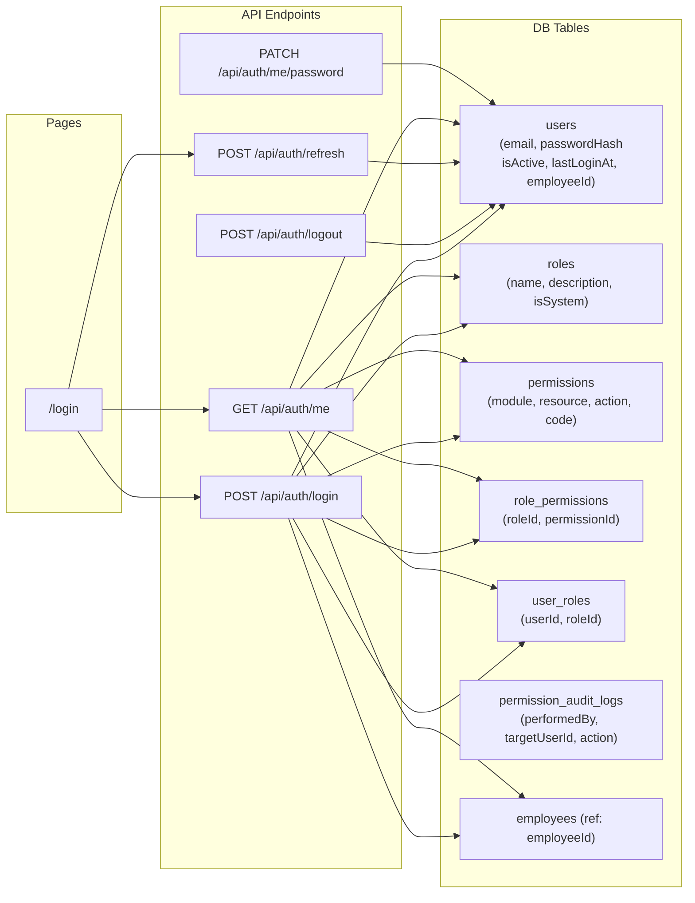
```mermaid
flowchart LR
  subgraph PAGES_AUTH["Pages"]
    P_LOGIN["/login"]
  end

  subgraph APIS_AUTH["API Endpoints"]
    A_AUTH_LOGIN["POST /api/auth/login"]
    A_AUTH_LOGOUT["POST /api/auth/logout"]
    A_AUTH_REFRESH["POST /api/auth/refresh"]
    A_AUTH_ME["GET /api/auth/me"]
    A_AUTH_PWD["PATCH /api/auth/me/password"]
  end

  subgraph TABLES_AUTH["DB Tables"]
    T_USERS["users\n(email, passwordHash\nisActive, lastLoginAt, employeeId)"]
    T_ROLES["roles\n(name, description, isSystem)"]
    T_PERMS["permissions\n(module, resource, action, code)"]
    T_ROLE_PERMS["role_permissions\n(roleId, permissionId)"]
    T_USER_ROLES["user_roles\n(userId, roleId)"]
    T_PERM_AUDIT["permission_audit_logs\n(performedBy, targetUserId, action)"]
    T_EMP_AUTH["employees (ref: employeeId)"]
  end

  P_LOGIN --> A_AUTH_LOGIN
  P_LOGIN --> A_AUTH_REFRESH
  P_LOGIN --> A_AUTH_ME

  A_AUTH_LOGIN --> T_USERS
  A_AUTH_LOGIN --> T_USER_ROLES
  A_AUTH_LOGIN --> T_ROLES
  A_AUTH_LOGIN --> T_ROLE_PERMS
  A_AUTH_LOGIN --> T_PERMS
  A_AUTH_LOGIN --> T_EMP_AUTH
  A_AUTH_LOGOUT --> T_USERS
  A_AUTH_REFRESH --> T_USERS
  A_AUTH_ME --> T_USERS
  A_AUTH_ME --> T_USER_ROLES
  A_AUTH_ME --> T_ROLES
  A_AUTH_ME --> T_ROLE_PERMS
  A_AUTH_ME --> T_PERMS
  A_AUTH_ME --> T_EMP_AUTH
  A_AUTH_PWD --> T_USERS
```

---

## Feature 1.2 — HR: Employee Management

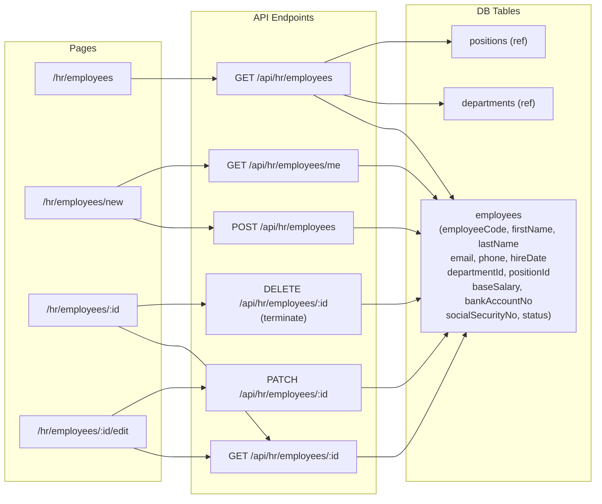
```mermaid
flowchart LR
  subgraph PAGES_EMP["Pages"]
    P_EMP["/hr/employees"]
    P_EMP_NEW["/hr/employees/new"]
    P_EMP_ID["/hr/employees/:id"]
    P_EMP_EDIT["/hr/employees/:id/edit"]
  end

  subgraph APIS_EMP["API Endpoints"]
    A_EMP_ME["GET /api/hr/employees/me"]
    A_EMP_LIST["GET /api/hr/employees"]
    A_EMP_GET["GET /api/hr/employees/:id"]
    A_EMP_CREATE["POST /api/hr/employees"]
    A_EMP_PATCH["PATCH /api/hr/employees/:id"]
    A_EMP_DEL["DELETE /api/hr/employees/:id\n(terminate)"]
  end

  subgraph TABLES_EMP["DB Tables"]
    T_EMP["employees\n(employeeCode, firstName, lastName\nemail, phone, hireDate\ndepartmentId, positionId\nbaseSalary, bankAccountNo\nsocialSecurityNo, status)"]
    T_DEPT_EMP["departments (ref)"]
    T_POS_EMP["positions (ref)"]
  end

  P_EMP --> A_EMP_LIST
  P_EMP_NEW --> A_EMP_CREATE
  P_EMP_NEW --> A_EMP_ME
  P_EMP_ID --> A_EMP_GET
  P_EMP_ID --> A_EMP_DEL
  P_EMP_EDIT --> A_EMP_GET
  P_EMP_EDIT --> A_EMP_PATCH

  A_EMP_ME --> T_EMP
  A_EMP_LIST --> T_EMP
  A_EMP_LIST --> T_DEPT_EMP
  A_EMP_LIST --> T_POS_EMP
  A_EMP_GET --> T_EMP
  A_EMP_CREATE --> T_EMP
  A_EMP_PATCH --> T_EMP
  A_EMP_DEL --> T_EMP
```

---

## Feature 1.3 — HR: Organization Management (Department + Position)

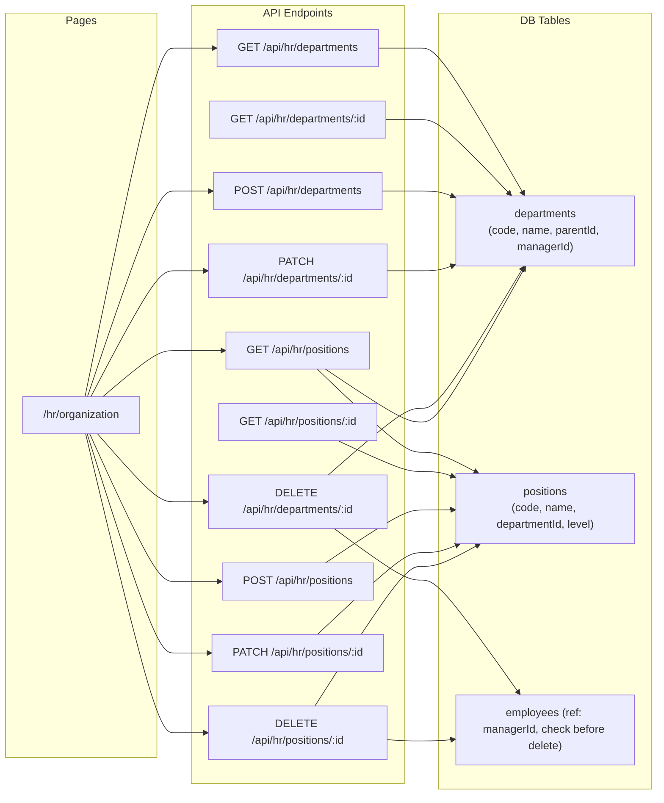
```mermaid
flowchart LR
  subgraph PAGES_ORG["Pages"]
    P_ORG["/hr/organization"]
  end

  subgraph APIS_ORG["API Endpoints"]
    A_DEPT_LIST["GET /api/hr/departments"]
    A_DEPT_GET["GET /api/hr/departments/:id"]
    A_DEPT_CREATE["POST /api/hr/departments"]
    A_DEPT_PATCH["PATCH /api/hr/departments/:id"]
    A_DEPT_DEL["DELETE /api/hr/departments/:id"]
    A_POS_LIST["GET /api/hr/positions"]
    A_POS_GET["GET /api/hr/positions/:id"]
    A_POS_CREATE["POST /api/hr/positions"]
    A_POS_PATCH["PATCH /api/hr/positions/:id"]
    A_POS_DEL["DELETE /api/hr/positions/:id"]
  end

  subgraph TABLES_ORG["DB Tables"]
    T_DEPT["departments\n(code, name, parentId, managerId)"]
    T_POS["positions\n(code, name, departmentId, level)"]
    T_EMP_ORG["employees (ref: managerId, check before delete)"]
  end

  P_ORG --> A_DEPT_LIST
  P_ORG --> A_DEPT_CREATE
  P_ORG --> A_DEPT_PATCH
  P_ORG --> A_DEPT_DEL
  P_ORG --> A_POS_LIST
  P_ORG --> A_POS_CREATE
  P_ORG --> A_POS_PATCH
  P_ORG --> A_POS_DEL

  A_DEPT_LIST --> T_DEPT
  A_DEPT_GET --> T_DEPT
  A_DEPT_CREATE --> T_DEPT
  A_DEPT_PATCH --> T_DEPT
  A_DEPT_DEL --> T_DEPT
  A_DEPT_DEL --> T_EMP_ORG
  A_POS_LIST --> T_POS
  A_POS_LIST --> T_DEPT
  A_POS_GET --> T_POS
  A_POS_CREATE --> T_POS
  A_POS_PATCH --> T_POS
  A_POS_DEL --> T_POS
  A_POS_DEL --> T_EMP_ORG
```

---

## Feature 1.4 — HR: Leave Management

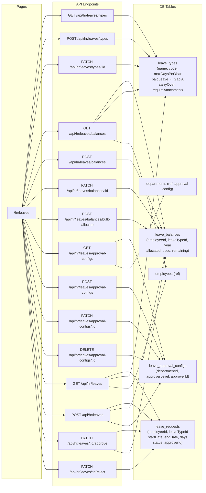
```mermaid
flowchart LR
  subgraph PAGES_LEAVE["Pages"]
    P_LEAVE["/hr/leaves"]
  end

  subgraph APIS_LEAVE["API Endpoints"]
    A_LEAVE_TYPES_GET["GET /api/hr/leaves/types"]
    A_LEAVE_TYPES_POST["POST /api/hr/leaves/types"]
    A_LEAVE_TYPES_PATCH["PATCH /api/hr/leaves/types/:id"]
    A_LEAVE_BAL_LIST["GET /api/hr/leaves/balances"]
    A_LEAVE_BAL_POST["POST /api/hr/leaves/balances"]
    A_LEAVE_BAL_PATCH["PATCH /api/hr/leaves/balances/:id"]
    A_LEAVE_BAL_BULK["POST /api/hr/leaves/balances/bulk-allocate"]
    A_LEAVE_CFG_LIST["GET /api/hr/leaves/approval-configs"]
    A_LEAVE_CFG_POST["POST /api/hr/leaves/approval-configs"]
    A_LEAVE_CFG_PATCH["PATCH /api/hr/leaves/approval-configs/:id"]
    A_LEAVE_CFG_DEL["DELETE /api/hr/leaves/approval-configs/:id"]
    A_LEAVE_LIST["GET /api/hr/leaves"]
    A_LEAVE_CREATE["POST /api/hr/leaves"]
    A_LEAVE_APPROVE["PATCH /api/hr/leaves/:id/approve"]
    A_LEAVE_REJECT["PATCH /api/hr/leaves/:id/reject"]
  end

  subgraph TABLES_LEAVE["DB Tables"]
    T_LEAVE_TYPES["leave_types\n(name, code, maxDaysPerYear\npaidLeave ← Gap A\ncarryOver, requireAttachment)"]
    T_LEAVE_CFG["leave_approval_configs\n(departmentId, approverLevel, approverId)"]
    T_LEAVE_BAL["leave_balances\n(employeeId, leaveTypeId, year\nallocated, used, remaining)"]
    T_LEAVE_REQ["leave_requests\n(employeeId, leaveTypeId\nstartDate, endDate, days\nstatus, approverId)"]
    T_EMP_LEAVE["employees (ref)"]
    T_DEPT_LEAVE["departments (ref: approval config)"]
  end

  P_LEAVE --> A_LEAVE_TYPES_GET
  P_LEAVE --> A_LEAVE_TYPES_POST
  P_LEAVE --> A_LEAVE_TYPES_PATCH
  P_LEAVE --> A_LEAVE_BAL_LIST
  P_LEAVE --> A_LEAVE_BAL_POST
  P_LEAVE --> A_LEAVE_BAL_PATCH
  P_LEAVE --> A_LEAVE_BAL_BULK
  P_LEAVE --> A_LEAVE_CFG_LIST
  P_LEAVE --> A_LEAVE_CFG_POST
  P_LEAVE --> A_LEAVE_CFG_PATCH
  P_LEAVE --> A_LEAVE_CFG_DEL
  P_LEAVE --> A_LEAVE_LIST
  P_LEAVE --> A_LEAVE_CREATE
  P_LEAVE --> A_LEAVE_APPROVE
  P_LEAVE --> A_LEAVE_REJECT

  A_LEAVE_TYPES_GET --> T_LEAVE_TYPES
  A_LEAVE_TYPES_POST --> T_LEAVE_TYPES
  A_LEAVE_TYPES_PATCH --> T_LEAVE_TYPES
  A_LEAVE_BAL_LIST --> T_LEAVE_BAL
  A_LEAVE_BAL_LIST --> T_LEAVE_TYPES
  A_LEAVE_BAL_LIST --> T_EMP_LEAVE
  A_LEAVE_BAL_POST --> T_LEAVE_BAL
  A_LEAVE_BAL_PATCH --> T_LEAVE_BAL
  A_LEAVE_BAL_BULK --> T_LEAVE_BAL
  A_LEAVE_CFG_LIST --> T_LEAVE_CFG
  A_LEAVE_CFG_LIST --> T_DEPT_LEAVE
  A_LEAVE_CFG_POST --> T_LEAVE_CFG
  A_LEAVE_CFG_PATCH --> T_LEAVE_CFG
  A_LEAVE_CFG_DEL --> T_LEAVE_CFG
  A_LEAVE_LIST --> T_LEAVE_REQ
  A_LEAVE_LIST --> T_LEAVE_TYPES
  A_LEAVE_LIST --> T_EMP_LEAVE
  A_LEAVE_CREATE --> T_LEAVE_REQ
  A_LEAVE_CREATE --> T_LEAVE_BAL
  A_LEAVE_CREATE --> T_LEAVE_CFG
  A_LEAVE_APPROVE --> T_LEAVE_REQ
  A_LEAVE_APPROVE --> T_LEAVE_BAL
  A_LEAVE_REJECT --> T_LEAVE_REQ
```

---

## Feature 1.5 — HR: Payroll

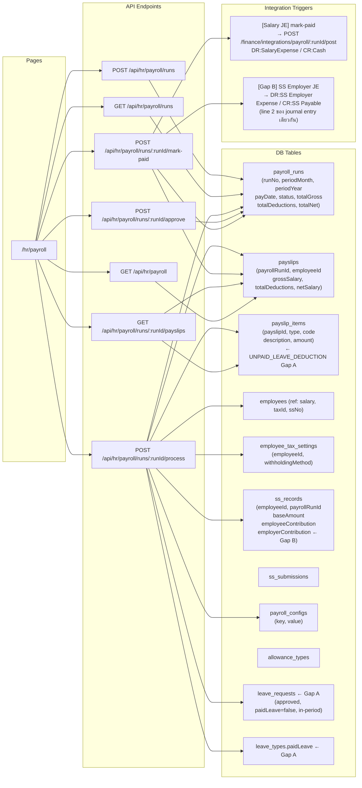
```mermaid
flowchart LR
  subgraph PAGES_PAY["Pages"]
    P_PAY["/hr/payroll"]
  end

  subgraph APIS_PAY["API Endpoints"]
    A_PAY_CREATE["POST /api/hr/payroll/runs"]
    A_PAY_LIST["GET /api/hr/payroll/runs"]
    A_PAY_PROCESS["POST /api/hr/payroll/runs/:runId/process"]
    A_PAY_APPROVE["POST /api/hr/payroll/runs/:runId/approve"]
    A_PAY_MARKPAID["POST /api/hr/payroll/runs/:runId/mark-paid"]
    A_PAY_PAYSLIPS["GET /api/hr/payroll/runs/:runId/payslips"]
    A_PAY_SUMMARY["GET /api/hr/payroll"]
  end

  subgraph TABLES_PAY["DB Tables"]
    T_PAY_RUNS["payroll_runs\n(runNo, periodMonth, periodYear\npayDate, status, totalGross\ntotalDeductions, totalNet)"]
    T_PAYSLIPS["payslips\n(payrollRunId, employeeId\ngrossSalary, totalDeductions, netSalary)"]
    T_PAY_ITEMS["payslip_items\n(payslipId, type, code\ndescription, amount)\n← UNPAID_LEAVE_DEDUCTION Gap A"]
    T_EMP_PAY["employees (ref: salary, taxId, ssNo)"]
    T_TAX["employee_tax_settings\n(employeeId, withholdingMethod)"]
    T_SS["ss_records\n(employeeId, payrollRunId\nbaseAmount\nemployeeContribution\nemployerContribution ← Gap B)"]
    T_SS_SUB["ss_submissions"]
    T_PAY_CFG["payroll_configs\n(key, value)"]
    T_ALLOW["allowance_types"]
    T_LEAVE_REQ_PAY["leave_requests ← Gap A\n(approved, paidLeave=false, in-period)"]
    T_LEAVE_TYPE_PAY["leave_types.paidLeave ← Gap A"]
  end

  subgraph INTEGRATION_PAY["Integration Triggers"]
    TRG_PAY_SALARY["[Salary JE] mark-paid\n→ POST /finance/integrations/payroll/:runId/post\nDR:SalaryExpense / CR:Cash"]
    TRG_PAY_SS["[Gap B] SS Employer JE\n→ DR:SS Employer Expense / CR:SS Payable\n(line 2 ของ journal entry เดียวกัน)"]
  end

  P_PAY --> A_PAY_CREATE
  P_PAY --> A_PAY_LIST
  P_PAY --> A_PAY_PROCESS
  P_PAY --> A_PAY_APPROVE
  P_PAY --> A_PAY_MARKPAID
  P_PAY --> A_PAY_PAYSLIPS
  P_PAY --> A_PAY_SUMMARY

  A_PAY_CREATE --> T_PAY_RUNS
  A_PAY_LIST --> T_PAY_RUNS
  A_PAY_PROCESS --> T_PAY_RUNS
  A_PAY_PROCESS --> T_PAYSLIPS
  A_PAY_PROCESS --> T_PAY_ITEMS
  A_PAY_PROCESS --> T_EMP_PAY
  A_PAY_PROCESS --> T_TAX
  A_PAY_PROCESS --> T_SS
  A_PAY_PROCESS --> T_PAY_CFG
  A_PAY_PROCESS --> T_LEAVE_REQ_PAY
  A_PAY_PROCESS --> T_LEAVE_TYPE_PAY
  A_PAY_APPROVE --> T_PAY_RUNS
  A_PAY_MARKPAID --> T_PAY_RUNS
  A_PAY_MARKPAID --> T_PAYSLIPS
  A_PAY_PAYSLIPS --> T_PAYSLIPS
  A_PAY_PAYSLIPS --> T_PAY_ITEMS
  A_PAY_SUMMARY --> T_PAYSLIPS
  A_PAY_MARKPAID --> TRG_PAY_SALARY
  A_PAY_MARKPAID --> TRG_PAY_SS
```

---

## Feature 1.6 — Finance: Invoice (AR) + Customer List

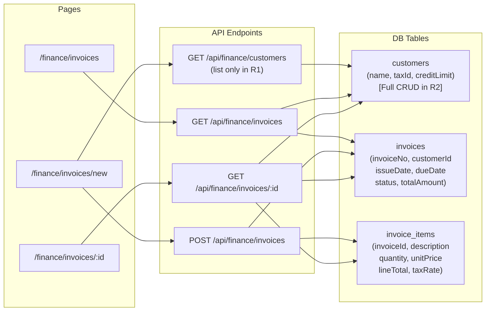
```mermaid
flowchart LR
  subgraph PAGES_INV["Pages"]
    P_INV["/finance/invoices"]
    P_INV_NEW["/finance/invoices/new"]
    P_INV_ID["/finance/invoices/:id"]
  end

  subgraph APIS_INV["API Endpoints"]
    A_CUST_LIST_INV["GET /api/finance/customers\n(list only in R1)"]
    A_INV_LIST["GET /api/finance/invoices"]
    A_INV_CREATE["POST /api/finance/invoices"]
    A_INV_GET["GET /api/finance/invoices/:id"]
  end

  subgraph TABLES_INV["DB Tables"]
    T_CUSTOMERS_INV["customers\n(name, taxId, creditLimit)\n[Full CRUD in R2]"]
    T_INVOICES["invoices\n(invoiceNo, customerId\nissueDate, dueDate\nstatus, totalAmount)"]
    T_INV_ITEMS["invoice_items\n(invoiceId, description\nquantity, unitPrice\nlineTotal, taxRate)"]
  end

  P_INV --> A_INV_LIST
  P_INV_NEW --> A_CUST_LIST_INV
  P_INV_NEW --> A_INV_CREATE
  P_INV_ID --> A_INV_GET

  A_CUST_LIST_INV --> T_CUSTOMERS_INV
  A_INV_LIST --> T_INVOICES
  A_INV_LIST --> T_CUSTOMERS_INV
  A_INV_CREATE --> T_INVOICES
  A_INV_CREATE --> T_INV_ITEMS
  A_INV_GET --> T_INVOICES
  A_INV_GET --> T_INV_ITEMS
  A_INV_GET --> T_CUSTOMERS_INV
```

---

## Feature 1.7 — Finance: Vendor Management

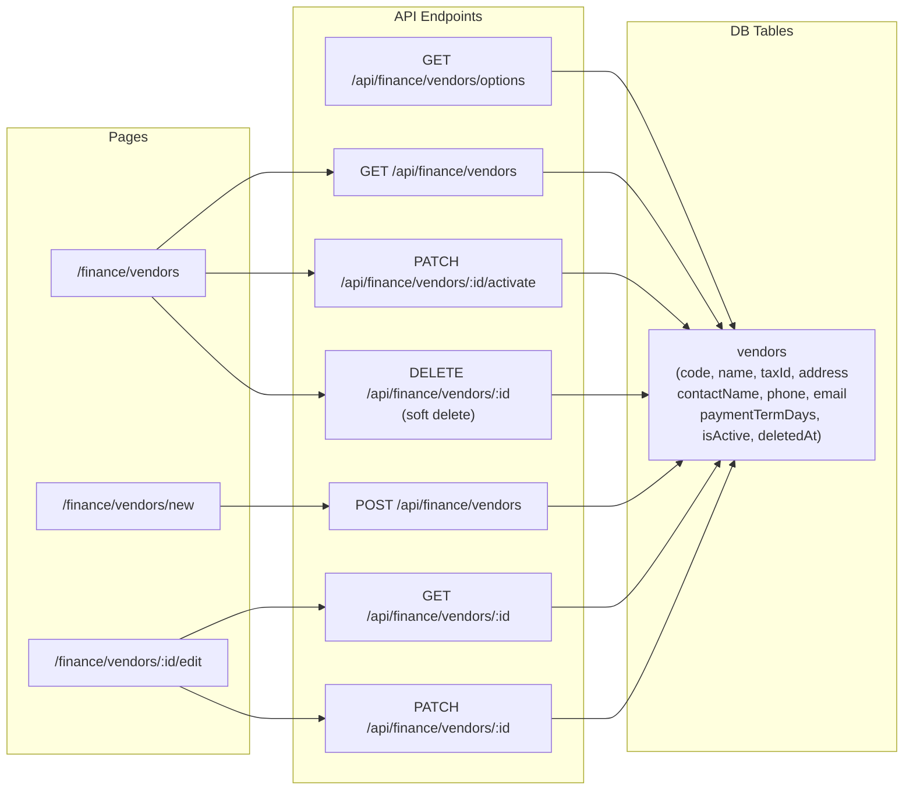
```mermaid
flowchart LR
  subgraph PAGES_VEND["Pages"]
    P_VEND["/finance/vendors"]
    P_VEND_NEW["/finance/vendors/new"]
    P_VEND_EDIT["/finance/vendors/:id/edit"]
  end

  subgraph APIS_VEND["API Endpoints"]
    A_VEND_OPT["GET /api/finance/vendors/options"]
    A_VEND_LIST["GET /api/finance/vendors"]
    A_VEND_GET["GET /api/finance/vendors/:id"]
    A_VEND_CREATE["POST /api/finance/vendors"]
    A_VEND_PATCH["PATCH /api/finance/vendors/:id"]
    A_VEND_ACT["PATCH /api/finance/vendors/:id/activate"]
    A_VEND_DEL["DELETE /api/finance/vendors/:id\n(soft delete)"]
  end

  subgraph TABLES_VEND["DB Tables"]
    T_VENDORS["vendors\n(code, name, taxId, address\ncontactName, phone, email\npaymentTermDays, isActive, deletedAt)"]
  end

  P_VEND --> A_VEND_LIST
  P_VEND --> A_VEND_ACT
  P_VEND --> A_VEND_DEL
  P_VEND_NEW --> A_VEND_CREATE
  P_VEND_EDIT --> A_VEND_GET
  P_VEND_EDIT --> A_VEND_PATCH

  A_VEND_OPT --> T_VENDORS
  A_VEND_LIST --> T_VENDORS
  A_VEND_GET --> T_VENDORS
  A_VEND_CREATE --> T_VENDORS
  A_VEND_PATCH --> T_VENDORS
  A_VEND_ACT --> T_VENDORS
  A_VEND_DEL --> T_VENDORS
```

---

## Feature 1.8 — Finance: Accounts Payable (AP)

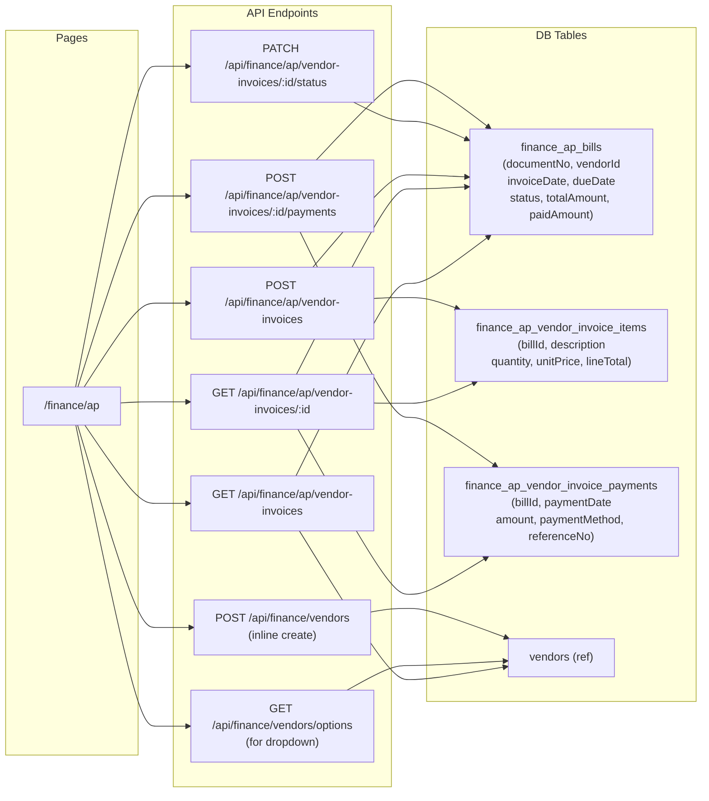
```mermaid
flowchart LR
  subgraph PAGES_AP["Pages"]
    P_AP["/finance/ap"]
  end

  subgraph APIS_AP["API Endpoints"]
    A_AP_LIST["GET /api/finance/ap/vendor-invoices"]
    A_AP_GET["GET /api/finance/ap/vendor-invoices/:id"]
    A_AP_CREATE["POST /api/finance/ap/vendor-invoices"]
    A_AP_STATUS["PATCH /api/finance/ap/vendor-invoices/:id/status"]
    A_AP_PAY["POST /api/finance/ap/vendor-invoices/:id/payments"]
    A_VEND_OPT_AP["GET /api/finance/vendors/options\n(for dropdown)"]
    A_VEND_CREATE_AP["POST /api/finance/vendors\n(inline create)"]
  end

  subgraph TABLES_AP["DB Tables"]
    T_AP_BILLS["finance_ap_bills\n(documentNo, vendorId\ninvoiceDate, dueDate\nstatus, totalAmount, paidAmount)"]
    T_AP_ITEMS["finance_ap_vendor_invoice_items\n(billId, description\nquantity, unitPrice, lineTotal)"]
    T_AP_PAYS["finance_ap_vendor_invoice_payments\n(billId, paymentDate\namount, paymentMethod, referenceNo)"]
    T_VENDORS_AP["vendors (ref)"]
  end

  P_AP --> A_AP_LIST
  P_AP --> A_AP_GET
  P_AP --> A_AP_CREATE
  P_AP --> A_AP_STATUS
  P_AP --> A_AP_PAY
  P_AP --> A_VEND_OPT_AP
  P_AP --> A_VEND_CREATE_AP

  A_AP_LIST --> T_AP_BILLS
  A_AP_LIST --> T_VENDORS_AP
  A_AP_GET --> T_AP_BILLS
  A_AP_GET --> T_AP_ITEMS
  A_AP_GET --> T_AP_PAYS
  A_AP_CREATE --> T_AP_BILLS
  A_AP_CREATE --> T_AP_ITEMS
  A_AP_STATUS --> T_AP_BILLS
  A_AP_PAY --> T_AP_PAYS
  A_AP_PAY --> T_AP_BILLS
  A_VEND_OPT_AP --> T_VENDORS_AP
  A_VEND_CREATE_AP --> T_VENDORS_AP
```

---

## Feature 1.9 — Finance: Accounting Core (Chart of Accounts + Journal + Ledger + Integrations)

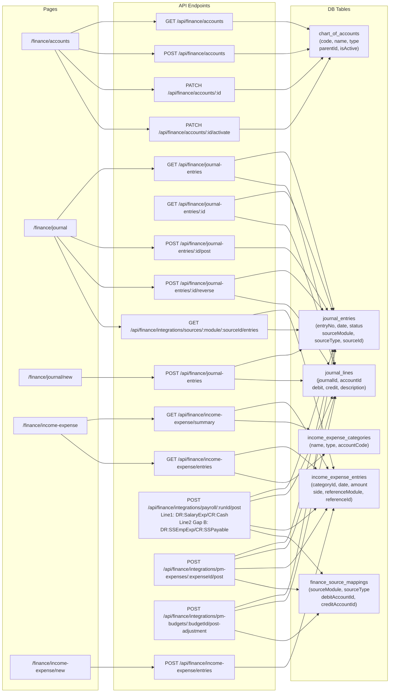
```mermaid
flowchart LR
  subgraph PAGES_ACC["Pages"]
    P_COA["/finance/accounts"]
    P_JNL["/finance/journal"]
    P_JNL_NEW["/finance/journal/new"]
    P_IE["/finance/income-expense"]
    P_IE_NEW["/finance/income-expense/new"]
  end

  subgraph APIS_ACC["API Endpoints"]
    A_COA_LIST["GET /api/finance/accounts"]
    A_COA_CREATE["POST /api/finance/accounts"]
    A_COA_PATCH["PATCH /api/finance/accounts/:id"]
    A_COA_ACT["PATCH /api/finance/accounts/:id/activate"]
    A_JNL_LIST["GET /api/finance/journal-entries"]
    A_JNL_GET["GET /api/finance/journal-entries/:id"]
    A_JNL_CREATE["POST /api/finance/journal-entries"]
    A_JNL_POST["POST /api/finance/journal-entries/:id/post"]
    A_JNL_REV["POST /api/finance/journal-entries/:id/reverse"]
    A_IE_SUM["GET /api/finance/income-expense/summary"]
    A_IE_LIST["GET /api/finance/income-expense/entries"]
    A_IE_CREATE["POST /api/finance/income-expense/entries"]
    A_INT_PAY["POST /api/finance/integrations/payroll/:runId/post\nLine1: DR:SalaryExp/CR:Cash\nLine2 Gap B: DR:SSEmpExp/CR:SSPayable"]
    A_INT_EXP["POST /api/finance/integrations/pm-expenses/:expenseId/post"]
    A_INT_BUD["POST /api/finance/integrations/pm-budgets/:budgetId/post-adjustment"]
    A_INT_SRC["GET /api/finance/integrations/sources/:module/:sourceId/entries"]
  end

  subgraph TABLES_ACC["DB Tables"]
    T_COA["chart_of_accounts\n(code, name, type\nparentId, isActive)"]
    T_JE["journal_entries\n(entryNo, date, status\nsourceModule, sourceType, sourceId)"]
    T_JL["journal_lines\n(journalId, accountId\ndebit, credit, description)"]
    T_IE_CAT["income_expense_categories\n(name, type, accountCode)"]
    T_IE_ENT["income_expense_entries\n(categoryId, date, amount\nside, referenceModule, referenceId)"]
    T_SRC_MAP["finance_source_mappings\n(sourceModule, sourceType\ndebitAccountId, creditAccountId)"]
  end

  P_COA --> A_COA_LIST
  P_COA --> A_COA_CREATE
  P_COA --> A_COA_PATCH
  P_COA --> A_COA_ACT
  P_JNL --> A_JNL_LIST
  P_JNL --> A_JNL_POST
  P_JNL --> A_JNL_REV
  P_JNL --> A_INT_SRC
  P_JNL_NEW --> A_JNL_CREATE
  P_IE --> A_IE_SUM
  P_IE --> A_IE_LIST
  P_IE_NEW --> A_IE_CREATE

  A_COA_LIST --> T_COA
  A_COA_CREATE --> T_COA
  A_COA_PATCH --> T_COA
  A_COA_ACT --> T_COA
  A_JNL_LIST --> T_JE
  A_JNL_LIST --> T_JL
  A_JNL_GET --> T_JE
  A_JNL_GET --> T_JL
  A_JNL_CREATE --> T_JE
  A_JNL_CREATE --> T_JL
  A_JNL_POST --> T_JE
  A_JNL_REV --> T_JE
  A_JNL_REV --> T_JL
  A_IE_SUM --> T_IE_ENT
  A_IE_SUM --> T_IE_CAT
  A_IE_LIST --> T_IE_ENT
  A_IE_LIST --> T_IE_CAT
  A_IE_CREATE --> T_IE_ENT
  A_INT_PAY --> T_JE
  A_INT_PAY --> T_JL
  A_INT_PAY --> T_IE_ENT
  A_INT_PAY --> T_SRC_MAP
  A_INT_EXP --> T_JE
  A_INT_EXP --> T_JL
  A_INT_EXP --> T_IE_ENT
  A_INT_EXP --> T_SRC_MAP
  A_INT_BUD --> T_JE
  A_INT_BUD --> T_JL
  A_INT_BUD --> T_SRC_MAP
  A_INT_SRC --> T_IE_ENT
  A_INT_SRC --> T_JE
```

---

## Feature 1.10 — Finance: Reports Summary

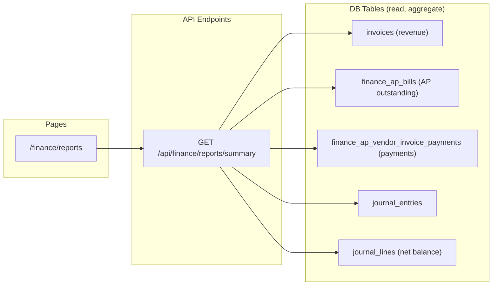
```mermaid
flowchart LR
  subgraph PAGES_RPT["Pages"]
    P_RPT["/finance/reports"]
  end

  subgraph APIS_RPT["API Endpoints"]
    A_RPT_SUM["GET /api/finance/reports/summary"]
  end

  subgraph TABLES_RPT["DB Tables (read, aggregate)"]
    T_INV_RPT["invoices (revenue)"]
    T_AP_RPT["finance_ap_bills (AP outstanding)"]
    T_AP_PAY_RPT["finance_ap_vendor_invoice_payments (payments)"]
    T_JE_RPT["journal_entries"]
    T_JL_RPT["journal_lines (net balance)"]
  end

  P_RPT --> A_RPT_SUM

  A_RPT_SUM --> T_INV_RPT
  A_RPT_SUM --> T_AP_RPT
  A_RPT_SUM --> T_AP_PAY_RPT
  A_RPT_SUM --> T_JE_RPT
  A_RPT_SUM --> T_JL_RPT
```

---

## Feature 1.11 — PM: Budget Management

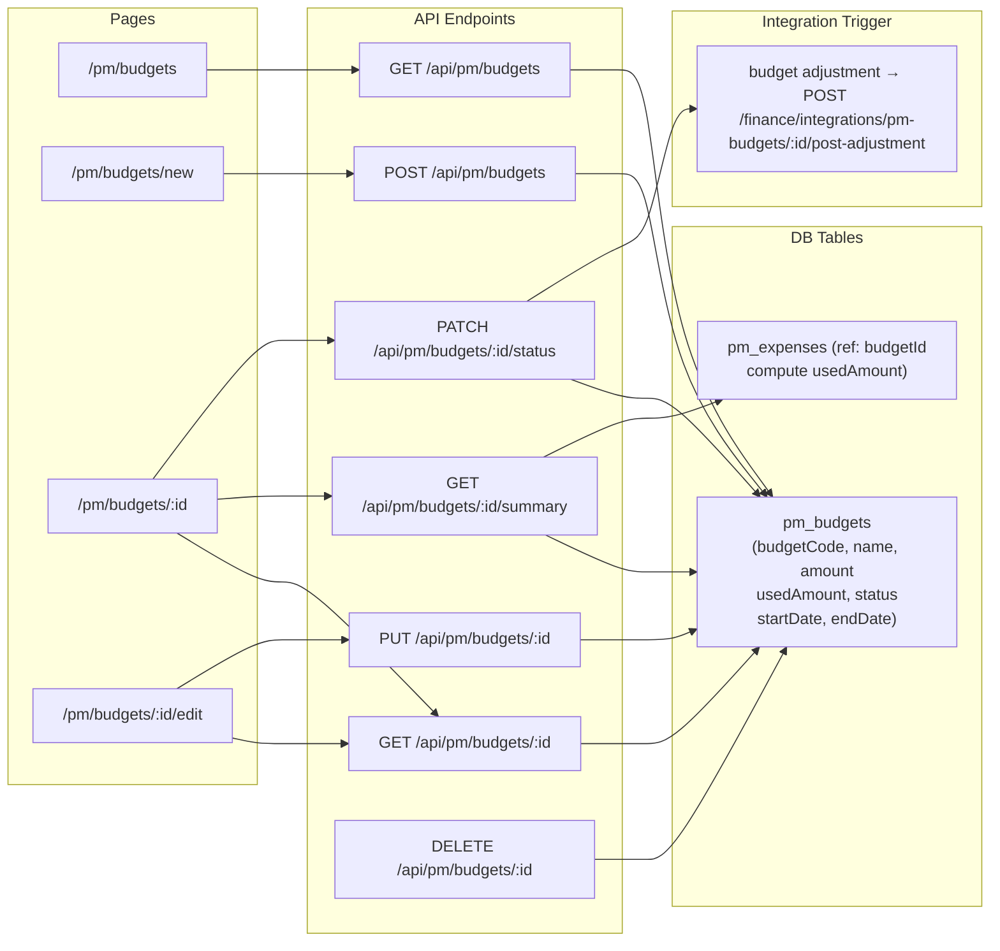
```mermaid
flowchart LR
  subgraph PAGES_BUD["Pages"]
    P_BUD["/pm/budgets"]
    P_BUD_NEW["/pm/budgets/new"]
    P_BUD_ID["/pm/budgets/:id"]
    P_BUD_EDIT["/pm/budgets/:id/edit"]
  end

  subgraph APIS_BUD["API Endpoints"]
    A_BUD_LIST["GET /api/pm/budgets"]
    A_BUD_CREATE["POST /api/pm/budgets"]
    A_BUD_GET["GET /api/pm/budgets/:id"]
    A_BUD_SUM["GET /api/pm/budgets/:id/summary"]
    A_BUD_PUT["PUT /api/pm/budgets/:id"]
    A_BUD_STATUS["PATCH /api/pm/budgets/:id/status"]
    A_BUD_DEL["DELETE /api/pm/budgets/:id"]
  end

  subgraph TABLES_BUD["DB Tables"]
    T_PM_BUD["pm_budgets\n(budgetCode, name, amount\nusedAmount, status\nstartDate, endDate)"]
    T_PM_EXP_BUD["pm_expenses (ref: budgetId\ncompute usedAmount)"]
  end

  subgraph INTEGRATION_BUD["Integration Trigger"]
    TRG_BUD["budget adjustment → POST /finance/integrations/pm-budgets/:id/post-adjustment"]
  end

  P_BUD --> A_BUD_LIST
  P_BUD_NEW --> A_BUD_CREATE
  P_BUD_ID --> A_BUD_GET
  P_BUD_ID --> A_BUD_SUM
  P_BUD_ID --> A_BUD_STATUS
  P_BUD_EDIT --> A_BUD_GET
  P_BUD_EDIT --> A_BUD_PUT

  A_BUD_LIST --> T_PM_BUD
  A_BUD_CREATE --> T_PM_BUD
  A_BUD_GET --> T_PM_BUD
  A_BUD_SUM --> T_PM_BUD
  A_BUD_SUM --> T_PM_EXP_BUD
  A_BUD_PUT --> T_PM_BUD
  A_BUD_STATUS --> T_PM_BUD
  A_BUD_DEL --> T_PM_BUD
  A_BUD_STATUS --> TRG_BUD
```

---

## Feature 1.12 — PM: Expense Management

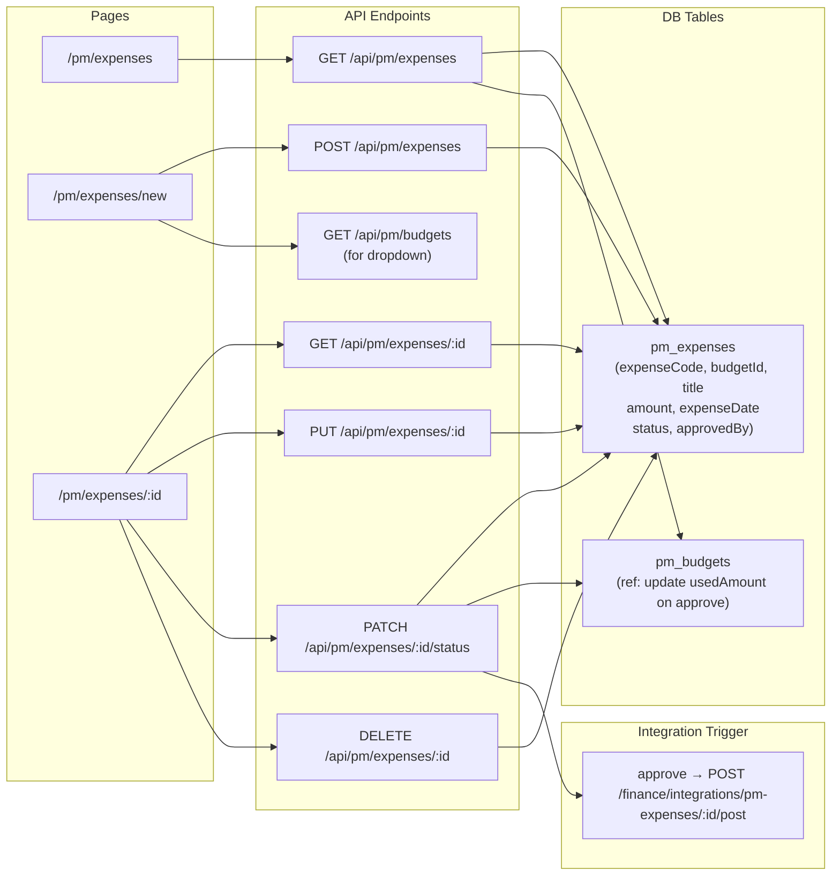
```mermaid
flowchart LR
  subgraph PAGES_EXP["Pages"]
    P_EXP["/pm/expenses"]
    P_EXP_NEW["/pm/expenses/new"]
    P_EXP_ID["/pm/expenses/:id"]
  end

  subgraph APIS_EXP["API Endpoints"]
    A_EXP_LIST["GET /api/pm/expenses"]
    A_EXP_CREATE["POST /api/pm/expenses"]
    A_EXP_GET["GET /api/pm/expenses/:id"]
    A_EXP_PUT["PUT /api/pm/expenses/:id"]
    A_EXP_STATUS["PATCH /api/pm/expenses/:id/status"]
    A_EXP_DEL["DELETE /api/pm/expenses/:id"]
    A_BUD_LIST_EXP["GET /api/pm/budgets\n(for dropdown)"]
  end

  subgraph TABLES_EXP["DB Tables"]
    T_PM_EXP["pm_expenses\n(expenseCode, budgetId, title\namount, expenseDate\nstatus, approvedBy)"]
    T_PM_BUD_EXP["pm_budgets\n(ref: update usedAmount on approve)"]
  end

  subgraph INTEGRATION_EXP["Integration Trigger"]
    TRG_EXP["approve → POST /finance/integrations/pm-expenses/:id/post"]
  end

  P_EXP --> A_EXP_LIST
  P_EXP_NEW --> A_EXP_CREATE
  P_EXP_NEW --> A_BUD_LIST_EXP
  P_EXP_ID --> A_EXP_GET
  P_EXP_ID --> A_EXP_PUT
  P_EXP_ID --> A_EXP_STATUS
  P_EXP_ID --> A_EXP_DEL

  A_EXP_LIST --> T_PM_EXP
  A_EXP_LIST --> T_PM_BUD_EXP
  A_EXP_CREATE --> T_PM_EXP
  A_EXP_GET --> T_PM_EXP
  A_EXP_PUT --> T_PM_EXP
  A_EXP_STATUS --> T_PM_EXP
  A_EXP_STATUS --> T_PM_BUD_EXP
  A_EXP_DEL --> T_PM_EXP
  A_EXP_STATUS --> TRG_EXP
```

---

## Feature 1.13 — PM: Progress Tasks

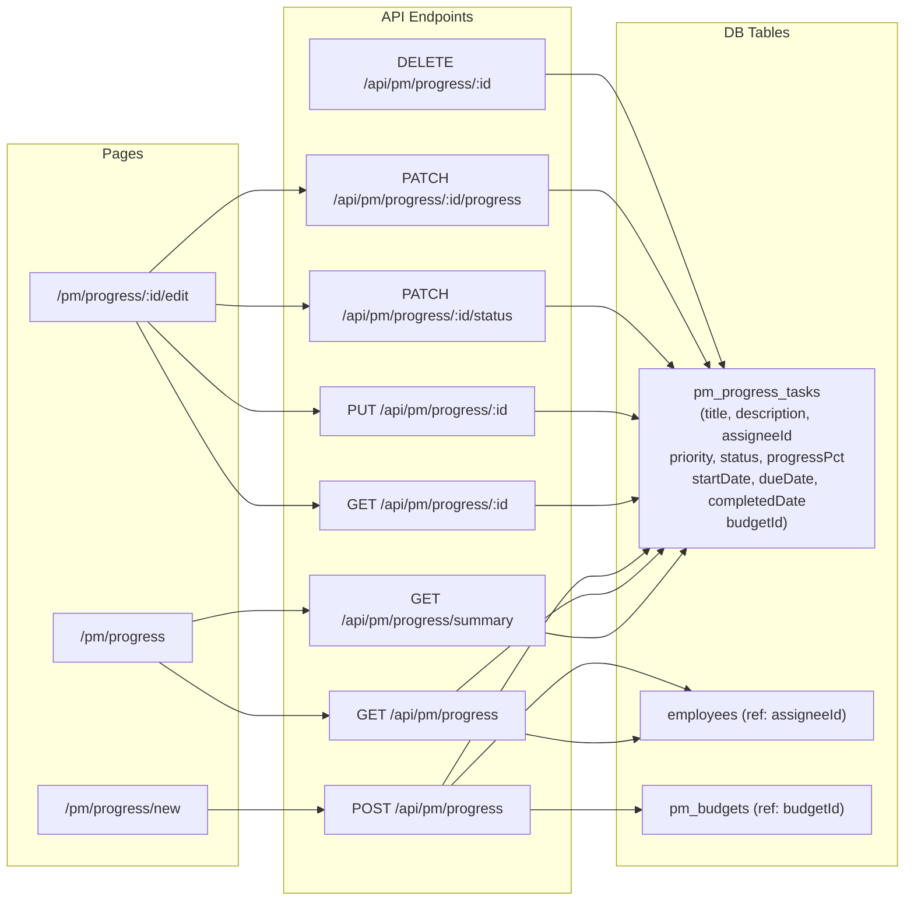
```mermaid
flowchart LR
  subgraph PAGES_PROG["Pages"]
    P_PROG["/pm/progress"]
    P_PROG_NEW["/pm/progress/new"]
    P_PROG_EDIT["/pm/progress/:id/edit"]
  end

  subgraph APIS_PROG["API Endpoints"]
    A_PROG_SUM["GET /api/pm/progress/summary"]
    A_PROG_LIST["GET /api/pm/progress"]
    A_PROG_CREATE["POST /api/pm/progress"]
    A_PROG_GET["GET /api/pm/progress/:id"]
    A_PROG_PUT["PUT /api/pm/progress/:id"]
    A_PROG_STATUS["PATCH /api/pm/progress/:id/status"]
    A_PROG_PCT["PATCH /api/pm/progress/:id/progress"]
    A_PROG_DEL["DELETE /api/pm/progress/:id"]
  end

  subgraph TABLES_PROG["DB Tables"]
    T_PM_PROG["pm_progress_tasks\n(title, description, assigneeId\npriority, status, progressPct\nstartDate, dueDate, completedDate\nbudgetId)"]
    T_EMP_PROG["employees (ref: assigneeId)"]
    T_PM_BUD_PROG["pm_budgets (ref: budgetId)"]
  end

  P_PROG --> A_PROG_SUM
  P_PROG --> A_PROG_LIST
  P_PROG_NEW --> A_PROG_CREATE
  P_PROG_EDIT --> A_PROG_GET
  P_PROG_EDIT --> A_PROG_PUT
  P_PROG_EDIT --> A_PROG_STATUS
  P_PROG_EDIT --> A_PROG_PCT

  A_PROG_SUM --> T_PM_PROG
  A_PROG_LIST --> T_PM_PROG
  A_PROG_CREATE --> T_PM_PROG
  A_PROG_GET --> T_PM_PROG
  A_PROG_PUT --> T_PM_PROG
  A_PROG_STATUS --> T_PM_PROG
  A_PROG_PCT --> T_PM_PROG
  A_PROG_DEL --> T_PM_PROG
  A_PROG_LIST --> T_EMP_PROG
  A_PROG_CREATE --> T_EMP_PROG
  A_PROG_CREATE --> T_PM_BUD_PROG
```

---

## Feature 1.14 — PM: Dashboard

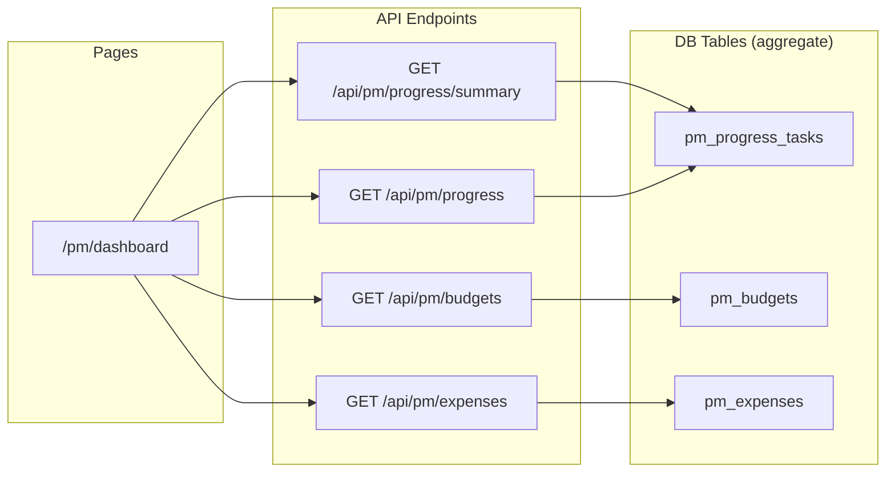
```mermaid
flowchart LR
  subgraph PAGES_DASH["Pages"]
    P_DASH["/pm/dashboard"]
  end

  subgraph APIS_DASH["API Endpoints"]
    A_DASH_SUM["GET /api/pm/progress/summary"]
    A_DASH_PROG["GET /api/pm/progress"]
    A_DASH_BUD["GET /api/pm/budgets"]
    A_DASH_EXP["GET /api/pm/expenses"]
  end

  subgraph TABLES_DASH["DB Tables (aggregate)"]
    T_PM_PROG_D["pm_progress_tasks"]
    T_PM_BUD_D["pm_budgets"]
    T_PM_EXP_D["pm_expenses"]
  end

  P_DASH --> A_DASH_SUM
  P_DASH --> A_DASH_PROG
  P_DASH --> A_DASH_BUD
  P_DASH --> A_DASH_EXP

  A_DASH_SUM --> T_PM_PROG_D
  A_DASH_PROG --> T_PM_PROG_D
  A_DASH_BUD --> T_PM_BUD_D
  A_DASH_EXP --> T_PM_EXP_D
```

---

## Feature 1.15 — Settings: User Management

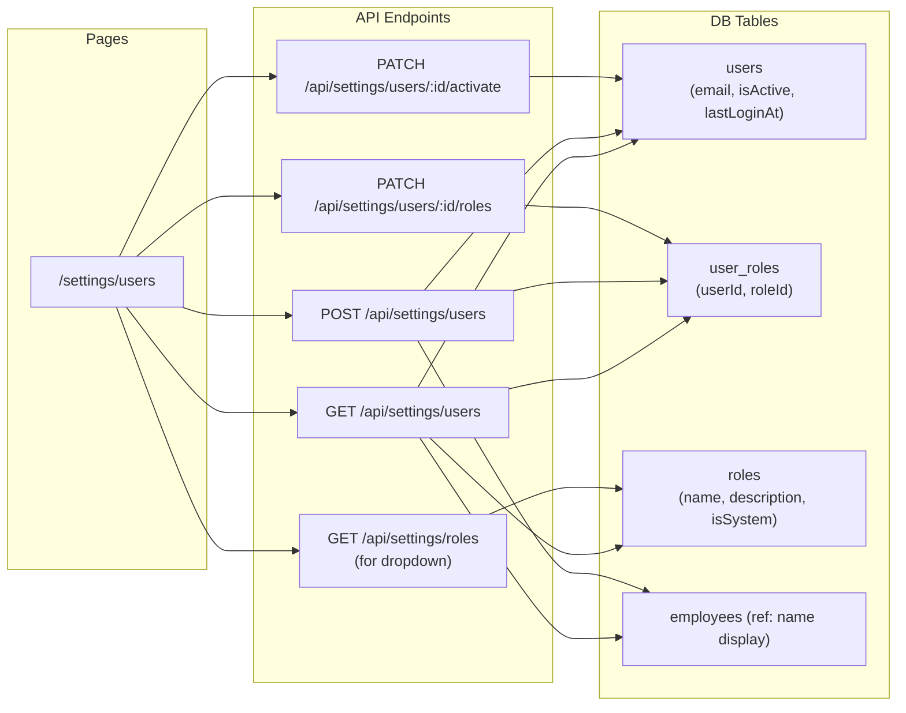
```mermaid
flowchart LR
  subgraph PAGES_USR["Pages"]
    P_USERS["/settings/users"]
  end

  subgraph APIS_USR["API Endpoints"]
    A_USR_LIST["GET /api/settings/users"]
    A_USR_CREATE["POST /api/settings/users"]
    A_USR_ROLE["PATCH /api/settings/users/:id/roles"]
    A_USR_ACT["PATCH /api/settings/users/:id/activate"]
    A_ROLES_LIST["GET /api/settings/roles\n(for dropdown)"]
  end

  subgraph TABLES_USR["DB Tables"]
    T_USERS_S["users\n(email, isActive, lastLoginAt)"]
    T_USER_ROLES_S["user_roles\n(userId, roleId)"]
    T_ROLES_S["roles\n(name, description, isSystem)"]
    T_EMP_S["employees (ref: name display)"]
  end

  P_USERS --> A_USR_LIST
  P_USERS --> A_USR_CREATE
  P_USERS --> A_USR_ROLE
  P_USERS --> A_USR_ACT
  P_USERS --> A_ROLES_LIST

  A_USR_LIST --> T_USERS_S
  A_USR_LIST --> T_USER_ROLES_S
  A_USR_LIST --> T_ROLES_S
  A_USR_LIST --> T_EMP_S
  A_USR_CREATE --> T_USERS_S
  A_USR_CREATE --> T_EMP_S
  A_USR_CREATE --> T_USER_ROLES_S
  A_USR_ROLE --> T_USER_ROLES_S
  A_USR_ACT --> T_USERS_S
  A_ROLES_LIST --> T_ROLES_S
```

---

## Feature 1.16 — Settings: Role & Permission Management

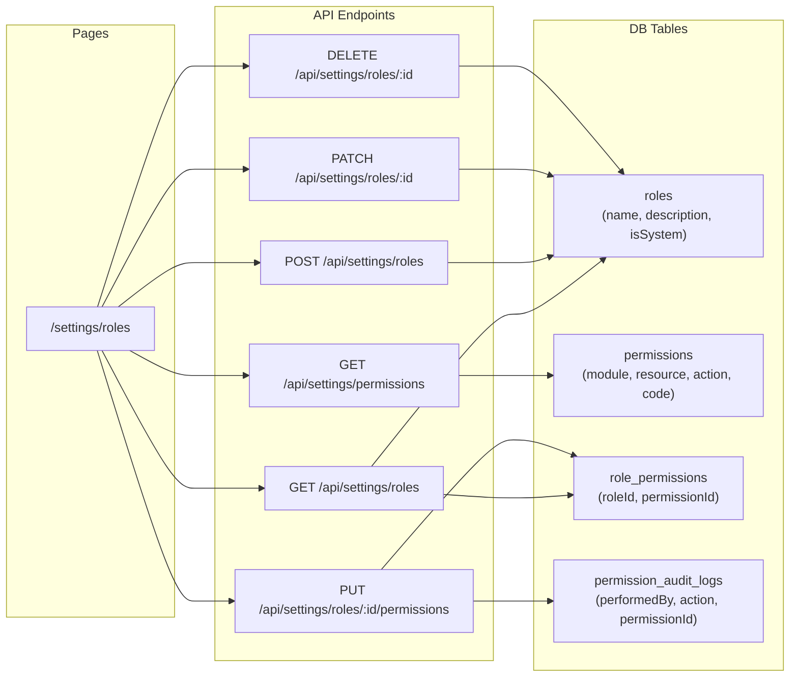
```mermaid
flowchart LR
  subgraph PAGES_ROLE["Pages"]
    P_ROLES["/settings/roles"]
  end

  subgraph APIS_ROLE["API Endpoints"]
    A_ROLE_LIST["GET /api/settings/roles"]
    A_ROLE_CREATE["POST /api/settings/roles"]
    A_ROLE_PATCH["PATCH /api/settings/roles/:id"]
    A_ROLE_DEL["DELETE /api/settings/roles/:id"]
    A_PERMS["GET /api/settings/permissions"]
    A_ROLE_PERMS["PUT /api/settings/roles/:id/permissions"]
  end

  subgraph TABLES_ROLE["DB Tables"]
    T_ROLES_R["roles\n(name, description, isSystem)"]
    T_PERMS_R["permissions\n(module, resource, action, code)"]
    T_ROLE_PERMS_R["role_permissions\n(roleId, permissionId)"]
    T_PERM_AUDIT_R["permission_audit_logs\n(performedBy, action, permissionId)"]
  end

  P_ROLES --> A_ROLE_LIST
  P_ROLES --> A_ROLE_CREATE
  P_ROLES --> A_ROLE_PATCH
  P_ROLES --> A_ROLE_DEL
  P_ROLES --> A_PERMS
  P_ROLES --> A_ROLE_PERMS

  A_ROLE_LIST --> T_ROLES_R
  A_ROLE_LIST --> T_ROLE_PERMS_R
  A_ROLE_CREATE --> T_ROLES_R
  A_ROLE_PATCH --> T_ROLES_R
  A_ROLE_DEL --> T_ROLES_R
  A_PERMS --> T_PERMS_R
  A_ROLE_PERMS --> T_ROLE_PERMS_R
  A_ROLE_PERMS --> T_PERM_AUDIT_R
```

---

## Full Page → API → Table Map (Compact — Release 1)

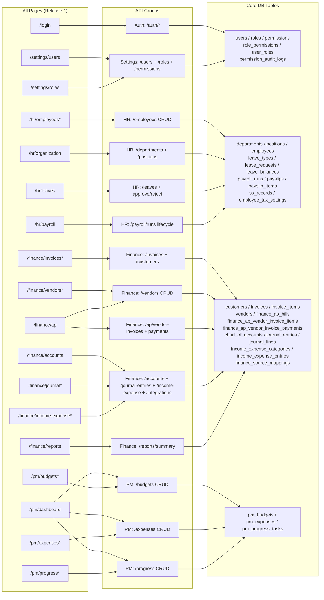
```mermaid
flowchart LR
  subgraph PAGES["All Pages (Release 1)"]
    P_LG["/login"]
    P_HR_E["/hr/employees*"]
    P_HR_O["/hr/organization"]
    P_HR_L["/hr/leaves"]
    P_HR_P["/hr/payroll"]
    P_FIN_I["/finance/invoices*"]
    P_FIN_V["/finance/vendors*"]
    P_FIN_AP["/finance/ap"]
    P_FIN_ACC["/finance/accounts"]
    P_FIN_JNL["/finance/journal*"]
    P_FIN_IE["/finance/income-expense*"]
    P_FIN_R["/finance/reports"]
    P_PM_D["/pm/dashboard"]
    P_PM_B["/pm/budgets*"]
    P_PM_E["/pm/expenses*"]
    P_PM_P["/pm/progress*"]
    P_SET_U["/settings/users"]
    P_SET_R["/settings/roles"]
  end

  subgraph APIS["API Groups"]
    A_AUTH_G["Auth: /auth/*"]
    A_HR_EMP_G["HR: /employees CRUD"]
    A_HR_ORG_G["HR: /departments + /positions"]
    A_HR_LEA_G["HR: /leaves + approve/reject"]
    A_HR_PAY_G["HR: /payroll/runs lifecycle"]
    A_FIN_INV_G["Finance: /invoices + /customers"]
    A_FIN_VEN_G["Finance: /vendors CRUD"]
    A_FIN_AP_G["Finance: /ap/vendor-invoices + payments"]
    A_FIN_ACC_G["Finance: /accounts + /journal-entries + /income-expense + /integrations"]
    A_FIN_RPT_G["Finance: /reports/summary"]
    A_PM_BUD_G["PM: /budgets CRUD"]
    A_PM_EXP_G["PM: /expenses CRUD"]
    A_PM_PRG_G["PM: /progress CRUD"]
    A_SET_G["Settings: /users + /roles + /permissions"]
  end

  subgraph TABLES["Core DB Tables"]
    T_AUTH_G["users / roles / permissions\nrole_permissions / user_roles\npermission_audit_logs"]
    T_HR_G["departments / positions / employees\nleave_types / leave_requests / leave_balances\npayroll_runs / payslips / payslip_items\nss_records / employee_tax_settings"]
    T_FIN_G["customers / invoices / invoice_items\nvendors / finance_ap_bills\nfinance_ap_vendor_invoice_items\nfinance_ap_vendor_invoice_payments\nchart_of_accounts / journal_entries / journal_lines\nincome_expense_categories / income_expense_entries\nfinance_source_mappings"]
    T_PM_G["pm_budgets / pm_expenses / pm_progress_tasks"]
  end

  P_LG --> A_AUTH_G
  P_HR_E --> A_HR_EMP_G
  P_HR_O --> A_HR_ORG_G
  P_HR_L --> A_HR_LEA_G
  P_HR_P --> A_HR_PAY_G
  P_FIN_I --> A_FIN_INV_G
  P_FIN_V --> A_FIN_VEN_G
  P_FIN_AP --> A_FIN_AP_G
  P_FIN_AP --> A_FIN_VEN_G
  P_FIN_ACC --> A_FIN_ACC_G
  P_FIN_JNL --> A_FIN_ACC_G
  P_FIN_IE --> A_FIN_ACC_G
  P_FIN_R --> A_FIN_RPT_G
  P_PM_D --> A_PM_BUD_G
  P_PM_D --> A_PM_EXP_G
  P_PM_D --> A_PM_PRG_G
  P_PM_B --> A_PM_BUD_G
  P_PM_E --> A_PM_EXP_G
  P_PM_P --> A_PM_PRG_G
  P_SET_U --> A_SET_G
  P_SET_R --> A_SET_G

  A_AUTH_G --> T_AUTH_G
  A_HR_EMP_G --> T_HR_G
  A_HR_ORG_G --> T_HR_G
  A_HR_LEA_G --> T_HR_G
  A_HR_PAY_G --> T_HR_G
  A_FIN_INV_G --> T_FIN_G
  A_FIN_VEN_G --> T_FIN_G
  A_FIN_AP_G --> T_FIN_G
  A_FIN_ACC_G --> T_FIN_G
  A_FIN_RPT_G --> T_FIN_G
  A_PM_BUD_G --> T_PM_G
  A_PM_EXP_G --> T_PM_G
  A_PM_PRG_G --> T_PM_G
  A_SET_G --> T_AUTH_G
```

---

## Cross-Module Integration Map — Release 1

แผนผังแสดงการส่งข้อมูลข้ามโมดูลทั้งหมดใน R1 รวม Gap A และ Gap B

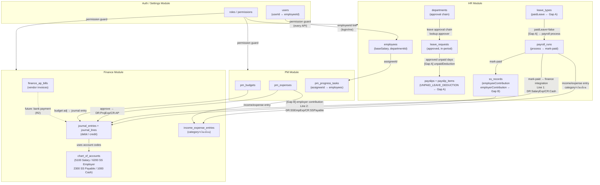
```mermaid
flowchart TD
  subgraph AUTH["Auth / Settings Module"]
    USERS_X["users\n(userId ↔ employeeId)"]
    ROLES_X["roles / permissions"]
  end

  subgraph HR["HR Module"]
    EMP_X["employees\n(baseSalary, departmentId)"]
    DEPT_X["departments\n(approval chain)"]
    LEAVE_TYPES_X["leave_types\n(paidLeave ← Gap A)"]
    LEAVE_REQ_X["leave_requests\n(approved, in-period)"]
    PAY_RUN_X["payroll_runs\n(process → mark-paid)"]
    PAYSLIP_X["payslips + payslip_items\n(UNPAID_LEAVE_DEDUCTION ← Gap A)"]
    SS_X["ss_records\n(employeeContribution\nemployerContribution ← Gap B)"]
  end

  subgraph FINANCE["Finance Module"]
    JE_X["journal_entries + journal_lines\n(debit / credit)"]
    IE_X["income_expense_entries\n(category=เงินเดือน)"]
    COA_X["chart_of_accounts\n(5100 Salary / 6200 SS Employer\n2300 SS Payable / 1000 Cash)"]
    AP_X["finance_ap_bills\n(vendor invoices)"]
  end

  subgraph PM["PM Module"]
    PM_BUD_X["pm_budgets"]
    PM_EXP_X["pm_expenses"]
    PM_PROG_X["pm_progress_tasks\n(assigneeId → employees)"]
  end

  USERS_X -->|"employeeId link\n(login/me)"| EMP_X
  ROLES_X -->|"permission guard\n(every API)"| HR
  ROLES_X -->|"permission guard"| FINANCE
  ROLES_X -->|"permission guard"| PM

  DEPT_X -->|"leave approval chain\nlookup approver"| LEAVE_REQ_X
  LEAVE_TYPES_X -->|"paidLeave=false\n[Gap A] → payroll process"| PAY_RUN_X
  LEAVE_REQ_X -->|"approved unpaid days\n[Gap A] unpaidDeduction"| PAYSLIP_X
  EMP_X -->|"assigneeId"| PM_PROG_X

  PAY_RUN_X -->|"mark-paid"| SS_X
  PAY_RUN_X -->|"mark-paid → finance integration\nLine 1: DR:SalaryExp/CR:Cash"| JE_X
  SS_X -->|"[Gap B] employer contribution\nLine 2: DR:SSEmpExp/CR:SSPayable"| JE_X
  PAY_RUN_X -->|"income/expense entry\ncategory=เงินเดือน"| IE_X

  PM_EXP_X -->|"approve → DR:ProjExp/CR:AP"| JE_X
  PM_EXP_X -->|"income/expense entry"| IE_X
  PM_BUD_X -->|"budget adj → journal entry"| JE_X

  JE_X -->|"uses account codes"| COA_X
  AP_X -.->|"future: bank payment\n(R2)"| JE_X
```
