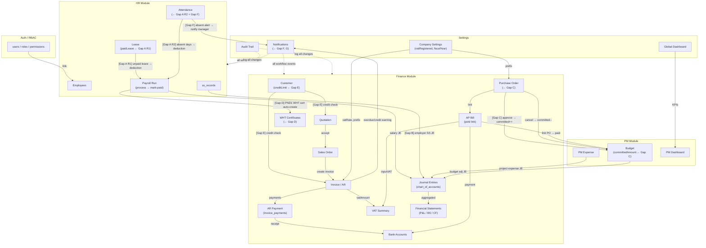

# Release 2 - Full Requirements Document

เอกสารนี้รวม baseline จาก Release 1 + feature ใหม่ทั้ง 13 รายการสำหรับ Release 2
อ้างอิง: `Documents/Release_1.md`, `Documents/Release_1_traceability_mermaid.md`

---

## 1) เป้าหมาย Release 2

Release 2 ขยายต่อจาก Release 1 เพื่อให้ระบบ ERP พร้อมใช้งานจริงสำหรับ SME ไทย:

- **ปิด Gap ที่ขาด**: Customer CRUD, AR Payment, Thai Tax, Financial Statements, Bank Management
- **เพิ่ม Procurement Workflow**: Purchase Order → Goods Receipt → AP Bill (3-way matching)
- **เพิ่ม Sales Workflow**: Quotation → Sales Order → Invoice pipeline
- **เปิด Attendance**: เปิด route ของ schema ที่มีอยู่แล้ว + integrate กับ Payroll
- **Infrastructure**: Company Settings, PDF Export, Notifications, Audit Trail, Global Dashboard

**Target Users**: Finance Manager, Accountant, HR Admin, PM Manager, Procurement Officer, CEO/Management
**Business Context**: Service-based + Light-trading SME ไทย

---

## 2) สิ่งที่มีแล้วจาก Release 1 (Baseline)

> รายละเอียดเต็มอยู่ใน `Documents/Release_1.md`

| Module | Feature |
|---|---|
| **Auth** | Login/Logout/Refresh JWT, Change password, Session redirect |
| **RBAC** | Role + permission (`module:resource:action`), super_admin bypass, permission audit log |
| **HR** | Employee CRUD + terminate, Department/Position CRUD, Leave request/approve/reject, Payroll run workflow (create→process→approve→mark-paid) + payslip |
| **Finance** | Invoice list/create/detail, Vendor CRUD + activate, AP (vendor invoice) create/list/approve/reject/payment, Finance summary report, Chart of Accounts, Journal Entries, Income/Expense Ledger, cross-module auto-post |
| **PM** | Dashboard KPI, Budget CRUD + summary, Expense CRUD + status, Progress task CRUD + summary |
| **Settings** | User management (role + activate), Role management + permission matrix |

---

## 3) New Features (Release 2)

---

### 3.1 Customer Management (Full CRUD)

#### Business Purpose
- ลูกค้า (Customer) เป็น core entity ของ AR cycle — ทุก ERP ต้องจัดการข้อมูลลูกค้าได้ครบเหมือน Vendor
- ปัจจุบันมีแค่ `GET /customers` สำหรับ dropdown ตอนสร้าง invoice เท่านั้น
- ต้องการ: สร้าง/แก้ไข/ปิดการใช้งาน customer, เก็บ credit limit, contact info, tax ID
- ใช้ใน: Invoice, Quotation, Sales Order, AR Aging Report

#### DB Schema

**ตาราง `customers` (มีอยู่แล้ว — เพิ่ม fields)**
```sql
ALTER TABLE customers ADD COLUMN code         VARCHAR UNIQUE;        -- รหัสลูกค้า เช่น CUST-001
ALTER TABLE customers ADD COLUMN taxId        VARCHAR;               -- เลขผู้เสียภาษี 13 หลัก
ALTER TABLE customers ADD COLUMN address      TEXT;                  -- ที่อยู่ออกใบกำกับ
ALTER TABLE customers ADD COLUMN contactName  VARCHAR;               -- ชื่อผู้ติดต่อ
ALTER TABLE customers ADD COLUMN phone        VARCHAR;
ALTER TABLE customers ADD COLUMN email        VARCHAR;
ALTER TABLE customers ADD COLUMN creditLimit  DECIMAL(15,2) DEFAULT 0;   -- วงเงินเครดิต
ALTER TABLE customers ADD COLUMN creditTermDays INT DEFAULT 30;           -- เทอมการชำระ (วัน)
ALTER TABLE customers ADD COLUMN isActive     BOOLEAN DEFAULT TRUE;
ALTER TABLE customers ADD COLUMN deletedAt    TIMESTAMP;             -- soft delete
ALTER TABLE customers ADD COLUMN notes        TEXT;
```

#### New API Endpoints

| Method | Path | คำอธิบาย |
|---|---|---|
| `GET` | `/api/finance/customers` | List + search + pagination (upgrade จากเดิม) |
| `GET` | `/api/finance/customers/options` | Dropdown สำหรับ Invoice/Quotation/SO |
| `GET` | `/api/finance/customers/:id` | Customer detail + AR summary |
| `POST` | `/api/finance/customers` | สร้าง customer ใหม่ |
| `PATCH` | `/api/finance/customers/:id` | แก้ไขข้อมูล customer |
| `PATCH` | `/api/finance/customers/:id/activate` | Toggle active/inactive |
| `DELETE` | `/api/finance/customers/:id` | Soft delete (ตั้ง deletedAt) |

**Query Params (GET list)**: `page`, `limit`, `search` (code/name/taxId), `isActive`

**Request Body (POST)**
```json
{
  "code": "CUST-001",
  "name": "ABC Trading Co.,Ltd.",
  "taxId": "0105547000001",
  "address": "123 สุขุมวิท กรุงเทพฯ 10110",
  "contactName": "คุณสมชาย",
  "phone": "021234567",
  "email": "ap@abctrading.com",
  "creditLimit": 500000,
  "creditTermDays": 30
}
```

#### Frontend Pages

| Path | คำอธิบาย |
|---|---|
| `/finance/customers` | List table: code, name, taxId, creditLimit, status + search + filter |
| `/finance/customers/new` | Create form |
| `/finance/customers/:id` | Detail: ข้อมูล + แท็บ "Invoice history" + outstanding AR |
| `/finance/customers/:id/edit` | Edit form |

#### Business Rules
- `code` ต้อง unique ทั่วทั้ง system, auto-generate ได้ถ้าว่าง
- ลบไม่ได้ถ้ามี invoice ที่ยังค้างชำระ (status != paid/voided)
- `creditLimit` ใช้ warning เมื่อสร้าง invoice เกินวงเงิน (ไม่ block)
- **[Gap E] Credit Check → Invoice/Quotation**: ตรวจ outstanding AR เมื่อสร้าง invoice/quotation
  - `currentAR` = `SUM(invoices.balanceDue)` WHERE `customerId = this` AND `status IN ('sent','partially_paid','overdue')`
  - ถ้า `currentAR + newInvoiceAmount > creditLimit` → response เพิ่ม `creditWarning`:
    ```json
    { "creditWarning": { "currentAR": 320000, "creditLimit": 500000, "excess": 120000 } }
    ```
  - FE แสดง warning dialog ยังอนุญาตให้ผ่าน (soft block — ไม่ใช่ hard reject)
  - ลูกค้าที่มี invoice `status = overdue` → แสดง badge `⚠ มียอดค้างชำระ` ในหน้า customer detail และ dropdown ตอนเลือก customer

#### Integration
- Invoice/Quotation create: ดึง customer จาก `/options` — ส่ง `creditWarning` ถ้าเกินวงเงิน **[Gap E]**
- AR Payment report: group by customer — แสดง aging per customer
- Quotation / Sales Order: ใช้ customer เดียวกัน
- Notification: ถ้า invoice overdue → แจ้ง finance team (ดู Feature 3.10) **[Gap G]**

---

### 3.2 AR Payment Tracking

#### Business Purpose
- Invoice สร้างได้แต่ไม่มีระบบบันทึกการรับชำระเงิน (payment/receipt)
- ปัจจุบัน `reports/summary` อ่าน AR balance จาก invoice total ตรงๆ — ไม่ accurate เมื่อมีการจ่ายบางส่วน (partial payment)
- ต้องการ: บันทึก payment per invoice, คำนวณ balance due แบบ real-time, AR aging

#### DB Schema

**ตารางใหม่: `invoice_payments`**
```sql
CREATE TABLE invoice_payments (
  id             UUID PRIMARY KEY DEFAULT gen_random_uuid(),
  invoiceId      UUID NOT NULL REFERENCES invoices(id),
  paymentDate    DATE NOT NULL,
  amount         DECIMAL(15,2) NOT NULL,               -- ยอดรับชำระ
  paymentMethod  VARCHAR NOT NULL,                      -- bank_transfer/cash/cheque/other
  bankAccountId  UUID REFERENCES bank_accounts(id),    -- บัญชีที่รับเงิน (FK จาก Feature 3.5)
  referenceNo    VARCHAR,                               -- เลขที่ slip/cheque
  notes          TEXT,
  createdBy      UUID NOT NULL REFERENCES users(id),
  createdAt      TIMESTAMP DEFAULT NOW()
);
```

**อัพเดต `invoices` (เพิ่ม fields)**
```sql
ALTER TABLE invoices ADD COLUMN paidAmount      DECIMAL(15,2) DEFAULT 0;  -- cached: sum ของ payments
ALTER TABLE invoices ADD COLUMN balanceDue      DECIMAL(15,2);             -- computed: total - paidAmount
-- status update: draft | sent | partially_paid | paid | overdue | voided
ALTER TABLE invoices ADD COLUMN sentAt         TIMESTAMP;                  -- วันที่ส่ง
ALTER TABLE invoices ADD COLUMN voidedAt        TIMESTAMP;
ALTER TABLE invoices ADD COLUMN voidedBy        UUID REFERENCES users(id);
```

#### New API Endpoints

| Method | Path | คำอธิบาย |
|---|---|---|
| `POST` | `/api/finance/invoices/:id/payments` | บันทึกการรับชำระเงิน |
| `GET` | `/api/finance/invoices/:id/payments` | ดูประวัติการรับชำระ |
| `PATCH` | `/api/finance/invoices/:id/status` | เปลี่ยน status: sent / void |
| `GET` | `/api/finance/reports/ar-aging` | รายงาน AR aging (0-30, 31-60, 61-90, 90+ วัน) |

**Request Body (POST payment)**
```json
{
  "paymentDate": "2026-04-20",
  "amount": 10000,
  "paymentMethod": "bank_transfer",
  "bankAccountId": "bk_001",
  "referenceNo": "TRF-20260420-001",
  "notes": "โอนเงินงวดแรก"
}
```

**Business Logic (BE)**:
1. รับ payment → UPDATE `invoices.paidAmount` += amount
2. คำนวณ `balanceDue` = totalAmount - paidAmount
3. ถ้า balanceDue = 0 → UPDATE status = 'paid'
4. ถ้า 0 < paidAmount < total → UPDATE status = 'partially_paid'
5. สร้าง journal entry: DR Bank Account / CR AR

**Visibility Contract (payment -> bank movement)**
```json
{
  "data": {
    "invoiceId": "inv_001",
    "paymentId": "ip_001",
    "bankMovement": {
      "transactionId": "txn_001",
      "bankAccountId": "bk_001",
      "referenceType": "invoice_payment",
      "referenceId": "ip_001",
      "sourceModule": "finance_ar",
      "direction": "deposit",
      "amount": 10000,
      "visibleInHistory": true,
      "visibleInBankAccountDetail": true
    }
  }
}
```

#### Frontend Pages

| Path | การเปลี่ยนแปลง |
|---|---|
| `/finance/invoices/:id` | เพิ่ม section "Payment History" table + "Add Payment" button + balance due indicator |
| `/finance/invoices` | เพิ่ม column balance due, update status badge (partially_paid) |
| `/finance/reports` | เพิ่ม link ไป AR Aging report |
| `/finance/reports/ar-aging` | (ใหม่) ตาราง aging grouped by customer + summary |

#### Integration
- Bank Account: ต้องเลือกบัญชีที่รับเงิน (Feature 3.5)
- Journal: auto-post เมื่อบันทึก payment
- Finance Summary Report: ต้อง update ให้ใช้ `balanceDue` แทน totalAmount
- response ของ payment history หรือ invoice detail ต้องสามารถอ้างกลับไป bank movement ได้ด้วย `transactionId`, `referenceType`, `referenceId` เพื่อให้ FE แสดง deep link ไปประวัติธนาคารได้

---

### 3.3 Thai Tax: VAT + Withholding Tax (WHT)

#### Business Purpose
- **VAT 7%**: ทุก invoice AR และ AP bill ต้องแยก subtotal / VAT / total ได้ชัดเจน
- **Withholding Tax (WHT)**: เมื่อจ่าย AP bill ต้องหักภาษี ณ ที่จ่ายได้ตาม rate (1%, 3%, 5%, 15%)
- **PND Reports**: PND 1 (พนักงาน), PND 3 (บุคคลธรรมดา), PND 53 (นิติบุคคล) — สรุปรายเดือนเพื่อนำส่ง สรรพากร
- **VAT Report**: PP.30 monthly — สรุป input VAT vs output VAT, ยอดที่ต้องนำส่ง
- ไม่มีสิ่งนี้ = ระบบใช้งานในไทยไม่ได้จริง

#### DB Schema

**ตารางใหม่: `tax_rates`**
```sql
CREATE TABLE tax_rates (
  id          UUID PRIMARY KEY DEFAULT gen_random_uuid(),
  type        VARCHAR NOT NULL,         -- 'VAT' | 'WHT'
  code        VARCHAR UNIQUE NOT NULL,  -- 'VAT7', 'WHT3_SERVICE', 'WHT5_RENTAL'
  rate        DECIMAL(5,2) NOT NULL,    -- % rate
  description VARCHAR NOT NULL,         -- ชื่อแสดงผล
  pndForm     VARCHAR,                  -- 'PND1' | 'PND3' | 'PND53' (WHT เท่านั้น)
  incomeType  VARCHAR,                  -- ประเภทเงินได้ (40(2), 40(3), etc.)
  isActive    BOOLEAN DEFAULT TRUE,
  createdAt   TIMESTAMP DEFAULT NOW()
);
-- Seed data: VAT 7%, WHT 1%/3%/5%/15% etc.
```

**ตารางใหม่: `wht_certificates`**
```sql
CREATE TABLE wht_certificates (
  id             UUID PRIMARY KEY DEFAULT gen_random_uuid(),
  certificateNo  VARCHAR UNIQUE NOT NULL,      -- เลขใบรับรองหักภาษี ณ ที่จ่าย
  vendorId       UUID REFERENCES vendors(id),  -- ใช้กับ AP-origin (PND3/53)
  employeeId     UUID REFERENCES employees(id), -- ใช้กับ payroll-origin (PND1)
  apBillId       UUID REFERENCES finance_ap_bills(id),
  pndForm        VARCHAR NOT NULL,             -- PND1 | PND3 | PND53
  incomeType     VARCHAR NOT NULL,             -- ประเภทเงินได้
  baseAmount     DECIMAL(15,2) NOT NULL,       -- ยอดฐานก่อนหัก
  whtRate        DECIMAL(5,2) NOT NULL,        -- อัตรา %
  whtAmount      DECIMAL(15,2) NOT NULL,       -- ยอดภาษีที่หัก = baseAmount × whtRate/100
  issuedDate     DATE NOT NULL,
  createdBy      UUID NOT NULL REFERENCES users(id),
  createdAt      TIMESTAMP DEFAULT NOW()
);
```

**อัพเดต `invoices`**
```sql
ALTER TABLE invoices ADD COLUMN subtotalBeforeVat DECIMAL(15,2);   -- ยอดรวมก่อน VAT
ALTER TABLE invoices ADD COLUMN vatRate           DECIMAL(5,2) DEFAULT 7.00;
ALTER TABLE invoices ADD COLUMN vatAmount         DECIMAL(15,2) DEFAULT 0;
ALTER TABLE invoices ADD COLUMN whtRate           DECIMAL(5,2);     -- optional
ALTER TABLE invoices ADD COLUMN whtAmount         DECIMAL(15,2) DEFAULT 0;
-- totalAmount = subtotalBeforeVat + vatAmount - whtAmount
```

**อัพเดต `finance_ap_bills`**
```sql
ALTER TABLE finance_ap_bills ADD COLUMN subtotalBeforeVat DECIMAL(15,2);
ALTER TABLE finance_ap_bills ADD COLUMN vatRate           DECIMAL(5,2) DEFAULT 7.00;
ALTER TABLE finance_ap_bills ADD COLUMN vatAmount         DECIMAL(15,2) DEFAULT 0;
ALTER TABLE finance_ap_bills ADD COLUMN whtRate           DECIMAL(5,2);
ALTER TABLE finance_ap_bills ADD COLUMN whtAmount         DECIMAL(15,2) DEFAULT 0;
ALTER TABLE finance_ap_bills ADD COLUMN netPayable        DECIMAL(15,2);
-- netPayable = subtotalBeforeVat + vatAmount - whtAmount
```

**อัพเดต `invoice_items`**
```sql
ALTER TABLE invoice_items ADD COLUMN vatRate   DECIMAL(5,2) DEFAULT 7.00;
ALTER TABLE invoice_items ADD COLUMN vatAmount DECIMAL(15,2) DEFAULT 0;
-- `lineTotal` มีอยู่แล้วใน R1 schema; ใช้ field เดิมต่อเนื่อง ไม่ต้อง ALTER ซ้ำ
```

#### New API Endpoints

| Method | Path | คำอธิบาย |
|---|---|---|
| `GET` | `/api/finance/tax/rates` | List tax rates (VAT + WHT) |
| `POST` | `/api/finance/tax/rates` | เพิ่ม tax rate |
| `PATCH` | `/api/finance/tax/rates/:id` | แก้ไข tax rate |
| `PATCH` | `/api/finance/tax/rates/:id/activate` | Toggle active |
| `GET` | `/api/finance/tax/vat-summary` | สรุป VAT รายเดือน (output VAT - input VAT) |
| `GET` | `/api/finance/tax/wht-certificates` | List WHT certificates |
| `POST` | `/api/finance/tax/wht-certificates` | ออกใบรับรองหัก ณ ที่จ่าย |
| `GET` | `/api/finance/tax/wht-certificates/:id/pdf` | Download WHT certificate PDF |
| `GET` | `/api/finance/tax/pnd-report` | สรุป PND report (query: `form`, `month`, `year`) |
| `GET` | `/api/finance/tax/pnd-report/export` | Export PND report (PDF/Excel) |

**Response: GET vat-summary** (query: `month=4&year=2026`)
```json
{
  "data": {
    "period": "2026-04",
    "outputVat": 21000,
    "inputVat": 14000,
    "netVatPayable": 7000,
    "invoiceCount": 20,
    "apBillCount": 14
  }
}
```

#### Frontend Pages

| Path | คำอธิบาย |
|---|---|
| `/finance/tax` | Tax hub: VAT summary card + WHT summary card + links |
| `/finance/tax/vat-report` | VAT monthly: input vs output, net payable, drill-down list |
| `/finance/tax/wht` | WHT certificates list + create + download PDF |

#### Business Rules
- Invoice create: ถ้า company `vatRegistered=true` → ต้อง compute VAT ทุก item
- AP bill + WHT: เมื่อ approve payment → ระบบ prompt ให้สร้าง WHT certificate
- PND report: group by pndForm + incomeType, sum whtAmount ต่อเดือน
- `certificateNo` auto-generate: `WHT-{YEAR}-{SEQ}`
- certificate หนึ่งใบต้องมี source หลักเพียงทางเดียว: AP-origin ใช้ `vendorId`/`apBillId`; payroll-origin ใช้ `employeeId`

#### Integration
- **[Gap D] Payroll WHT → WHT Certificate Auto-Create**: หลัง payroll `mark-paid`
  - loop พนักงานทุกคนที่มี `payslip_items.code = 'WHT'` AND `amount > 0`
  - Auto-create `wht_certificates` ต่อพนักงาน 1 ใบต่อ run:
    - `pndForm = 'PND1'`
    - `incomeType = '40(1) เงินเดือนค่าจ้าง'`
    - `baseAmount` = grossSalary ของพนักงาน
    - `whtRate` = % จาก payslip_items
    - `whtAmount` = ยอด WHT จาก payslip
    - `employeeId` = employees.id (payee ฝั่ง PND1 ใช้พนักงาน ไม่ใช่ vendor)
    - `vendorId` และ `apBillId` ต้องเป็น `null` สำหรับ payroll-origin row
  - รวมยอด WHT ทั้งหมดเข้า PND1 report รายเดือนอัตโนมัติ
- **AP Bill + WHT**: approve payment → prompt user สร้าง certificate (PND3/53) — semi-automatic
- **Invoice VAT**: `POST /finance/invoices` คำนวณ `vatAmount` แล้ว feed เข้า `/tax/vat-summary`

---

### 3.4 Financial Statements

#### Business Purpose
- Finance team ต้องการงบการเงินมาตรฐาน ทุกเดือน:
  - **P&L (Profit & Loss)**: รายรับ − รายจ่าย = กำไรสุทธิ
  - **Balance Sheet**: สินทรัพย์ = หนี้สิน + ส่วนของผู้ถือหุ้น
  - **Cash Flow Statement**: เงินสดต้นงวด + in/out = เงินสดปลายงวด
- ใช้สำหรับ: รายงานต่อผู้บริหาร, ยื่น bank/investor, ตรวจสอบภายใน

#### DB Schema
ไม่มีตารางใหม่ — อ่านจาก existing tables โดยใช้ account type ใน `chart_of_accounts`:

| Account Type | ใช้ใน |
|---|---|
| `income` | P&L — Revenue section |
| `expense` | P&L — Expense / COGS sections |
| `asset` | Balance Sheet — Assets |
| `liability` | Balance Sheet — Liabilities |
| `equity` | Balance Sheet — Equity |

**ต้องตรวจสอบ**: `chart_of_accounts.type` ต้องมีค่าครบตามหมวดบัญชี และ `income_expense_categories` ต้อง map ถูกต้อง

**Source ข้อมูลต่อ Statement:**
- **P&L**: aggregate `journal_lines` JOIN `chart_of_accounts` grouped by `chart_of_accounts.type` + account, filter by period
- **Balance Sheet**: cumulative `journal_lines` balance per account up to `asOfDate`
- **Cash Flow**: `bank_transactions` + payroll payments + AP payments grouped by type

#### New API Endpoints

| Method | Path | คำอธิบาย |
|---|---|---|
| `GET` | `/api/finance/reports/profit-loss` | P&L Statement |
| `GET` | `/api/finance/reports/balance-sheet` | Balance Sheet |
| `GET` | `/api/finance/reports/cash-flow` | Cash Flow Statement |
| `GET` | `/api/finance/reports/profit-loss/export` | Export PDF/Excel |
| `GET` | `/api/finance/reports/balance-sheet/export` | Export PDF/Excel |
| `GET` | `/api/finance/reports/cash-flow/export` | Export PDF/Excel |
| `GET` | `/api/finance/reports/ar-aging` | AR Aging report (0-30/31-60/61-90/90+) |

**Query Params:**
- P&L: `periodFrom` (YYYY-MM), `periodTo` (YYYY-MM), `comparePrevious` (boolean)
- Balance Sheet: `asOfDate` (YYYY-MM-DD)
- Cash Flow: `periodFrom`, `periodTo`
- Export: เพิ่ม `format` (pdf / xlsx)

**Response: P&L Sample**
```json
{
  "data": {
    "series": [
      {
        "section": "revenue",
        "accountCode": "4001",
        "accountName": "Service Revenue",
        "amount": 850000,
        "compareAmount": 810000
      },
      {
        "section": "expense",
        "accountCode": "5001",
        "accountName": "Salary Expense",
        "amount": 320000,
        "compareAmount": 300000
      },
      {
        "section": "expense",
        "accountCode": "5002",
        "accountName": "Operating Expense",
        "amount": 85000,
        "compareAmount": 76000
      }
    ],
    "totals": {
      "revenue": 850000,
      "expenses": 405000,
      "netProfit": 445000
    },
    "meta": {
      "periodFrom": "2026-01",
      "periodTo": "2026-04",
      "comparePrevious": true,
      "lastUpdatedAt": "2026-04-30T18:00:00Z",
      "disclaimer": null,
      "isEstimated": false
    }
  }
}
```

> Balance Sheet และ Cash Flow ใช้ envelope เดียวกันคือ `data.series[]`, `data.totals`, `data.meta`; ต่างกันที่ `section`/key ใน `totals` และ metadata ของแต่ละ statement

#### Frontend Pages

| Path | คำอธิบาย |
|---|---|
| `/finance/reports` | Update เป็น Reports Hub พร้อม links ทุก report |
| `/finance/reports/profit-loss` | P&L: period selector, comparison toggle, printable layout |
| `/finance/reports/balance-sheet` | Balance Sheet: as-of-date picker, account tree |
| `/finance/reports/cash-flow` | Cash Flow: period selector, 3 sections (operating/investing/financing) |
| `/finance/reports/ar-aging` | AR Aging: aging buckets per customer |

---

### 3.5 Cash / Bank Management

#### Business Purpose
- บริษัทมีบัญชีธนาคารหลายบัญชี (กสิกรไทย, ไทยพาณิชย์, etc.)
- เมื่อจ่าย AP หรือรับชำระ AR ต้องระบุว่าใช้บัญชีไหน
- Bank reconciliation: เทียบ statement ธนาคารกับรายการในระบบ
- ดูยอดเงินสดแต่ละบัญชีได้ real-time

#### DB Schema

**ตารางใหม่: `bank_accounts`**
```sql
CREATE TABLE bank_accounts (
  id              UUID PRIMARY KEY DEFAULT gen_random_uuid(),
  code            VARCHAR UNIQUE NOT NULL,    -- BK-001
  accountName     VARCHAR NOT NULL,           -- "บัญชีดำเนินการหลัก"
  accountNo       VARCHAR NOT NULL,           -- เลขที่บัญชี
  bankName        VARCHAR NOT NULL,           -- "ธนาคารกสิกรไทย"
  branchName      VARCHAR,
  accountType     VARCHAR DEFAULT 'current',  -- current | savings
  currency        VARCHAR DEFAULT 'THB',
  openingBalance  DECIMAL(15,2) DEFAULT 0,
  currentBalance  DECIMAL(15,2) DEFAULT 0,    -- cached, recomputed on each transaction
  glAccountId     UUID REFERENCES chart_of_accounts(id),  -- map to GL account
  isActive        BOOLEAN DEFAULT TRUE,
  createdAt       TIMESTAMP DEFAULT NOW(),
  updatedAt       TIMESTAMP
);
```

**ตารางใหม่: `bank_transactions`**
```sql
CREATE TABLE bank_transactions (
  id              UUID PRIMARY KEY DEFAULT gen_random_uuid(),
  bankAccountId   UUID NOT NULL REFERENCES bank_accounts(id),
  transactionDate DATE NOT NULL,
  description     VARCHAR NOT NULL,
  amount          DECIMAL(15,2) NOT NULL,     -- บวก = เงินเข้า, ลบ = เงินออก
  type            VARCHAR NOT NULL,           -- deposit | withdrawal | transfer
  referenceType   VARCHAR,                    -- 'invoice_payment' | 'ap_payment' | 'payroll' | 'manual'
  referenceId     UUID,                       -- FK ไปยัง source document
  reconciled      BOOLEAN DEFAULT FALSE,
  reconciledAt    TIMESTAMP,
  reconciledBy    UUID REFERENCES users(id),
  createdBy       UUID NOT NULL REFERENCES users(id),
  createdAt       TIMESTAMP DEFAULT NOW()
);
```

**อัพเดต `finance_ap_vendor_invoice_payments`**
```sql
ALTER TABLE finance_ap_vendor_invoice_payments ADD COLUMN bankAccountId UUID REFERENCES bank_accounts(id);
```

#### New API Endpoints

| Method | Path | คำอธิบาย |
|---|---|---|
| `GET` | `/api/finance/bank-accounts` | List bank accounts + current balance |
| `POST` | `/api/finance/bank-accounts` | สร้างบัญชีธนาคาร |
| `GET` | `/api/finance/bank-accounts/:id` | Detail + balance |
| `PATCH` | `/api/finance/bank-accounts/:id` | Update |
| `PATCH` | `/api/finance/bank-accounts/:id/activate` | Toggle active |
| `GET` | `/api/finance/bank-accounts/:id/transactions` | List transactions + filter (date range, type, reconciled status) |
| `POST` | `/api/finance/bank-accounts/:id/transactions` | Manual entry (date, description, type, amount) |
| `POST` | `/api/finance/bank-accounts/:id/reconcile` | Batch reconcile: request body `{ transactionIds: [...] }` |
| `GET` | `/api/finance/bank-accounts/options` | Dropdown list (active only) — for AR/AP payment dropdowns |

#### Frontend Pages

| Path | คำอธิบาย |
|---|---|
| `/finance/bank-accounts` | List: code, name, bank, balance, status (active/inactive) + create/edit/deactivate actions |
| `/finance/bank-accounts/new` | Create form: code, name, bank, account number, branch, GL link, opening balance |
| `/finance/bank-accounts/:id` | Detail: ข้อมูลบัญชี + link to transactions |
| `/finance/bank-accounts/:id/transactions` | Transactions tab: list + filters (date range, type, reconciled status) + add manual entry button |
| `/finance/bank-accounts/:id/reconcile` | Reconcile page: transaction list with checkboxes + batch reconcile button |

#### Business Rules
- `currentBalance` recompute ทุกครั้งที่มี transaction: `openingBalance + SUM(deposits) - SUM(withdrawals)`
- ทุก transaction ต้องคำนวณ `runningBalance` (ยอดคงเหลือสะสม) — ใช้ประโยชน์สำหรับ audit และ reconciliation ตรวจสอบข้อมูล
- Manual entries ต้องระบุ type และ description
- **Reconcile (Batch Model)**: 
  - User เลือก checkbox หลายแถวพร้อมกัน แล้ว POST ไปยัง `/api/finance/bank-accounts/:id/reconcile`
  - Request body: `{ "transactionIds": ["uuid-1", "uuid-2", ...] }` 
  - System ทำเครื่องหมาย `reconciled = true` และตั้ง `reconciledAt`, `reconciledBy` สำหรับรายการที่เลือก
  - Response: `{ "reconciledCount": n, "matchedIds": [...], "reconciledAt": "...", "reconciledBy": "..." }`
- เมื่อ AP payment บันทึก → auto-create bank_transaction (withdrawal) พร้อม `referenceType="ap_payment"`, `referenceId=payment_id`, `sourceModule="finance_ap"`
- เมื่อ AR payment บันทึก → auto-create bank_transaction (deposit) พร้อม `referenceType="invoice_payment"`, `referenceId=payment_id`, `sourceModule="finance_ar"`
- `glAccountId` เป็น field canonical สำหรับผูก bank account เข้ากับ GL; ถ้ายังไม่ตั้งค่า ให้สร้าง/เปิดใช้งานบัญชีธนาคารได้ แต่ BE ต้องตอบ warning และ block เฉพาะ workflow ที่ต้อง auto-post เข้าบัญชีแยกประเภท
- หน้า bank history และ downstream modules ต้องใช้ `referenceType`, `referenceId`, `description`, `amount`, `reconciled`, `transactionDate`, `type`, `sourceModule` เป็น canonical read-model

---

### 3.6 Purchase Order (PO)

#### Business Purpose
- ควบคุมการสั่งซื้อ: ต้องมี PO ก่อนรับสินค้า/บริการ เพื่อป้องกันการจ่ายเงินโดยไม่ได้รับของ
- **3-Way Matching**: PO (อนุมัติสั่งซื้อ) → GR (รับสินค้า) → AP Bill (รับใบแจ้งหนี้) → Payment
- ลดความเสี่ยงการจ่ายเกิน / จ่ายซ้ำ
- เชื่อมกับ PM Budget: PO อาจอ้างอิง budget project

#### DB Schema

**ตารางใหม่: `purchase_orders`**
```sql
CREATE TABLE purchase_orders (
  id                   UUID PRIMARY KEY DEFAULT gen_random_uuid(),
  poNo                 VARCHAR UNIQUE NOT NULL,  -- PO-2026-0001
  vendorId             UUID NOT NULL REFERENCES vendors(id),
  requestedBy          UUID NOT NULL REFERENCES users(id),
  approvedBy           UUID REFERENCES users(id),
  approvedAt           TIMESTAMP,
  issueDate            DATE NOT NULL,
  expectedDeliveryDate DATE,
  departmentId         UUID REFERENCES departments(id),
  projectBudgetId      UUID REFERENCES pm_budgets(id),    -- link to PM budget
  status               VARCHAR NOT NULL DEFAULT 'draft',
  -- draft | submitted | approved | partially_received | received | closed | cancelled
  subtotal             DECIMAL(15,2) NOT NULL DEFAULT 0,
  vatAmount            DECIMAL(15,2) DEFAULT 0,
  totalAmount          DECIMAL(15,2) NOT NULL DEFAULT 0,
  notes                TEXT,
  createdAt            TIMESTAMP DEFAULT NOW(),
  updatedAt            TIMESTAMP
);
```

**ตารางใหม่: `po_items`**
```sql
CREATE TABLE po_items (
  id           UUID PRIMARY KEY DEFAULT gen_random_uuid(),
  poId         UUID NOT NULL REFERENCES purchase_orders(id),
  itemNo       INT NOT NULL,
  description  VARCHAR NOT NULL,
  quantity     DECIMAL(15,3) NOT NULL,
  unit         VARCHAR,                           -- ชิ้น / กล่อง / ชั่วโมง
  unitPrice    DECIMAL(15,2) NOT NULL,
  lineTotal    DECIMAL(15,2) NOT NULL,            -- quantity × unitPrice
  receivedQty  DECIMAL(15,3) DEFAULT 0           -- ยอดที่รับแล้วจาก GR
);
```

**ตารางใหม่: `goods_receipts`**
```sql
CREATE TABLE goods_receipts (
  id            UUID PRIMARY KEY DEFAULT gen_random_uuid(),
  grNo          VARCHAR UNIQUE NOT NULL,   -- GR-2026-0001
  poId          UUID NOT NULL REFERENCES purchase_orders(id),
  receivedDate  DATE NOT NULL,
  receivedBy    UUID NOT NULL REFERENCES users(id),
  notes         TEXT,
  createdAt     TIMESTAMP DEFAULT NOW()
);
```

**ตารางใหม่: `gr_items`**
```sql
CREATE TABLE gr_items (
  id           UUID PRIMARY KEY DEFAULT gen_random_uuid(),
  grId         UUID NOT NULL REFERENCES goods_receipts(id),
  poItemId     UUID NOT NULL REFERENCES po_items(id),
  receivedQty  DECIMAL(15,3) NOT NULL,
  notes        VARCHAR
);
```

**อัพเดต `finance_ap_bills`**
```sql
ALTER TABLE finance_ap_bills ADD COLUMN poId UUID REFERENCES purchase_orders(id);
-- เมื่อ link AP bill กับ PO → system check 3-way matching
```

**อัพเดต `pm_budgets` [Gap C] — Committed Amount Tracking**
```sql
ALTER TABLE pm_budgets ADD COLUMN committedAmount DECIMAL(15,2) DEFAULT 0;
-- committedAmount = SUM(purchase_orders.totalAmount) WHERE projectBudgetId = pm_budgets.id
--                    AND po.status IN ('submitted','approved','partially_received','received')
-- committedAmount ≠ actualSpend: committed = PO ที่อนุมัติแล้วแต่ยังไม่จ่ายเงิน
-- เมื่อ AP Bill ลิ้งค์กับ PO → committedAmount ลดลง + actualSpend เพิ่มขึ้น
```

#### New API Endpoints

| Method | Path | คำอธิบาย |
|---|---|---|
| `GET` | `/api/finance/purchase-orders` | List + filter (status, vendor, date) |
| `POST` | `/api/finance/purchase-orders` | สร้าง PO (status=draft) |
| `GET` | `/api/finance/purchase-orders/:id` | Detail + items + GR list + linked AP bills |
| `PATCH` | `/api/finance/purchase-orders/:id` | แก้ไข (draft เท่านั้น) |
| `PATCH` | `/api/finance/purchase-orders/:id/status` | submit / approve / cancel |
| `POST` | `/api/finance/purchase-orders/:id/goods-receipts` | สร้าง GR (ต้อง status=approved) |
| `GET` | `/api/finance/purchase-orders/:id/goods-receipts` | List GRs ของ PO |
| `GET` | `/api/finance/purchase-orders/:id/pdf` | Download PO PDF |
| `GET` | `/api/finance/purchase-orders/options` | Dropdown (approved PO ที่ยังไม่ครบ AP) |

**Status Flow**:
```
draft → submitted → approved → partially_received → received → closed
                ↘ cancelled
```

**Business Logic (3-Way Matching)**:
1. PO อนุมัติแล้ว → สามารถสร้าง GR ได้
2. GR บันทึก → UPDATE `po_items.receivedQty`
3. ถ้า receivedQty ครบทุก item → UPDATE PO status = 'received'
4. สร้าง AP Bill ได้เฉพาะ PO ที่ approved/received + ระบุ poId
5. AP Bill amount ไม่ควรเกิน PO totalAmount (warning)

**[Gap C] PO Committed → PM Budget Tracking**:
- PO อนุมัติ (`status = approved`) + มี `projectBudgetId` → `pm_budgets.committedAmount += po.totalAmount`
- PO ยกเลิก (`status = cancelled`) → `pm_budgets.committedAmount -= po.totalAmount`
- AP Bill ลิ้งค์กับ PO → `pm_budgets.committedAmount -= apBill.totalAmount` + `pm_budgets.actualSpend += apBill.totalAmount`
- Budget detail page แสดง 4 ยอด: `allocated | committed | actualSpend | available`
  - `available = allocated - committedAmount - actualSpend`

#### Integration [Gap C]
- **PO approve** → trigger budget commit: `PATCH /api/pm/budgets/:id/committed { delta: +poTotal }`
- **PO cancel** → reverse budget commit: `PATCH /api/pm/budgets/:id/committed { delta: -poTotal }`
- **AP Bill paid (linked PO)** → `committed -= amount`, `actualSpend += amount`
- ทุก side effect ข้างต้นต้องถือเป็น canonical contract ร่วมกัน 3 ส่วน:
  - trigger: approve / cancel / AP-linked payment เกิดเมื่อไร
  - write model: field ไหนถูก update (`committedAmount`, `actualSpend`)
  - FE read-back: หน้า budget detail ต้องเห็นผลผ่าน `GET /api/pm/budgets/:id` และ `/summary` โดยไม่ต้องคำนวณซ้ำฝั่ง FE

#### Frontend Pages

| Path | คำอธิบาย |
|---|---|
| `/finance/purchase-orders` | List: poNo, vendor, total, status + filter + action |
| `/finance/purchase-orders/new` | Create form: vendor, items table, expected date, budget link |
| `/finance/purchase-orders/:id` | Detail: PO info + items + GR history + linked AP bills |
| `/finance/ap` | Update: เพิ่ม field "Link to PO" เมื่อสร้าง AP bill |

---

### 3.7 Attendance & Time Tracking

#### Business Purpose
- บันทึกเวลาเข้า-ออกงานจริง ต่อพนักงาน ต่อวัน
- คำนวณจำนวนวันทำงานจริง + ชั่วโมง OT สำหรับใช้ใน payroll
- รองรับพนักงานรายวัน (daily rate) และ OT 1.5x / 2x ตามกฎหมายแรงงาน
- Schema ทั้งหมดมีอยู่แล้วใน `hr.schema.ts` — เพียงแต่ยังไม่เปิด route

#### DB Schema (มีอยู่แล้ว — เปิด route เท่านั้น)

| ตาราง | คำอธิบาย |
|---|---|
| `work_schedules` | กำหนดตารางงาน: เวลาเข้า-ออก, วันทำงาน (Mon-Fri), break time |
| `employee_schedules` | Assign schedule ให้พนักงาน (many-to-one) |
| `attendance_records` | บันทึก check-in/check-out จริง + computed workingHours, otHours |
| `holidays` | วันหยุดนักขัตฤกษ์ + วันหยุดบริษัท (ใช้ใน payroll + attendance) |
| `overtime_requests` | คำขอ OT: date, startTime, endTime, reason + status + approver |

**ต้องเพิ่ม business logic ใน payroll processing (R2 enhanced)**:
```
POST /api/hr/payroll/runs/:runId/process:
  1. ดึง attendance_records ใน payroll period

  2. [Gap A enhanced] Unpaid Leave via Attendance:
     absentDays = scheduledWorkingDays - actualWorkingDays - holidayDays
                  (สำหรับพนักงานที่ไม่ได้ submit leave_request แต่ขาดงานจริง)
     If attendance_records show absent without approved leave:
       → absentDeduction = (baseSalary / scheduledDays) × absentDays
       → INSERT payslip_items (ABSENT_DEDUCTION)
     Combined with R1 Gap A (unpaid leave_requests):
       totalDeduction = unpaidLeaveDeduction + absentDeduction

  3. พนักงานรายวัน: salary = (actualWorkingDays / scheduledDays) × baseSalary
  4. รวม approved overtime_requests ใน period:
     - OT weekday: hourlyRate × hours × 1.5
     - OT weekend/holiday: hourlyRate × hours × 2.0 (ตาม พรบ.คุ้มครองแรงงาน)
  5. เพิ่ม otPay เข้า payslip_items (OT_PAY)
```

**[Gap F] Absent Alert — Notification Trigger**:
```
Daily cron job (07:00):
  For each employee WHERE work_schedule = today (workday):
    IF no attendance_records.checkIn today AND no leave_requests (approved) today:
      → resolve recipientUserId จาก employees.departmentId -> departments.managerId -> users.employeeId
      → INSERT notifications (userId=recipientUserId,
          title='พนักงานไม่มาทำงาน',
          message='[ชื่อพนักงาน] ยังไม่ check-in วันนี้',
          entityType='attendance_records',
          actionUrl='/hr/attendance?employeeId=xxx&date=today')
```

#### New API Endpoints

| Method | Path | คำอธิบาย |
|---|---|---|
| `GET` | `/api/hr/work-schedules` | List schedules |
| `POST` | `/api/hr/work-schedules` | สร้าง schedule |
| `GET` | `/api/hr/work-schedules/:id` | Detail |
| `PATCH` | `/api/hr/work-schedules/:id` | Update |
| `POST` | `/api/hr/work-schedules/:id/assign` | Assign ให้ employees |
| `GET` | `/api/hr/attendance` | List attendance records (filter: employee, date range) |
| `POST` | `/api/hr/attendance/check-in` | บันทึก check-in |
| `PATCH` | `/api/hr/attendance/:id/check-out` | บันทึก check-out |
| `GET` | `/api/hr/attendance/summary` | Summary per employee ใน period |
| `GET` | `/api/hr/overtime` | List OT requests (filter: status, employee) |
| `POST` | `/api/hr/overtime` | สร้าง OT request |
| `GET` | `/api/hr/overtime/:id` | Detail |
| `PATCH` | `/api/hr/overtime/:id/approve` | Approve OT |
| `PATCH` | `/api/hr/overtime/:id/reject` | Reject OT |
| `GET` | `/api/hr/holidays` | List holidays |
| `POST` | `/api/hr/holidays` | เพิ่มวันหยุด |
| `DELETE` | `/api/hr/holidays/:id` | ลบวันหยุด |

#### Frontend Pages

| Path | คำอธิบาย |
|---|---|
| `/hr/attendance` | Daily log table + check-in/out form + summary stats + filter |
| `/hr/overtime` | OT request list + approve/reject (HR Admin) + create request (Employee) |
| `/hr/payroll` | Update: แสดง attendance summary ใน payroll run detail |

#### Business Rules
- Check-in ซ้ำในวันเดียวไม่ได้ (per employee)
- workingHours = checkOut - checkIn - breakTime
- otHours = max(0, workingHours - scheduledHours)
- holiday ไม่นับเป็น absent — ข้ามวันหยุดนักขัตฤกษ์
- **[Gap A enhanced]**: absent = ไม่มี check-in + ไม่มี approved leave → deduction ใน payroll
- **[Gap F]**: ขาดงานโดยไม่มี leave request → trigger notification ไปที่ manager (ดู Feature 3.10)

**Integration Payload Snapshot**
```json
{
  "attendanceSummary": {
    "employeeId": "emp_001",
    "periodFrom": "2026-04-01",
    "periodTo": "2026-04-30",
    "scheduledDays": 22,
    "actualWorkingDays": 20,
    "absentDays": 1,
    "paidLeaveDays": 1,
    "overtimeHoursWeekday": 6,
    "overtimeHoursHoliday": 2
  },
  "notificationEvent": {
    "eventType": "EMPLOYEE_ABSENT",
    "entityType": "attendance_records",
    "entityId": "att_001",
    "actionUrl": "/hr/attendance?employeeId=emp_001&date=2026-04-16"
  }
}
```

#### Integration กับ Payroll
- ตอน `POST /api/hr/payroll/runs/:runId/process`:
  - ดึง `attendance_records` ใน period
  - คำนวณ actual working days (สำหรับพนักงานรายวัน)
  - รวม `overtime_requests` ที่ approved ใน period
  - คำนวณ OT pay = OT hours × rate (1.5x หรือ 2x ตามกฎหมาย)
  - **[Gap A enhanced]** คำนวณ absentDays + deductionsจาก attendance
- payload ที่ส่งต่อหรือ log ระหว่าง attendance -> payroll ต้องมีอย่างน้อย `employeeId`, `periodFrom`, `periodTo`, `scheduledDays`, `actualWorkingDays`, `absentDays`, `overtimeHoursWeekday`, `overtimeHoursHoliday`

#### Integration กับ Notifications [Gap F]
- Cron job 07:00 ทุกวัน: scan พนักงานที่ absent โดยไม่มี leave → `NotificationService.send(manager)`
- API: ยังไม่มี endpoint เฉพาะ — ใช้ shared notification system (Feature 3.10)
- payload ที่ใช้สร้าง notification ต้องมี `eventType`, `entityType`, `entityId`, `actionUrl`, `message`, `recipientUserId`

---

### 3.8 Company / Organization Settings

#### Business Purpose
- ข้อมูลบริษัทใช้ใน header ของ invoice, payslip, AP bill, PO ที่ print/export
- Fiscal year กำหนดรอบบัญชี — ใช้ใน financial statements, closing period
- เป็น single source of truth: เปลี่ยนครั้งเดียว ทุก document ได้ update

#### DB Schema

**ตารางใหม่: `company_settings`** (singleton — มีแถวเดียว)
```sql
CREATE TABLE company_settings (
  id                UUID PRIMARY KEY DEFAULT gen_random_uuid(),
  companyName       VARCHAR NOT NULL,   -- ชื่อบริษัทภาษาไทย
  companyNameEn     VARCHAR,            -- ชื่อบริษัทภาษาอังกฤษ
  taxId             VARCHAR,            -- เลขนิติบุคคล 13 หลัก
  address           TEXT,
  phone             VARCHAR,
  email             VARCHAR,
  website           VARCHAR,
  logoUrl           VARCHAR,            -- S3/CDN path ของ logo
  currency          VARCHAR DEFAULT 'THB',
  fiscalYearStart   INT DEFAULT 1,      -- 1 = January, 4 = April (สำหรับ Apr-Mar FY)
  fiscalYearStartDay INT DEFAULT 1,     -- วันเริ่มต้นในเดือน (1–28); จำกัด 28 เพื่อหลีกเลี่ยง edge case ก.พ.
  vatRegistered     BOOLEAN DEFAULT FALSE,
  vatNo             VARCHAR,            -- เลขทะเบียนภาษีมูลค่าเพิ่ม
  defaultVatRate    DECIMAL(5,2) DEFAULT 7.00,
  invoicePrefix     VARCHAR DEFAULT 'INV',   -- prefix สำหรับ auto-number
  poPrefix          VARCHAR DEFAULT 'PO',
  quotPrefix        VARCHAR DEFAULT 'QT',
  soPrefix          VARCHAR DEFAULT 'SO',
  updatedAt         TIMESTAMP
);
```

**ตารางใหม่: `fiscal_periods`**
```sql
CREATE TABLE fiscal_periods (
  id          UUID PRIMARY KEY DEFAULT gen_random_uuid(),
  year        INT NOT NULL,            -- ปีบัญชี (fiscal year, ไม่ใช่ calendar year เสมอไป)
  granularity VARCHAR(2) NOT NULL DEFAULT '1M',
                                       -- '1M' รายเดือน (12 periods)
                                       -- '1Q' รายไตรมาส (4 periods)
                                       -- '1H' ครึ่งปี (2 periods)
                                       -- '1Y' รายปี (1 period)
  periodNo    INT NOT NULL,            -- ลำดับในปี: 1M→1-12, 1Q→1-4, 1H→1-2, 1Y→1
  startDate   DATE NOT NULL,           -- วันเริ่มต้นรอบ (explicit, คำนวณจาก granularity + startMonth)
  endDate     DATE NOT NULL,           -- วันสิ้นสุดรอบ (inclusive)
  status      VARCHAR DEFAULT 'open',  -- open | closed
  closedAt    TIMESTAMP,
  closedBy    UUID REFERENCES users(id),
  reopenReason TEXT,
  UNIQUE (year, granularity, periodNo) -- ป้องกัน generate ซ้ำ; อนุญาตหลาย granularity ต่อปีได้
);
```

#### New API Endpoints

| Method | Path | คำอธิบาย |
|---|---|---|
| `GET` | `/api/settings/company` | Get company settings |
| `PUT` | `/api/settings/company` | Update company settings |
| `POST` | `/api/settings/company/logo` | Upload logo (multipart/form-data) |
| `GET` | `/api/settings/fiscal-periods` | List periods |
| `GET` | `/api/settings/fiscal-periods/current` | Current open period |
| `POST` | `/api/settings/fiscal-periods/generate` | Auto-generate periods for a year |
| `PATCH` | `/api/settings/fiscal-periods/:id/close` | Close period (ต้อง super_admin) |
| `PATCH` | `/api/settings/fiscal-periods/:id/reopen` | Reopen period (ต้อง super_admin) |

#### Frontend Pages

| Path | คำอธิบาย |
|---|---|
| `/settings/company` | Form: company info + logo upload + VAT settings + prefixes |
| `/settings/fiscal-periods` | ตาราง period list: year, granularity, periodNo, startDate, endDate, status + close/reopen action + filter |

#### Business Rules
- `company_settings` เป็น singleton — GET ไม่ต้องมี id, PUT ไม่ต้องมี id
- ปิด period แล้วไม่สามารถ post journal entry ย้อนหลังได้
- Logo upload: ต้อง resize, store ใน object storage, return URL
- `invoicePrefix` เปลี่ยนได้แต่ต้องไม่กระทบ running sequence
- reopen period ต้องบันทึก `reopenReason` (optional) เพื่อ trace ใน audit log
- `GET /api/settings/fiscal-periods` และ endpoint อื่นที่รองรับการกรองช่วงเวลา ให้ใช้ semantics เดียวกันคือ `dateFrom` และ `dateTo`
- **`granularity`** กำหนดจำนวน period ต่อปี: `1M`=12, `1Q`=4, `1H`=2, `1Y`=1
- **`startMonth`** (1–12): override `company_settings.fiscalYearStart` เฉพาะ generate call นั้น — ถ้าไม่ระบุใช้ค่าจาก company_settings
- **`startDay`** (1–28): override `company_settings.fiscalYearStartDay` เฉพาะ generate call นั้น — ถ้าไม่ระบุใช้ค่าจาก company_settings (default 1)
- generate ซ้ำ (year + granularity เดิม) → `409` ถ้าครบแล้ว; ถ้า partial → `201` พร้อม `skipped` count
- `startDate` / `endDate` คำนวณ BE: `startDate[periodNo=1]` = `startDay` ของ `startMonth`; `endDate[n]` = `startDate[n+1] - 1 day`; แต่ละ period ต่อกันไม่เว้นช่องว่าง
- `startDay` จำกัดสูงสุด 28 เพื่อหลีกเลี่ยง edge case เดือนกุมภาพันธ์ (บางปีมี 28 วัน)

---

### 3.9 Document Print / Export

#### Business Purpose
- Invoice ต้องส่งให้ลูกค้าเป็น PDF — มี header บริษัท, เลขที่, รายการ, VAT, signature line
- Payslip ต้องแจกพนักงานรายเดือน — แสดง income/deduction breakdown
- AP Bill / PO / WHT Certificate ต้องพิมพ์เป็นเอกสารทางการ
- Financial Reports: export สำหรับนำเสนอหรือยื่นธนาคาร

#### Technical Approach
```
Backend:
  - ใช้ Puppeteer (headless Chrome) render HTML template → PDF
  - หรือ @react-pdf/renderer สำหรับ programmatic PDF
  - Response: Content-Type: application/pdf + Content-Disposition: attachment

Frontend:
  - "Print PDF" button → GET /api/.../pdf → blob download
  - Preview mode: iframe / new tab แสดง HTML version
```

#### New API Endpoints

| Method | Path | คำอธิบาย |
|---|---|---|
| `GET` | `/api/finance/invoices/:id/pdf` | Invoice PDF |
| `GET` | `/api/finance/invoices/:id/preview` | HTML preview |
| `GET` | `/api/finance/ap/vendor-invoices/:id/pdf` | AP Bill PDF |
| `GET` | `/api/finance/purchase-orders/:id/pdf` | PO PDF |
| `GET` | `/api/finance/quotations/:id/pdf` | Quotation PDF |
| `GET` | `/api/finance/tax/wht-certificates/:id/pdf` | WHT Certificate PDF |
| `GET` | `/api/hr/payroll/runs/:runId/payslips/:payslipId/pdf` | Payslip PDF |
| `GET` | `/api/hr/payroll/runs/:runId/payslips/export` | All payslips ใน run (ZIP) |
| `GET` | `/api/finance/reports/profit-loss/export` | P&L export (query: `format`=pdf/xlsx) |
| `GET` | `/api/finance/reports/balance-sheet/export` | Balance Sheet export |
| `GET` | `/api/finance/tax/vat-summary/export` | VAT PP.30 report export |
| `GET` | `/api/finance/tax/pnd-report/export` | PND report export |

#### Frontend Updates (existing pages)

| Page | การเปลี่ยนแปลง |
|---|---|
| `/finance/invoices/:id` | เพิ่มปุ่ม "Print Invoice" + "Preview" |
| `/finance/ap` (detail) | เพิ่มปุ่ม "Print AP Bill" |
| `/finance/purchase-orders/:id` | เพิ่มปุ่ม "Print PO" |
| `/hr/payroll` (payslips section) | เพิ่ม "Download" per payslip + "Export All" |
| `/finance/reports/profit-loss` | เพิ่มปุ่ม "Export PDF" / "Export Excel" |
| `/finance/tax/wht` | เพิ่ม "Print Certificate" |

#### PDF Template Requirements
- Header: company logo + name + taxId + address (จาก `company_settings`)
- Footer: page number + generated datetime
- Thai font support: Sarabun หรือ Noto Sans Thai

---

### 3.10 Notification / Workflow Alerts

#### Business Purpose
- แจ้งเตือน user ที่เกี่ยวข้องทุกครั้งที่มี workflow action เกิดขึ้น
- ลด manual follow-up: ไม่ต้องโทรถามว่า approve แล้วหรือยัง
- Notification bell ใน header แสดง unread count

#### Events ที่ Trigger Notification

| Event | ผู้รับ | Trigger |
|---|---|---|
| Leave request submitted | HR Admin + Manager ของแผนก | API: `POST /hr/leaves` |
| Leave approved / rejected | Requester (พนักงาน) | API: `PATCH /hr/leaves/:id/approve` |
| Payroll run ready for approval | Finance Manager | API: `POST /hr/payroll/runs/:runId/process` สำเร็จและ run เข้า `processed` |
| Payroll run paid | HR Admin | API: `POST /hr/payroll/runs/:runId/mark-paid` |
| AP bill submitted for approval | Finance Manager | API: `PATCH /ap/:id/status` |
| AP bill approved / rejected | Requester | API: same |
| PO submitted for approval | Approver (Finance / Dept Head) | API: `PATCH /purchase-orders/:id/status` |
| PO approved / rejected | Requester | API: same |
| Invoice overdue (daily job) | Finance team | Cron: 08:00 ทุกวัน |
| Budget utilization > 80% | PM Manager | On budget update |
| **[Gap F] พนักงานขาดงานโดยไม่มี leave** | Manager ของพนักงาน | Cron: 07:00 ทุกวัน |
| **[Gap G] ลูกค้ามียอดค้างชำระ (overdue) ตอนสร้าง invoice/quotation ใหม่** | Finance staff (ผู้สร้าง) | API: `POST /invoices`, `POST /quotations` |
| **[Gap G] ลูกค้าเกิน credit limit** | Finance staff (ผู้สร้าง) | API: `POST /invoices`, `POST /quotations` |

#### DB Schema

**ตารางใหม่: `notifications`**
```sql
CREATE TABLE notifications (
  id          UUID PRIMARY KEY DEFAULT gen_random_uuid(),
  userId      UUID NOT NULL REFERENCES users(id),   -- ผู้รับ
  eventType   VARCHAR NOT NULL,                      -- event type
  title       VARCHAR NOT NULL,
  message     TEXT NOT NULL,
  entityType  VARCHAR,         -- leave_request | payroll_run | ap_bill | po | invoice
  entityId    UUID,            -- link ไปยัง entity
  actionUrl   VARCHAR,         -- deep link เช่น /finance/ap/xxx
  isRead      BOOLEAN DEFAULT FALSE,
  readAt      TIMESTAMP,
  createdAt   TIMESTAMP DEFAULT NOW()
);
CREATE INDEX idx_notifications_userId_isRead ON notifications(userId, isRead);
```

**ตารางใหม่: `notification_configs`**
```sql
CREATE TABLE notification_configs (
  id            UUID PRIMARY KEY DEFAULT gen_random_uuid(),
  userId        UUID NOT NULL REFERENCES users(id),
  eventType     VARCHAR NOT NULL,
  channelInApp  BOOLEAN DEFAULT TRUE,
  channelEmail  BOOLEAN DEFAULT FALSE,
  UNIQUE (userId, eventType)
);
```

#### New API Endpoints

| Method | Path | คำอธิบาย |
|---|---|---|
| `GET` | `/api/notifications` | List notifications (paginated, `unreadOnly` query) |
| `GET` | `/api/notifications/unread-count` | Badge count สำหรับ header |
| `PATCH` | `/api/notifications/:id/read` | Mark as read |
| `POST` | `/api/notifications/mark-all-read` | Mark all as read |
| `GET` | `/api/settings/notification-configs` | Get user's preferences |
| `PUT` | `/api/settings/notification-configs` | Update preferences |

**Query Params (GET /api/notifications)**:
- `page`, `limit`
- `unreadOnly`
- `eventType`
- `dateFrom`, `dateTo`

**Archive / Retention Rules**
- notification ที่อ่านแล้วและมีอายุเกิน 90 วันให้ archive ออกจาก inbox หลัก
- `GET /api/notifications` ต้องคืนเฉพาะรายการที่ยังอยู่ใน inbox หลักเป็นค่า default
- ถ้าผู้ใช้กรองช่วงวันที่เก่ากว่า 90 วันและข้อมูลถูก archive แล้ว ให้ response `meta.archiveBoundaryDate` เพื่อให้ FE แสดงว่า older notifications ถูก archive ออกไป

**Response Meta Example**
```json
{
  "meta": {
    "page": 1,
    "limit": 20,
    "total": 8,
    "archiveBoundaryDate": "2026-01-16"
  }
}
```

#### Frontend Updates

| ส่วน | การเปลี่ยนแปลง |
|---|---|
| `Header` | เพิ่ม bell icon + unread count badge |
| `Header` | Notification dropdown panel: 5 latest + "View all" link |
| `/notifications` | Full notification list + filters |
| `/settings/notifications` | Config page: toggle in-app / email per event type |

#### Technical Notes
- `NotificationService`: inject ใน workflow handlers (leave, payroll, AP, PO, invoice, quotation)
- Background jobs (cron):
  - 07:00 — [Gap F] ตรวจ absent พนักงาน (ไม่มี check-in + ไม่มี approved leave)
  - 08:00 — ตรวจ invoice overdue (status=sent + dueDate < today)
- **[Gap G] Inline Warning** (invoice/quotation create): ตรวจ customer overdue + credit limit → ส่ง notification + return `creditWarning` ใน response
- Email: ใช้ SMTP / SendGrid — async queue (Bull/BullMQ) เพื่อไม่ block request
- Event type constants ต้องใช้ catalog เดียวกันทุกชั้น (Requirements, SD, UX, API responses):
  - `LEAVE_SUBMITTED`, `LEAVE_APPROVED`, `LEAVE_REJECTED`
  - `PAYROLL_APPROVAL_REQUIRED`, `PAYROLL_PAID`
  - `AP_APPROVAL_REQUIRED`, `AP_APPROVED`, `AP_REJECTED`
  - `PO_APPROVAL_REQUIRED`, `PO_APPROVED`, `PO_REJECTED`
  - `INVOICE_OVERDUE`, `BUDGET_ALERT`, `EMPLOYEE_ABSENT`
  - `CUSTOMER_OVERDUE_WARNING`, `CUSTOMER_CREDIT_EXCEEDED`
  - `AR_PAYMENT_RECEIVED`, `SYSTEM_ALERT`

#### Coverage Lock (2026-04-16)
- canonical fields สำหรับ company page: `companyName`, `companyNameEn`, `currency`
- canonical notification event types (ใช้ใน API + UX + SD):
  - `LEAVE_SUBMITTED`, `LEAVE_APPROVED`, `LEAVE_REJECTED`
  - `PAYROLL_APPROVAL_REQUIRED`, `PAYROLL_PAID`
  - `AP_APPROVAL_REQUIRED`, `AP_APPROVED`, `AP_REJECTED`
  - `PO_APPROVAL_REQUIRED`, `PO_APPROVED`, `PO_REJECTED`
  - `AR_PAYMENT_RECEIVED`, `SYSTEM_ALERT`
  - `INVOICE_OVERDUE`, `BUDGET_ALERT`, `EMPLOYEE_ABSENT`
  - `CUSTOMER_OVERDUE_WARNING`, `CUSTOMER_CREDIT_EXCEEDED`

---

### 3.11 Sales Order / Quotation

#### Business Purpose
- **Quotation**: เสนอราคาให้ลูกค้าก่อนยืนยัน — พร้อม valid until date
- **Sales Order (SO)**: document ยืนยันการขาย — เป็น basis สำหรับออก invoice
- Pipeline: `Quotation → [accept] → Sales Order → Invoice`
- ช่วย track: conversion rate (Q → SO), revenue pipeline, ยอดที่ยังไม่ออก invoice

#### DB Schema

**ตารางใหม่: `quotations`**
```sql
CREATE TABLE quotations (
  id                 UUID PRIMARY KEY DEFAULT gen_random_uuid(),
  quotNo             VARCHAR UNIQUE NOT NULL,  -- QT-2026-0001
  customerId         UUID NOT NULL REFERENCES customers(id),
  createdBy          UUID NOT NULL REFERENCES users(id),
  issueDate          DATE NOT NULL,
  validUntil         DATE NOT NULL,
  status             VARCHAR DEFAULT 'draft',
  -- draft | sent | accepted | rejected | expired
  subtotalBeforeVat  DECIMAL(15,2) NOT NULL DEFAULT 0,
  vatAmount          DECIMAL(15,2) DEFAULT 0,
  totalAmount        DECIMAL(15,2) NOT NULL DEFAULT 0,
  notes              TEXT,
  termsAndConditions TEXT,
  createdAt          TIMESTAMP DEFAULT NOW(),
  updatedAt          TIMESTAMP
);
```

**ตารางใหม่: `quotation_items`**
```sql
CREATE TABLE quotation_items (
  id          UUID PRIMARY KEY DEFAULT gen_random_uuid(),
  quotId      UUID NOT NULL REFERENCES quotations(id),
  itemNo      INT NOT NULL,
  description VARCHAR NOT NULL,
  quantity    DECIMAL(15,3) NOT NULL,
  unitPrice   DECIMAL(15,2) NOT NULL,
  lineTotal   DECIMAL(15,2) NOT NULL,
  vatRate     DECIMAL(5,2) DEFAULT 7.00
);
```

**ตารางใหม่: `sales_orders`**
```sql
CREATE TABLE sales_orders (
  id                 UUID PRIMARY KEY DEFAULT gen_random_uuid(),
  soNo               VARCHAR UNIQUE NOT NULL,   -- SO-2026-0001
  customerId         UUID NOT NULL REFERENCES customers(id),
  quotationId        UUID REFERENCES quotations(id),   -- optional: converted from quotation
  createdBy          UUID NOT NULL REFERENCES users(id),
  orderDate          DATE NOT NULL,
  deliveryDate       DATE,
  status             VARCHAR DEFAULT 'draft',
  -- draft | confirmed | partially_invoiced | invoiced | cancelled
  subtotalBeforeVat  DECIMAL(15,2) NOT NULL DEFAULT 0,
  vatAmount          DECIMAL(15,2) DEFAULT 0,
  totalAmount        DECIMAL(15,2) NOT NULL DEFAULT 0,
  notes              TEXT,
  createdAt          TIMESTAMP DEFAULT NOW(),
  updatedAt          TIMESTAMP
);
```

**ตารางใหม่: `so_items`**
```sql
CREATE TABLE so_items (
  id           UUID PRIMARY KEY DEFAULT gen_random_uuid(),
  soId         UUID NOT NULL REFERENCES sales_orders(id),
  itemNo       INT NOT NULL,
  description  VARCHAR NOT NULL,
  quantity     DECIMAL(15,3) NOT NULL,
  unitPrice    DECIMAL(15,2) NOT NULL,
  lineTotal    DECIMAL(15,2) NOT NULL,
  vatRate      DECIMAL(5,2) DEFAULT 7.00,
  invoicedQty  DECIMAL(15,3) DEFAULT 0   -- ยอดที่ออก invoice ไปแล้ว
);
```

**อัพเดต `invoices`**
```sql
ALTER TABLE invoices ADD COLUMN soId UUID REFERENCES sales_orders(id);
```

#### New API Endpoints

**Quotations:**

| Method | Path | คำอธิบาย |
|---|---|---|
| `GET` | `/api/finance/quotations` | List + filter |
| `POST` | `/api/finance/quotations` | สร้าง quotation |
| `GET` | `/api/finance/quotations/:id` | Detail + items |
| `PATCH` | `/api/finance/quotations/:id` | Update (draft เท่านั้น) |
| `PATCH` | `/api/finance/quotations/:id/status` | sent / accept / reject |
| `POST` | `/api/finance/quotations/:id/convert-to-so` | แปลงเป็น Sales Order |
| `GET` | `/api/finance/quotations/:id/pdf` | Download PDF |

**Sales Orders:**

| Method | Path | คำอธิบาย |
|---|---|---|
| `GET` | `/api/finance/sales-orders` | List + filter |
| `POST` | `/api/finance/sales-orders` | สร้าง SO โดยตรง (ไม่ผ่าน Q) |
| `GET` | `/api/finance/sales-orders/:id` | Detail + items + linked invoices |
| `PATCH` | `/api/finance/sales-orders/:id/status` | confirm / cancel |
| `POST` | `/api/finance/sales-orders/:id/convert-to-invoice` | สร้าง invoice จาก SO |

**Business Logic (convert-to-so)**:
1. Copy quotation_items → so_items
2. UPDATE quotations status = 'accepted'
3. Return new sales_order

**Business Logic (convert-to-invoice)**:
1. Copy so_items → invoice_items (ตาม remaining qty: quantity - invoicedQty)
2. UPDATE invoices.soId = sales_order.id
3. UPDATE so_items.invoicedQty
4. ถ้า invoicedQty ครบทุก item → UPDATE sales_orders status = 'invoiced'

#### Frontend Pages

| Path | คำอธิบาย |
|---|---|
| `/finance/quotations` | List: quotNo, customer, total, status, validUntil + filter |
| `/finance/quotations/new` | Create form: customer, items table, validUntil |
| `/finance/quotations/:id` | Detail + actions: send / accept / reject / convert to SO + PDF |
| `/finance/sales-orders` | List: soNo, customer, total, status + filter |
| `/finance/sales-orders/:id` | Detail: items + linked invoices + convert to invoice button |

---

### 3.12 Audit Trail (Cross-module)

#### Business Purpose
- บันทึกประวัติ "ใคร ทำอะไร กับอะไร เมื่อไหร่" ทั่วทั้งระบบ
- ใช้สำหรับ: compliance, debugging, fraud detection, internal audit
- Track: employee record changes, invoice mutations, AP bill status changes, payroll, user role changes

#### DB Schema

**ตารางใหม่: `audit_logs`**
```sql
CREATE TABLE audit_logs (
  id           UUID PRIMARY KEY DEFAULT gen_random_uuid(),
  userId       UUID REFERENCES users(id),      -- null ถ้า system action
  userEmail    VARCHAR NOT NULL,               -- เก็บ snapshot ไว้ กรณี user ถูกลบ
  action       VARCHAR NOT NULL,              -- create | update | delete | status_change | login | logout
  module       VARCHAR NOT NULL,              -- hr | finance | pm | settings | auth
  entityType   VARCHAR NOT NULL,              -- employee | invoice | ap_bill | payroll_run | ...
  entityId     VARCHAR NOT NULL,              -- id ของ record
  entityLabel  VARCHAR,                       -- human-readable: "INV-2026-0001" หรือ "สมชาย ใจดี"
  oldValues    JSONB,                         -- ค่าก่อนเปลี่ยน (update/delete)
  newValues    JSONB,                         -- ค่าหลังเปลี่ยน (create/update)
  ipAddress    VARCHAR,
  userAgent    VARCHAR,
  createdAt    TIMESTAMP DEFAULT NOW()
);
CREATE INDEX idx_audit_logs_entity ON audit_logs(entityType, entityId);
CREATE INDEX idx_audit_logs_user ON audit_logs(userId, createdAt DESC);
CREATE INDEX idx_audit_logs_module ON audit_logs(module, createdAt DESC);
```

#### Technical Approach (BE)

```typescript
// AuditService — inject into all mutation handlers
class AuditService {
  async log(params: {
    userId: string,
    action: 'create' | 'update' | 'delete' | 'status_change',
    module: string,
    entityType: string,
    entityId: string,
    entityLabel?: string,
    oldValues?: object,
    newValues?: object,
    req: Request
  }): Promise<void>
}

// ใช้ใน handler:
// await this.auditService.log({ userId, action: 'update', module: 'hr', entityType: 'employee', ... })
```

**Entities ที่ต้อง audit:**
- `employees`: create, update (ไม่ log password), delete/terminate
- `invoices`: create, status_change (sent/void), payment
- `finance_ap_bills`: create, status_change, payment
- `purchase_orders`: create, status_change (approve/cancel)
- `payroll_runs`: create, process, approve, mark-paid
- `leave_requests`: create, approve, reject
- `user_roles`: grant, revoke (มีอยู่แล้วใน permission_audit_logs — ขยาย)
- `roles`: create, update, delete

#### New API Endpoints

| Method | Path | คำอธิบาย |
|---|---|---|
| `GET` | `/api/settings/audit-logs` | List audit logs (admin only) |
| `GET` | `/api/settings/audit-logs/:entityType/:entityId` | Audit trail ของ entity หนึ่งๆ |

**Query Params (GET list)**: `module`, `entityType`, `actorId`, `action`, `startDate`, `endDate`, `page`, `limit`

**Action Enum Lock**
- `create`, `update`, `delete`, `status_change`, `login`, `logout`, `approve`, `reject`

**Response Contract (GET /api/settings/audit-logs/:entityType/:entityId)**
```json
{
  "data": {
    "entityType": "invoice",
    "entityId": "inv_001",
    "history": [
      {
        "id": "audit_001",
        "action": "approve",
        "actor": {
          "id": "usr_001",
          "email": "manager@example.com"
        },
        "createdAt": "2026-04-16T10:30:00Z",
        "changes": [
          {
            "field": "status",
            "before": "submitted",
            "after": "approved"
          }
        ],
        "context": {
          "module": "finance",
          "entityLabel": "INV-2026-0001",
          "ipAddress": "10.0.0.10"
        }
      }
    ]
  }
}
```

#### Frontend Pages

| Path | คำอธิบาย |
|---|---|
| `/settings/audit-logs` | Global log viewer: filters + table (user, action, entity, timestamp) |
| Entity detail pages | เพิ่ม "History" section ใน: invoice detail, employee detail, AP bill detail |

---

### 3.13 Global Dashboard

#### Business Purpose
- CEO / Management ต้องการเห็นภาพรวมทั้งองค์กรในหน้าเดียว
- KPIs หลัก: สุขภาพการเงิน, HR overview, status โครงการ
- Quick alerts: สิ่งที่ต้อง action หรือต้องระวัง

#### DB Schema
ไม่มีตารางใหม่ — aggregate จาก existing tables

#### New API Endpoints

| Method | Path | คำอธิบาย |
|---|---|---|
| `GET` | `/api/dashboard/summary` | Cross-module KPI summary |

**Response Structure:**
```json
{
  "data": {
    "finance": {
      "revenueThisMonth": 850000,
      "revenueYTD": 3200000,
      "expenseThisMonth": 420000,
      "arOutstanding": 280000,
      "apOverdueCount": 3,
      "netProfitThisMonth": 430000,
      "cashBalance": 1250000
    },
    "hr": {
      "totalHeadcount": 42,
      "pendingLeaveRequests": 5,
      "nextPayrollDate": "2026-04-30",
      "pendingOTApprovals": 2
    },
    "pm": {
      "activeBudgets": 8,
      "tasksInProgress": 23,
      "tasksOverdue": 4,
      "avgBudgetUtilization": 62
    },
    "alerts": [
      { "type": "invoice_overdue", "count": 3, "url": "/finance/reports/ar-aging" },
      { "type": "ap_overdue", "count": 2, "url": "/finance/ap" },
      { "type": "leave_pending", "count": 5, "url": "/hr/leaves" }
    ],
    "meta": {
      "asOf": "2026-04-16T10:30:00Z",
      "freshnessSeconds": 300,
      "permissionTrimmedModules": ["finance"],
      "widgetVisibilityMode": "omit_widget"
    }
  }
}
```

#### Frontend Pages

| Path | คำอธิบาย |
|---|---|
| `/dashboard` | Global dashboard: widgets layout |

**Widget Groups:**
1. **Finance Widgets**: Revenue chart (MTD/YTD), AR/AP summary cards, Cash position bar
2. **HR Widgets**: Headcount counter, Leave calendar preview, Payroll status chip
3. **PM Widgets**: Budget utilization donut, Task completion bar, Overdue tasks list
4. **Alerts Panel**: ด้านขวา — items ที่ต้อง action + deep links

**Permission**: แต่ละ widget แสดงเฉพาะ user ที่มีสิทธิ์ module นั้น (ตาม RBAC เดิม)
- widget payload ต้องแยกประเภทชัดเจนเป็น scalar, list, series และ alert item เพื่อให้ UX/SD ใช้ contract เดียวกัน
- `meta.asOf` เป็น timestamp อ้างอิงเดียวของ dashboard response
- `meta.freshnessSeconds` ใช้บอกความสดของ cache/result
- RBAC trimming ใช้ค่า canonical `widgetVisibilityMode = omit_widget`; ถ้าผู้ใช้ไม่มีสิทธิ์ module ใด ให้ตัด widget ของ module นั้นออกทั้งก้อน ไม่คืน field ว่าง

---

## 4) API Summary — New Endpoints (Release 2)

> สำหรับ API ทั้งหมดของ Release 1 ดูที่ `Documents/Release_1.md#section-4`

### Finance — Customers
```
GET    /api/finance/customers
GET    /api/finance/customers/options
GET    /api/finance/customers/:id
POST   /api/finance/customers
PATCH  /api/finance/customers/:id
PATCH  /api/finance/customers/:id/activate
DELETE /api/finance/customers/:id
```

### Finance — AR Payments
```
POST   /api/finance/invoices/:id/payments
GET    /api/finance/invoices/:id/payments
PATCH  /api/finance/invoices/:id/status
GET    /api/finance/reports/ar-aging
```

### Finance — Tax
```
GET    /api/finance/tax/rates
POST   /api/finance/tax/rates
PATCH  /api/finance/tax/rates/:id
PATCH  /api/finance/tax/rates/:id/activate
GET    /api/finance/tax/vat-summary
GET    /api/finance/tax/wht-certificates
POST   /api/finance/tax/wht-certificates
GET    /api/finance/tax/wht-certificates/:id/pdf
GET    /api/finance/tax/pnd-report
GET    /api/finance/tax/pnd-report/export
GET    /api/finance/tax/vat-summary/export
```

### Finance — Financial Statements
```
GET    /api/finance/reports/profit-loss
GET    /api/finance/reports/balance-sheet
GET    /api/finance/reports/cash-flow
GET    /api/finance/reports/profit-loss/export
GET    /api/finance/reports/balance-sheet/export
GET    /api/finance/reports/cash-flow/export
```

### Finance — Bank Management
```
GET    /api/finance/bank-accounts
GET    /api/finance/bank-accounts/options
POST   /api/finance/bank-accounts
GET    /api/finance/bank-accounts/:id
PATCH  /api/finance/bank-accounts/:id
PATCH  /api/finance/bank-accounts/:id/activate
GET    /api/finance/bank-accounts/:id/transactions
POST   /api/finance/bank-accounts/:id/transactions
POST   /api/finance/bank-accounts/:id/reconcile
```

### Finance — Purchase Orders
```
GET    /api/finance/purchase-orders
GET    /api/finance/purchase-orders/options
POST   /api/finance/purchase-orders
GET    /api/finance/purchase-orders/:id
PATCH  /api/finance/purchase-orders/:id
PATCH  /api/finance/purchase-orders/:id/status
POST   /api/finance/purchase-orders/:id/goods-receipts
GET    /api/finance/purchase-orders/:id/goods-receipts
GET    /api/finance/purchase-orders/:id/ap-bills
GET    /api/finance/purchase-orders/:id/pdf
```

### Finance — Quotations
```
GET    /api/finance/quotations
POST   /api/finance/quotations
GET    /api/finance/quotations/:id
PATCH  /api/finance/quotations/:id
PATCH  /api/finance/quotations/:id/status
POST   /api/finance/quotations/:id/convert-to-so
GET    /api/finance/quotations/:id/pdf
```

### Finance — Sales Orders
```
GET    /api/finance/sales-orders
POST   /api/finance/sales-orders
GET    /api/finance/sales-orders/:id
PATCH  /api/finance/sales-orders/:id/status
POST   /api/finance/sales-orders/:id/convert-to-invoice
```

### Finance — PDF Exports
```
GET    /api/finance/invoices/:id/pdf
GET    /api/finance/invoices/:id/preview
GET    /api/finance/ap/vendor-invoices/:id/pdf
GET    /api/finance/quotations/:id/pdf
GET    /api/finance/purchase-orders/:id/pdf
```

### HR — Attendance & OT
```
GET    /api/hr/work-schedules
POST   /api/hr/work-schedules
GET    /api/hr/work-schedules/:id
PATCH  /api/hr/work-schedules/:id
POST   /api/hr/work-schedules/:id/assign
GET    /api/hr/attendance
POST   /api/hr/attendance/check-in
PATCH  /api/hr/attendance/:id/check-out
GET    /api/hr/attendance/summary
GET    /api/hr/overtime
POST   /api/hr/overtime
GET    /api/hr/overtime/:id
PATCH  /api/hr/overtime/:id/approve
PATCH  /api/hr/overtime/:id/reject
GET    /api/hr/holidays
POST   /api/hr/holidays
DELETE /api/hr/holidays/:id
```

### HR — PDF
```
GET    /api/hr/payroll/runs/:runId/payslips/:payslipId/pdf
GET    /api/hr/payroll/runs/:runId/payslips/export
```

### Settings — Company & Fiscal
```
GET    /api/settings/company
PUT    /api/settings/company
POST   /api/settings/company/logo
GET    /api/settings/fiscal-periods
GET    /api/settings/fiscal-periods/current
POST   /api/settings/fiscal-periods/generate
PATCH  /api/settings/fiscal-periods/:id/close
PATCH  /api/settings/fiscal-periods/:id/reopen
```

### Settings — Audit Logs
```
GET    /api/settings/audit-logs
GET    /api/settings/audit-logs/:entityType/:entityId
```

### Notifications
```
GET    /api/notifications
GET    /api/notifications/unread-count
PATCH  /api/notifications/:id/read
POST   /api/notifications/mark-all-read
GET    /api/settings/notification-configs
PUT    /api/settings/notification-configs
```

### Dashboard
```
GET    /api/dashboard/summary
```

---

## 5) DB Schema Summary — New Tables (Release 2)

| ตาราง | Feature | คำอธิบาย |
|---|---|---|
| `invoice_payments` | AR Payment | บันทึกการรับชำระ invoice |
| `tax_rates` | Thai Tax | อัตราภาษี VAT + WHT |
| `wht_certificates` | Thai Tax | ใบรับรองหักภาษี ณ ที่จ่าย |
| `bank_accounts` | Bank Management | บัญชีธนาคารของบริษัท |
| `bank_transactions` | Bank Management | รายการเงินเข้า-ออกต่อบัญชี |
| `purchase_orders` | PO | ใบสั่งซื้อ header |
| `po_items` | PO | รายการใน PO |
| `goods_receipts` | PO | ใบรับสินค้า header |
| `gr_items` | PO | รายการรับสินค้าต่อ PO item |
| `company_settings` | Company Settings | ข้อมูลบริษัท (singleton) |
| `fiscal_periods` | Company Settings | รอบบัญชีรายเดือน |
| `notifications` | Notifications | inbox notification ต่อ user |
| `notification_configs` | Notifications | preferences ต่อ user ต่อ event |
| `quotations` | Quotation/SO | ใบเสนอราคา header |
| `quotation_items` | Quotation/SO | รายการใบเสนอราคา |
| `sales_orders` | Quotation/SO | ใบสั่งขาย header |
| `so_items` | Quotation/SO | รายการใบสั่งขาย |
| `audit_logs` | Audit Trail | log การเปลี่ยนแปลงข้อมูล |

### Updated Existing Tables

| ตาราง | Fields ที่เพิ่ม | Feature |
|---|---|---|
| `customers` | code, taxId, address, contactName, phone, email, creditLimit, creditTermDays, isActive, deletedAt, notes | Customer CRUD |
| `invoices` | paidAmount, balanceDue, sentAt, voidedAt, voidedBy, subtotalBeforeVat, vatRate, vatAmount, whtRate, whtAmount, soId | AR Payment + Tax + SO |
| `invoice_items` | vatRate, vatAmount | Tax |
| `finance_ap_bills` | subtotalBeforeVat, vatRate, vatAmount, whtRate, whtAmount, netPayable, poId, bankAccountId | Tax + PO + Bank |
| `finance_ap_vendor_invoice_payments` | bankAccountId | Bank Management |

---

## 6) Frontend Routes — New (Release 2)

### Finance
```
/finance/customers
/finance/customers/new
/finance/customers/:id
/finance/customers/:id/edit
/finance/tax
/finance/tax/vat-report
/finance/tax/wht
/finance/reports                        (update: reports hub)
/finance/reports/profit-loss
/finance/reports/balance-sheet
/finance/reports/cash-flow
/finance/reports/ar-aging
/finance/bank-accounts
/finance/bank-accounts/:id
/finance/purchase-orders
/finance/purchase-orders/new
/finance/purchase-orders/:id
/finance/quotations
/finance/quotations/new
/finance/quotations/:id
/finance/sales-orders
/finance/sales-orders/:id
```

### HR
```
/hr/attendance
/hr/overtime
```

### Settings
```
/settings/company
/settings/fiscal-periods
/settings/audit-logs
/settings/notifications
```

### Global
```
/dashboard
/notifications
```

---

## 7) Cross-Module Integration Map (Release 2)

### Integration Events สรุป (R2 + R1 Gaps)

| From | To | Event Trigger | Integration Action |
|---|---|---|---|
| **HR Leave** | **HR Payroll** | `payroll/process` | [Gap A R1] unpaid leave_requests → payslip deduction |
| **HR Attendance** | **HR Payroll** | `payroll/process` | [Gap A R2] absent days via attendance_records → deduction |
| **HR Attendance** | **Notifications** | Cron 07:00 | [Gap F] absent (no check-in + no leave) → notify manager |
| **HR Payroll** | **Finance Journal** | `mark-paid` | Salary JE + SS Employer JE [Gap B R1] |
| **HR Payroll** | **Finance WHT Cert** | `mark-paid` | [Gap D] Auto-create PND1 WHT certificates per employee |
| **Finance Invoice** | **Notifications** | `POST /invoices` | [Gap G] Customer overdue / credit exceeded → warn creator |
| **Finance Quotation** | **Notifications** | `POST /quotations` | [Gap G] Credit check same as invoice |
| **Finance Customer** | **Finance Invoice** | `POST /invoices` | [Gap E] credit limit check → creditWarning response |
| **Finance PO** | **PM Budget** | `PO approve` | [Gap C] committedAmount += poTotal |
| **Finance PO** | **PM Budget** | `PO cancel` | [Gap C] committedAmount -= poTotal |
| **Finance AP Bill** | **PM Budget** | `AP paid (linked PO)` | [Gap C] committed -= amount, actualSpend += amount |
| **Finance Quotation** | **Finance Sales Order** | `quotation accept` | Create SO from Quotation |
| **Finance SO** | **Finance Invoice** | `SO → Invoice` | Create Invoice from SO |
| **Finance Invoice** | **Finance AR Payment** | `payment recorded` | balanceDue -= paymentAmount |
| **Finance AP Bill** | **Finance Bank** | `payment` | bank.balance -= paymentAmount |
| **Finance Invoice** | **Finance Bank** | `receipt` | bank.balance += receiptAmount |
| **Audit Trail** | **(All modules)** | Any create/update/delete | Insert audit_logs (who, what, when, old/new value) |
| **Global Dashboard** | **(All modules)** | GET /dashboard | Aggregate KPIs from HR + Finance + PM |

### Cross-Module Flow Diagram (R1 + R2 Combined)



---

## 8) Non-Functional Requirements

### Security
- ทุก PDF endpoint ต้อง check permission เหมือน API ปกติ — ห้าม public URL
- Audit log ต้อง tamper-proof: ไม่มี DELETE/UPDATE route สำหรับ audit_logs
- WHT certificate number ต้อง sequential + ไม่ซ้ำ (DB unique constraint)
- Logo upload: validate file type (jpg/png only), max size 2MB, scan for malicious content

### Performance
- `audit_logs` ต้อง partition by month หรือมี index ที่ดี — จะ grow เร็วมาก
- `notifications` ต้อง archive อ่านแล้วเก่ากว่า 90 วัน ออกจาก main table
- Dashboard summary API ต้อง cache (Redis) 5 นาที — เพราะ aggregate หลาย tables
- PDF generation ต้อง async queue ถ้า report ใหญ่ — ไม่ block request

### Data Integrity
- `invoice_payments.amount` ต้อง ≤ invoice `balanceDue` ณ เวลานั้น
- `gr_items.receivedQty` ต้อง ≤ `po_items.quantity - po_items.receivedQty` (ไม่รับเกิน PO)
- Closing fiscal period ต้อง block journal entry ใหม่สำหรับ period นั้น
- `wht_certificates.whtAmount` = baseAmount × whtRate/100 ต้องตรงทุกครั้ง

### Thai Compliance
- VAT rate เปลี่ยนได้จาก `company_settings.defaultVatRate` (รองรับถ้า VAT เปลี่ยนจาก 7%)
- WHT rate ต้องรองรับ: 1%, 1.5%, 2%, 3%, 5%, 10%, 15% ตามประเภทเงินได้
- PND form mapping: พนักงาน → PND1, บุคคลธรรมดาทั่วไป → PND3, นิติบุคคล → PND53
- เลข certificate ต้องสร้างแบบที่ใช้ในการยื่น กรมสรรพากร ได้จริง

---

## 8) Traceability

ดูไฟล์แยก: `Documents/Release_2_traceability_mermaid.md`

> ไฟล์นั้นแสดง mapping ของ Page → API → Table สำหรับ feature ทั้งหมดใน Release 2
> สำหรับ Release 1 features ดูที่ `Documents/Release_1_traceability_mermaid.md`
