# Release 2 Traceability (Mermaid)

เอกสารนี้แสดง mapping แบบ traceable ระหว่าง `Page → API → Table` สำหรับ **feature ใหม่ทั้งหมดใน Release 2**

> สำหรับ Release 1 features ดูที่ `Documents/Release_1_traceability_mermaid.md`
> รายละเอียด requirements ดูที่ `Documents/Release_2.md`

---

## Feature 3.1 — Customer Management (Full CRUD)

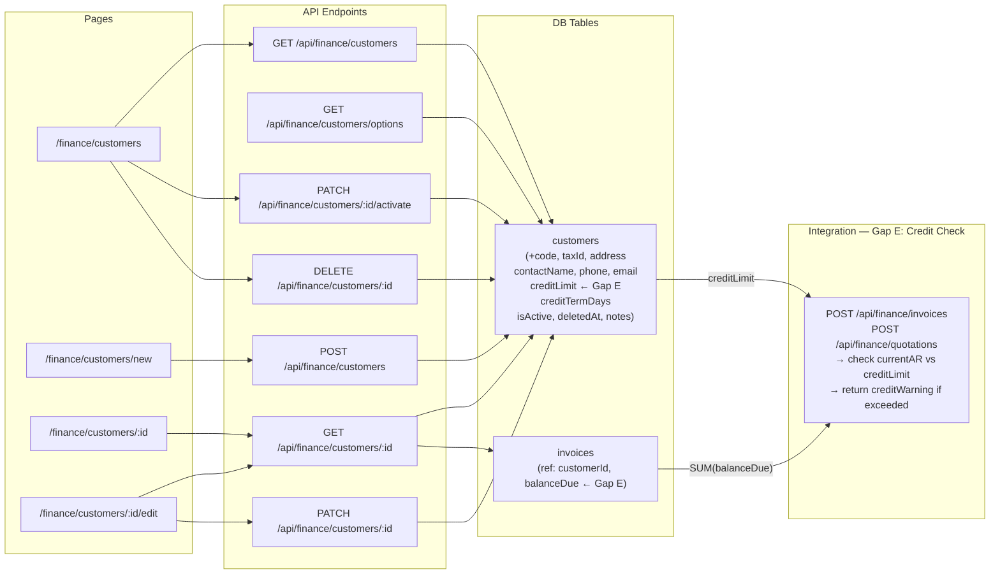

---

## Feature 3.2 — AR Payment Tracking

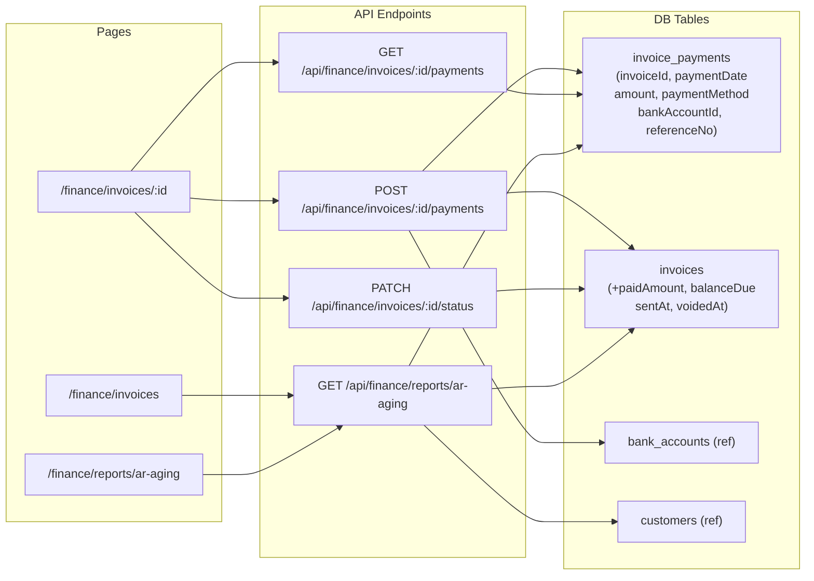

---

## Feature 3.3 — Thai Tax (VAT + WHT)

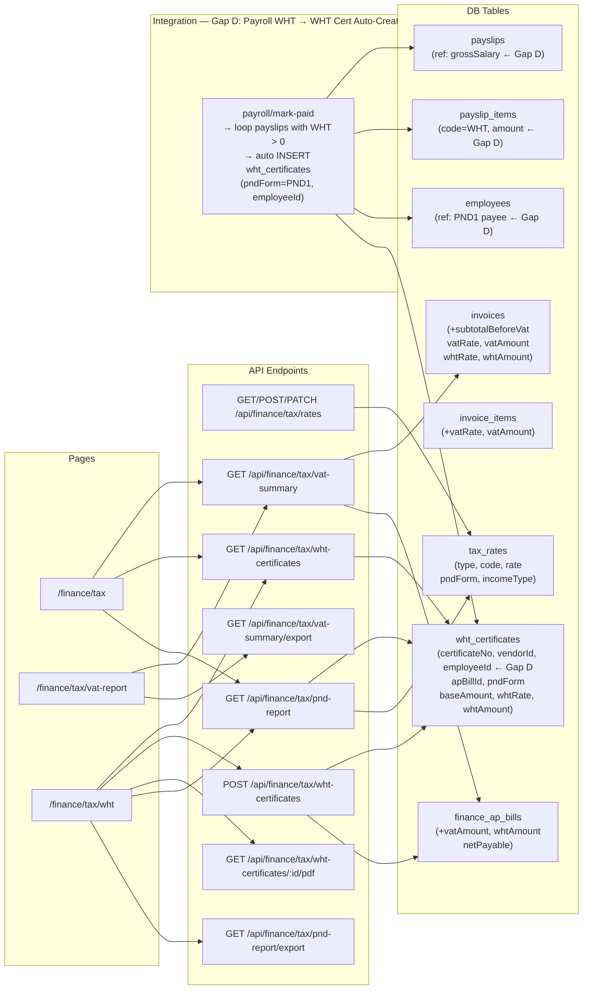

---

## Feature 3.4 — Financial Statements

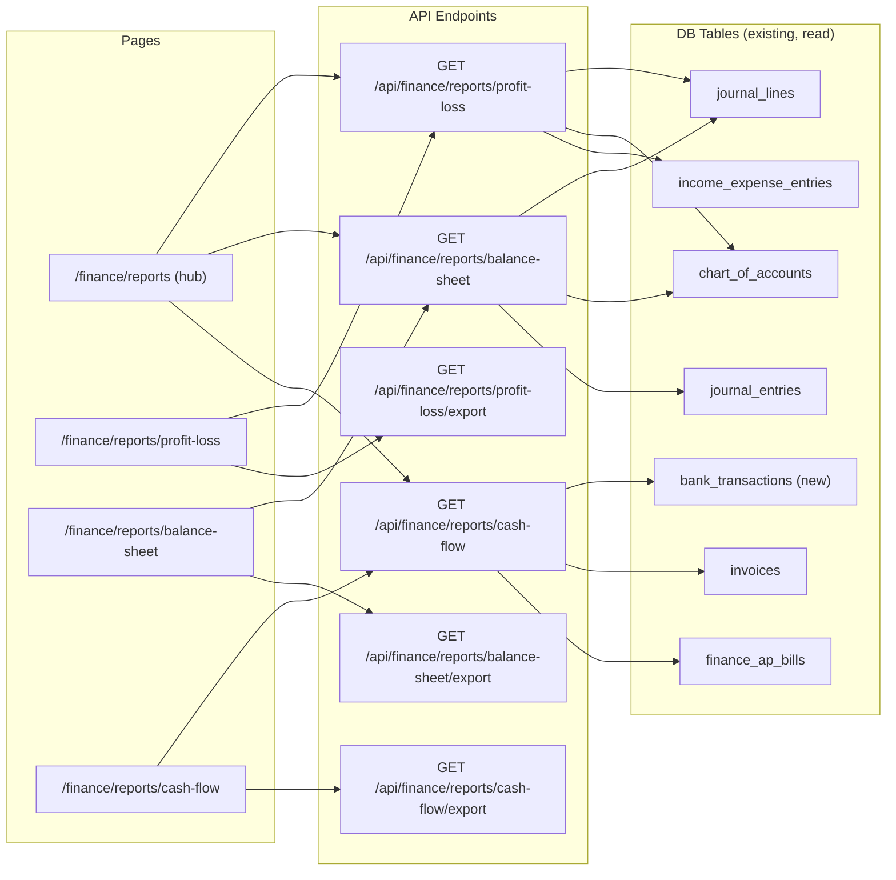

---

## Feature 3.5 — Cash / Bank Management

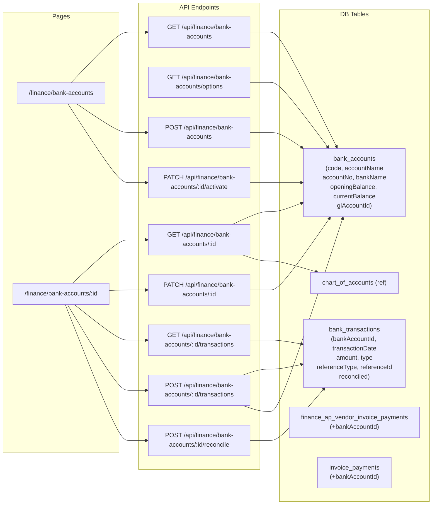

---

## Feature 3.6 — Purchase Order (PO)

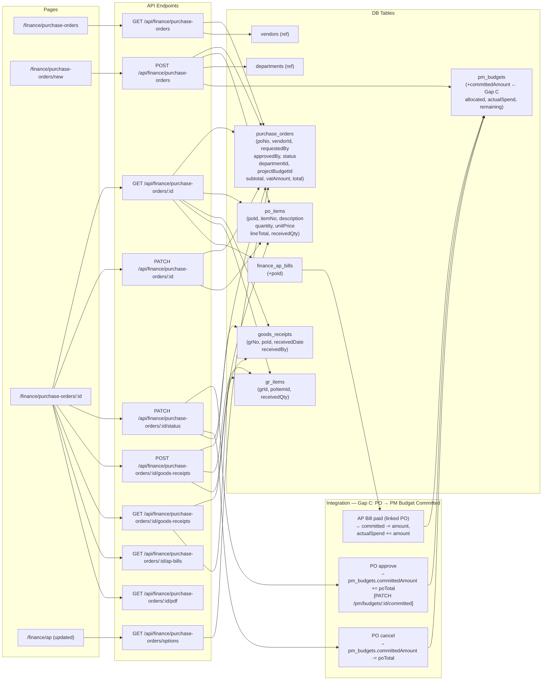

---

## Feature 3.7 — Attendance & Time Tracking

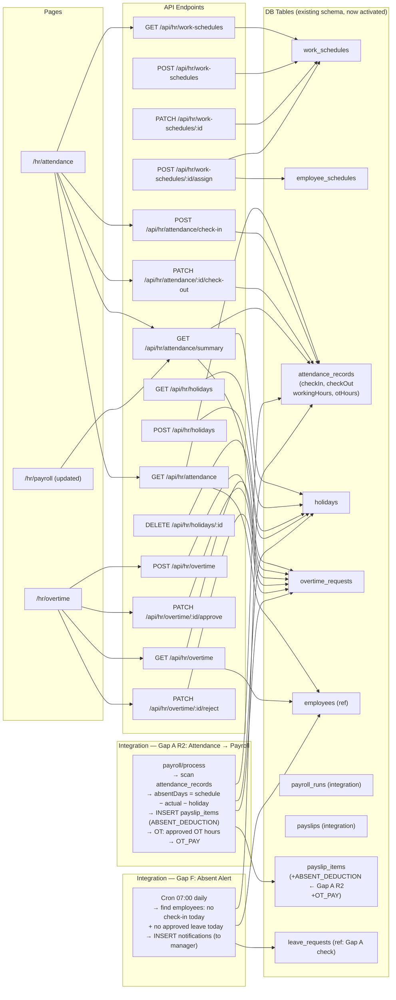

---

## Feature 3.8 — Company / Organization Settings

```mermaid
flowchart LR
  subgraph PAGES_CO["Pages"]
    P_CO["/settings/company"]
    P_FP["/settings/fiscal-periods"]
  end

  subgraph APIS_CO["API Endpoints"]
    A_CO_GET["GET /api/settings/company"]
    A_CO_PUT["PUT /api/settings/company"]
    A_CO_LOGO["POST /api/settings/company/logo"]
    A_FP_LIST["GET /api/settings/fiscal-periods"]
    A_FP_CUR["GET /api/settings/fiscal-periods/current"]
    A_FP_GEN["POST /api/settings/fiscal-periods/generate"]
    A_FP_CLOSE["PATCH /api/settings/fiscal-periods/:id/close"]
    A_FP_REOPEN["PATCH /api/settings/fiscal-periods/:id/reopen"]
  end

  subgraph TABLES_CO["DB Tables"]
    T_CO_SET["company_settings\n(companyName, taxId, address\nlogoUrl, fiscalYearStart\nvatRegistered, prefixes)"]
    T_FP["fiscal_periods\n(year, month, startDate\nendDate, status, closedBy)"]
    T_USERS_CO["users (ref: closedBy)"]
  end

  P_CO --> A_CO_GET
  P_CO --> A_CO_PUT
  P_CO --> A_CO_LOGO
  P_FP --> A_FP_LIST
  P_FP --> A_FP_GEN
  P_FP --> A_FP_CLOSE
  P_FP --> A_FP_REOPEN

  A_CO_GET --> T_CO_SET
  A_CO_PUT --> T_CO_SET
  A_CO_LOGO --> T_CO_SET
  A_FP_LIST --> T_FP
  A_FP_CUR --> T_FP
  A_FP_GEN --> T_FP
  A_FP_CLOSE --> T_FP
  A_FP_CLOSE --> T_USERS_CO
  A_FP_REOPEN --> T_FP
```

---

## Feature 3.9 — Document Print / Export

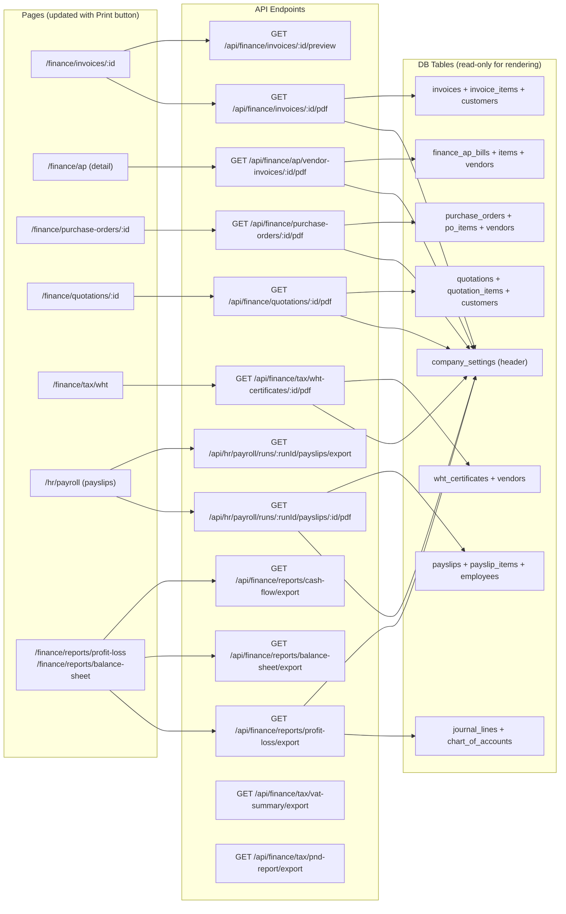

---

## Feature 3.10 — Notification / Workflow Alerts

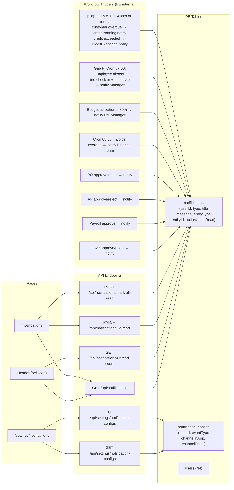

---

## Feature 3.11 — Sales Order / Quotation

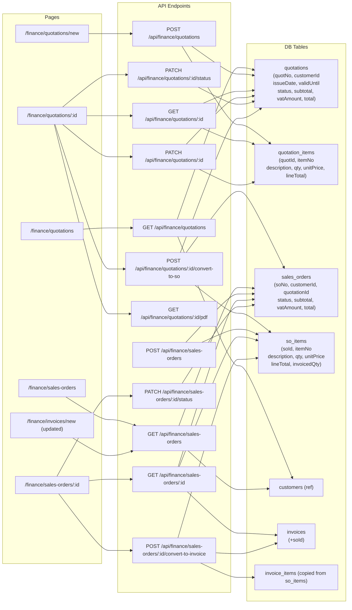

---

## Feature 3.12 — Audit Trail

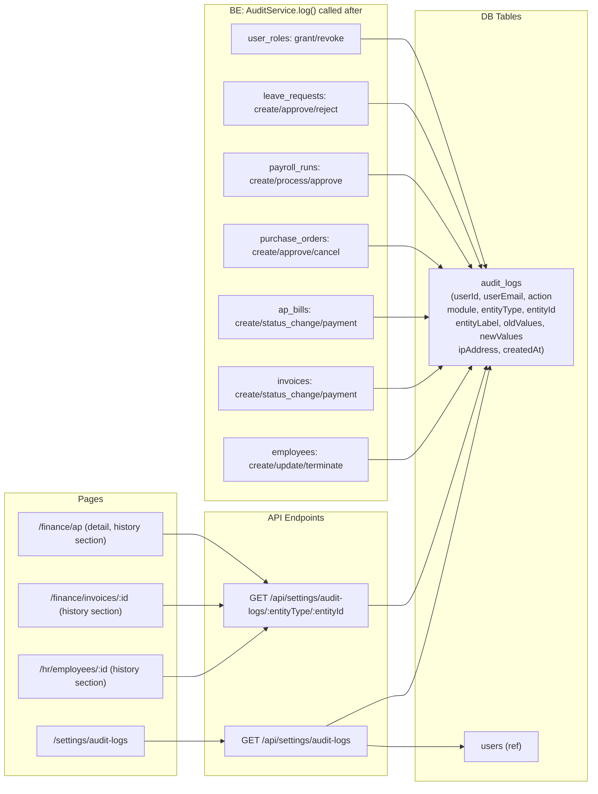

---

## Feature 3.13 — Global Dashboard

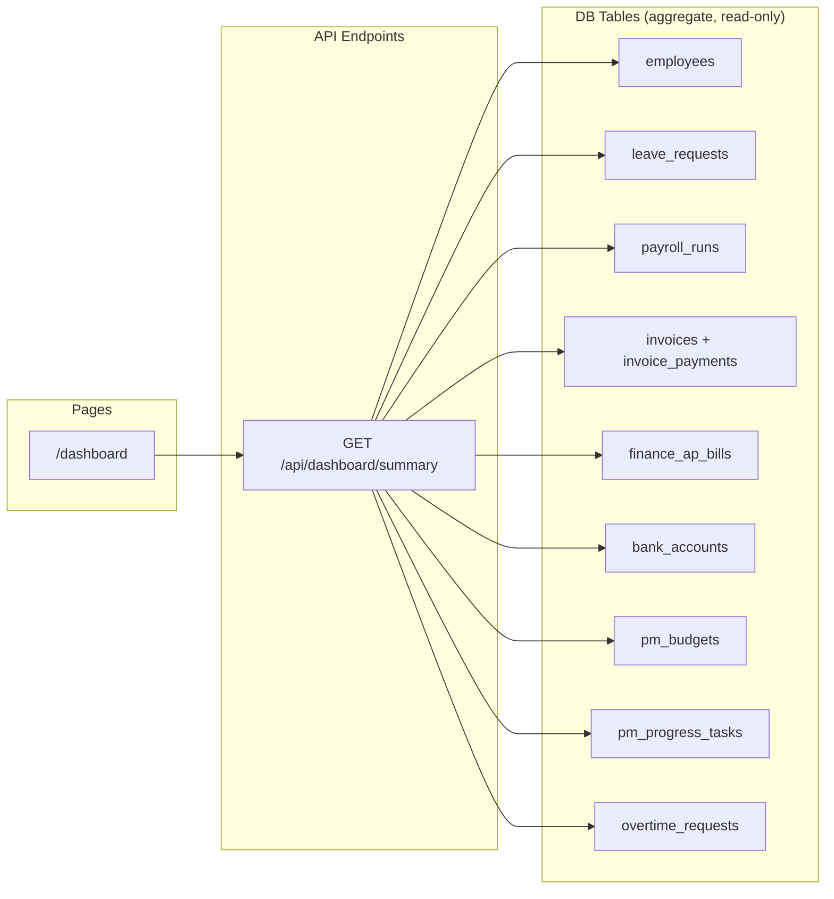

---

## Full Page → API → Table Map (Compact — Release 2 New Routes)

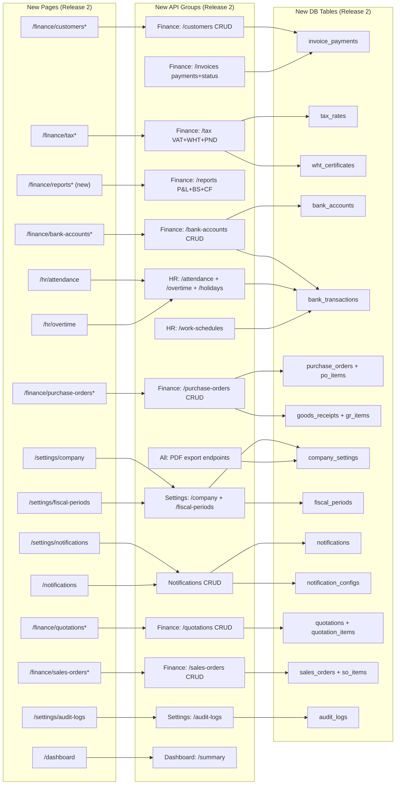

---

## Cross-Module Integration Map — Release 1 + Release 2 (Full)

แผนผังรวมแสดงการส่งข้อมูลข้ามโมดูลทั้งหมด ทั้ง R1 + R2 รวมทุก Gap A-G

```mermaid
flowchart TD
  subgraph AUTH["Auth / RBAC"]
    USERS_F["users\n(userId ↔ employeeId)"]
    ROLES_F["roles / permissions"]
  end

  subgraph HR["HR Module"]
    EMP_F["Employees\n(baseSalary, departmentId\ntaxId, socialSecurityNo)"]
    DEPT_F["Departments\n(approval chain)"]
    LEAVE_F["Leave Management\n(leave_types.paidLeave ← Gap A R1)"]
    ATT_F["Attendance Records\n(checkIn/Out, workingHours ← Gap A R2)"]
    OT_F["OT Requests\n(approved OT hours)"]
    PAY_F["Payroll Run\n(process → mark-paid)"]
    SS_F["ss_records\n(employerContrib ← Gap B)"]
    PAYSLIPS_F["payslips + payslip_items\n(UNPAID_LEAVE, ABSENT_DED, OT_PAY)"]
  end

  subgraph FINANCE["Finance Module"]
    CUST_F["Customers\n(creditLimit ← Gap E)"]
    QUOT_F["Quotations\n(credit check ← Gap E, G)"]
    SO_F["Sales Orders"]
    INV_F["Invoices / AR\n(balanceDue, overdue ← Gap G)"]
    AR_PAY_F["AR Payments\n(invoice_payments)"]
    AP_F["AP Bills\n(poId ← 3-way match)"]
    PO_F["Purchase Orders\n(projectBudgetId ← Gap C)"]
    GR_F["Goods Receipts\n(3-way matching)"]
    TAX_F["WHT Certificates\n(employeeId ← Gap D / PND1)"]
    VAT_F["VAT Summary"]
    BANK_F["Bank Accounts\n(transactions)"]
    JNL_F["Journal Entries\n(debit / credit lines)"]
    STMT_F["Financial Statements\n(P&L, BS, CF)"]
  end

  subgraph PM["PM Module"]
    BUD_F["PM Budgets\n(allocated, committedAmount ← Gap C\nactualSpend, remaining)"]
    EXP_F["PM Expenses"]
    PROG_F["Progress Tasks\n(assigneeId → employees)"]
  end

  subgraph SETTINGS["Settings / Cross-Module"]
    CO_F["Company Settings\n(vatRegistered, prefix, logo)"]
    FP_F["Fiscal Periods\n(open/closed)"]
    NOTIF_F["Notifications\n(Gap F absent + Gap G credit)"]
    AUDIT_F["Audit Trail\n(all modules)"]
    DASH_F["Global Dashboard\n(HR+Finance+PM KPIs)"]
  end

  %% Auth links
  USERS_F -->|"employeeId"| EMP_F
  ROLES_F -.->|"permission guard"| HR
  ROLES_F -.->|"permission guard"| FINANCE
  ROLES_F -.->|"permission guard"| PM

  %% HR internal
  DEPT_F -->|"approval chain"| LEAVE_F
  EMP_F -->|"assigneeId"| PROG_F
  EMP_F -->|"schedule"| ATT_F

  %% Gap A R1: Leave → Payroll
  LEAVE_F -->|"[Gap A R1] approved unpaid leave\n→ UNPAID_LEAVE_DEDUCTION"| PAY_F

  %% Gap A R2: Attendance → Payroll
  ATT_F -->|"[Gap A R2] absent days\n→ ABSENT_DEDUCTION"| PAY_F
  OT_F -->|"approved OT hours\n→ OT_PAY"| PAY_F

  %% Gap F: Attendance → Notification
  ATT_F -->|"[Gap F] no check-in + no leave\nCron 07:00 → notify manager"| NOTIF_F

  %% Gap B: SS Employer → Journal
  PAY_F -->|"mark-paid: salary JE\nDR:SalaryExp/CR:Cash"| JNL_F
  SS_F -->|"[Gap B] DR:SSEmpExp/CR:SSPayable"| JNL_F
  PAY_F -->|"income/expense entry"| JNL_F

  %% Gap D: Payroll WHT → WHT Cert
  PAYSLIPS_F -->|"[Gap D] WHT > 0\nauto-create PND1 cert"| TAX_F

  %% Finance pipeline
  CUST_F -->|"[Gap E] credit check"| INV_F
  CUST_F -->|"[Gap E] credit check"| QUOT_F
  QUOT_F -->|"accept"| SO_F
  SO_F -->|"create invoice"| INV_F
  INV_F -->|"payment"| AR_PAY_F
  AR_PAY_F -->|"receipt"| BANK_F

  %% Gap G: Overdue warning
  INV_F -->|"[Gap G] overdue + create invoice/quotation\n→ notify creator"| NOTIF_F

  %% PO pipeline
  PO_F -->|"[Gap C] approve: committed++"| BUD_F
  PO_F -->|"GR + 3-way match"| GR_F
  GR_F -->|"received → link AP"| AP_F
  AP_F -->|"[Gap C] paid: committed--, actualSpend++"| BUD_F
  AP_F -->|"payment"| BANK_F
  PO_F -->|"link"| AP_F

  %% PM → Finance
  EXP_F -->|"approve: DR:ProjExp/CR:AP"| JNL_F
  BUD_F -->|"budget adj JE"| JNL_F

  %% Tax
  INV_F -->|"vatAmount"| VAT_F
  AP_F -->|"inputVAT"| VAT_F

  %% Reporting
  JNL_F -->|"aggregated"| STMT_F
  CO_F -->|"vatRate, prefix, logo"| INV_F
  CO_F -->|"prefix"| PO_F
  CO_F -->|"header"| STMT_F
  FP_F -->|"block post after close"| JNL_F

  %% Cross-module support
  AUDIT_F -.->|"log all create/update/delete"| HR
  AUDIT_F -.->|"log all create/update/delete"| FINANCE
  DASH_F -->|"aggregate KPIs"| HR
  DASH_F -->|"aggregate KPIs"| FINANCE
  DASH_F -->|"aggregate KPIs"| PM
```
