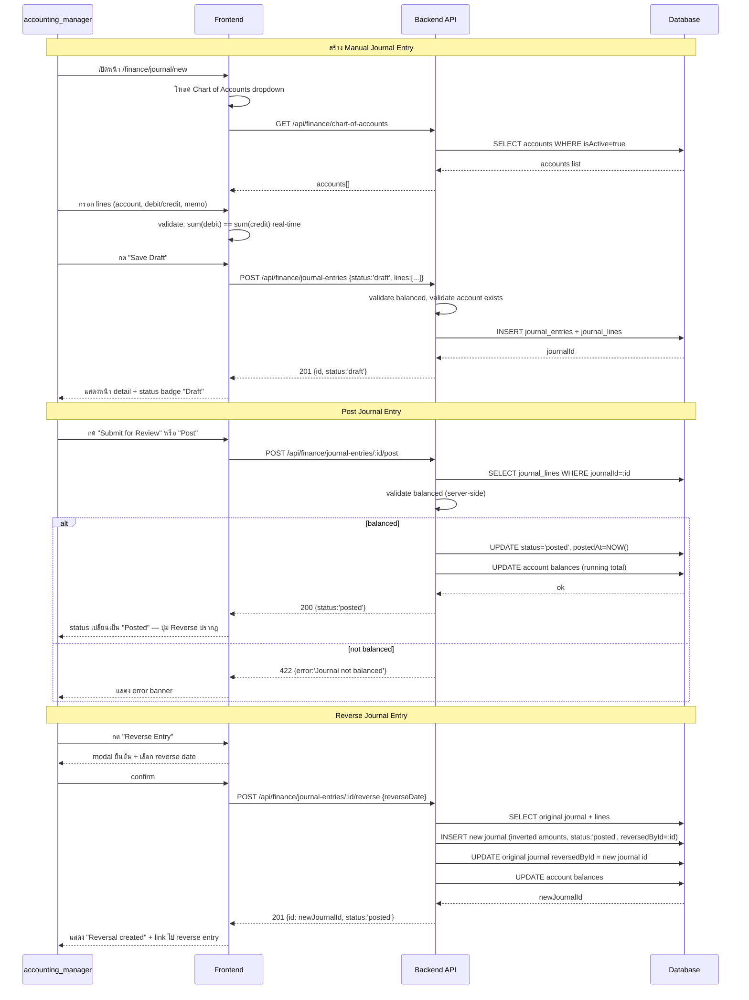
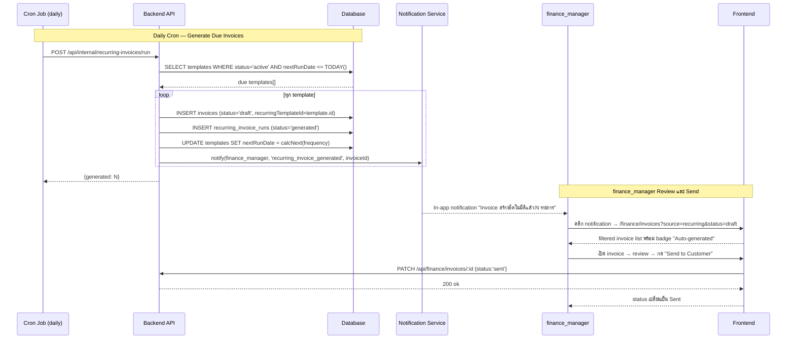
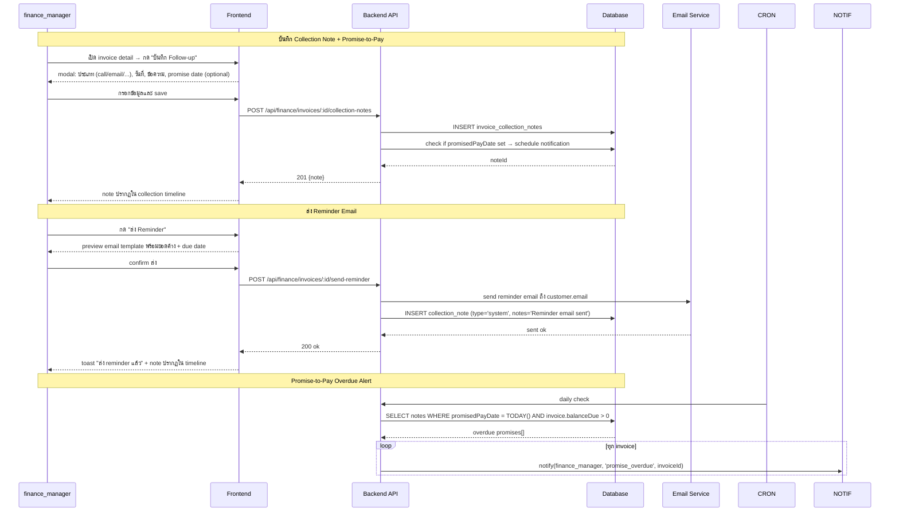
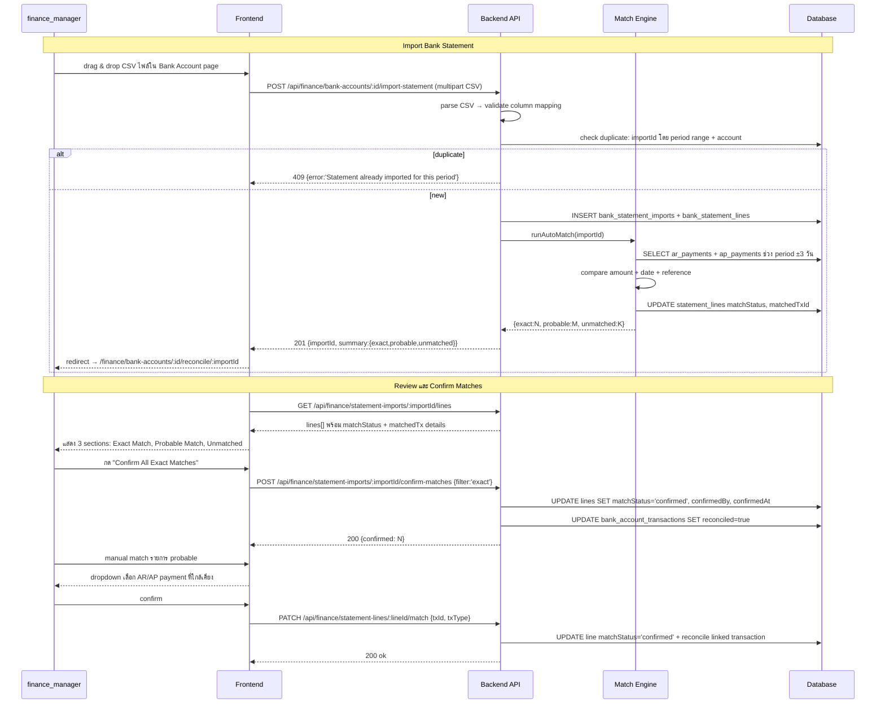
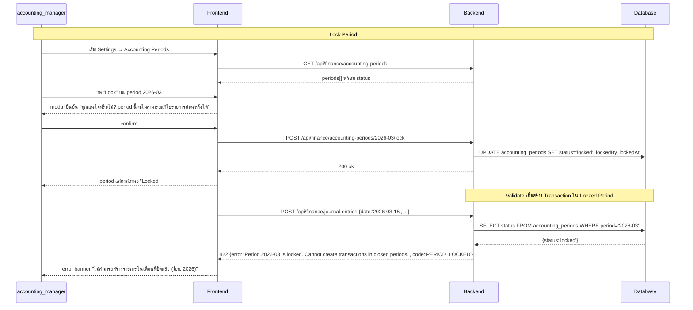
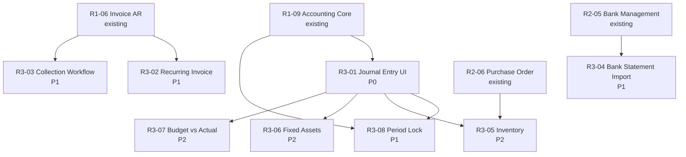

# Release 3 — Finance Module: Gap Requirements

**สถานะ:** Draft  
**วันที่:** 2026-04-27  
**เจ้าของ:** Finance Module Team  
**อ้างอิง:** SCN-17_Finance_Real_User_Journeys.md, Release_1.md, Release_2.md

---

## สรุป Gap ที่ต้องเพิ่ม

| Feature ID | ชื่อ Feature | Priority | ขึ้นอยู่กับ |
|---|---|---|---|
| R3-01 | Journal Entry UI (Create / Post / Reverse) | P0 | R1-09 Accounting Core |
| R3-02 | Recurring Invoice | P1 | R1-06 Invoice AR |
| R3-03 | Collection Workflow (AR Follow-up) | P1 | R1-06, R2-02 AR Aging |
| R3-04 | Bank Statement Import + Auto-match | P1 | R2-05 Cash & Bank |
| R3-05 | Inventory / Stock Management | P2 | R2-06 Purchase Order |
| R3-06 | Fixed Assets & Depreciation | P2 | R1-09 Accounting Core |
| R3-07 | Budget vs Actual (Finance-PM Integration) | P2 | R1-09, PM Budget |
| R3-08 | Accounting Period Lock | P1 | R1-09, R3-01 |

---

## Feature R3-01: Journal Entry UI — Create / Post / Reverse

### Business Purpose

ปัจจุบัน FE มีเพียง journal list แบบ read-only ทำให้ accountant ไม่สามารถปิดเดือน ทำ accrual, adjustment, หรือ reverse entry จาก UI ได้ Backend `POST /finance/journal-entries` มีอยู่แล้ว แต่ยังไม่มี UI รองรับ

### User Stories

- `accounting_manager` สร้าง journal entry แบบ multi-line debit/credit พร้อม validate balanced entry ก่อน post
- `accounting_manager` save draft ไว้ review ก่อน post จริง
- `accounting_manager` reverse journal ที่ post แล้วเมื่อพบข้อผิดพลาด
- `finance_manager` ดู audit trail ของทุก journal พร้อม linked source document

### Functional Requirements

| FR# | ความต้องการ |
|---|---|
| FR-JE-01 | สร้าง journal entry ได้หลาย line (debit/credit) พร้อม validate ว่า total debit = total credit ก่อน post |
| FR-JE-02 | journal มี status workflow: `draft` → `pending_review` → `posted` |
| FR-JE-03 | สร้าง reverse entry จาก journal ที่ `posted` แล้วได้ ระบบ auto-fill ด้วย inverted amounts และ reference กลับ |
| FR-JE-04 | เลือก account จาก Chart of Accounts แบบ searchable dropdown |
| FR-JE-05 | ระบุ memo, reference, department, project (optional) ต่อแต่ละ line |
| FR-JE-06 | Journal ที่ระบบสร้างอัตโนมัติ (Auto) ดูได้ แต่ user แก้ไม่ได้ |
| FR-JE-07 | แสดง running balance ต่อ account หลัง post |
| FR-JE-08 | filter journal list ตาม: วันที่, account, type (auto/manual), status |

### DB Schema เพิ่มเติม

ตาราง `journal_entries` (มีอยู่แล้วใน backend) — เพิ่ม field:

```sql
ALTER TABLE journal_entries ADD COLUMN IF NOT EXISTS
  status VARCHAR DEFAULT 'draft'  -- draft | pending_review | posted | reversed
  CHECK (status IN ('draft','pending_review','posted','reversed'));

ALTER TABLE journal_entries ADD COLUMN IF NOT EXISTS
  reversedById UUID REFERENCES journal_entries(id);  -- link จาก reverse entry กลับหา original

ALTER TABLE journal_entries ADD COLUMN IF NOT EXISTS
  source VARCHAR;  -- 'manual' | 'invoice' | 'ap' | 'payroll' | 'asset_depreciation'
```

### API Endpoints

| Method | Path | คำอธิบาย |
|---|---|---|
| `GET` | `/api/finance/journal-entries` | list พร้อม filter: status, dateFrom, dateTo, accountId, source |
| `POST` | `/api/finance/journal-entries` | สร้าง draft journal (มีอยู่แล้ว — เพิ่ม validation balanced) |
| `PATCH` | `/api/finance/journal-entries/:id` | แก้ไข draft หรือเปลี่ยน status |
| `POST` | `/api/finance/journal-entries/:id/post` | เปลี่ยน status เป็น posted (validate balanced ก่อน) |
| `POST` | `/api/finance/journal-entries/:id/reverse` | สร้าง reverse entry และ mark original เป็น `reversed` |
| `GET` | `/api/finance/journal-entries/:id` | detail พร้อม lines + linked source |

### SD_Flow



### UX Flow

**Entry:** `/finance/journal/new` หรือ `/finance/journal` → กด "+ สร้างรายการบัญชี"

**หน้า Journal Form:**
- Header: วันที่ (date picker), Reference no (auto-gen หรือกรอก), Memo สำหรับ journal ทั้งก้อน
- Line table: Account (searchable dropdown จาก CoA), Description, Debit, Credit, Department (optional), Project (optional)
- ปุ่ม "+ เพิ่ม line" ที่ footer ของ table
- Running total bar ด้านล่าง table: `Total Debit: ฿X | Total Credit: ฿Y | Difference: ฿Z` — Z ต้องเป็น 0 ก่อน post ได้
- Action buttons: `Save Draft` / `Post` (disable ถ้า unbalanced)
- Context hint: ถ้า unbalanced แสดง inline warning ใต้ total bar

**หน้า Journal List:**
- Filter bar: date range, account, type (Auto/Manual), status
- Table columns: วันที่, Reference, Description, Source, Debit total, Credit total, Status badge, Actions
- Status actions: Draft → ปุ่ม Edit + Post | Posted → ปุ่ม Reverse + View | Reversed → ปุ่ม View only

**Reverse Modal:**
- แสดงข้อมูล original journal (summary)
- Date picker สำหรับ reverse date (default = today)
- Confirm button: "ยืนยัน Reverse Entry"

**Error States:**
- Unbalanced: inline error "Debit - Credit = ฿X,XXX — ต้องปรับให้สมดุลก่อน post"
- Account inactive: "บัญชี [XXX] ถูกปิดการใช้งานแล้ว"
- Already reversed: ปุ่ม Reverse ถูก disable + tooltip "มี reversal แล้ว"

---

## Feature R3-02: Recurring Invoice

### Business Purpose

ธุรกิจบริการที่ออก invoice ซ้ำทุกเดือน (MA, subscription, retainer) ต้องสร้างด้วยมือทุกครั้ง ต้องการ scheduled invoice ที่สร้างอัตโนมัติตาม schedule ที่กำหนด

### User Stories

- `finance_manager` ตั้ง template invoice พร้อมกำหนด schedule (รายเดือน/รายไตรมาส)
- ระบบสร้าง draft invoice ตาม schedule อัตโนมัติ และแจ้ง `finance_manager` ให้ review ก่อน send
- `finance_manager` หยุด หรือแก้ไข schedule ได้ทุกเมื่อ

### Functional Requirements

| FR# | ความต้องการ |
|---|---|
| FR-RI-01 | สร้าง recurring template จาก invoice ที่มีอยู่ หรือสร้างใหม่ |
| FR-RI-02 | กำหนด frequency: monthly, quarterly, annually, custom (ทุก N วัน) |
| FR-RI-03 | กำหนด start date, end date (optional), หรือจำนวน occurrences |
| FR-RI-04 | ระบบสร้าง draft invoice อัตโนมัติตาม schedule (cron job) |
| FR-RI-05 | แจ้งเตือน `finance_manager` เมื่อระบบสร้าง draft ใหม่ (in-app notification) |
| FR-RI-06 | `finance_manager` ต้อง review และ confirm ก่อน invoice เปลี่ยนสถานะเป็น `sent` |
| FR-RI-07 | หยุด (pause) หรือ cancel recurring schedule ได้ |
| FR-RI-08 | ดู history ของ invoices ที่ generated จาก template นี้ได้ |

### DB Schema เพิ่มเติม

```sql
CREATE TABLE recurring_invoice_templates (
  id              UUID PRIMARY KEY DEFAULT gen_random_uuid(),
  customerId      UUID NOT NULL REFERENCES customers(id),
  name            VARCHAR NOT NULL,
  frequency       VARCHAR NOT NULL CHECK (frequency IN ('monthly','quarterly','annually','custom')),
  customDays      INT,                           -- ใช้เมื่อ frequency='custom'
  startDate       DATE NOT NULL,
  endDate         DATE,
  maxOccurrences  INT,
  nextRunDate     DATE NOT NULL,
  items           JSONB NOT NULL,               -- snapshot ของ line items
  status          VARCHAR DEFAULT 'active' CHECK (status IN ('active','paused','completed','cancelled')),
  createdBy       UUID REFERENCES users(id),
  createdAt       TIMESTAMP DEFAULT NOW(),
  updatedAt       TIMESTAMP
);

CREATE TABLE recurring_invoice_runs (
  id                UUID PRIMARY KEY DEFAULT gen_random_uuid(),
  templateId        UUID NOT NULL REFERENCES recurring_invoice_templates(id),
  invoiceId         UUID REFERENCES invoices(id),
  scheduledDate     DATE NOT NULL,
  generatedAt       TIMESTAMP,
  status            VARCHAR DEFAULT 'pending' CHECK (status IN ('pending','generated','skipped','failed'))
);
```

### API Endpoints

| Method | Path | คำอธิบาย |
|---|---|---|
| `GET` | `/api/finance/recurring-invoices` | list templates |
| `POST` | `/api/finance/recurring-invoices` | สร้าง template ใหม่ |
| `PATCH` | `/api/finance/recurring-invoices/:id` | แก้ไข template (frequency, items, dates) |
| `POST` | `/api/finance/recurring-invoices/:id/pause` | หยุด schedule ชั่วคราว |
| `POST` | `/api/finance/recurring-invoices/:id/resume` | resume schedule |
| `POST` | `/api/finance/recurring-invoices/:id/cancel` | ยกเลิก schedule ถาวร |
| `GET` | `/api/finance/recurring-invoices/:id/history` | list invoices ที่ generated แล้ว |
| `POST` | `/api/internal/recurring-invoices/run` | cron endpoint — generate due invoices |

### SD_Flow



### UX Flow

**หน้า Recurring Invoice List:** `/finance/recurring-invoices`
- Cards แสดง template แต่ละอัน: ชื่อ, ลูกค้า, frequency, next run date, status badge (Active/Paused/Cancelled)
- ปุ่ม "+ สร้าง Recurring Template"
- Action per card: Pause / Edit / Cancel / ดู history

**หน้า Create/Edit Template:**
- Section 1 — Customer: dropdown เลือกลูกค้า
- Section 2 — Schedule: Frequency selector (Monthly / Quarterly / Annually / Custom), Start date, End date (optional), หรือ "หยุดหลัง X ครั้ง"
- Section 3 — Invoice Items: เหมือน invoice form ปกติ
- Preview: "Invoice ถัดไปจะสร้างวันที่ [X]"

**Dashboard Integration:**
- ใน Finance Dashboard มี section "Recurring ที่รอ review" แสดง draft invoices ที่ auto-generated รอ confirm

---

## Feature R3-03: Collection Workflow (AR Follow-up)

### Business Purpose

ทีมการเงินต้องติดตามลูกหนี้ค้างชำระ แต่ปัจจุบันไม่มี workflow ติดตามหนี้ — ไม่มี note การโทร, promise-to-pay, reminder schedule ทำให้ follow-up ไม่มีประสิทธิภาพ

### User Stories

- `finance_manager` บันทึก note การติดตาม เช่น "โทรแล้ว ลูกค้าแจ้งจะโอนวันที่ X"
- `finance_manager` บันทึก promise-to-pay date และให้ระบบแจ้งเตือนเมื่อถึงวันนั้น
- `finance_manager` ดู collection history ทั้งหมดต่อ invoice หรือต่อลูกค้า
- `accounting_manager` ดู report ว่า invoice ไหน overdue เกิน 60 วัน และยังไม่มี follow-up

### Functional Requirements

| FR# | ความต้องการ |
|---|---|
| FR-COL-01 | บันทึก collection note ต่อ invoice ได้: ประเภท (call/email/meeting/other), วันที่, ข้อความ, ผู้บันทึก |
| FR-COL-02 | บันทึก promise-to-pay: วันที่ที่ลูกค้า promise, จำนวนเงิน |
| FR-COL-03 | แจ้งเตือนเมื่อ promise-to-pay date มาถึงแต่ยังไม่ได้รับชำระ |
| FR-COL-04 | ดู collection timeline ต่อ invoice (chronological) |
| FR-COL-05 | ดู customer AR summary รวม open invoices + collection history ใน single page |
| FR-COL-06 | Report: overdue invoices ที่ไม่มี follow-up ใน 7 วันที่ผ่านมา |
| FR-COL-07 | ส่ง payment reminder email ให้ลูกค้าจาก UI ได้ (template-based) |

### DB Schema เพิ่มเติม

```sql
CREATE TABLE invoice_collection_notes (
  id              UUID PRIMARY KEY DEFAULT gen_random_uuid(),
  invoiceId       UUID NOT NULL REFERENCES invoices(id),
  type            VARCHAR NOT NULL CHECK (type IN ('call','email','meeting','system','other')),
  notes           TEXT,
  promisedPayDate DATE,
  promisedAmount  NUMERIC(15,2),
  createdBy       UUID REFERENCES users(id),
  createdAt       TIMESTAMP DEFAULT NOW()
);

CREATE INDEX idx_collection_notes_invoice ON invoice_collection_notes(invoiceId);
CREATE INDEX idx_collection_notes_promised ON invoice_collection_notes(promisedPayDate) WHERE promisedPayDate IS NOT NULL;
```

### API Endpoints

| Method | Path | คำอธิบาย |
|---|---|---|
| `GET` | `/api/finance/invoices/:id/collection-notes` | list notes ของ invoice |
| `POST` | `/api/finance/invoices/:id/collection-notes` | เพิ่ม note ใหม่ |
| `GET` | `/api/finance/customers/:id/ar-summary` | AR summary + open invoices + collection history ของลูกค้า |
| `GET` | `/api/finance/reports/collection-gap` | invoices overdue ที่ไม่มี follow-up |
| `POST` | `/api/finance/invoices/:id/send-reminder` | ส่ง reminder email ตาม template |

### SD_Flow



### UX Flow

**Invoice Detail — Collection Timeline panel (sidebar หรือ tab):**
- Timeline แสดง events ตามเวลา: system events (invoice sent, partial payment) + manual notes
- ปุ่ม "+ บันทึก Follow-up" → modal
- ถ้ามี promise-to-pay: แสดง countdown "ลูกค้า promise จ่ายภายใน X วัน"

**Customer AR Summary Page:** `/finance/customers/:id/ar`
- Header: ชื่อลูกค้า, credit limit, credit used, overdue amount
- Section: Open Invoices table พร้อม status + action
- Section: Collection History (รวมทุก invoice ของลูกค้า)
- Action: ส่ง Statement (รายการค้างชำระทั้งหมด) ไปลูกค้า

---

## Feature R3-04: Bank Statement Import + Auto-match

### Business Purpose

ปัจจุบัน reconcile ทำได้แบบ manual mark เท่านั้น ทีมการเงินต้องนำ bank statement มาเทียบด้วยตัวเองทุกรายการ ต้องการ import CSV จากธนาคารและให้ระบบ match อัตโนมัติกับ AR/AP transactions

### User Stories

- `finance_manager` import bank statement จากไฟล์ CSV/Excel
- ระบบ auto-match รายการใน statement กับ AR payment หรือ AP payment ที่มีในระบบ
- `finance_manager` review matched/unmatched items และ confirm หรือ manual match
- `finance_manager` บันทึก รายการ unmatched เป็น manual transaction

### Functional Requirements

| FR# | ความต้องการ |
|---|---|
| FR-BANK-01 | import bank statement จาก CSV format (configurable column mapping) |
| FR-BANK-02 | ระบบ auto-match statement lines กับ AR/AP payments โดยใช้: amount + date (±3 วัน) + reference number |
| FR-BANK-03 | แสดง match confidence: `exact`, `probable`, `unmatched` |
| FR-BANK-04 | `finance_manager` confirm หรือ reject match ทีละรายการ หรือ bulk confirm exact matches |
| FR-BANK-05 | รายการ unmatched สามารถบันทึกเป็น manual transaction (income/expense/transfer) |
| FR-BANK-06 | ไม่สามารถ import statement เดิมซ้ำได้ (detect via date range + account) |
| FR-BANK-07 | แสดง reconciliation summary: matched, unmatched, difference vs system balance |

### DB Schema เพิ่มเติม

```sql
CREATE TABLE bank_statement_imports (
  id            UUID PRIMARY KEY DEFAULT gen_random_uuid(),
  bankAccountId UUID NOT NULL REFERENCES bank_accounts(id),
  fileName      VARCHAR NOT NULL,
  periodFrom    DATE NOT NULL,
  periodTo      DATE NOT NULL,
  totalLines    INT,
  matchedLines  INT DEFAULT 0,
  status        VARCHAR DEFAULT 'pending' CHECK (status IN ('pending','reviewed','completed')),
  importedBy    UUID REFERENCES users(id),
  importedAt    TIMESTAMP DEFAULT NOW()
);

CREATE TABLE bank_statement_lines (
  id              UUID PRIMARY KEY DEFAULT gen_random_uuid(),
  importId        UUID NOT NULL REFERENCES bank_statement_imports(id),
  txDate          DATE NOT NULL,
  description     VARCHAR,
  amount          NUMERIC(15,2) NOT NULL,   -- บวก = credit (รับเงิน), ลบ = debit (จ่ายออก)
  referenceNo     VARCHAR,
  balance         NUMERIC(15,2),
  matchStatus     VARCHAR DEFAULT 'unmatched' CHECK (matchStatus IN ('exact','probable','unmatched','manual','confirmed')),
  matchedTxId     UUID,                      -- FK ไปยัง transaction ที่ match (polymorphic)
  matchedTxType   VARCHAR,                   -- 'ar_payment' | 'ap_payment' | 'manual_tx'
  confirmedBy     UUID REFERENCES users(id),
  confirmedAt     TIMESTAMP
);
```

### API Endpoints

| Method | Path | คำอธิบาย |
|---|---|---|
| `POST` | `/api/finance/bank-accounts/:id/import-statement` | upload CSV + trigger auto-match |
| `GET` | `/api/finance/bank-accounts/:id/statement-imports` | list imports |
| `GET` | `/api/finance/statement-imports/:importId/lines` | lines พร้อม match status |
| `POST` | `/api/finance/statement-imports/:importId/confirm-matches` | bulk confirm exact matches |
| `PATCH` | `/api/finance/statement-lines/:lineId/match` | manual match หรือ reject match |
| `POST` | `/api/finance/statement-lines/:lineId/create-transaction` | สร้าง manual transaction จาก unmatched line |

### SD_Flow



### UX Flow

**Bank Account Detail → Tab "Reconcile":**
- แสดง import history
- ปุ่ม "Import Statement" → file drop zone (รองรับ CSV, XLSX)
- Column mapping step: ระบุ column สำหรับ date, description, amount, reference, balance

**Reconcile Review Page:**
- Summary bar: Exact ✓N | Probable ~M | Unmatched ✕K | Difference ฿X
- Section "Exact Match" (collapsed ได้): ปุ่ม "Confirm All" ด้านบน + table rows
- Section "Probable Match": แต่ละ row มี dropdown เลือก AR/AP ที่ match + Confirm/Skip
- Section "Unmatched": ปุ่ม "สร้าง Manual Transaction" ต่อ row หรือ bulk

---

## Feature R3-05: Inventory / Stock Management

### Business Purpose

ปัจจุบัน Goods Receipt track receivedQty เท่านั้น ไม่มี stock valuation, COGS auto-posting หรือ reorder alert ธุรกิจที่ขายสินค้าต้องการ inventory management พื้นฐาน

### User Stories

- `procurement_officer` ดูยอดสินค้าคงเหลือ (on-hand) ต่อ product
- ระบบ auto-post COGS journal เมื่อออก Sales Order / Invoice
- `procurement_officer` รับแจ้งเตือนเมื่อสต็อกต่ำกว่า reorder point

### Functional Requirements

| FR# | ความต้องการ |
|---|---|
| FR-INV-01 | Product master: ชื่อ, SKU, unit, cost price, selling price, reorder point |
| FR-INV-02 | Stock movement log: IN (จาก GR), OUT (จาก SO/Invoice), Adjustment |
| FR-INV-03 | คำนวณ on-hand quantity = sum(IN) - sum(OUT) ± adjustments |
| FR-INV-04 | Valuation method: Weighted Average Cost (WAC) |
| FR-INV-05 | Auto-post COGS journal entry เมื่อ invoice status เป็น `sent` |
| FR-INV-06 | Reorder alert เมื่อ on-hand <= reorder point |
| FR-INV-07 | Stock adjustment: เพิ่ม/ลด manual พร้อม reason |
| FR-INV-08 | Inventory report: stock on-hand, stock movement ตาม period |

### DB Schema เพิ่มเติม

```sql
CREATE TABLE products (
  id            UUID PRIMARY KEY DEFAULT gen_random_uuid(),
  sku           VARCHAR UNIQUE NOT NULL,
  name          VARCHAR NOT NULL,
  unit          VARCHAR DEFAULT 'pcs',
  costPrice     NUMERIC(15,2) DEFAULT 0,
  sellingPrice  NUMERIC(15,2) DEFAULT 0,
  reorderPoint  NUMERIC(10,2) DEFAULT 0,
  isActive      BOOLEAN DEFAULT TRUE,
  cogsAccountId UUID REFERENCES chart_of_accounts(id),
  inventoryAccountId UUID REFERENCES chart_of_accounts(id),
  createdAt     TIMESTAMP DEFAULT NOW()
);

CREATE TABLE stock_movements (
  id            UUID PRIMARY KEY DEFAULT gen_random_uuid(),
  productId     UUID NOT NULL REFERENCES products(id),
  movementType  VARCHAR NOT NULL CHECK (movementType IN ('IN','OUT','ADJUSTMENT')),
  quantity      NUMERIC(10,2) NOT NULL,
  unitCost      NUMERIC(15,2),
  totalCost     NUMERIC(15,2),
  referenceType VARCHAR,                   -- 'goods_receipt' | 'invoice' | 'manual'
  referenceId   UUID,
  notes         TEXT,
  createdBy     UUID REFERENCES users(id),
  createdAt     TIMESTAMP DEFAULT NOW()
);

CREATE VIEW stock_on_hand AS
  SELECT productId,
         SUM(CASE WHEN movementType IN ('IN','ADJUSTMENT') THEN quantity ELSE -quantity END) AS onHand,
         SUM(CASE WHEN movementType IN ('IN','ADJUSTMENT') THEN totalCost ELSE -totalCost END) AS totalValue
  FROM stock_movements
  GROUP BY productId;
```

### API Endpoints

| Method | Path | คำอธิบาย |
|---|---|---|
| `GET` | `/api/inventory/products` | list products |
| `POST` | `/api/inventory/products` | สร้าง product |
| `PATCH` | `/api/inventory/products/:id` | แก้ไข product |
| `GET` | `/api/inventory/products/:id/stock` | on-hand + movement history |
| `POST` | `/api/inventory/products/:id/adjust` | stock adjustment |
| `GET` | `/api/inventory/reports/on-hand` | stock on-hand report |
| `GET` | `/api/inventory/reports/movement` | stock movement ตาม period |
| `GET` | `/api/inventory/alerts/low-stock` | products ที่ on-hand <= reorder point |

### SD_Flow

```mermaid
sequenceDiagram
    participant FE as Frontend
    participant BE as Backend
    participant DB as Database
    participant JE as Journal Entry Engine

    Note over BE,DB: Auto-post COGS เมื่อ Invoice Sent
    FE->>BE: PATCH /api/finance/invoices/:id {status:'sent'}
    BE->>DB: SELECT invoice_lines JOIN products
    loop ทุก product line
        BE->>DB: SELECT stock on-hand + avg cost (WAC)
        BE->>DB: INSERT stock_movements (type='OUT', qty, unitCost=WAC, referenceType='invoice')
        BE->>JE: createAutoJournal({
                   debit: COGS_account, amount: qty*WAC,
                   credit: Inventory_account, amount: qty*WAC,
                   source:'invoice', referenceId })
    end
    JE->>DB: INSERT journal_entries + journal_lines (status='posted')
    DB-->>BE: ok
    BE->>DB: UPDATE invoice status='sent'
    BE-->>FE: 200 {status:'sent'}
```

### UX Flow

**หน้า Inventory:** `/inventory`
- KPI cards: Total SKUs, Total Stock Value, Low Stock Items
- Product list พร้อม on-hand qty, reorder point indicator (สีแดงถ้าต่ำกว่า reorder)
- กด product → detail: stock movement timeline + adjust button

---

## Feature R3-06: Fixed Assets & Depreciation

### Business Purpose

บริษัทที่มีสินทรัพย์ถาวร (อุปกรณ์, คอมพิวเตอร์, ยานพาหนะ) ต้องบันทึกทะเบียนสินทรัพย์และคำนวณค่าเสื่อมราคาอัตโนมัติทุกเดือน

### User Stories

- `accounting_manager` บันทึกสินทรัพย์ใหม่พร้อมมูลค่า, วันที่ซื้อ, อายุการใช้งาน
- ระบบ auto-post depreciation journal entry ทุกสิ้นเดือน
- `accounting_manager` ดูมูลค่าสุทธิ (net book value) ของสินทรัพย์แต่ละรายการ
- `accounting_manager` บันทึกการขาย/ทิ้งสินทรัพย์พร้อม gain/loss calculation

### Functional Requirements

| FR# | ความต้องการ |
|---|---|
| FR-FA-01 | บันทึกสินทรัพย์: ชื่อ, หมวดหมู่, มูลค่าซื้อ, วันที่ซื้อ, อายุใช้งาน (เดือน), ซากมูลค่า |
| FR-FA-02 | รองรับวิธีเสื่อมราคา: Straight-line (บังคับ), Declining Balance (optional) |
| FR-FA-03 | สร้าง depreciation schedule อัตโนมัติเมื่อสร้างสินทรัพย์ |
| FR-FA-04 | Auto-post monthly depreciation journal entry (cron ปลายเดือน) |
| FR-FA-05 | แสดง Net Book Value (NBV) = cost - accumulated depreciation |
| FR-FA-06 | บันทึก asset disposal: ระบุ proceeds, คำนวณ gain/loss, post journal |
| FR-FA-07 | Asset register report: list ทุกสินทรัพย์ + NBV + depreciation to-date |

### DB Schema เพิ่มเติม

```sql
CREATE TABLE fixed_assets (
  id                    UUID PRIMARY KEY DEFAULT gen_random_uuid(),
  assetNo               VARCHAR UNIQUE NOT NULL,
  name                  VARCHAR NOT NULL,
  category              VARCHAR,
  acquisitionDate       DATE NOT NULL,
  acquisitionCost       NUMERIC(15,2) NOT NULL,
  salvageValue          NUMERIC(15,2) DEFAULT 0,
  usefulLifeMonths      INT NOT NULL,
  depreciationMethod    VARCHAR DEFAULT 'straight_line' CHECK (depreciationMethod IN ('straight_line','declining_balance')),
  assetAccountId        UUID REFERENCES chart_of_accounts(id),
  accumDepAccountId     UUID REFERENCES chart_of_accounts(id),
  depExpenseAccountId   UUID REFERENCES chart_of_accounts(id),
  status                VARCHAR DEFAULT 'active' CHECK (status IN ('active','disposed','fully_depreciated')),
  disposalDate          DATE,
  disposalProceeds      NUMERIC(15,2),
  createdAt             TIMESTAMP DEFAULT NOW()
);

CREATE TABLE asset_depreciation_schedule (
  id            UUID PRIMARY KEY DEFAULT gen_random_uuid(),
  assetId       UUID NOT NULL REFERENCES fixed_assets(id),
  periodDate    DATE NOT NULL,            -- สิ้นเดือนที่ depreciate
  depAmount     NUMERIC(15,2) NOT NULL,
  accumDep      NUMERIC(15,2) NOT NULL,
  nbv           NUMERIC(15,2) NOT NULL,
  journalId     UUID REFERENCES journal_entries(id),  -- null = ยังไม่ post
  status        VARCHAR DEFAULT 'scheduled' CHECK (status IN ('scheduled','posted','skipped'))
);
```

### API Endpoints

| Method | Path | คำอธิบาย |
|---|---|---|
| `GET` | `/api/finance/fixed-assets` | list สินทรัพย์ |
| `POST` | `/api/finance/fixed-assets` | สร้างสินทรัพย์ใหม่ + generate schedule |
| `GET` | `/api/finance/fixed-assets/:id` | detail + depreciation schedule |
| `POST` | `/api/finance/fixed-assets/:id/dispose` | บันทึก disposal + post gain/loss |
| `POST` | `/api/internal/fixed-assets/run-monthly-depreciation` | cron endpoint |
| `GET` | `/api/finance/reports/asset-register` | asset register report |

### SD_Flow

```mermaid
sequenceDiagram
    participant CRON as Cron (Month-end)
    participant BE as Backend
    participant DB as Database
    participant JE as Journal Engine

    CRON->>BE: POST /api/internal/fixed-assets/run-monthly-depreciation
    BE->>DB: SELECT schedules WHERE periodDate = LAST_DAY(THIS_MONTH) AND status='scheduled'
    DB-->>BE: due schedules[]
    loop ทุก schedule
        BE->>JE: createJournal({
                   debit: depExpenseAccount, amount: depAmount,
                   credit: accumDepAccount, amount: depAmount,
                   source:'asset_depreciation', referenceId: assetId })
        JE->>DB: INSERT + auto-post journal
        BE->>DB: UPDATE schedule SET status='posted', journalId
        BE->>DB: UPDATE asset accumDep, nbv
    end
    BE-->>CRON: {posted: N}
```

---

## Feature R3-07: Budget vs Actual (Finance-PM Integration)

### Business Purpose

ปัจจุบัน PM module มี budget/expense แต่ไม่ได้ post เข้า Finance GL ทำให้ reports summary และ P&L ไม่ตรงกัน ต้องการ bridge ระหว่าง PM expenses กับ journal entries

### User Stories

- `pm_manager` approve expense → ระบบ auto-post journal entry เข้า Finance
- `accounting_manager` ดู Budget vs Actual report เปรียบ project budget กับ actual GL expenses
- `finance_manager` ดูว่า PM expenses ที่ยัง pending อยู่มีผลต่อ cash flow อย่างไร

### Functional Requirements

| FR# | ความต้องการ |
|---|---|
| FR-BVA-01 | เมื่อ PM expense ถูก approve → auto-post journal: debit expense account, credit AP/accrual account |
| FR-BVA-02 | PM budget line เชื่อมกับ GL account (many-to-one) |
| FR-BVA-03 | Budget vs Actual report: budget, actual (from GL), variance, variance % ต่อ project และ cost center |
| FR-BVA-04 | Warning เมื่อ actual > budget เกิน 90% |
| FR-BVA-05 | Pending expenses (อนุมัติยังไม่แล้ว) แสดงเป็น committed cost ใน report |

### API Endpoints

| Method | Path | คำอธิบาย |
|---|---|---|
| `GET` | `/api/finance/reports/budget-vs-actual` | report ต่อ project/period |
| `GET` | `/api/finance/reports/budget-vs-actual/:projectId` | drill-down ต่อ project |
| `POST` | `/api/internal/pm/expense-approved` | webhook จาก PM เมื่อ expense approved |

---

## Feature R3-08: Accounting Period Lock

### Business Purpose

ป้องกันการย้อนหลังแก้ไขรายการในเดือนที่ปิดบัญชีแล้ว ลดความเสี่ยง backdating ที่กระทบงบการเงิน

### User Stories

- `accounting_manager` lock เดือนที่ปิดบัญชีเสร็จแล้ว
- ระบบปฏิเสธการสร้าง/แก้ไข journal, invoice, AP ที่มีวันที่อยู่ในช่วง locked period
- `super_admin` unlock period ได้ (require reason)

### Functional Requirements

| FR# | ความต้องการ |
|---|---|
| FR-LOCK-01 | `accounting_manager` lock accounting period (YYYY-MM) |
| FR-LOCK-02 | ระบบ validate ว่า transaction date อยู่ใน locked period → reject พร้อม error ชัดเจน |
| FR-LOCK-03 | Locked periods ดูได้ + `super_admin` unlock ได้พร้อม audit log |
| FR-LOCK-04 | Warning เมื่อ user พยายามสร้างรายการในวันที่ใกล้ locked boundary |

### DB Schema เพิ่มเติม

```sql
CREATE TABLE accounting_periods (
  id          UUID PRIMARY KEY DEFAULT gen_random_uuid(),
  period      VARCHAR NOT NULL UNIQUE,   -- format 'YYYY-MM'
  status      VARCHAR DEFAULT 'open' CHECK (status IN ('open','locked')),
  lockedBy    UUID REFERENCES users(id),
  lockedAt    TIMESTAMP,
  unlockedBy  UUID REFERENCES users(id),
  unlockReason TEXT,
  unlockedAt  TIMESTAMP,
  createdAt   TIMESTAMP DEFAULT NOW()
);
```

### API Endpoints

| Method | Path | คำอธิบาย |
|---|---|---|
| `GET` | `/api/finance/accounting-periods` | list periods + status |
| `POST` | `/api/finance/accounting-periods/:period/lock` | lock period |
| `POST` | `/api/finance/accounting-periods/:period/unlock` | unlock (super_admin เท่านั้น) |

### SD_Flow



### UX Flow

**Settings → Accounting Periods:**
- Table: Period, Status badge (Open/Locked), Locked by, Locked at, Actions
- Period Open: ปุ่ม "Lock period"
- Period Locked: ปุ่ม "Unlock" (เฉพาะ super_admin)
- Warning banner: "มี 2 รายการ draft ที่ยังไม่ post ในเดือนนี้ — post ก่อน lock?"

---

## Appendix: Priority Matrix และ Dependency



**แนะนำ Sprint Sequence:**

- Sprint 1: R3-01 Journal Entry UI (unblock accounting close)
- Sprint 2: R3-08 Period Lock + R3-03 Collection Workflow
- Sprint 3: R3-02 Recurring Invoice + R3-04 Bank Statement Import
- Sprint 4: R3-05 Inventory + R3-06 Fixed Assets
- Sprint 5: R3-07 Budget vs Actual + integration testing
