# Finance Module - Accounting Core (Normalized)

อ้างอิง: `Documents/Release_1.md`

## API Inventory
- `GET /api/finance/accounts`
- `POST /api/finance/accounts`
- `PATCH /api/finance/accounts/:id`
- `PATCH /api/finance/accounts/:id/activate`
- `GET /api/finance/journal-entries`
- `GET /api/finance/journal-entries/:id`
- `POST /api/finance/journal-entries`
- `POST /api/finance/journal-entries/:id/post`
- `POST /api/finance/journal-entries/:id/reverse`
- `GET /api/finance/income-expense/summary`
- `GET /api/finance/income-expense/entries`
- `POST /api/finance/income-expense/entries`
- `POST /api/finance/integrations/payroll/:runId/post`
- `POST /api/finance/integrations/pm-expenses/:expenseId/post`
- `POST /api/finance/integrations/pm-budgets/:budgetId/post-adjustment`
- `GET /api/finance/integrations/sources/:module/:sourceId/entries`
- `GET /api/finance/config/source-mappings`
- `POST /api/finance/config/source-mappings`
- `PATCH /api/finance/config/source-mappings/:id`
- `PATCH /api/finance/config/source-mappings/:id/activate`
- `GET /api/finance/income-expense/categories`
- `POST /api/finance/income-expense/categories`
- `PATCH /api/finance/income-expense/categories/:id`
- `PATCH /api/finance/income-expense/categories/:id/activate`

## Endpoint Details

### API: `GET /api/finance/accounts`

**Purpose**: ดึงผังบัญชีทั้งหมด — ใช้เป็น picker ใน journal entry / source mapping forms

**FE Screen**: `/finance/accounts`

**Params**: Path ไม่มี, Query `type` (asset|liability|equity|income|expense), `isActive` (boolean)

**Request Headers**
```json
{ "Authorization": "Bearer <access_token>" }
```

**Request Body**
```json
{}
```

**Response Body (200)**
```json
{
  "data": [
    {
      "id": "acc_1100",
      "code": "1100",
      "name": "Cash at Bank",
      "type": "asset",
      "normalBalance": "debit",
      "parentId": null,
      "isActive": true
    }
  ]
}
```

**Sequence Diagram**
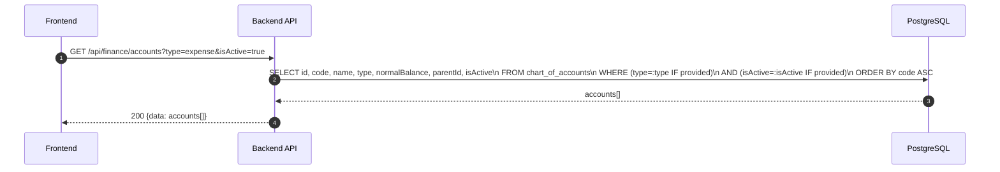

---

### API: `POST /api/finance/accounts`

**Purpose**: สร้างบัญชีใหม่ใน Chart of Accounts — ตรวจ duplicate code

**FE Screen**: `/finance/accounts`

**Params**: Path ไม่มี, Query ไม่มี

**Request Headers**
```json
{ "Authorization": "Bearer <access_token>" }
```

**Request Body**
```json
{
  "code": "5100",
  "name": "Salary Expense",
  "type": "expense",
  "normalBalance": "debit",
  "parentId": null,
  "description": null
}
```

**Response Body (201)**
```json
{
  "data": { "id": "acc_5100", "code": "5100", "name": "Salary Expense", "isActive": true },
  "message": "Account created"
}
```

**Sequence Diagram**
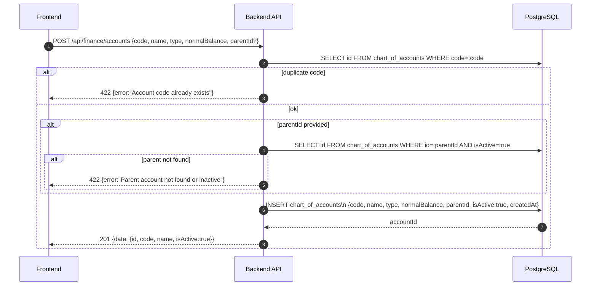

---

### API: `PATCH /api/finance/accounts/:id`

**Purpose**: แก้ไขข้อมูลบัญชี — code ไม่เปลี่ยน

**FE Screen**: `/finance/accounts`

**Params**: Path `id`, Query ไม่มี

**Request Headers**
```json
{ "Authorization": "Bearer <access_token>" }
```

**Request Body**
```json
{ "name": "Salary Expense - Updated", "description": "Includes all compensation" }
```

**Response Body (200)**
```json
{
  "data": { "id": "acc_5100", "name": "Salary Expense - Updated", "updatedAt": "2026-04-27T10:00:00Z" },
  "message": "Account updated"
}
```

**Sequence Diagram**
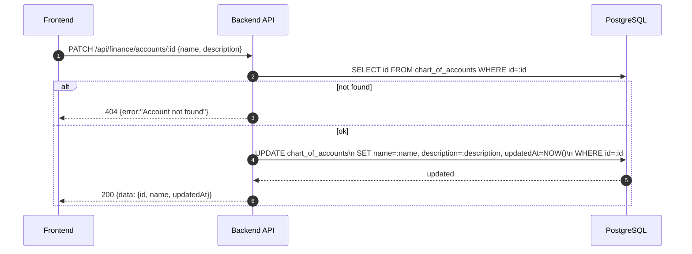

---

### API: `PATCH /api/finance/accounts/:id/activate`

**Purpose**: เปิด/ปิดการใช้งานบัญชี — inactive บล็อก posting ใหม่

**FE Screen**: `/finance/accounts`

**Params**: Path `id`, Query ไม่มี

**Request Headers**
```json
{ "Authorization": "Bearer <access_token>" }
```

**Request Body**
```json
{ "isActive": false }
```

**Response Body (200)**
```json
{
  "data": { "id": "acc_5100", "isActive": false, "updatedAt": "2026-04-27T10:00:00Z" },
  "message": "Account deactivated"
}
```

**Sequence Diagram**
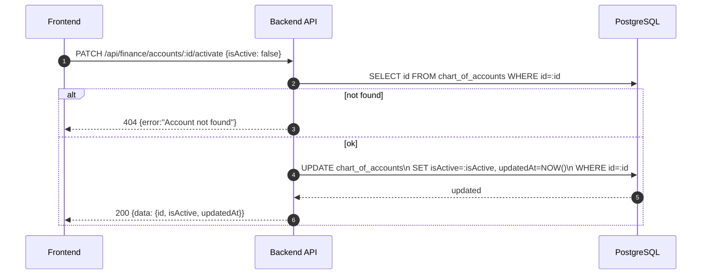

---

### API: `GET /api/finance/journal-entries`

**Purpose**: ดึงรายการ journal entries พร้อม filter และ pagination

**FE Screen**: `/finance/journal`

**Params**: Path ไม่มี, Query `page`, `limit`, `status` (draft|posted|reversed), `sourceModule`, `dateFrom`, `dateTo`

**Request Headers**
```json
{ "Authorization": "Bearer <access_token>" }
```

**Request Body**
```json
{}
```

**Response Body (200)**
```json
{
  "data": [
    {
      "id": "je_001",
      "referenceNo": "JE-2026-0001",
      "date": "2026-04-30",
      "description": "Month-end adjustment",
      "status": "posted",
      "sourceModule": "manual",
      "totalDebit": 15000,
      "totalCredit": 15000,
      "createdBy": "usr_001"
    }
  ],
  "pagination": { "page": 1, "limit": 20, "total": 45 }
}
```

**Sequence Diagram**
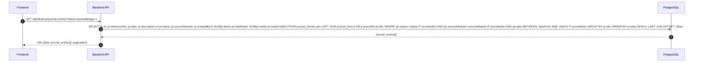

---

### API: `GET /api/finance/journal-entries/:id`

**Purpose**: ดึงรายละเอียด journal entry ครบ + lines พร้อม account info

**FE Screen**: `/finance/journal/:id`

**Params**: Path `id`, Query ไม่มี

**Request Headers**
```json
{ "Authorization": "Bearer <access_token>" }
```

**Request Body**
```json
{}
```

**Response Body (200)**
```json
{
  "data": {
    "id": "je_001",
    "referenceNo": "JE-2026-0001",
    "date": "2026-04-30",
    "description": "Month-end adjustment",
    "status": "posted",
    "sourceModule": "manual",
    "sourceType": null,
    "sourceId": null,
    "lines": [
      {
        "id": "jl_001",
        "accountId": "acc_5100",
        "accountCode": "5100",
        "accountName": "Salary Expense",
        "debit": 15000,
        "credit": 0,
        "description": "April salary"
      }
    ],
    "createdBy": { "id": "usr_001", "name": "นาย ก" },
    "postedAt": "2026-04-30T18:00:00Z"
  }
}
```

**Sequence Diagram**
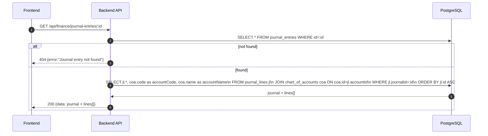

---

### API: `POST /api/finance/journal-entries`

**Purpose**: สร้าง draft journal entry — validate balanced (totalDebit = totalCredit)

**FE Screen**: `/finance/journal/new`

**Params**: Path ไม่มี, Query ไม่มี

**Request Headers**
```json
{ "Authorization": "Bearer <access_token>" }
```

**Request Body**
```json
{
  "date": "2026-04-30",
  "description": "Month-end adjustment",
  "lines": [
    { "accountId": "acc_5100", "debit": 15000, "credit": 0, "description": "April salary" },
    { "accountId": "acc_2300", "debit": 0, "credit": 15000, "description": "Accrued payroll" }
  ]
}
```

**Response Body (201)**
```json
{
  "data": {
    "id": "je_001",
    "referenceNo": "JE-2026-0001",
    "status": "draft",
    "totalDebit": 15000,
    "totalCredit": 15000
  },
  "message": "Journal entry created"
}
```

**Sequence Diagram**
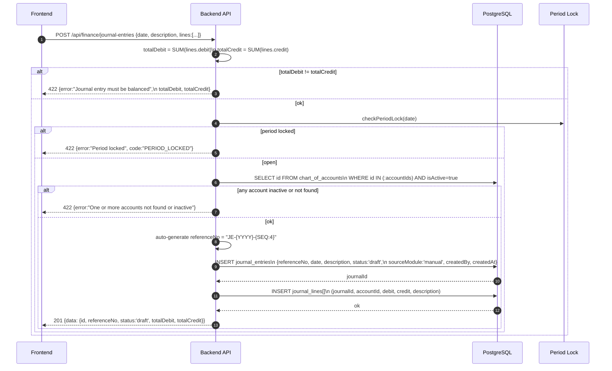

---

### API: `POST /api/finance/journal-entries/:id/post`

**Purpose**: Post journal entry — re-validate balanced + period lock + update account balances

**FE Screen**: `/finance/journal/:id` → ปุ่ม "Post"

**Params**: Path `id`, Query ไม่มี

**Request Headers**
```json
{ "Authorization": "Bearer <access_token>" }
```

**Request Body**
```json
{}
```

**Response Body (200)**
```json
{
  "data": { "id": "je_001", "status": "posted", "postedAt": "2026-04-30T18:00:00Z" },
  "message": "Journal entry posted"
}
```

**Sequence Diagram**
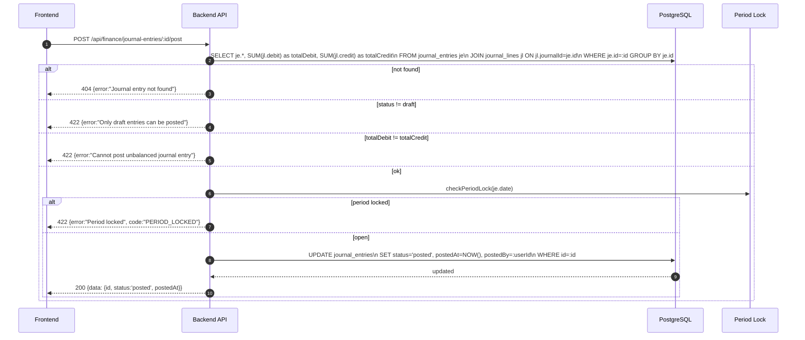

---

### API: `POST /api/finance/journal-entries/:id/reverse`

**Purpose**: Reverse posted journal — สร้าง entry ใหม่ที่ invert debit/credit + mark original reversed

**FE Screen**: `/finance/journal/:id` → ปุ่ม "Reverse"

**Params**: Path `id`, Query ไม่มี

**Request Headers**
```json
{ "Authorization": "Bearer <access_token>" }
```

**Request Body**
```json
{ "reversalDate": "2026-05-01", "reason": "Error correction" }
```

**Response Body (201)**
```json
{
  "data": {
    "id": "je_rev_001",
    "referenceNo": "JE-REV-2026-0001",
    "status": "posted",
    "reversedJournalId": "je_001"
  },
  "message": "Journal entry reversed"
}
```

**Sequence Diagram**
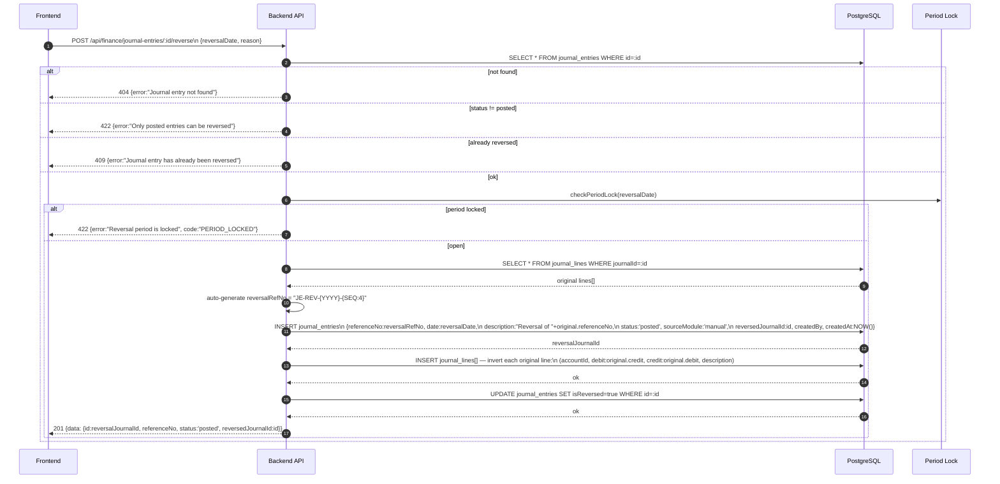

---

### API: `GET /api/finance/income-expense/summary`

**Purpose**: สรุปรายรับรายจ่ายตาม period — KPI ฝั่ง income-expense ledger

**FE Screen**: `/finance/income-expense`

**Params**: Path ไม่มี, Query `periodFrom` (YYYY-MM, required), `periodTo` (YYYY-MM, required)

**Request Headers**
```json
{ "Authorization": "Bearer <access_token>" }
```

**Request Body**
```json
{}
```

**Response Body (200)**
```json
{
  "data": {
    "period": { "from": "2026-01", "to": "2026-04" },
    "totalIncome": 850000,
    "totalExpense": 420000,
    "netBalance": 430000,
    "entryCount": 38
  }
}
```

**Sequence Diagram**
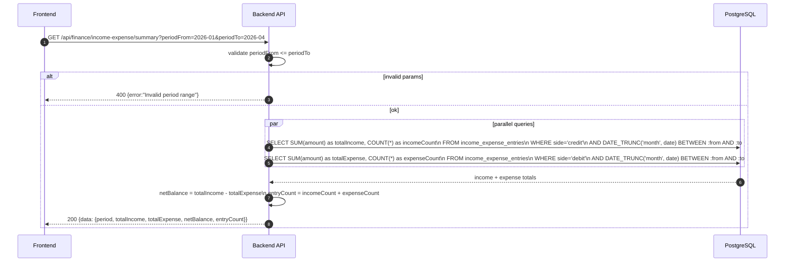

---

### API: `GET /api/finance/income-expense/entries`

**Purpose**: ดึงรายการ ledger entries พร้อม filter category/type/period

**FE Screen**: `/finance/income-expense`

**Params**: Path ไม่มี, Query `page`, `limit`, `type` (income|expense), `categoryId`, `dateFrom`, `dateTo`

**Request Headers**
```json
{ "Authorization": "Bearer <access_token>" }
```

**Request Body**
```json
{}
```

**Response Body (200)**
```json
{
  "data": [
    {
      "id": "ie_001",
      "date": "2026-04-25",
      "categoryId": "cat_001",
      "categoryName": "Salary Expense",
      "side": "debit",
      "amount": 1500,
      "description": "April petty cash",
      "createdBy": "usr_001"
    }
  ],
  "pagination": { "page": 1, "limit": 20, "total": 38 }
}
```

**Sequence Diagram**
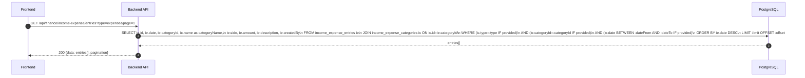

---

### API: `POST /api/finance/income-expense/entries`

**Purpose**: บันทึกรายการ manual income/expense entry

**FE Screen**: `/finance/income-expense/new`

**Params**: Path ไม่มี, Query ไม่มี

**Request Headers**
```json
{ "Authorization": "Bearer <access_token>" }
```

**Request Body**
```json
{
  "categoryId": "cat_001",
  "date": "2026-04-25",
  "amount": 1500,
  "side": "debit",
  "description": "April petty cash"
}
```

**Response Body (201)**
```json
{
  "data": { "id": "ie_001", "categoryId": "cat_001", "amount": 1500, "side": "debit" },
  "message": "Entry created"
}
```

**Sequence Diagram**
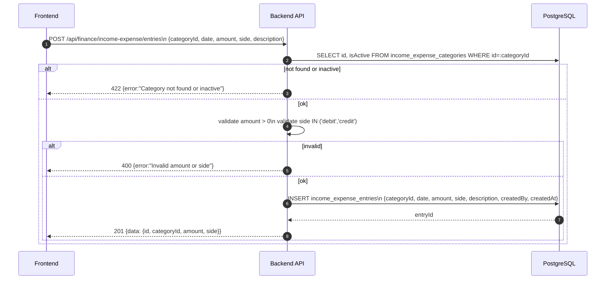

---

### API: `POST /api/finance/integrations/payroll/:runId/post`

**Purpose**: Post payroll run เข้า GL — ใช้ source mapping เพื่อ resolve debit/credit accounts

**FE Screen**: Payroll run detail → ปุ่ม "Post to Finance"

**Params**: Path `runId`, Query ไม่มี

**Request Headers**
```json
{ "Authorization": "Bearer <access_token>" }
```

**Request Body**
```json
{}
```

**Response Body (201)**
```json
{
  "data": { "journalEntryId": "je_010", "referenceNo": "JE-2026-0010" },
  "message": "Payroll posted to accounting"
}
```

**Sequence Diagram**
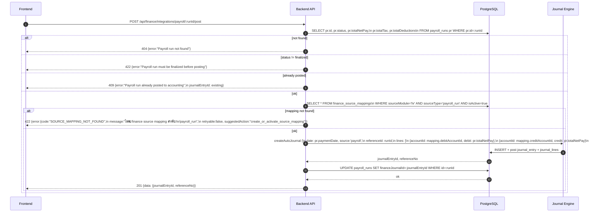

---

### API: `POST /api/finance/integrations/pm-expenses/:expenseId/post`

**Purpose**: Post PM expense เข้า GL — debit expense account / credit accrual account

**FE Screen**: PM Expense approval → auto-trigger หรือ manual post

**Params**: Path `expenseId`, Query ไม่มี

**Request Headers**
```json
{ "Authorization": "Bearer <access_token>" }
```

**Request Body**
```json
{}
```

**Response Body (201)**
```json
{
  "data": { "journalEntryId": "je_011", "referenceNo": "JE-2026-0011" },
  "message": "PM expense posted to accounting"
}
```

**Sequence Diagram**
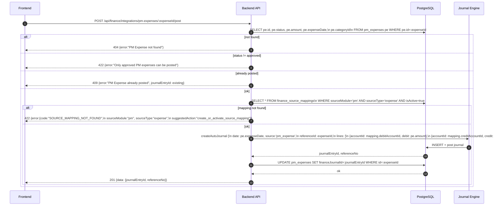

---

### API: `POST /api/finance/integrations/pm-budgets/:budgetId/post-adjustment`

**Purpose**: Post budget adjustment journal — ปรับ committed/actual สำหรับ PM budget ที่เปลี่ยนแปลง

**FE Screen**: PM Budget adjustment → auto-trigger

**Params**: Path `budgetId`, Query ไม่มี

**Request Headers**
```json
{ "Authorization": "Bearer <access_token>" }
```

**Request Body**
```json
{
  "adjustmentType": "committed",
  "delta": 15000,
  "reason": "PO approved"
}
```

**Response Body (201)**
```json
{
  "data": { "journalEntryId": "je_012", "referenceNo": "JE-2026-0012" },
  "message": "Budget adjustment posted"
}
```

**Sequence Diagram**
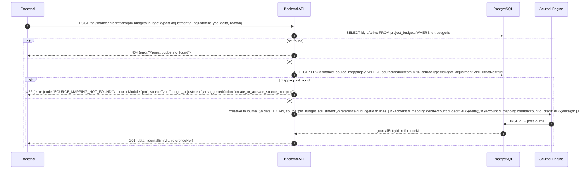

---

### API: `GET /api/finance/integrations/sources/:module/:sourceId/entries`

**Purpose**: ดู GL journal entries ทั้งหมดที่ linked กับ source document (invoice, AP bill, payroll run, etc.)

**FE Screen**: Invoice detail / AP Bill detail / Payroll run detail → GL Entries section

**Params**: Path `module` (ar|ap|hr|pm), `sourceId`, Query ไม่มี

**Request Headers**
```json
{ "Authorization": "Bearer <access_token>" }
```

**Request Body**
```json
{}
```

**Response Body (200)**
```json
{
  "data": [
    {
      "id": "je_001",
      "referenceNo": "JE-2026-0001",
      "date": "2026-04-30",
      "description": "AR Payment",
      "status": "posted",
      "lines": [
        { "accountCode": "1100", "accountName": "Cash at Bank", "debit": 16050, "credit": 0 },
        { "accountCode": "1200", "accountName": "Accounts Receivable", "debit": 0, "credit": 16050 }
      ]
    }
  ]
}
```

**Sequence Diagram**
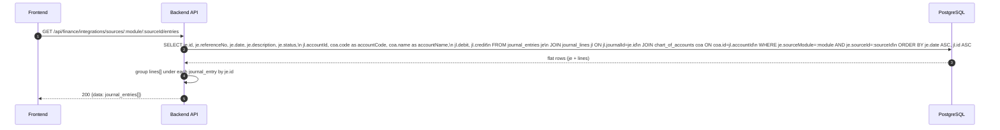

---

### API: `GET /api/finance/config/source-mappings`

**Purpose**: ดึงรายการ posting mappings — ใช้ใน integration post endpoints

**FE Screen**: `/finance/settings/source-mappings`

**Params**: Path ไม่มี, Query `sourceModule` (hr|pm|ar|ap), `sourceType`, `isActive`

**Request Headers**
```json
{ "Authorization": "Bearer <access_token>" }
```

**Request Body**
```json
{}
```

**Response Body (200)**
```json
{
  "data": [
    {
      "id": "map_001",
      "sourceModule": "hr",
      "sourceType": "payroll_run",
      "debitAccountId": "acc_5100",
      "debitAccountCode": "5100",
      "debitAccountName": "Salary Expense",
      "creditAccountId": "acc_2300",
      "creditAccountCode": "2300",
      "creditAccountName": "Accrued Payroll",
      "description": "Payroll net salary posting",
      "isActive": true
    }
  ]
}
```

**Sequence Diagram**
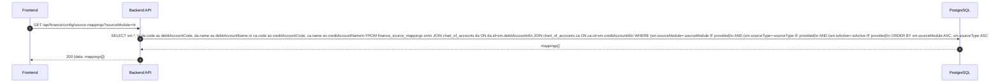

---

### API: `POST /api/finance/config/source-mappings`

**Purpose**: สร้าง mapping ใหม่สำหรับ source module/type pair — ตรวจ duplicate

**FE Screen**: `/finance/settings/source-mappings`

**Params**: Path ไม่มี, Query ไม่มี

**Request Headers**
```json
{ "Authorization": "Bearer <access_token>" }
```

**Request Body**
```json
{
  "sourceModule": "hr",
  "sourceType": "payroll_run",
  "debitAccountId": "acc_5100",
  "creditAccountId": "acc_2300",
  "description": "Payroll net salary posting"
}
```

**Response Body (201)**
```json
{
  "data": { "id": "map_001", "sourceModule": "hr", "sourceType": "payroll_run", "isActive": true },
  "message": "Source mapping created"
}
```

**Sequence Diagram**
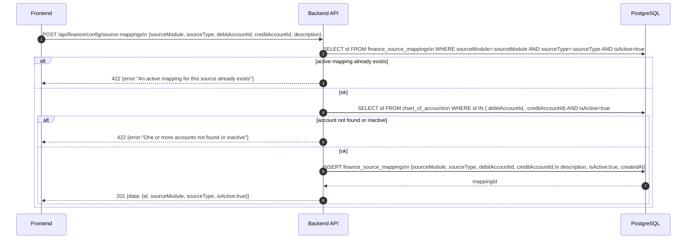

---

### API: `PATCH /api/finance/config/source-mappings/:id`

**Purpose**: แก้ไข account pair หรือ description ของ mapping

**FE Screen**: `/finance/settings/source-mappings`

**Params**: Path `id`, Query ไม่มี

**Request Headers**
```json
{ "Authorization": "Bearer <access_token>" }
```

**Request Body**
```json
{ "debitAccountId": "acc_6200", "creditAccountId": "acc_2300", "description": "Updated mapping" }
```

**Response Body (200)**
```json
{
  "data": { "id": "map_001", "debitAccountId": "acc_6200", "updatedAt": "2026-04-27T10:00:00Z" },
  "message": "Source mapping updated"
}
```

**Sequence Diagram**
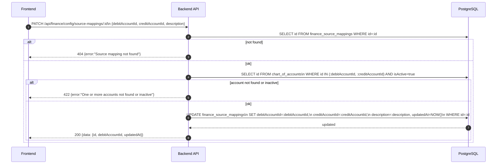

---

### API: `PATCH /api/finance/config/source-mappings/:id/activate`

**Purpose**: เปิด/ปิดการใช้งาน mapping — inactive บล็อก auto-post future transactions

**FE Screen**: `/finance/settings/source-mappings`

**Params**: Path `id`, Query ไม่มี

**Request Headers**
```json
{ "Authorization": "Bearer <access_token>" }
```

**Request Body**
```json
{ "isActive": false }
```

**Response Body (200)**
```json
{
  "data": { "id": "map_001", "isActive": false, "updatedAt": "2026-04-27T10:00:00Z" },
  "message": "Source mapping deactivated"
}
```

**Sequence Diagram**
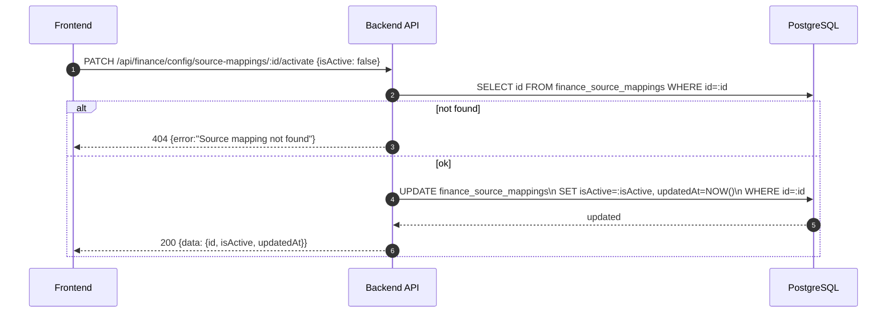

---

### API: `GET /api/finance/income-expense/categories`

**Purpose**: ดึงรายการ categories สำหรับ filter และ manual entry picker

**FE Screen**: `/finance/settings/categories`, `/finance/income-expense/new`

**Params**: Path ไม่มี, Query `type` (income|expense), `isActive`

**Request Headers**
```json
{ "Authorization": "Bearer <access_token>" }
```

**Request Body**
```json
{}
```

**Response Body (200)**
```json
{
  "data": [
    {
      "id": "cat_001",
      "name": "Salary Expense",
      "type": "expense",
      "accountCode": "5100",
      "isActive": true
    }
  ]
}
```

**Sequence Diagram**
```mermaid
sequenceDiagram
    autonumber
    participant FE as Frontend
    participant BE as Backend API
    participant DB as PostgreSQL

    FE->>BE: GET /api/finance/income-expense/categories?type=expense&isActive=true
    BE->>DB: SELECT id, name, type, accountCode, isActive\n  FROM income_expense_categories\n  WHERE (type=:type IF provided)\n    AND (isActive=:isActive IF provided)\n  ORDER BY type ASC, name ASC
    DB-->>BE: categories[]
    BE-->>FE: 200 {data: categories[]}
```

---

### API: `POST /api/finance/income-expense/categories`

**Purpose**: สร้าง category ใหม่และ map ไป accountCode

**FE Screen**: `/finance/settings/categories`

**Params**: Path ไม่มี, Query ไม่มี

**Request Headers**
```json
{ "Authorization": "Bearer <access_token>" }
```

**Request Body**
```json
{ "name": "Salary Expense", "type": "expense", "accountCode": "5100" }
```

**Response Body (201)**
```json
{
  "data": { "id": "cat_001", "name": "Salary Expense", "type": "expense", "isActive": true },
  "message": "Category created"
}
```

**Sequence Diagram**
```mermaid
sequenceDiagram
    autonumber
    participant FE as Frontend
    participant BE as Backend API
    participant DB as PostgreSQL

    FE->>BE: POST /api/finance/income-expense/categories {name, type, accountCode}
    BE->>BE: validate type IN ('income','expense')
    BE->>DB: SELECT id FROM chart_of_accounts WHERE code=:accountCode AND isActive=true
    alt account not found
        BE-->>FE: 422 {error:"Account code not found or inactive"}
    else ok
        BE->>DB: SELECT id FROM income_expense_categories\n  WHERE name=:name AND type=:type
        alt duplicate
            BE-->>FE: 422 {error:"Category with this name and type already exists"}
        else ok
            BE->>DB: INSERT income_expense_categories\n  {name, type, accountCode, isActive:true, createdAt}
            DB-->>BE: categoryId
            BE-->>FE: 201 {data: {id, name, type, isActive:true}}
        end
    end
```

---

### API: `PATCH /api/finance/income-expense/categories/:id`

**Purpose**: แก้ไข category และ account mapping

**FE Screen**: `/finance/settings/categories`

**Params**: Path `id`, Query ไม่มี

**Request Headers**
```json
{ "Authorization": "Bearer <access_token>" }
```

**Request Body**
```json
{ "name": "Salary & Compensation", "accountCode": "5100" }
```

**Response Body (200)**
```json
{
  "data": { "id": "cat_001", "name": "Salary & Compensation", "updatedAt": "2026-04-27T10:00:00Z" },
  "message": "Category updated"
}
```

**Sequence Diagram**
```mermaid
sequenceDiagram
    autonumber
    participant FE as Frontend
    participant BE as Backend API
    participant DB as PostgreSQL

    FE->>BE: PATCH /api/finance/income-expense/categories/:id {name, accountCode}
    BE->>DB: SELECT id FROM income_expense_categories WHERE id=:id
    alt not found
        BE-->>FE: 404 {error:"Category not found"}
    else ok
        alt accountCode provided
            BE->>DB: SELECT id FROM chart_of_accounts WHERE code=:accountCode AND isActive=true
            alt not found
                BE-->>FE: 422 {error:"Account code not found or inactive"}
            end
        end
        BE->>DB: UPDATE income_expense_categories\n  SET name=:name, accountCode=:accountCode, updatedAt=NOW()\n  WHERE id=:id
        DB-->>BE: updated
        BE-->>FE: 200 {data: {id, name, updatedAt}}
    end
```

---

### API: `PATCH /api/finance/income-expense/categories/:id/activate`

**Purpose**: เปิด/ปิด category — ไม่ลบประวัติที่ถูกอ้างอิงแล้ว

**FE Screen**: `/finance/settings/categories`

**Params**: Path `id`, Query ไม่มี

**Request Headers**
```json
{ "Authorization": "Bearer <access_token>" }
```

**Request Body**
```json
{ "isActive": false }
```

**Response Body (200)**
```json
{
  "data": { "id": "cat_001", "isActive": false, "updatedAt": "2026-04-27T10:00:00Z" },
  "message": "Category deactivated"
}
```

**Sequence Diagram**
```mermaid
sequenceDiagram
    autonumber
    participant FE as Frontend
    participant BE as Backend API
    participant DB as PostgreSQL

    FE->>BE: PATCH /api/finance/income-expense/categories/:id/activate {isActive: false}
    BE->>DB: SELECT id FROM income_expense_categories WHERE id=:id
    alt not found
        BE-->>FE: 404 {error:"Category not found"}
    else ok
        BE->>DB: UPDATE income_expense_categories\n  SET isActive=:isActive, updatedAt=NOW()\n  WHERE id=:id
        DB-->>BE: updated
        BE-->>FE: 200 {data: {id, isActive, updatedAt}}
    end
```

---

## Coverage Lock Addendum (2026-04-16)

### Accounts / Category Option Contracts
- `GET /api/finance/accounts`
  - item อย่างน้อยต้องมี `id`, `code`, `name`, `type`, `isActive`, `parentId`
  - ถ้าใช้เป็น picker ให้ FE สามารถ reuse endpoint นี้โดย filter `isActive=true`
- `GET /api/finance/income-expense/categories`
  - item อย่างน้อยต้องมี `id`, `name`, `type`, `accountCode`, `isActive`
- selector ฝั่ง UX ต้องยึด option source จากสอง endpoint นี้ ไม่ hardcode labels

### Journal Line Schema
- `POST /api/finance/journal-entries`
  - request body `lines[]` อย่างน้อยต้องมี `accountId`, `debit`, `credit`, `description?`
  - response detail ต้องคืน `lines[]` schema เดียวกันพร้อม account summary (`accountCode`, `accountName`)
- `GET /api/finance/journal-entries/:id`
  - detail response ต้องมี `status`, `date`, `description`, `sourceModule`, `sourceType`, `sourceId`, `lines[]`

### Source Mapping Recovery / Error Contract
- integration endpoint failures เช่น `POST /api/finance/integrations/payroll/:runId/post` ต้องตอบ error object อย่างน้อย:
```json
{
  "error": {
    "code": "SOURCE_MAPPING_NOT_FOUND",
    "message": "ไม่พบ finance source mapping สำหรับ hr/payroll_run",
    "retryable": false,
    "sourceModule": "hr",
    "sourceType": "payroll_run",
    "suggestedAction": "create_or_activate_source_mapping"
  }
}
```
- `GET /api/finance/config/source-mappings`
  - row อย่างน้อยต้องมี `id`, `sourceModule`, `sourceType`, `debitAccountId`, `creditAccountId`, `isActive`, `description`
