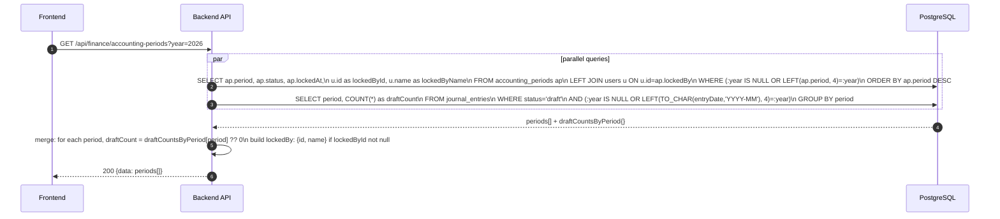
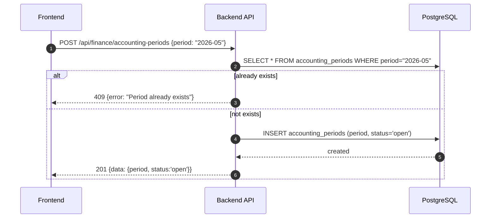
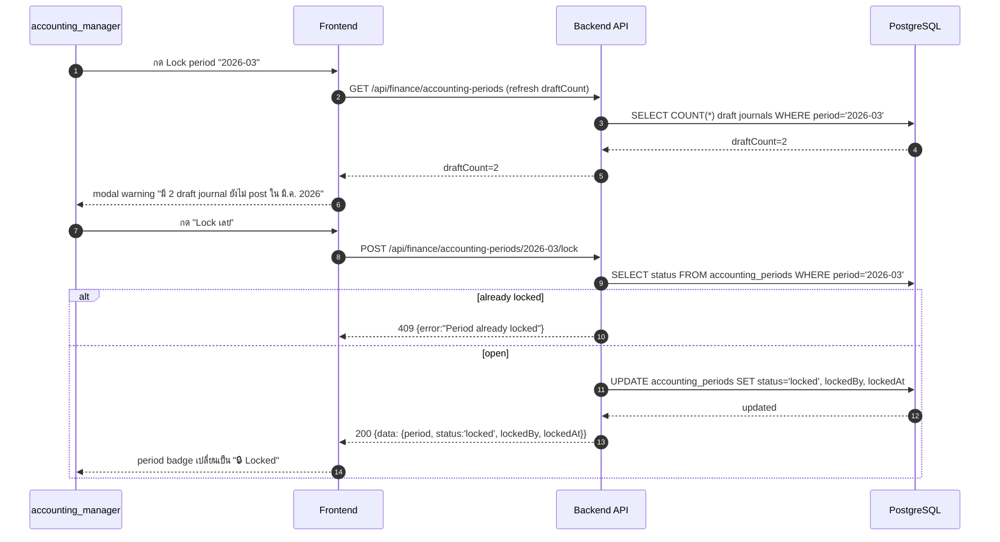
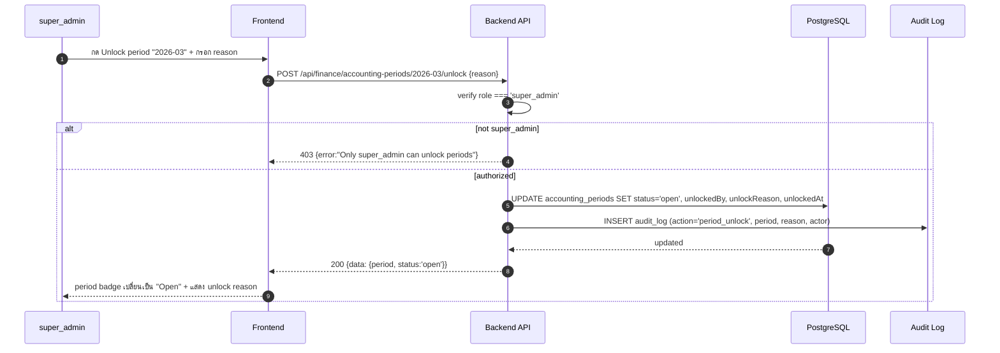
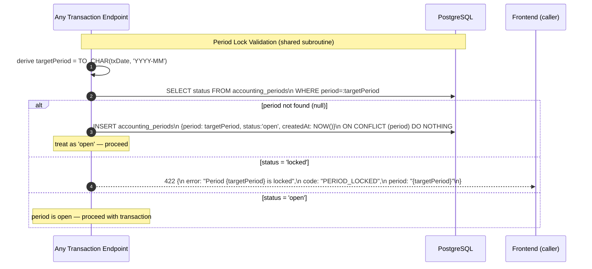

# Finance Module - Accounting Periods (Period Lock)

อ้างอิง: `Documents/Requirements/Release_3_Finance_Gaps.md` — Feature R3-08

## API Inventory
- `GET /api/finance/accounting-periods`
- `POST /api/finance/accounting-periods`
- `POST /api/finance/accounting-periods/:period/lock`
- `POST /api/finance/accounting-periods/:period/unlock`

## Cross-cutting Concern
Period Lock เป็น **validation hook** ที่ทุก endpoint ที่สร้าง/แก้ transaction ต้องเรียกก่อน commit:
- `POST /api/finance/journal-entries`
- `POST /api/finance/invoices`
- `PATCH /api/finance/invoices/:id/status`
- `POST /api/finance/ap/vendor-invoices`
- `POST /api/finance/ap/vendor-invoices/:id/payments`
- `POST /api/finance/tax/wht-certificates`
- `POST /api/inventory/products/:id/adjust`

Error code มาตรฐาน: `PERIOD_LOCKED` (HTTP 422)

---

## Endpoint Details

### API: `GET /api/finance/accounting-periods`

**Purpose**
- ดึงรายการ accounting periods พร้อมสถานะ open/locked

**FE Screen**
- `/finance/settings/accounting-periods`

**Params**
- Path Params: ไม่มี
- Query Params: `year` (optional, YYYY)

**Request Headers**
```json
{ "Authorization": "Bearer <access_token>" }
```

**Request Body**
```json
{}
```

**Response Body (200)**
```json
{
  "data": [
    {
      "period": "2026-04",
      "status": "open",
      "lockedBy": null,
      "lockedAt": null,
      "draftCount": 2
    },
    {
      "period": "2026-03",
      "status": "locked",
      "lockedBy": { "id": "usr_001", "name": "นาย ก สมบูรณ์" },
      "lockedAt": "2026-04-05T09:00:00Z",
      "draftCount": 0
    }
  ]
}
```

**Sequence Diagram**


---

### API: `POST /api/finance/accounting-periods`

**Purpose**
- สร้าง period record ใหม่ (auto-create เมื่อ first transaction ของ period นั้น หรือ manual)

**FE Screen**
- `/finance/settings/accounting-periods`

**Params**
- Path Params: ไม่มี
- Query Params: ไม่มี

**Request Headers**
```json
{ "Authorization": "Bearer <access_token>" }
```

**Request Body**
```json
{ "period": "2026-05" }
```

**Response Body (201)**
```json
{
  "data": { "period": "2026-05", "status": "open" },
  "message": "Period created"
}
```

**Sequence Diagram**


---

### API: `POST /api/finance/accounting-periods/:period/lock`

**Purpose**
- Lock accounting period — ป้องกัน backdating transaction ทุกประเภทในช่วงนั้น

**FE Screen**
- `/finance/settings/accounting-periods` → modal confirm

**Params**
- Path Params: `period` (YYYY-MM)
- Query Params: ไม่มี

**Request Headers**
```json
{ "Authorization": "Bearer <access_token>" }
```

**Request Body**
```json
{}
```

**Response Body (200)**
```json
{
  "data": {
    "period": "2026-03",
    "status": "locked",
    "lockedBy": "usr_001",
    "lockedAt": "2026-04-05T09:00:00Z"
  },
  "message": "Period locked"
}
```

**Sequence Diagram**


---

### API: `POST /api/finance/accounting-periods/:period/unlock`

**Purpose**
- Unlock period (เฉพาะ `super_admin`) — บันทึก audit trail ทุกครั้ง

**FE Screen**
- `/finance/settings/accounting-periods`

**Params**
- Path Params: `period` (YYYY-MM)
- Query Params: ไม่มี

**Request Headers**
```json
{ "Authorization": "Bearer <access_token>" }
```

**Request Body**
```json
{ "reason": "แก้ไข accrual entry ที่ผิดพลาด — อนุมัติโดย CFO" }
```

**Response Body (200)**
```json
{
  "data": {
    "period": "2026-03",
    "status": "open",
    "unlockedBy": "usr_super",
    "unlockReason": "แก้ไข accrual entry ที่ผิดพลาด — อนุมัติโดย CFO",
    "unlockedAt": "2026-04-10T10:00:00Z"
  },
  "message": "Period unlocked"
}
```

**Sequence Diagram**


---

## Period Lock Validation Hook (Cross-cutting)

ทุก endpoint ที่ create/update transaction ต้องเรียก validation นี้ก่อน commit:



---

## Coverage Lock Notes

### Period Format
- ใช้ `YYYY-MM` เสมอ (เช่น `2026-04`) — ไม่รับ full date เป็น period key
- ถ้า transaction date = `2026-04-15` → period = `2026-04`

### Permission Matrix
| Action | accounting_manager | finance_manager | super_admin |
|---|---|---|---|
| View periods | ✅ | ✅ | ✅ |
| Lock period | ✅ | ❌ | ✅ |
| Unlock period | ❌ | ❌ | ✅ |

### Auto-create Period
- เมื่อ transaction แรกของ period ถูกสร้าง ระบบ auto-insert record `{period, status:'open'}` ถ้ายังไม่มี
- ไม่ต้องให้ user สร้าง period ก่อนใช้งาน
