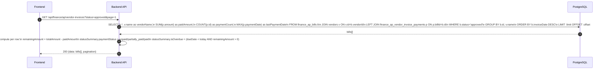
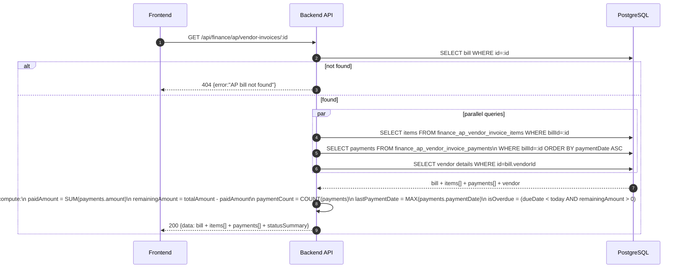
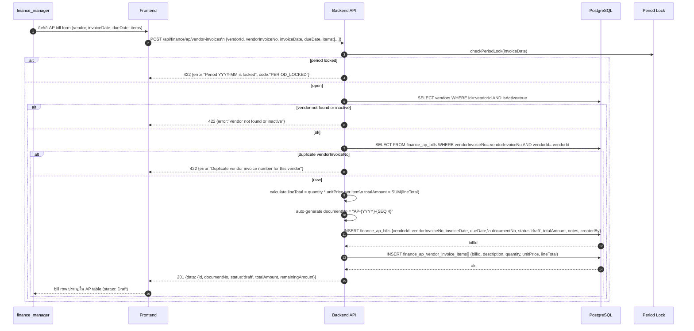
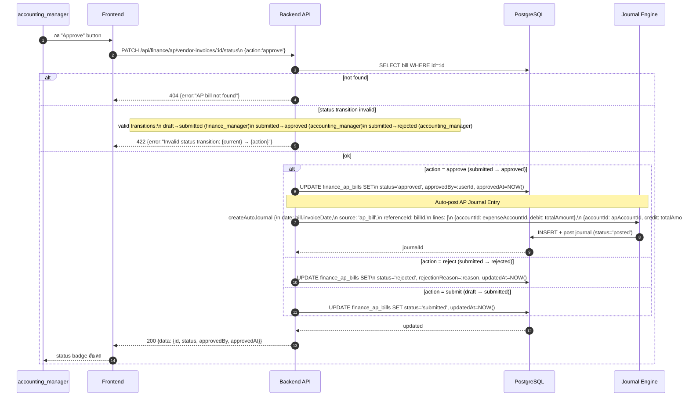
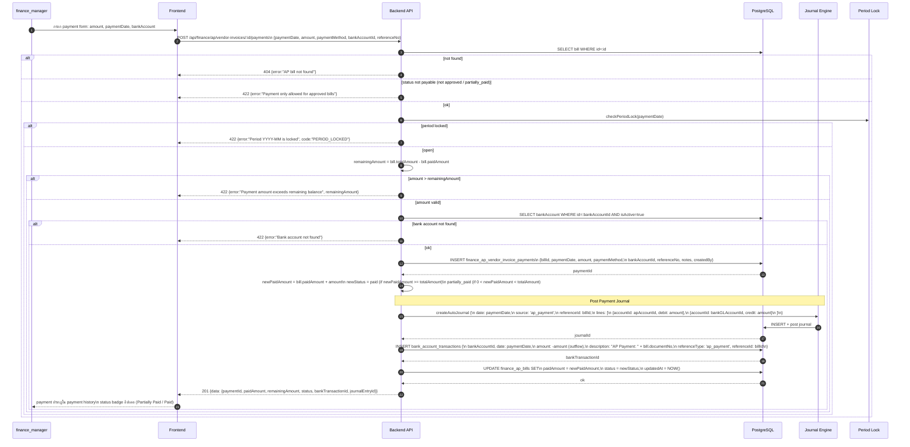

# Finance Module - Accounts Payable (Normalized)

อ้างอิง: `Documents/Requirements/Release_1.md` — Feature 1.8, `Documents/Requirements/Release_2.md`

## API Inventory
- `GET /api/finance/ap/vendor-invoices`
- `GET /api/finance/ap/vendor-invoices/:id`
- `POST /api/finance/ap/vendor-invoices`
- `PATCH /api/finance/ap/vendor-invoices/:id/status`
- `POST /api/finance/ap/vendor-invoices/:id/payments`

---

## Endpoint Details

### API: `GET /api/finance/ap/vendor-invoices`

**Purpose**
- ดึงรายการ AP bills ทั้งหมดพร้อม filter status, vendor, วันที่ และ pagination

**FE Screen**
- `/finance/ap`

**Params**
- Query Params: `status` (draft|submitted|approved|rejected|paid|partially_paid), `vendorId`, `invoiceDateFrom` (YYYY-MM-DD), `invoiceDateTo` (YYYY-MM-DD), `search` (documentNo/vendorInvoiceNo), `page`, `limit`

**Response Body (200)**
```json
{
  "data": [
    {
      "id": "ap_001",
      "documentNo": "AP-2026-0001",
      "vendorId": "ven_001",
      "vendorName": "บ.XYZ ซัพพลาย จำกัด",
      "vendorInvoiceNo": "V-INV-778",
      "invoiceDate": "2026-04-05",
      "dueDate": "2026-05-05",
      "totalAmount": 12000,
      "paidAmount": 4000,
      "remainingAmount": 8000,
      "paymentCount": 1,
      "status": "partially_paid",
      "statusSummary": {
        "documentStatus": "approved",
        "paymentStatus": "partially_paid",
        "isOverdue": false,
        "lastPaymentDate": "2026-04-20"
      }
    }
  ],
  "pagination": { "page": 1, "limit": 20, "total": 15 }
}
```

**Sequence Diagram**


---

### API: `GET /api/finance/ap/vendor-invoices/:id`

**Purpose**
- ดู AP bill detail พร้อม line items, ประวัติการชำระเงิน (payments), และ statusSummary ครบ

**FE Screen**
- `/finance/ap/:id`

**Response Body (200)**
```json
{
  "data": {
    "id": "ap_001",
    "documentNo": "AP-2026-0001",
    "vendorId": "ven_001",
    "vendorName": "บ.XYZ ซัพพลาย จำกัด",
    "vendorInvoiceNo": "V-INV-778",
    "invoiceDate": "2026-04-05",
    "dueDate": "2026-05-05",
    "notes": "Office supplies April",
    "totalAmount": 12000,
    "paidAmount": 4000,
    "remainingAmount": 8000,
    "paymentCount": 1,
    "status": "partially_paid",
    "statusSummary": {
      "documentStatus": "approved",
      "paymentStatus": "partially_paid",
      "isOverdue": false,
      "lastPaymentDate": "2026-04-20"
    },
    "items": [
      {
        "id": "api_001",
        "description": "Printer supplies",
        "quantity": 10,
        "unitPrice": 1200,
        "lineTotal": 12000
      }
    ],
    "payments": [
      {
        "id": "pay_001",
        "paymentDate": "2026-04-20",
        "amount": 4000,
        "paymentMethod": "bank_transfer",
        "referenceNo": "BANK-REF-001",
        "bankAccountId": "bk_001",
        "bankTransactionId": "txn_001"
      }
    ],
    "approvedBy": { "id": "usr_002", "name": "นาง ข" },
    "approvedAt": "2026-04-06T10:00:00Z",
    "createdBy": { "id": "usr_001", "name": "นาย ก" }
  }
}
```

**Sequence Diagram**


---

### API: `POST /api/finance/ap/vendor-invoices`

**Purpose**
- สร้าง AP bill ใหม่ (draft) — รองรับ inline create vendor ถ้ายังไม่มีในระบบ

**FE Screen**
- `/finance/ap` → inline create form หรือ modal

**Request Body**
```json
{
  "vendorId": "ven_001",
  "vendorInvoiceNo": "V-INV-778",
  "invoiceDate": "2026-04-05",
  "dueDate": "2026-05-05",
  "notes": "Office supplies April",
  "items": [
    { "description": "Printer supplies", "quantity": 10, "unitPrice": 1200 }
  ]
}
```

**Response Body (201)**
```json
{
  "data": {
    "id": "ap_001",
    "documentNo": "AP-2026-0001",
    "status": "draft",
    "totalAmount": 12000,
    "remainingAmount": 12000
  },
  "message": "AP bill created"
}
```

**Sequence Diagram**


---

### API: `PATCH /api/finance/ap/vendor-invoices/:id/status`

**Purpose**
- เปลี่ยน status ตาม workflow: `draft → submitted → approved` หรือ `submitted → rejected`
- `accounting_manager` หรือ `finance_manager` เป็นผู้ approve

**FE Screen**
- `/finance/ap` → ปุ่ม "Submit", "Approve", "Reject" ต่อแต่ละ bill

**Request Body**
```json
{
  "action": "approve",
  "reason": null
}
```
หรือ reject:
```json
{
  "action": "reject",
  "reason": "ข้อมูลไม่ครบถ้วน กรุณาแนบใบเสร็จ"
}
```

**Response Body (200)**
```json
{
  "data": {
    "id": "ap_001",
    "status": "approved",
    "approvedBy": "usr_002",
    "approvedAt": "2026-04-06T10:00:00Z"
  },
  "message": "AP bill approved"
}
```

**Sequence Diagram**


---

### API: `POST /api/finance/ap/vendor-invoices/:id/payments`

**Purpose**
- บันทึกการจ่ายเงิน AP (full หรือ partial) พร้อม bank account linkage และ auto-post payment journal
- เพิ่ม payment ได้เฉพาะ status = `approved` หรือ `partially_paid` เท่านั้น

**FE Screen**
- `/finance/ap/:id` → ปุ่ม "บันทึกการชำระ"

**Request Body**
```json
{
  "paymentDate": "2026-04-20",
  "amount": 4000,
  "paymentMethod": "bank_transfer",
  "bankAccountId": "bk_001",
  "referenceNo": "BANK-REF-001",
  "notes": "จ่ายงวดที่ 1"
}
```

**Response Body (201)**
```json
{
  "data": {
    "paymentId": "pay_001",
    "billId": "ap_001",
    "paidAmount": 4000,
    "remainingAmount": 8000,
    "status": "partially_paid",
    "bankTransactionId": "txn_001",
    "journalEntryId": "je_ap_001"
  },
  "message": "Payment recorded"
}
```

**Sequence Diagram**


---

## Coverage Lock Notes

### Status Workflow
```
draft → submitted → approved → partially_paid → paid
                 ↘ rejected
```
- `draft`: สร้างใหม่, แก้ไขได้
- `submitted`: ส่งให้ accounting_manager review
- `approved`: พร้อมบันทึกการจ่าย
- `partially_paid`: จ่ายบางส่วน (paidAmount > 0 แต่ < totalAmount)
- `paid`: จ่ายครบ (paidAmount >= totalAmount)
- `rejected`: ถูกปฏิเสธ — ต้องสร้างใหม่ถ้าต้องการดำเนินการต่อ

### documentNo Auto-generation
- Format: `AP-{YYYY}-{4-digit seq}` เช่น `AP-2026-0001`
- Sequence reset ทุกปี

### Duplicate Invoice Guard
- ตรวจ `vendorInvoiceNo + vendorId` คู่กัน ก่อน INSERT
- ป้องกัน double-posting ใบแจ้งหนี้เดียวกันจาก vendor

### AP Journal Entries
- **Approve**: DR Expense Account / CR Accounts Payable (`apAccountId`)
- **Payment**: DR Accounts Payable / CR Bank GL Account
- `apAccountId` ดึงจาก `finance_config.source_mappings` (module='ap_bill') หรือ global AP account setting

### Bank Ledger Side Effect
- `POST /id/payments` ต้อง INSERT `bank_account_transactions` (outflow)
- คืน `bankTransactionId` ใน response
- Bank balance อัปเดตผ่าน `bank_accounts.currentBalance -= amount`

### paidAmount Aggregation
- `paidAmount = SUM(finance_ap_vendor_invoice_payments.amount)` per bill
- `remainingAmount = totalAmount - paidAmount`
- `statusSummary.isOverdue = (dueDate < today AND remainingAmount > 0)`
