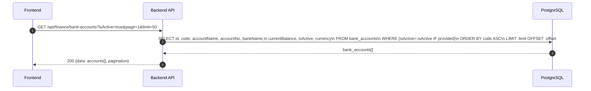
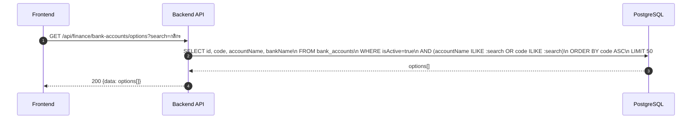
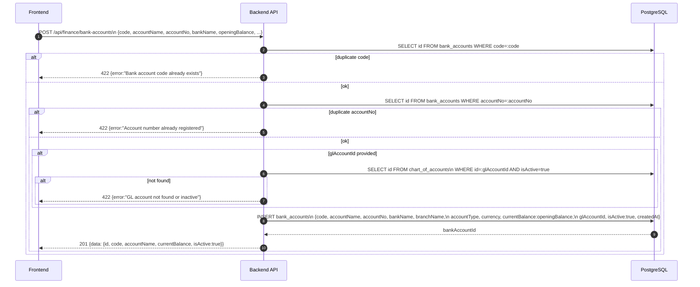
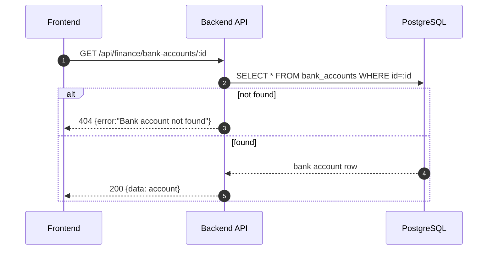
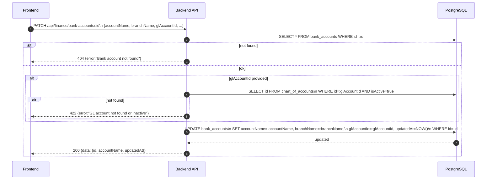
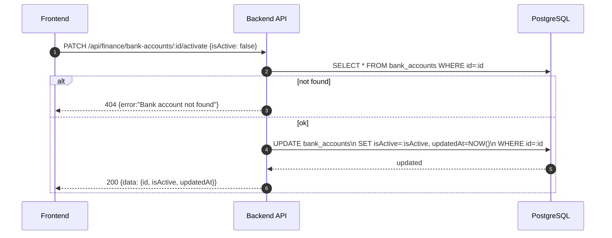
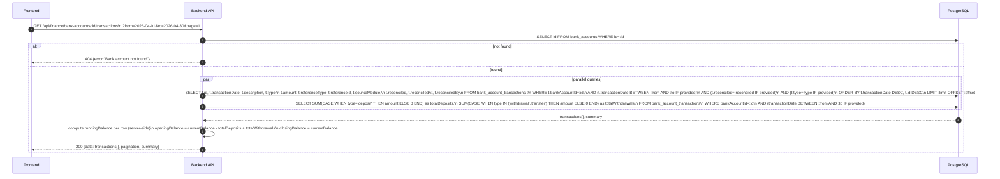
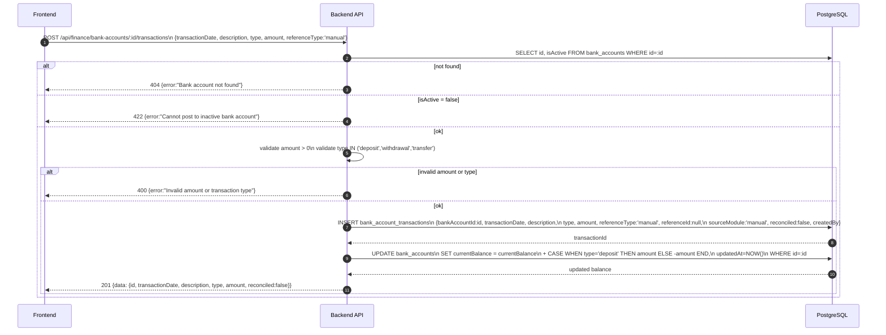
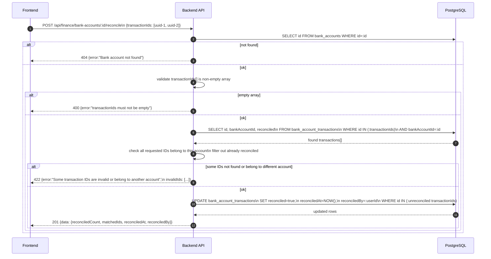

# Finance Module - Bank Accounts (Normalized)

อ้างอิง: `Documents/Release_2.md`

## API Inventory
- `GET /api/finance/bank-accounts`
- `GET /api/finance/bank-accounts/options`
- `POST /api/finance/bank-accounts`
- `GET /api/finance/bank-accounts/:id`
- `PATCH /api/finance/bank-accounts/:id`
- `PATCH /api/finance/bank-accounts/:id/activate`
- `GET /api/finance/bank-accounts/:id/transactions`
- `POST /api/finance/bank-accounts/:id/transactions`
- `POST /api/finance/bank-accounts/:id/reconcile`

## Endpoint Details

### API: `GET /api/finance/bank-accounts`

**Purpose**
- ดึงรายชื่อบัญชีธนาคารทั้งหมด (Sub-flow A — List)

**FE Screen**
- BankAccountList (document: `Documents/UI_Flow_mockup/Page/R2-05_Cash_Bank_Management/BankAccountList.md`)

**Params**
- Path Params: ไม่มี
- Query Params: `page`, `limit`, `isActive` (optional)

**Request Headers**
```json
{
  "Authorization": "Bearer <access_token>"
}
```

**Request Body**
```json
{}
```

**Response Body (200)**
```json
{
  "data": [
    {
      "id": "uuid",
      "code": "BA-001",
      "accountName": "บัญชีหลัก",
      "accountNo": "***9921",
      "bankName": "ธนาคารกสิกรไทย",
      "currentBalance": 1240500,
      "isActive": true,
      "currency": "THB"
    }
  ],
  "pagination": {
    "page": 1,
    "limit": 50,
    "total": 5
  }
}
```

**Sequence Diagram**


---

### API: `GET /api/finance/bank-accounts/options`

**Purpose**
- Dropdown list สำหรับ AR payment / AP payment form — active accounts only

**FE Screen**
- Invoice payment form, AP Bill payment form → bank account dropdown

**Params**
- Path Params: ไม่มี
- Query Params: `search` (accountName/code), `currency` (optional)

**Request Headers**
```json
{
  "Authorization": "Bearer <access_token>"
}
```

**Request Body**
```json
{}
```

**Response Body (200)**
```json
{
  "data": [
    {
      "id": "bk_001",
      "code": "BA-001",
      "accountName": "บัญชีหลัก",
      "bankName": "ธนาคารกสิกรไทย"
    }
  ]
}
```

**Sequence Diagram**


---

### API: `POST /api/finance/bank-accounts`

**Purpose**
- สร้างบัญชีธนาคารใหม่ (Sub-flow C — Create)

**FE Screen**
- BankAccountForm (document: `Documents/UI_Flow_mockup/Page/R2-05_Cash_Bank_Management/BankAccountForm.md`)

**Params**
- Path Params: ไม่มี
- Query Params: ไม่มี

**Request Headers**
```json
{
  "Authorization": "Bearer <access_token>",
  "Content-Type": "application/json"
}
```

**Request Body**
```json
{
  "code": "BA-001",
  "accountName": "บัญชีหลัก",
  "accountNo": "1234567890",
  "bankName": "ธนาคารกสิกรไทย",
  "branchName": "สาขากลาง",
  "accountType": "saving",
  "currency": "THB",
  "openingBalance": 500000,
  "glAccountId": "uuid-optional"
}
```

**Response Body (201)**
```json
{
  "data": {
    "id": "uuid",
    "code": "BA-001",
    "accountName": "บัญชีหลัก",
    "currentBalance": 500000,
    "isActive": true
  },
  "message": "บัญชีธนาคารถูกสร้างสำเร็จ"
}
```

**Sequence Diagram**


---

### API: `GET /api/finance/bank-accounts/:id`

**Purpose**
- ดูรายละเอียด bank account ครบ พร้อม balance summary

**FE Screen**
- BankAccountDetail (document: `Documents/UI_Flow_mockup/Page/R2-05_Cash_Bank_Management/BankAccountList.md`)

**Params**
- Path Params: `id` (bank account ID)
- Query Params: ไม่มี

**Request Headers**
```json
{
  "Authorization": "Bearer <access_token>"
}
```

**Request Body**
```json
{}
```

**Response Body (200)**
```json
{
  "data": {
    "id": "bk_001",
    "code": "BA-001",
    "accountName": "บัญชีหลัก",
    "accountNo": "***9921",
    "bankName": "ธนาคารกสิกรไทย",
    "branchName": "สาขากลาง",
    "accountType": "saving",
    "currency": "THB",
    "currentBalance": 1240500,
    "glAccountId": "coa_001",
    "isActive": true,
    "createdAt": "2026-01-01T00:00:00Z",
    "updatedAt": "2026-04-27T08:00:00Z"
  }
}
```

**Sequence Diagram**


---

### API: `PATCH /api/finance/bank-accounts/:id`

**Purpose**
- แก้ไขข้อมูล bank account — code และ accountNo ไม่เปลี่ยน

**FE Screen**
- BankAccountForm edit mode

**Params**
- Path Params: `id` (bank account ID)
- Query Params: ไม่มี

**Request Headers**
```json
{
  "Authorization": "Bearer <access_token>",
  "Content-Type": "application/json"
}
```

**Request Body**
```json
{
  "accountName": "บัญชีหลัก (ปรับปรุง)",
  "bankName": "ธนาคารกสิกรไทย",
  "branchName": "สาขาสีลม",
  "glAccountId": "coa_001"
}
```

**Response Body (200)**
```json
{
  "data": {
    "id": "bk_001",
    "accountName": "บัญชีหลัก (ปรับปรุง)",
    "updatedAt": "2026-04-27T10:00:00Z"
  },
  "message": "อัปเดตบัญชีธนาคารสำเร็จ"
}
```

**Sequence Diagram**


---

### API: `PATCH /api/finance/bank-accounts/:id/activate`

**Purpose**
- Toggle isActive: deactivate บล็อก posting ใหม่ แต่ยังอ่าน history ได้

**FE Screen**
- BankAccountList → toggle active/inactive

**Params**
- Path Params: `id` (bank account ID)
- Query Params: ไม่มี

**Request Headers**
```json
{
  "Authorization": "Bearer <access_token>",
  "Content-Type": "application/json"
}
```

**Request Body**
```json
{ "isActive": false }
```

**Response Body (200)**
```json
{
  "data": {
    "id": "bk_001",
    "isActive": false,
    "updatedAt": "2026-04-27T10:00:00Z"
  },
  "message": "บัญชีธนาคารถูก deactivate สำเร็จ"
}
```

**Sequence Diagram**


---

### API: `GET /api/finance/bank-accounts/:id/transactions`

**Purpose**
- ดึงรายการเคลื่อนไหวของบัญชี (Sub-flow F — Transactions list)

**FE Screen**
- BankTransactions (document: `Documents/UI_Flow_mockup/Page/R2-05_Cash_Bank_Management/BankTransactions.md`)

**Params**
- Path Params: `id` (bank account ID)
- Query Params: `from` (date), `to` (date), `reconciled` (true/false), `type` (deposit/withdrawal/transfer), `page`, `limit`

**Request Headers**
```json
{
  "Authorization": "Bearer <access_token>"
}
```

**Request Body**
```json
{}
```

**Response Body (200)**
```json
{
  "data": [
    {
      "id": "uuid",
      "transactionDate": "2026-04-15",
      "description": "โอนเข้า — ลูกค้าโอน",
      "type": "deposit",
      "amount": 50000,
      "runningBalance": 1240500,
      "referenceType": "invoice_payment",
      "referenceId": "INV-001",
      "sourceModule": "ar",
      "reconciled": true,
      "reconciledAt": "2026-04-15T10:30:00Z",
      "reconciledBy": "user-uuid"
    }
  ],
  "pagination": {
    "page": 1,
    "limit": 50,
    "total": 12
  },
  "summary": {
    "openingBalance": 1190500,
    "closingBalance": 1240500,
    "totalDeposits": 50000,
    "totalWithdrawals": 0
  }
}
```

**Sequence Diagram**


---

### API: `POST /api/finance/bank-accounts/:id/transactions`

**Purpose**
- บันทึกรายการเคลื่อนไหวด้วยมือ (Sub-flow G — Manual transaction)

**FE Screen**
- BankTransactions form (document: `Documents/UI_Flow_mockup/Page/R2-05_Cash_Bank_Management/BankTransactions.md`)

**Params**
- Path Params: `id` (bank account ID)
- Query Params: ไม่มี

**Request Headers**
```json
{
  "Authorization": "Bearer <access_token>",
  "Content-Type": "application/json"
}
```

**Request Body**
```json
{
  "transactionDate": "2026-04-12",
  "description": "ค่าธรรมเนียมธนาคาร",
  "type": "withdrawal",
  "amount": 25,
  "referenceType": "manual"
}
```

**Response Body (201)**
```json
{
  "data": {
    "id": "uuid",
    "transactionDate": "2026-04-12",
    "description": "ค่าธรรมเนียมธนาคาร",
    "type": "withdrawal",
    "amount": 25,
    "reconciled": false
  },
  "message": "บันทึกรายการสำเร็จ"
}
```

**Sequence Diagram**


---

### API: `POST /api/finance/bank-accounts/:id/reconcile`

**Purpose**
- ทำการกระทบยอด — mark รายการที่ตรงกับ bank statement (Sub-flow H — Reconcile)

**FE Screen**
- BankReconciliation (document: `Documents/UI_Flow_mockup/Page/R2-05_Cash_Bank_Management/BankReconciliation.md`)

**Params**
- Path Params: `id` (bank account ID)
- Query Params: ไม่มี

**Request Headers**
```json
{
  "Authorization": "Bearer <access_token>",
  "Content-Type": "application/json"
}
```

**Request Body**
```json
{
  "transactionIds": [
    "uuid-1",
    "uuid-2"
  ]
}
```

**Response Body (201)**
```json
{
  "data": {
    "reconciledCount": 2,
    "matchedIds": ["uuid-1", "uuid-2"],
    "reconciledAt": "2026-04-15T14:30:00Z",
    "reconciledBy": "user-uuid"
  },
  "message": "กระทบยอด 2 รายการสำเร็จ"
}
```

**Sequence Diagram**


---

## Coverage Lock Addendum (2026-04-16)

### Required Contracts
- account list ต้องคืน `{ id, code, accountName, accountNo, bankName, currentBalance, isActive, currency }`
- account options (dropdown) ต้องคืน `{ id, code, accountName, bankName }` filter `isActive = true`
- transactions endpoint query params ต้องรองรับ `from`, `to`, `type`, `reconciled`, `page`, `limit`
- transaction row ต้องมี `id`, `transactionDate`, `description`, `type` (deposit/withdrawal/transfer), `amount`, `referenceType`, `referenceId`, `sourceModule`, `reconciled`, `reconciledAt`, `reconciledBy`
- reconcile request ต้องเป็น batch: `{ transactionIds: [uuid, ...] }` — ไม่ใช่ single match
- reconcile response ต้องมี `reconciledCount`, `matchedIds`, `reconciledAt`, `reconciledBy`
- ถ้ามี movement ที่มาจาก AR/AP payment ต้อง set `sourceModule` และ `referenceId` ชี้ไปยัง invoice/AP bill

### Side Effects Lock
- AR/AP payment create ที่ระบุ `bankAccountId` ต้องสร้าง movement row ใน bank ledger
- inactive bank account ต้อง block new postings แต่ยังอ่าน history ได้
