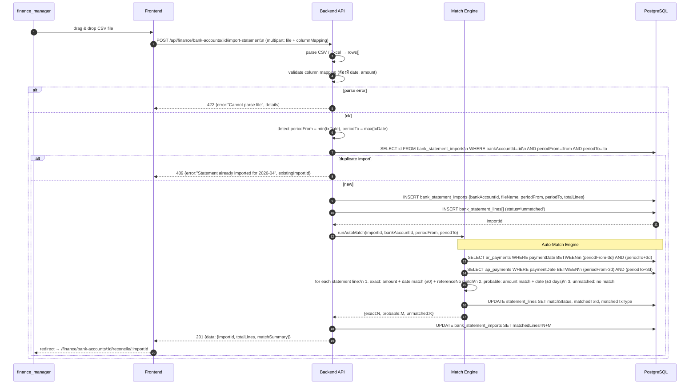
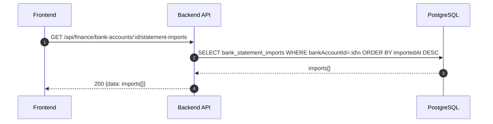
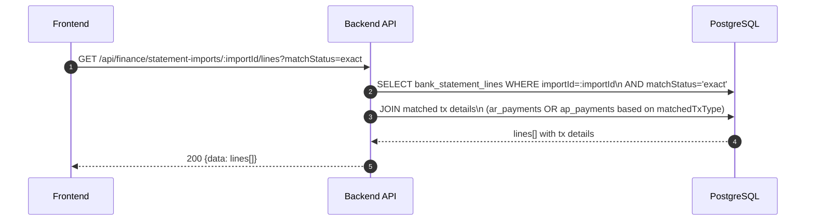
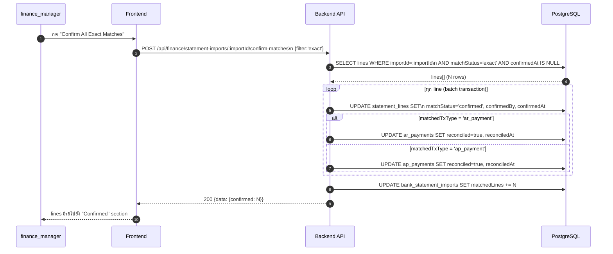
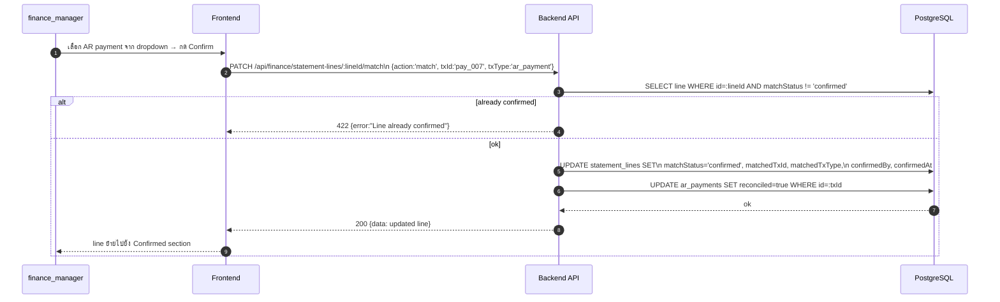
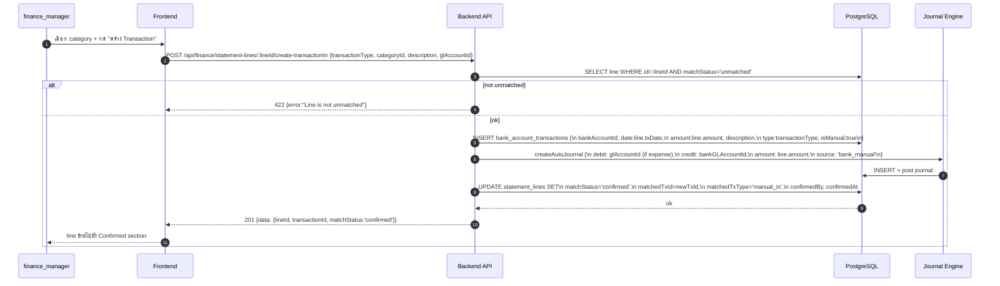

# Finance Module - Bank Statement Import & Auto-match

อ้างอิง: `Documents/Requirements/Release_3_Finance_Gaps.md` — Feature R3-04

## API Inventory
- `POST /api/finance/bank-accounts/:id/import-statement`
- `GET /api/finance/bank-accounts/:id/statement-imports`
- `GET /api/finance/statement-imports/:importId/lines`
- `POST /api/finance/statement-imports/:importId/confirm-matches`
- `PATCH /api/finance/statement-lines/:lineId/match`
- `POST /api/finance/statement-lines/:lineId/create-transaction`

---

## Endpoint Details

### API: `POST /api/finance/bank-accounts/:id/import-statement`

**Purpose**
- Upload CSV/Excel bank statement → parse → detect duplicate → run auto-match engine

**FE Screen**
- Bank Account Detail → Tab "Reconcile" → drag-drop zone

**Params**
- Path Params: `id` (bankAccountId)
- Query Params: ไม่มี

**Request Headers**
```json
{
  "Authorization": "Bearer <access_token>",
  "Content-Type": "multipart/form-data"
}
```

**Request Body (multipart)**
```
file: <CSV or XLSX file>
columnMapping: {
  "date": "วันที่",
  "description": "รายการ",
  "credit": "เงินเข้า",
  "debit": "เงินออก",
  "balance": "คงเหลือ",
  "reference": "อ้างอิง"
}
```

**Response Body (201)**
```json
{
  "data": {
    "importId": "imp_001",
    "totalLines": 45,
    "matchSummary": {
      "exact": 12,
      "probable": 8,
      "unmatched": 25
    },
    "periodFrom": "2026-04-01",
    "periodTo": "2026-04-30"
  },
  "message": "Statement imported and auto-matched"
}
```

**Sequence Diagram**


---

### API: `GET /api/finance/bank-accounts/:id/statement-imports`

**Purpose**
- ดูประวัติ import ทั้งหมดของบัญชีนั้น

**FE Screen**
- Bank Account Detail → Tab "Reconcile" → import history

**Response Body (200)**
```json
{
  "data": [
    {
      "importId": "imp_001",
      "fileName": "kbank_apr2026.csv",
      "periodFrom": "2026-04-01",
      "periodTo": "2026-04-30",
      "totalLines": 45,
      "matchedLines": 20,
      "status": "pending",
      "importedAt": "2026-04-28T10:00:00Z"
    }
  ]
}
```

**Sequence Diagram**


---

### API: `GET /api/finance/statement-imports/:importId/lines`

**Purpose**
- ดู statement lines พร้อม match status และ linked transaction detail

**FE Screen**
- `/finance/bank-accounts/:id/reconcile/:importId`

**Params**
- Path Params: `importId`
- Query Params: `matchStatus` (exact|probable|unmatched|confirmed), `page`, `limit`

**Response Body (200)**
```json
{
  "data": [
    {
      "id": "line_001",
      "txDate": "2026-04-15",
      "description": "โอนเงิน INV-2026-039",
      "amount": 220000,
      "referenceNo": "TT20260415",
      "balance": 2100000,
      "matchStatus": "exact",
      "matchedTx": {
        "id": "pay_001",
        "type": "ar_payment",
        "invoiceNo": "INV-2026-039",
        "customerName": "บ.MNO กรุ๊ป",
        "amount": 220000,
        "paymentDate": "2026-04-15"
      },
      "confirmedAt": null
    }
  ],
  "pagination": { "page": 1, "limit": 50, "total": 45 }
}
```

**Sequence Diagram**


---

### API: `POST /api/finance/statement-imports/:importId/confirm-matches`

**Purpose**
- Bulk confirm matches — รับ filter (exact หรือ specific lineIds) แล้ว mark confirmed + reconcile linked transactions

**FE Screen**
- Reconcile page → button "Confirm All Exact Matches"

**Request Body**
```json
{
  "filter": "exact",
  "lineIds": null
}
```
หรือ confirm specific lines:
```json
{
  "filter": "specific",
  "lineIds": ["line_001", "line_003", "line_007"]
}
```

**Response Body (200)**
```json
{
  "data": { "confirmed": 12 },
  "message": "12 matches confirmed"
}
```

**Sequence Diagram**


---

### API: `PATCH /api/finance/statement-lines/:lineId/match`

**Purpose**
- Manual match: เชื่อม statement line กับ AR/AP payment ที่เลือก หรือ reject match เดิม

**FE Screen**
- Reconcile page → Probable Match section → dropdown เลือก transaction

**Request Body**
```json
{
  "action": "match",
  "txId": "pay_007",
  "txType": "ar_payment"
}
```
หรือ reject:
```json
{
  "action": "reject"
}
```

**Response Body (200)**
```json
{
  "data": {
    "id": "line_005",
    "matchStatus": "confirmed",
    "matchedTxId": "pay_007",
    "matchedTxType": "ar_payment"
  }
}
```

**Sequence Diagram**


---

### API: `POST /api/finance/statement-lines/:lineId/create-transaction`

**Purpose**
- สร้าง manual bank transaction จาก unmatched statement line (เช่น ค่าธรรมเนียมธนาคาร, ดอกเบี้ยรับ)

**FE Screen**
- Reconcile page → Unmatched section → "สร้าง Manual Transaction"

**Request Body**
```json
{
  "transactionType": "expense",
  "categoryId": "cat_bank_fee",
  "description": "ค่าธรรมเนียมโอนเงิน",
  "glAccountId": "acc_6900"
}
```

**Response Body (201)**
```json
{
  "data": {
    "lineId": "line_025",
    "transactionId": "txn_manual_001",
    "matchStatus": "confirmed"
  },
  "message": "Manual transaction created and matched"
}
```

**Sequence Diagram**


---

## Coverage Lock Notes

### Column Mapping Presets (UX)
ควรมี preset สำหรับธนาคารไทยหลัก:
| ธนาคาร | date col | credit col | debit col | ref col |
|---|---|---|---|---|
| กสิกรไทย | วันที่ | เงินเข้า | เงินออก | เลขที่อ้างอิง |
| ไทยพาณิชย์ | Date | Deposit | Withdrawal | Ref |
| กรุงเทพ | วันที่ทำรายการ | จำนวนเงิน(เข้า) | จำนวนเงิน(ออก) | เลขที่เอกสาร |

### Auto-match Scoring
| Condition | Match Status |
|---|---|
| amount exact + date exact + referenceNo contains invoiceNo | `exact` |
| amount exact + date ±3 days | `probable` |
| anything else | `unmatched` |

### Reconciliation Completion
- import status เปลี่ยนเป็น `completed` เมื่อ unmatched lines = 0
- สร้าง reconciliation summary: matched ✓N | total ฿X | difference ฿Y (vs system balance)
