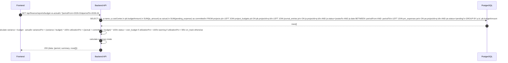
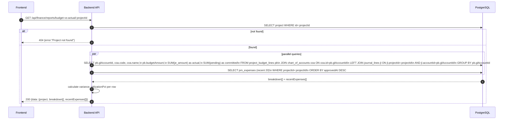
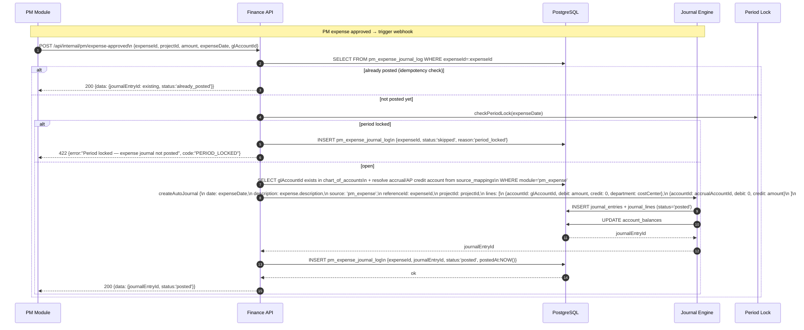

# Finance Module - Budget vs Actual (Finance-PM Integration)

อ้างอิง: `Documents/Requirements/Release_3_Finance_Gaps.md` — Feature R3-07

## API Inventory
- `GET /api/finance/reports/budget-vs-actual`
- `GET /api/finance/reports/budget-vs-actual/:projectId`
- `POST /api/internal/pm/expense-approved` ← webhook จาก PM module

### Integration Hooks
- `POST /api/pm/expenses/:id/approve` (PM module) → fires webhook → `POST /api/internal/pm/expense-approved`

---

## Endpoint Details

### API: `GET /api/finance/reports/budget-vs-actual`

**Purpose**
- รายงาน Budget vs Actual สรุประดับ organization: เปรียบ project budgets กับ actual GL expenses ต่อ period
- แสดง committed cost (pending expenses) แยกต่างหากจาก actual

**FE Screen**
- `/finance/reports/budget-vs-actual`

**Params**
- Query Params: `periodFrom` (YYYY-MM), `periodTo` (YYYY-MM), `projectId` (optional filter), `costCenterId` (optional), `page`, `limit`

**Response Body (200)**
```json
{
  "data": {
    "period": "2026-01 to 2026-04",
    "summary": {
      "totalBudget": 2500000,
      "totalActual": 1875000,
      "totalCommitted": 125000,
      "totalVariance": 500000,
      "variancePct": 20.0,
      "utilizationPct": 75.0
    },
    "rows": [
      {
        "projectId": "proj_001",
        "projectName": "ERP Implementation",
        "costCenter": "IT",
        "budget": 1200000,
        "actual": 950000,
        "committed": 75000,
        "variance": 175000,
        "variancePct": 14.6,
        "utilizationPct": 79.2,
        "status": "on_track"
      },
      {
        "projectId": "proj_002",
        "projectName": "Office Renovation",
        "costCenter": "Admin",
        "budget": 500000,
        "actual": 475000,
        "committed": 50000,
        "variance": -25000,
        "variancePct": -5.0,
        "utilizationPct": 105.0,
        "status": "over_budget"
      }
    ]
  },
  "pagination": { "page": 1, "limit": 20, "total": 5 }
}
```

**Sequence Diagram**


---

### API: `GET /api/finance/reports/budget-vs-actual/:projectId`

**Purpose**
- Drill-down รายงาน Budget vs Actual ระดับ project: breakdown ต่อ cost category / GL account + expense timeline

**FE Screen**
- `/finance/reports/budget-vs-actual/:projectId`

**Response Body (200)**
```json
{
  "data": {
    "project": {
      "id": "proj_001",
      "name": "ERP Implementation",
      "costCenter": "IT",
      "totalBudget": 1200000,
      "totalActual": 950000,
      "totalCommitted": 75000,
      "variance": 175000,
      "utilizationPct": 85.4,
      "status": "on_track"
    },
    "breakdown": [
      {
        "glAccountId": "acc_5500",
        "glAccountCode": "5500",
        "glAccountName": "IT Consulting Expense",
        "budget": 600000,
        "actual": 480000,
        "committed": 50000,
        "variance": 70000,
        "variancePct": 11.7
      },
      {
        "glAccountId": "acc_5600",
        "glAccountCode": "5600",
        "glAccountName": "Software License",
        "budget": 300000,
        "actual": 300000,
        "committed": 0,
        "variance": 0,
        "variancePct": 0.0
      }
    ],
    "recentExpenses": [
      {
        "expenseId": "exp_015",
        "description": "AWS ค่าบริการ เม.ย. 2026",
        "amount": 45000,
        "glAccountCode": "5600",
        "status": "posted",
        "approvedAt": "2026-04-20T10:00:00Z",
        "journalEntryId": "je_045"
      }
    ]
  }
}
```

**Sequence Diagram**


---

### Webhook: `POST /api/internal/pm/expense-approved`

**Purpose**
- รับ webhook จาก PM module เมื่อ expense ถูก approve → auto-post journal entry เข้า Finance GL
- ทำให้ actual expense ใน Finance รับรู้ทันทีเมื่อ PM approve

**Auth**
- Internal service key เท่านั้น (ไม่ใช่ Bearer token ของ user)

**Request Body**
```json
{
  "expenseId": "exp_015",
  "projectId": "proj_001",
  "description": "AWS ค่าบริการ เม.ย. 2026",
  "amount": 45000,
  "expenseDate": "2026-04-20",
  "approvedBy": "usr_002",
  "glAccountId": "acc_5600",
  "costCenter": "IT"
}
```

**Response Body (200)**
```json
{
  "data": {
    "journalEntryId": "je_045",
    "status": "posted",
    "debitAccount": "acc_5600",
    "creditAccount": "acc_2100",
    "amount": 45000
  },
  "message": "Expense journal posted"
}
```

**Sequence Diagram**


---

## Coverage Lock Notes

### Budget vs Actual Status Thresholds
| utilizationPct | Status | FE Color |
|---|---|---|
| < 90% | `on_track` | 🟢 green |
| 90–100% | `warning` | 🟡 yellow |
| > 100% | `over_budget` | 🔴 red |

- Warning เมื่อ utilization > 90% → แสดง badge + in-app notification ให้ `pm_manager` และ `accounting_manager`

### Committed Cost
- `committed` = SUM ของ PM expenses ที่ `status = 'pending'` (ยังไม่ approved)
- ใช้เป็น "forecast" เพื่อเตือนก่อนที่จะ over budget จริง
- ไม่ถือเป็น actual จนกว่า PM จะ approve → journal posted

### GL Account Mapping สำหรับ PM Expenses
- mapping ตาม `finance_config.source_mappings` table:
  - `module = 'pm_expense'`
  - `debitAccountId` → ดึงจาก expense request (per category)
  - `creditAccountId` → accrual payable account (global config หรือ per project)
- ถ้าไม่มี mapping → webhook return 422 `GL_MAPPING_NOT_FOUND`

### Idempotency
- ตรวจสอบ `pm_expense_journal_log` ก่อน post ทุกครั้ง
- ถ้า expenseId มีแล้ว → return existing journalEntryId (ไม่ duplicate post)

### Budget Line Structure
- `project_budget_lines` (per GL account per project) เชื่อมกับ `project_budgets` (total per project)
- Budget drill-down ใช้ `project_budget_lines` เปรียบกับ `journal_lines.projectId`

### Drill-down Report Performance
- ควร index: `journal_lines(projectId, accountId)`, `pm_expenses(projectId, status)`
