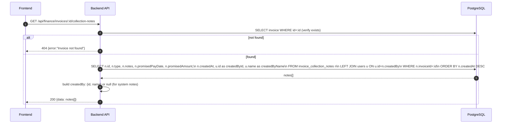
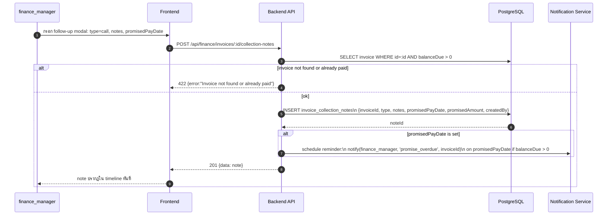
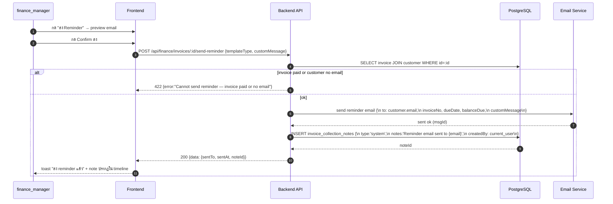
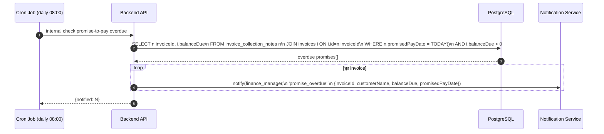

```mermaid
sequenceDiagram
    autonumber
    participant FE as Frontend
    participant BE as Backend API
    participant DB as PostgreSQL

    FE->>BE: GET /api/finance/customers/:id/ar-summary
    BE->>DB: SELECT customer WHERE id=:id
    alt not found
        BE-->>FE: 404
    else found
        par parallel queries
            BE->>DB: SELECT i.id, i.invoiceNo, i.issueDate, i.dueDate,\n  i.totalAmount, i.balanceDue, i.status,\n  (TODAY() - i.dueDate) as daysPastDue,\n  MAX(n.createdAt) as lastFollowUp,\n  (SELECT type FROM invoice_collection_notes\n    WHERE invoiceId=i.id ORDER BY createdAt DESC LIMIT 1) as lastFollowUpType\n  FROM invoices i\n  LEFT JOIN invoice_collection_notes n ON n.invoiceId=i.id\n  WHERE i.customerId=:id AND i.balanceDue > 0\n  GROUP BY i.id\n  ORDER BY i.dueDate ASC
            BE->>DB: SELECT\n  SUM(CASE WHEN (TODAY()-dueDate) <= 0 THEN balanceDue ELSE 0 END) as current,\n  SUM(CASE WHEN (TODAY()-dueDate) BETWEEN 1 AND 30 THEN balanceDue ELSE 0 END) as days1_30,\n  SUM(CASE WHEN (TODAY()-dueDate) BETWEEN 31 AND 60 THEN balanceDue ELSE 0 END) as days31_60,\n  SUM(CASE WHEN (TODAY()-dueDate) BETWEEN 61 AND 90 THEN balanceDue ELSE 0 END) as days61_90,\n  SUM(CASE WHEN (TODAY()-dueDate) > 90 THEN balanceDue ELSE 0 END) as days90plus,\n  SUM(balanceDue) as total\n  FROM invoices WHERE customerId=:id AND balanceDue > 0
            BE->>DB: SELECT n.invoiceId, i.invoiceNo, n.type, n.notes,\n  n.promisedPayDate, n.createdAt\n  FROM invoice_collection_notes n\n  JOIN invoices i ON i.id=n.invoiceId\n  WHERE i.customerId=:id\n  ORDER BY n.createdAt DESC LIMIT 20
        end
        DB-->>BE: openInvoices[] + agingBuckets + recentNotes[]
        BE->>BE: creditUsed = agingBuckets.total\n  creditAvailable = creditLimit - creditUsed\n  isOverCreditLimit = (creditUsed > creditLimit)
        BE-->>FE: 200 {data: {customer, agingSummary, openInvoices, recentNotes}}
    end
```

```mermaid
sequenceDiagram
    autonumber
    participant FE as Frontend
    participant BE as Backend API
    participant DB as PostgreSQL

    FE->>BE: GET /api/finance/reports/collection-gap\n  ?minDaysOverdue=1&maxDaysSilent=7&page=1
    par parallel queries
        BE->>DB: SELECT i.id as invoiceId, i.invoiceNo, i.customerId,\n  c.name as customerName, i.balanceDue,\n  (TODAY() - i.dueDate) as daysPastDue,\n  MAX(n.createdAt) as lastFollowUpAt,\n  (TODAY() - MAX(n.createdAt)::date) as daysSinceLastFollowUp\n  FROM invoices i\n  JOIN customers c ON c.id=i.customerId\n  LEFT JOIN invoice_collection_notes n ON n.invoiceId=i.id\n  WHERE i.balanceDue > 0\n    AND (TODAY() - i.dueDate) >= :minDaysOverdue\n  GROUP BY i.id, c.name\n  HAVING MAX(n.createdAt) < (NOW() - (:maxDaysSilent || ' days')::interval)\n    OR MAX(n.createdAt) IS NULL\n  ORDER BY daysPastDue DESC\n  LIMIT :limit OFFSET :offset
        BE->>DB: SELECT COUNT(*) as totalInvoices, SUM(i.balanceDue) as totalAmount\n  FROM invoices i\n  LEFT JOIN invoice_collection_notes n ON n.invoiceId=i.id\n  WHERE i.balanceDue > 0\n    AND (TODAY() - i.dueDate) >= :minDaysOverdue\n  GROUP BY i.id\n  HAVING MAX(n.createdAt) < (NOW() - (:maxDaysSilent || ' days')::interval)\n    OR MAX(n.createdAt) IS NULL
    end
    DB-->>BE: rows[] + summary
    BE-->>FE: 200 {data: {summary, rows[]}, pagination}
```

# Finance Module - Collection Workflow (AR Follow-up)

อ้างอิง: `Documents/Requirements/Release_3_Finance_Gaps.md` — Feature R3-03

## API Inventory
- `GET /api/finance/invoices/:id/collection-notes`
- `POST /api/finance/invoices/:id/collection-notes`
- `GET /api/finance/customers/:id/ar-summary`
- `POST /api/finance/invoices/:id/send-reminder`
- `GET /api/finance/reports/collection-gap`

---

## Endpoint Details

### API: `GET /api/finance/invoices/:id/collection-notes`

**Purpose**
- ดึง collection notes ทั้งหมดของ invoice (chronological timeline)

**FE Screen**
- Invoice detail → Collection Timeline sidebar/tab

**Params**
- Path Params: `id` (invoiceId)
- Query Params: ไม่มี

**Request Headers**
```json
{ "Authorization": "Bearer <access_token>" }
```

**Request Body**
```json
{}
```

**Response Body (200)**
```json
{
  "data": [
    {
      "id": "note_001",
      "type": "call",
      "notes": "โทรหาลูกค้า แจ้งจะโอนภายใน 7 วัน",
      "promisedPayDate": "2026-04-27",
      "promisedAmount": 125000,
      "createdBy": { "id": "usr_001", "name": "นาย ก" },
      "createdAt": "2026-04-20T10:30:00Z"
    },
    {
      "id": "note_002",
      "type": "system",
      "notes": "Reminder email sent to customer@abc.com",
      "promisedPayDate": null,
      "promisedAmount": null,
      "createdBy": null,
      "createdAt": "2026-04-15T09:00:00Z"
    }
  ]
}
```

**Sequence Diagram**


---

### API: `POST /api/finance/invoices/:id/collection-notes`

**Purpose**
- บันทึก follow-up note พร้อม optional promise-to-pay

**FE Screen**
- Invoice detail → "บันทึก Follow-up" modal

**Params**
- Path Params: `id` (invoiceId)
- Query Params: ไม่มี

**Request Headers**
```json
{ "Authorization": "Bearer <access_token>" }
```

**Request Body**
```json
{
  "type": "call",
  "notes": "โทรหาลูกค้า แจ้งว่าจะโอนภายใน 7 วัน",
  "promisedPayDate": "2026-04-27",
  "promisedAmount": 125000
}
```

**Response Body (201)**
```json
{
  "data": {
    "id": "note_003",
    "type": "call",
    "notes": "โทรหาลูกค้า แจ้งว่าจะโอนภายใน 7 วัน",
    "promisedPayDate": "2026-04-27",
    "promisedAmount": 125000,
    "createdAt": "2026-04-20T10:30:00Z"
  },
  "message": "Note saved"
}
```

**Sequence Diagram**


---

### API: `GET /api/finance/customers/:id/ar-summary`

**Purpose**
- ดู AR summary ของลูกค้าคนนั้น: credit info + open invoices + collection history รวมในหน้าเดียว

**FE Screen**
- `/finance/customers/:id/ar` — Customer AR Summary page

**Params**
- Path Params: `id` (customerId)
- Query Params: ไม่มี

**Request Headers**
```json
{ "Authorization": "Bearer <access_token>" }
```

**Request Body**
```json
{}
```

**Response Body (200)**
```json
{
  "data": {
    "customer": {
      "id": "cust_001",
      "name": "บริษัท ABC จำกัด",
      "creditLimit": 500000,
      "creditUsed": 125000,
      "creditAvailable": 375000,
      "isOverCreditLimit": false
    },
    "agingSummary": {
      "current": 0,
      "days1_30": 0,
      "days31_60": 125000,
      "days61_90": 0,
      "days90plus": 0,
      "total": 125000
    },
    "openInvoices": [
      {
        "id": "inv_001",
        "invoiceNo": "INV-2026-041",
        "issueDate": "2026-03-25",
        "dueDate": "2026-04-25",
        "totalAmount": 125000,
        "balanceDue": 125000,
        "status": "overdue",
        "daysPastDue": 3,
        "lastFollowUp": "2026-04-20T10:30:00Z",
        "lastFollowUpType": "call"
      }
    ],
    "recentNotes": [
      {
        "invoiceNo": "INV-2026-041",
        "type": "call",
        "notes": "โทรหาลูกค้า แจ้งจะโอนภายใน 7 วัน",
        "promisedPayDate": "2026-04-27",
        "createdAt": "2026-04-20T10:30:00Z"
      }
    ]
  }
}
```

**Sequence Diagram**


---

### API: `POST /api/finance/invoices/:id/send-reminder`

**Purpose**
- ส่ง payment reminder email ให้ลูกค้า และ auto-log เป็น collection note ประเภท `system`

**FE Screen**
- Invoice detail หรือ AR Aging → button "ส่ง Reminder"

**Params**
- Path Params: `id` (invoiceId)
- Query Params: ไม่มี

**Request Headers**
```json
{ "Authorization": "Bearer <access_token>" }
```

**Request Body**
```json
{
  "templateType": "overdue_reminder",
  "customMessage": "กรุณาชำระภายใน 3 วัน"
}
```

**Response Body (200)**
```json
{
  "data": {
    "sentTo": "finance@abc.com",
    "sentAt": "2026-04-28T09:00:00Z",
    "noteId": "note_004"
  },
  "message": "Reminder sent"
}
```

**Sequence Diagram**


---

### API: `GET /api/finance/reports/collection-gap`

**Purpose**
- Report: invoices ที่ overdue เกินกว่า `minDaysOverdue` โดยไม่มี follow-up ใน `maxDaysSilent` วันที่ผ่านมา
- ใช้ identify "forgotten invoices" ที่ต้องติดตาม

**FE Screen**
- `/finance/reports/collection-gap` หรือ tab ใน AR Aging report

**Params**
- Path Params: ไม่มี
- Query Params: `minDaysOverdue` (default 1), `maxDaysSilent` (default 7), `page`, `limit`

**Request Headers**
```json
{ "Authorization": "Bearer <access_token>" }
```

**Request Body**
```json
{}
```

**Response Body (200)**
```json
{
  "data": {
    "summary": {
      "totalInvoices": 3,
      "totalAmount": 335000
    },
    "rows": [
      {
        "invoiceId": "inv_001",
        "invoiceNo": "INV-2026-041",
        "customerId": "cust_001",
        "customerName": "บ.ABC จำกัด",
        "balanceDue": 125000,
        "daysPastDue": 3,
        "lastFollowUpAt": null,
        "daysSinceLastFollowUp": null
      }
    ]
  },
  "pagination": { "page": 1, "limit": 20, "total": 3 }
}
```

**Sequence Diagram**


---

## Promise-to-Pay Alert Flow (Background)



---

## Coverage Lock Notes

### Note Types
| Type | ใช้เมื่อ | Icon |
|---|---|---|
| `call` | โทรศัพท์ | 📞 |
| `email` | ส่ง email manual | 📧 |
| `meeting` | ประชุม/พบกัน | 🤝 |
| `system` | auto-log จาก send-reminder / system event | 🔵 |
| `other` | อื่นๆ | 📝 |

### Promise-to-Pay Behavior
- `promisedPayDate` optional — บันทึกได้เฉพาะ type `call`, `meeting`, `other`
- หากมี partial payment หลัง promise date → ระบบไม่ auto-clear promise; user ต้อง log note ใหม่
- หาก invoice ถูก fully paid → ไม่ trigger promise_overdue notification

### Collection Gap Query Performance
- ควร index: `invoices(dueDate, balanceDue)`, `collection_notes(invoiceId, createdAt)`
