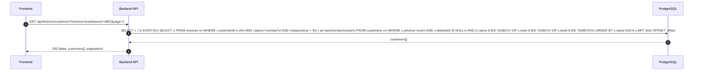
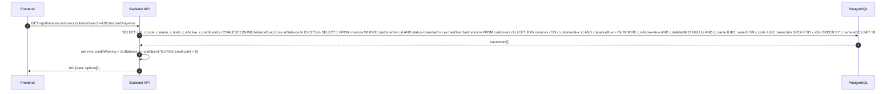
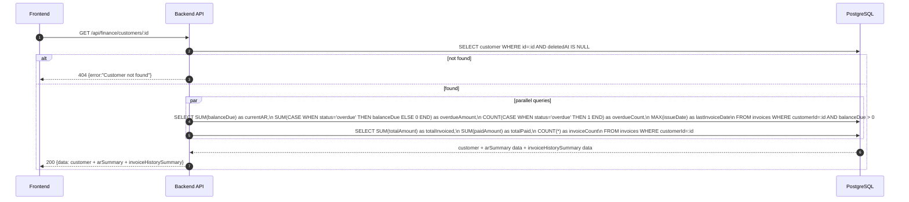
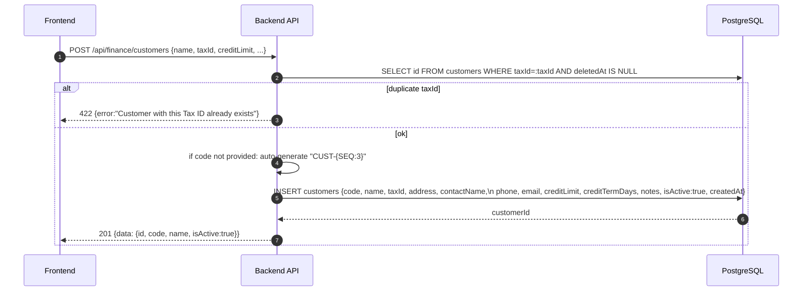
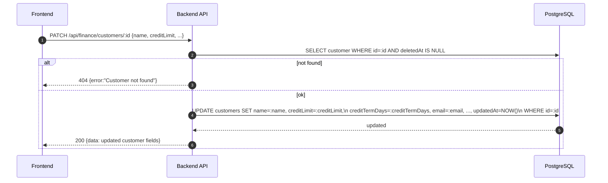
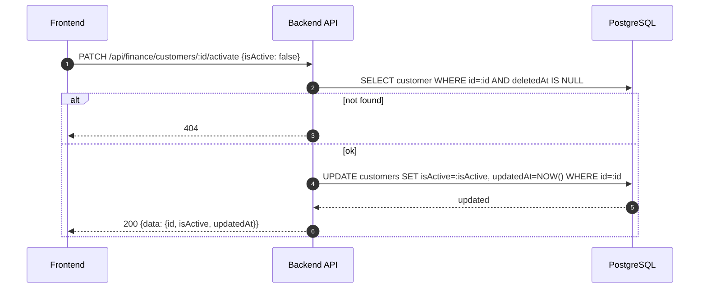
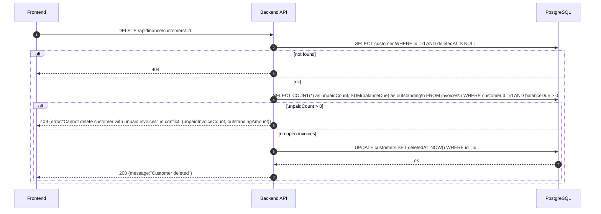

# Finance Module - Customers (Normalized)

อ้างอิง: `Documents/Requirements/Release_2.md` — Feature 3.1 Customer Management

## API Inventory
- `GET /api/finance/customers`
- `GET /api/finance/customers/options`
- `GET /api/finance/customers/:id`
- `POST /api/finance/customers`
- `PATCH /api/finance/customers/:id`
- `PATCH /api/finance/customers/:id/activate`
- `DELETE /api/finance/customers/:id`

---

## Endpoint Details

### API: `GET /api/finance/customers`

**Purpose**
- ดึงรายการลูกค้าทั้งหมด พร้อม filter isActive, search และ AR overdue indicator

**FE Screen**
- `/finance/customers`

**Params**
- Query Params: `search` (name/code/taxId), `isActive` (boolean), `page`, `limit`

**Response Body (200)**
```json
{
  "data": [
    {
      "id": "cust_001",
      "code": "CUST-001",
      "name": "บริษัท ABC จำกัด",
      "taxId": "0105561234567",
      "creditLimit": 500000,
      "creditTermDays": 30,
      "isActive": true,
      "hasOverdueInvoice": true,
      "deletedAt": null
    }
  ],
  "pagination": { "page": 1, "limit": 20, "total": 35 }
}
```

**Sequence Diagram**


---

### API: `GET /api/finance/customers/options`

**Purpose**
- Dropdown list สำหรับ invoice/quotation/SO form — active customers + credit warning flag

**FE Screen**
- Invoice / Quotation / SO create form → customer dropdown

**Params**
- Query Params: `search` (name/code), `activeOnly` (boolean, default true)

**Response Body (200)**
```json
{
  "data": [
    {
      "id": "cust_001",
      "code": "CUST-001",
      "name": "บริษัท ABC จำกัด",
      "taxId": "0105561234567",
      "isActive": true,
      "creditWarning": false,
      "hasOverdueInvoice": true
    }
  ]
}
```

**Sequence Diagram**


---

### API: `GET /api/finance/customers/:id`

**Purpose**
- ดู customer detail + arSummary + invoiceHistorySummary

**FE Screen**
- `/finance/customers/:id`

**Response Body (200)**
```json
{
  "data": {
    "id": "cust_001",
    "code": "CUST-001",
    "name": "บริษัท ABC จำกัด",
    "taxId": "0105561234567",
    "address": "123 ถ.สีลม กรุงเทพฯ 10500",
    "contactName": "คุณ ก",
    "phone": "02-123-4567",
    "email": "finance@abc.com",
    "creditLimit": 500000,
    "creditTermDays": 30,
    "notes": null,
    "isActive": true,
    "deletedAt": null,
    "arSummary": {
      "currentAR": 125000,
      "overdueAmount": 50000,
      "overdueInvoiceCount": 1,
      "lastInvoiceDate": "2026-04-10"
    },
    "invoiceHistorySummary": {
      "totalInvoiced": 850000,
      "totalPaid": 725000,
      "invoiceCount": 12
    }
  }
}
```

**Sequence Diagram**


---

### API: `POST /api/finance/customers`

**Purpose**
- สร้างลูกค้าใหม่ — auto-generate `code` ถ้าไม่ระบุ, ตรวจ duplicate taxId

**FE Screen**
- `/finance/customers/new`

**Request Body**
```json
{
  "code": "CUST-036",
  "name": "บริษัท XYZ จำกัด",
  "taxId": "0105570000001",
  "address": "456 ถ.สุขุมวิท กรุงเทพฯ",
  "contactName": "คุณ ข",
  "phone": "02-456-7890",
  "email": "info@xyz.com",
  "creditLimit": 300000,
  "creditTermDays": 30,
  "notes": null
}
```

**Response Body (201)**
```json
{
  "data": { "id": "cust_036", "code": "CUST-036", "name": "บริษัท XYZ จำกัด", "isActive": true },
  "message": "Customer created"
}
```

**Sequence Diagram**


---

### API: `PATCH /api/finance/customers/:id`

**Purpose**
- แก้ไขข้อมูลลูกค้า — code ไม่เปลี่ยน

**FE Screen**
- `/finance/customers/:id/edit`

**Request Body**
```json
{
  "name": "บริษัท XYZ (ประเทศไทย) จำกัด",
  "creditLimit": 500000,
  "creditTermDays": 45,
  "email": "finance@xyz.co.th"
}
```

**Response Body (200)**
```json
{
  "data": { "id": "cust_036", "name": "บริษัท XYZ (ประเทศไทย) จำกัด", "isActive": true },
  "message": "Customer updated"
}
```

**Sequence Diagram**


---

### API: `PATCH /api/finance/customers/:id/activate`

**Purpose**
- Toggle isActive: deactivate ซ่อนจาก dropdown แต่ยังดู history ได้

**Request Body**
```json
{ "isActive": false }
```

**Response Body (200)**
```json
{
  "data": { "id": "cust_036", "isActive": false, "updatedAt": "2026-04-27T10:00:00Z" },
  "message": "Customer deactivated"
}
```

**Sequence Diagram**


---

### API: `DELETE /api/finance/customers/:id`

**Purpose**
- Soft delete ลูกค้า — บล็อกถ้ามี unpaid invoices

**Response Body (200)**
```json
{ "message": "Customer deleted" }
```

**Sequence Diagram**


---

## Coverage Lock Notes

### code Auto-generation
- Format: `CUST-{3-digit seq}` เช่น `CUST-001`
- User ระบุ code เองได้ — ถ้าไม่ระบุระบบ auto-generate

### Duplicate taxId Guard
- taxId ต้อง unique ต่อ non-deleted customers → 422 ถ้าซ้ำ

### Soft Delete Guard
- ลบได้เฉพาะ customers ที่ไม่มี unpaid invoices
- 409 conflict response ต้องมี `unpaidInvoiceCount`, `outstandingAmount`

### creditWarning Flag
- `creditWarning = true` เมื่อ `arBalance >= creditLimit * 0.9 AND creditLimit > 0`
- FE แสดง badge "ใกล้เต็ม credit limit" ใน options dropdown

### isActive vs deletedAt
- `isActive = false` → ซ่อนจาก `options` endpoint แต่ยังดู detail/history ได้
- `deletedAt IS NOT NULL` → soft deleted, ไม่แสดงใน list หรือ options
