# Document Exports (Normalized)

อ้างอิง: `Documents/Requirements/Release_2.md`

## API Inventory
- `GET /api/finance/invoices/:id/pdf`
- `GET /api/finance/invoices/:id/preview`
- `GET /api/finance/ap/vendor-invoices/:id/pdf`
- `GET /api/finance/quotations/:id/pdf`
- `GET /api/finance/purchase-orders/:id/pdf`
- `GET /api/finance/tax/wht-certificates/:id/pdf`
- `GET /api/finance/reports/profit-loss/export`
- `GET /api/finance/reports/balance-sheet/export`
- `GET /api/finance/reports/cash-flow/export`
- `GET /api/finance/tax/vat-summary/export`
- `GET /api/finance/tax/pnd-report/export`
- `GET /api/hr/payroll/runs/:runId/payslips/:payslipId/pdf`
- `GET /api/hr/payroll/runs/:runId/payslips/export`

## Endpoint Details

### API: `GET /api/finance/invoices/:id/pdf`

**Purpose**
- Generate และ return PDF ของ Invoice สำหรับส่งให้ลูกค้า

**FE Screen**
- Invoice detail → ปุ่ม "ดาวน์โหลด PDF"

**Params**
- Path Params: `id` (invoice ID)
- Query Params: ไม่มี

**Request Headers**
```json
{
  "Authorization": "Bearer <access_token>"
}
```

**Request Body**
```json
// no request body
```

**Response Body (200)**
```
Content-Type: application/pdf
Content-Disposition: attachment; filename="invoice-{invoiceNo}.pdf"

<binary pdf stream>
```

**Sequence Diagram**
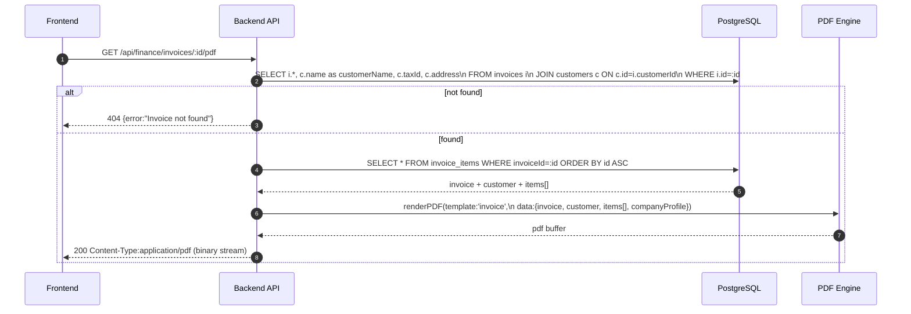

---

### API: `GET /api/finance/invoices/:id/preview`

**Purpose**
- Return HTML preview ของ Invoice — FE แสดง inline ใน modal ก่อน print/send

**FE Screen**
- Invoice detail → ปุ่ม "Preview" → modal

**Params**
- Path Params: `id` (invoice ID)
- Query Params: ไม่มี

**Request Headers**
```json
{
  "Authorization": "Bearer <access_token>"
}
```

**Request Body**
```json
// no request body
```

**Response Body (200)**
```json
{
  "data": {
    "html": "<html>...</html>",
    "documentNo": "INV-2026-0001"
  }
}
```

**Sequence Diagram**
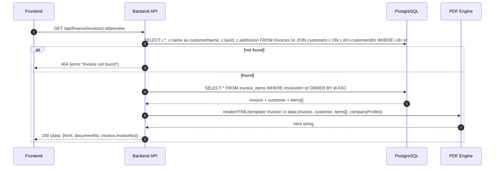

---

### API: `GET /api/finance/ap/vendor-invoices/:id/pdf`

**Purpose**
- Generate PDF ของ AP Bill / vendor invoice สำหรับ archive หรือ approval workflow

**FE Screen**
- AP Bill detail → ปุ่ม "ดาวน์โหลด PDF"

**Params**
- Path Params: `id` (AP bill ID)
- Query Params: ไม่มี

**Request Headers**
```json
{
  "Authorization": "Bearer <access_token>"
}
```

**Request Body**
```json
// no request body
```

**Response Body (200)**
```
Content-Type: application/pdf
Content-Disposition: attachment; filename="vendor-invoice-{documentNo}.pdf"

<binary pdf stream>
```

**Sequence Diagram**
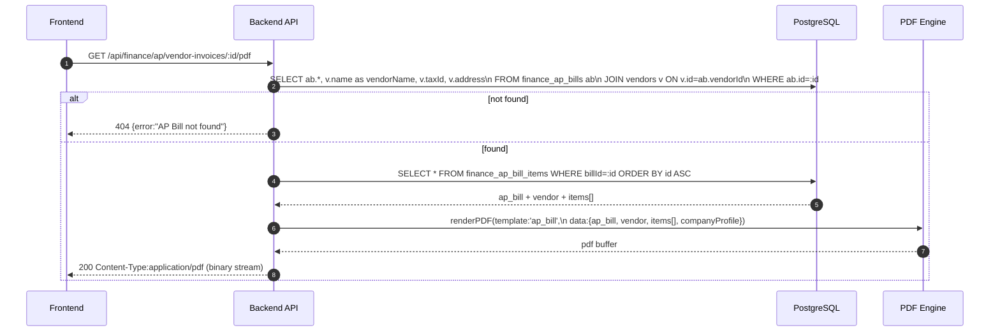

---

### API: `GET /api/finance/quotations/:id/pdf`

**Purpose**
- Generate PDF ของ Quotation สำหรับส่งให้ลูกค้า

**FE Screen**
- Quotation detail → ปุ่ม "ดาวน์โหลด PDF"

**Params**
- Path Params: `id` (quotation ID)
- Query Params: ไม่มี

**Request Headers**
```json
{
  "Authorization": "Bearer <access_token>"
}
```

**Request Body**
```json
// no request body
```

**Response Body (200)**
```
Content-Type: application/pdf
Content-Disposition: attachment; filename="quotation-{quotationNo}.pdf"

<binary pdf stream>
```

**Sequence Diagram**
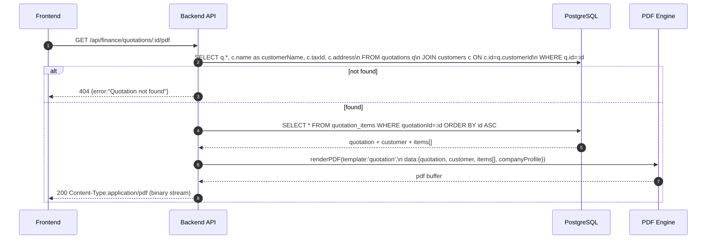

---

### API: `GET /api/finance/purchase-orders/:id/pdf`

**Purpose**
- Generate PDF ของ Purchase Order สำหรับส่งให้ vendor

**FE Screen**
- PO detail → ปุ่ม "ดาวน์โหลด PDF"

**Params**
- Path Params: `id` (PO ID)
- Query Params: ไม่มี

**Request Headers**
```json
{
  "Authorization": "Bearer <access_token>"
}
```

**Request Body**
```json
// no request body
```

**Response Body (200)**
```
Content-Type: application/pdf
Content-Disposition: attachment; filename="purchase-order-{poNo}.pdf"

<binary pdf stream>
```

**Sequence Diagram**
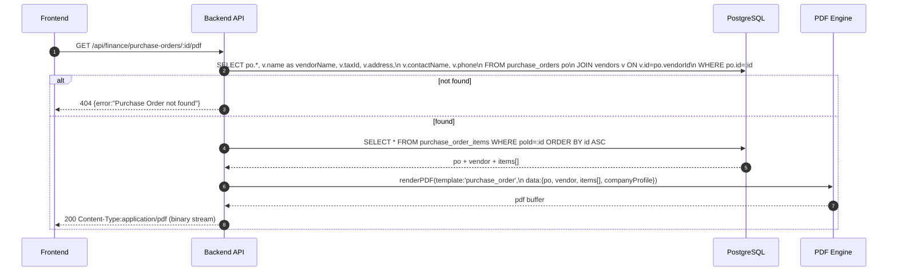

---

### API: `GET /api/finance/tax/wht-certificates/:id/pdf`

**Purpose**
- Generate PDF ใบรับรองการหักภาษี ณ ที่จ่าย (WHT Certificate) สำหรับ vendor/payee

**FE Screen**
- WHT Certificate detail → ปุ่ม "ดาวน์โหลด PDF"

**Params**
- Path Params: `id` (WHT certificate ID)
- Query Params: ไม่มี

**Request Headers**
```json
{
  "Authorization": "Bearer <access_token>"
}
```

**Request Body**
```json
// no request body
```

**Response Body (200)**
```
Content-Type: application/pdf
Content-Disposition: attachment; filename="wht-certificate-{certificateNo}.pdf"

<binary pdf stream>
```

**Sequence Diagram**
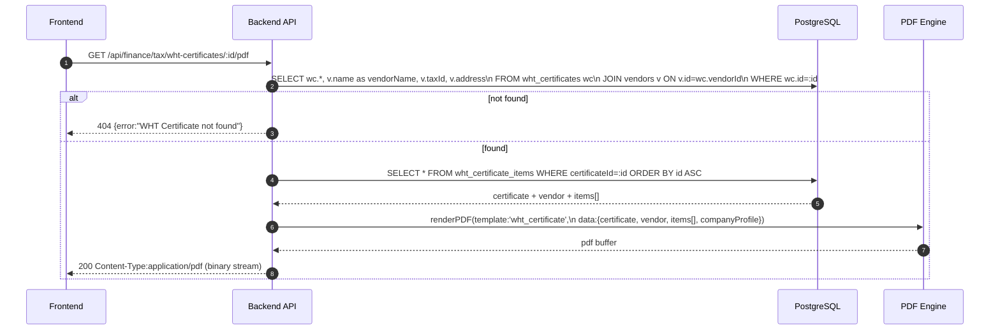

---

### API: `GET /api/finance/reports/profit-loss/export`

**Purpose**
- Export งบกำไรขาดทุน ตาม period และ format ที่เลือก (pdf/xlsx)

**FE Screen**
- `/finance/reports/profit-loss` → ปุ่ม "Export"

**Params**
- Path Params: ไม่มี
- Query Params: `periodFrom` *(required, YYYY-MM)*, `periodTo` *(required, YYYY-MM)*, `format` *(required: pdf | xlsx)*

**Request Headers**
```json
{
  "Authorization": "Bearer <access_token>"
}
```

**Request Body**
```json
// no request body
```

**Response Body (200) — format=pdf**
```
Content-Type: application/pdf
Content-Disposition: attachment; filename="profit-loss-{periodFrom}-{periodTo}.pdf"

<binary pdf stream>
```

**Response Body (200) — format=xlsx**
```
Content-Type: application/vnd.openxmlformats-officedocument.spreadsheetml.sheet
Content-Disposition: attachment; filename="profit-loss-{periodFrom}-{periodTo}.xlsx"

<binary xlsx stream>
```

**Sequence Diagram**
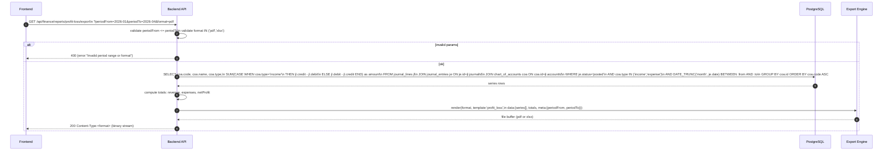

---

### API: `GET /api/finance/reports/balance-sheet/export`

**Purpose**
- Export งบดุล ณ วันที่ระบุ ตาม format ที่เลือก (pdf/xlsx)

**FE Screen**
- `/finance/reports/balance-sheet` → ปุ่ม "Export"

**Params**
- Path Params: ไม่มี
- Query Params: `asOfDate` *(required, YYYY-MM-DD)*, `format` *(required: pdf | xlsx)*

**Request Headers**
```json
{
  "Authorization": "Bearer <access_token>"
}
```

**Request Body**
```json
// no request body
```

**Response Body (200) — format=pdf**
```
Content-Type: application/pdf
Content-Disposition: attachment; filename="balance-sheet-{asOfDate}.pdf"

<binary pdf stream>
```

**Response Body (200) — format=xlsx**
```
Content-Type: application/vnd.openxmlformats-officedocument.spreadsheetml.sheet
Content-Disposition: attachment; filename="balance-sheet-{asOfDate}.xlsx"

<binary xlsx stream>
```

**Sequence Diagram**
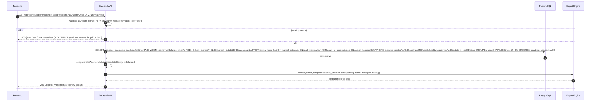

---

### API: `GET /api/finance/reports/cash-flow/export`

**Purpose**
- Export งบกระแสเงินสด ตาม period และ format ที่เลือก (pdf/xlsx)

**FE Screen**
- `/finance/reports/cash-flow` → ปุ่ม "Export"

**Params**
- Path Params: ไม่มี
- Query Params: `periodFrom` *(required, YYYY-MM)*, `periodTo` *(required, YYYY-MM)*, `format` *(required: pdf | xlsx)*

**Request Headers**
```json
{
  "Authorization": "Bearer <access_token>"
}
```

**Request Body**
```json
// no request body
```

**Response Body (200) — format=pdf**
```
Content-Type: application/pdf
Content-Disposition: attachment; filename="cash-flow-{periodFrom}-{periodTo}.pdf"

<binary pdf stream>
```

**Response Body (200) — format=xlsx**
```
Content-Type: application/vnd.openxmlformats-officedocument.spreadsheetml.sheet
Content-Disposition: attachment; filename="cash-flow-{periodFrom}-{periodTo}.xlsx"

<binary xlsx stream>
```

**Sequence Diagram**
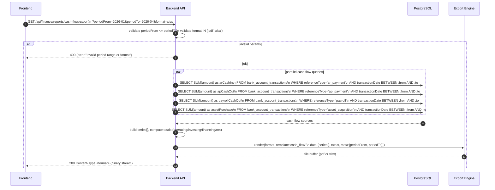

---

### API: `GET /api/finance/tax/vat-summary/export`

**Purpose**
- Export สรุป VAT รายเดือน (PP.30) ตาม month/year และ format ที่เลือก

**FE Screen**
- `/finance/tax/vat-summary` → ปุ่ม "Export"

**Params**
- Path Params: ไม่มี
- Query Params: `month` *(required, 1-12)*, `year` *(required, YYYY)*, `format` *(required: pdf | xlsx)*

**Request Headers**
```json
{
  "Authorization": "Bearer <access_token>"
}
```

**Request Body**
```json
// no request body
```

**Response Body (200) — format=pdf**
```
Content-Type: application/pdf
Content-Disposition: attachment; filename="vat-summary-{year}-{month}.pdf"

<binary pdf stream>
```

**Response Body (200) — format=xlsx**
```
Content-Type: application/vnd.openxmlformats-officedocument.spreadsheetml.sheet
Content-Disposition: attachment; filename="vat-summary-{year}-{month}.xlsx"

<binary xlsx stream>
```

**Sequence Diagram**
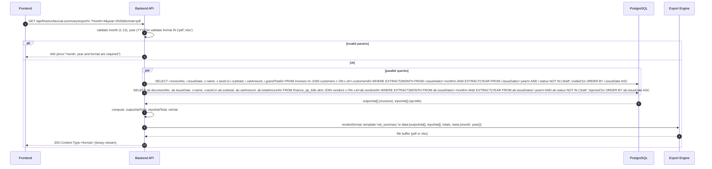

---

### API: `GET /api/finance/tax/pnd-report/export`

**Purpose**
- Export รายงาน PND ตามแบบฟอร์ม (PND1/3/53) month/year และ format ที่เลือก

**FE Screen**
- `/finance/tax/pnd-report` → ปุ่ม "Export"

**Params**
- Path Params: ไม่มี
- Query Params: `form` *(required: PND1 | PND3 | PND53)*, `month` *(required, 1-12)*, `year` *(required, YYYY)*, `format` *(required: pdf | xlsx)*

**Request Headers**
```json
{
  "Authorization": "Bearer <access_token>"
}
```

**Request Body**
```json
// no request body
```

**Response Body (200) — format=pdf**
```
Content-Type: application/pdf
Content-Disposition: attachment; filename="pnd-report-{form}-{year}-{month}.pdf"

<binary pdf stream>
```

**Response Body (200) — format=xlsx**
```
Content-Type: application/vnd.openxmlformats-officedocument.spreadsheetml.sheet
Content-Disposition: attachment; filename="pnd-report-{form}-{year}-{month}.xlsx"

<binary xlsx stream>
```

**Sequence Diagram**
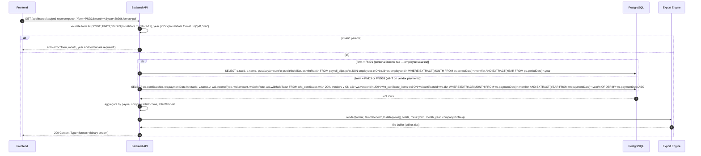

---

### API: `GET /api/hr/payroll/runs/:runId/payslips/:payslipId/pdf`

**Purpose**
- ดาวน์โหลด payslip PDF รายบุคคล — synchronous inline download

**FE Screen**
- Payroll run detail → payslip row → ปุ่ม "ดาวน์โหลด"

**Params**
- Path Params: `runId` *(required)*, `payslipId` *(required)*
- Query Params: ไม่มี

**Request Headers**
```json
{
  "Authorization": "Bearer <access_token>"
}
```

**Request Body**
```json
// no request body
```

**Response Body (200)**
```
Content-Type: application/pdf
Content-Disposition: attachment; filename="payslip-{employeeName}-{period}.pdf"

<binary pdf stream>
```

**Sequence Diagram**
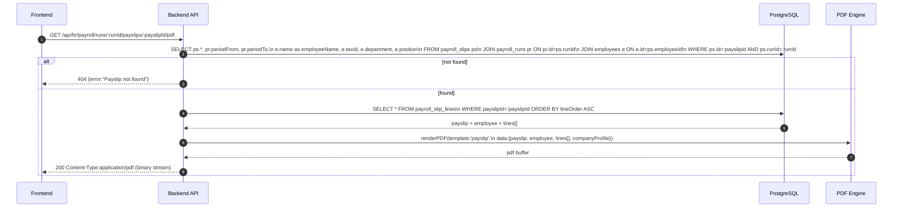

---

### API: `GET /api/hr/payroll/runs/:runId/payslips/export`

**Purpose**
- Export payslips ทั้ง run เป็น ZIP bundle — synchronous (small run) หรือ async (large run)

**FE Screen**
- Payroll run detail → ปุ่ม "Export ทั้งหมด"

**Params**
- Path Params: `runId` *(required)*
- Query Params: ไม่มี

**Request Headers**
```json
{
  "Authorization": "Bearer <access_token>"
}
```

**Request Body**
```json
// no request body
```

**Response Body (200) — synchronous (small run)**
```
Content-Type: application/zip
Content-Disposition: attachment; filename="payslips-run-{runId}.zip"

<binary zip stream>
```

**Response Body (202) — async (large run)**
```json
{
  "jobId": "job_abc123",
  "status": "processing",
  "estimatedReadyAt": "2026-04-19T10:05:00Z"
}
```

**Poll endpoint (async):** `GET /api/hr/payroll/runs/:runId/payslips/export/:jobId/status`
```json
{
  "jobId": "job_abc123",
  "status": "done",
  "downloadUrl": "https://...",
  "expiresAt": "2026-04-19T11:05:00Z"
}
```

**Sequence Diagram**
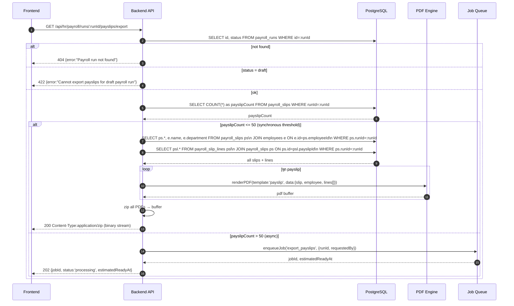

---

## Coverage Lock Addendum (2026-04-16)

### Response Type Rules
- inline download: `Content-Type` + `Content-Disposition` ต้องส่งชื่อไฟล์ชัดเจน
- async export: response ต้องคืน `{ jobId, status, estimatedReadyAt }`
- poll status endpoint ต้องคืน `downloadUrl` เมื่อเสร็จ และ `expiresAt` สำหรับลิงก์

### Format Matrix Lock
- invoice: `pdf`, `xlsx` (optional)
- payslip: `pdf`, `zip`
- reports: `pdf`, `xlsx`, `csv` (ตาม report type)

### Retention / Expiry
- export artifacts มี retention ตาม policy และต้องตอบ `410 Gone` เมื่อ link หมดอายุ
- ถ้า export endpoint เป็น synchronous inline download ต้องระบุชัดว่าไม่มี `jobId`
- ถ้า export endpoint เป็น asynchronous job ต้องระบุ polling/readback contract ให้ UX ใช้ต่อได้
