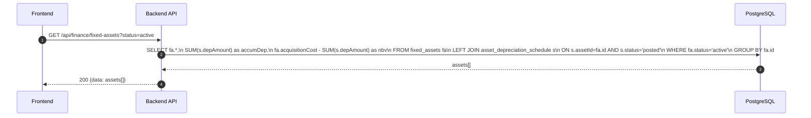
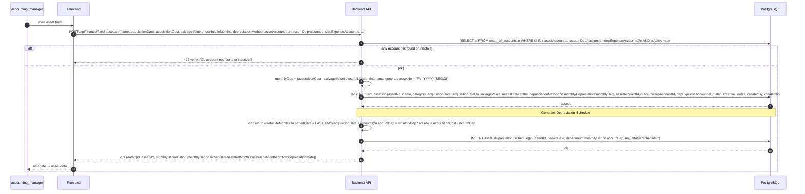
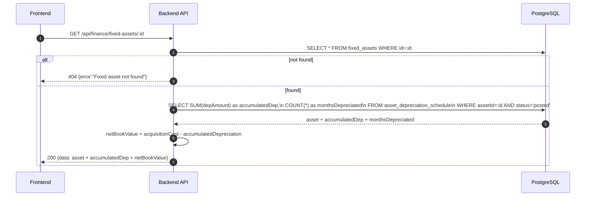
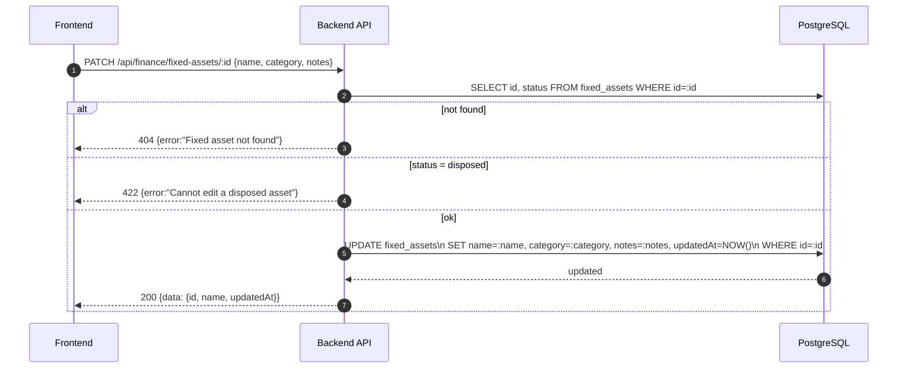
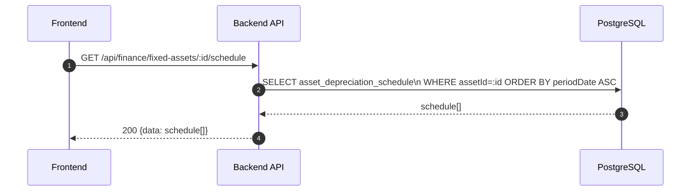
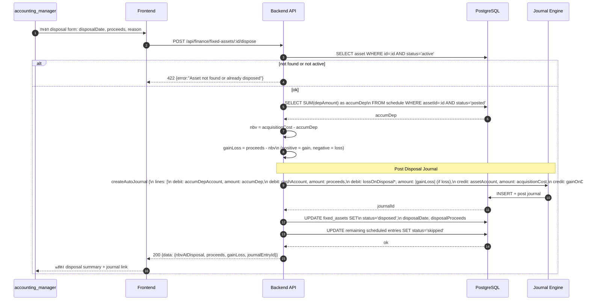
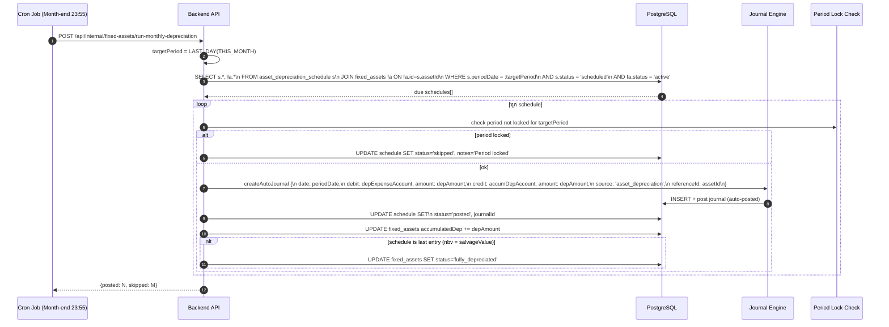
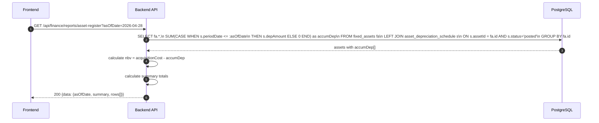

# Finance Module - Fixed Assets & Depreciation

อ้างอิง: `Documents/Requirements/Release_3_Finance_Gaps.md` — Feature R3-06

## API Inventory
- `GET /api/finance/fixed-assets`
- `POST /api/finance/fixed-assets`
- `GET /api/finance/fixed-assets/:id`
- `PATCH /api/finance/fixed-assets/:id`
- `GET /api/finance/fixed-assets/:id/schedule`
- `POST /api/finance/fixed-assets/:id/dispose`
- `GET /api/finance/reports/asset-register`
- `POST /api/internal/fixed-assets/run-monthly-depreciation` ← cron only

---

## Endpoint Details

### API: `GET /api/finance/fixed-assets`

**Purpose**
- ดูรายการสินทรัพย์ถาวรทั้งหมด

**FE Screen**
- `/finance/fixed-assets`

**Params**
- Query Params: `status` (active|disposed|fully_depreciated), `category`, `page`, `limit`

**Response Body (200)**
```json
{
  "data": [
    {
      "id": "fa_001",
      "assetNo": "FA-2026-001",
      "name": "MacBook Pro 16",
      "category": "computer_equipment",
      "acquisitionDate": "2026-01-15",
      "acquisitionCost": 85000,
      "accumulatedDepreciation": 7083,
      "netBookValue": 77917,
      "status": "active",
      "usefulLifeMonths": 60,
      "monthsDepreciated": 5
    }
  ]
}
```

**Sequence Diagram**


---

### API: `POST /api/finance/fixed-assets`

**Purpose**
- บันทึกสินทรัพย์ใหม่ + auto-generate depreciation schedule

**FE Screen**
- `/finance/fixed-assets/new`

**Request Body**
```json
{
  "name": "MacBook Pro 16",
  "category": "computer_equipment",
  "acquisitionDate": "2026-01-15",
  "acquisitionCost": 85000,
  "salvageValue": 5000,
  "usefulLifeMonths": 60,
  "depreciationMethod": "straight_line",
  "assetAccountId": "acc_1700",
  "accumDepAccountId": "acc_1701",
  "depExpenseAccountId": "acc_5600",
  "notes": "สำหรับทีม Dev"
}
```

**Response Body (201)**
```json
{
  "data": {
    "id": "fa_001",
    "assetNo": "FA-2026-001",
    "monthlyDepreciation": 1333.33,
    "scheduleGeneratedMonths": 60,
    "firstDepreciationDate": "2026-01-31"
  },
  "message": "Asset created and depreciation schedule generated"
}
```

**Sequence Diagram**


---

### API: `GET /api/finance/fixed-assets/:id`

**Purpose**
- ดู asset detail ครบ + depreciation to-date

**FE Screen**
- `/finance/fixed-assets/:id`

**Params**
- Path Params: `id` (asset ID)
- Query Params: ไม่มี

**Response Body (200)**
```json
{
  "data": {
    "id": "fa_001",
    "assetNo": "FA-2026-001",
    "name": "MacBook Pro 16",
    "category": "computer_equipment",
    "acquisitionDate": "2026-01-15",
    "acquisitionCost": 85000,
    "salvageValue": 5000,
    "usefulLifeMonths": 60,
    "depreciationMethod": "straight_line",
    "monthlyDepreciation": 1333.33,
    "accumulatedDepreciation": 6666.65,
    "netBookValue": 78333.35,
    "status": "active",
    "assetAccountId": "acc_1700",
    "accumDepAccountId": "acc_1701",
    "depExpenseAccountId": "acc_5600",
    "notes": "สำหรับทีม Dev",
    "monthsDepreciated": 5
  }
}
```

**Sequence Diagram**


---

### API: `PATCH /api/finance/fixed-assets/:id`

**Purpose**
- แก้ไข asset metadata (name, notes, category) — ไม่เปลี่ยน financial fields หลังบันทึก

**FE Screen**
- Asset detail → edit mode

**Params**
- Path Params: `id` (asset ID)
- Query Params: ไม่มี

**Request Body**
```json
{
  "name": "MacBook Pro 16 (IT-001)",
  "category": "computer_equipment",
  "notes": "อัปเกรด RAM 64GB"
}
```

**Response Body (200)**
```json
{
  "data": { "id": "fa_001", "name": "MacBook Pro 16 (IT-001)", "updatedAt": "2026-04-27T10:00:00Z" },
  "message": "Asset updated"
}
```

**Sequence Diagram**


---

### API: `GET /api/finance/fixed-assets/:id/schedule`

**Purpose**
- ดู depreciation schedule ทั้งหมดของสินทรัพย์นั้น (past + future)

**FE Screen**
- Asset detail → Depreciation Schedule tab

**Response Body (200)**
```json
{
  "data": [
    {
      "id": "sch_001",
      "periodDate": "2026-01-31",
      "depAmount": 1333.33,
      "accumDep": 1333.33,
      "nbv": 83666.67,
      "status": "posted",
      "journalId": "je_dep_001"
    },
    {
      "id": "sch_002",
      "periodDate": "2026-02-28",
      "depAmount": 1333.33,
      "accumDep": 2666.67,
      "nbv": 82333.33,
      "status": "posted",
      "journalId": "je_dep_002"
    },
    {
      "id": "sch_060",
      "periodDate": "2031-01-31",
      "depAmount": 1333.37,
      "accumDep": 80000,
      "nbv": 5000,
      "status": "scheduled",
      "journalId": null
    }
  ]
}
```

**Sequence Diagram**


---

### API: `POST /api/finance/fixed-assets/:id/dispose`

**Purpose**
- บันทึกการขาย/ทิ้งสินทรัพย์ + คำนวณ gain/loss + post disposal journal

**FE Screen**
- Asset detail → "บันทึก Disposal" button

**Request Body**
```json
{
  "disposalDate": "2026-04-28",
  "disposalProceeds": 50000,
  "reason": "ขายให้พนักงาน"
}
```

**Response Body (200)**
```json
{
  "data": {
    "assetId": "fa_001",
    "status": "disposed",
    "nbvAtDisposal": 77917,
    "proceeds": 50000,
    "gainLoss": -27917,
    "gainLossType": "loss",
    "journalEntryId": "je_disp_001"
  },
  "message": "Asset disposed"
}
```

**Sequence Diagram**


---

### API: `POST /api/internal/fixed-assets/run-monthly-depreciation` ← Cron Only

**Purpose**
- Cron job รันสิ้นเดือนเพื่อ post depreciation journal entries สำหรับ scheduled entries ที่ครบกำหนด

**Sequence Diagram**


---

### API: `GET /api/finance/reports/asset-register`

**Purpose**
- รายงาน Asset Register: list สินทรัพย์ทั้งหมดพร้อม NBV และ depreciation to-date

**Params**
- Query Params: `asOfDate` (default today), `status`, `category`

**Response Body (200)**
```json
{
  "data": {
    "asOfDate": "2026-04-28",
    "summary": {
      "totalAssets": 12,
      "totalCost": 1250000,
      "totalAccumDep": 185000,
      "totalNBV": 1065000
    },
    "rows": [
      {
        "assetNo": "FA-2026-001",
        "name": "MacBook Pro 16",
        "category": "computer_equipment",
        "acquisitionDate": "2026-01-15",
        "acquisitionCost": 85000,
        "usefulLifeMonths": 60,
        "monthsDepreciated": 5,
        "monthlyDep": 1333.33,
        "accumDep": 6666.65,
        "nbv": 78333.35,
        "status": "active"
      }
    ]
  }
}
```

**Sequence Diagram**


---

## Coverage Lock Notes

### Depreciation Methods Supported
| Method | Formula |
|---|---|
| Straight-line | `(cost - salvageValue) / usefulLifeMonths` |
| Declining Balance | `nbv * rate / 12` (rate = 2/usefulLifeYears for 200DB) |

### Journal Accounts Required (per asset)
- `assetAccountId` — ต้นทุนสินทรัพย์ (type: asset)
- `accumDepAccountId` — ค่าเสื่อมราคาสะสม (type: asset, contra)
- `depExpenseAccountId` — ค่าเสื่อมราคา (type: expense)
- `gainOnDisposalAccountId` — กำไรจากการขายสินทรัพย์ (type: income) — global config
- `lossOnDisposalAccountId` — ขาดทุนจากการขายสินทรัพย์ (type: expense) — global config

### AssetNo Auto-generation
- Format: `FA-{YYYY}-{3-digit seq}` เช่น `FA-2026-001`
- Sequence reset ทุกปี
