# Finance Module - Inventory / Stock Management

อ้างอิง: `Documents/Requirements/Release_3_Finance_Gaps.md` — Feature R3-05

## API Inventory
- `GET /api/inventory/products`
- `POST /api/inventory/products`
- `GET /api/inventory/products/:id`
- `PATCH /api/inventory/products/:id`
- `PATCH /api/inventory/products/:id/activate`
- `GET /api/inventory/products/:id/stock`
- `POST /api/inventory/products/:id/adjust`
- `GET /api/inventory/reports/on-hand`
- `GET /api/inventory/reports/movement`
- `GET /api/inventory/alerts/low-stock`

### Hooks เข้า Existing Endpoints (ไม่ใช่ endpoint ใหม่)
- `POST /api/finance/invoices` + `PATCH /api/finance/invoices/:id/status` → trigger stock OUT + COGS journal
- `POST /api/finance/purchase-orders/:id/goods-receipts` → trigger stock IN

---

## Endpoint Details

### API: `GET /api/inventory/products`

**Purpose**
- ดึงรายการสินค้า/บริการทั้งหมด

**FE Screen**
- `/inventory/products`

**Params**
- Query Params: `isActive`, `search`, `lowStockOnly`, `page`, `limit`

**Response Body (200)**
```json
{
  "data": [
    {
      "id": "prod_001",
      "sku": "MA-SERVICE-001",
      "name": "ค่า MA รายเดือน",
      "unit": "เดือน",
      "costPrice": 8000,
      "sellingPrice": 15000,
      "onHand": 0,
      "reorderPoint": 0,
      "isLowStock": false,
      "isActive": true
    }
  ]
}
```

**Sequence Diagram**
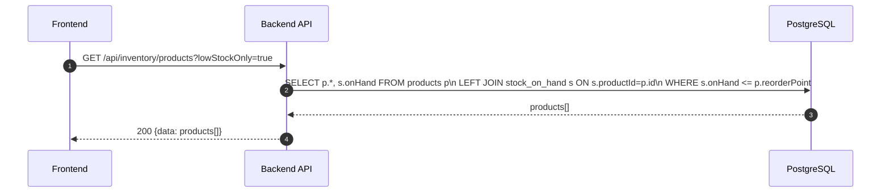

---

### API: `POST /api/inventory/products`

**Purpose**
- สร้างสินค้าใหม่พร้อม account mapping สำหรับ COGS auto-post

**FE Screen**
- `/inventory/products/new`

**Request Body**
```json
{
  "sku": "EQUIP-001",
  "name": "อุปกรณ์สำนักงาน",
  "unit": "ชิ้น",
  "costPrice": 2500,
  "sellingPrice": 3500,
  "reorderPoint": 10,
  "cogsAccountId": "acc_5300",
  "inventoryAccountId": "acc_1400",
  "revenueAccountId": "acc_4100"
}
```

**Response Body (201)**
```json
{
  "data": { "id": "prod_002", "sku": "EQUIP-001", "onHand": 0 },
  "message": "Product created"
}
```

**Sequence Diagram**
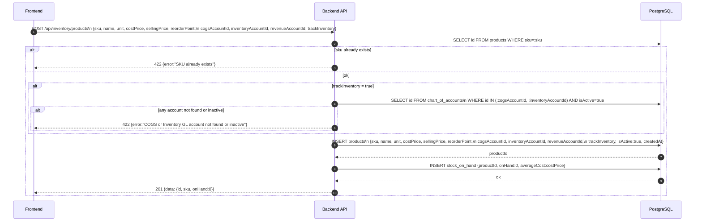

---

### API: `GET /api/inventory/products/:id`

**Purpose**
- ดู product detail ครบ + current stock summary

**FE Screen**
- `/inventory/products/:id`

**Response Body (200)**
```json
{
  "data": {
    "id": "prod_002",
    "sku": "EQUIP-001",
    "name": "อุปกรณ์สำนักงาน",
    "unit": "ชิ้น",
    "costPrice": 2500,
    "sellingPrice": 3500,
    "reorderPoint": 10,
    "onHand": 45,
    "averageCost": 2500,
    "totalValue": 112500,
    "isLowStock": false,
    "cogsAccountId": "acc_5300",
    "inventoryAccountId": "acc_1400",
    "revenueAccountId": "acc_4100",
    "trackInventory": true,
    "isActive": true
  }
}
```

**Sequence Diagram**
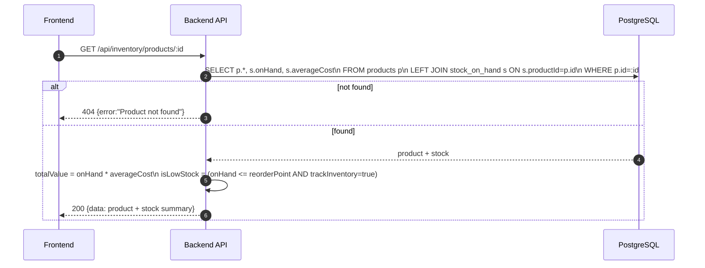

---

### API: `PATCH /api/inventory/products/:id`

**Purpose**
- แก้ไขข้อมูลสินค้า — sku ไม่เปลี่ยน

**FE Screen**
- `/inventory/products/:id` → edit mode

**Request Body**
```json
{
  "name": "อุปกรณ์สำนักงาน (อัปเดต)",
  "sellingPrice": 3800,
  "reorderPoint": 15
}
```

**Response Body (200)**
```json
{
  "data": { "id": "prod_002", "name": "อุปกรณ์สำนักงาน (อัปเดต)", "updatedAt": "2026-04-27T10:00:00Z" },
  "message": "Product updated"
}
```

**Sequence Diagram**
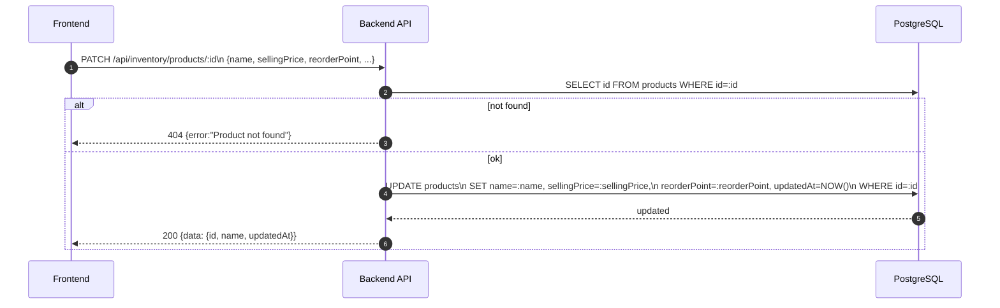

---

### API: `PATCH /api/inventory/products/:id/activate`

**Purpose**
- เปิด/ปิดใช้งานสินค้า — inactive ซ่อนจาก invoice/PO pickers

**Request Body**
```json
{ "isActive": false }
```

**Response Body (200)**
```json
{
  "data": { "id": "prod_002", "isActive": false, "updatedAt": "2026-04-27T10:00:00Z" },
  "message": "Product deactivated"
}
```

**Sequence Diagram**
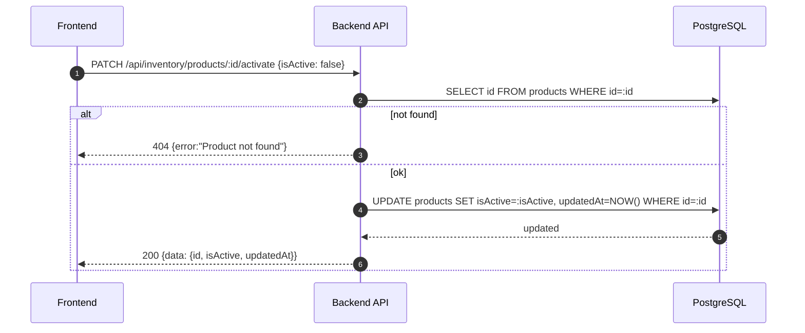

---

### API: `GET /api/inventory/products/:id/stock`

**Purpose**
- ดู on-hand quantity + movement history ของสินค้า

**FE Screen**
- Product detail → Stock tab

**Response Body (200)**
```json
{
  "data": {
    "product": { "id": "prod_002", "sku": "EQUIP-001", "name": "อุปกรณ์สำนักงาน" },
    "onHand": 45,
    "totalValue": 112500,
    "averageCost": 2500,
    "movements": [
      {
        "id": "mov_001",
        "movementType": "IN",
        "quantity": 50,
        "unitCost": 2500,
        "totalCost": 125000,
        "referenceType": "goods_receipt",
        "referenceId": "gr_001",
        "createdAt": "2026-04-10T09:00:00Z"
      },
      {
        "id": "mov_002",
        "movementType": "OUT",
        "quantity": 5,
        "unitCost": 2500,
        "totalCost": 12500,
        "referenceType": "invoice",
        "referenceId": "inv_001",
        "createdAt": "2026-04-15T14:00:00Z"
      }
    ]
  }
}
```

**Sequence Diagram**
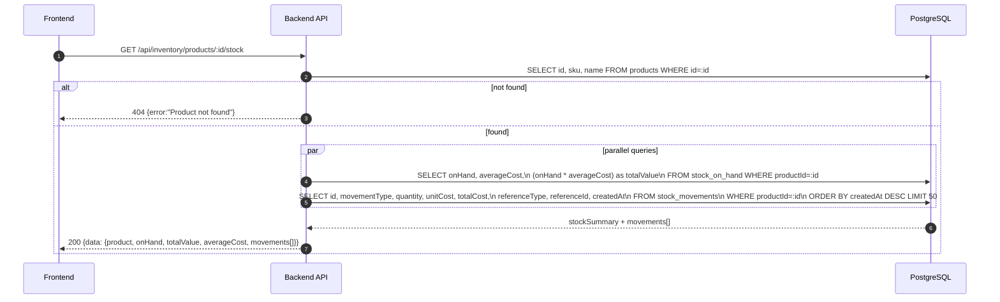

---

### API: `POST /api/inventory/products/:id/adjust`

**Purpose**
- ปรับสต็อก manual พร้อม reason (physical count, damage, theft, donation)

**FE Screen**
- Product detail → "ปรับสต็อก" button

**Request Body**
```json
{
  "adjustmentType": "count_adjustment",
  "quantity": 3,
  "direction": "in",
  "notes": "นับสต็อกจริงพบว่าเกิน 3 ชิ้น"
}
```

**Response Body (201)**
```json
{
  "data": {
    "movementId": "mov_003",
    "newOnHand": 48,
    "journalEntryId": "je_adj_001"
  },
  "message": "Stock adjusted"
}
```

**Sequence Diagram**
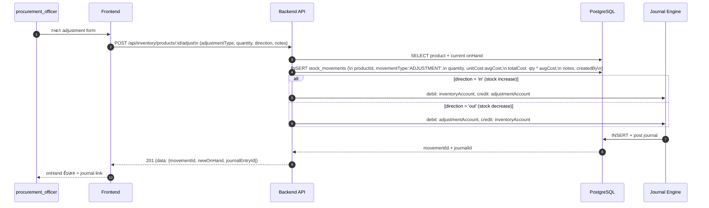

---

### API: `GET /api/inventory/reports/on-hand`

**Purpose**
- รายงาน on-hand inventory ณ ปัจจุบัน พร้อม total value จัดกลุ่มตามสินค้า

**FE Screen**
- `/inventory/reports/on-hand`

**Params**
- Query Params: `search`, `isActive`, `lowStockOnly`, `page`, `limit`

**Response Body (200)**
```json
{
  "data": [
    {
      "productId": "prod_002",
      "sku": "EQUIP-001",
      "name": "อุปกรณ์สำนักงาน",
      "unit": "ชิ้น",
      "onHand": 45,
      "averageCost": 2500,
      "totalValue": 112500,
      "reorderPoint": 10,
      "isLowStock": false
    }
  ],
  "summary": {
    "totalProducts": 12,
    "totalInventoryValue": 540000,
    "lowStockCount": 2
  },
  "pagination": { "page": 1, "limit": 20, "total": 12 }
}
```

**Sequence Diagram**
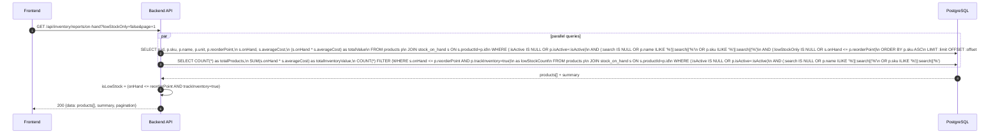

---

### API: `GET /api/inventory/reports/movement`

**Purpose**
- รายงาน stock movement ในช่วงวันที่กำหนด — แสดง IN/OUT/ADJUSTMENT พร้อม reference

**FE Screen**
- `/inventory/reports/movement`

**Params**
- Query Params: `productId`, `movementType` (IN|OUT|ADJUSTMENT), `dateFrom`, `dateTo`, `page`, `limit`

**Response Body (200)**
```json
{
  "data": [
    {
      "id": "mov_001",
      "productId": "prod_002",
      "sku": "EQUIP-001",
      "productName": "อุปกรณ์สำนักงาน",
      "movementType": "IN",
      "quantity": 50,
      "unitCost": 2500,
      "totalCost": 125000,
      "referenceType": "goods_receipt",
      "referenceId": "gr_001",
      "referenceNo": "GR-2026-0001",
      "createdAt": "2026-04-10T09:00:00Z"
    }
  ],
  "summary": {
    "totalIn": 50,
    "totalOut": 5,
    "totalAdjustment": 3,
    "netMovement": 48
  },
  "pagination": { "page": 1, "limit": 20, "total": 3 }
}
```

**Sequence Diagram**
```mermaid
sequenceDiagram
    autonumber
    participant FE as Frontend
    participant BE as Backend API
    participant DB as PostgreSQL

    FE->>BE: GET /api/inventory/reports/movement\n  ?dateFrom=2026-04-01&dateTo=2026-04-30&productId=prod_002
    BE->>BE: validate dateFrom <= dateTo
    alt invalid date range
        BE-->>FE: 422 {error:"dateFrom must be before or equal to dateTo"}
    else ok
        par parallel queries
            BE->>DB: SELECT sm.id, sm.movementType, sm.quantity, sm.unitCost,\n  sm.totalCost, sm.referenceType, sm.referenceId, sm.createdAt,\n  p.sku, p.name as productName,\n  COALESCE(gr.grNo, inv.invoiceNo) as referenceNo\n  FROM stock_movements sm\n  JOIN products p ON p.id=sm.productId\n  LEFT JOIN goods_receipts gr ON gr.id=sm.referenceId AND sm.referenceType='goods_receipt'\n  LEFT JOIN invoices inv ON inv.id=sm.referenceId AND sm.referenceType='invoice'\n  WHERE (:productId IS NULL OR sm.productId=:productId)\n    AND (:movementType IS NULL OR sm.movementType=:movementType)\n    AND sm.createdAt >= :dateFrom AND sm.createdAt <= :dateTo\n  ORDER BY sm.createdAt DESC\n  LIMIT :limit OFFSET :offset
            BE->>DB: SELECT\n  SUM(CASE WHEN movementType='IN' THEN quantity ELSE 0 END) as totalIn,\n  SUM(CASE WHEN movementType='OUT' THEN quantity ELSE 0 END) as totalOut,\n  SUM(CASE WHEN movementType='ADJUSTMENT' THEN quantity ELSE 0 END) as totalAdjustment\n  FROM stock_movements\n  WHERE (:productId IS NULL OR productId=:productId)\n    AND (:movementType IS NULL OR movementType=:movementType)\n    AND createdAt >= :dateFrom AND createdAt <= :dateTo
        end
        DB-->>BE: movements[] + summary counts
        BE->>BE: netMovement = totalIn - totalOut + totalAdjustment
        BE-->>FE: 200 {data: movements[], summary, pagination}
    end
```

---

### Hook: Invoice → Stock OUT + COGS Auto-post

**Trigger**: `PATCH /api/finance/invoices/:id/status` เมื่อ status = `sent`

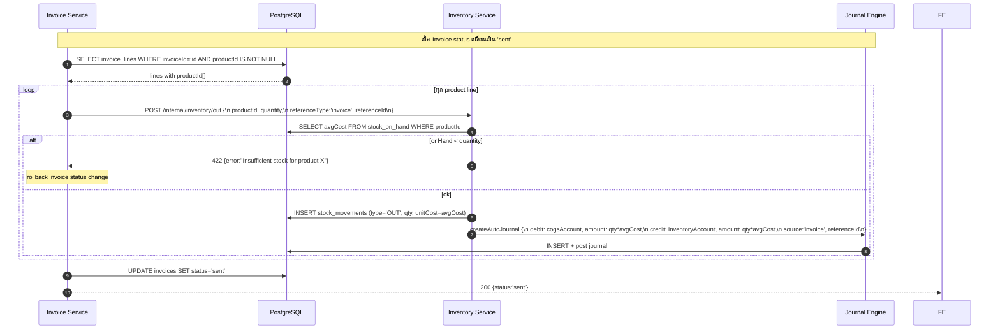

---

### Hook: Goods Receipt → Stock IN

**Trigger**: `POST /api/finance/purchase-orders/:id/goods-receipts`

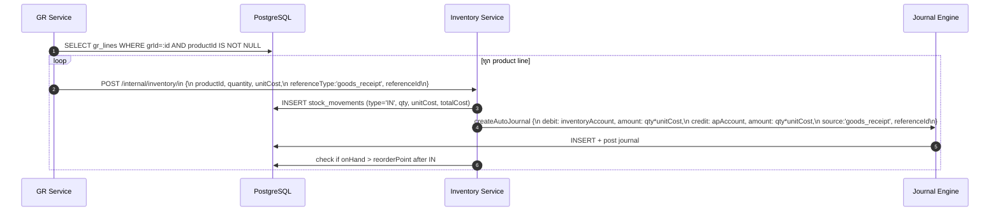

---

### API: `GET /api/inventory/alerts/low-stock`

**Purpose**
- ดึง products ที่ onHand <= reorderPoint

**Response Body (200)**
```json
{
  "data": [
    {
      "productId": "prod_002",
      "sku": "EQUIP-001",
      "name": "อุปกรณ์สำนักงาน",
      "onHand": 3,
      "reorderPoint": 10,
      "shortfall": 7
    }
  ]
}
```

**Sequence Diagram**
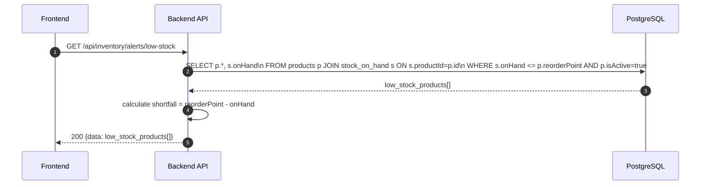

---

## Coverage Lock Notes

### WAC Recalculation
- Weighted Average Cost อัปเดตทุกครั้งที่มี stock IN
- `newAvgCost = (currentValue + newCost) / (currentOnHand + newQty)`
- stock OUT ใช้ avgCost ณ เวลาที่ OUT

### Service Products
- สินค้าประเภท service (ไม่ต้องติดตาม stock) → `trackInventory: false`
- เมื่อ `trackInventory=false` → skip stock movement และ COGS auto-post

### Negative Stock
- ระบบ default: ไม่อนุญาต stock ติดลบ (422 error)
- config override: `allowNegativeStock=true` สำหรับ business ที่ต้องการ
