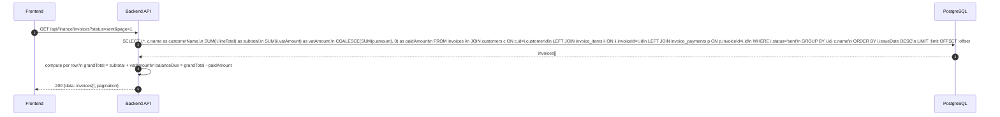
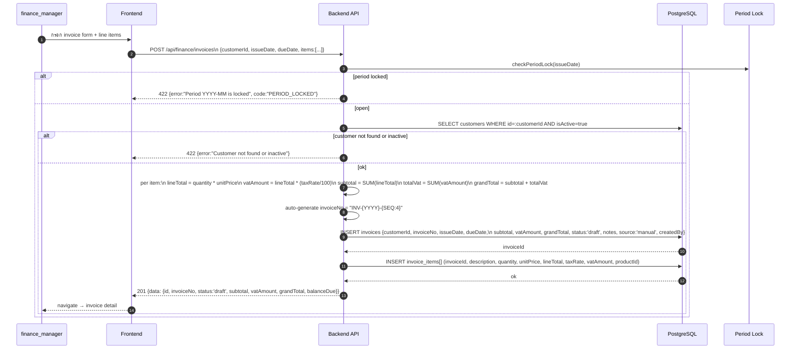
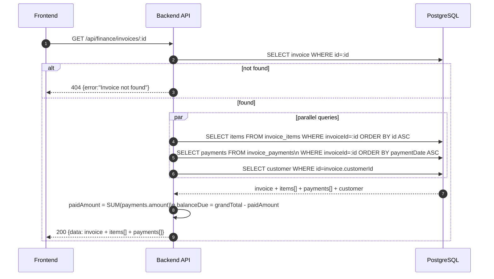
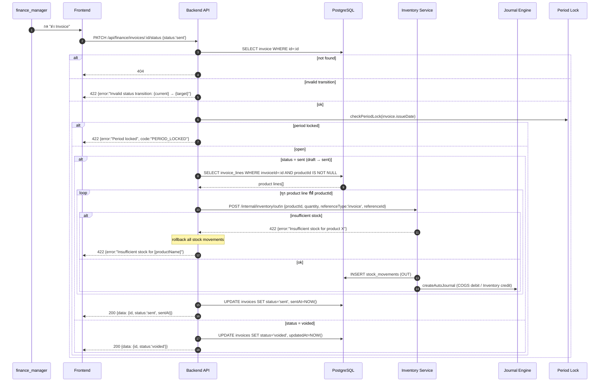
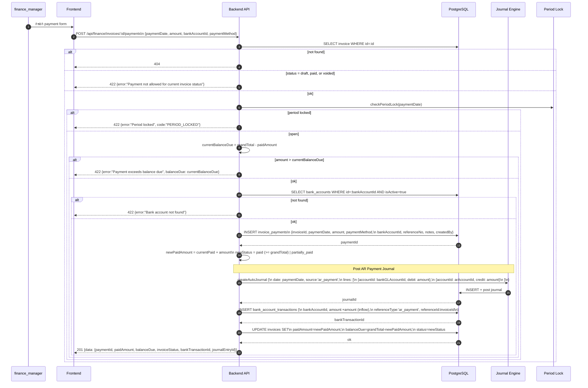
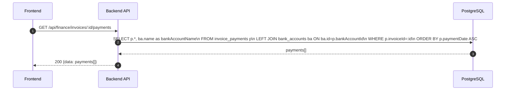

# Finance Module - Invoices / AR (Normalized)

อ้างอิง: `Documents/Requirements/Release_1.md` — Feature 1.6, `Documents/Requirements/Release_2.md`

## API Inventory
- `GET /api/finance/invoices`
- `POST /api/finance/invoices`
- `GET /api/finance/invoices/:id`
- `PATCH /api/finance/invoices/:id/status`
- `POST /api/finance/invoices/:id/payments`
- `GET /api/finance/invoices/:id/payments`

---

## Endpoint Details

### API: `GET /api/finance/invoices`

**Purpose**
- ดึงรายการ invoices ทั้งหมด พร้อม filter และ pagination พร้อม read model ครบ

**FE Screen**
- `/finance/invoices`

**Params**
- Query Params: `status` (draft|sent|partially_paid|paid|overdue|voided), `customerId`, `issueDateFrom` (YYYY-MM-DD), `issueDateTo` (YYYY-MM-DD), `search` (invoiceNo/customerName), `source` (manual|recurring), `page`, `limit`

**Response Body (200)**
```json
{
  "data": [
    {
      "id": "inv_001",
      "invoiceNo": "INV-2026-0001",
      "customerId": "cust_001",
      "customerName": "บริษัท ABC จำกัด",
      "issueDate": "2026-04-10",
      "dueDate": "2026-04-25",
      "subtotal": 15000,
      "vatAmount": 1050,
      "grandTotal": 16050,
      "paidAmount": 0,
      "balanceDue": 16050,
      "status": "sent",
      "source": "manual",
      "sentAt": "2026-04-10T10:00:00Z"
    }
  ],
  "pagination": { "page": 1, "limit": 20, "total": 42 }
}
```

**Sequence Diagram**


---

### API: `POST /api/finance/invoices`

**Purpose**
- สร้าง invoice ใหม่ (draft) พร้อม line items — auto-compute VAT, auto-gen invoiceNo

**FE Screen**
- `/finance/invoices/new`

**Request Body**
```json
{
  "customerId": "cust_001",
  "issueDate": "2026-04-10",
  "dueDate": "2026-04-25",
  "notes": "April IT service fee",
  "items": [
    {
      "description": "Monthly IT Service",
      "quantity": 1,
      "unitPrice": 15000,
      "taxRate": 7,
      "productId": null
    }
  ]
}
```

**Response Body (201)**
```json
{
  "data": {
    "id": "inv_001",
    "invoiceNo": "INV-2026-0001",
    "status": "draft",
    "subtotal": 15000,
    "vatAmount": 1050,
    "grandTotal": 16050,
    "balanceDue": 16050
  },
  "message": "Invoice created"
}
```

**Sequence Diagram**


---

### API: `GET /api/finance/invoices/:id`

**Purpose**
- ดู invoice detail ครบ: header, line items, ประวัติการชำระ, และ linked source (SO/recurring)

**FE Screen**
- `/finance/invoices/:id`

**Response Body (200)**
```json
{
  "data": {
    "id": "inv_001",
    "invoiceNo": "INV-2026-0001",
    "customerId": "cust_001",
    "customerName": "บริษัท ABC จำกัด",
    "customerTaxId": "0105561234567",
    "issueDate": "2026-04-10",
    "dueDate": "2026-04-25",
    "status": "partially_paid",
    "source": "manual",
    "recurringTemplateId": null,
    "soId": null,
    "notes": "April IT service fee",
    "subtotal": 15000,
    "vatAmount": 1050,
    "grandTotal": 16050,
    "paidAmount": 6050,
    "balanceDue": 10000,
    "sentAt": "2026-04-10T10:00:00Z",
    "items": [
      {
        "id": "ii_001",
        "description": "Monthly IT Service",
        "quantity": 1,
        "unitPrice": 15000,
        "taxRate": 7,
        "lineTotal": 15000,
        "vatAmount": 1050,
        "productId": null
      }
    ],
    "payments": [
      {
        "id": "pay_001",
        "paymentDate": "2026-04-20",
        "amount": 6050,
        "paymentMethod": "bank_transfer",
        "referenceNo": "TRF-20260420-001",
        "bankAccountId": "bk_001"
      }
    ],
    "createdBy": { "id": "usr_001", "name": "นาย ก" }
  }
}
```

**Sequence Diagram**


---

### API: `PATCH /api/finance/invoices/:id/status`

**Purpose**
- เปลี่ยน status ตาม workflow: `draft → sent`, `sent → voided`
- เมื่อ status = `sent` → trigger inventory stock OUT + COGS journal สำหรับ product lines

**FE Screen**
- Invoice detail → ปุ่ม "ส่ง Invoice" หรือ "Void"

**Request Body**
```json
{ "status": "sent" }
```

**Response Body (200)**
```json
{
  "data": { "id": "inv_001", "status": "sent", "sentAt": "2026-04-10T10:00:00Z" },
  "message": "Invoice sent"
}
```

**Sequence Diagram**


---

### API: `POST /api/finance/invoices/:id/payments`

**Purpose**
- บันทึก AR payment (full หรือ partial) พร้อม bank ledger posting และ journal entry

**FE Screen**
- Invoice detail → ปุ่ม "บันทึกการรับชำระ"

**Request Body**
```json
{
  "paymentDate": "2026-04-20",
  "amount": 6050,
  "paymentMethod": "bank_transfer",
  "bankAccountId": "bk_001",
  "referenceNo": "TRF-20260420-001",
  "notes": "Full payment received"
}
```

**Response Body (201)**
```json
{
  "data": {
    "paymentId": "pay_001",
    "invoiceId": "inv_001",
    "paidAmount": 6050,
    "balanceDue": 10000,
    "invoiceStatus": "partially_paid",
    "bankTransactionId": "txn_001",
    "journalEntryId": "je_ar_001"
  },
  "message": "Payment recorded"
}
```

**Sequence Diagram**


---

### API: `GET /api/finance/invoices/:id/payments`

**Purpose**
- ดูรายการ payments ทั้งหมดของ invoice พร้อม bank reference

**FE Screen**
- Invoice detail → Payment History section

**Response Body (200)**
```json
{
  "data": [
    {
      "id": "pay_001",
      "paymentDate": "2026-04-20",
      "amount": 6050,
      "paymentMethod": "bank_transfer",
      "referenceNo": "TRF-20260420-001",
      "bankAccountId": "bk_001",
      "bankAccountName": "กสิกรไทย xxx-1234",
      "bankTransactionId": "txn_001",
      "createdBy": { "id": "usr_001", "name": "นาย ก" },
      "createdAt": "2026-04-20T14:30:00Z"
    }
  ]
}
```

**Sequence Diagram**


---

## Coverage Lock Notes

### Status Workflow
```
draft → sent → partially_paid → paid
             ↘ voided
overdue (cron daily: set when dueDate < today AND status = sent)
```

### invoiceNo Auto-generation
- Format: `INV-{YYYY}-{4-digit seq}` เช่น `INV-2026-0001`
- Sequence reset ทุกปี

### Read Model Fields (mandatory)
- `subtotal`, `vatAmount`, `grandTotal`, `paidAmount`, `balanceDue` ต้องอยู่ใน response ทุก list/detail call

### Inventory Hook
- เมื่อ status → `sent`: trigger stock OUT + COGS journal ต่อทุก product line (productId != null)
- Service items (productId = null หรือ trackInventory=false) → skip
- Insufficient stock → rollback status change → 422

### Bank Ledger Side Effect
- `POST /id/payments` → INSERT `bank_account_transactions` (inflow) + GL journal
- คืน `bankTransactionId` + `journalEntryId` ใน response
