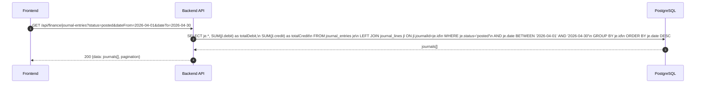
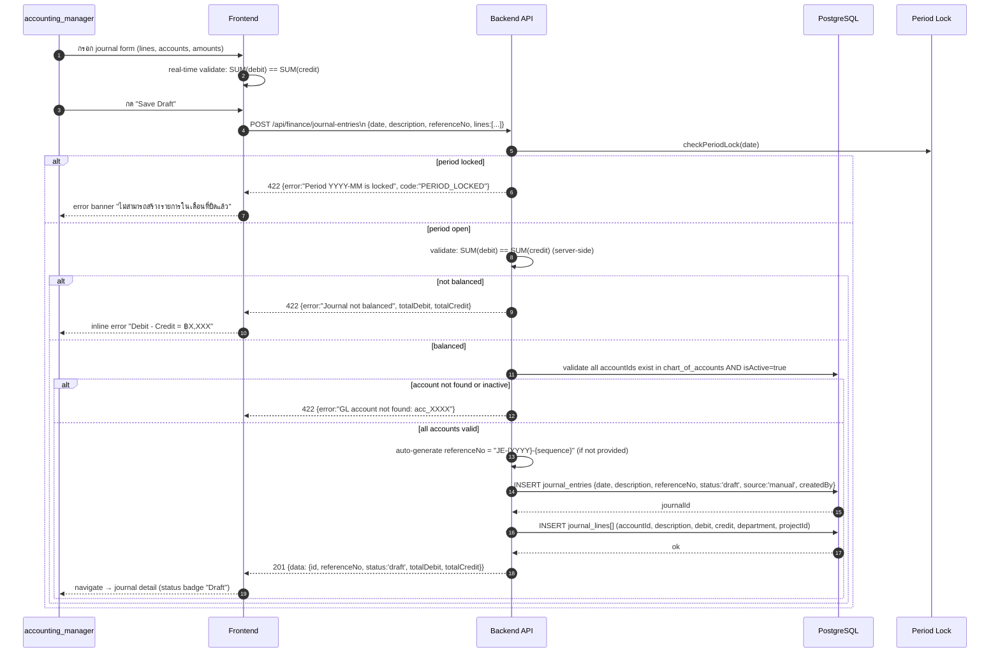
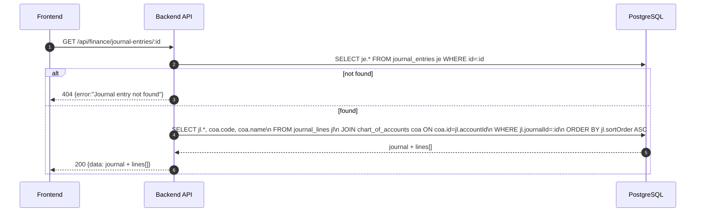
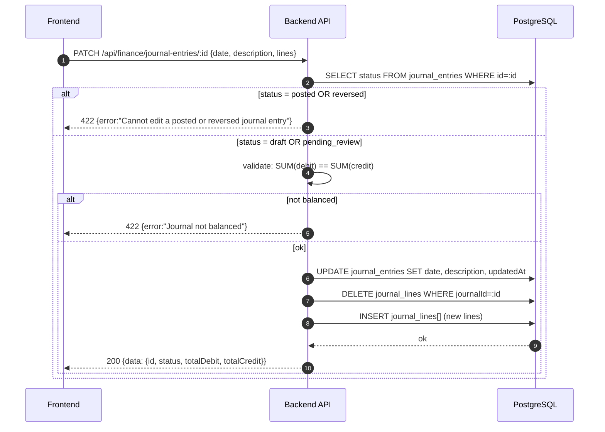
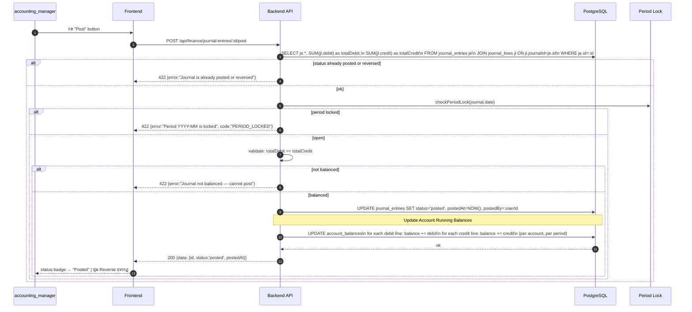
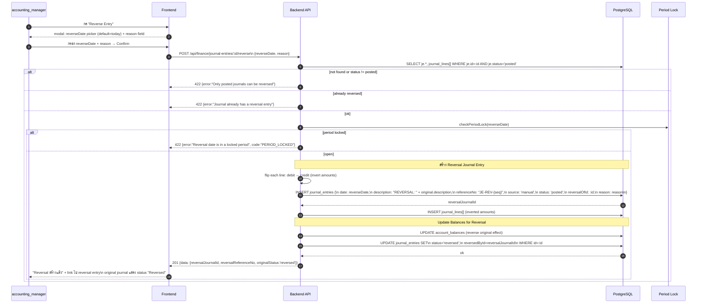

# Finance Module - Journal Entry UI (Create / Post / Reverse)

อ้างอิง: `Documents/Requirements/Release_3_Finance_Gaps.md` — Feature R3-01

## API Inventory
- `GET /api/finance/journal-entries`
- `POST /api/finance/journal-entries`
- `GET /api/finance/journal-entries/:id`
- `PATCH /api/finance/journal-entries/:id`
- `POST /api/finance/journal-entries/:id/post`
- `POST /api/finance/journal-entries/:id/reverse`

---

## Endpoint Details

### API: `GET /api/finance/journal-entries`

**Purpose**
- ดึงรายการ journal entries พร้อม filter หลายมิติ: วันที่, account, ประเภท (auto/manual), status

**FE Screen**
- `/finance/journal`

**Params**
- Query Params: `status` (draft|pending_review|posted|reversed), `source` (manual|invoice|ap|payroll|asset_depreciation), `dateFrom`, `dateTo`, `accountId`, `page`, `limit`

**Response Body (200)**
```json
{
  "data": [
    {
      "id": "je_001",
      "referenceNo": "JE-2026-001",
      "date": "2026-04-30",
      "description": "Month-end accrual — IT expenses",
      "source": "manual",
      "totalDebit": 50000,
      "totalCredit": 50000,
      "status": "posted",
      "postedAt": "2026-04-30T15:30:00Z",
      "createdBy": { "id": "usr_001", "name": "นาย ก" },
      "reversedById": null
    }
  ],
  "pagination": { "page": 1, "limit": 20, "total": 45 }
}
```

**Sequence Diagram**


---

### API: `POST /api/finance/journal-entries`

**Purpose**
- สร้าง manual journal entry แบบ multi-line debit/credit พร้อม validate balanced entry ก่อน save

**FE Screen**
- `/finance/journal/new`

**Request Body**
```json
{
  "date": "2026-04-30",
  "description": "Month-end accrual — IT expenses",
  "referenceNo": "JE-2026-001",
  "lines": [
    {
      "accountId": "acc_5500",
      "description": "IT Expense accrual",
      "debit": 50000,
      "credit": 0,
      "department": "IT",
      "projectId": null
    },
    {
      "accountId": "acc_2100",
      "description": "Accrued expenses payable",
      "debit": 0,
      "credit": 50000,
      "department": null,
      "projectId": null
    }
  ]
}
```

**Response Body (201)**
```json
{
  "data": {
    "id": "je_001",
    "referenceNo": "JE-2026-001",
    "status": "draft",
    "totalDebit": 50000,
    "totalCredit": 50000,
    "linesCount": 2
  },
  "message": "Journal entry created as draft"
}
```

**Sequence Diagram**


---

### API: `GET /api/finance/journal-entries/:id`

**Purpose**
- ดู journal entry detail พร้อม lines ทุก line, linked source document, และ reverse link (ถ้ามี)

**FE Screen**
- `/finance/journal/:id`

**Response Body (200)**
```json
{
  "data": {
    "id": "je_001",
    "referenceNo": "JE-2026-001",
    "date": "2026-04-30",
    "description": "Month-end accrual — IT expenses",
    "source": "manual",
    "status": "posted",
    "postedAt": "2026-04-30T15:30:00Z",
    "createdBy": { "id": "usr_001", "name": "นาย ก" },
    "reversedById": null,
    "reversalOfId": null,
    "lines": [
      {
        "id": "jl_001",
        "accountId": "acc_5500",
        "accountCode": "5500",
        "accountName": "IT Expense",
        "description": "IT Expense accrual",
        "debit": 50000,
        "credit": 0,
        "department": "IT",
        "projectId": null
      },
      {
        "id": "jl_002",
        "accountId": "acc_2100",
        "accountCode": "2100",
        "accountName": "Accrued Expenses Payable",
        "description": "Accrued expenses payable",
        "debit": 0,
        "credit": 50000,
        "department": null,
        "projectId": null
      }
    ],
    "totalDebit": 50000,
    "totalCredit": 50000
  }
}
```

**Sequence Diagram**


---

### API: `PATCH /api/finance/journal-entries/:id`

**Purpose**
- แก้ไข draft journal entry (lines, date, description) — ห้ามแก้ journal ที่ posted แล้ว

**FE Screen**
- `/finance/journal/:id/edit`

**Request Body**
```json
{
  "date": "2026-04-30",
  "description": "Month-end accrual — IT + HR expenses",
  "lines": [
    { "accountId": "acc_5500", "description": "IT Expense", "debit": 30000, "credit": 0 },
    { "accountId": "acc_5600", "description": "HR Expense", "debit": 20000, "credit": 0 },
    { "accountId": "acc_2100", "description": "Accrued expenses payable", "debit": 0, "credit": 50000 }
  ]
}
```

**Response Body (200)**
```json
{
  "data": { "id": "je_001", "status": "draft", "totalDebit": 50000, "totalCredit": 50000 },
  "message": "Journal entry updated"
}
```

**Sequence Diagram**


---

### API: `POST /api/finance/journal-entries/:id/post`

**Purpose**
- เปลี่ยน status เป็น `posted` หลัง validate balanced — จะ update account running balances ด้วย

**FE Screen**
- Journal detail → ปุ่ม "Post" (active เมื่อ status = draft หรือ pending_review)

**Request Body**
```json
{}
```

**Response Body (200)**
```json
{
  "data": {
    "id": "je_001",
    "status": "posted",
    "postedAt": "2026-04-30T15:30:00Z"
  },
  "message": "Journal entry posted"
}
```

**Sequence Diagram**


---

### API: `POST /api/finance/journal-entries/:id/reverse`

**Purpose**
- สร้าง reverse entry (inverted amounts, status: posted) และ mark original เป็น `reversed`
- ใช้เมื่อ accountant พบข้อผิดพลาดใน posted journal

**FE Screen**
- Journal detail (posted) → ปุ่ม "Reverse Entry" → modal ยืนยัน + เลือก reverse date

**Request Body**
```json
{
  "reverseDate": "2026-05-01",
  "reason": "ใส่ account ผิด ต้องการ reverse และสร้างใหม่"
}
```

**Response Body (201)**
```json
{
  "data": {
    "reversalJournalId": "je_rev_001",
    "reversalReferenceNo": "JE-REV-2026-001",
    "reversalStatus": "posted",
    "originalJournalId": "je_001",
    "originalStatus": "reversed"
  },
  "message": "Reversal entry created and posted"
}
```

**Sequence Diagram**


---

## Coverage Lock Notes

### Status Workflow
```
draft → (user posts) → posted → (user reverses) → reversed
```
- `draft`: สร้างใหม่, แก้ไขได้
- `pending_review`: optional intermediate state (อนุมัติก่อน post)
- `posted`: ล็อกสำหรับ edit — ทำได้เฉพาะ Reverse
- `reversed`: read-only อย่างสมบูรณ์

### Auto-generated vs Manual Journals
- Journal ที่ `source != 'manual'` (เช่น invoice, payroll, asset_depreciation) → FE แสดง read-only เท่านั้น ปุ่ม Edit ซ่อน
- ปุ่ม Reverse ยังแสดงได้สำหรับ auto journals (เพื่อให้ accountant reverse เมื่อพบข้อผิดพลาด)

### Balanced Validation
- ทำ 2 ชั้น: FE real-time (disable Post ถ้าไม่ balance) + BE server-side (422 ถ้าไม่ balance)
- `totalDebit != totalCredit` → reject ทั้งที่ save draft และ post

### Period Lock Integration
- ทุก mutation (POST, PATCH, POST /post, POST /reverse) ต้องเรียก `checkPeriodLock(transactionDate)`
- Error code มาตรฐาน: `PERIOD_LOCKED` (HTTP 422)

### ReferenceNo Auto-generation
- Format: `JE-{YYYY}-{4-digit seq}` เช่น `JE-2026-0001`
- Reversal prefix: `JE-REV-{YYYY}-{seq}` เช่น `JE-REV-2026-0001`
- Sequence reset ทุกปี

### Account Running Balance
- `POST /id/post` → UPDATE `account_balances` table (per accountId, per fiscal period)
- Reversal → undo the balance effect (subtract debit lines, subtract credit lines for reversed entry)
- ใช้โดย `GET /api/finance/reports/balance-sheet` และ `GET /api/finance/reports/profit-loss`
