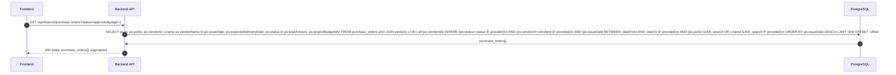
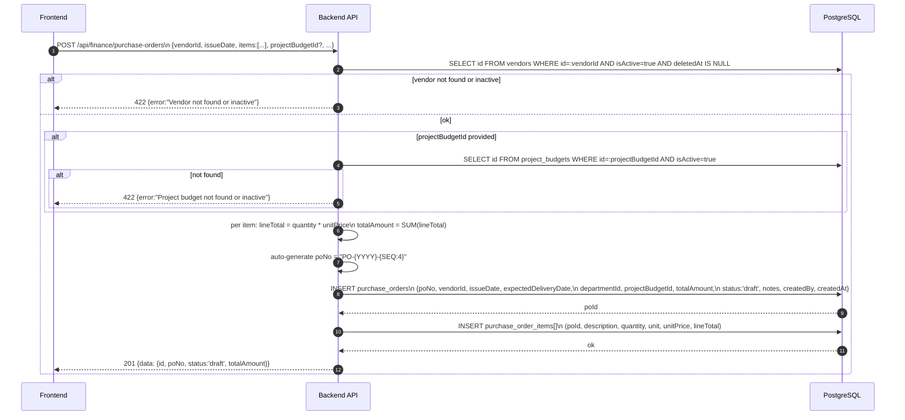
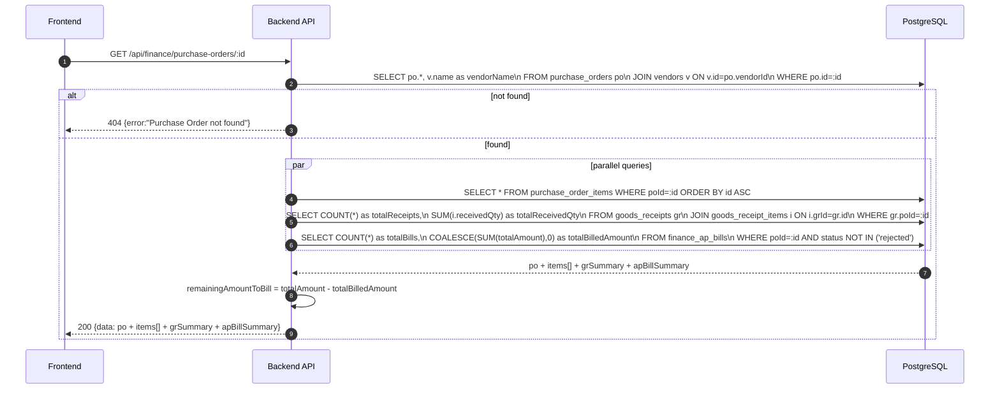
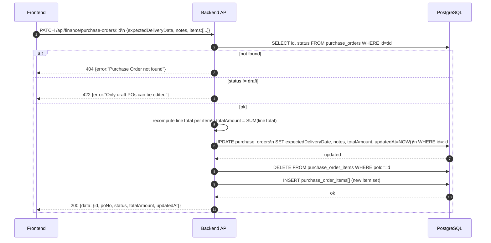
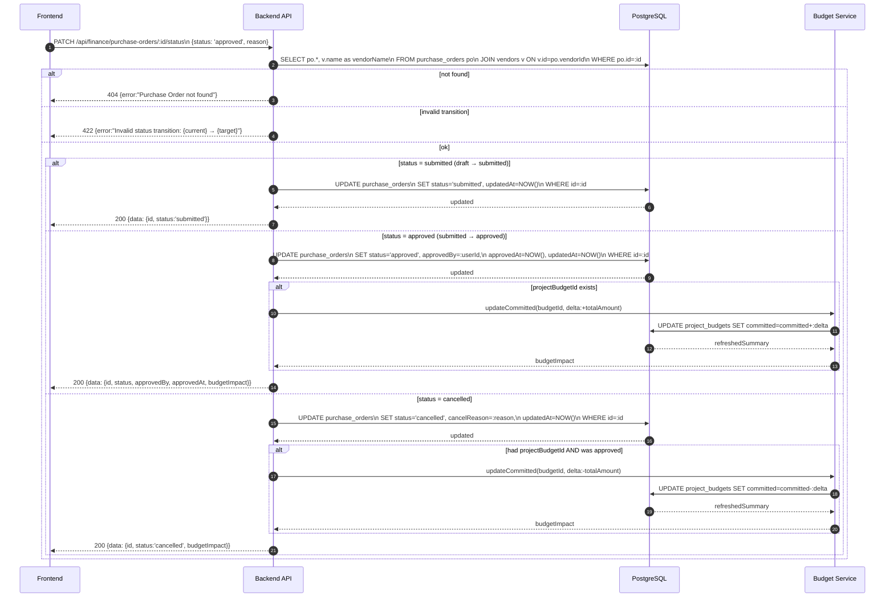
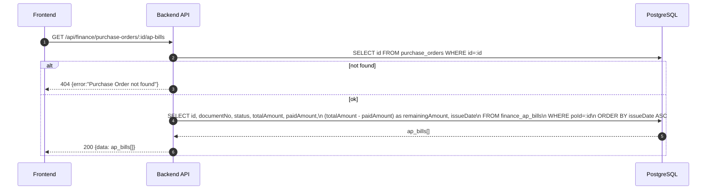
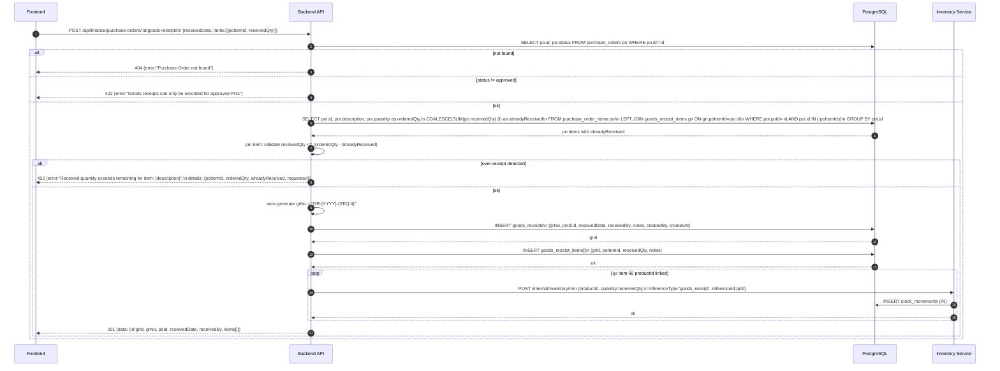
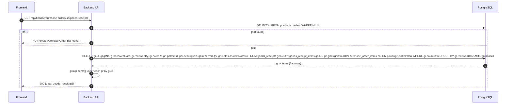
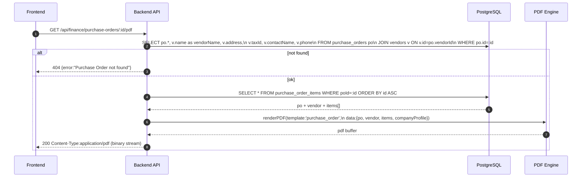

```mermaid
sequenceDiagram
    autonumber
    participant FE as Frontend
    participant BE as Backend API
    participant DB as PostgreSQL

    FE->>BE: GET /api/finance/purchase-orders/options?vendorId=ven_001
    BE->>DB: SELECT po.id, po.poNo, v.name as vendorName, po.status, po.totalAmount,\n  COALESCE(SUM(ab.totalAmount), 0) as billedAmount\n  FROM purchase_orders po\n  JOIN vendors v ON v.id=po.vendorId\n  LEFT JOIN finance_ap_bills ab ON ab.poId=po.id\n    AND ab.status NOT IN ('rejected','voided')\n  WHERE po.status='approved'\n    AND (po.vendorId=:vendorId IF provided)\n    AND (po.poNo ILIKE :search OR v.name ILIKE :search IF provided)\n  GROUP BY po.id, v.name\n  HAVING po.totalAmount > COALESCE(SUM(ab.totalAmount), 0)\n  ORDER BY po.issueDate DESC LIMIT 50
    DB-->>BE: options[]
    BE->>BE: per row: remainingAmountToBill = totalAmount - billedAmount
    BE-->>FE: 200 {data: options[]}
```

# Finance Module - Purchase Orders (Normalized)

อ้างอิง: `Documents/Release_2.md`

## API Inventory
- `GET /api/finance/purchase-orders`
- `GET /api/finance/purchase-orders/options`
- `POST /api/finance/purchase-orders`
- `GET /api/finance/purchase-orders/:id`
- `PATCH /api/finance/purchase-orders/:id`
- `PATCH /api/finance/purchase-orders/:id/status`
- `GET /api/finance/purchase-orders/:id/ap-bills`
- `POST /api/finance/purchase-orders/:id/goods-receipts`
- `GET /api/finance/purchase-orders/:id/goods-receipts`
- `GET /api/finance/purchase-orders/:id/pdf`

## Endpoint Details

### API: `GET /api/finance/purchase-orders`

**Purpose**
- ดึงรายการ Purchase Orders ทั้งหมด พร้อม filter และ pagination

**FE Screen**
- `/finance/purchase-orders`

**Params**
- Path Params: ไม่มี
- Query Params: `page`, `limit`, `status` (draft|submitted|approved|cancelled), `vendorId`, `dateFrom` (YYYY-MM-DD), `dateTo` (YYYY-MM-DD), `search` (poNo/vendorName)

**Request Headers**
```json
{
  "Authorization": "Bearer <access_token>"
}
```

**Request Body**
```json
{}
```

**Response Body (200)**
```json
{
  "data": [
    {
      "id": "po_001",
      "poNo": "PO-2026-0001",
      "vendorId": "ven_001",
      "vendorName": "บ.XYZ ซัพพลาย จำกัด",
      "issueDate": "2026-04-01",
      "expectedDeliveryDate": "2026-04-15",
      "status": "approved",
      "totalAmount": 85000,
      "projectBudgetId": "budget_001"
    }
  ],
  "pagination": { "page": 1, "limit": 20, "total": 14 }
}
```

**Sequence Diagram**


---

### API: `GET /api/finance/purchase-orders/options`

**Purpose**
- Dropdown สำหรับ AP Bill form หรือ Goods Receipt form — PO ที่ยังรับสินค้า/ลิงก์ AP ไม่ครบ

**FE Screen**
- AP Bill create form → PO picker, Goods Receipt form → PO picker

**Params**
- Path Params: ไม่มี
- Query Params: `search` (poNo/vendorName), `vendorId` (optional)

**Request Headers**
```json
{
  "Authorization": "Bearer <access_token>"
}
```

**Request Body**
```json
{}
```

**Response Body (200)**
```json
{
  "data": [
    {
      "id": "po_001",
      "poNo": "PO-2026-0001",
      "vendorName": "บ.XYZ ซัพพลาย จำกัด",
      "status": "approved",
      "remainingAmountToBill": 40000
    }
  ]
}
```

**Sequence Diagram**


---

### API: `POST /api/finance/purchase-orders`

**Purpose**
- สร้าง Purchase Order ใหม่ (status: draft) พร้อม line items — auto-gen poNo

**FE Screen**
- `/finance/purchase-orders/new`

**Params**
- Path Params: ไม่มี
- Query Params: ไม่มี

**Request Headers**
```json
{
  "Authorization": "Bearer <access_token>",
  "Content-Type": "application/json"
}
```

**Request Body**
```json
{
  "vendorId": "ven_001",
  "issueDate": "2026-04-01",
  "expectedDeliveryDate": "2026-04-15",
  "departmentId": "dept_001",
  "projectBudgetId": "budget_001",
  "notes": "Office supplies Q2",
  "items": [
    {
      "description": "A4 Paper 80gsm",
      "quantity": 50,
      "unit": "ream",
      "unitPrice": 120
    }
  ]
}
```

**Response Body (201)**
```json
{
  "data": {
    "id": "po_001",
    "poNo": "PO-2026-0001",
    "status": "draft",
    "totalAmount": 6000
  },
  "message": "Purchase Order created"
}
```

**Sequence Diagram**


---

### API: `GET /api/finance/purchase-orders/:id`

**Purpose**
- ดู PO detail ครบ: header + line items + GR summary + AP bill summary

**FE Screen**
- `/finance/purchase-orders/:id`

**Params**
- Path Params: `id` (PO ID)
- Query Params: ไม่มี

**Request Headers**
```json
{
  "Authorization": "Bearer <access_token>"
}
```

**Request Body**
```json
{}
```

**Response Body (200)**
```json
{
  "data": {
    "id": "po_001",
    "poNo": "PO-2026-0001",
    "vendorId": "ven_001",
    "vendorName": "บ.XYZ ซัพพลาย จำกัด",
    "issueDate": "2026-04-01",
    "expectedDeliveryDate": "2026-04-15",
    "status": "approved",
    "totalAmount": 85000,
    "departmentId": "dept_001",
    "projectBudgetId": "budget_001",
    "notes": "Office supplies Q2",
    "approvedBy": "usr_002",
    "approvedAt": "2026-04-02T09:00:00Z",
    "items": [
      {
        "id": "poi_001",
        "description": "A4 Paper 80gsm",
        "quantity": 50,
        "unit": "ream",
        "unitPrice": 120,
        "lineTotal": 6000
      }
    ],
    "grSummary": {
      "totalReceipts": 1,
      "totalReceivedQty": 50
    },
    "apBillSummary": {
      "totalBills": 1,
      "totalBilledAmount": 45000,
      "remainingAmountToBill": 40000
    }
  }
}
```

**Sequence Diagram**


---

### API: `PATCH /api/finance/purchase-orders/:id`

**Purpose**
- แก้ไข PO detail — editable เฉพาะ status=draft

**FE Screen**
- `/finance/purchase-orders/:id/edit`

**Params**
- Path Params: `id` (PO ID)
- Query Params: ไม่มี

**Request Headers**
```json
{
  "Authorization": "Bearer <access_token>",
  "Content-Type": "application/json"
}
```

**Request Body**
```json
{
  "expectedDeliveryDate": "2026-04-20",
  "notes": "Updated delivery window",
  "items": [
    {
      "id": "poi_001",
      "quantity": 60,
      "unitPrice": 120
    }
  ]
}
```

**Response Body (200)**
```json
{
  "data": {
    "id": "po_001",
    "poNo": "PO-2026-0001",
    "status": "draft",
    "totalAmount": 7200,
    "updatedAt": "2026-04-27T10:00:00Z"
  },
  "message": "Purchase Order updated"
}
```

**Sequence Diagram**


---

### API: `PATCH /api/finance/purchase-orders/:id/status`

**Purpose**
- เปลี่ยน status ตาม workflow: draft → submitted → approved / cancelled
- approve → update budget committed amount

**FE Screen**
- PO detail → ปุ่ม "ส่งอนุมัติ" / "อนุมัติ" / "ยกเลิก"

**Params**
- Path Params: `id` (PO ID)
- Query Params: ไม่มี

**Request Headers**
```json
{
  "Authorization": "Bearer <access_token>",
  "Content-Type": "application/json"
}
```

**Request Body**
```json
{ "status": "approved", "reason": null }
```

**Response Body (200)**
```json
{
  "data": {
    "id": "po_001",
    "status": "approved",
    "approvedBy": "usr_002",
    "approvedAt": "2026-04-02T09:00:00Z",
    "budgetImpact": {
      "committedDelta": 85000,
      "actualSpendDelta": 0,
      "budgetId": "budget_001",
      "refreshedBudgetSummary": {
        "budgetAmount": 500000,
        "committed": 85000,
        "actualSpend": 0,
        "remaining": 415000
      }
    }
  },
  "message": "Purchase Order approved"
}
```

**Sequence Diagram**


---

### API: `GET /api/finance/purchase-orders/:id/ap-bills`

**Purpose**
- ดู AP bills ทั้งหมดที่ลิงก์กับ PO นี้

**FE Screen**
- PO detail → AP Bills tab

**Params**
- Path Params: `id` (PO ID)
- Query Params: ไม่มี

**Request Headers**
```json
{
  "Authorization": "Bearer <access_token>"
}
```

**Request Body**
```json
{}
```

**Response Body (200)**
```json
{
  "data": [
    {
      "id": "apb_001",
      "documentNo": "AP-2026-0001",
      "status": "approved",
      "totalAmount": 45000,
      "paidAmount": 45000,
      "remainingAmount": 0,
      "issueDate": "2026-04-10"
    }
  ]
}
```

**Sequence Diagram**


---

### API: `POST /api/finance/purchase-orders/:id/goods-receipts`

**Purpose**
- บันทึกการรับสินค้า (Goods Receipt) ต่อ PO — update inventory stock IN

**FE Screen**
- PO detail → ปุ่ม "บันทึกรับสินค้า"

**Params**
- Path Params: `id` (PO ID)
- Query Params: ไม่มี

**Request Headers**
```json
{
  "Authorization": "Bearer <access_token>",
  "Content-Type": "application/json"
}
```

**Request Body**
```json
{
  "receivedDate": "2026-04-15",
  "receivedBy": "usr_003",
  "notes": "Partial delivery — 30 of 50 reams",
  "items": [
    {
      "poItemId": "poi_001",
      "receivedQty": 30,
      "notes": null
    }
  ]
}
```

**Response Body (201)**
```json
{
  "data": {
    "id": "gr_001",
    "grNo": "GR-2026-0001",
    "poId": "po_001",
    "receivedDate": "2026-04-15",
    "receivedBy": "usr_003",
    "items": [
      { "poItemId": "poi_001", "receivedQty": 30 }
    ]
  },
  "message": "Goods receipt recorded"
}
```

**Sequence Diagram**


---

### API: `GET /api/finance/purchase-orders/:id/goods-receipts`

**Purpose**
- ดู Goods Receipts ทั้งหมดที่ผ่านมาของ PO นี้

**FE Screen**
- PO detail → Goods Receipts tab

**Params**
- Path Params: `id` (PO ID)
- Query Params: ไม่มี

**Request Headers**
```json
{
  "Authorization": "Bearer <access_token>"
}
```

**Request Body**
```json
{}
```

**Response Body (200)**
```json
{
  "data": [
    {
      "id": "gr_001",
      "grNo": "GR-2026-0001",
      "receivedDate": "2026-04-15",
      "receivedBy": "usr_003",
      "notes": "Partial delivery",
      "items": [
        {
          "poItemId": "poi_001",
          "description": "A4 Paper 80gsm",
          "receivedQty": 30,
          "notes": null
        }
      ]
    }
  ]
}
```

**Sequence Diagram**


---

### API: `GET /api/finance/purchase-orders/:id/pdf`

**Purpose**
- Generate และ return PDF ของ PO สำหรับ print / ส่งให้ vendor

**FE Screen**
- PO detail → ปุ่ม "ดาวน์โหลด PDF"

**Params**
- Path Params: `id` (PO ID)
- Query Params: ไม่มี

**Request Headers**
```json
{
  "Authorization": "Bearer <access_token>"
}
```

**Request Body**
```json
{}
```

**Response Body (200)**
- Content-Type: `application/pdf`
- Body: PDF binary stream

**Sequence Diagram**


---

## Coverage Lock Addendum (2026-04-16)

### PO Core Contracts
- `GET /api/finance/purchase-orders`
  - Query: `page`, `limit`, `status`, `vendorId`, `dateFrom`, `dateTo`
  - list item อย่างน้อยต้องมี `id`, `poNo`, `vendorSummary`, `issueDate`, `expectedDeliveryDate`, `status`, `totalAmount`, `projectBudgetId?`
- `GET /api/finance/purchase-orders/options`
  - default ใช้สำหรับ PO picker ที่ยังรับสินค้า/ลิงก์ AP ไม่ครบ
  - option item อย่างน้อยต้องมี `id`, `poNo`, `vendorName`, `status`, `remainingAmountToBill`
- `POST /api/finance/purchase-orders`
  - request body ต้องมี `vendorId`, `issueDate`, `expectedDeliveryDate?`, `departmentId?`, `projectBudgetId?`, `notes?`, `items[]`
  - `items[]` อย่างน้อย: `description`, `quantity`, `unit`, `unitPrice`
- `PATCH /api/finance/purchase-orders/:id`
  - editable เฉพาะ `draft`
  - response ต้องคืน normalized PO detail object

### Status / GR / AP Linkage
- `PATCH /api/finance/purchase-orders/:id/status`
  - request body: `{ "status": "submitted|approved|cancelled", "reason?": "..." }`
  - response ต้องคืน `status`, `approvedBy?`, `approvedAt?`, `budgetImpact`
- `POST /api/finance/purchase-orders/:id/goods-receipts`
  - request body: `receivedDate`, `receivedBy`, `notes?`, `items[]`
  - `items[]` อย่างน้อย: `poItemId`, `receivedQty`, `notes?`
- `GET /api/finance/purchase-orders/:id/goods-receipts`
  - response item ต้องมี `grNo`, `receivedDate`, `receivedBy`, `items[]`
- `GET /api/finance/purchase-orders/:id/ap-bills`
  - response item ต้องมี `id`, `documentNo`, `status`, `totalAmount`, `paidAmount`

### Budget Side Effects
- `budgetImpact` ต้องเป็น canonical read model:
  - `committedDelta`
  - `actualSpendDelta`
  - `budgetId`
  - `refreshedBudgetSummary`
- PO approve / cancel / AP-linked payment ต้องสะท้อนผลใน budget detail และ summary read endpoints โดยไม่ให้ FE คำนวณเอง
