# Finance Module - Quotation & Sales Order (Normalized)

อ้างอิง: `Documents/Release_2.md`

## API Inventory
- `GET /api/finance/quotations`
- `POST /api/finance/quotations`
- `GET /api/finance/quotations/:id`
- `PATCH /api/finance/quotations/:id`
- `PATCH /api/finance/quotations/:id/status`
- `POST /api/finance/quotations/:id/convert-to-so`
- `GET /api/finance/quotations/:id/pdf`
- `GET /api/finance/sales-orders`
- `POST /api/finance/sales-orders`
- `GET /api/finance/sales-orders/:id`
- `PATCH /api/finance/sales-orders/:id/status`
- `POST /api/finance/sales-orders/:id/convert-to-invoice`

## Endpoint Details

### API: `GET /api/finance/quotations`

**Purpose**
- ดึงรายการ quotation สำหรับตารางหน้า quotation list

**FE Screen**
- `/finance/quotations`

**Params**
- Path Params: ไม่มี
- Query Params: `page`, `limit`, `search`, `status`, `customerId`

**Request Headers**
```json
{ "Authorization": "Bearer <access_token>" }
```

**Request Body**
```json
{}
```

**Response Body (200)**
```json
{
  "data": [
    {
      "id": "qt_001",
      "quotNo": "QT-2026-0001",
      "customerId": "cust_001",
      "customerCode": "C001",
      "customerName": "บริษัท ABC จำกัด",
      "issueDate": "2026-04-15",
      "validUntil": "2026-04-30",
      "subtotalBeforeVat": 10000,
      "vatAmount": 700,
      "totalAmount": 10700,
      "status": "draft",
      "updatedAt": "2026-04-15T09:00:00Z"
    }
  ],
  "meta": { "page": 1, "limit": 20, "total": 5 }
}
```

**Sequence Diagram**
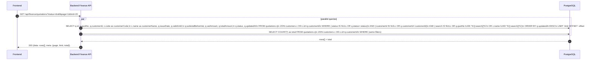

---

### API: `POST /api/finance/quotations`

**Purpose**
- สร้าง quotation พร้อมรายการสินค้า/บริการ

**FE Screen**
- `/finance/quotations/new`

**Params**
- Path Params: ไม่มี
- Query Params: ไม่มี

**Request Headers**
```json
{ "Authorization": "Bearer <access_token>" }
```

**Request Body**
```json
{
  "customerId": "cust_001",
  "issueDate": "2026-04-15",
  "validUntil": "2026-04-30",
  "notes": "ราคานี้ไม่รวมค่าติดตั้ง",
  "termsAndConditions": "ชำระภายใน 30 วัน",
  "items": [
    {
      "description": "ค่า Software License",
      "quantity": 1,
      "unitPrice": 10000,
      "vatRate": 7
    }
  ]
}
```

**Response Body (201)**
```json
{
  "data": {
    "id": "qt_001",
    "quotNo": "QT-2026-0001",
    "status": "draft",
    "subtotalBeforeVat": 10000,
    "vatAmount": 700,
    "totalAmount": 10700
  },
  "creditWarning": null,
  "message": "Created"
}
```

**Sequence Diagram**
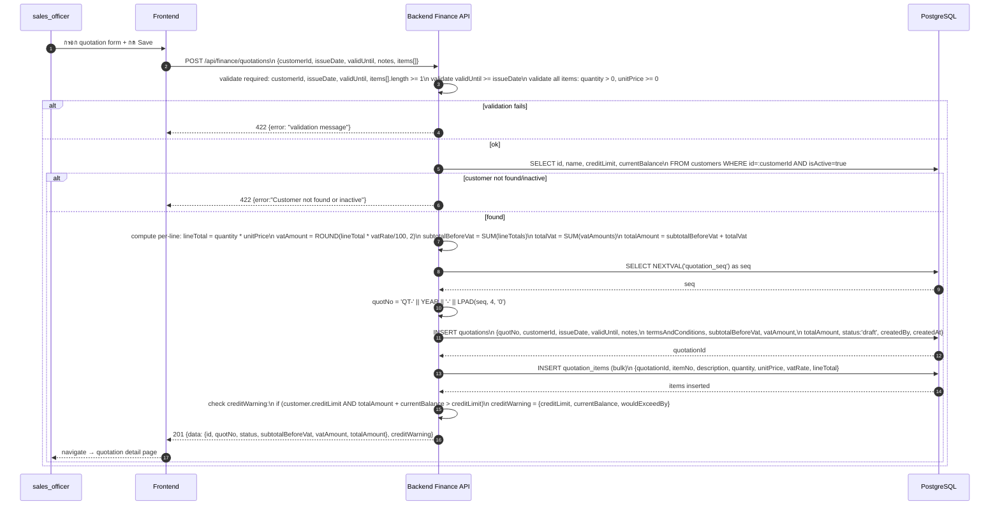

---

### API: `GET /api/finance/quotations/:id`

**Purpose**
- ดึงรายละเอียด quotation เดียว พร้อม items และ linked SO

**FE Screen**
- `/finance/quotations/:id`

**Params**
- Path Params: `id` (string, required)
- Query Params: ไม่มี

**Request Headers**
```json
{ "Authorization": "Bearer <access_token>" }
```

**Response Body (200)**
```json
{
  "data": {
    "id": "qt_001",
    "quotNo": "QT-2026-0001",
    "customerId": "cust_001",
    "customerName": "บริษัท ABC จำกัด",
    "customerSnapshot": { "address": "123 ถ.สุขุมวิท", "taxId": "0105555001234" },
    "issueDate": "2026-04-15",
    "validUntil": "2026-04-30",
    "subtotalBeforeVat": 10000,
    "vatAmount": 700,
    "totalAmount": 10700,
    "status": "draft",
    "notes": "ราคานี้ไม่รวมค่าติดตั้ง",
    "termsAndConditions": "ชำระภายใน 30 วัน",
    "items": [
      {
        "id": "qi_001",
        "itemNo": 1,
        "description": "ค่า Software License",
        "quantity": 1,
        "unitPrice": 10000,
        "vatRate": 7,
        "lineTotal": 10000
      }
    ],
    "salesOrderId": null,
    "createdBy": "user_001",
    "createdAt": "2026-04-15T09:00:00Z"
  }
}
```

**Sequence Diagram**
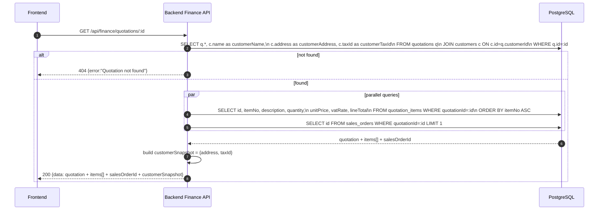

---

### API: `PATCH /api/finance/quotations/:id`

**Purpose**
- แก้ไข quotation (draft เท่านั้น)

**FE Screen**
- `/finance/quotations/:id` → edit mode

**Params**
- Path Params: `id` (string, required)

**Request Headers**
```json
{ "Authorization": "Bearer <access_token>" }
```

**Request Body**
```json
{
  "validUntil": "2026-05-15",
  "notes": "ราคารวมค่าขนส่ง",
  "items": [
    { "description": "ค่า Software License", "quantity": 2, "unitPrice": 10000, "vatRate": 7 }
  ]
}
```

**Response Body (200)**
```json
{
  "data": {
    "id": "qt_001",
    "subtotalBeforeVat": 20000,
    "vatAmount": 1400,
    "totalAmount": 21400,
    "updatedAt": "2026-04-16T10:00:00Z"
  },
  "message": "Updated"
}
```

**Sequence Diagram**
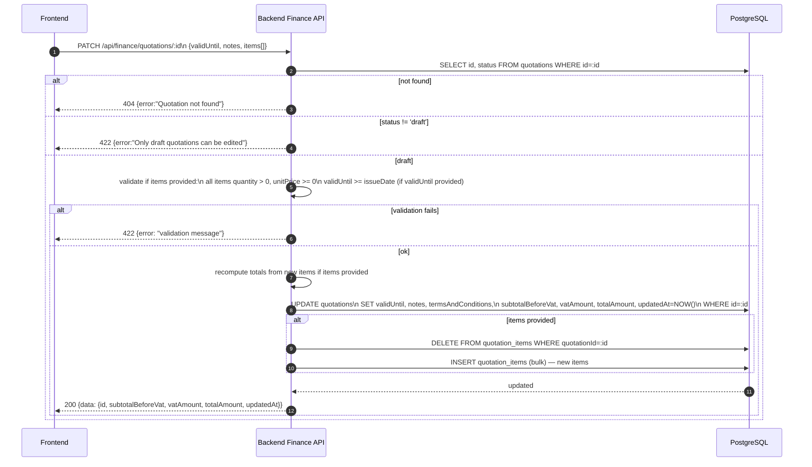

---

### API: `PATCH /api/finance/quotations/:id/status`

**Purpose**
- เปลี่ยนสถานะ quotation: sent / accepted / rejected (`expired` เป็น system-derived ไม่ใช่ manual)

**FE Screen**
- `/finance/quotations/:id`

**Params**
- Path Params: `id` (string, required)

**Request Headers**
```json
{ "Authorization": "Bearer <access_token>" }
```

**Request Body**
```json
{ "status": "sent" }
```

**Response Body (200)**
```json
{ "data": { "id": "qt_001", "status": "sent" }, "message": "Status updated" }
```

**Sequence Diagram**
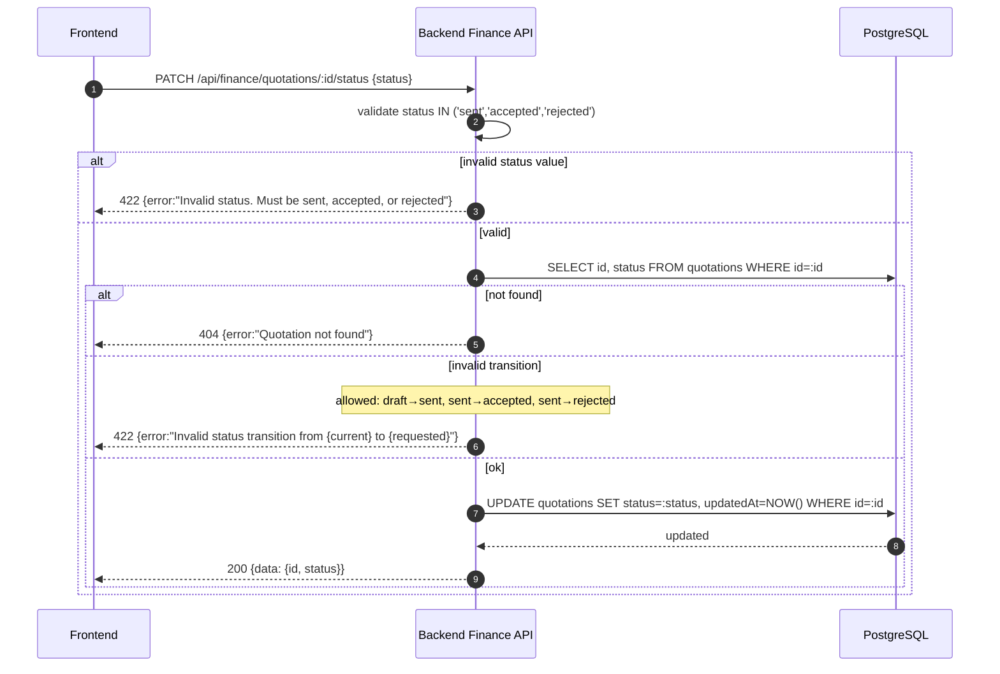

---

### API: `POST /api/finance/quotations/:id/convert-to-so`

**Purpose**
- แปลง quotation เป็น sales order — quotation ต้องอยู่ใน status `accepted`

**FE Screen**
- `/finance/quotations/:id`

**Params**
- Path Params: `id` (string, required)

**Request Headers**
```json
{ "Authorization": "Bearer <access_token>" }
```

**Request Body**
```json
{}
```

**Response Body (201)**
```json
{
  "data": {
    "salesOrderId": "so_001",
    "soNo": "SO-2026-0001",
    "quotationId": "qt_001",
    "quotationStatus": "accepted"
  },
  "message": "Converted to Sales Order"
}
```

**Sequence Diagram**
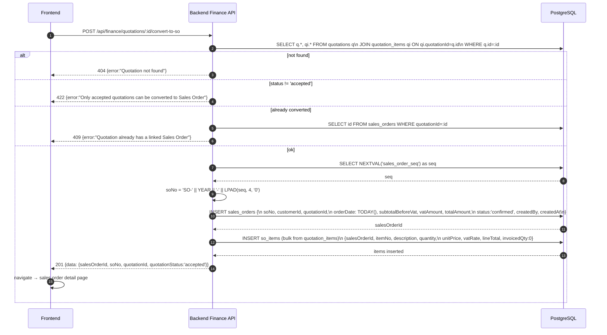

---

### API: `GET /api/finance/quotations/:id/pdf`

**Purpose**
- ดาวน์โหลด PDF ของ quotation (synchronous inline download)

**FE Screen**
- `/finance/quotations/:id`

**Params**
- Path Params: `id` (string, required)

**Request Headers**
```json
{ "Authorization": "Bearer <access_token>" }
```

**Response**
- `Content-Type: application/pdf`
- `Content-Disposition: inline; filename="QT-2026-0001.pdf"`

**Sequence Diagram**
```mermaid
sequenceDiagram
    autonumber
    participant FE as Frontend
    participant BE as Backend Export API
    participant DB as PostgreSQL
    participant PDF as PDF Engine

    FE->>BE: GET /api/finance/quotations/:id/pdf
    BE->>DB: SELECT q.*, c.name, c.address, c.taxId,\n  comp.name as companyName, comp.address as companyAddress,\n  comp.taxId as companyTaxId, comp.logoUrl\n  FROM quotations q\n  JOIN customers c ON c.id=q.customerId\n  CROSS JOIN company_settings comp\n  WHERE q.id=:id
    alt not found
        BE-->>FE: 404 {error:"Quotation not found"}
    else found
        BE->>DB: SELECT * FROM quotation_items WHERE quotationId=:id ORDER BY itemNo ASC
        DB-->>BE: quotation + customer + company + items[]
        BE->>PDF: renderPDF('quotation', {\n  quotation, customer, company, items\n})
        PDF-->>BE: pdfBuffer
        BE-->>FE: 200 application/pdf (binary stream)\n  Content-Disposition: inline; filename="QT-2026-0001.pdf"
    end
```

---

### API: `GET /api/finance/sales-orders`

**Purpose**
- ดึงรายการ sales order

**FE Screen**
- `/finance/sales-orders`

**Params**
- Path Params: ไม่มี
- Query Params: `page`, `limit`, `search`, `status`, `customerId`

**Request Headers**
```json
{ "Authorization": "Bearer <access_token>" }
```

**Response Body (200)**
```json
{
  "data": [
    {
      "id": "so_001",
      "soNo": "SO-2026-0001",
      "customerId": "cust_001",
      "customerCode": "C001",
      "customerName": "บริษัท ABC จำกัด",
      "orderDate": "2026-04-16",
      "deliveryDate": null,
      "subtotalBeforeVat": 20000,
      "vatAmount": 1400,
      "totalAmount": 21400,
      "status": "confirmed",
      "updatedAt": "2026-04-16T10:00:00Z"
    }
  ],
  "meta": { "page": 1, "limit": 20, "total": 3 }
}
```

**Sequence Diagram**
```mermaid
sequenceDiagram
    autonumber
    participant FE as Frontend
    participant BE as Backend Finance API
    participant DB as PostgreSQL

    FE->>BE: GET /api/finance/sales-orders?status=confirmed&page=1
    par parallel queries
        BE->>DB: SELECT so.id, so.soNo, so.customerId,\n  c.code as customerCode, c.name as customerName,\n  so.orderDate, so.deliveryDate,\n  so.subtotalBeforeVat, so.vatAmount, so.totalAmount,\n  so.status, so.updatedAt\n  FROM sales_orders so\n  JOIN customers c ON c.id=so.customerId\n  WHERE (:status IS NULL OR so.status=:status)\n    AND (:customerId IS NULL OR so.customerId=:customerId)\n    AND (:search IS NULL OR so.soNo ILIKE '%'||:search||'%'\n      OR c.name ILIKE '%'||:search||'%')\n  ORDER BY so.updatedAt DESC\n  LIMIT :limit OFFSET :offset
        BE->>DB: SELECT COUNT(*) as total FROM sales_orders so\n  JOIN customers c ON c.id=so.customerId\n  WHERE (same filters)
    end
    DB-->>BE: rows[] + total
    BE-->>FE: 200 {data: rows[], meta: {page, limit, total}}
```

---

### API: `POST /api/finance/sales-orders`

**Purpose**
- สร้าง sales order โดยตรง (ไม่ผ่าน quotation)

**FE Screen**
- `/finance/sales-orders/new`

**Request Headers**
```json
{ "Authorization": "Bearer <access_token>" }
```

**Request Body**
```json
{
  "customerId": "cust_001",
  "orderDate": "2026-04-16",
  "deliveryDate": "2026-04-30",
  "notes": "ส่งถึงสาขา A",
  "items": [
    { "description": "อุปกรณ์สำนักงาน", "quantity": 10, "unitPrice": 500, "vatRate": 7 }
  ]
}
```

**Response Body (201)**
```json
{
  "data": {
    "id": "so_001",
    "soNo": "SO-2026-0001",
    "status": "confirmed",
    "subtotalBeforeVat": 5000,
    "vatAmount": 350,
    "totalAmount": 5350
  },
  "creditWarning": null,
  "message": "Created"
}
```

**Sequence Diagram**
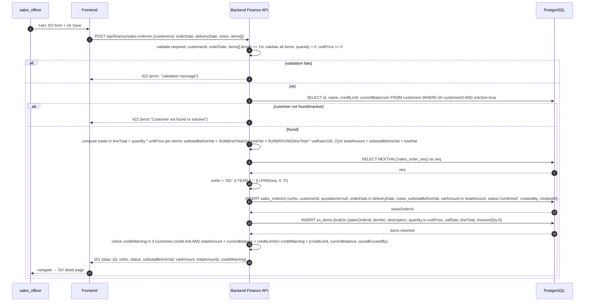

---

### API: `GET /api/finance/sales-orders/:id`

**Purpose**
- ดึงรายละเอียด sales order พร้อม items (invoicedQty, remainingQty) และ linked invoices

**FE Screen**
- `/finance/sales-orders/:id`

**Params**
- Path Params: `id` (string, required)

**Response Body (200)**
```json
{
  "data": {
    "id": "so_001",
    "soNo": "SO-2026-0001",
    "customerId": "cust_001",
    "customerName": "บริษัท ABC จำกัด",
    "orderDate": "2026-04-16",
    "deliveryDate": "2026-04-30",
    "subtotalBeforeVat": 5000,
    "vatAmount": 350,
    "totalAmount": 5350,
    "status": "confirmed",
    "quotationId": null,
    "notes": "ส่งถึงสาขา A",
    "items": [
      {
        "id": "soi_001",
        "itemNo": 1,
        "description": "อุปกรณ์สำนักงาน",
        "quantity": 10,
        "unitPrice": 500,
        "lineTotal": 5000,
        "vatRate": 7,
        "invoicedQty": 0,
        "remainingQty": 10
      }
    ],
    "linkedInvoices": [],
    "createdBy": "user_001",
    "createdAt": "2026-04-16T10:00:00Z"
  }
}
```

**Sequence Diagram**
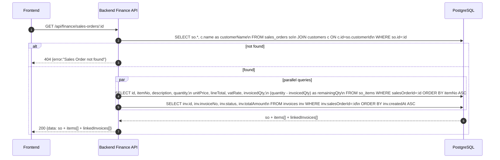

---

### API: `PATCH /api/finance/sales-orders/:id/status`

**Purpose**
- เปลี่ยนสถานะ SO: `confirmed` / `cancelled` (`partially_invoiced`, `invoiced` เป็น system-derived states)

**FE Screen**
- `/finance/sales-orders/:id`

**Request Headers**
```json
{ "Authorization": "Bearer <access_token>" }
```

**Request Body**
```json
{ "status": "cancelled" }
```

**Response Body (200)**
```json
{ "data": { "id": "so_001", "status": "cancelled" }, "message": "Status updated" }
```

**Sequence Diagram**
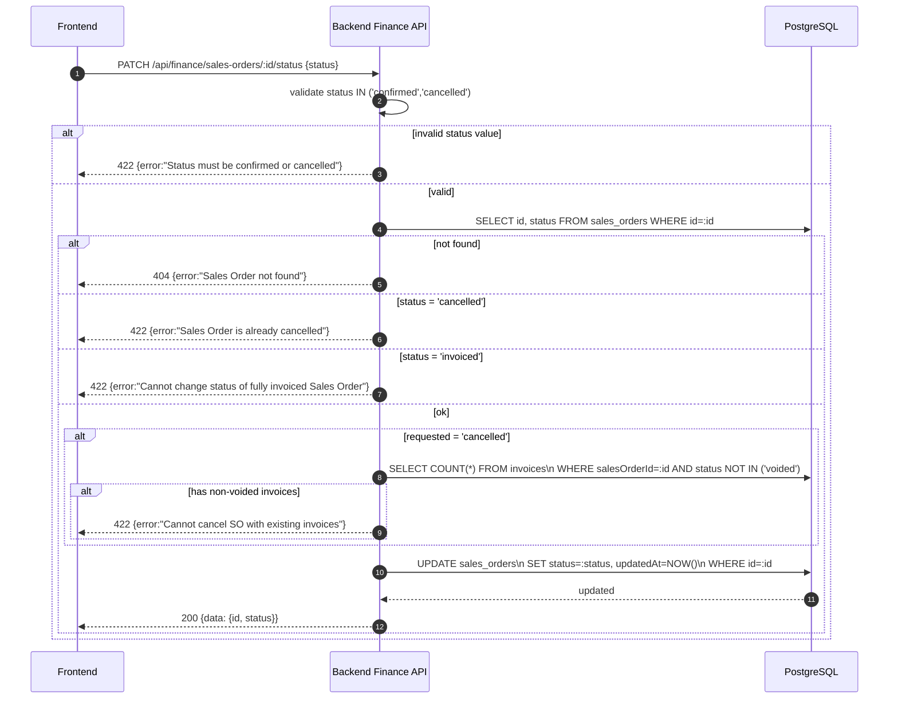

---

### API: `POST /api/finance/sales-orders/:id/convert-to-invoice`

**Purpose**
- แปลง SO เป็น invoice โดยใช้เฉพาะ remaining quantity; ถ้าไม่มียอดคงเหลือให้ตอบ 409

**FE Screen**
- `/finance/sales-orders/:id`

**Request Headers**
```json
{ "Authorization": "Bearer <access_token>" }
```

**Request Body**
```json
{}
```

**Response Body (201)**
```json
{
  "data": {
    "invoiceId": "inv_001",
    "invoiceNo": "INV-2026-0001",
    "salesOrderId": "so_001",
    "salesOrderStatus": "invoiced"
  },
  "message": "Converted to Invoice"
}
```

**Sequence Diagram**
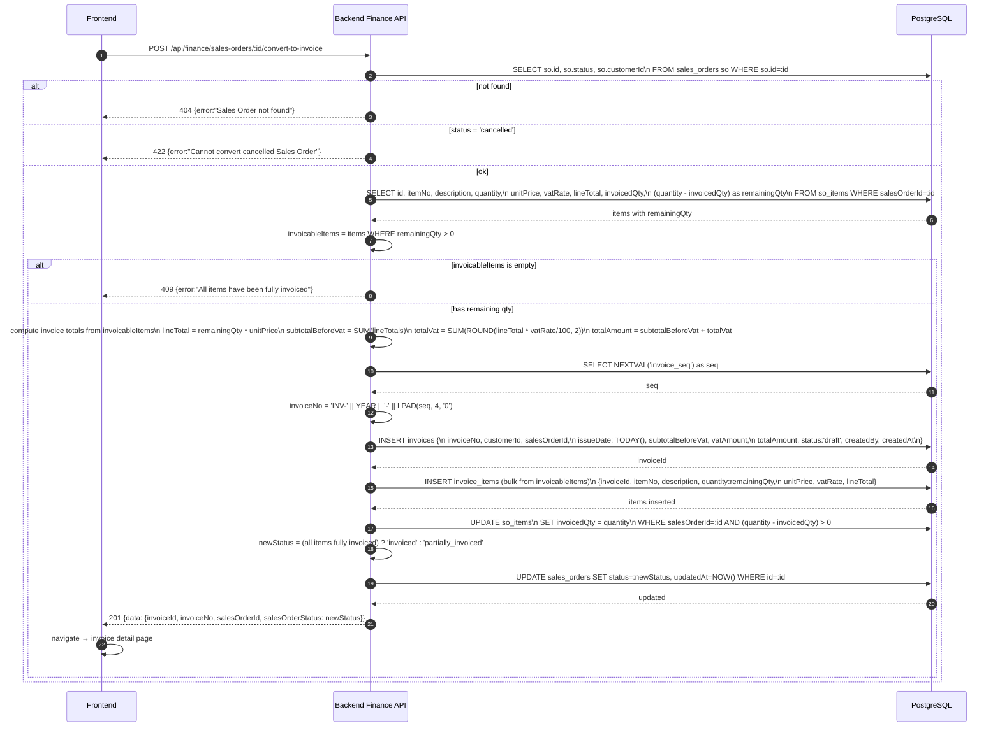

---

## Coverage Lock Addendum (2026-04-16)

### Contract Usage Note
- sequence/examples ด้านบนยังย่อเกินไปสำหรับ field-level implementation; ถ้ามีความต่างระหว่าง placeholder กับการใช้งานจริง ให้ยึด addendum นี้เป็น source of truth

### Quotation contracts
- `GET /api/finance/quotations` query ที่ล็อกคือ `page`, `limit`, `search`, `status`, `customerId?`
- quotation list item อย่างน้อยต้องมี `id`, `quotNo`, `customerId`, `customerCode?`, `customerName`, `issueDate`, `validUntil`, `subtotalBeforeVat`, `vatAmount`, `totalAmount`, `status`, `updatedAt`
- `POST /api/finance/quotations` และ `PATCH /api/finance/quotations/:id` body ที่ล็อกคือ `customerId`, `issueDate`, `validUntil`, `notes?`, `termsAndConditions?`, `items[]`
- `items[]` ต้องใช้ `description`, `quantity`, `unitPrice`, `vatRate?`; `lineTotal`, `subtotalBeforeVat`, `vatAmount`, `totalAmount` เป็น server-computed fields
- `GET /api/finance/quotations/:id` ต้องคืน header fields + `items[]`, `createdBy`, `createdAt`, `customerSnapshot?`, `salesOrderId?`
- `PATCH /api/finance/quotations/:id/status` body ใช้ persisted status values คือ `{ "status": "sent" | "accepted" | "rejected" }`; `expired` เป็น system-derived state ไม่ใช่ manual action หลัก
- response หลัง quotation create ต้องรองรับ `creditWarning?`; ถ้ามีให้ถือเป็น advisory payload ไม่ใช่ hard error

### Sales order contracts
- `GET /api/finance/sales-orders` query ที่ล็อกคือ `page`, `limit`, `search`, `status`, `customerId?`
- sales-order list item อย่างน้อยต้องมี `id`, `soNo`, `customerId`, `customerCode?`, `customerName`, `orderDate`, `deliveryDate?`, `subtotalBeforeVat`, `vatAmount`, `totalAmount`, `status`, `updatedAt`
- `POST /api/finance/sales-orders` body ที่ล็อกคือ `customerId`, `orderDate`, `deliveryDate?`, `notes?`, `items[]`
- `GET /api/finance/sales-orders/:id` ต้องคืน header fields + `quotationId?`, `items[]`, `linkedInvoices[]`
- `so.items[]` อย่างน้อยต้องมี `id`, `itemNo`, `description`, `quantity`, `unitPrice`, `lineTotal`, `vatRate`, `invoicedQty`, `remainingQty`
- `linkedInvoices[]` อย่างน้อยต้องมี `id`, `invoiceNo`, `status`, `totalAmount`
- `PATCH /api/finance/sales-orders/:id/status` body ใช้ `{ "status": "confirmed" | "cancelled" }`; `partially_invoiced` และ `invoiced` เป็น system-derived states

### Conversion / picker / export rules
- `POST /api/finance/quotations/:id/convert-to-so` success response ต้องคืนอย่างน้อย `salesOrderId`, `soNo`, `quotationId`, `quotationStatus`
- `POST /api/finance/sales-orders/:id/convert-to-invoice` success response ต้องคืนอย่างน้อย `invoiceId`, `invoiceNo`, `salesOrderId`, `salesOrderStatus`
- convert-to-invoice ต้องใช้เฉพาะ remaining quantity จาก `quantity - invoicedQty`; ถ้าไม่มียอดคงเหลือให้ตอบ `409`
- customer picker ของ quotation / sales-order create ต้อง reuse `GET /api/finance/customers/options`
- `creditWarning` เป็น canonical บน quotation create; direct sales-order create อาจ reuse warning envelope เดียวกันได้ แต่ UX ต้องถือว่าเป็น optional advisory field
- `GET /api/finance/quotations/:id/pdf` เป็น synchronous inline PDF download และต้องอิง dataset เดียวกับ quotation detail

### Validation locks
- `customerId`, `issueDate`, `validUntil`, `orderDate` เป็น required ตาม document type
- quotation update (`PATCH /api/finance/quotations/:id`) ใช้ได้เฉพาะ `status = draft`
- `validUntil` ต้องไม่น้อยกว่า `issueDate`
- ทุกเอกสารต้องมี `items[]` อย่างน้อย 1 รายการ และ `quantity > 0`, `unitPrice >= 0`
