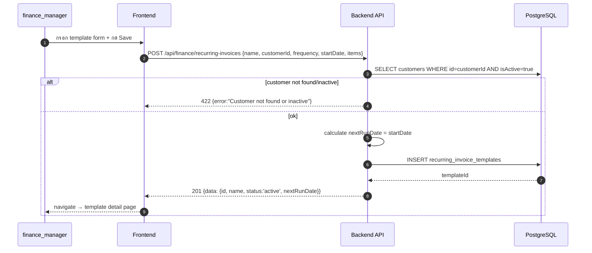
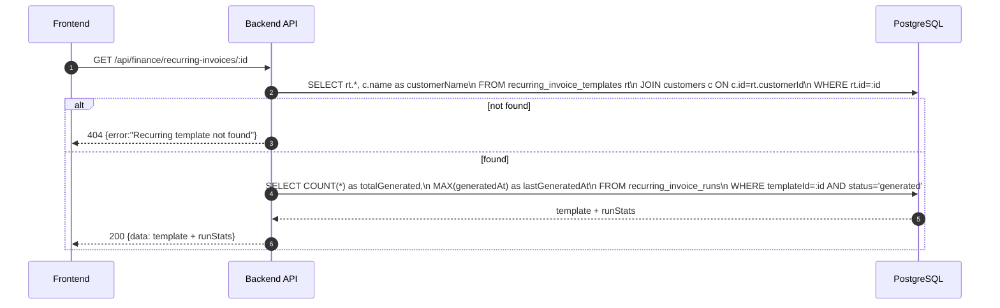
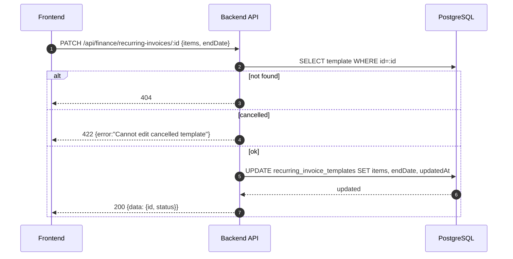
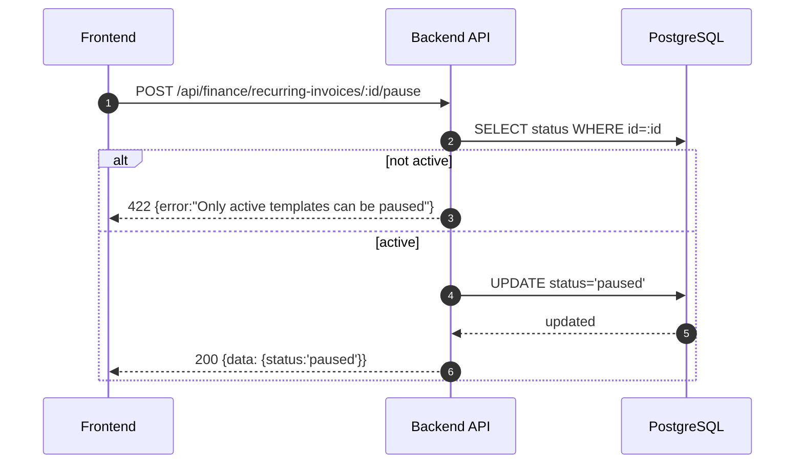
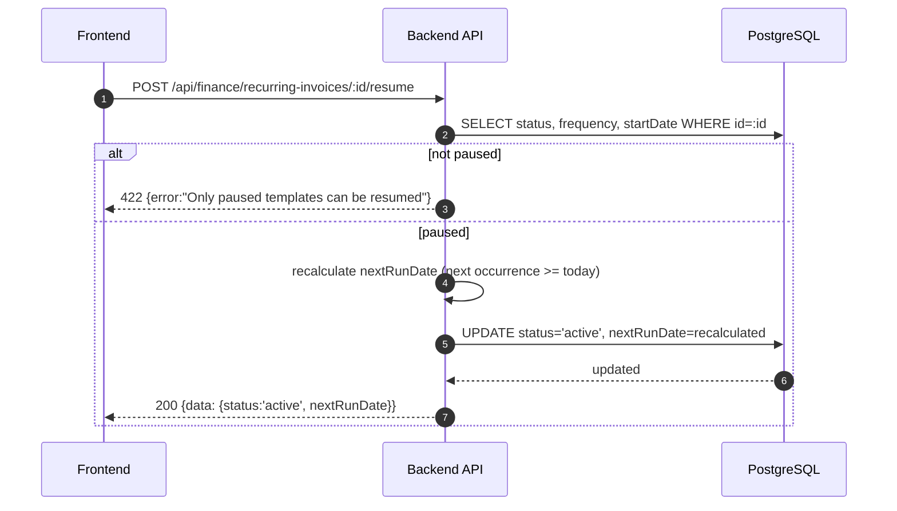
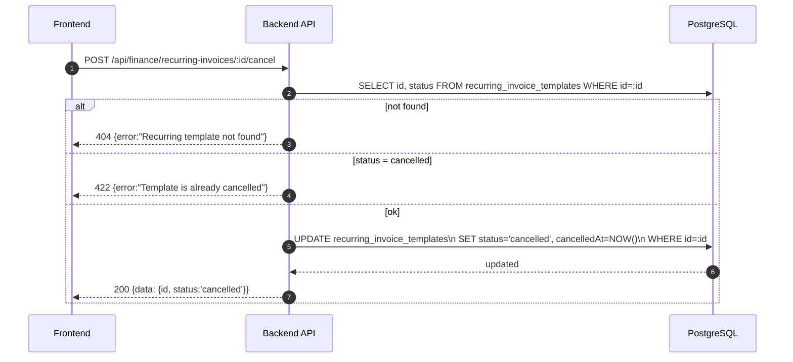
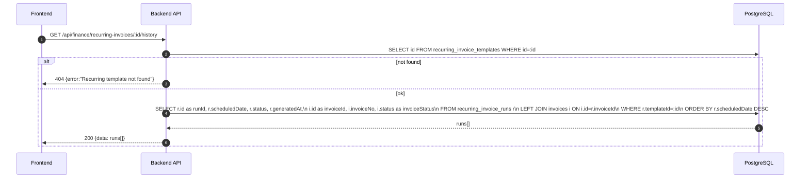
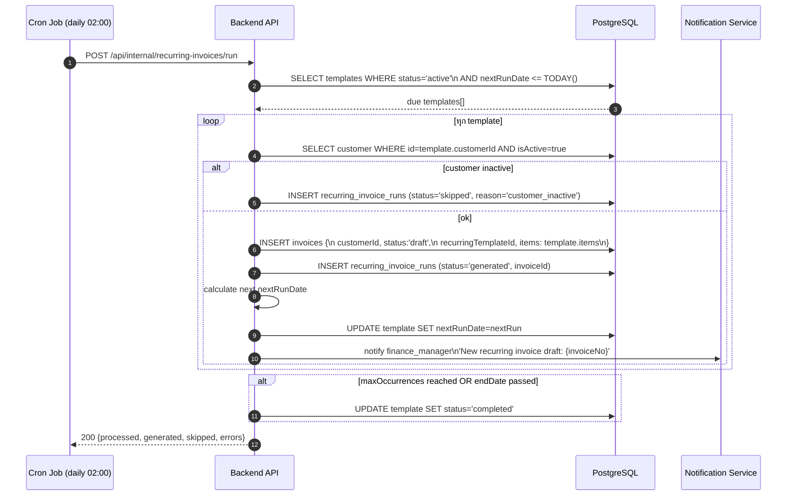

```mermaid
sequenceDiagram
    autonumber
    participant FE as Frontend
    participant BE as Backend API
    participant DB as PostgreSQL

    FE->>BE: GET /api/finance/recurring-invoices?status=active&page=1
    BE->>DB: SELECT rt.id, rt.name, rt.customerId, c.name as customerName,\n  rt.frequency, rt.nextRunDate, rt.status,\n  COUNT(r.id) as totalGenerated,\n  MAX(r.generatedAt) as lastGeneratedAt\n  FROM recurring_invoice_templates rt\n  JOIN customers c ON c.id=rt.customerId\n  LEFT JOIN recurring_invoice_runs r ON r.templateId=rt.id AND r.status='generated'\n  WHERE (rt.status=:status IF provided)\n    AND (rt.customerId=:customerId IF provided)\n  GROUP BY rt.id, c.name\n  ORDER BY rt.nextRunDate ASC\n  LIMIT :limit OFFSET :offset
    DB-->>BE: templates[]
    BE-->>FE: 200 {data: templates[], pagination}
```

# Finance Module - Recurring Invoices

อ้างอิง: `Documents/Requirements/Release_3_Finance_Gaps.md` — Feature R3-02

## API Inventory
- `GET /api/finance/recurring-invoices`
- `POST /api/finance/recurring-invoices`
- `GET /api/finance/recurring-invoices/:id`
- `PATCH /api/finance/recurring-invoices/:id`
- `POST /api/finance/recurring-invoices/:id/pause`
- `POST /api/finance/recurring-invoices/:id/resume`
- `POST /api/finance/recurring-invoices/:id/cancel`
- `GET /api/finance/recurring-invoices/:id/history`
- `POST /api/internal/recurring-invoices/run` ← internal cron only

---

## Endpoint Details

### API: `GET /api/finance/recurring-invoices`

**Purpose**
- ดึงรายการ recurring templates ทั้งหมด

**FE Screen**
- `/finance/recurring-invoices`

**Params**
- Path Params: ไม่มี
- Query Params: `status` (active|paused|cancelled|completed), `customerId`, `page`, `limit`

**Request Headers**
```json
{ "Authorization": "Bearer <access_token>" }
```

**Request Body**
```json
{}
```

**Response Body (200)**
```json
{
  "data": [
    {
      "id": "ri_001",
      "name": "MA Service — บ.ABC",
      "customerId": "cust_001",
      "customerName": "บริษัท ABC จำกัด",
      "frequency": "monthly",
      "nextRunDate": "2026-05-01",
      "status": "active",
      "totalGenerated": 3,
      "lastGeneratedAt": "2026-04-01T02:00:00Z"
    }
  ],
  "pagination": { "page": 1, "limit": 20, "total": 5 }
}
```

**Sequence Diagram**


---

### API: `POST /api/finance/recurring-invoices`

**Purpose**
- สร้าง recurring template ใหม่

**FE Screen**
- `/finance/recurring-invoices/new`

**Params**
- Path Params: ไม่มี
- Query Params: ไม่มี

**Request Headers**
```json
{ "Authorization": "Bearer <access_token>" }
```

**Request Body**
```json
{
  "name": "MA Service — บ.ABC",
  "customerId": "cust_001",
  "frequency": "monthly",
  "startDate": "2026-05-01",
  "endDate": null,
  "maxOccurrences": null,
  "items": [
    {
      "description": "ค่า MA รายเดือน",
      "quantity": 1,
      "unitPrice": 15000,
      "vatRate": 7,
      "whtRate": 3
    }
  ]
}
```

**Response Body (201)**
```json
{
  "data": {
    "id": "ri_001",
    "name": "MA Service — บ.ABC",
    "status": "active",
    "nextRunDate": "2026-05-01"
  },
  "message": "Recurring template created"
}
```

**Sequence Diagram**


---

### API: `GET /api/finance/recurring-invoices/:id`

**Purpose**
- ดู recurring template detail ครบ พร้อม run statistics

**FE Screen**
- `/finance/recurring-invoices/:id`

**Params**
- Path Params: `id`
- Query Params: ไม่มี

**Response Body (200)**
```json
{
  "data": {
    "id": "ri_001",
    "name": "MA Service — บ.ABC",
    "customerId": "cust_001",
    "customerName": "บริษัท ABC จำกัด",
    "frequency": "monthly",
    "startDate": "2026-02-01",
    "endDate": null,
    "maxOccurrences": null,
    "nextRunDate": "2026-05-01",
    "status": "active",
    "totalGenerated": 3,
    "lastGeneratedAt": "2026-04-01T02:00:00Z",
    "items": [
      {
        "description": "ค่า MA รายเดือน",
        "quantity": 1,
        "unitPrice": 15000,
        "vatRate": 7,
        "whtRate": 3
      }
    ]
  }
}
```

**Sequence Diagram**


---

### API: `PATCH /api/finance/recurring-invoices/:id`

**Purpose**
- แก้ไข template (items, frequency, endDate) — มีผลกับ run ถัดไปเท่านั้น

**FE Screen**
- `/finance/recurring-invoices/:id/edit`

**Params**
- Path Params: `id`
- Query Params: ไม่มี

**Request Headers**
```json
{ "Authorization": "Bearer <access_token>" }
```

**Request Body**
```json
{
  "items": [{ "description": "MA Service", "quantity": 1, "unitPrice": 18000 }],
  "endDate": "2026-12-31"
}
```

**Response Body (200)**
```json
{
  "data": { "id": "ri_001", "status": "active" },
  "message": "Template updated"
}
```

**Sequence Diagram**


---

### API: `POST /api/finance/recurring-invoices/:id/pause`

**Purpose**
- หยุด schedule ชั่วคราว — ไม่ generate invoice จนกว่าจะ resume

**FE Screen**
- template detail → button "Pause"

**Request Body** `{}`

**Response Body (200)**
```json
{ "data": { "id": "ri_001", "status": "paused" }, "message": "Template paused" }
```

**Sequence Diagram**


---

### API: `POST /api/finance/recurring-invoices/:id/resume`

**Purpose**
- Resume template ที่ paused — recalculate nextRunDate

**Request Body** `{}`

**Response Body (200)**
```json
{ "data": { "id": "ri_001", "status": "active", "nextRunDate": "2026-05-01" }, "message": "Resumed" }
```

**Sequence Diagram**


---

### API: `POST /api/finance/recurring-invoices/:id/cancel`

**Purpose**
- ยกเลิก template ถาวร — ไม่ generate อีก แต่ invoices ที่ generate แล้วยังคงอยู่

**Request Body** `{}`

**Response Body (200)**
```json
{ "data": { "id": "ri_001", "status": "cancelled" }, "message": "Template cancelled" }
```

**Sequence Diagram**


---

### API: `GET /api/finance/recurring-invoices/:id/history`

**Purpose**
- ดู invoices ที่ generate จาก template นี้ทั้งหมด

**Response Body (200)**
```json
{
  "data": [
    {
      "runId": "run_001",
      "scheduledDate": "2026-04-01",
      "invoiceId": "inv_001",
      "invoiceNo": "INV-2026-030",
      "invoiceStatus": "paid",
      "generatedAt": "2026-04-01T02:00:00Z"
    }
  ]
}
```

**Sequence Diagram**


---

### API: `POST /api/internal/recurring-invoices/run` ← Cron Only

**Purpose**
- Cron job รัน daily เพื่อ generate draft invoices จาก templates ที่ถึงกำหนด

**Auth**
- Internal service key เท่านั้น (ไม่ใช่ Bearer token ของ user)

**Request Body** `{}`

**Response Body (200)**
```json
{
  "data": {
    "processed": 3,
    "generated": 2,
    "skipped": 1,
    "errors": []
  }
}
```

**Sequence Diagram**


---

## Coverage Lock Notes

### Frequency Calculation Rules
| Frequency | Next Run Logic |
|---|---|
| `monthly` | same day next month (cap at last day of month) |
| `quarterly` | same day 3 months forward |
| `annually` | same day 1 year forward |
| `custom` | +customDays days |

### Items Snapshot
- `items` field ใน template เป็น JSONB snapshot — เปลี่ยน template ไม่ย้อนหลัง invoice ที่ generate แล้ว

### Draft Invoice Source Flag
- Invoice ที่ generate จาก recurring ต้องมี field `source: "recurring"` และ `recurringTemplateId`
- FE ใช้ filter `?source=recurring&status=draft` เพื่อแสดง "pending review" list
