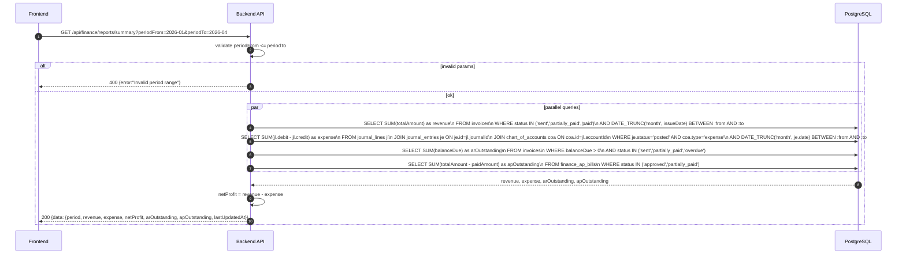
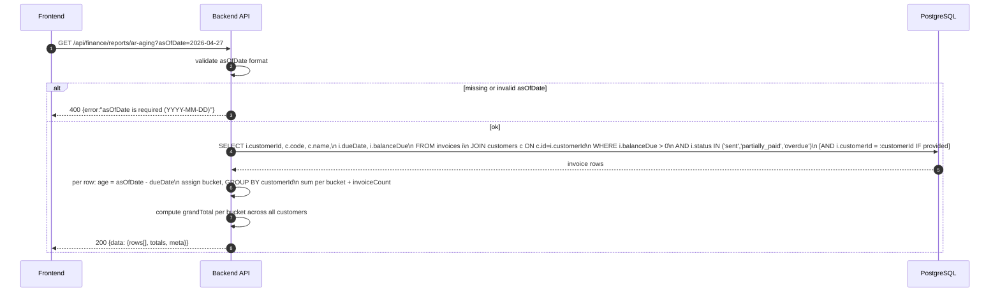
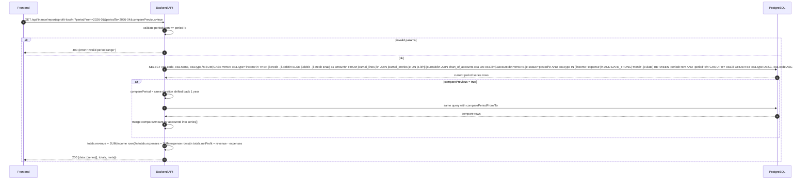
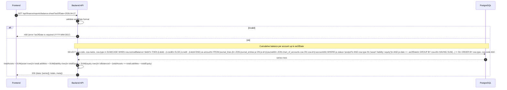
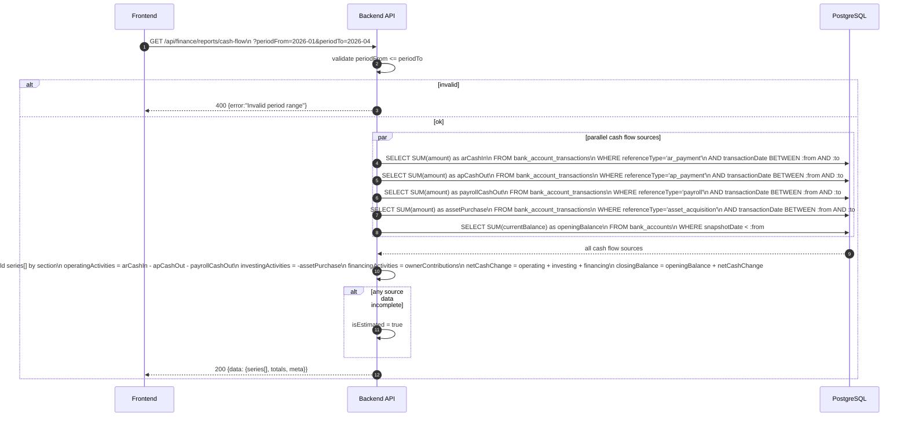

# Finance Module - Reports (Normalized)

อ้างอิง: `Documents/Requirements/Release_1.md` — Feature 1.10, `Documents/Requirements/Release_2.md` — Feature 3.4

## API Inventory
- `GET /api/finance/reports/summary`
- `GET /api/finance/reports/ar-aging`
- `GET /api/finance/reports/profit-loss`
- `GET /api/finance/reports/balance-sheet`
- `GET /api/finance/reports/cash-flow`

---

## Endpoint Details

### API: `GET /api/finance/reports/summary`

**Purpose**
- ภาพรวม KPI การเงิน 5 ตัว: revenue, expense, net profit, AR outstanding, AP outstanding
- Finance team ใช้ดู health check รายเดือน/รายไตรมาส

**FE Screen**
- `/finance/reports` — Summary cards

**Params**
- Query Params: `periodFrom` (YYYY-MM, required), `periodTo` (YYYY-MM, required)

**Response Body (200)**
```json
{
  "data": {
    "period": { "from": "2026-01", "to": "2026-04" },
    "revenue": 850000,
    "expense": 420000,
    "netProfit": 430000,
    "arOutstanding": 280000,
    "apOutstanding": 95000,
    "lastUpdatedAt": "2026-04-27T08:00:00Z"
  }
}
```

**Sequence Diagram**


---

### API: `GET /api/finance/reports/ar-aging`

**Purpose**
- รายงานอายุลูกหนี้ — aggregate invoices ที่ยังค้างชำระ จัดกลุ่มต่อลูกค้า แบ่งเป็น 4 bucket ตามอายุหนี้นับจาก `asOfDate`
- Bucket logic: `age = asOfDate − dueDate` (วัน) → 0–30 / 31–60 / 61–90 / 90+

**FE Screen**
- `/finance/reports/ar-aging`

**Params**
- Query Params: `asOfDate` (YYYY-MM-DD, required), `customerId` (UUID, optional)

**Response Body (200)**
```json
{
  "data": {
    "rows": [
      {
        "customerId": "cust_001",
        "customerCode": "CUST-001",
        "customerName": "บริษัท ตัวอย่าง จำกัด",
        "bucket0_30": 50000,
        "bucket31_60": 12000,
        "bucket61_90": 0,
        "bucket90plus": 8000,
        "total": 70000,
        "invoiceCount": 3
      }
    ],
    "totals": {
      "bucket0_30": 50000,
      "bucket31_60": 47000,
      "bucket61_90": 20000,
      "bucket90plus": 8000,
      "grandTotal": 125000
    },
    "meta": {
      "asOfDate": "2026-04-27",
      "generatedAt": "2026-04-27T09:00:00Z",
      "disclaimer": null
    }
  }
}
```

**Sequence Diagram**


---

### API: `GET /api/finance/reports/profit-loss`

**Purpose**
- งบกำไรขาดทุน (P&L): revenue − expenses = net profit ต่อ period
- รองรับ comparison กับ period ก่อนหน้า (`comparePrevious=true`)

**FE Screen**
- `/finance/reports/profit-loss`

**Params**
- Query Params: `periodFrom` (YYYY-MM, required), `periodTo` (YYYY-MM, required), `comparePrevious` (boolean, default false)

**Response Body (200)**
```json
{
  "data": {
    "series": [
      {
        "section": "revenue",
        "accountCode": "4001",
        "accountName": "Service Revenue",
        "amount": 850000,
        "compareAmount": 810000
      },
      {
        "section": "expense",
        "accountCode": "5001",
        "accountName": "Salary Expense",
        "amount": 320000,
        "compareAmount": 300000
      }
    ],
    "totals": {
      "revenue": 850000,
      "expenses": 405000,
      "netProfit": 445000
    },
    "meta": {
      "periodFrom": "2026-01",
      "periodTo": "2026-04",
      "comparePrevious": true,
      "comparePeriodFrom": "2025-01",
      "comparePeriodTo": "2025-04",
      "lastUpdatedAt": "2026-04-30T18:00:00Z",
      "isEstimated": false,
      "disclaimer": null
    }
  }
}
```

**Sequence Diagram**


---

### API: `GET /api/finance/reports/balance-sheet`

**Purpose**
- งบดุล (Balance Sheet): สินทรัพย์ = หนี้สิน + ส่วนของผู้ถือหุ้น ณ วันที่ระบุ (point-in-time cumulative)

**FE Screen**
- `/finance/reports/balance-sheet`

**Params**
- Query Params: `asOfDate` (YYYY-MM-DD, required)

**Response Body (200)**
```json
{
  "data": {
    "series": [
      { "section": "asset", "accountCode": "1100", "accountName": "Cash at Bank", "amount": 1250000 },
      { "section": "asset", "accountCode": "1200", "accountName": "Accounts Receivable", "amount": 280000 },
      { "section": "liability", "accountCode": "2100", "accountName": "Accounts Payable", "amount": 95000 },
      { "section": "equity", "accountCode": "3000", "accountName": "Retained Earnings", "amount": 1435000 }
    ],
    "totals": {
      "totalAssets": 1530000,
      "totalLiabilities": 95000,
      "totalEquity": 1435000,
      "isBalanced": true
    },
    "meta": {
      "asOfDate": "2026-04-27",
      "lastUpdatedAt": "2026-04-27T18:00:00Z",
      "isEstimated": false,
      "disclaimer": null
    }
  }
}
```

**Sequence Diagram**


---

### API: `GET /api/finance/reports/cash-flow`

**Purpose**
- งบกระแสเงินสด (Cash Flow Statement): เงินสดต้นงวด + in/out = เงินสดปลายงวด
- แบ่ง 3 sections: Operating / Investing / Financing activities

**FE Screen**
- `/finance/reports/cash-flow`

**Params**
- Query Params: `periodFrom` (YYYY-MM, required), `periodTo` (YYYY-MM, required)

**Response Body (200)**
```json
{
  "data": {
    "series": [
      { "section": "operating", "description": "Cash received from customers (AR)", "amount": 820000 },
      { "section": "operating", "description": "Cash paid to suppliers (AP)", "amount": -380000 },
      { "section": "operating", "description": "Cash paid for payroll", "amount": -320000 },
      { "section": "investing", "description": "Purchase of fixed assets", "amount": -85000 },
      { "section": "financing", "description": "Owner capital contribution", "amount": 0 }
    ],
    "totals": {
      "openingBalance": 950000,
      "operatingActivities": 120000,
      "investingActivities": -85000,
      "financingActivities": 0,
      "netCashChange": 35000,
      "closingBalance": 985000
    },
    "meta": {
      "periodFrom": "2026-01",
      "periodTo": "2026-04",
      "lastUpdatedAt": "2026-04-30T18:00:00Z",
      "isEstimated": false,
      "disclaimer": null
    }
  }
}
```

**Sequence Diagram**


---

## Coverage Lock Notes

### Response Envelope Standard
- ทุก financial statement ใช้ envelope เดียวกัน: `data.series[]`, `data.totals`, `data.meta`
- FE bind จาก response โดยตรง — ไม่คำนวณ totals เอง
- `isEstimated: true` เมื่อ posting pipeline ยังไม่ครบ (payroll ยังไม่ post เข้า GL)

### Data Sources
| Statement | Source |
|---|---|
| P&L | `journal_lines` JOIN `journal_entries` (status=posted) GROUP BY account (income/expense) |
| Balance Sheet | Cumulative `journal_lines` up to `asOfDate` per account (asset/liability/equity) |
| Cash Flow | `bank_account_transactions` grouped by `referenceType` |
| Summary | Mixed: invoices, finance_ap_bills, journal_lines aggregate |

### isEstimated Flag
- `isEstimated: true` เมื่อ: payroll ยังไม่ post, มี journal ที่ยังเป็น draft, หรือ period ยังไม่ close

### Summary vs Statements
- `reports/summary` = R1 KPI dashboard (5 KPIs, fast read)
- `reports/profit-loss`, `balance-sheet`, `cash-flow` = R2 full financial statements (GL-level detail)
- FE ชั่วคราว (monthly chart): อนุญาต FE เรียก `summary` ซ้ำทีละเดือน จนกว่า BE จะเพิ่ม `monthlySeries`
