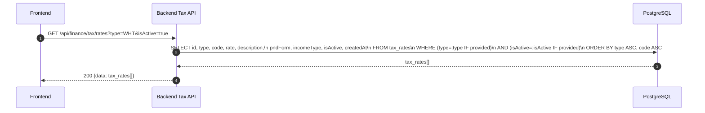
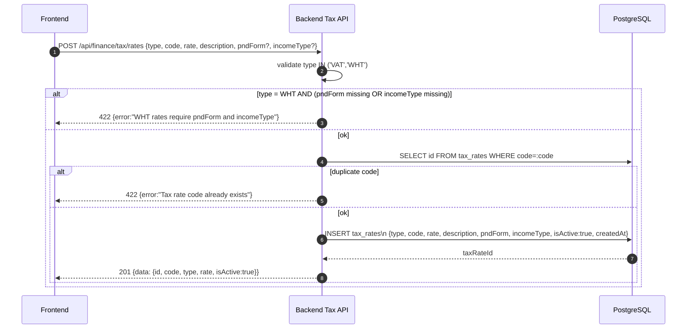
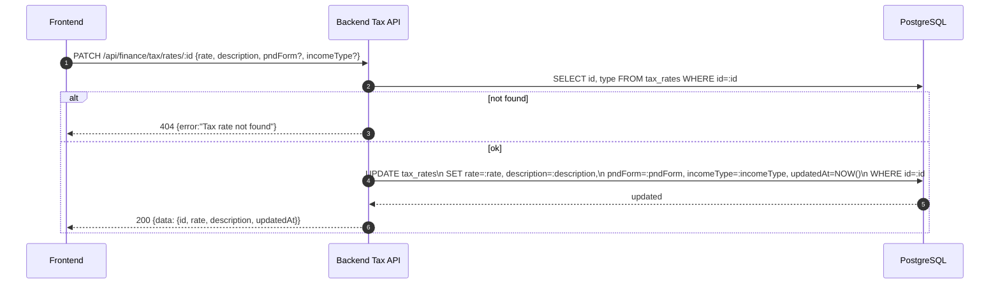
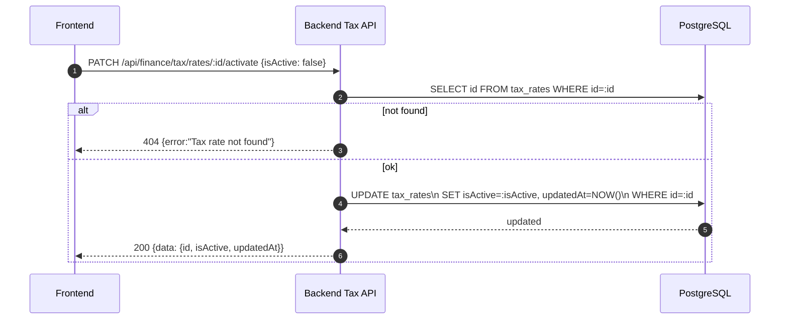
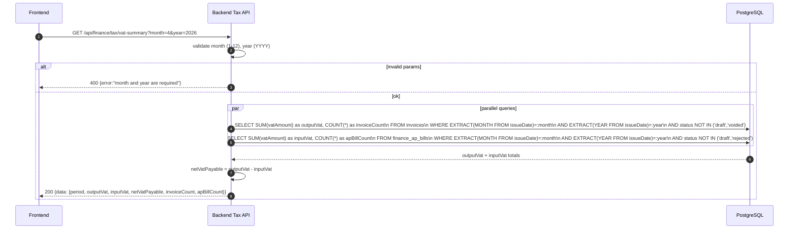
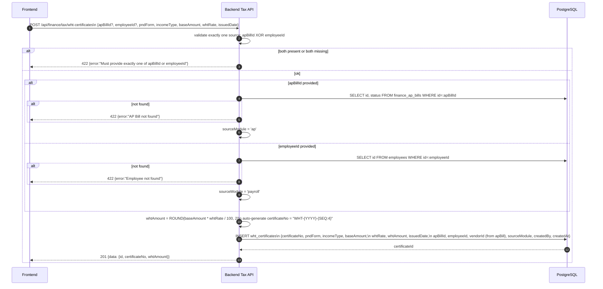
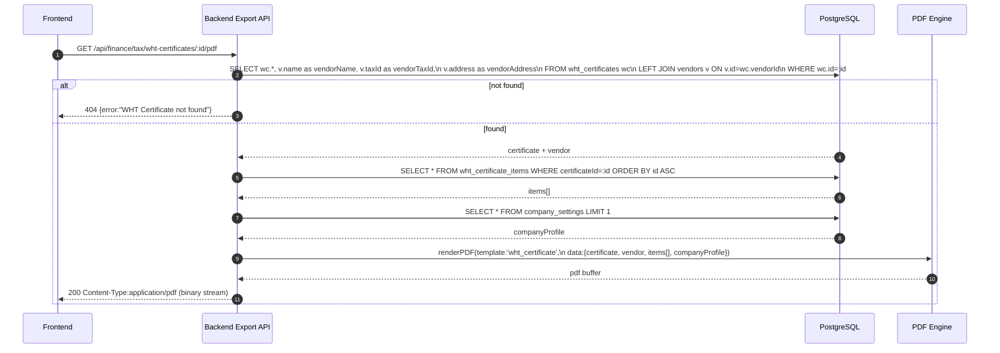
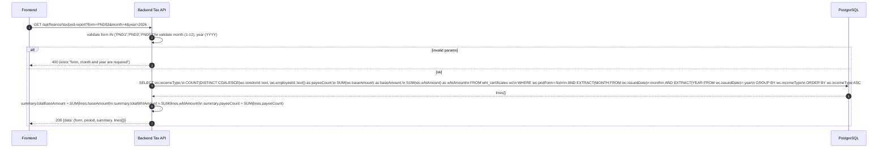
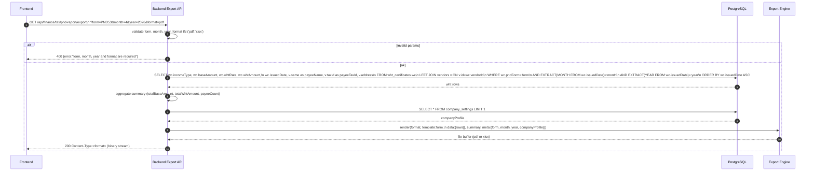

```mermaid
sequenceDiagram
    autonumber
    participant FE as Frontend
    participant BE as Backend Tax API
    participant DB as PostgreSQL

    FE->>BE: GET /api/finance/tax/wht-certificates?pndForm=PND53&month=4&year=2026
    BE->>DB: SELECT wc.id, wc.certificateNo, wc.pndForm, wc.incomeType,\n  wc.baseAmount, wc.whtRate, wc.whtAmount, wc.issuedDate,\n  wc.vendorId, v.name as vendorName, wc.apBillId, wc.employeeId\n  FROM wht_certificates wc\n  LEFT JOIN vendors v ON v.id=wc.vendorId\n  WHERE (wc.pndForm=:pndForm IF provided)\n    AND (EXTRACT(MONTH FROM wc.issuedDate)=:month IF provided)\n    AND (EXTRACT(YEAR FROM wc.issuedDate)=:year IF provided)\n    AND (wc.sourceModule=:sourceModule IF provided)\n  ORDER BY wc.issuedDate DESC\n  LIMIT :limit OFFSET :offset
    DB-->>BE: certificates[] + total count
    BE-->>FE: 200 {data: certificates[], meta: {page, limit, total}}
```

# Finance Module - Tax (Normalized)

อ้างอิง: `Documents/Release_2.md`

## API Inventory
- `GET /api/finance/tax/rates`
- `POST /api/finance/tax/rates`
- `PATCH /api/finance/tax/rates/:id`
- `PATCH /api/finance/tax/rates/:id/activate`
- `GET /api/finance/tax/vat-summary`
- `GET /api/finance/tax/wht-certificates`
- `POST /api/finance/tax/wht-certificates`
- `GET /api/finance/tax/wht-certificates/:id/pdf`
- `GET /api/finance/tax/pnd-report`
- `GET /api/finance/tax/pnd-report/export`

## Endpoint Details

### API: `GET /api/finance/tax/rates`

**Purpose**
- ดึงรายการอัตราภาษี VAT/WHT สำหรับ pickers ใน invoice/AP Bill forms

**FE Screen**
- `/finance/tax`

**Params**
- Path Params: ไม่มี
- Query Params: `type` (VAT|WHT, optional), `isActive` (boolean, optional)

**Request Headers**
```json
{ "Authorization": "Bearer <access_token>" }
```

**Request Body**
```json
{}
```

**Response Body (200)**
```json
{
  "data": [
    {
      "id": "tax_001",
      "type": "VAT",
      "code": "VAT7",
      "rate": 7,
      "description": "ภาษีมูลค่าเพิ่ม 7%",
      "pndForm": null,
      "incomeType": null,
      "isActive": true,
      "createdAt": "2026-01-01T00:00:00Z"
    },
    {
      "id": "tax_002",
      "type": "WHT",
      "code": "WHT3_SERVICE",
      "rate": 3,
      "description": "หัก ณ ที่จ่าย 3% (บริการ)",
      "pndForm": "PND53",
      "incomeType": "40(8)",
      "isActive": true,
      "createdAt": "2026-01-01T00:00:00Z"
    }
  ]
}
```

**Sequence Diagram**


---

### API: `POST /api/finance/tax/rates`

**Purpose**
- สร้างอัตราภาษีใหม่ — WHT ต้องมี pndForm และ incomeType

**FE Screen**
- `/finance/tax` → Tax Rate form

**Params**
- Path Params: ไม่มี
- Query Params: ไม่มี

**Request Headers**
```json
{ "Authorization": "Bearer <access_token>" }
```

**Request Body**
```json
{
  "type": "WHT",
  "code": "WHT3_SERVICE",
  "rate": 3,
  "description": "หัก ณ ที่จ่าย 3% (บริการ)",
  "pndForm": "PND53",
  "incomeType": "40(8)"
}
```

**Response Body (201)**
```json
{
  "data": {
    "id": "tax_001",
    "code": "WHT3_SERVICE",
    "type": "WHT",
    "rate": 3,
    "isActive": true
  },
  "message": "Tax rate created"
}
```

**Sequence Diagram**


---

### API: `PATCH /api/finance/tax/rates/:id`

**Purpose**
- แก้ไขอัตราภาษี — ไม่ย้อนกลับไปแก้ค่าที่ถูก snapshot ในเอกสารเดิม

**FE Screen**
- `/finance/tax` → Tax Rate edit form

**Params**
- Path Params: `id` (string, required)
- Query Params: ไม่มี

**Request Headers**
```json
{ "Authorization": "Bearer <access_token>" }
```

**Request Body**
```json
{ "rate": 5, "description": "อัปเดตอัตรา" }
```

**Response Body (200)**
```json
{
  "data": { "id": "tax_001", "rate": 5, "description": "อัปเดตอัตรา", "updatedAt": "2026-04-27T10:00:00Z" },
  "message": "Tax rate updated"
}
```

**Sequence Diagram**


---

### API: `PATCH /api/finance/tax/rates/:id/activate`

**Purpose**
- เปิด/ปิดใช้งานอัตราภาษี — deactivate ไม่กระทบ snapshot ในเอกสารเดิม

**FE Screen**
- `/finance/tax` → toggle active

**Params**
- Path Params: `id` (string, required)
- Query Params: ไม่มี

**Request Headers**
```json
{ "Authorization": "Bearer <access_token>" }
```

**Request Body**
```json
{ "isActive": false }
```

**Response Body (200)**
```json
{
  "data": { "id": "tax_001", "isActive": false, "updatedAt": "2026-04-27T10:00:00Z" },
  "message": "Tax rate deactivated"
}
```

**Sequence Diagram**


---

### API: `GET /api/finance/tax/vat-summary`

**Purpose**
- สรุป VAT input/output รายเดือน — คำนวณจาก snapshot vatAmount ในเอกสาร

**FE Screen**
- `/finance/tax/vat-report`

**Params**
- Path Params: ไม่มี
- Query Params: `month` *(required, 1-12)*, `year` *(required, YYYY)*

**Request Headers**
```json
{ "Authorization": "Bearer <access_token>" }
```

**Request Body**
```json
{}
```

**Response Body (200)**
```json
{
  "data": {
    "period": { "month": 4, "year": 2026 },
    "outputVat": 52500,
    "inputVat": 21000,
    "netVatPayable": 31500,
    "invoiceCount": 12,
    "apBillCount": 8
  }
}
```

**Sequence Diagram**


---

### API: `GET /api/finance/tax/wht-certificates`

**Purpose**
- ดึงรายการใบรับรองการหักภาษี ณ ที่จ่าย พร้อม filter ตาม pndForm/month/year

**FE Screen**
- `/finance/tax/wht`

**Params**
- Path Params: ไม่มี
- Query Params: `page`, `limit`, `pndForm` (PND1|PND3|PND53, optional), `month` (optional), `year` (optional), `sourceModule` (ap|payroll, optional)

**Request Headers**
```json
{ "Authorization": "Bearer <access_token>" }
```

**Request Body**
```json
{}
```

**Response Body (200)**
```json
{
  "data": [
    {
      "id": "wht_001",
      "certificateNo": "WHT-2026-0001",
      "pndForm": "PND53",
      "incomeType": "40(8)",
      "baseAmount": 100000,
      "whtRate": 3,
      "whtAmount": 3000,
      "issuedDate": "2026-04-30",
      "vendorId": "ven_001",
      "vendorName": "บ.XYZ ซัพพลาย จำกัด",
      "apBillId": "apb_001",
      "employeeId": null
    }
  ],
  "meta": { "page": 1, "limit": 20, "total": 5 }
}
```

**Sequence Diagram**


---

### API: `POST /api/finance/tax/wht-certificates`

**Purpose**
- ออกใบรับรองหักภาษี ณ ที่จ่าย — รองรับทั้ง AP-origin และ payroll-origin

**FE Screen**
- `/finance/tax/wht` → ปุ่ม "ออกใบรับรอง"

**Params**
- Path Params: ไม่มี
- Query Params: ไม่มี

**Request Headers**
```json
{ "Authorization": "Bearer <access_token>" }
```

**Request Body**
```json
{
  "apBillId": "apb_001",
  "employeeId": null,
  "pndForm": "PND53",
  "incomeType": "40(8)",
  "baseAmount": 100000,
  "whtRate": 3,
  "issuedDate": "2026-04-30"
}
```

**Response Body (201)**
```json
{
  "data": {
    "id": "wht_001",
    "certificateNo": "WHT-2026-0001",
    "whtAmount": 3000
  },
  "message": "WHT Certificate created"
}
```

**Sequence Diagram**


---

### API: `GET /api/finance/tax/wht-certificates/:id/pdf`

**Purpose**
- ดาวน์โหลด PDF ใบรับรองการหักภาษี ณ ที่จ่าย — synchronous inline download

**FE Screen**
- `/finance/tax/wht` → row → ปุ่ม "ดาวน์โหลด"

**Params**
- Path Params: `id` (string, required)
- Query Params: ไม่มี

**Request Headers**
```json
{ "Authorization": "Bearer <access_token>" }
```

**Request Body**
```json
{}
```

**Response Body (200)**
```
Content-Type: application/pdf
Content-Disposition: attachment; filename="wht-certificate-{certificateNo}.pdf"

<binary pdf stream>
```

**Sequence Diagram**


---

### API: `GET /api/finance/tax/pnd-report`

**Purpose**
- ดึงรายงาน PND ตามแบบฟอร์ม/เดือน/ปี — aggregated view สำหรับ FE render

**FE Screen**
- `/finance/tax/wht` → PND Report tab

**Params**
- Path Params: ไม่มี
- Query Params: `form` *(required: PND1|PND3|PND53)*, `month` *(required, 1-12)*, `year` *(required, YYYY)*

**Request Headers**
```json
{ "Authorization": "Bearer <access_token>" }
```

**Request Body**
```json
{}
```

**Response Body (200)**
```json
{
  "data": {
    "form": "PND53",
    "period": { "month": 4, "year": 2026 },
    "summary": {
      "totalBaseAmount": 350000,
      "totalWhtAmount": 10500,
      "payeeCount": 4
    },
    "lines": [
      {
        "incomeType": "40(8)",
        "payeeCount": 3,
        "baseAmount": 300000,
        "whtAmount": 9000
      },
      {
        "incomeType": "40(2)",
        "payeeCount": 1,
        "baseAmount": 50000,
        "whtAmount": 1500
      }
    ]
  }
}
```

**Sequence Diagram**


---

### API: `GET /api/finance/tax/pnd-report/export`

**Purpose**
- Export รายงาน PND เป็น PDF/XLSX — synchronous inline download

**FE Screen**
- `/finance/tax/wht` → ปุ่ม "Export PND"

**Params**
- Path Params: ไม่มี
- Query Params: `form` *(required: PND1|PND3|PND53)*, `month` *(required, 1-12)*, `year` *(required, YYYY)*, `format` *(required: pdf|xlsx)*

**Request Headers**
```json
{ "Authorization": "Bearer <access_token>" }
```

**Request Body**
```json
{}
```

**Response Body (200) — format=pdf**
```
Content-Type: application/pdf
Content-Disposition: attachment; filename="pnd-report-{form}-{year}-{month}.pdf"

<binary pdf stream>
```

**Response Body (200) — format=xlsx**
```
Content-Type: application/vnd.openxmlformats-officedocument.spreadsheetml.sheet
Content-Disposition: attachment; filename="pnd-report-{form}-{year}-{month}.xlsx"

<binary xlsx stream>
```

**Sequence Diagram**


---

## Coverage Lock Addendum (2026-04-16)

### Contract Usage Note
- endpoint examples ด้านบนเป็น baseline inventory; ถ้ารายละเอียด field, report rows หรือ cross-module source ยังไม่ชัด ให้ยึด addendum นี้เป็น authoritative contract

### Tax rate master contracts
- `GET /api/finance/tax/rates` query ที่ล็อกคือ `type?`, `isActive?`
- rate item อย่างน้อยต้องมี `id`, `type`, `code`, `rate`, `description`, `pndForm?`, `incomeType?`, `isActive`, `createdAt`
- `POST /api/finance/tax/rates` และ `PATCH /api/finance/tax/rates/:id` body ที่ล็อกคือ `type`, `code`, `rate`, `description`, `pndForm?`, `incomeType?`
- เมื่อ `type = 'WHT'` ต้องมี `pndForm` และ `incomeType`; เมื่อ `type = 'VAT'` ให้ omit หรือคืน `null` อย่างคงเส้นคงวา
- `PATCH /api/finance/tax/rates/:id/activate` body ใช้ `{ "isActive": boolean }`
- การ deactivate tax rate ห้ามย้อนกลับไปแก้ค่า VAT/WHT ที่ถูก snapshot อยู่ใน invoice, AP bill หรือ certificate เดิม

### VAT summary contract
- `GET /api/finance/tax/vat-summary` query ที่ล็อกคือ `month`, `year`
- response ต้องคืน `data.period`, `outputVat`, `inputVat`, `netVatPayable`, `invoiceCount`, `apBillCount`
- ตัวเลข VAT summary ต้องคำนวณจากเอกสารที่ snapshot ค่าภาษีแล้ว (`subtotalBeforeVat`, `vatRate`, `vatAmount`) ไม่ใช่ re-read จาก tax master ย้อนหลัง
- `GET /api/finance/tax/vat-summary/export` ใช้ query เดียวกันและเพิ่ม `format`; baseline ปัจจุบันคือ synchronous inline download และถ้าเปลี่ยนเป็น async job ภายหลังให้ยึด contract กลางใน `Documents/SD_Flow/Finance/document_exports.md`

### WHT certificate contracts
- `GET /api/finance/tax/wht-certificates` query ที่ล็อกคือ `page`, `limit`, `pndForm?`, `month?`, `year?`, `sourceModule?`
- certificate row อย่างน้อยต้องมี `id`, `certificateNo`, `pndForm`, `incomeType`, `baseAmount`, `whtRate`, `whtAmount`, `issuedDate`, `apBillId?`, `vendorId?`, `employeeId?`
- `POST /api/finance/tax/wht-certificates` ต้องรองรับทั้ง AP-origin และ payroll-origin WHT
- create body ที่ล็อกคือ `apBillId?`, `employeeId?`, `pndForm`, `incomeType`, `baseAmount`, `whtRate`, `issuedDate`
- create validation: ต้องมี exactly one source ระหว่าง `apBillId` หรือ `employeeId`; `whtAmount` เป็น server-computed จาก `baseAmount x whtRate / 100`
- `GET /api/finance/tax/wht-certificates/:id/pdf` เป็น synchronous inline PDF response ของ certificate ที่ถูกสร้างแล้ว

### PND report / export contracts
- `GET /api/finance/tax/pnd-report` query ที่ล็อกคือ `form`, `month`, `year`
- report response ต้องมี `data.form`, `data.period`, `summary`, `lines[]`
- `lines[]` อย่างน้อยต้องมี `incomeType`, `payeeCount`, `baseAmount`, `whtAmount`
- `GET /api/finance/tax/pnd-report/export` ใช้ query เดียวกับ report และเพิ่ม `format`
- current baseline ของ PND export คือ synchronous inline download; ถ้า endpoint ใดถูกย้ายเป็น async job ภายหลัง ต้องทำตาม contract กลางใน `Documents/SD_Flow/Finance/document_exports.md`

### Cross-module source rules
- AP-origin WHT ใช้ `apBillId` / `vendorId` เป็น payee context สำหรับ `PND3` / `PND53`
- payroll-origin WHT ใช้ `employeeId` เป็น payee context สำหรับ `PND1`
- ถ้าต้องกรอง payroll-origin โดยตรง ให้ใช้ `sourceModule=payroll`; ถ้าระบบปลายทางยังไม่รองรับ ให้ fallback ด้วย `pndForm=PND1` + period
- tax rate pickers ใน invoice / AP flows ต้องใช้ active rates ผ่าน `GET /api/finance/tax/rates?isActive=true`
