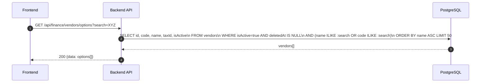
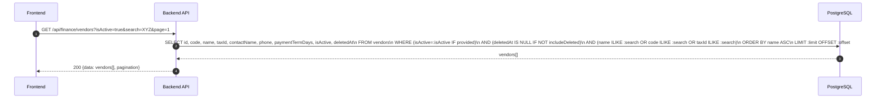
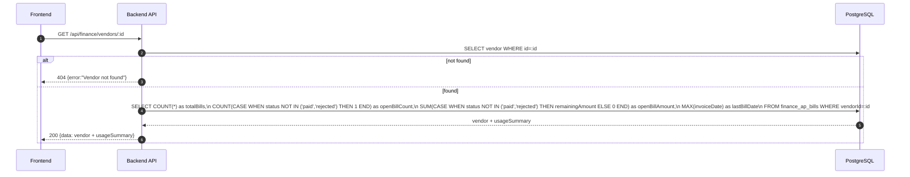
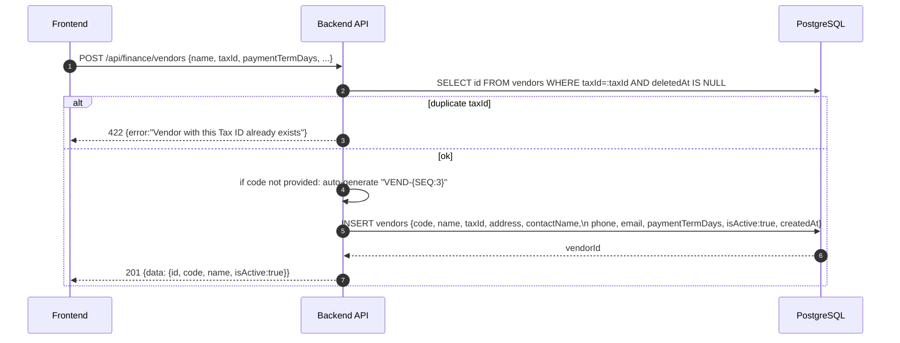
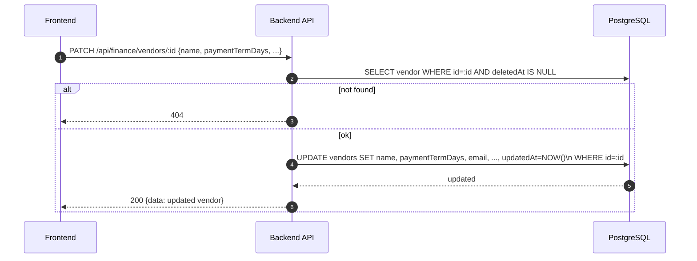
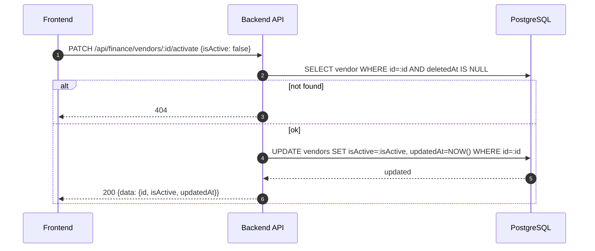
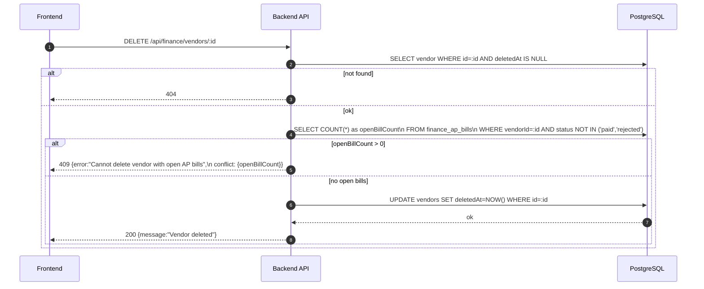

# Finance Module - Vendors (Normalized)

อ้างอิง: `Documents/Requirements/Release_1.md` — Feature 1.7

## API Inventory
- `GET /api/finance/vendors/options`
- `GET /api/finance/vendors`
- `GET /api/finance/vendors/:id`
- `POST /api/finance/vendors`
- `PATCH /api/finance/vendors/:id`
- `PATCH /api/finance/vendors/:id/activate`
- `DELETE /api/finance/vendors/:id`

---

## Endpoint Details

### API: `GET /api/finance/vendors/options`

**Purpose**
- Dropdown list สำหรับ AP Bill form — active vendors only

**FE Screen**
- AP Bill create form → vendor dropdown

**Params**
- Query Params: `search` (name/code)

**Response Body (200)**
```json
{
  "data": [
    {
      "id": "ven_001",
      "code": "VEND-001",
      "name": "บ.XYZ ซัพพลาย จำกัด",
      "taxId": "0105550000001",
      "isActive": true
    }
  ]
}
```

**Sequence Diagram**


---

### API: `GET /api/finance/vendors`

**Purpose**
- ดึงรายการ vendors ทั้งหมด พร้อม filter isActive, search, includeDeleted

**FE Screen**
- `/finance/vendors`

**Params**
- Query Params: `search` (name/code/taxId), `isActive` (boolean), `includeDeleted` (boolean, default false), `page`, `limit`

**Response Body (200)**
```json
{
  "data": [
    {
      "id": "ven_001",
      "code": "VEND-001",
      "name": "บ.XYZ ซัพพลาย จำกัด",
      "taxId": "0105550000001",
      "contactName": "คุณ ค",
      "phone": "02-987-6543",
      "paymentTermDays": 30,
      "isActive": true,
      "deletedAt": null
    }
  ],
  "pagination": { "page": 1, "limit": 20, "total": 18 }
}
```

**Sequence Diagram**


---

### API: `GET /api/finance/vendors/:id`

**Purpose**
- ดู vendor detail ครบ + usageSummary (AP bills count/total)

**FE Screen**
- `/finance/vendors/:id`

**Response Body (200)**
```json
{
  "data": {
    "id": "ven_001",
    "code": "VEND-001",
    "name": "บ.XYZ ซัพพลาย จำกัด",
    "taxId": "0105550000001",
    "address": "789 ถ.พระราม 4 กรุงเทพฯ",
    "contactName": "คุณ ค",
    "phone": "02-987-6543",
    "email": "sales@xyz.com",
    "paymentTermDays": 30,
    "isActive": true,
    "deletedAt": null,
    "usageSummary": {
      "totalBills": 8,
      "openBillCount": 2,
      "openBillAmount": 45000,
      "lastBillDate": "2026-04-05"
    }
  }
}
```

**Sequence Diagram**


---

### API: `POST /api/finance/vendors`

**Purpose**
- สร้าง vendor ใหม่ — auto-generate `code` ถ้าไม่ระบุ, ตรวจ duplicate taxId

**FE Screen**
- `/finance/vendors/new` หรือ inline create ใน AP Bill form

**Request Body**
```json
{
  "code": "VEND-019",
  "name": "บ.XYZ ซัพพลาย จำกัด",
  "taxId": "0105550000001",
  "address": "789 ถ.พระราม 4 กรุงเทพฯ",
  "contactName": "คุณ ค",
  "phone": "02-987-6543",
  "email": "sales@xyz.com",
  "paymentTermDays": 30
}
```

**Response Body (201)**
```json
{
  "data": { "id": "ven_001", "code": "VEND-019", "name": "บ.XYZ ซัพพลาย จำกัด", "isActive": true },
  "message": "Vendor created"
}
```

**Sequence Diagram**


---

### API: `PATCH /api/finance/vendors/:id`

**Purpose**
- แก้ไขข้อมูล vendor — code ไม่เปลี่ยน

**Request Body**
```json
{
  "name": "บ.XYZ ซัพพลาย (ไทย) จำกัด",
  "paymentTermDays": 45,
  "email": "procurement@xyz.co.th"
}
```

**Response Body (200)**
```json
{
  "data": { "id": "ven_001", "name": "บ.XYZ ซัพพลาย (ไทย) จำกัด", "isActive": true },
  "message": "Vendor updated"
}
```

**Sequence Diagram**


---

### API: `PATCH /api/finance/vendors/:id/activate`

**Purpose**
- Toggle isActive: deactivate ซ่อนจาก options dropdown

**Request Body**
```json
{ "isActive": false }
```

**Response Body (200)**
```json
{
  "data": { "id": "ven_001", "isActive": false, "updatedAt": "2026-04-27T10:00:00Z" },
  "message": "Vendor deactivated"
}
```

**Sequence Diagram**


---

### API: `DELETE /api/finance/vendors/:id`

**Purpose**
- Soft delete vendor — บล็อกถ้ามี open AP bills

**Response Body (200)**
```json
{ "message": "Vendor deleted" }
```

**Sequence Diagram**


---

## Coverage Lock Notes

### code Auto-generation
- Format: `VEND-{3-digit seq}` เช่น `VEND-001`

### Duplicate taxId Guard
- taxId ต้อง unique ต่อ non-deleted vendors → 422

### Soft Delete Guard
- ลบได้เฉพาะ vendors ที่ไม่มี open AP bills (status ≠ paid/rejected)
- 409 conflict response ต้องมี `openBillCount`

### Visibility Rules
- inactive vendor ไม่แสดงใน `/options` แต่แสดงใน list/detail ได้
- soft-deleted ไม่แสดงใน list default — ต้องใช้ `includeDeleted=true`

### Inline Create (AP Bill form)
- AP Bill form รองรับ inline create vendor → response ต้องคืน `{id, code, name, isActive}` เพื่อ FE inject เข้า dropdown ทันที
