# HR Module - Attendance & Overtime (Normalized)

อ้างอิง: `Documents/Release_2.md`

## API Inventory
- `GET /api/hr/work-schedules`
- `POST /api/hr/work-schedules`
- `GET /api/hr/work-schedules/:id`
- `PATCH /api/hr/work-schedules/:id`
- `POST /api/hr/work-schedules/:id/assign`
- `GET /api/hr/attendance`
- `POST /api/hr/attendance/check-in`
- `PATCH /api/hr/attendance/:id/check-out`
- `GET /api/hr/attendance/summary`
- `GET /api/hr/overtime`
- `POST /api/hr/overtime`
- `GET /api/hr/overtime/:id`
- `PATCH /api/hr/overtime/:id/approve`
- `PATCH /api/hr/overtime/:id/reject`
- `GET /api/hr/holidays`
- `POST /api/hr/holidays`
- `DELETE /api/hr/holidays/:id`

## Endpoint Details

### API: `GET /api/hr/work-schedules`

**Purpose**
- ดึงข้อมูล สำหรับ `GET /api/hr/work-schedules`

**FE Screen**
- อ้างอิงตามโมดูลของไฟล์นี้

**Params**
- Path Params: ไม่มี
- Query Params: รองรับตาม requirement ของ endpoint (pagination/filter/date range ถ้ามี)

**Request Headers**
```json
{
  "Authorization": "Bearer <access_token>"
}
```

**Request Body**
```json
{}
```

**Response Body (200)**
```json
{
  "data": {}
}
```

**Sequence Diagram**
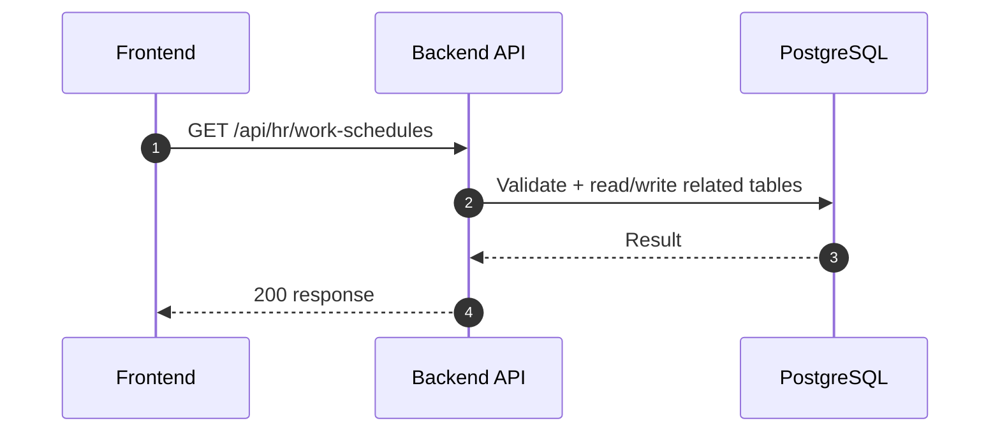

### API: `POST /api/hr/work-schedules`

**Purpose**
- สร้าง/ดำเนินการ สำหรับ `POST /api/hr/work-schedules`

**FE Screen**
- อ้างอิงตามโมดูลของไฟล์นี้

**Params**
- Path Params: ไม่มี
- Query Params: รองรับตาม requirement ของ endpoint (pagination/filter/date range ถ้ามี)

**Request Headers**
```json
{
  "Authorization": "Bearer <access_token>"
}
```

**Request Body**
```json
{}
```

**Response Body (201)**
```json
{
  "data": {},
  "message": "Success"
}
```

**Sequence Diagram**
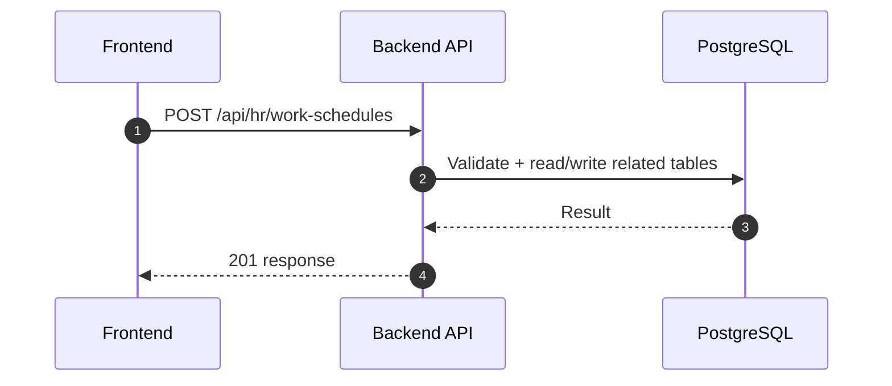

### API: `GET /api/hr/work-schedules/:id`

**Purpose**
- ดึงข้อมูล สำหรับ `GET /api/hr/work-schedules/:id`

**FE Screen**
- อ้างอิงตามโมดูลของไฟล์นี้

**Params**
- Path Params: มี (`id`/ตัวแปร path ตาม endpoint)
- Query Params: รองรับตาม requirement ของ endpoint (pagination/filter/date range ถ้ามี)

**Request Headers**
```json
{
  "Authorization": "Bearer <access_token>"
}
```

**Request Body**
```json
{}
```

**Response Body (200)**
```json
{
  "data": {}
}
```

**Sequence Diagram**
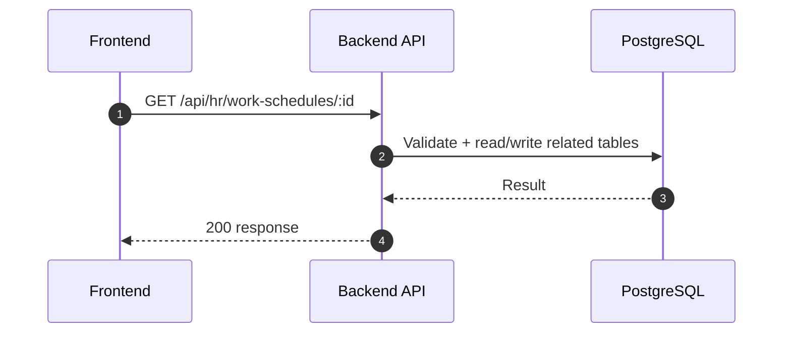

### API: `PATCH /api/hr/work-schedules/:id`

**Purpose**
- อัปเดตบางส่วน สำหรับ `PATCH /api/hr/work-schedules/:id`

**FE Screen**
- อ้างอิงตามโมดูลของไฟล์นี้

**Params**
- Path Params: มี (`id`/ตัวแปร path ตาม endpoint)
- Query Params: รองรับตาม requirement ของ endpoint (pagination/filter/date range ถ้ามี)

**Request Headers**
```json
{
  "Authorization": "Bearer <access_token>"
}
```

**Request Body**
```json
{}
```

**Response Body (200)**
```json
{
  "data": {},
  "message": "Success"
}
```

**Sequence Diagram**
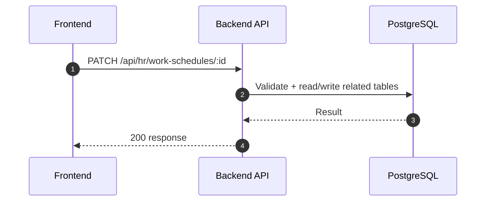

### API: `POST /api/hr/work-schedules/:id/assign`

**Purpose**
- สร้าง/ดำเนินการ สำหรับ `POST /api/hr/work-schedules/:id/assign`

**FE Screen**
- อ้างอิงตามโมดูลของไฟล์นี้

**Params**
- Path Params: มี (`id`/ตัวแปร path ตาม endpoint)
- Query Params: รองรับตาม requirement ของ endpoint (pagination/filter/date range ถ้ามี)

**Request Headers**
```json
{
  "Authorization": "Bearer <access_token>"
}
```

**Request Body**
```json
{}
```

**Response Body (201)**
```json
{
  "data": {},
  "message": "Success"
}
```

**Sequence Diagram**
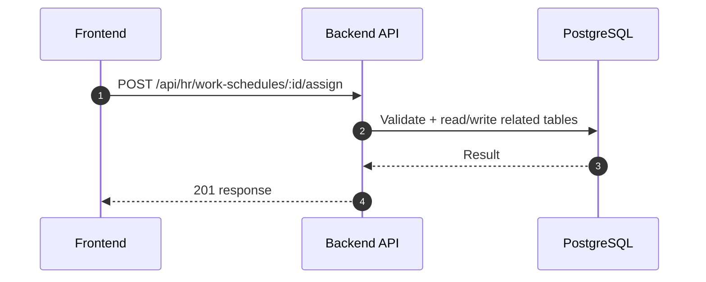

### API: `GET /api/hr/attendance`

**Purpose**
- ดึงข้อมูล สำหรับ `GET /api/hr/attendance`

**FE Screen**
- อ้างอิงตามโมดูลของไฟล์นี้

**Params**
- Path Params: ไม่มี
- Query Params: รองรับตาม requirement ของ endpoint (pagination/filter/date range ถ้ามี)

**Request Headers**
```json
{
  "Authorization": "Bearer <access_token>"
}
```

**Request Body**
```json
{}
```

**Response Body (200)**
```json
{
  "data": {}
}
```

**Sequence Diagram**


### API: `POST /api/hr/attendance/check-in`

**Purpose**
- สร้าง/ดำเนินการ สำหรับ `POST /api/hr/attendance/check-in`

**FE Screen**
- อ้างอิงตามโมดูลของไฟล์นี้

**Params**
- Path Params: ไม่มี
- Query Params: รองรับตาม requirement ของ endpoint (pagination/filter/date range ถ้ามี)

**Request Headers**
```json
{
  "Authorization": "Bearer <access_token>"
}
```

**Request Body**
```json
{}
```

**Response Body (201)**
```json
{
  "data": {},
  "message": "Success"
}
```

**Sequence Diagram**
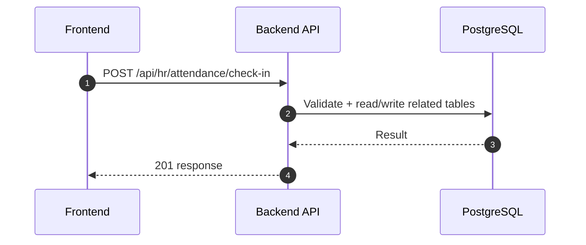

### API: `PATCH /api/hr/attendance/:id/check-out`

**Purpose**
- อัปเดตบางส่วน สำหรับ `PATCH /api/hr/attendance/:id/check-out`

**FE Screen**
- อ้างอิงตามโมดูลของไฟล์นี้

**Params**
- Path Params: มี (`id`/ตัวแปร path ตาม endpoint)
- Query Params: รองรับตาม requirement ของ endpoint (pagination/filter/date range ถ้ามี)

**Request Headers**
```json
{
  "Authorization": "Bearer <access_token>"
}
```

**Request Body**
```json
{}
```

**Response Body (200)**
```json
{
  "data": {},
  "message": "Success"
}
```

**Sequence Diagram**
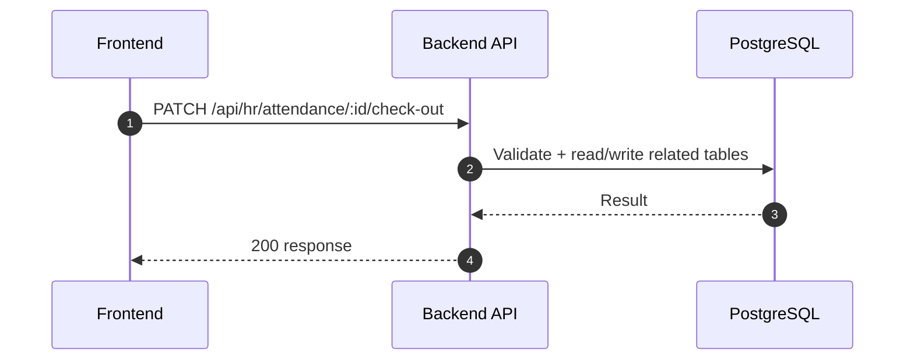

### API: `GET /api/hr/attendance/summary`

**Purpose**
- ดึงข้อมูล สำหรับ `GET /api/hr/attendance/summary`

**FE Screen**
- อ้างอิงตามโมดูลของไฟล์นี้

**Params**
- Path Params: ไม่มี
- Query Params: รองรับตาม requirement ของ endpoint (pagination/filter/date range ถ้ามี)

**Request Headers**
```json
{
  "Authorization": "Bearer <access_token>"
}
```

**Request Body**
```json
{}
```

**Response Body (200)**
```json
{
  "data": {}
}
```

**Sequence Diagram**
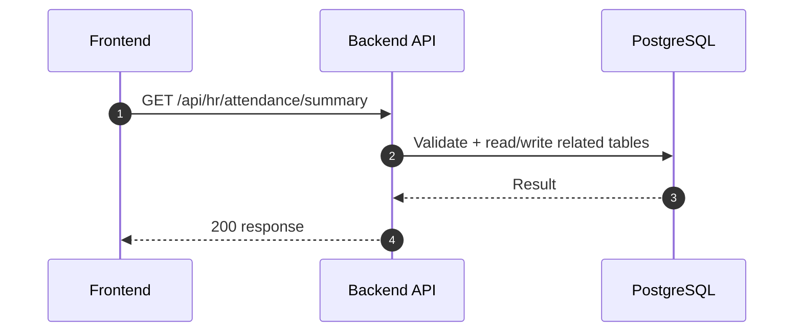

### API: `GET /api/hr/overtime`

**Purpose**
- ดึงข้อมูล สำหรับ `GET /api/hr/overtime`

**FE Screen**
- อ้างอิงตามโมดูลของไฟล์นี้

**Params**
- Path Params: ไม่มี
- Query Params: รองรับตาม requirement ของ endpoint (pagination/filter/date range ถ้ามี)

**Request Headers**
```json
{
  "Authorization": "Bearer <access_token>"
}
```

**Request Body**
```json
{}
```

**Response Body (200)**
```json
{
  "data": {}
}
```

**Sequence Diagram**
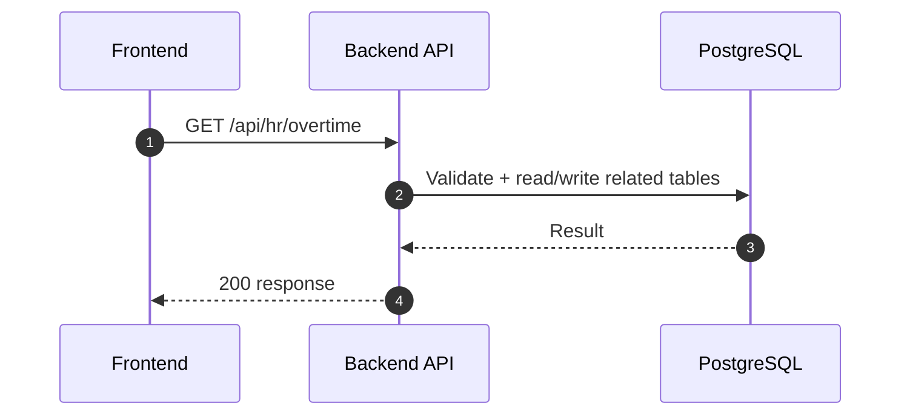

### API: `POST /api/hr/overtime`

**Purpose**
- สร้าง/ดำเนินการ สำหรับ `POST /api/hr/overtime`

**FE Screen**
- อ้างอิงตามโมดูลของไฟล์นี้

**Params**
- Path Params: ไม่มี
- Query Params: รองรับตาม requirement ของ endpoint (pagination/filter/date range ถ้ามี)

**Request Headers**
```json
{
  "Authorization": "Bearer <access_token>"
}
```

**Request Body**
```json
{}
```

**Response Body (201)**
```json
{
  "data": {},
  "message": "Success"
}
```

**Sequence Diagram**
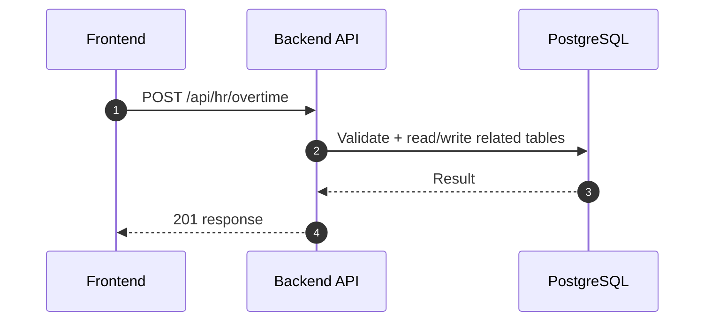

### API: `GET /api/hr/overtime/:id`

**Purpose**
- ดึงข้อมูล สำหรับ `GET /api/hr/overtime/:id`

**FE Screen**
- อ้างอิงตามโมดูลของไฟล์นี้

**Params**
- Path Params: มี (`id`/ตัวแปร path ตาม endpoint)
- Query Params: รองรับตาม requirement ของ endpoint (pagination/filter/date range ถ้ามี)

**Request Headers**
```json
{
  "Authorization": "Bearer <access_token>"
}
```

**Request Body**
```json
{}
```

**Response Body (200)**
```json
{
  "data": {}
}
```

**Sequence Diagram**
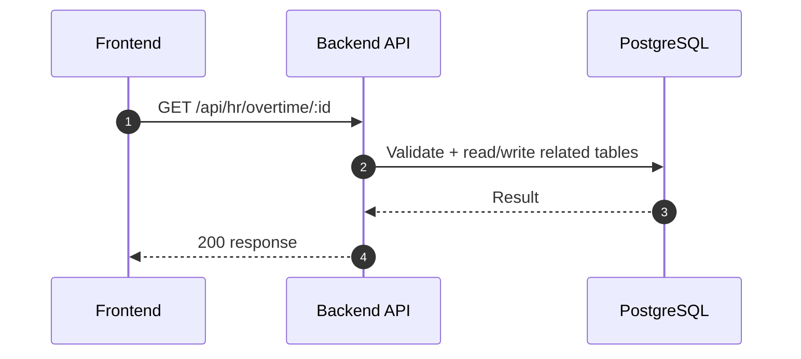

### API: `PATCH /api/hr/overtime/:id/approve`

**Purpose**
- อัปเดตบางส่วน สำหรับ `PATCH /api/hr/overtime/:id/approve`

**FE Screen**
- อ้างอิงตามโมดูลของไฟล์นี้

**Params**
- Path Params: มี (`id`/ตัวแปร path ตาม endpoint)
- Query Params: รองรับตาม requirement ของ endpoint (pagination/filter/date range ถ้ามี)

**Request Headers**
```json
{
  "Authorization": "Bearer <access_token>"
}
```

**Request Body**
```json
{}
```

**Response Body (200)**
```json
{
  "data": {},
  "message": "Success"
}
```

**Sequence Diagram**
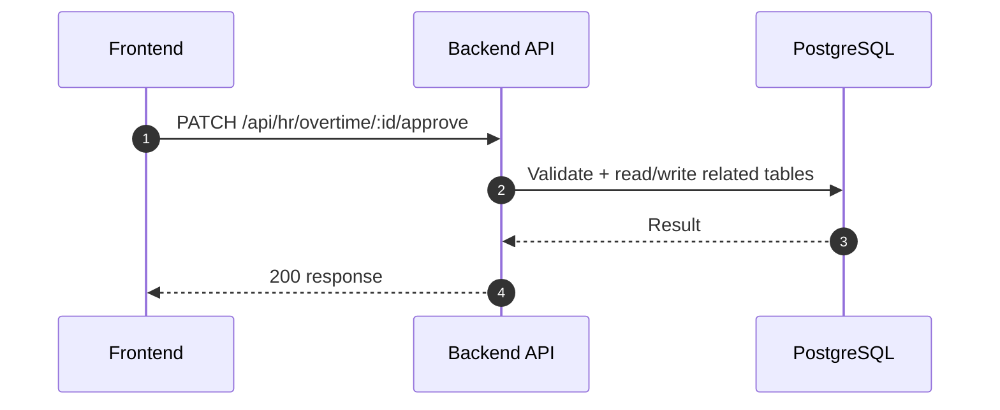

### API: `PATCH /api/hr/overtime/:id/reject`

**Purpose**
- อัปเดตบางส่วน สำหรับ `PATCH /api/hr/overtime/:id/reject`

**FE Screen**
- อ้างอิงตามโมดูลของไฟล์นี้

**Params**
- Path Params: มี (`id`/ตัวแปร path ตาม endpoint)
- Query Params: รองรับตาม requirement ของ endpoint (pagination/filter/date range ถ้ามี)

**Request Headers**
```json
{
  "Authorization": "Bearer <access_token>"
}
```

**Request Body**
```json
{}
```

**Response Body (200)**
```json
{
  "data": {},
  "message": "Success"
}
```

**Sequence Diagram**
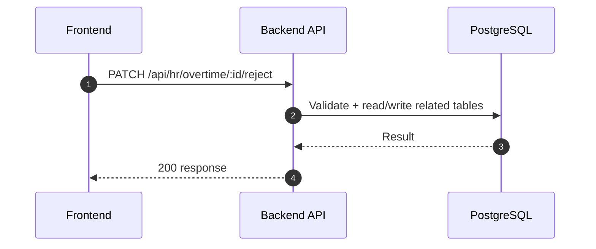

### API: `GET /api/hr/holidays`

**Purpose**
- ดึงข้อมูล สำหรับ `GET /api/hr/holidays`

**FE Screen**
- อ้างอิงตามโมดูลของไฟล์นี้

**Params**
- Path Params: ไม่มี
- Query Params: รองรับตาม requirement ของ endpoint (pagination/filter/date range ถ้ามี)

**Request Headers**
```json
{
  "Authorization": "Bearer <access_token>"
}
```

**Request Body**
```json
{}
```

**Response Body (200)**
```json
{
  "data": {}
}
```

**Sequence Diagram**
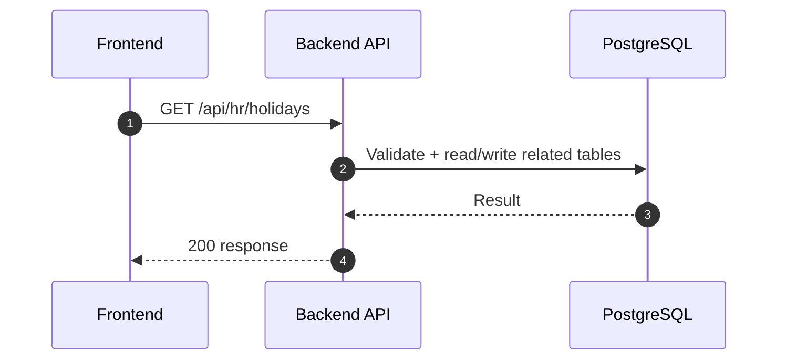

### API: `POST /api/hr/holidays`

**Purpose**
- สร้าง/ดำเนินการ สำหรับ `POST /api/hr/holidays`

**FE Screen**
- อ้างอิงตามโมดูลของไฟล์นี้

**Params**
- Path Params: ไม่มี
- Query Params: รองรับตาม requirement ของ endpoint (pagination/filter/date range ถ้ามี)

**Request Headers**
```json
{
  "Authorization": "Bearer <access_token>"
}
```

**Request Body**
```json
{}
```

**Response Body (201)**
```json
{
  "data": {},
  "message": "Success"
}
```

**Sequence Diagram**
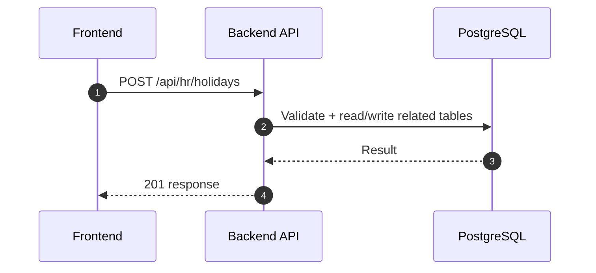

### API: `DELETE /api/hr/holidays/:id`

**Purpose**
- ลบข้อมูล สำหรับ `DELETE /api/hr/holidays/:id`

**FE Screen**
- อ้างอิงตามโมดูลของไฟล์นี้

**Params**
- Path Params: มี (`id`/ตัวแปร path ตาม endpoint)
- Query Params: รองรับตาม requirement ของ endpoint (pagination/filter/date range ถ้ามี)

**Request Headers**
```json
{
  "Authorization": "Bearer <access_token>"
}
```

**Request Body**
```json
{}
```

**Response Body (200)**
```json
{
  "message": "Deleted successfully"
}
```

**Sequence Diagram**
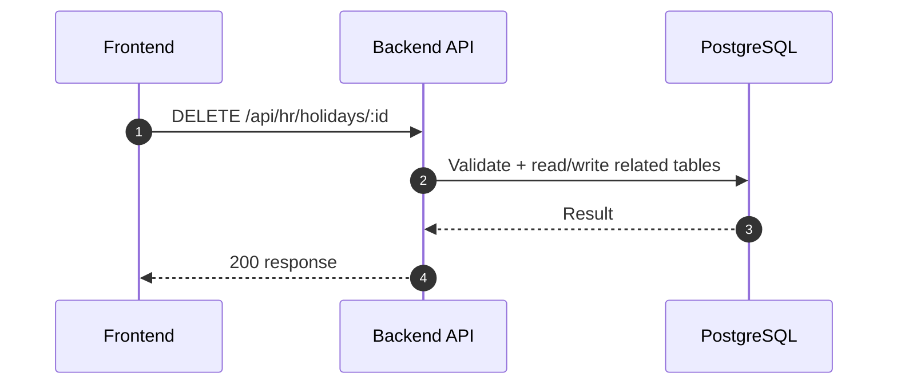

---

## Coverage Lock Addendum (2026-04-16)

### Contracts To Lock
- work schedule assign response ต้องคืน `assignedCount`, `skipped[]`
- check-in/check-out response ต้องคืน `workedMinutes`, `lateMinutes`, `overtimeMinutes`
- OT approve/reject ต้องมี `approverId`, `approvedAt`/`rejectedAt`, `rejectReason`
- attendance summary query ต้องรองรับช่วงวันที่ + employee/dept filters

### Cross-Module Side Effects
- approved overtime และ attendance summary ต้องอ่านได้จาก payroll processing run
- absent threshold events ต้อง trigger notification workflow ด้วย `eventType = EMPLOYEE_ABSENT`
- attendance -> payroll payload อย่างน้อยต้องมี `employeeId`, `periodFrom`, `periodTo`, `scheduledDays`, `actualWorkingDays`, `absentDays`, `overtimeHoursWeekday`, `overtimeHoursHoliday`
- attendance -> notification payload อย่างน้อยต้องมี `eventType`, `entityType=attendance_records`, `entityId`, `actionUrl`, `message`, `recipientUserId`
