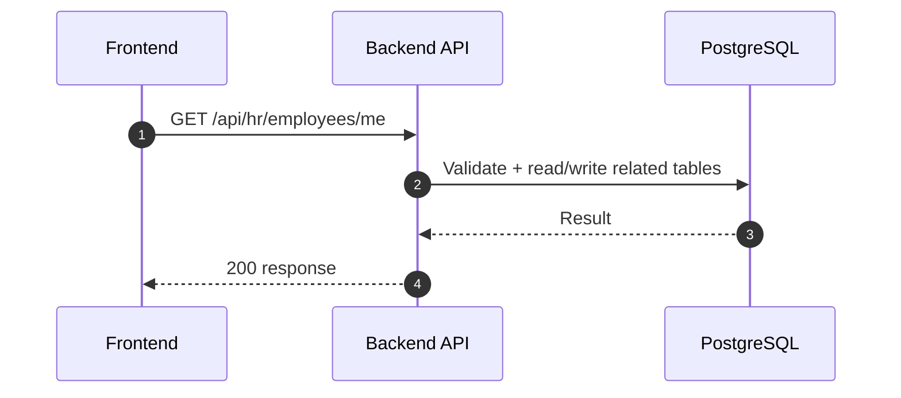
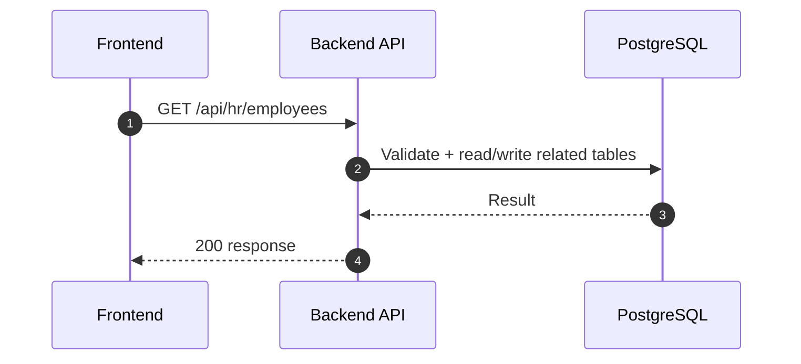
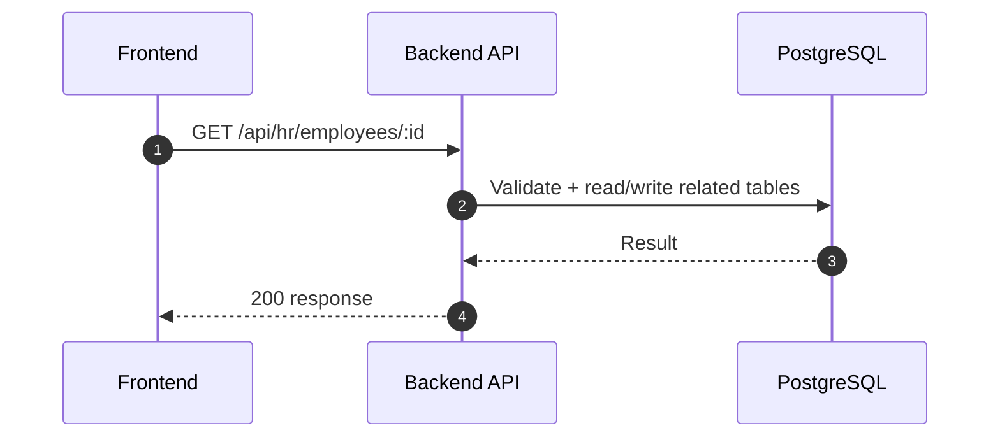
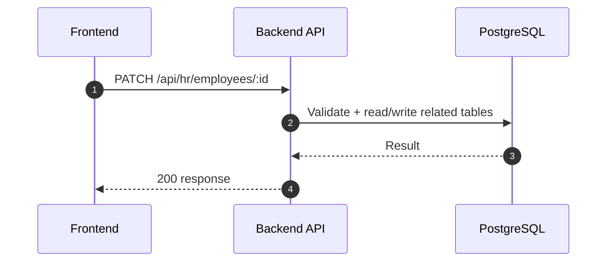
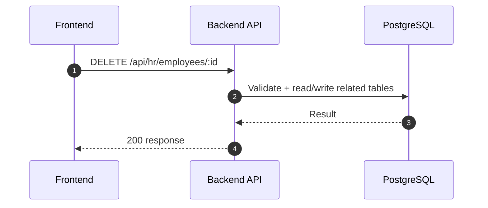

# HR Module - Employees (Normalized)

อ้างอิง: `Documents/Release_1.md`

## API Inventory
- `GET /api/hr/employees/me`
- `GET /api/hr/employees`
- `GET /api/hr/employees/:id`
- `POST /api/hr/employees`
- `PATCH /api/hr/employees/:id`
- `DELETE /api/hr/employees/:id`

## Endpoint Details

### API: `GET /api/hr/employees/me`

**Purpose**
- ดึงข้อมูล สำหรับ `GET /api/hr/employees/me`

**FE Screen**
- อ้างอิงตามโมดูลของไฟล์นี้

**Params**
- Path Params: ไม่มี
- Query Params: รองรับตาม requirement ของ endpoint (pagination/filter/date range ถ้ามี)

**Request Headers**
```json
{
  "Authorization": "Bearer <access_token>"
}
```

**Request Body**
```json
{}
```

**Response Body (200)**
```json
{
  "data": {}
}
```

**Sequence Diagram**


### API: `GET /api/hr/employees`

**Purpose**
- ดึงข้อมูล สำหรับ `GET /api/hr/employees`

**FE Screen**
- อ้างอิงตามโมดูลของไฟล์นี้

**Params**
- Path Params: ไม่มี
- Query Params: รองรับตาม requirement ของ endpoint (pagination/filter/date range ถ้ามี)

**Request Headers**
```json
{
  "Authorization": "Bearer <access_token>"
}
```

**Request Body**
```json
{}
```

**Response Body (200)**
```json
{
  "data": {}
}
```

**Sequence Diagram**


### API: `GET /api/hr/employees/:id`

**Purpose**
- ดึงข้อมูล สำหรับ `GET /api/hr/employees/:id`

**FE Screen**
- อ้างอิงตามโมดูลของไฟล์นี้

**Params**
- Path Params: มี (`id`/ตัวแปร path ตาม endpoint)
- Query Params: รองรับตาม requirement ของ endpoint (pagination/filter/date range ถ้ามี)

**Request Headers**
```json
{
  "Authorization": "Bearer <access_token>"
}
```

**Request Body**
```json
{}
```

**Response Body (200)**
```json
{
  "data": {}
}
```

**Sequence Diagram**


### API: `POST /api/hr/employees`

**Purpose**
- สร้าง/ดำเนินการ สำหรับ `POST /api/hr/employees`

**FE Screen**
- อ้างอิงตามโมดูลของไฟล์นี้

**Params**
- Path Params: ไม่มี
- Query Params: รองรับตาม requirement ของ endpoint (pagination/filter/date range ถ้ามี)

**Request Headers**
```json
{
  "Authorization": "Bearer <access_token>"
}
```

**Request Body**
```json
{}
```

**Response Body (201)**
```json
{
  "data": {},
  "message": "Success"
}
```

**Sequence Diagram**


### API: `PATCH /api/hr/employees/:id`

**Purpose**
- อัปเดตบางส่วน สำหรับ `PATCH /api/hr/employees/:id`

**FE Screen**
- อ้างอิงตามโมดูลของไฟล์นี้

**Params**
- Path Params: มี (`id`/ตัวแปร path ตาม endpoint)
- Query Params: รองรับตาม requirement ของ endpoint (pagination/filter/date range ถ้ามี)

**Request Headers**
```json
{
  "Authorization": "Bearer <access_token>"
}
```

**Request Body**
```json
{}
```

**Response Body (200)**
```json
{
  "data": {},
  "message": "Success"
}
```

**Sequence Diagram**


### API: `DELETE /api/hr/employees/:id`

**Purpose**
- terminate พนักงานแบบ soft-delete สำหรับ `DELETE /api/hr/employees/:id`

**FE Screen**
- อ้างอิงตามโมดูลของไฟล์นี้

**Params**
- Path Params: มี (`id`/ตัวแปร path ตาม endpoint)
- Query Params: รองรับตาม requirement ของ endpoint (pagination/filter/date range ถ้ามี)

**Request Headers**
```json
{
  "Authorization": "Bearer <access_token>"
}
```

**Request Body**
```json
{
  "terminationDate": "2026-12-31",
  "reason": "Resigned"
}
```

**Response Body (200)**
```json
{
  "data": {
    "id": "emp_001",
    "status": "terminated",
    "endDate": "2026-12-31"
  },
  "message": "Employee terminated successfully"
}
```

**Sequence Diagram**


---

## Coverage Lock Addendum (2026-04-16)

ส่วนนี้ใช้ปิดช่องว่าง coverage จาก checklist โดยให้ค่าตาม canonical source (`Documents/Requirements/Release_1.md`)

### Canonical Fields
- ใช้ `hireDate` (ไม่ใช้ `employmentDate`)
- list filter ต้องรองรับ `hasUserAccount`
- soft terminate ต้องสะท้อน `status=terminated` และ `endDate`

### Contract Snapshot

### `GET /api/hr/employees/me`
- Response `data` ต้องมีอย่างน้อย:
  - `id`, `employeeCode`, `firstName`, `lastName`, `email`, `phone`
  - `department: { id, name }`, `position: { id, name }`
  - `hireDate`, `status`, `baseSalary`
  - `bankAccountNo`, `bankName`, `socialSecurityNo`, `taxId`

### `GET /api/hr/employees`
- Query: `page`, `limit`, `search`, `departmentId`, `positionId`, `status`, `hasUserAccount`
- Response:
```json
{
  "data": [
    {
      "id": "emp_001",
      "employeeCode": "EMP-0101",
      "fullName": "สุดา วงศ์ดี",
      "departmentId": "dept_hr",
      "positionId": "pos_hr_staff",
      "hireDate": "2026-04-01",
      "status": "active",
      "hasUserAccount": false
    }
  ],
  "meta": { "page": 1, "limit": 20, "total": 1, "totalPages": 1 }
}
```

### `POST /api/hr/employees`
- Request body อย่างน้อย: `employeeCode`, `firstName`, `lastName`, `email`, `departmentId`, `positionId`, `hireDate`
- Optional ที่ต้องรองรับ: `phone`, `dateOfBirth`, `nationalId`, `address`, `bankAccountNo`, `bankName`, `socialSecurityNo`, `taxId`, `baseSalary`
- Error สำคัญ:
  - `409` duplicate `employeeCode`/`email`
  - `422` invalid reference (`departmentId`, `positionId`) หรือ field format

### `PATCH /api/hr/employees/:id`
- รองรับ partial update เฉพาะ field ที่แก้ได้ในแบบฟอร์ม
- ต้องตอบกลับ `data.status` ล่าสุดและข้อมูล reference ที่ resolve แล้ว

### `DELETE /api/hr/employees/:id` (Soft terminate)
- Request body:
```json
{
  "terminationDate": "2026-12-31",
  "reason": "Resigned"
}
```
- Response:
```json
{
  "data": {
    "id": "emp_001",
    "status": "terminated",
    "endDate": "2026-12-31"
  },
  "message": "Employee terminated successfully"
}
```
