# HR Module - Leaves (Normalized)

อ้างอิง: `Documents/Release_1.md`

## API Inventory
- `GET /api/hr/leaves/types`
- `POST /api/hr/leaves/types`
- `PATCH /api/hr/leaves/types/:id`
- `GET /api/hr/leaves/balances`
- `POST /api/hr/leaves/balances`
- `PATCH /api/hr/leaves/balances/:id`
- `POST /api/hr/leaves/balances/bulk-allocate`
- `GET /api/hr/leaves/approval-configs`
- `POST /api/hr/leaves/approval-configs`
- `PATCH /api/hr/leaves/approval-configs/:id`
- `DELETE /api/hr/leaves/approval-configs/:id`
- `GET /api/hr/leaves`
- `POST /api/hr/leaves`
- `PATCH /api/hr/leaves/:id/approve`
- `PATCH /api/hr/leaves/:id/reject`

## Endpoint Details

### API: `GET /api/hr/leaves/types`

**Purpose**
- ดึงข้อมูล สำหรับ `GET /api/hr/leaves/types`

**FE Screen**
- อ้างอิงตามโมดูลของไฟล์นี้

**Params**
- Path Params: ไม่มี
- Query Params: `includeInactive` (optional boolean — ตาม BR Feature 1.4)

**Request Headers**
```json
{
  "Authorization": "Bearer <access_token>"
}
```

**Request Body**
```json
{}
```

**Response Body (200)**
```json
{
  "data": {}
}
```

**Sequence Diagram**
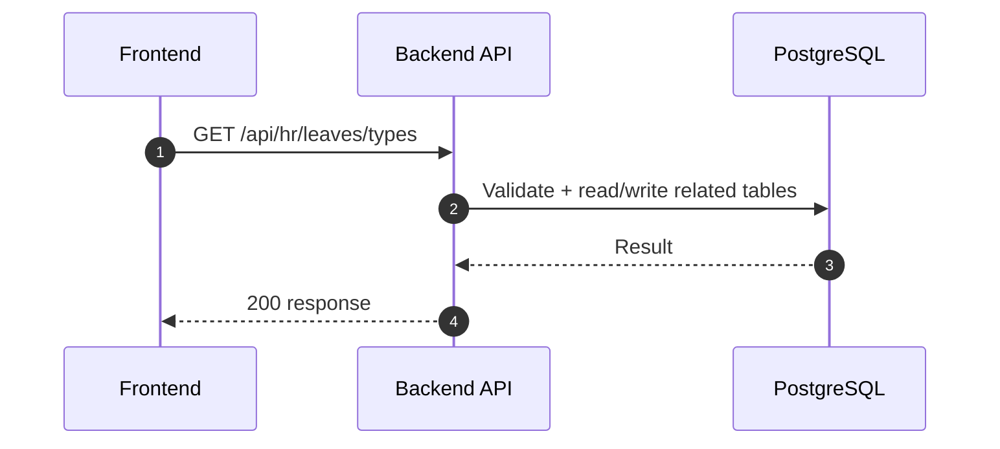

### API: `POST /api/hr/leaves/types`

**Purpose**
- สร้างประเภทการลา (master) — สิทธิ์ `hr_admin`

**Params**
- Path Params: ไม่มี
- Query Params: ไม่มี

**Request Headers**
```json
{
  "Authorization": "Bearer <access_token>"
}
```

**Request Body**
```json
{
  "name": "ลาป่วย",
  "code": "SICK",
  "maxDaysPerYear": 30,
  "paidLeave": true,
  "carryOver": false,
  "requireAttachment": false,
  "isActive": true
}
```

**Response Body (201)**
```json
{
  "data": {},
  "message": "Success"
}
```

**Sequence Diagram**
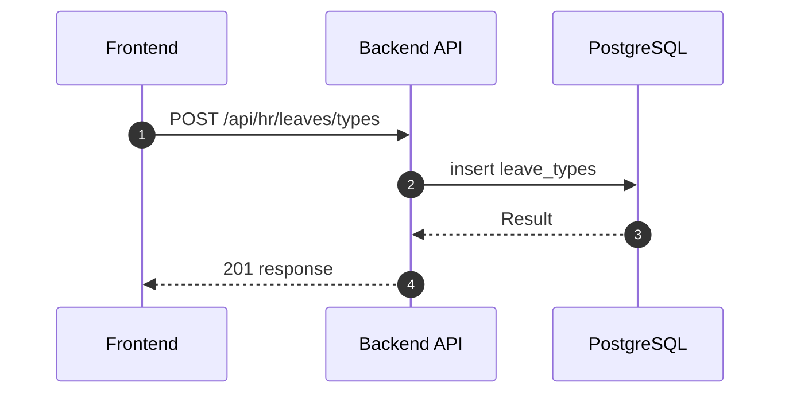

### API: `PATCH /api/hr/leaves/types/:id`

**Purpose**
- แก้ไขประเภทการลา รวม `isActive` (soft-disable)

**Params**
- Path Params: `id`
- Query Params: ไม่มี

**Request Headers**
```json
{
  "Authorization": "Bearer <access_token>"
}
```

**Request Body**
```json
{
  "paidLeave": false,
  "isActive": true
}
```

**Response Body (200)**
```json
{
  "data": {},
  "message": "Success"
}
```

**Sequence Diagram**
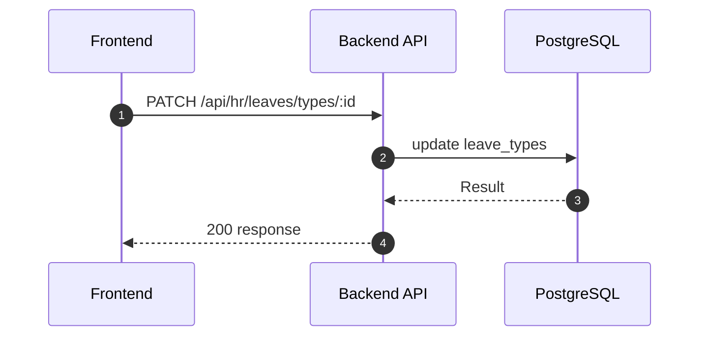

### API: `GET /api/hr/leaves/balances`

**Purpose**
- รายการ `leave_balances` (filter: employee, year, leave type)

**Params**
- Path Params: ไม่มี
- Query Params: `page`, `limit`, `employeeId`, `year`, `leaveTypeId`

**Request Headers**
```json
{
  "Authorization": "Bearer <access_token>"
}
```

**Response Body (200)**
```json
{
  "data": {}
}
```

**Sequence Diagram**
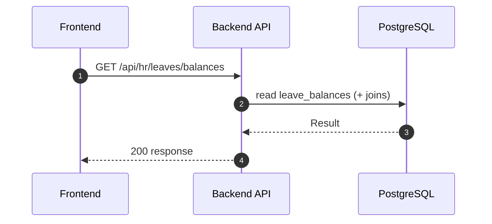

### API: `POST /api/hr/leaves/balances`

**Purpose**
- สร้างแถวโควต้า (employee + leaveType + year) ถ้ายังไม่มี

**Request Body**
```json
{
  "employeeId": "emp_uuid",
  "leaveTypeId": "lt_uuid",
  "year": 2026,
  "allocated": 10
}
```

**Response Body (201)**
```json
{
  "data": {},
  "message": "Success"
}
```

**Sequence Diagram**
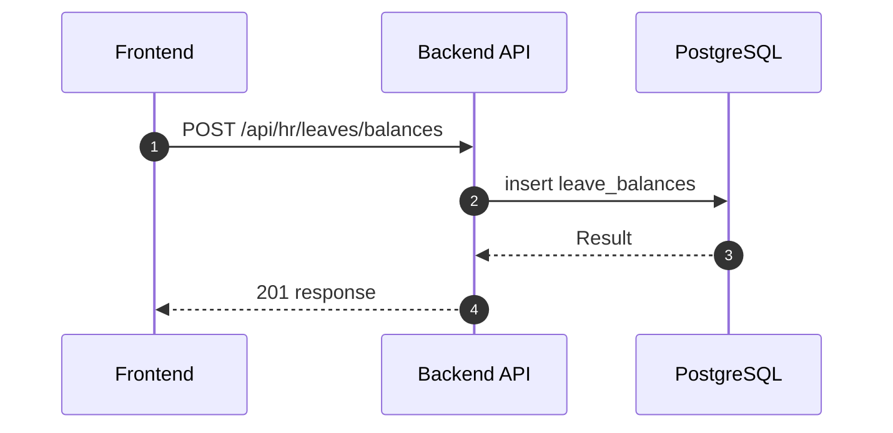

### API: `PATCH /api/hr/leaves/balances/:id`

**Purpose**
- ปรับ `allocated` เท่านั้น (`used` ผ่าน approve workflow)

**Params**
- Path Params: `id`

**Request Body**
```json
{
  "allocated": 12.5
}
```

**Response Body (200)**
```json
{
  "data": {},
  "message": "Success"
}
```

**Sequence Diagram**
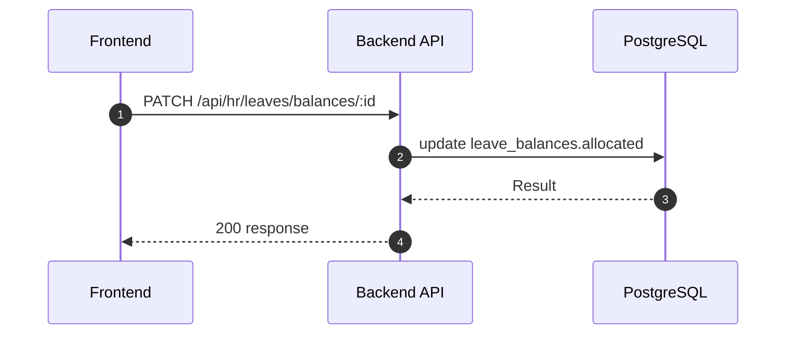

### API: `POST /api/hr/leaves/balances/bulk-allocate`

**Purpose**
- จัดสรรโควต้าเป็นชุด (ต้นปี / พนักงานใหม่) — โครงสร้าง body ตามสัญญา BE

**Request Body**
```json
{
  "year": 2026,
  "allocations": [
    { "leaveTypeId": "lt_uuid", "defaultAllocated": 10 }
  ],
  "employeeIds": ["emp_a", "emp_b"]
}
```

**Response Body (200)**
```json
{
  "data": { "created": 0, "updated": 0 },
  "message": "Success"
}
```

**Sequence Diagram**
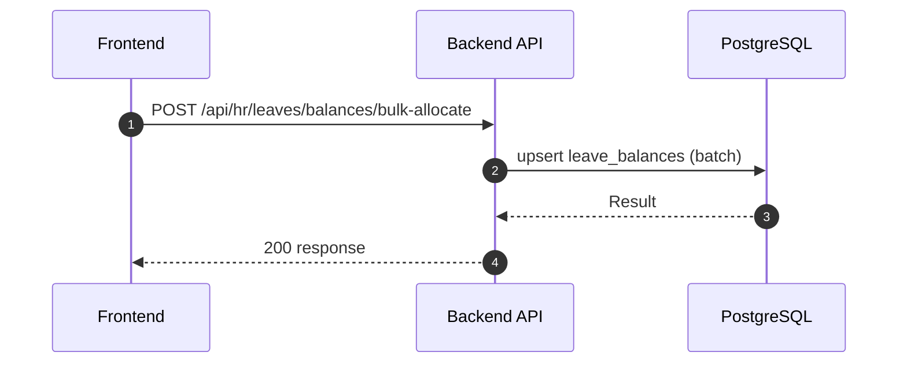

### API: `GET /api/hr/leaves/approval-configs`

**Purpose**
- รายการสายอนุมัติตามแผนก (`leave_approval_configs`)

**Query Params**: `departmentId` (optional)

**Response Body (200)**
```json
{
  "data": {}
}
```

**Sequence Diagram**
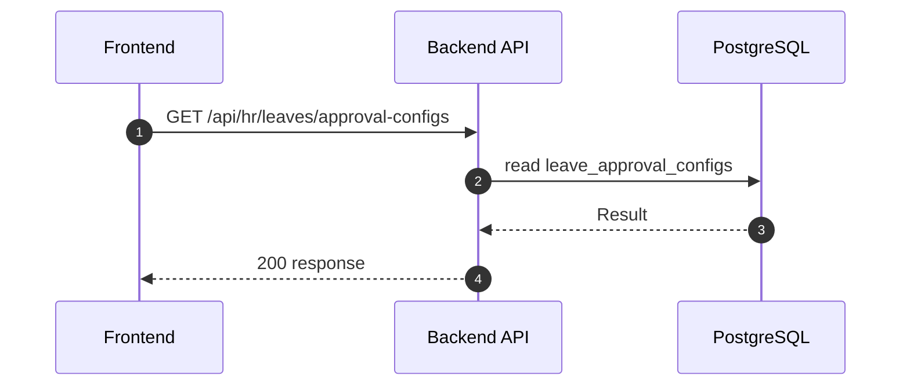

### API: `POST /api/hr/leaves/approval-configs`

**Purpose**
- เพิ่มระดับอนุมัติสำหรับแผนก

**Request Body**
```json
{
  "departmentId": "dept_uuid",
  "approverLevel": 1,
  "approverId": "emp_manager_uuid"
}
```

**Response Body (201)**
```json
{
  "data": {},
  "message": "Success"
}
```

**Sequence Diagram**
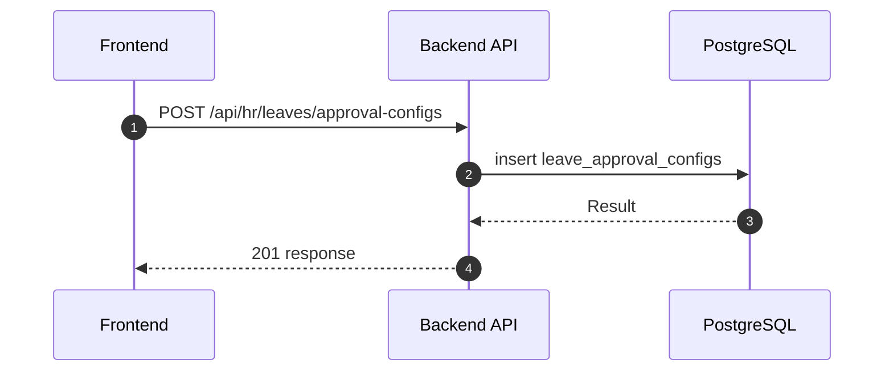

### API: `PATCH /api/hr/leaves/approval-configs/:id`

**Purpose**
- แก้ไขแถว config

**Request Body**
```json
{
  "approverId": "emp_other_uuid"
}
```

**Response Body (200)**
```json
{
  "data": {},
  "message": "Success"
}
```

**Sequence Diagram**
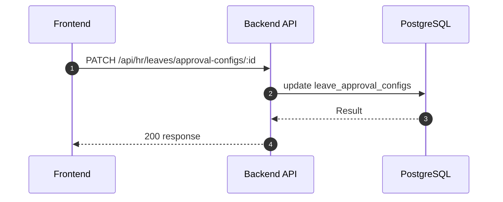

### API: `DELETE /api/hr/leaves/approval-configs/:id`

**Purpose**
- ลบแถว config (คำขอลาที่มีอยู่ไม่ถูกลบย้อนหลัง — ตามกฎ BE)

**Response Body (200)**
```json
{
  "message": "Success"
}
```

**Sequence Diagram**
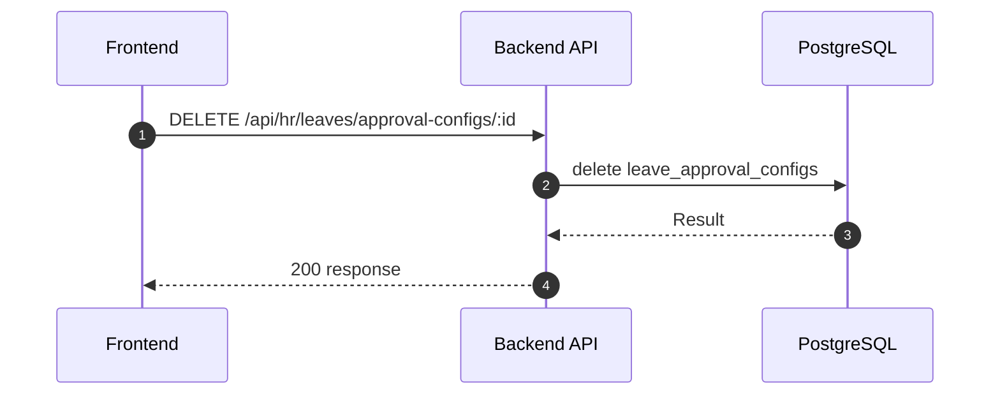

### API: `GET /api/hr/leaves`

**Purpose**
- ดึงข้อมูล สำหรับ `GET /api/hr/leaves`

**FE Screen**
- อ้างอิงตามโมดูลของไฟล์นี้

**Params**
- Path Params: ไม่มี
- Query Params: รองรับตาม requirement ของ endpoint (pagination/filter/date range ถ้ามี)

**Request Headers**
```json
{
  "Authorization": "Bearer <access_token>"
}
```

**Request Body**
```json
{}
```

**Response Body (200)**
```json
{
  "data": {}
}
```

**Sequence Diagram**
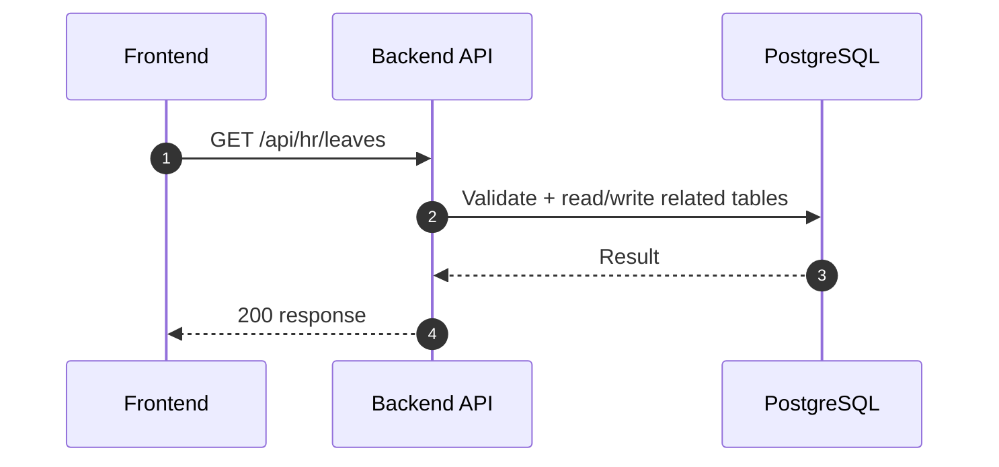

### API: `POST /api/hr/leaves`

**Purpose**
- สร้าง/ดำเนินการ สำหรับ `POST /api/hr/leaves`

**FE Screen**
- อ้างอิงตามโมดูลของไฟล์นี้

**Params**
- Path Params: ไม่มี
- Query Params: รองรับตาม requirement ของ endpoint (pagination/filter/date range ถ้ามี)

**Request Headers**
```json
{
  "Authorization": "Bearer <access_token>"
}
```

**Request Body**
```json
{}
```

**Response Body (201)**
```json
{
  "data": {},
  "message": "Success"
}
```

**Sequence Diagram**


### API: `PATCH /api/hr/leaves/:id/approve`

**Purpose**
- อัปเดตบางส่วน สำหรับ `PATCH /api/hr/leaves/:id/approve`

**FE Screen**
- อ้างอิงตามโมดูลของไฟล์นี้

**Params**
- Path Params: มี (`id`/ตัวแปร path ตาม endpoint)
- Query Params: รองรับตาม requirement ของ endpoint (pagination/filter/date range ถ้ามี)

**Request Headers**
```json
{
  "Authorization": "Bearer <access_token>"
}
```

**Request Body**
```json
{}
```

**Response Body (200)**
```json
{
  "data": {},
  "message": "Success"
}
```

**Sequence Diagram**
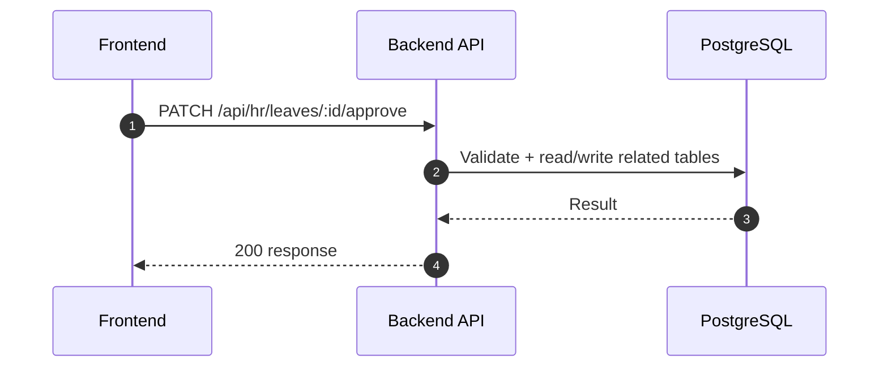

### API: `PATCH /api/hr/leaves/:id/reject`

**Purpose**
- อัปเดตบางส่วน สำหรับ `PATCH /api/hr/leaves/:id/reject`

**FE Screen**
- อ้างอิงตามโมดูลของไฟล์นี้

**Params**
- Path Params: มี (`id`/ตัวแปร path ตาม endpoint)
- Query Params: รองรับตาม requirement ของ endpoint (pagination/filter/date range ถ้ามี)

**Request Headers**
```json
{
  "Authorization": "Bearer <access_token>"
}
```

**Request Body**
```json
{}
```

**Response Body (200)**
```json
{
  "data": {},
  "message": "Success"
}
```

**Sequence Diagram**
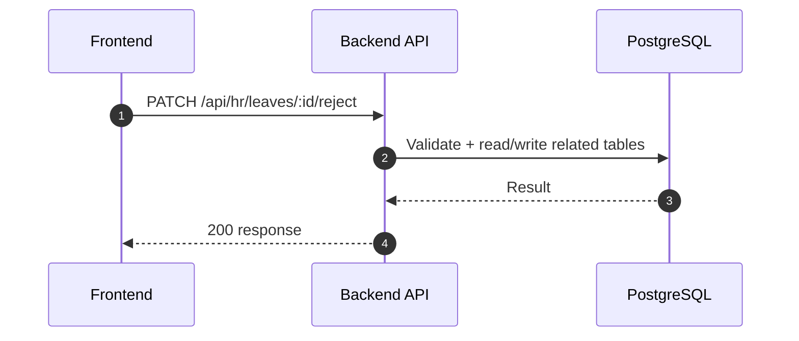

---

## Coverage Lock Addendum (2026-04-16)

### Core Contracts To Lock
- `POST /api/hr/leaves` request: `leaveTypeId`, `startDate`, `endDate`, `days`, `reason`, `attachmentUrl?`
- `PATCH /api/hr/leaves/:id/approve` response ต้องมี `status`, `approverId`, `approvedAt`
- `PATCH /api/hr/leaves/:id/reject` request body ใช้ `{ "reason": "..." }` เท่านั้น
- `GET /api/hr/leaves` item ต้องมี `status`, `approverId`, `approvedAt`, `rejectedAt`, `rejectReason`, `remaining`
- ถ้า `requireAttachment=true` และไม่มี `attachmentUrl` ให้ตอบ `422`
- read model ควรมี `approvalConfigStatus` และ `approverPreview[]` เพื่อให้ UX ตัดสินใจได้ว่าแสดงสายอนุมัติล่วงหน้าได้หรือไม่

### Dependency / Side Effects
- approval/reject ต้องเขียน audit log และยิง notification ตาม `eventType`
- approved leave ต้องสะท้อนใน attendance/payroll summary query (read-model consistency)
- attachment retention policy ให้ยึด requirement: retain อย่างน้อย 2 ปีหลังคำขอ final state และจำกัดสิทธิ์ดูเฉพาะ requester/approver/HR/auditor
