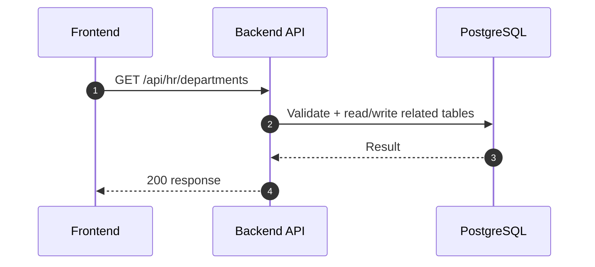
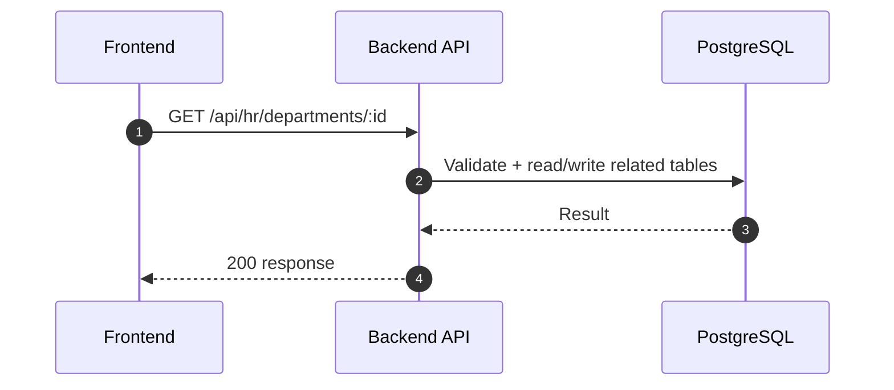
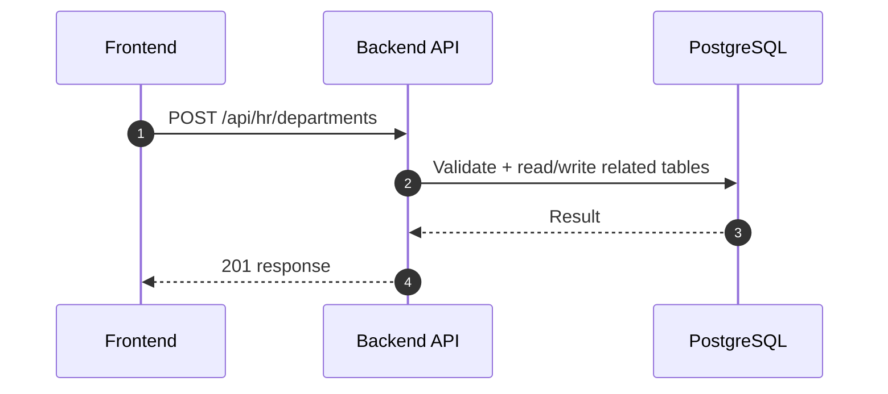
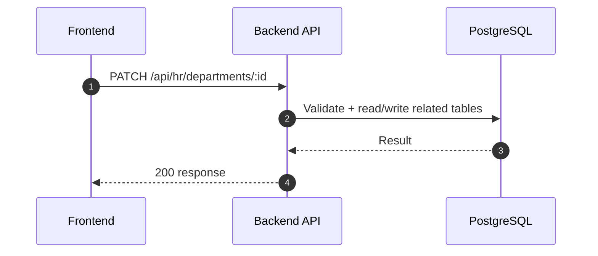
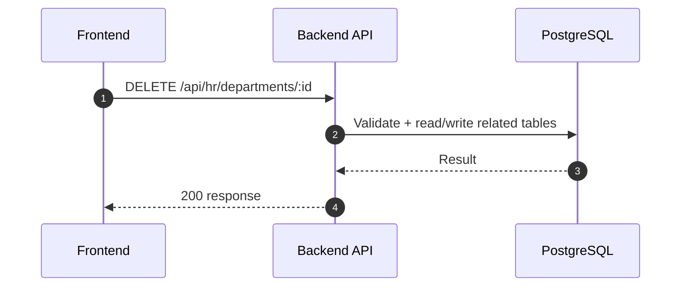
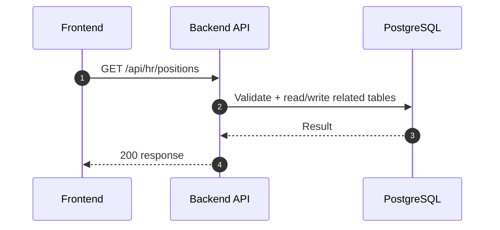
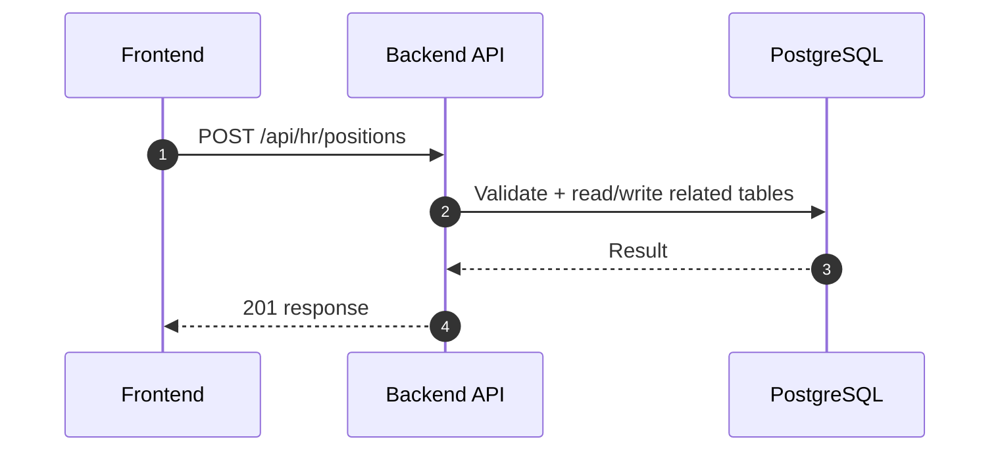
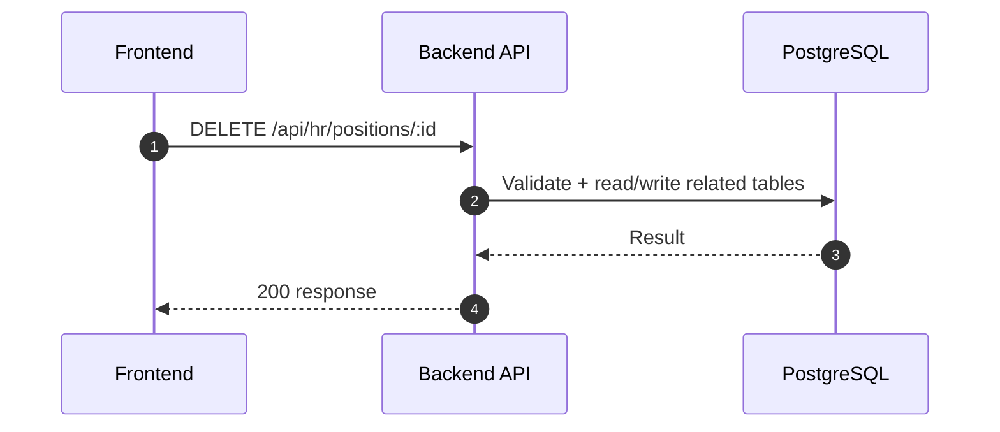

# HR Module - Organization (Normalized)

อ้างอิง: `Documents/Release_1.md`

## API Inventory
- `GET /api/hr/departments`
- `GET /api/hr/departments/:id`
- `POST /api/hr/departments`
- `PATCH /api/hr/departments/:id`
- `DELETE /api/hr/departments/:id`
- `GET /api/hr/positions`
- `GET /api/hr/positions/:id`
- `POST /api/hr/positions`
- `PATCH /api/hr/positions/:id`
- `DELETE /api/hr/positions/:id`

## Endpoint Details

### API: `GET /api/hr/departments`

**Purpose**
- ดึงข้อมูล สำหรับ `GET /api/hr/departments`

**FE Screen**
- อ้างอิงตามโมดูลของไฟล์นี้

**Params**
- Path Params: ไม่มี
- Query Params: รองรับตาม requirement ของ endpoint (pagination/filter/date range ถ้ามี)

**Request Headers**
```json
{
  "Authorization": "Bearer <access_token>"
}
```

**Request Body**
```json
{}
```

**Response Body (200)**
```json
{
  "data": {}
}
```

**Sequence Diagram**


### API: `GET /api/hr/departments/:id`

**Purpose**
- ดึงข้อมูล สำหรับ `GET /api/hr/departments/:id`

**FE Screen**
- อ้างอิงตามโมดูลของไฟล์นี้

**Params**
- Path Params: มี (`id`/ตัวแปร path ตาม endpoint)
- Query Params: รองรับตาม requirement ของ endpoint (pagination/filter/date range ถ้ามี)

**Request Headers**
```json
{
  "Authorization": "Bearer <access_token>"
}
```

**Request Body**
```json
{}
```

**Response Body (200)**
```json
{
  "data": {}
}
```

**Sequence Diagram**


### API: `POST /api/hr/departments`

**Purpose**
- สร้าง/ดำเนินการ สำหรับ `POST /api/hr/departments`

**FE Screen**
- อ้างอิงตามโมดูลของไฟล์นี้

**Params**
- Path Params: ไม่มี
- Query Params: รองรับตาม requirement ของ endpoint (pagination/filter/date range ถ้ามี)

**Request Headers**
```json
{
  "Authorization": "Bearer <access_token>"
}
```

**Request Body**
```json
{}
```

**Response Body (201)**
```json
{
  "data": {},
  "message": "Success"
}
```

**Sequence Diagram**


### API: `PATCH /api/hr/departments/:id`

**Purpose**
- อัปเดตบางส่วน สำหรับ `PATCH /api/hr/departments/:id`

**FE Screen**
- อ้างอิงตามโมดูลของไฟล์นี้

**Params**
- Path Params: มี (`id`/ตัวแปร path ตาม endpoint)
- Query Params: รองรับตาม requirement ของ endpoint (pagination/filter/date range ถ้ามี)

**Request Headers**
```json
{
  "Authorization": "Bearer <access_token>"
}
```

**Request Body**
```json
{}
```

**Response Body (200)**
```json
{
  "data": {},
  "message": "Success"
}
```

**Sequence Diagram**


### API: `DELETE /api/hr/departments/:id`

**Purpose**
- ลบข้อมูล สำหรับ `DELETE /api/hr/departments/:id`

**FE Screen**
- อ้างอิงตามโมดูลของไฟล์นี้

**Params**
- Path Params: มี (`id`/ตัวแปร path ตาม endpoint)
- Query Params: รองรับตาม requirement ของ endpoint (pagination/filter/date range ถ้ามี)

**Request Headers**
```json
{
  "Authorization": "Bearer <access_token>"
}
```

**Request Body**
```json
{}
```

**Response Body (200)**
```json
{
  "message": "Deleted successfully"
}
```

**Sequence Diagram**


### API: `GET /api/hr/positions`

**Purpose**
- ดึงข้อมูล สำหรับ `GET /api/hr/positions`

**FE Screen**
- อ้างอิงตามโมดูลของไฟล์นี้

**Params**
- Path Params: ไม่มี
- Query Params: รองรับตาม requirement ของ endpoint (pagination/filter/date range ถ้ามี)

**Request Headers**
```json
{
  "Authorization": "Bearer <access_token>"
}
```

**Request Body**
```json
{}
```

**Response Body (200)**
```json
{
  "data": {}
}
```

**Sequence Diagram**


### API: `GET /api/hr/positions/:id`

**Purpose**
- ดึงข้อมูล สำหรับ `GET /api/hr/positions/:id`

**FE Screen**
- อ้างอิงตามโมดูลของไฟล์นี้

**Params**
- Path Params: มี (`id`/ตัวแปร path ตาม endpoint)
- Query Params: รองรับตาม requirement ของ endpoint (pagination/filter/date range ถ้ามี)

**Request Headers**
```json
{
  "Authorization": "Bearer <access_token>"
}
```

**Request Body**
```json
{}
```

**Response Body (200)**
```json
{
  "data": {}
}
```

**Sequence Diagram**


### API: `POST /api/hr/positions`

**Purpose**
- สร้าง/ดำเนินการ สำหรับ `POST /api/hr/positions`

**FE Screen**
- อ้างอิงตามโมดูลของไฟล์นี้

**Params**
- Path Params: ไม่มี
- Query Params: รองรับตาม requirement ของ endpoint (pagination/filter/date range ถ้ามี)

**Request Headers**
```json
{
  "Authorization": "Bearer <access_token>"
}
```

**Request Body**
```json
{}
```

**Response Body (201)**
```json
{
  "data": {},
  "message": "Success"
}
```

**Sequence Diagram**


### API: `PATCH /api/hr/positions/:id`

**Purpose**
- อัปเดตบางส่วน สำหรับ `PATCH /api/hr/positions/:id`

**FE Screen**
- อ้างอิงตามโมดูลของไฟล์นี้

**Params**
- Path Params: มี (`id`/ตัวแปร path ตาม endpoint)
- Query Params: รองรับตาม requirement ของ endpoint (pagination/filter/date range ถ้ามี)

**Request Headers**
```json
{
  "Authorization": "Bearer <access_token>"
}
```

**Request Body**
```json
{}
```

**Response Body (200)**
```json
{
  "data": {},
  "message": "Success"
}
```

**Sequence Diagram**


### API: `DELETE /api/hr/positions/:id`

**Purpose**
- ลบข้อมูล สำหรับ `DELETE /api/hr/positions/:id`

**FE Screen**
- อ้างอิงตามโมดูลของไฟล์นี้

**Params**
- Path Params: มี (`id`/ตัวแปร path ตาม endpoint)
- Query Params: รองรับตาม requirement ของ endpoint (pagination/filter/date range ถ้ามี)

**Request Headers**
```json
{
  "Authorization": "Bearer <access_token>"
}
```

**Request Body**
```json
{}
```

**Response Body (200)**
```json
{
  "message": "Deleted successfully"
}
```

**Sequence Diagram**


---

## Coverage Lock Addendum (2026-04-16)

### Canonical Contracts
- `GET /api/hr/departments`
  - Query: `includeChildren`, `includeInactive`, `page`, `limit`
  - item อย่างน้อยต้องมี `id`, `code`, `name`, `parentId`, `manager`, `childCount`, `activeEmployeeCount`, `canDelete`
- `GET /api/hr/departments/:id`
  - response ต้องมี `children[]`, `manager`, `dependencySummary`, `deleteBlockers[]`
- `POST /api/hr/departments` / `PATCH /api/hr/departments/:id`
  - request body: `code`, `name`, `parentId?`, `managerId?`
  - ถ้า `managerId` ถูกส่งมา ต้องเป็น employee active
- `DELETE /api/hr/departments/:id`
  - ถ้ามี child departments หรือ active employees ให้ตอบ `409`
  - response conflict ควรมี `dependencySummary = { childDepartmentCount, activeEmployeeCount }`

### Position Contracts
- `GET /api/hr/positions`
  - Query: `departmentId`, `page`, `limit`
  - item อย่างน้อยต้องมี `id`, `code`, `name`, `departmentId`, `departmentName`, `level`, `activeEmployeeCount`, `canDelete`
- `GET /api/hr/positions/:id`
  - response ต้องมี `department`, `level`, `activeEmployeeCount`, `deleteBlockers[]`
- `POST /api/hr/positions` / `PATCH /api/hr/positions/:id`
  - request body: `code`, `name`, `departmentId`, `level?`
- `DELETE /api/hr/positions/:id`
  - ถ้ามีพนักงาน active ใช้งานตำแหน่งนี้ ให้ตอบ `409`

### Picker Rules
- manager picker ให้ reuse `GET /api/hr/employees?status=active`
- BE ควรคืน manager summary อย่างน้อย `{ id, employeeCode, fullName }`
