# HR Module - Payroll (Normalized)

อ้างอิง: `Documents/Release_1.md`

## API Inventory
- `POST /api/hr/payroll/runs`
- `GET /api/hr/payroll/runs`
- `POST /api/hr/payroll/runs/:runId/process`
- `POST /api/hr/payroll/runs/:runId/approve`
- `POST /api/hr/payroll/runs/:runId/mark-paid`
- `GET /api/hr/payroll/runs/:runId`
- `GET /api/hr/payroll/runs/:runId/payslips`
- `GET /api/hr/payroll`
- `GET /api/hr/payroll/configs`
- `PATCH /api/hr/payroll/configs/:key`
- `GET /api/hr/payroll/allowance-types`
- `POST /api/hr/payroll/allowance-types`
- `PATCH /api/hr/payroll/allowance-types/:id`
- `PATCH /api/hr/payroll/allowance-types/:id/activate`
- `GET /api/hr/payroll/tax-settings`
- `PATCH /api/hr/payroll/tax-settings/:employeeId`

## Endpoint Details

### API: `POST /api/hr/payroll/runs`

**Purpose**
- สร้าง/ดำเนินการ สำหรับ `POST /api/hr/payroll/runs`

**FE Screen**
- อ้างอิงตามโมดูลของไฟล์นี้

**Params**
- Path Params: ไม่มี
- Query Params: รองรับตาม requirement ของ endpoint (pagination/filter/date range ถ้ามี)

**Request Headers**
```json
{
  "Authorization": "Bearer <access_token>"
}
```

**Request Body**
```json
{}
```

**Response Body (201)**
```json
{
  "data": {},
  "message": "Success"
}
```

**Sequence Diagram**
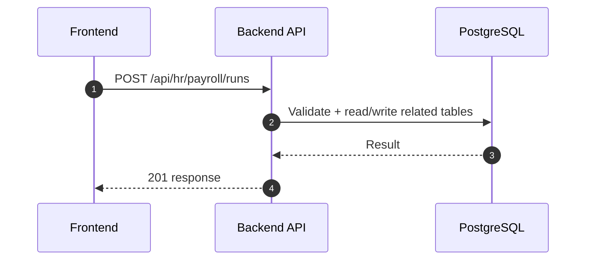

### API: `GET /api/hr/payroll/runs`

**Purpose**
- ดึงข้อมูล สำหรับ `GET /api/hr/payroll/runs`

**FE Screen**
- อ้างอิงตามโมดูลของไฟล์นี้

**Params**
- Path Params: ไม่มี
- Query Params: รองรับตาม requirement ของ endpoint (pagination/filter/date range ถ้ามี)

**Request Headers**
```json
{
  "Authorization": "Bearer <access_token>"
}
```

**Request Body**
```json
{}
```

**Response Body (200)**
```json
{
  "data": {}
}
```

**Sequence Diagram**
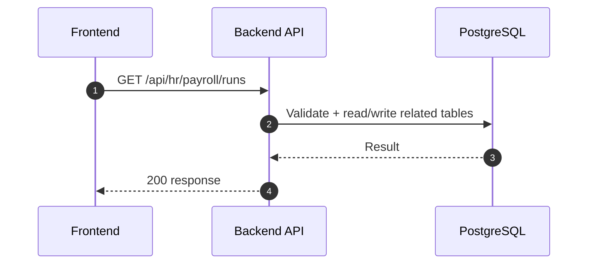

### API: `POST /api/hr/payroll/runs/:runId/process`

**Purpose**
- สร้าง/ดำเนินการ สำหรับ `POST /api/hr/payroll/runs/:runId/process`

**FE Screen**
- อ้างอิงตามโมดูลของไฟล์นี้

**Params**
- Path Params: มี (`id`/ตัวแปร path ตาม endpoint)
- Query Params: รองรับตาม requirement ของ endpoint (pagination/filter/date range ถ้ามี)

**Request Headers**
```json
{
  "Authorization": "Bearer <access_token>"
}
```

**Request Body**
```json
{}
```

**Response Body (201)**
```json
{
  "data": {},
  "message": "Success"
}
```

**Sequence Diagram**
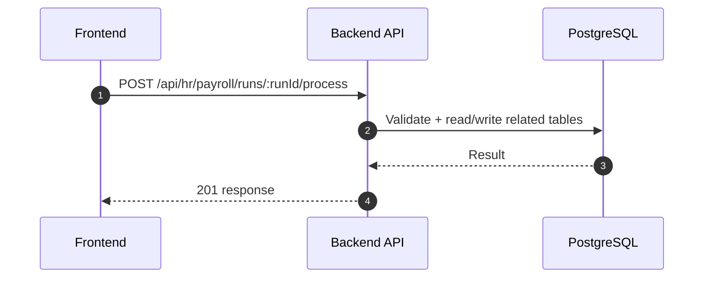

### API: `POST /api/hr/payroll/runs/:runId/approve`

**Purpose**
- สร้าง/ดำเนินการ สำหรับ `POST /api/hr/payroll/runs/:runId/approve`

**FE Screen**
- อ้างอิงตามโมดูลของไฟล์นี้

**Params**
- Path Params: มี (`id`/ตัวแปร path ตาม endpoint)
- Query Params: รองรับตาม requirement ของ endpoint (pagination/filter/date range ถ้ามี)

**Request Headers**
```json
{
  "Authorization": "Bearer <access_token>"
}
```

**Request Body**
```json
{}
```

**Response Body (201)**
```json
{
  "data": {},
  "message": "Success"
}
```

**Sequence Diagram**
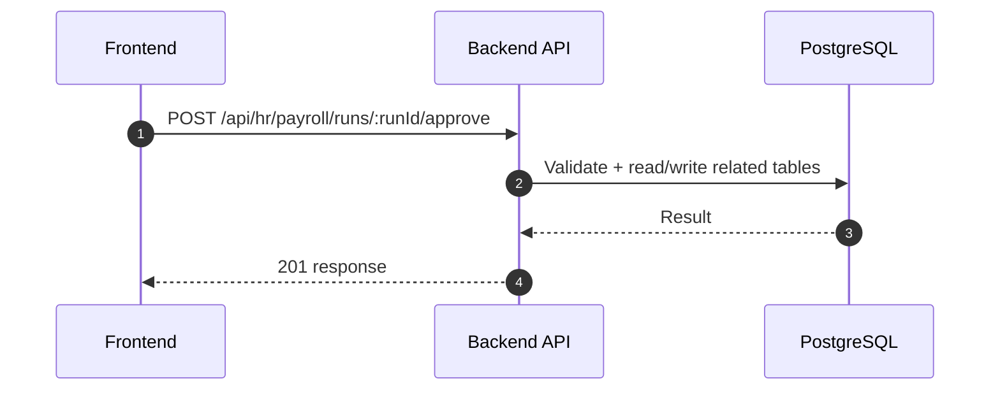

### API: `POST /api/hr/payroll/runs/:runId/mark-paid`

**Purpose**
- สร้าง/ดำเนินการ สำหรับ `POST /api/hr/payroll/runs/:runId/mark-paid`

**FE Screen**
- อ้างอิงตามโมดูลของไฟล์นี้

**Params**
- Path Params: มี (`id`/ตัวแปร path ตาม endpoint)
- Query Params: รองรับตาม requirement ของ endpoint (pagination/filter/date range ถ้ามี)

**Request Headers**
```json
{
  "Authorization": "Bearer <access_token>"
}
```

**Request Body**
```json
{}
```

**Response Body (201)**
```json
{
  "data": {},
  "message": "Success"
}
```

**Sequence Diagram**
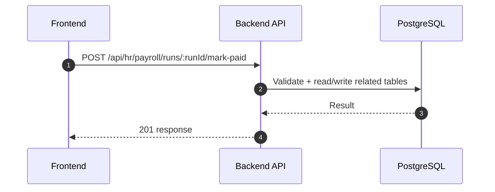

### API: `GET /api/hr/payroll/runs/:runId/payslips`

**Purpose**
- ดึงข้อมูล สำหรับ `GET /api/hr/payroll/runs/:runId/payslips`

**FE Screen**
- อ้างอิงตามโมดูลของไฟล์นี้

**Params**
- Path Params: มี (`id`/ตัวแปร path ตาม endpoint)
- Query Params: รองรับตาม requirement ของ endpoint (pagination/filter/date range ถ้ามี)

**Request Headers**
```json
{
  "Authorization": "Bearer <access_token>"
}
```

**Request Body**
```json
{}
```

**Response Body (200)**
```json
{
  "data": {}
}
```

**Sequence Diagram**


### API: `GET /api/hr/payroll`

**Purpose**
- ดึงข้อมูล สำหรับ `GET /api/hr/payroll`

**FE Screen**
- อ้างอิงตามโมดูลของไฟล์นี้

**Params**
- Path Params: ไม่มี
- Query Params: รองรับตาม requirement ของ endpoint (pagination/filter/date range ถ้ามี)

**Request Headers**
```json
{
  "Authorization": "Bearer <access_token>"
}
```

**Request Body**
```json
{}
```

**Response Body (200)**
```json
{
  "data": {}
}
```

**Sequence Diagram**
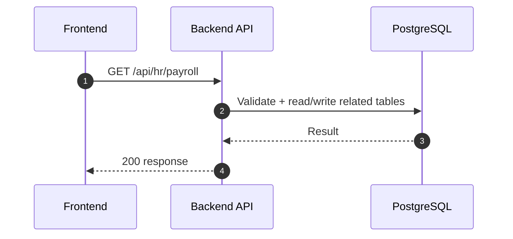

### API: `GET /api/hr/payroll/configs`

**Purpose**
- ดึง payroll config keys สำหรับคำนวณ SS/WHT

**FE Screen**
- `/hr/payroll/configs`

**Params**
- Path Params: ไม่มี
- Query Params: ไม่มี

**Request Headers**
```json
{
  "Authorization": "Bearer <access_token>"
}
```

**Request Body**
```json
{}
```

**Response Body (200)**
```json
{
  "data": [
    { "key": "ss_employee_rate", "value": "5" },
    { "key": "ss_employer_rate", "value": "5" },
    { "key": "ss_max_base", "value": "15000" }
  ]
}
```

**Sequence Diagram**
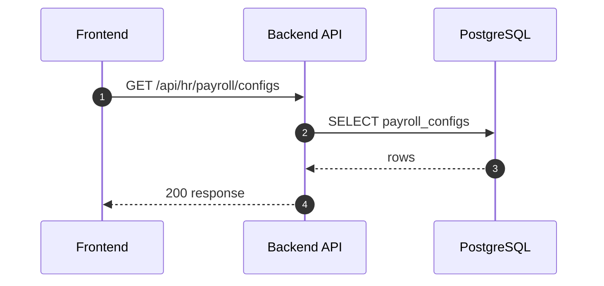

### API: `PATCH /api/hr/payroll/configs/:key`

**Purpose**
- อัปเดตค่า config ราย key ที่ใช้ใน process รอบถัดไป

**FE Screen**
- `/hr/payroll/configs`

**Params**
- Path Params: มี (`key`)
- Query Params: ไม่มี

**Request Headers**
```json
{
  "Authorization": "Bearer <access_token>"
}
```

**Request Body**
```json
{ "value": "6" }
```

**Response Body (200)**
```json
{
  "data": { "key": "ss_employee_rate", "value": "6" },
  "message": "Updated"
}
```

**Sequence Diagram**
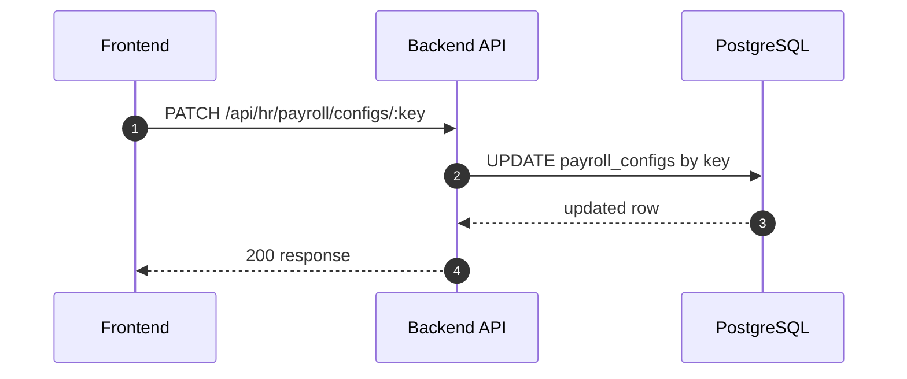

### API: `GET /api/hr/payroll/allowance-types`

**Purpose**
- ดึงรายการ allowance master พร้อม taxable flag

**FE Screen**
- `/hr/payroll/configs`

**Params**
- Path Params: ไม่มี
- Query Params: รองรับ `isActive`

**Request Headers**
```json
{
  "Authorization": "Bearer <access_token>"
}
```

**Request Body**
```json
{}
```

**Response Body (200)**
```json
{
  "data": [
    { "id": "all_001", "code": "ALLOWANCE_TRANSPORT", "name": "Transport", "taxable": true, "isActive": true }
  ]
}
```

**Sequence Diagram**
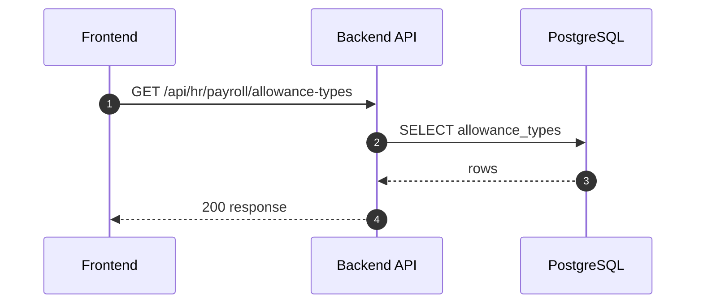

### API: `POST /api/hr/payroll/allowance-types`

**Purpose**
- สร้าง allowance type ใหม่สำหรับ payroll calculation

**FE Screen**
- `/hr/payroll/configs`

**Params**
- Path Params: ไม่มี
- Query Params: ไม่มี

**Request Headers**
```json
{
  "Authorization": "Bearer <access_token>"
}
```

**Request Body**
```json
{ "code": "ALLOWANCE_MEAL", "name": "Meal", "taxable": false }
```

**Response Body (201)**
```json
{
  "data": { "id": "all_002" },
  "message": "Created"
}
```

**Sequence Diagram**
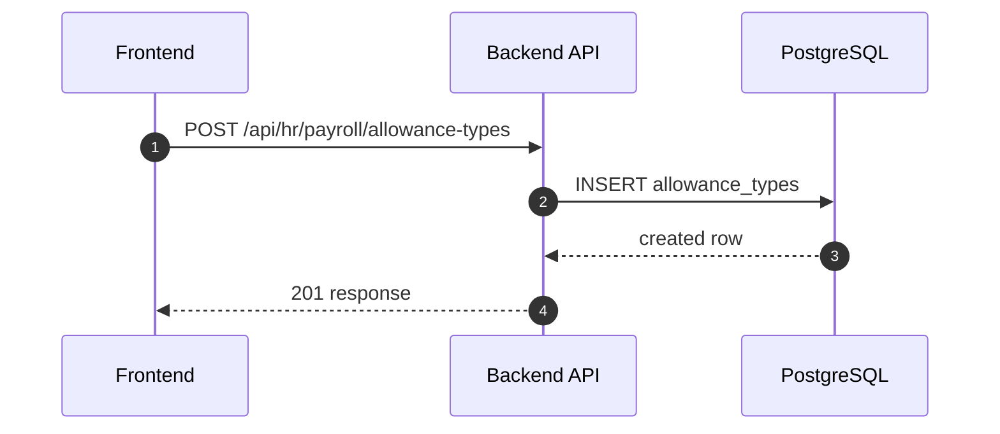

### API: `PATCH /api/hr/payroll/allowance-types/:id`

**Purpose**
- แก้ไขข้อมูล allowance type เช่นชื่อ/สถานะ taxable

**FE Screen**
- `/hr/payroll/configs`

**Params**
- Path Params: มี (`id`)
- Query Params: ไม่มี

**Request Headers**
```json
{
  "Authorization": "Bearer <access_token>"
}
```

**Request Body**
```json
{ "name": "Meal Benefit", "taxable": true }
```

**Response Body (200)**
```json
{
  "data": { "id": "all_002" },
  "message": "Updated"
}
```

**Sequence Diagram**
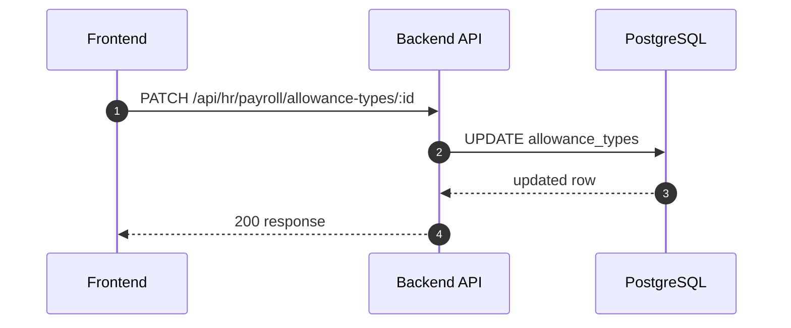

### API: `PATCH /api/hr/payroll/allowance-types/:id/activate`

**Purpose**
- เปิด/ปิดการใช้งาน allowance type

**FE Screen**
- `/hr/payroll/configs`

**Params**
- Path Params: มี (`id`)
- Query Params: ไม่มี

**Request Headers**
```json
{
  "Authorization": "Bearer <access_token>"
}
```

**Request Body**
```json
{ "isActive": false }
```

**Response Body (200)**
```json
{
  "data": { "id": "all_002", "isActive": false },
  "message": "Updated"
}
```

**Sequence Diagram**
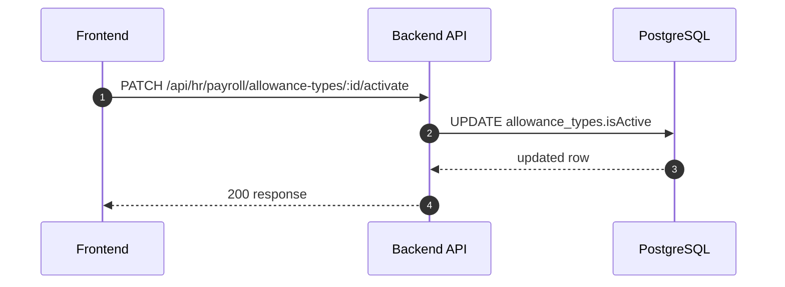

### API: `GET /api/hr/payroll/tax-settings`

**Purpose**
- ดึง employee tax settings สำหรับตรวจ/แก้ก่อน process

**FE Screen**
- `/hr/payroll/configs`

**Params**
- Path Params: ไม่มี
- Query Params: รองรับ `employeeId`, `taxYear`, `page`, `limit`

**Request Headers**
```json
{
  "Authorization": "Bearer <access_token>"
}
```

**Request Body**
```json
{}
```

**Response Body (200)**
```json
{
  "data": [
    {
      "employeeId": "emp_001",
      "taxYear": 2026,
      "withholdingMethod": "standard",
      "personalAllowances": 60000,
      "maritalStatus": "single"
    }
  ]
}
```

**Sequence Diagram**
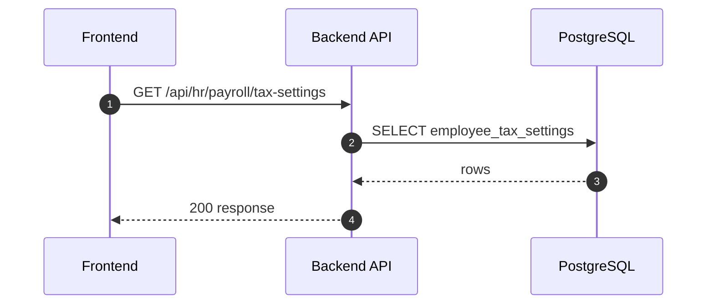

### API: `PATCH /api/hr/payroll/tax-settings/:employeeId`

**Purpose**
- อัปเดต/สร้าง tax settings ของพนักงานต่อปีภาษี

**FE Screen**
- `/hr/payroll/configs`

**Params**
- Path Params: มี (`employeeId`)
- Query Params: ไม่มี

**Request Headers**
```json
{
  "Authorization": "Bearer <access_token>"
}
```

**Request Body**
```json
{
  "taxYear": 2026,
  "withholdingMethod": "actual",
  "personalAllowances": 120000,
  "maritalStatus": "married"
}
```

**Response Body (200)**
```json
{
  "data": { "employeeId": "emp_001", "taxYear": 2026 },
  "message": "Updated"
}
```

**Sequence Diagram**
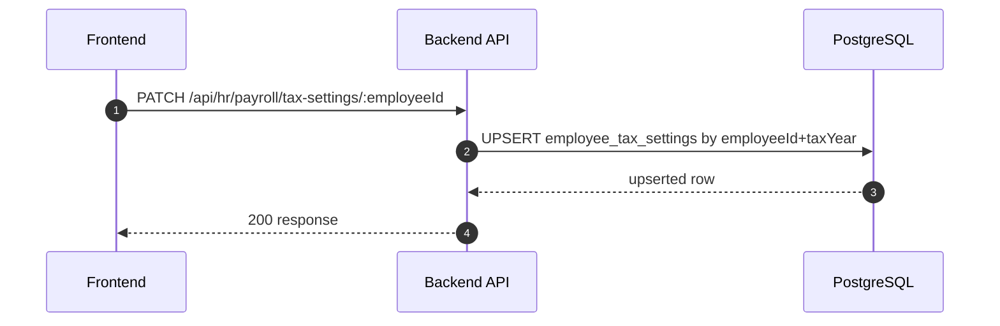

---

## Coverage Lock Addendum (2026-04-16)

### Run Lifecycle
- `POST /api/hr/payroll/runs` -> create run in `draft`
- `POST /api/hr/payroll/runs/:runId/process` ต้องรองรับ `confirmProcess` และคืน `jobId` เมื่อ async
- ใช้ async pattern สำหรับ process: ถ้า backend ตอบรับแบบ async ต้องคืน `jobId` และ FE poll ผ่าน `GET /api/hr/payroll/runs/:runId` เพื่อดูสถานะล่าสุด
- `POST /api/hr/payroll/runs/:runId/approve` ต้องคืน pre-check summary (`warningCount`, `errorCount`)
- `POST /api/hr/payroll/runs/:runId/mark-paid` ต้องรองรับ `paidAt` (optional by policy, required by finance close)
- process result ต้องคืน `warnings[]` และ `skippedEmployees[]`
- `warnings[]` item: `code`, `message`, `employeeId?`, `severity`
- `skippedEmployees[]` item: `employeeId`, `employeeCode`, `reasonCode`, `reasonMessage`

### Payslip / Export Contracts
- `GET /api/hr/payroll/runs/:runId/payslips` ต้องมีรายแถว + summary (`gross`, `deductions`, `net`, `warningCode[]`)
- export/pdf flow ต้องชี้ไป `Documents/SD_Flow/Finance/document_exports.md`

### Compliance Gaps Locked
- เพิ่ม read contract สำหรับ `ss_records` และ `ss_submissions`
- error model ของ process/export ต้องระบุ retryability (`retryable: true/false`)
- `severity` lock เป็น `info | warning | blocking`
