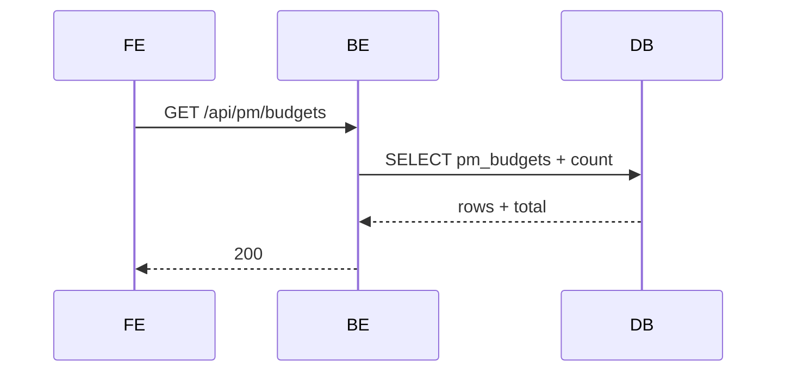
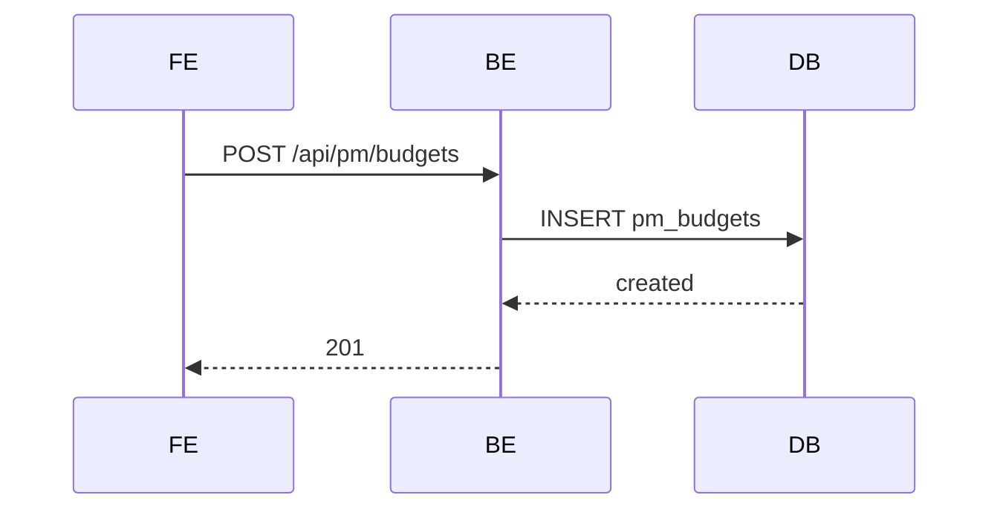
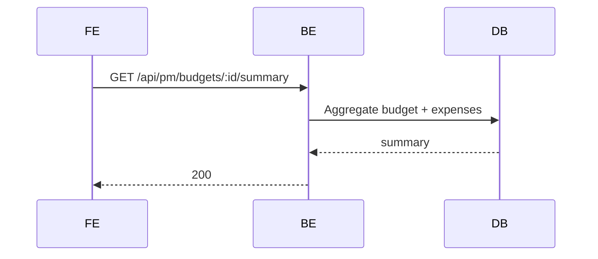
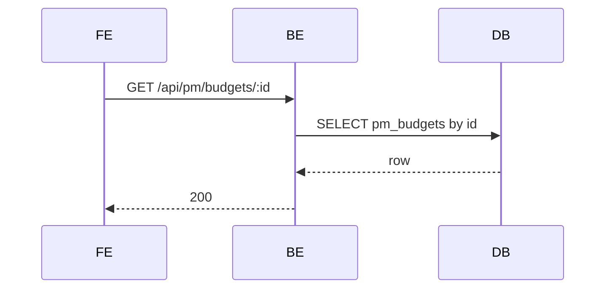
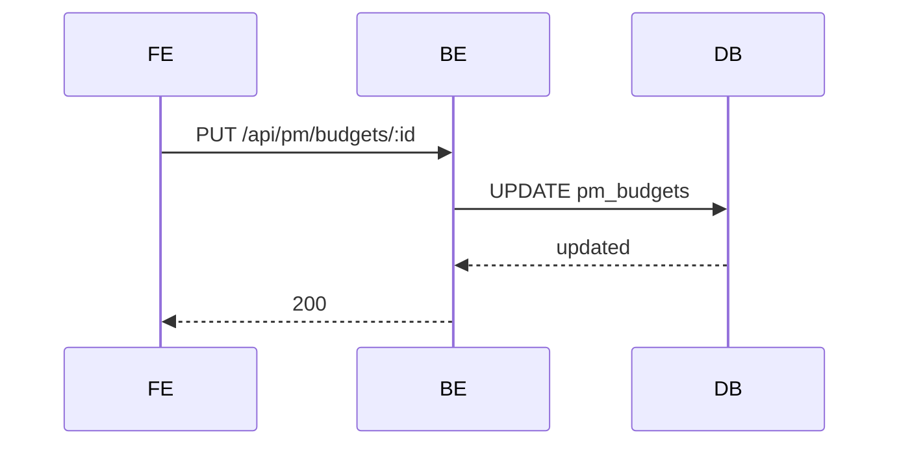
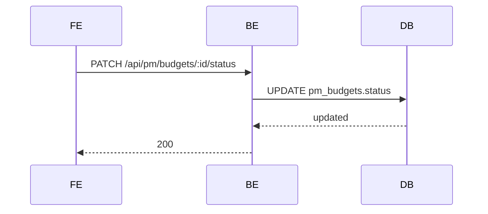
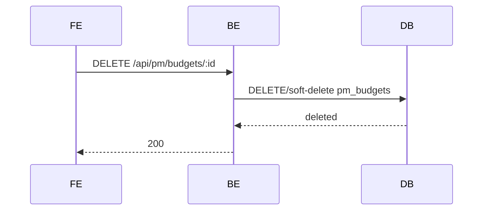

# PM Module - Budgets (Normalized)

อ้างอิง: `Documents/Release_1.md`

## API Inventory
- `GET /api/pm/budgets`
- `POST /api/pm/budgets`
- `GET /api/pm/budgets/:id/summary`
- `GET /api/pm/budgets/:id`
- `PUT /api/pm/budgets/:id`
- `PATCH /api/pm/budgets/:id/status`
- `DELETE /api/pm/budgets/:id`

## Endpoint Details

### API: `GET /api/pm/budgets`
**Purpose**: ดึงรายการงบประมาณ  
**FE Screen**: `/pm/budgets`  
**Params**: Path ไม่มี, Query `page`,`limit`,`search`,`status`,`projectId`  
**Request Headers**
```json
{ "Authorization": "Bearer <access_token>" }
```
**Request Body**
```json
{}
```
**Response Body (200)**
```json
{ "data": [], "meta": { "page": 1, "limit": 20, "total": 0 } }
```
**Sequence Diagram**


### API: `POST /api/pm/budgets`
**Purpose**: สร้างงบประมาณใหม่  
**FE Screen**: `/pm/budgets/new`  
**Params**: Path ไม่มี, Query ไม่มี  
**Request Headers**
```json
{ "Authorization": "Bearer <access_token>" }
```
**Request Body**
```json
{ "name": "Q2 Campaign", "amount": 200000 }
```
**Response Body (201)**
```json
{ "data": { "id": "bud_001" }, "message": "Created" }
```
**Sequence Diagram**


### API: `GET /api/pm/budgets/:id/summary`
**Purpose**: ดึงสรุป utilization ของ budget  
**FE Screen**: `/pm/budgets/:id`  
**Params**: Path `id`, Query ไม่มี  
**Request Headers**
```json
{ "Authorization": "Bearer <access_token>" }
```
**Request Body**
```json
{}
```
**Response Body (200)**
```json
{ "data": { "id": "bud_001", "utilizationPct": 42.5 } }
```
**Sequence Diagram**


### API: `GET /api/pm/budgets/:id`
**Purpose**: ดึงรายละเอียด budget  
**FE Screen**: `/pm/budgets/:id/edit`  
**Params**: Path `id`, Query ไม่มี  
**Request Headers**
```json
{ "Authorization": "Bearer <access_token>" }
```
**Request Body**
```json
{}
```
**Response Body (200)**
```json
{ "data": { "id": "bud_001" } }
```
**Sequence Diagram**


### API: `PUT /api/pm/budgets/:id`
**Purpose**: แก้ไข budget  
**FE Screen**: `/pm/budgets/:id/edit`  
**Params**: Path `id`, Query ไม่มี  
**Request Headers**
```json
{ "Authorization": "Bearer <access_token>" }
```
**Request Body**
```json
{ "name": "Q2 Campaign Updated" }
```
**Response Body (200)**
```json
{ "data": { "id": "bud_001" }, "message": "Updated" }
```
**Sequence Diagram**


### API: `PATCH /api/pm/budgets/:id/status`
**Purpose**: เปลี่ยนสถานะ budget  
**FE Screen**: `/pm/budgets`  
**Params**: Path `id`, Query ไม่มี  
**Request Headers**
```json
{ "Authorization": "Bearer <access_token>" }
```
**Request Body**
```json
{ "status": "active" }
```
**Response Body (200)**
```json
{ "data": { "id": "bud_001", "status": "active" }, "message": "Updated" }
```
**Sequence Diagram**


### API: `DELETE /api/pm/budgets/:id`
**Purpose**: ลบ budget (ตาม rule)  
**FE Screen**: `/pm/budgets`  
**Params**: Path `id`, Query ไม่มี  
**Request Headers**
```json
{ "Authorization": "Bearer <access_token>" }
```
**Request Body**
```json
{}
```
**Response Body (200)**
```json
{ "message": "Deleted" }
```
**Sequence Diagram**


## Coverage Lock Addendum (2026-04-16)

### Contract Usage Note
- ถ้าตัวอย่างด้านบนยังย่อเกินไปหรือมี placeholder semantics ให้ยึด addendum นี้เป็น authoritative contract ระดับ field สำหรับ budget APIs

### Canonical list / detail / summary contracts
- `GET /api/pm/budgets` query ที่ล็อกสำหรับ FE คือ `page`, `limit`, `search`, `status`, `projectId?`
- list item อย่างน้อยต้องมี `id`, `budgetCode`, `name`, `amount`, `usedAmount`, `remainingAmount`, `utilizationPct`, `status`, `startDate`, `endDate`, `updatedAt`
- ถ้า deployment มีการผูก budget กับ project จริง ให้คืน `projectId`; ถ้ายังไม่มี source linkage ให้ใช้ `null` หรือ omit แบบคงเส้นคงวา อย่าสร้างค่าจำลองใน FE
- `GET /api/pm/budgets/:id` ต้องคืน field ระดับ header เดียวกับ list item และเพิ่ม `description`, `createdBy`, `createdAt`
- `GET /api/pm/budgets/:id/summary` ต้องคืน `id`, `budgetCode`, `name`, `amount`, `usedAmount`, `remainingAmount`, `utilizationPct`, `status`, `expenses[]`
- `summary.expenses[]` อย่างน้อยต้องมี `id`, `expenseCode`, `title`, `amount`, `expenseDate`, `status`

### Write contracts / validation
- `POST /api/pm/budgets` และ `PUT /api/pm/budgets/:id` body ที่ล็อกคือ `name`, `amount`, `startDate?`, `endDate?`, `description?`, `projectId?`
- `budgetCode` เป็น server-generated field; client ห้ามส่ง override
- `usedAmount`, `remainingAmount`, `utilizationPct` เป็น computed/read-only fields
- validation ขั้นต่ำ: `name` required, `amount > 0`, และถ้าส่งทั้ง `startDate` กับ `endDate` ต้องเป็น `startDate <= endDate`
- `PATCH /api/pm/budgets/:id/status` body ใช้ `{ "status": "draft" | "active" | "on_hold" | "closed" }`
- response หลัง `POST`, `PUT`, `PATCH status` ต้องคืน snapshot ล่าสุดของ budget ใน `data`

### Delete / side effects / integrations
- `DELETE /api/pm/budgets/:id` ล็อก rule ว่าลบได้เฉพาะ `status = draft`
- ถ้าลบไม่ได้เพราะ status หรือ dependency ไม่ผ่าน ให้ตอบ `409` พร้อม error code/message ที่ FE ใช้แสดง blocked state ได้
- budget picker ใน PM expense / progress flows ให้ reuse `GET /api/pm/budgets?status=active`; ห้าม hardcode list ใน FE
- integration `POST /api/finance/integrations/pm-budgets/:budgetId/post-adjustment` เป็น cross-module integration trigger; เมื่อมีผลสำเร็จ FE ต้อง refresh ผ่าน `GET /api/pm/budgets/:id` หรือ `/summary`
- field อย่าง `committedAmount`, `actualSpend`, `availableAmount` จาก PO/AP linkage เป็น R2 cross-module extension; ถ้าระบบใด expose แล้วต้องให้ BE เป็นคนคำนวณและส่งกลับ ไม่ให้ FE derive เอง
