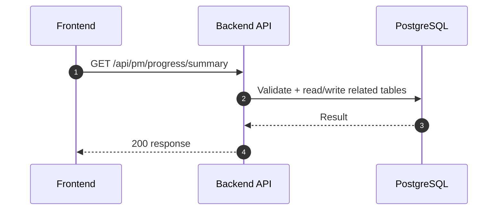
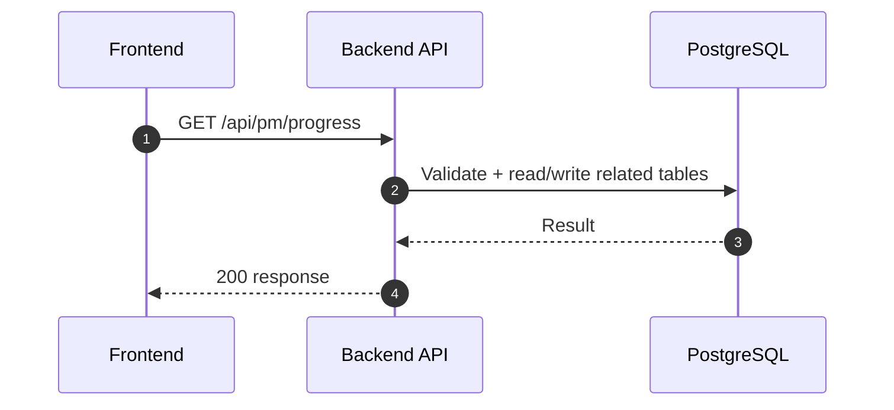
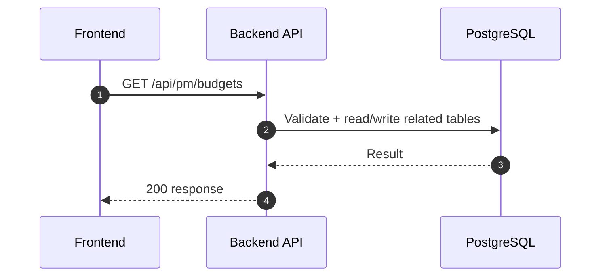
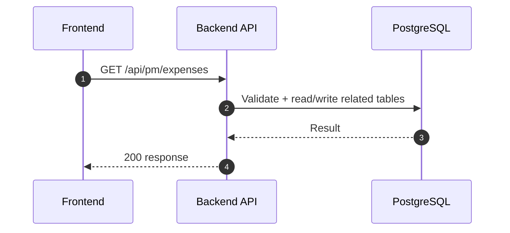

# PM Module - Dashboard (Normalized)

อ้างอิง: `Documents/Requirements/Release_1.md`

## API Inventory
- `GET /api/pm/progress/summary`
- `GET /api/pm/progress`
- `GET /api/pm/budgets`
- `GET /api/pm/expenses`

## Endpoint Details

### API: `GET /api/pm/progress/summary`

**Purpose**
- ดึงข้อมูล สำหรับ `GET /api/pm/progress/summary`

**FE Screen**
- อ้างอิงตามโมดูลของไฟล์นี้

**Params**
- Path Params: ไม่มี
- Query Params: `projectId?`, `assigneeId?`, `dateFrom?`, `dateTo?`, `budgetId?`

**Request Headers**
```json
{
  "Authorization": "Bearer <access_token>"
}
```

**Request Body**
```json
{}
```

**Response Body (200)**
```json
{
  "data": {
    "asOf": "2026-04-30T18:00:00Z",
    "total": 12,
    "todo": 3,
    "inProgress": 5,
    "done": 3,
    "cancelled": 1,
    "avgProgressPct": 61,
    "overdueCount": 2
  }
}
```

**Sequence Diagram**


### API: `GET /api/pm/progress`

**Purpose**
- ดึงข้อมูล สำหรับ `GET /api/pm/progress`

**FE Screen**
- อ้างอิงตามโมดูลของไฟล์นี้

**Params**
- Path Params: ไม่มี
- Query Params: `page`, `limit`, `status?`, `sortBy=updatedAt|dueDate`, `sortOrder=asc|desc`

**Request Headers**
```json
{
  "Authorization": "Bearer <access_token>"
}
```

**Request Body**
```json
{}
```

**Response Body (200)**
```json
{
  "data": {}
}
```

**Sequence Diagram**


### API: `GET /api/pm/budgets`

**Purpose**
- ดึงข้อมูล สำหรับ `GET /api/pm/budgets`

**FE Screen**
- อ้างอิงตามโมดูลของไฟล์นี้

**Params**
- Path Params: ไม่มี
- Query Params: รองรับตาม requirement ของ endpoint (pagination/filter/date range ถ้ามี)

**Request Headers**
```json
{
  "Authorization": "Bearer <access_token>"
}
```

**Request Body**
```json
{}
```

**Response Body (200)**
```json
{
  "data": {}
}
```

**Sequence Diagram**


### API: `GET /api/pm/expenses`

**Purpose**
- ดึงข้อมูล สำหรับ `GET /api/pm/expenses`

**FE Screen**
- อ้างอิงตามโมดูลของไฟล์นี้

**Params**
- Path Params: ไม่มี
- Query Params: รองรับตาม requirement ของ endpoint (pagination/filter/date range ถ้ามี)

**Request Headers**
```json
{
  "Authorization": "Bearer <access_token>"
}
```

**Request Body**
```json
{}
```

**Response Body (200)**
```json
{
  "data": {}
}
```

**Sequence Diagram**


---

## Coverage Lock Addendum (2026-04-16)

### Widget Contracts
- `GET /api/pm/progress/summary`
  - Query: `projectId?`, `assigneeId?`, `dateFrom?`, `dateTo?`, `budgetId?`
  - response ต้องมี `asOf`, `total`, `todo`, `inProgress`, `done`, `cancelled`, `avgProgressPct`, `overdueCount`
- `GET /api/pm/progress`
  - ใช้สำหรับ recent tasks widget
  - Query: `page`, `limit`, `status?`, `sortBy=updatedAt|dueDate`, `sortOrder=asc|desc`
  - row อย่างน้อย: `id`, `title`, `status`, `priority`, `assigneeName`, `dueDate`, `progressPct`, `isOverdue`
- `GET /api/pm/budgets`
  - ใช้สำหรับ budget utilization widget
  - row อย่างน้อย: `id`, `budgetCode`, `name`, `amount`, `usedAmount`, `utilizationPct`, `status`
- `GET /api/pm/expenses`
  - ใช้สำหรับ expense overview widget
  - row อย่างน้อย: `id`, `expenseCode`, `title`, `amount`, `status`, `expenseDate`, `budgetName`

### Freshness / Permission Rules
- ทุก widget response ที่ใช้ใน PM dashboard ควรมี `meta.asOf`
- ถ้า user ไม่มีสิทธิ์ PM module ให้ block endpoint ด้วย `403` แทนการคืนข้อมูลบางส่วน
