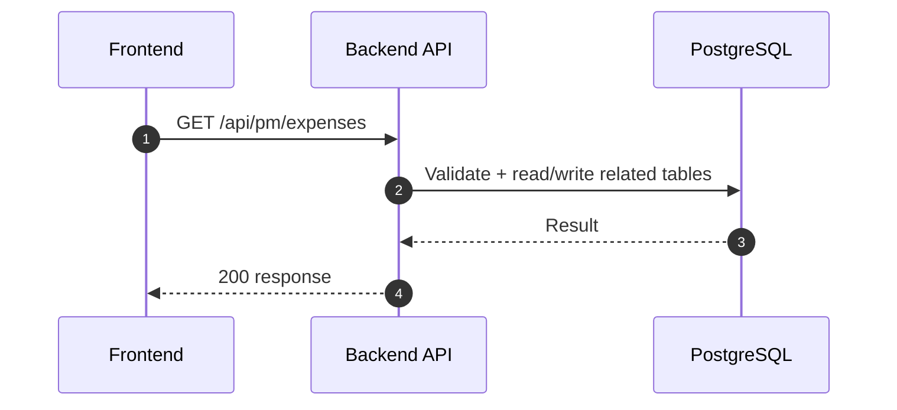
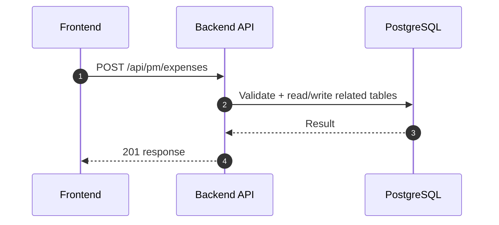
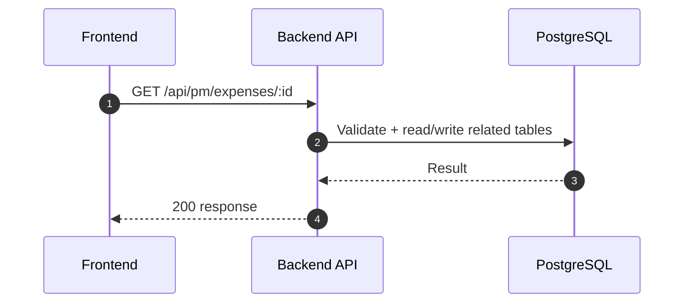
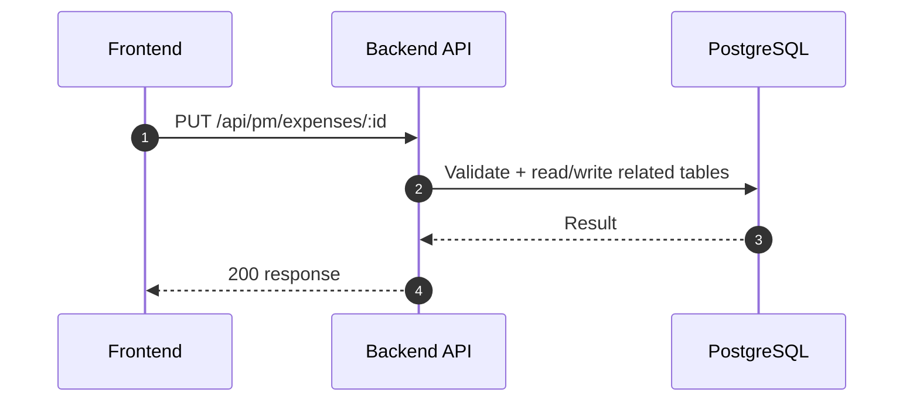
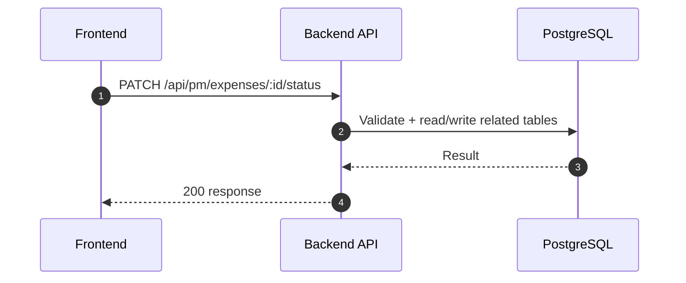
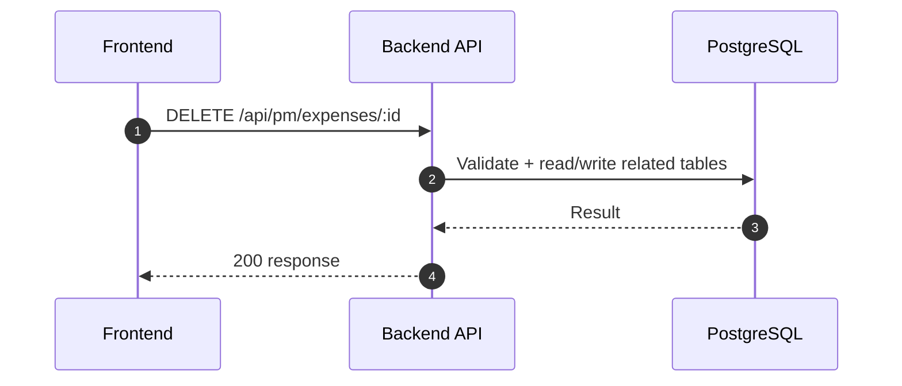

# PM Module - Expenses (Normalized)

อ้างอิง: `Documents/Release_1.md`

## API Inventory

- `GET /api/pm/expenses`
- `POST /api/pm/expenses`
- `GET /api/pm/expenses/:id`
- `PUT /api/pm/expenses/:id`
- `PATCH /api/pm/expenses/:id/status`
- `DELETE /api/pm/expenses/:id`

## Endpoint Details

### API: `GET /api/pm/expenses`

**Purpose**

- ดึงข้อมูล สำหรับ `GET /api/pm/expenses`

**FE Screen**

- อ้างอิงตามโมดูลของไฟล์นี้

**Params**

- Path Params: ไม่มี
- Query Params: รองรับตาม requirement ของ endpoint (pagination/filter/date range ถ้ามี)

**Request Headers**

```json
{
  "Authorization": "Bearer <access_token>"
}
```

**Request Body**

```json
{}
```

**Response Body (200)**

```json
{
  "data": {}
}
```

**Sequence Diagram**




### API: `POST /api/pm/expenses`

**Purpose**

- สร้าง/ดำเนินการ สำหรับ `POST /api/pm/expenses`

**FE Screen**

- อ้างอิงตามโมดูลของไฟล์นี้

**Params**

- Path Params: ไม่มี
- Query Params: รองรับตาม requirement ของ endpoint (pagination/filter/date range ถ้ามี)

**Request Headers**

```json
{
  "Authorization": "Bearer <access_token>"
}
```

**Request Body**

```json
{}
```

**Response Body (201)**

```json
{
  "data": {},
  "message": "Success"
}
```

**Sequence Diagram**




### API: `GET /api/pm/expenses/:id`

**Purpose**

- ดึงข้อมูล สำหรับ `GET /api/pm/expenses/:id`

**FE Screen**

- อ้างอิงตามโมดูลของไฟล์นี้

**Params**

- Path Params: มี (`id`/ตัวแปร path ตาม endpoint)
- Query Params: รองรับตาม requirement ของ endpoint (pagination/filter/date range ถ้ามี)

**Request Headers**

```json
{
  "Authorization": "Bearer <access_token>"
}
```

**Request Body**

```json
{}
```

**Response Body (200)**

```json
{
  "data": {}
}
```

**Sequence Diagram**




### API: `PUT /api/pm/expenses/:id`

**Purpose**

- อัปเดตข้อมูล สำหรับ `PUT /api/pm/expenses/:id`

**FE Screen**

- อ้างอิงตามโมดูลของไฟล์นี้

**Params**

- Path Params: มี (`id`/ตัวแปร path ตาม endpoint)
- Query Params: รองรับตาม requirement ของ endpoint (pagination/filter/date range ถ้ามี)

**Request Headers**

```json
{
  "Authorization": "Bearer <access_token>"
}
```

**Request Body**

```json
{}
```

**Response Body (200)**

```json
{
  "data": {},
  "message": "Success"
}
```

**Sequence Diagram**




### API: `PATCH /api/pm/expenses/:id/status`

**Purpose**

- อัปเดตบางส่วน สำหรับ `PATCH /api/pm/expenses/:id/status`

**FE Screen**

- อ้างอิงตามโมดูลของไฟล์นี้

**Params**

- Path Params: มี (`id`/ตัวแปร path ตาม endpoint)
- Query Params: รองรับตาม requirement ของ endpoint (pagination/filter/date range ถ้ามี)

**Request Headers**

```json
{
  "Authorization": "Bearer <access_token>"
}
```

**Request Body**

```json
{}
```

**Response Body (200)**

```json
{
  "data": {},
  "message": "Success"
}
```

**Sequence Diagram**




### API: `DELETE /api/pm/expenses/:id`

**Purpose**

- ลบข้อมูล สำหรับ `DELETE /api/pm/expenses/:id`

**FE Screen**

- อ้างอิงตามโมดูลของไฟล์นี้

**Params**

- Path Params: มี (`id`/ตัวแปร path ตาม endpoint)
- Query Params: รองรับตาม requirement ของ endpoint (pagination/filter/date range ถ้ามี)

**Request Headers**

```json
{
  "Authorization": "Bearer <access_token>"
}
```

**Request Body**

```json
{}
```

**Response Body (200)**

```json
{
  "message": "Deleted successfully"
}
```

**Sequence Diagram**




## Coverage Lock Addendum (2026-04-16)

### Contract Usage Note

- ตัวอย่างด้านบนยังเป็น baseline แบบย่อ; ถ้ามีข้อขัดกันเรื่อง field-level detail ให้ยึด addendum นี้เป็นหลักสำหรับ expense workflow

### Canonical list / detail contracts

- `GET /api/pm/expenses` query ที่ล็อกคือ `page`, `limit`, `search`, `status`, `budgetId`, `dateFrom?`, `dateTo?`
- FE อาจใช้ `dateRange` ภายในหน้าได้ แต่เวลาเรียก API ต้อง map เป็น `dateFrom` / `dateTo`
- list item อย่างน้อยต้องมี `id`, `expenseCode`, `budgetId`, `budgetCode?`, `budgetName?`, `title`, `amount`, `expenseDate`, `status`, `receiptUrl?`, `updatedAt`
- `GET /api/pm/expenses/:id` ต้องคืน field ระดับ header เดียวกับ list item และเพิ่ม `description`, `approvedBy?`, `approvedAt?`, `rejectedAt?`, `rejectReason?`, `createdBy`, `createdAt`

### Write contracts / workflow validation

- `POST /api/pm/expenses` และ `PUT /api/pm/expenses/:id` body ที่ล็อกคือ `budgetId`, `title`, `amount`, `expenseDate`, `description?`, `receiptUrl?`
- `expenseCode` เป็น server-generated field; `status`, `approvedBy`, `approvedAt`, `rejectedAt`, `rejectReason` เป็น server-managed fields
- validation ขั้นต่ำ: `title` required, `amount > 0`, `expenseDate` required, `budgetId` ต้องอ้าง budget ที่มีอยู่จริง
- budget picker สำหรับ create / edit ให้ใช้ `GET /api/pm/budgets?status=active`
- `PUT /api/pm/expenses/:id` และ `DELETE /api/pm/expenses/:id` ใช้ได้เฉพาะ `status = draft`
- `PATCH /api/pm/expenses/:id/status` body ที่ล็อกคือ:
  - submit: `{ "status": "submitted" }`
  - approve: `{ "status": "approved" }`
  - reject: `{ "status": "rejected", "reason": "..." }`
- reject ต้องมี `reason`; approve/reject ใช้ได้เฉพาะรายการที่อยู่ใน `submitted`

### Response / warnings / side effects

- response หลัง `POST`, `PUT`, `PATCH status` ต้องคืน snapshot ล่าสุดของ expense ใน `data`
- ถ้ารายการนี้ทำให้ใช้งบเกิน ให้ตอบ `warnings[]` แทนการเงียบ โดย item อย่างน้อยต้องมี `code`, `message`, `budgetId`
- over-budget เป็น canonical warning state ของ expense flow; จะ block หรือไม่ให้ยึด business rule ของ endpoint แต่ FE ต้องอ่านคำเตือนจาก response ไม่ใช่คำนวณเอง
- เมื่อ `status = approved` ระบบต้อง update `pm_budgets.usedAmount` และ trigger `POST /api/finance/integrations/pm-expenses/:expenseId/post`
- receipt flow ให้ยึด `receiptUrl` เป็น canonical field; ถ้ามี upload step แยก ระบบต้อง resolve เป็น `receiptUrl` ก่อน submit expense

