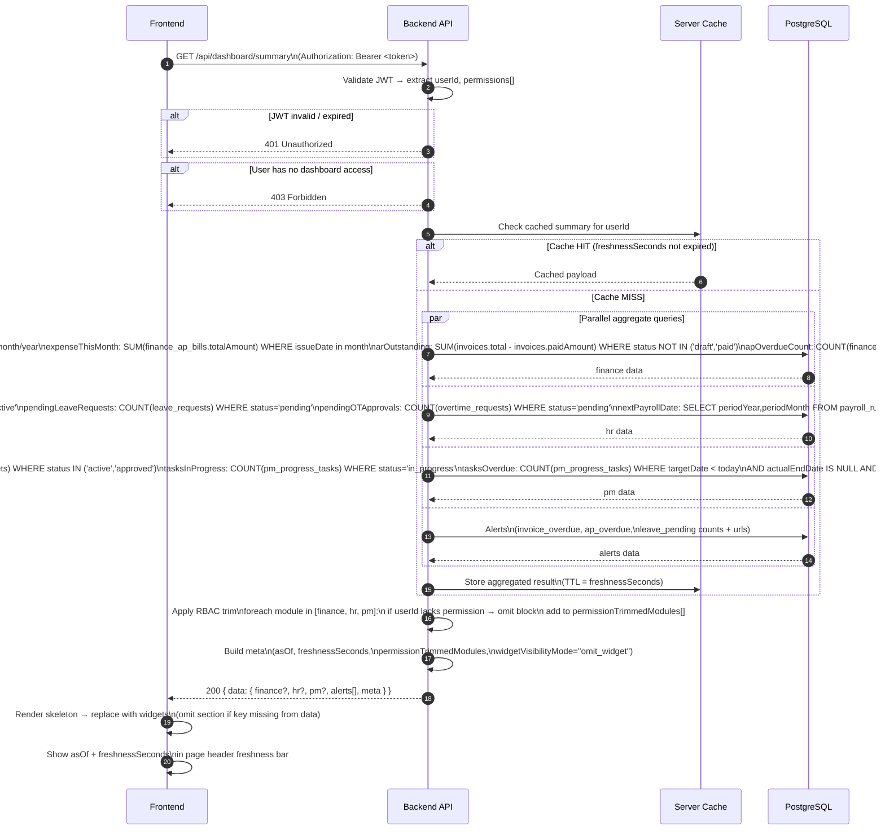
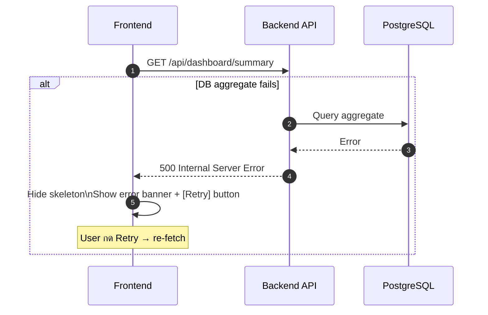

# Global Dashboard (Normalized)

อ้างอิง: `Documents/Release_2.md` (Feature 3.13) · `Documents/UX_Flow/Functions/R2-13_Global_Dashboard.md`

## API Inventory

| Method | Path | คำอธิบาย |
|--------|------|---------|
| `GET` | `/api/dashboard/summary` | Cross-module KPI summary สำหรับ /dashboard |

---

## Endpoint Details

### API: `GET /api/dashboard/summary`

**Purpose**
- Aggregate KPI จากหลายโมดูล (Finance, HR, PM) + Alerts ในการเรียกครั้งเดียว
- BE ตรวจสิทธิ์และ omit module block ที่ user ไม่มีสิทธิ์ก่อนคืน response
- ผล aggregate อาจมาจาก cache (freshnessSeconds ≤ 300) — BE กำหนดเอง

**FE Screen**
- `/dashboard` — GlobalDashboard page (2-column layout: widgets left, alerts right)

**Params**
- Path Params: ไม่มี
- Query Params: ไม่มี

**Request Headers**
```json
{
  "Authorization": "Bearer <access_token>"
}
```

**Request Body**
```json
{}
```

**Response Body (200)**
```json
{
  "data": {
    "finance": {
      "revenueThisMonth": 850000,
      "revenueYTD": 3200000,
      "expenseThisMonth": 420000,
      "arOutstanding": 280000,
      "apOverdueCount": 3,
      "netProfitThisMonth": 430000,
      "cashBalance": 1250000
    },
    "hr": {
      "totalHeadcount": 42,
      "pendingLeaveRequests": 5,
      "nextPayrollDate": "2026-04-30",
      "pendingOTApprovals": 2
    },
    "pm": {
      "activeBudgets": 8,
      "tasksInProgress": 23,
      "tasksOverdue": 4,
      "avgBudgetUtilization": 62
    },
    "alerts": [
      { "type": "invoice_overdue", "count": 3, "url": "/finance/reports/ar-aging" },
      { "type": "ap_overdue",      "count": 2, "url": "/finance/ap" },
      { "type": "leave_pending",   "count": 5, "url": "/hr/leaves" }
    ],
    "meta": {
      "asOf": "2026-04-16T10:30:00Z",
      "freshnessSeconds": 300,
      "permissionTrimmedModules": [],
      "widgetVisibilityMode": "omit_widget"
    }
  }
}
```

> ถ้า user ไม่มีสิทธิ์โมดูลใด BE จะ **omit** key นั้นออกจาก `data`
> และ list โมดูลนั้นใน `permissionTrimmedModules[]`
> ตัวอย่าง: user ไม่มีสิทธิ์ finance → `data.finance` ไม่มีใน response,
> `permissionTrimmedModules: ["finance"]`

**Error Responses**

| Status | Trigger | Body |
|--------|---------|------|
| 401 | JWT ไม่มี / หมดอายุ | `{ "error": "Unauthorized" }` |
| 403 | User ไม่มีสิทธิ์เข้า `/dashboard` เลย | `{ "error": "Forbidden" }` |
| 500 | DB aggregate query ล้มเหลว | `{ "error": "Internal server error" }` |

---

**DB Tables queried (read-only aggregate)**

| Module | Tables | หมายเหตุ |
|--------|--------|---------|
| Finance | `invoices`, `finance_ap_bills` | `arOutstanding` คำนวณจาก `invoices.total − invoices.paidAmount` โดยตรง — ไม่มีตาราง `invoice_payments` แยก |
| Finance (`cashBalance`) | `bank_accounts` | ⚠️ ขึ้นอยู่กับ Feature 3.5 — ตารางนี้ยังไม่ถูกสร้างจนกว่า F3.5 จะ implement; ดู **Dependency Note** ด้านล่าง |
| HR | `employees`, `leave_requests`, `payroll_runs`, `overtime_requests` | |
| PM | `pm_budgets`, `pm_progress_tasks`, `pm_expenses` | `avgBudgetUtilization` ต้อง join `pm_expenses` |
| Alerts | `invoices`, `finance_ap_bills`, `leave_requests` | aggregate จากตารางข้างต้น |

---

**Sequence Diagram — Happy Path**



---

**Sequence Diagram — Error Path**



---

## Field Computation Logic

### Finance

| Field | Formula / Query logic |
|-------|----------------------|
| `revenueThisMonth` | `SUM(invoices.total)` WHERE `issueDate` ในเดือนปัจจุบัน AND `status NOT IN ('draft','cancelled')` |
| `revenueYTD` | `SUM(invoices.total)` WHERE `issueDate` ในปีงบประมาณปัจจุบัน AND `status NOT IN ('draft','cancelled')` |
| `expenseThisMonth` | `SUM(finance_ap_bills.totalAmount)` WHERE `issueDate` ในเดือนปัจจุบัน AND `status NOT IN ('draft','rejected')` |
| `arOutstanding` | `SUM(invoices.total - invoices.paidAmount)` WHERE `status NOT IN ('draft','paid','cancelled')` — **ไม่ใช้ตาราง invoice_payments แยก** |
| `apOverdueCount` | `COUNT(finance_ap_bills)` WHERE `dueDate < CURRENT_DATE` AND `status NOT IN ('paid','rejected')` |
| `netProfitThisMonth` | `revenueThisMonth − expenseThisMonth` (simple subtraction — ไม่ใช่ GL-based) |
| `cashBalance` | `SUM(bank_accounts.balance)` — **⚠️ ต้องการ Feature 3.5** ดู Dependency Note |

### HR

| Field | Formula / Query logic |
|-------|----------------------|
| `totalHeadcount` | `COUNT(employees)` WHERE `status = 'active'` |
| `pendingLeaveRequests` | `COUNT(leave_requests)` WHERE `status = 'pending'` |
| `pendingOTApprovals` | `COUNT(overtime_requests)` WHERE `status = 'pending'` |
| `nextPayrollDate` | `SELECT periodYear, periodMonth FROM payroll_runs` WHERE `status NOT IN ('completed', 'paid')` ORDER BY `periodYear ASC, periodMonth ASC` LIMIT 1 → derive เป็น `LAST_DAY(periodYear-periodMonth-01)` เพื่อให้ได้วันสุดท้ายของรอบนั้น; ถ้าไม่มี run ที่ pending → คืน `null` |

### PM

| Field | Formula / Query logic |
|-------|----------------------|
| `activeBudgets` | `COUNT(pm_budgets)` WHERE `status IN ('active', 'approved')` |
| `tasksInProgress` | `COUNT(pm_progress_tasks)` WHERE `status = 'in_progress'` |
| `tasksOverdue` | `COUNT(pm_progress_tasks)` WHERE `targetDate < CURRENT_DATE` AND `actualEndDate IS NULL` AND `status != 'completed'` |
| `avgBudgetUtilization` | `AVG(utilization_per_budget)` WHERE `utilization_per_budget = COALESCE(SUM(pm_expenses.amount), 0) / NULLIF(pm_budgets.totalAmount, 0) * 100` JOIN `pm_expenses ON pm_expenses.budgetId = pm_budgets.id` GROUP BY `pm_budgets.id` |

### Alerts

| Alert type | Query logic | URL |
|-----------|------------|-----|
| `invoice_overdue` | `COUNT(invoices)` WHERE `dueDate < CURRENT_DATE` AND `status NOT IN ('paid','draft','cancelled')` | `/finance/reports/ar-aging` |
| `ap_overdue` | `COUNT(finance_ap_bills)` WHERE `dueDate < CURRENT_DATE` AND `status NOT IN ('paid','rejected')` | `/finance/ap` |
| `leave_pending` | `COUNT(leave_requests)` WHERE `status = 'pending'` | `/hr/leaves` |

> Alert row ที่มี `count = 0` ให้ **omit ออกจาก array** — ไม่ส่ง item count=0 กลับไป FE

---

## Dependency Note — cashBalance (Feature 3.5)

`cashBalance` ต้องการตาราง `bank_accounts` ซึ่งเป็นส่วนหนึ่งของ **Feature 3.5 Cash / Bank Management**

**Behavior ตาม implementation state:**

| สถานะ F3.5 | การจัดการที่ BE |
|------------|----------------|
| F3.5 ยังไม่ implement | omit `finance.cashBalance` key ออกจาก response; FE แสดง `—` หรือซ่อน tile นี้ |
| F3.5 implement แล้ว | `SUM(bank_accounts.balance)` WHERE `isActive = true` |

ห้าม return `cashBalance: null` หรือ `cashBalance: 0` กรณีตารางยังไม่มี — ให้ omit key เท่านั้น

---

## Coverage Lock Addendum (2026-04-16)

### Response Shape Lock

- `GET /api/dashboard/summary` ต้องคืน payload 4 ส่วนหลัก:
  - `finance` — scalar widgets ฝั่งการเงิน (7 fields)
  - `hr` — scalar widgets ฝั่งบุคคล (4 fields)
  - `pm` — scalar widgets ฝั่งโครงการ (4 fields)
  - `alerts[]` — สิ่งที่ต้อง action พร้อม deep link (`type`, `count`, `url`)
- `meta` ต้องมีเสมอ: `asOf`, `freshnessSeconds`, `permissionTrimmedModules[]`, `widgetVisibilityMode`

### Widget Type Rules

| Widget type | ตัวอย่าง field |
|-------------|--------------|
| scalar | `totalHeadcount`, `cashBalance`, `apOverdueCount` |
| series | `revenueThisMonth` + `revenueYTD` (MTD/YTD pair) |
| progress | `avgBudgetUtilization` (0–100 %) |
| alert item | `alerts[].type`, `.count`, `.url` |

SD และ UX ต้องอ้างประเภท widget เดียวกันเพื่อไม่ให้ตีความ payload ต่างกัน

### RBAC / Trim Rules

- `widgetVisibilityMode = omit_widget` (canonical)
- ถ้าผู้ใช้ไม่มีสิทธิ์ module ใด BE **omit** key นั้นออกจาก `data` ทั้งก้อน — ห้ามคืน `null` หรือ `{}`
- `permissionTrimmedModules[]` ใช้สำหรับ FE empty-state messaging เท่านั้น ห้ามให้ FE คำนวณสิทธิ์เองจาก field นี้
