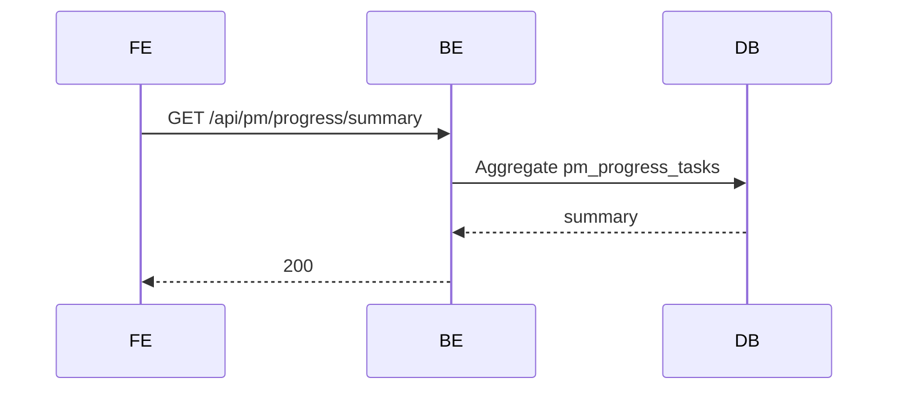
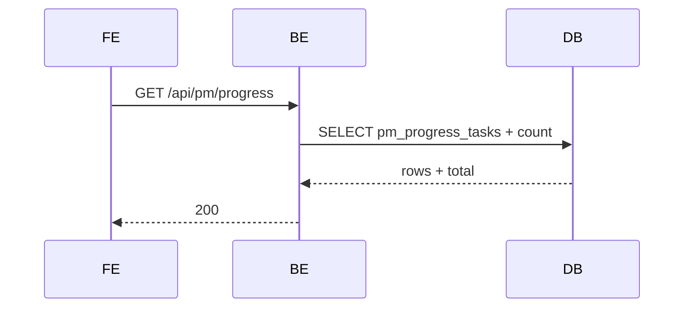
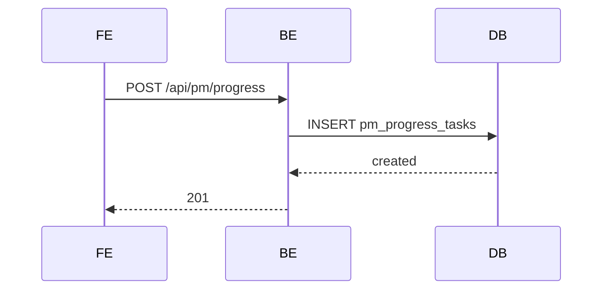
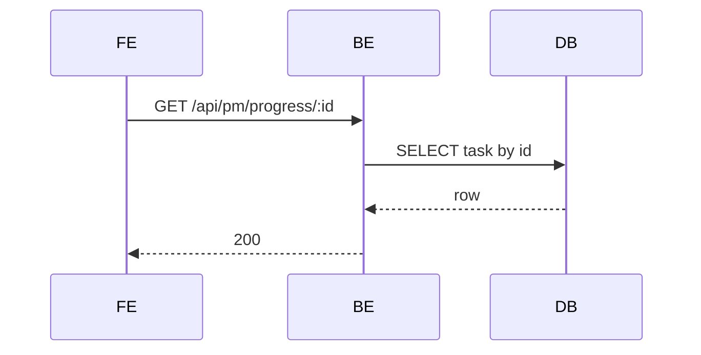
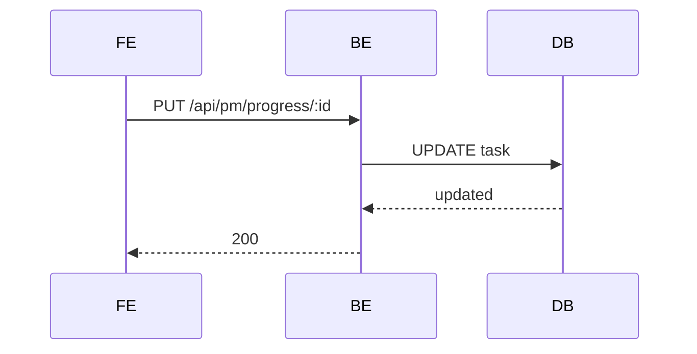
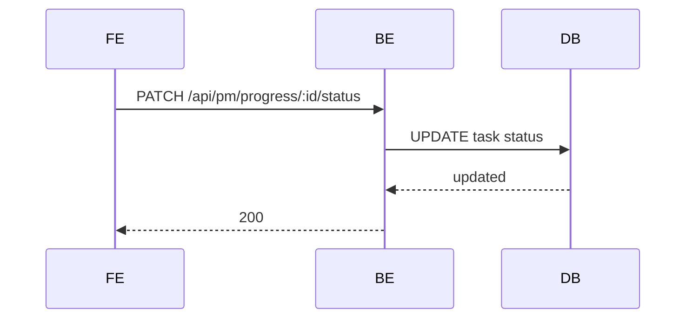
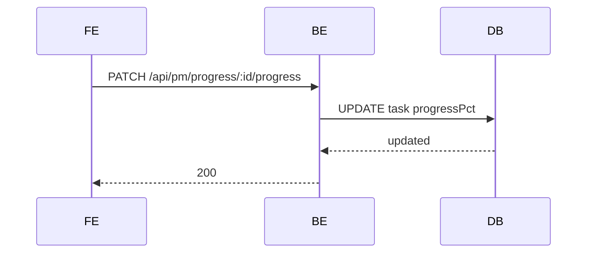
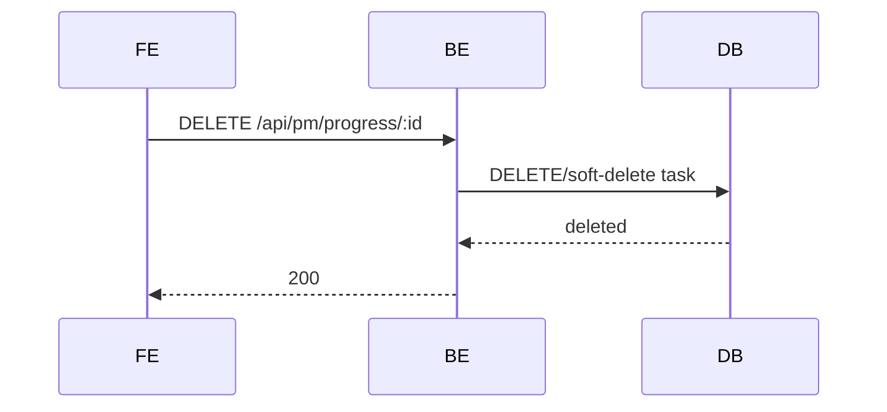

# PM Module - Progress (Normalized)

อ้างอิง: `Documents/Requirements/Release_1.md`

## API Inventory
- `GET /api/pm/progress/summary`
- `GET /api/pm/progress`
- `POST /api/pm/progress`
- `GET /api/pm/progress/:id`
- `PUT /api/pm/progress/:id`
- `PATCH /api/pm/progress/:id/status`
- `PATCH /api/pm/progress/:id/progress`
- `DELETE /api/pm/progress/:id`

## Endpoint Details

### API: `GET /api/pm/progress/summary`
**Purpose**: ดึง KPI summary ของงาน  
**FE Screen**: `/pm/progress`  
**Params**: Path ไม่มี, Query `projectId?`,`assigneeId?`,`dateFrom?`,`dateTo?`,`budgetId?`  
**Request Headers**
```json
{ "Authorization": "Bearer <access_token>" }
```
**Request Body**
```json
{}
```
**Response Body (200)**
```json
{
  "data": {
    "asOf": "2026-04-30T18:00:00Z",
    "total": 12,
    "todo": 3,
    "inProgress": 5,
    "done": 3,
    "cancelled": 1,
    "avgProgressPct": 61,
    "overdueCount": 2
  }
}
```
**Sequence Diagram**


### API: `GET /api/pm/progress`
**Purpose**: ดึงรายการ tasks  
**FE Screen**: `/pm/progress`  
**Params**: Path ไม่มี, Query `page`,`limit`,`search`,`status`,`priority`,`assigneeId?`,`projectId?`,`sortBy?`,`sortOrder?`  
**Request Headers**
```json
{ "Authorization": "Bearer <access_token>" }
```
**Request Body**
```json
{}
```
**Response Body (200)**
```json
{ "data": [], "meta": { "page": 1, "limit": 20, "total": 0 } }
```
**Sequence Diagram**


### API: `POST /api/pm/progress`
**Purpose**: สร้าง task ใหม่  
**FE Screen**: `/pm/progress/new`  
**Params**: Path ไม่มี, Query ไม่มี  
**Request Headers**
```json
{ "Authorization": "Bearer <access_token>" }
```
**Request Body**
```json
{ "title": "Task A", "assigneeId": "emp_001" }
```
**Response Body (201)**
```json
{ "data": { "id": "task_001" }, "message": "Created" }
```
**Sequence Diagram**


### API: `GET /api/pm/progress/:id`
**Purpose**: ดึงรายละเอียด task  
**FE Screen**: `/pm/progress/:id/edit`  
**Params**: Path `id`, Query ไม่มี  
**Request Headers**
```json
{ "Authorization": "Bearer <access_token>" }
```
**Request Body**
```json
{}
```
**Response Body (200)**
```json
{ "data": { "id": "task_001" } }
```
**Sequence Diagram**


### API: `PUT /api/pm/progress/:id`
**Purpose**: แก้ไข task  
**FE Screen**: `/pm/progress/:id/edit`  
**Params**: Path `id`, Query ไม่มี  
**Request Headers**
```json
{ "Authorization": "Bearer <access_token>" }
```
**Request Body**
```json
{ "title": "Task A Updated" }
```
**Response Body (200)**
```json
{ "data": { "id": "task_001" }, "message": "Updated" }
```
**Sequence Diagram**


### API: `PATCH /api/pm/progress/:id/status`
**Purpose**: เปลี่ยนสถานะ task  
**FE Screen**: `/pm/progress`  
**Params**: Path `id`, Query ไม่มี  
**Request Headers**
```json
{ "Authorization": "Bearer <access_token>" }
```
**Request Body**
```json
{ "status": "done" }
```
**Response Body (200)**
```json
{ "data": { "id": "task_001", "status": "done" }, "message": "Updated" }
```
**Sequence Diagram**


### API: `PATCH /api/pm/progress/:id/progress`
**Purpose**: อัปเดตเปอร์เซ็นต์ความคืบหน้า  
**FE Screen**: `/pm/progress`  
**Params**: Path `id`, Query ไม่มี  
**Request Headers**
```json
{ "Authorization": "Bearer <access_token>" }
```
**Request Body**
```json
{ "progressPct": 75 }
```
**Response Body (200)**
```json
{ "data": { "id": "task_001", "progressPct": 75 }, "message": "Updated" }
```
**Sequence Diagram**


### API: `DELETE /api/pm/progress/:id`
**Purpose**: ลบ task  
**FE Screen**: `/pm/progress`  
**Params**: Path `id`, Query ไม่มี  
**Request Headers**
```json
{ "Authorization": "Bearer <access_token>" }
```
**Request Body**
```json
{}
```
**Response Body (200)**
```json
{ "message": "Deleted" }
```
**Sequence Diagram**


## Coverage Lock Addendum (2026-04-16)

### Contract Usage Note
- sections ด้านบนเป็น baseline inventory; ถ้ามีจุดที่ย่อเกินไปหรือยังไม่ล็อก field-level semantics ให้ยึด addendum นี้เป็น source of truth

### Summary / list / detail contracts
- `GET /api/pm/progress/summary` query ที่ล็อกคือ `projectId?`, `assigneeId?`, `dateFrom?`, `dateTo?`, `budgetId?`
- summary response ต้องมี `asOf`, `total`, `todo`, `inProgress`, `done`, `cancelled`, `avgProgressPct`, `overdueCount`
- `GET /api/pm/progress` query ที่ล็อกคือ `page`, `limit`, `search`, `status`, `priority`, `assigneeId?`, `projectId?`
- list item อย่างน้อยต้องมี `id`, `title`, `assigneeId?`, `assigneeName?`, `priority`, `status`, `progressPct`, `startDate`, `dueDate`, `completedDate?`, `isOverdue`, `budgetId?`, `updatedAt`
- recent-task list ที่ reuse `GET /api/pm/progress` ต้องรองรับ `sortBy=updatedAt|dueDate` และ `sortOrder=asc|desc` เพื่อให้ dashboard กับ progress list อ้าง endpoint เดียวกันได้โดยไม่ตีความเอง
- ถ้า deployment ยังไม่มี project linkage สำหรับ progress rows ให้ `projectId` เป็น `null` หรือ omit แบบคงเส้นคงวา; FE ห้าม derive เองจาก path/screen context
- `GET /api/pm/progress/:id` ต้องคืน field ระดับ header เดียวกับ list item และเพิ่ม `description`, `createdBy`, `createdAt`

### Write / patch contracts
- `POST /api/pm/progress` และ `PUT /api/pm/progress/:id` body ที่ล็อกคือ `title`, `description?`, `assigneeId?`, `priority?`, `status?`, `progressPct?`, `startDate?`, `dueDate?`, `budgetId?`
- validation ขั้นต่ำ: `title` required, `progressPct` ต้องอยู่ในช่วง `0-100`, `assigneeId` ถ้าส่งมาต้องอ้าง active employee, `budgetId` ถ้าส่งมาต้องอ้าง budget ที่เลือกได้จริง
- assignee picker ให้ reuse employee source ที่ filter active ตาม contract กลางของ HR; budget picker ให้ reuse `GET /api/pm/budgets?status=active`
- `PATCH /api/pm/progress/:id/status` body ใช้ `{ "status": "todo" | "in_progress" | "done" | "cancelled" }`
- เมื่อ status เปลี่ยนเป็น `done` ระบบต้อง set `completedDate` อัตโนมัติ; ถ้าออกจาก `done` ต้อง clear `completedDate` ให้สอดคล้อง
- `PATCH /api/pm/progress/:id/progress` body ใช้ `{ "progressPct": <0-100> }`
- progress endpoint และ status endpoint เป็นคนละ contract; FE ห้าม assume ว่า `progressPct = 100` จะเปลี่ยน status ให้เอง ถ้าไม่ได้ response จาก BE

### Delete / refresh rules
- response หลัง `POST`, `PUT`, `PATCH status`, `PATCH progress` ต้องคืน snapshot ล่าสุดของ task ใน `data`
- `DELETE /api/pm/progress/:id` ถ้าถูก block ด้วย business rule ต้องตอบ `409` พร้อม reason ที่ FE ใช้แสดง blocked state ได้
- หลัง mutation ทุกชนิด หน้า progress list และ summary ต้อง refresh จาก API response/query invalidation ไม่ให้ FE คำนวณ `isOverdue` หรือ KPI aggregate ค้างเอง
