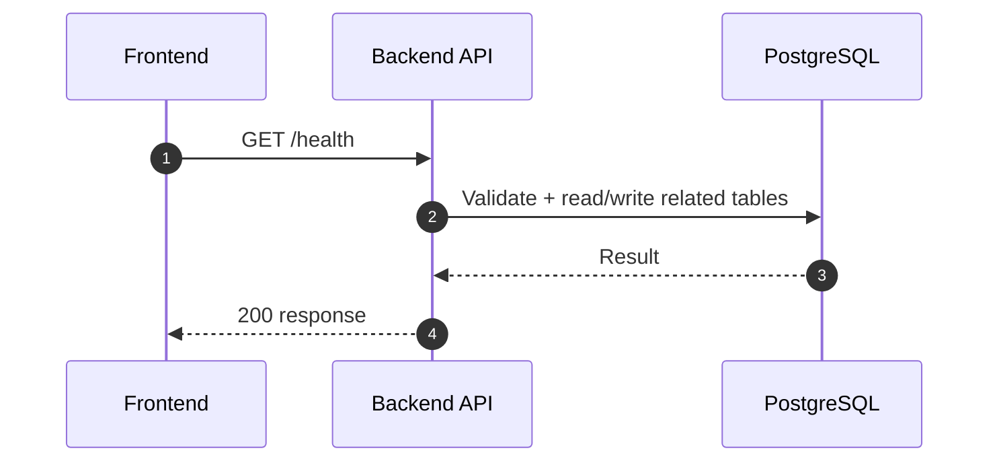
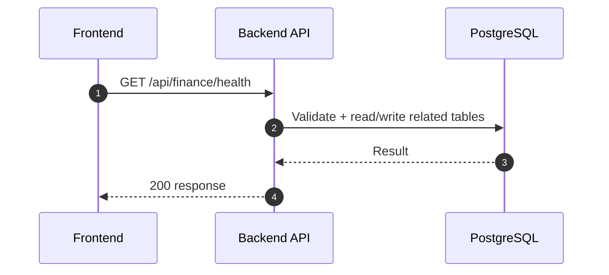
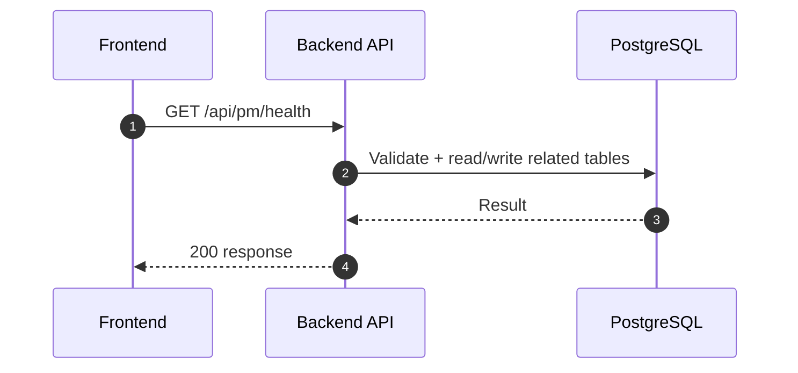

# Health Check (Normalized)

อ้างอิง: `Documents/Release_1.md`

## API Inventory
- `GET /health`
- `GET /api/finance/health`
- `GET /api/pm/health`

## Endpoint Details

### API: `GET /health`

**Purpose**
- ดึงข้อมูล สำหรับ `GET /health`

**FE Screen**
- อ้างอิงตามโมดูลของไฟล์นี้

**Params**
- Path Params: ไม่มี
- Query Params: รองรับตาม requirement ของ endpoint (pagination/filter/date range ถ้ามี)

**Request Headers**
```json
{}
```

**Request Body**
```json
{}
```

**Response Body (200)**
```json
{
  "data": {}
}
```

**Sequence Diagram**


### API: `GET /api/finance/health`

**Purpose**
- ดึงข้อมูล สำหรับ `GET /api/finance/health`

**FE Screen**
- อ้างอิงตามโมดูลของไฟล์นี้

**Params**
- Path Params: ไม่มี
- Query Params: รองรับตาม requirement ของ endpoint (pagination/filter/date range ถ้ามี)

**Request Headers**
```json
{}
```

**Request Body**
```json
{}
```

**Response Body (200)**
```json
{
  "data": {}
}
```

**Sequence Diagram**


### API: `GET /api/pm/health`

**Purpose**
- ดึงข้อมูล สำหรับ `GET /api/pm/health`

**FE Screen**
- อ้างอิงตามโมดูลของไฟล์นี้

**Params**
- Path Params: ไม่มี
- Query Params: รองรับตาม requirement ของ endpoint (pagination/filter/date range ถ้ามี)

**Request Headers**
```json
{}
```

**Request Body**
```json
{}
```

**Response Body (200)**
```json
{
  "data": {}
}
```

**Sequence Diagram**

