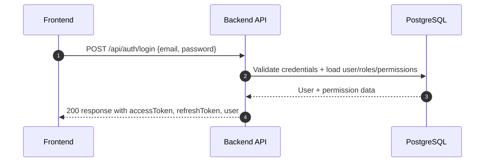
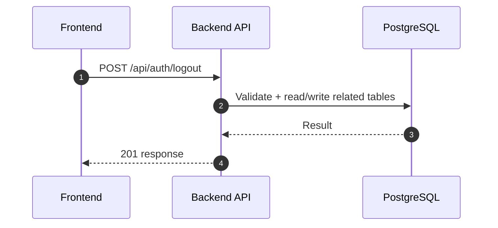
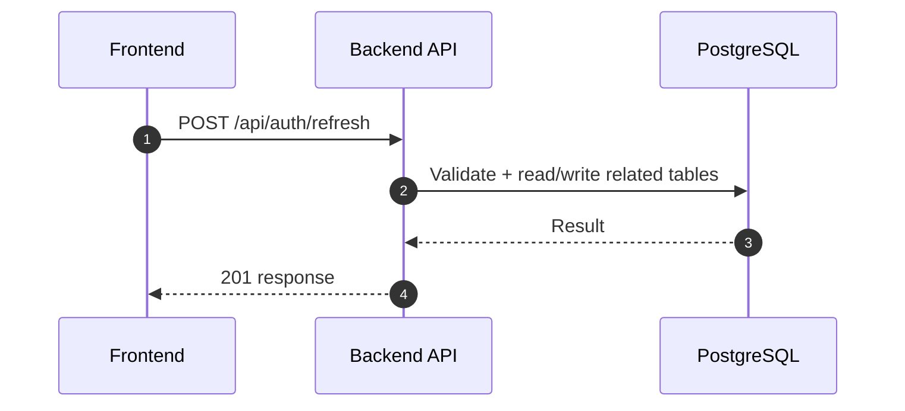
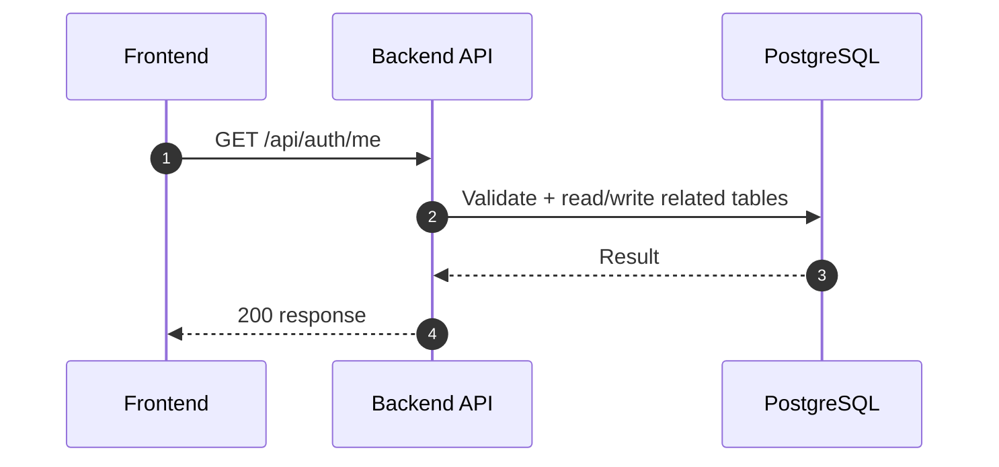
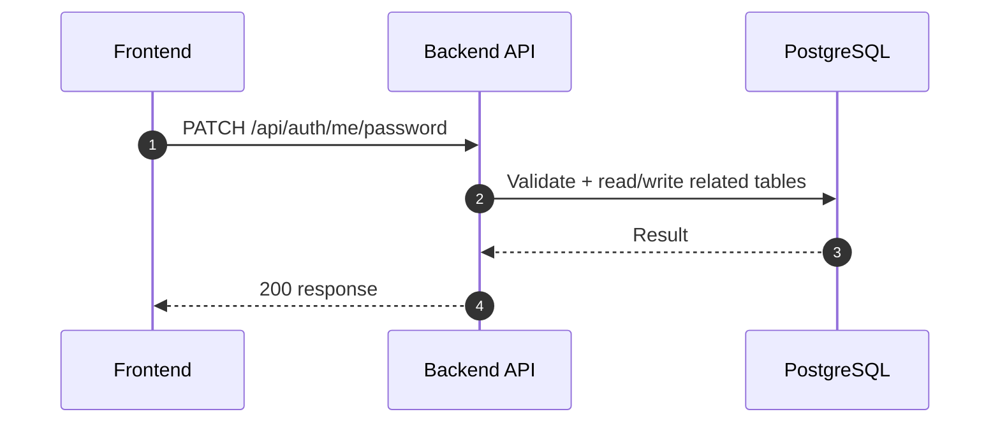

# Auth Module - Login & Session (Normalized)

อ้างอิง: `Documents/Requirements/Release_1.md`

## API Inventory
- `POST /api/auth/login`
- `POST /api/auth/logout`
- `POST /api/auth/refresh`
- `GET /api/auth/me`
- `PATCH /api/auth/me/password`

## Endpoint Details

### API: `POST /api/auth/login`

**Purpose**
- สร้าง/ดำเนินการ สำหรับ `POST /api/auth/login`

**FE Screen**
- อ้างอิงตามโมดูลของไฟล์นี้

**Params**
- Path Params: ไม่มี
- Query Params: รองรับตาม requirement ของ endpoint (pagination/filter/date range ถ้ามี)

**Request Headers**
```json
{
  "Content-Type": "application/json"
}
```

**Request Body**
```json
{
  "email": "user@example.com",
  "password": "********"
}
```

**Response Body (200)**
```json
{
  "data": {
    "accessToken": "<jwt_access_token>",
    "refreshToken": "<jwt_refresh_token>",
    "user": {
      "id": "user_id",
      "email": "user@example.com",
      "permissions": [
        "module:resource:action"
      ]
    }
  },
  "message": "Success"
}
```

**Sequence Diagram**


### API: `POST /api/auth/logout`

**Purpose**
- สร้าง/ดำเนินการ สำหรับ `POST /api/auth/logout`

**FE Screen**
- อ้างอิงตามโมดูลของไฟล์นี้

**Params**
- Path Params: ไม่มี
- Query Params: รองรับตาม requirement ของ endpoint (pagination/filter/date range ถ้ามี)

**Request Headers**
```json
{
  "Authorization": "Bearer <access_token>"
}
```

**Request Body**
```json
{ "refreshToken": "<jwt_refresh_token>", "allDevices": false }
```

**Response Body (201)**
```json
{
  "data": { "loggedOut": true },
  "message": "Logged out"
}
```

**Sequence Diagram**


### API: `POST /api/auth/refresh`

**Purpose**
- สร้าง/ดำเนินการ สำหรับ `POST /api/auth/refresh`

**FE Screen**
- อ้างอิงตามโมดูลของไฟล์นี้

**Params**
- Path Params: ไม่มี
- Query Params: รองรับตาม requirement ของ endpoint (pagination/filter/date range ถ้ามี)

**Request Headers**
```json
{
  "Authorization": "Bearer <access_token>"
}
```

**Request Body**
```json
{ "refreshToken": "<jwt_refresh_token>" }
```

**Response Body (201)**
```json
{
  "data": {
    "accessToken": "<jwt_access_token>",
    "refreshToken": "<jwt_refresh_token_rotated>",
    "expiresInSeconds": 900,
    "refreshExpiresInSeconds": 604800
  },
  "message": "Refreshed"
}
```

**Sequence Diagram**


### API: `GET /api/auth/me`

**Purpose**
- ดึงข้อมูล สำหรับ `GET /api/auth/me`

**FE Screen**
- อ้างอิงตามโมดูลของไฟล์นี้

**Params**
- Path Params: ไม่มี
- Query Params: รองรับตาม requirement ของ endpoint (pagination/filter/date range ถ้ามี)

**Request Headers**
```json
{
  "Authorization": "Bearer <access_token>"
}
```

**Request Body**
```json
{}
```

**Response Body (200)**
```json
{
  "data": {
    "user": { "id": "usr_001", "email": "hr@example.com", "isActive": true, "mustChangePassword": false },
    "roles": ["hr_admin"],
    "permissions": ["hr:employees:read"],
    "employee": { "id": "emp_001", "employeeCode": "EMP-0001", "fullName": "HR Admin", "department": "HR", "position": "Manager" }
  }
}
```

**Sequence Diagram**


### API: `PATCH /api/auth/me/password`

**Purpose**
- อัปเดตบางส่วน สำหรับ `PATCH /api/auth/me/password`

**FE Screen**
- อ้างอิงตามโมดูลของไฟล์นี้

**Params**
- Path Params: ไม่มี
- Query Params: รองรับตาม requirement ของ endpoint (pagination/filter/date range ถ้ามี)

**Request Headers**
```json
{
  "Authorization": "Bearer <access_token>"
}
```

**Request Body**
```json
{
  "currentPassword": "old-password",
  "newPassword": "new-password-123",
  "confirmPassword": "new-password-123"
}
```

**Response Body (200)**
```json
{
  "data": {
    "passwordChanged": true,
    "mustChangePassword": false
  },
  "message": "Password updated"
}
```

**Sequence Diagram**


---

## Coverage Lock Addendum (2026-04-16)

ส่วนนี้เป็น field-level contract ที่ authoritative กว่าส่วน placeholder ด้านบนเมื่อมีความต่างกัน โดยยึด `Documents/Requirements/Release_1.md`

### Canonical Auth Contracts
- `POST /api/auth/login`
  - response `data` ต้องมี `accessToken`, `refreshToken`, `user.id`, `user.email`, `user.roles[]`, `user.permissions[]`
  - login response ใช้สำหรับ immediate bootstrap หลัง submit สำเร็จ แต่ FE ต้องยึด `GET /api/auth/me` สำหรับ persisted session state
- `POST /api/auth/refresh`
  - request body: `{ "refreshToken": "..." }`
  - response `data`: `accessToken`, `refreshToken`, `expiresInSeconds`, `refreshExpiresInSeconds`
  - BE ต้อง rotate refresh token และ invalidate token เดิมทุกครั้งที่ refresh สำเร็จ
- `POST /api/auth/logout`
  - request body: `{ "refreshToken": "...", "allDevices": false }`
  - side effect: revoke refresh session ปัจจุบัน; ถ้า `allDevices=true` หรือ user ถูก deactivate ให้ revoke ทุก active session ของ user
- `GET /api/auth/me`
  - response `data` ต้องมี `user`, `roles`, `permissions`, `employee`
  - `user` อย่างน้อยต้องมี `id`, `email`, `isActive`, `mustChangePassword`
  - `employee` อย่างน้อยต้องมี `id`, `employeeCode`, `fullName`, `department`, `position`
- `PATCH /api/auth/me/password`
  - request body: `currentPassword`, `newPassword`, `confirmPassword`
  - response `data`: `passwordChanged`, `mustChangePassword`
  - success แล้วต้อง clear `users.mustChangePassword` และ revoke refresh sessions เดิมทั้งหมด

### Error / Session Semantics
- `401` ใช้เมื่อ access token หมดอายุ, refresh token ถูก revoke, หรือ user ถูก deactivate
- `403` ใช้เมื่อ user authenticated แล้วแต่ไม่มีสิทธิ์เรียก endpoint นั้น
- `409` ใช้กับ business rule conflict เช่น refresh token ถูกใช้ไปแล้วจากการ rotation
- `/api/auth/me` คือ source of truth ของ forced password change; ถ้า `mustChangePassword=true` FE ต้องจำกัด route เหลือเฉพาะ change-password flow
