# Settings Module (R2) - Normalized

อ้างอิง: `Documents/Requirements/Release_2.md`

## API Inventory
- `GET /api/settings/company`
- `PUT /api/settings/company`
- `POST /api/settings/company/logo`
- `GET /api/settings/fiscal-periods`
- `GET /api/settings/fiscal-periods/current`
- `POST /api/settings/fiscal-periods/generate`
- `PATCH /api/settings/fiscal-periods/:id/close`
- `PATCH /api/settings/fiscal-periods/:id/reopen`
- `GET /api/notifications`
- `GET /api/notifications/unread-count`
- `PATCH /api/notifications/:id/read`
- `POST /api/notifications/mark-all-read`
- `GET /api/settings/notification-configs`
- `PUT /api/settings/notification-configs`
- `GET /api/settings/audit-logs`
- `GET /api/settings/audit-logs/:entityType/:entityId`

## Endpoint Details

### API: `GET /api/settings/company`

**Purpose**
- ดึงข้อมูล สำหรับ `GET /api/settings/company`

**FE Screen**
- อ้างอิงตามโมดูลของไฟล์นี้

**Params**
- Path Params: ไม่มี
- Query Params: ไม่มี

**Request Headers**
```json
{
  "Authorization": "Bearer <access_token>"
}
```

**Request Body**
```json
// no request body
```

**Response Body (200)**
```json
{
  "data": {
    "id": "company_singleton",
    "companyName": "บริษัท ตัวอย่าง จำกัด",
    "companyNameEn": "Example Co., Ltd.",
    "taxId": "0105551234567",
    "logoUrl": "https://cdn.example.com/logo.png",
    "currency": "THB",
    "defaultVatRate": 7.0,
    "invoicePrefix": "INV"
  }
}
```

**Sequence Diagram**
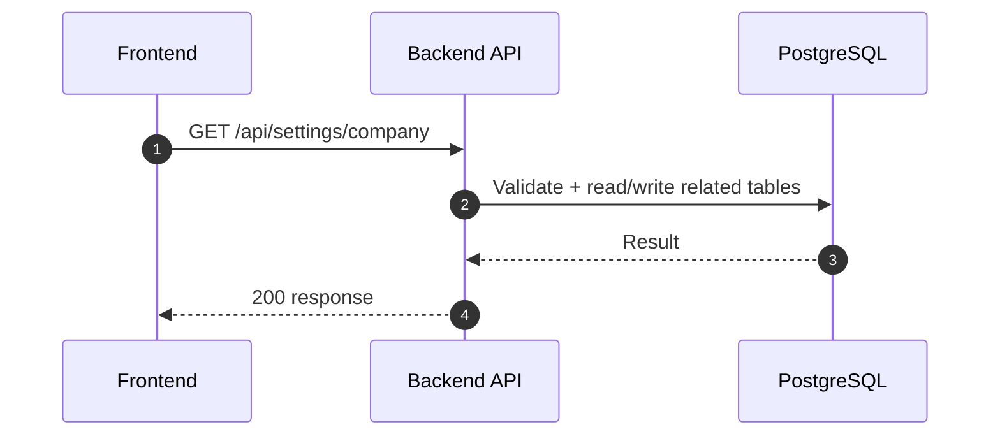

### API: `PUT /api/settings/company`

**Purpose**
- อัปเดตข้อมูล สำหรับ `PUT /api/settings/company`

**FE Screen**
- อ้างอิงตามโมดูลของไฟล์นี้

**Params**
- Path Params: ไม่มี
- Query Params: ไม่มี

**Request Headers**
```json
{
  "Authorization": "Bearer <access_token>"
}
```

**Request Body**
```json
{
  "companyName": "บริษัท ตัวอย่าง จำกัด",
  "companyNameEn": "Example Co., Ltd.",
  "taxId": "0105551234567",
  "currency": "THB",
  "defaultVatRate": 7.0,
  "invoicePrefix": "INV"
}
```

**Response Body (200)**
```json
{
  "data": {
    "id": "company_singleton",
    "companyName": "บริษัท ตัวอย่าง จำกัด",
    "companyNameEn": "Example Co., Ltd.",
    "taxId": "0105551234567",
    "currency": "THB",
    "defaultVatRate": 7.0,
    "invoicePrefix": "INV"
  },
  "message": "Updated"
}
```

**Sequence Diagram**
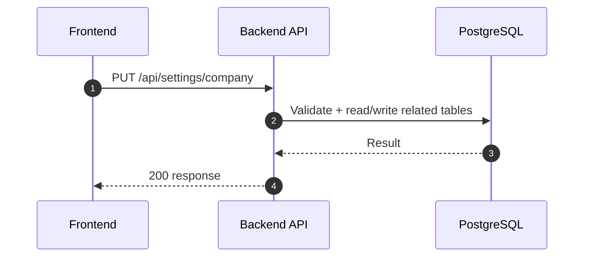

### API: `POST /api/settings/company/logo`

**Purpose**
- สร้าง/ดำเนินการ สำหรับ `POST /api/settings/company/logo`

**FE Screen**
- อ้างอิงตามโมดูลของไฟล์นี้

**Params**
- Path Params: ไม่มี
- Query Params: รองรับตาม requirement ของ endpoint (pagination/filter/date range ถ้ามี)

**Request Headers**
```json
{
  "Authorization": "Bearer <access_token>"
}
```

**Request Body**
```json
{}
```

**Response Body (201)**
```json
{
  "data": {},
  "message": "Success"
}
```

**Sequence Diagram**


### API: `GET /api/settings/fiscal-periods`

**Purpose**
- ดึงข้อมูล สำหรับ `GET /api/settings/fiscal-periods`

**FE Screen**
- อ้างอิงตามโมดูลของไฟล์นี้

**Params**
- Path Params: ไม่มี
- Query Params: รองรับตาม requirement ของ endpoint (pagination/filter/date range ถ้ามี)

**Request Headers**
```json
{
  "Authorization": "Bearer <access_token>"
}
```

**Request Body**
```json
{}
```

**Response Body (200)**
```json
{
  "data": {}
}
```

**Sequence Diagram**
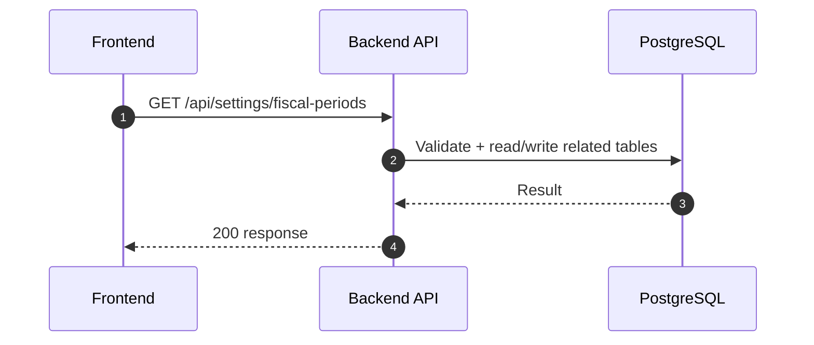

### API: `GET /api/settings/fiscal-periods/current`

**Purpose**
- ดึงข้อมูล สำหรับ `GET /api/settings/fiscal-periods/current`

**FE Screen**
- อ้างอิงตามโมดูลของไฟล์นี้

**Params**
- Path Params: ไม่มี
- Query Params: รองรับตาม requirement ของ endpoint (pagination/filter/date range ถ้ามี)

**Request Headers**
```json
{
  "Authorization": "Bearer <access_token>"
}
```

**Request Body**
```json
{}
```

**Response Body (200)**
```json
{
  "data": {}
}
```

**Sequence Diagram**
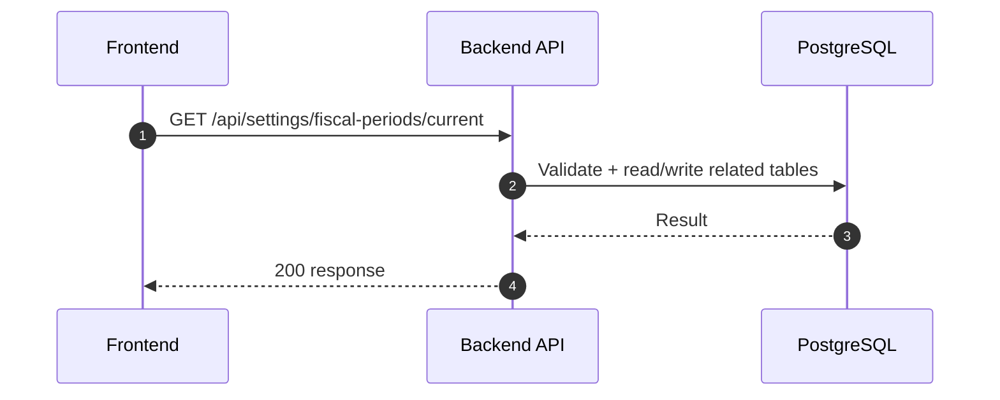

### API: `POST /api/settings/fiscal-periods/generate`

**Purpose**
- สร้างชุด `fiscal_periods` สำหรับปีบัญชีที่ระบุ โดยอัตโนมัติ รองรับ granularity 4 แบบ: รายเดือน (1M), รายไตรมาส (1Q), ครึ่งปี (1H), รายปี (1Y) — ถ้า period ไหนมีอยู่แล้วจะ skip ไม่ error

**FE Screen**
- `/settings/fiscal-periods` — dialog "สร้างรอบบัญชีใหม่" (Sub-flow D)

**Params**
- Path Params: ไม่มี
- Query Params: ไม่มี

**Request Headers**
```json
{
  "Authorization": "Bearer <access_token>",
  "Content-Type": "application/json"
}
```

**Request Body**
```json
{
  "year": 2026,
  "granularity": "1M",    // required: "1M" | "1Q" | "1H" | "1Y"
  "startMonth": 1,        // optional (1–12): override company_settings.fiscalYearStart
  "startDay": 1           // optional (1–28): override company_settings.fiscalYearStartDay
}
```

| `granularity` | ความหมาย | จำนวน period | periodNo range |
|---|---|---|---|
| `1M` | รายเดือน | 12 | 1–12 |
| `1Q` | รายไตรมาส | 4 | 1–4 |
| `1H` | ครึ่งปี | 2 | 1–2 |
| `1Y` | รายปี | 1 | 1 |

**Response Body (201)**
```json
{
  "data": {
    "year": 2026,
    "granularity": "1Q",
    "startMonth": 4,
    "created": 4,
    "skipped": 0,
    "periods": [
      {
        "id": "fp_2026_Q1",
        "year": 2026,
        "granularity": "1Q",
        "periodNo": 1,
        "label": "Q1 FY2026 (Apr–Jun)",
        "startDate": "2026-04-01",
        "endDate": "2026-06-30",
        "status": "open"
      },
      {
        "id": "fp_2026_Q2",
        "year": 2026,
        "granularity": "1Q",
        "periodNo": 2,
        "label": "Q2 FY2026 (Jul–Sep)",
        "startDate": "2026-07-01",
        "endDate": "2026-09-30",
        "status": "open"
      }
    ]
  },
  "message": "Generated 4 fiscal periods (1Q) for year 2026"
}
```

> ถ้า partial exist: `201` พร้อม `created: N, skipped: M`
> ถ้าครบทั้งหมดแล้ว: `409`

**Error Responses**
```json
// 409 — ปีนั้น + granularity เดียวกันมีครบแล้ว
{
  "error": "PERIODS_ALREADY_EXIST",
  "message": "1Q periods for year 2026 already exist (4/4)",
  "data": { "year": 2026, "granularity": "1Q", "existing": 4 }
}

// 400 — granularity ไม่ถูกต้อง
{
  "error": "VALIDATION_ERROR",
  "message": "granularity must be one of: 1M, 1Q, 1H, 1Y"
}

// 400 — startMonth นอกช่วง
{
  "error": "VALIDATION_ERROR",
  "message": "startMonth must be between 1 and 12"
}

// 400 — startDay นอกช่วง
{
  "error": "VALIDATION_ERROR",
  "message": "startDay must be between 1 and 28"
}

// 403 — ไม่ใช่ super_admin
{
  "error": "FORBIDDEN",
  "message": "Only super_admin can generate fiscal periods"
}
```

**Sequence Diagram**
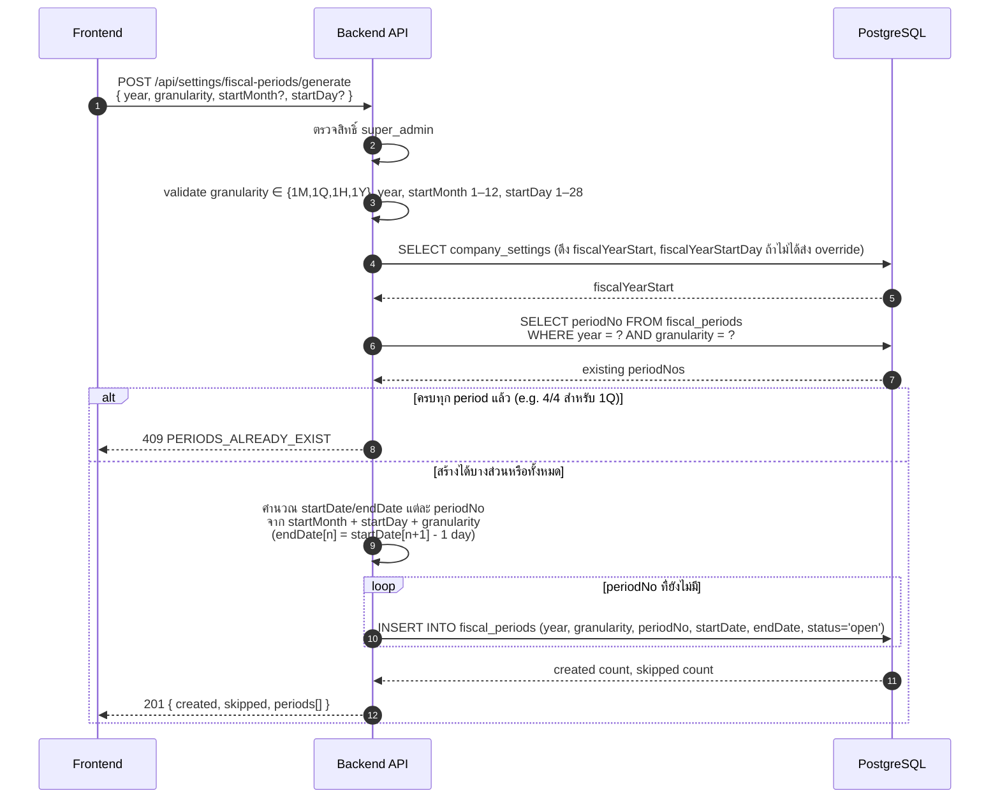

### API: `PATCH /api/settings/fiscal-periods/:id/close`

**Purpose**
- อัปเดตบางส่วน สำหรับ `PATCH /api/settings/fiscal-periods/:id/close`

**FE Screen**
- อ้างอิงตามโมดูลของไฟล์นี้

**Params**
- Path Params: มี (`id`/ตัวแปร path ตาม endpoint)
- Query Params: รองรับตาม requirement ของ endpoint (pagination/filter/date range ถ้ามี)

**Request Headers**
```json
{
  "Authorization": "Bearer <access_token>"
}
```

**Request Body**
```json
{}
```

**Response Body (200)**
```json
{
  "data": {},
  "message": "Success"
}
```

**Sequence Diagram**


### API: `PATCH /api/settings/fiscal-periods/:id/reopen`

**Purpose**
- อัปเดตบางส่วน สำหรับ `PATCH /api/settings/fiscal-periods/:id/reopen`

**FE Screen**
- อ้างอิงตามโมดูลของไฟล์นี้

**Params**
- Path Params: มี (`id`/ตัวแปร path ตาม endpoint)
- Query Params: รองรับตาม requirement ของ endpoint (pagination/filter/date range ถ้ามี)

**Request Headers**
```json
{
  "Authorization": "Bearer <access_token>"
}
```

**Request Body**
```json
{}
```

**Response Body (200)**
```json
{
  "data": {},
  "message": "Success"
}
```

**Sequence Diagram**
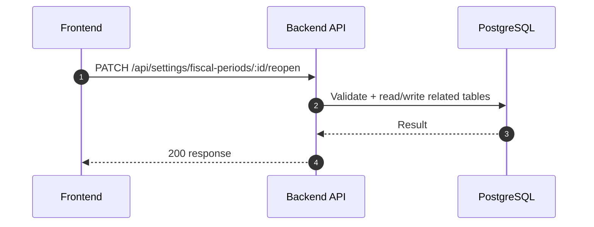

### API: `GET /api/notifications`

**Purpose**
- ดึงข้อมูล สำหรับ `GET /api/notifications`

**FE Screen**
- อ้างอิงตามโมดูลของไฟล์นี้

**Params**
- Path Params: ไม่มี
- Query Params: รองรับตาม requirement ของ endpoint (pagination/filter/date range ถ้ามี)

**Request Headers**
```json
{
  "Authorization": "Bearer <access_token>"
}
```

**Request Body**
```json
{}
```

**Response Body (200)**
```json
{
  "data": {}
}
```

**Sequence Diagram**
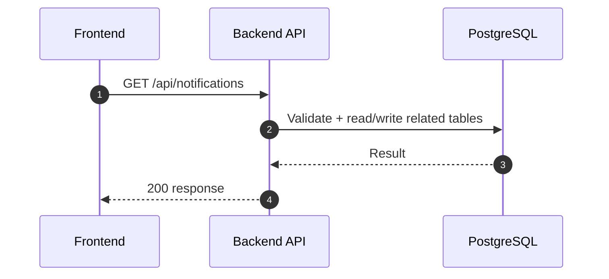

### API: `GET /api/notifications/unread-count`

**Purpose**
- ดึงข้อมูล สำหรับ `GET /api/notifications/unread-count`

**FE Screen**
- อ้างอิงตามโมดูลของไฟล์นี้

**Params**
- Path Params: ไม่มี
- Query Params: รองรับตาม requirement ของ endpoint (pagination/filter/date range ถ้ามี)

**Request Headers**
```json
{
  "Authorization": "Bearer <access_token>"
}
```

**Request Body**
```json
{}
```

**Response Body (200)**
```json
{
  "data": {}
}
```

**Sequence Diagram**
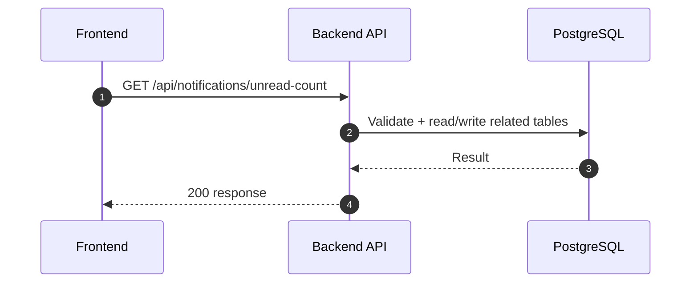

### API: `PATCH /api/notifications/:id/read`

**Purpose**
- อัปเดตบางส่วน สำหรับ `PATCH /api/notifications/:id/read`

**FE Screen**
- อ้างอิงตามโมดูลของไฟล์นี้

**Params**
- Path Params: มี (`id`/ตัวแปร path ตาม endpoint)
- Query Params: รองรับตาม requirement ของ endpoint (pagination/filter/date range ถ้ามี)

**Request Headers**
```json
{
  "Authorization": "Bearer <access_token>"
}
```

**Request Body**
```json
{}
```

**Response Body (200)**
```json
{
  "data": {},
  "message": "Success"
}
```

**Sequence Diagram**
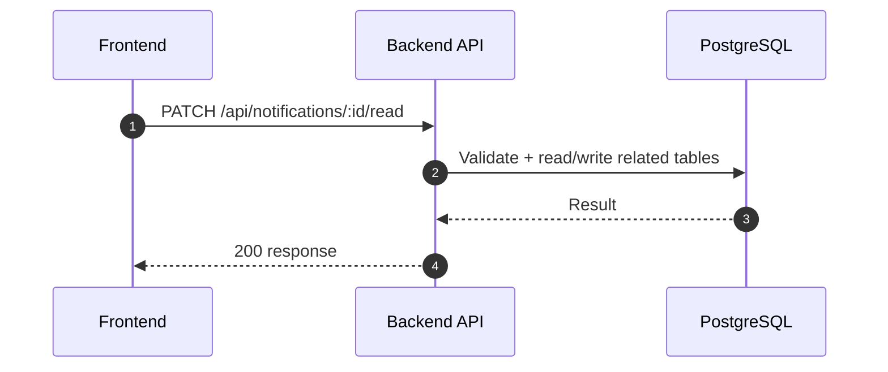

### API: `POST /api/notifications/mark-all-read`

**Purpose**
- สร้าง/ดำเนินการ สำหรับ `POST /api/notifications/mark-all-read`

**FE Screen**
- อ้างอิงตามโมดูลของไฟล์นี้

**Params**
- Path Params: ไม่มี
- Query Params: รองรับตาม requirement ของ endpoint (pagination/filter/date range ถ้ามี)

**Request Headers**
```json
{
  "Authorization": "Bearer <access_token>"
}
```

**Request Body**
```json
{}
```

**Response Body (201)**
```json
{
  "data": {},
  "message": "Success"
}
```

**Sequence Diagram**


### API: `GET /api/settings/notification-configs`

**Purpose**
- ดึงข้อมูล สำหรับ `GET /api/settings/notification-configs`

**FE Screen**
- อ้างอิงตามโมดูลของไฟล์นี้

**Params**
- Path Params: ไม่มี
- Query Params: รองรับตาม requirement ของ endpoint (pagination/filter/date range ถ้ามี)

**Request Headers**
```json
{
  "Authorization": "Bearer <access_token>"
}
```

**Request Body**
```json
{}
```

**Response Body (200)**
```json
{
  "data": {}
}
```

**Sequence Diagram**
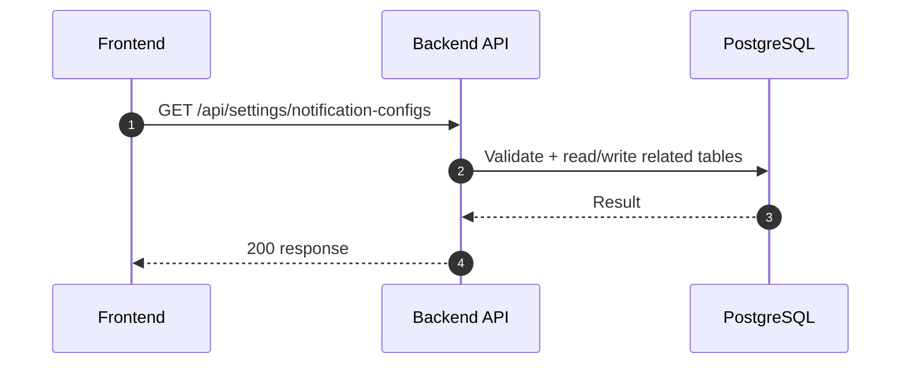

### API: `PUT /api/settings/notification-configs`

**Purpose**
- อัปเดตข้อมูล สำหรับ `PUT /api/settings/notification-configs`

**FE Screen**
- อ้างอิงตามโมดูลของไฟล์นี้

**Params**
- Path Params: ไม่มี
- Query Params: รองรับตาม requirement ของ endpoint (pagination/filter/date range ถ้ามี)

**Request Headers**
```json
{
  "Authorization": "Bearer <access_token>"
}
```

**Request Body**
```json
{}
```

**Response Body (200)**
```json
{
  "data": {},
  "message": "Success"
}
```

**Sequence Diagram**
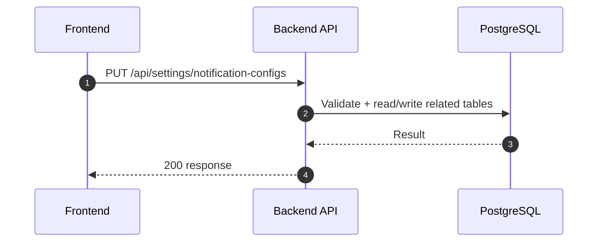

### API: `GET /api/settings/audit-logs`

**Purpose**
- ดึงข้อมูล สำหรับ `GET /api/settings/audit-logs`

**FE Screen**
- อ้างอิงตามโมดูลของไฟล์นี้

**Params**
- Path Params: ไม่มี
- Query Params: รองรับตาม requirement ของ endpoint (pagination/filter/date range ถ้ามี)

**Request Headers**
```json
{
  "Authorization": "Bearer <access_token>"
}
```

**Request Body**
```json
{}
```

**Response Body (200)**
```json
{
  "data": {}
}
```

**Sequence Diagram**
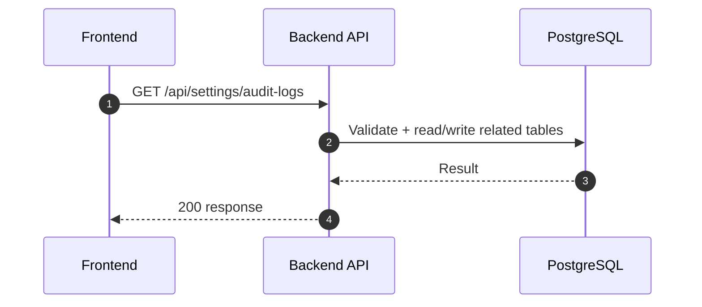

### API: `GET /api/settings/audit-logs/:entityType/:entityId`

**Purpose**
- ดึงข้อมูล สำหรับ `GET /api/settings/audit-logs/:entityType/:entityId`

**FE Screen**
- อ้างอิงตามโมดูลของไฟล์นี้

**Params**
- Path Params: มี (`id`/ตัวแปร path ตาม endpoint)
- Query Params: รองรับตาม requirement ของ endpoint (pagination/filter/date range ถ้ามี)

**Request Headers**
```json
{
  "Authorization": "Bearer <access_token>"
}
```

**Request Body**
```json
{}
```

**Response Body (200)**
```json
{
  "data": {}
}
```

**Sequence Diagram**
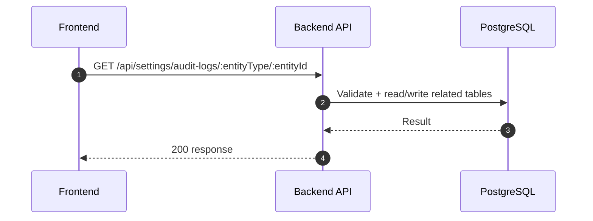

---

## Coverage Lock Addendum (2026-04-16)

ส่วนนี้เพิ่มเพื่อปิดช่องว่าง coverage ของ Company Settings + Notifications + Audit โดยยึด canonical จาก `Documents/Requirements/Release_2.md`

### Canonical Field Locks
- ใช้ `companyName` และ `companyNameEn` (ไม่ใช้ `companyNameTh`)
- ใช้ `currency` (ไม่ใช้ `defaultCurrency`)
- `PATCH /api/settings/fiscal-periods/:id/reopen` รองรับ `reopenReason` (optional)
- notification preferences ใช้ key `eventType` แบบ enum คงที่

### Company Settings Contracts

### `GET /api/settings/company`
```json
{
  "data": {
    "id": "company_singleton",
    "companyName": "บริษัท ตัวอย่าง จำกัด",
    "companyNameEn": "Example Co., Ltd.",
    "taxId": "0105551234567",
    "address": "Bangkok",
    "phone": "021234567",
    "email": "admin@example.com",
    "website": "https://example.com",
    "logoUrl": "https://cdn.example.com/logo.png",
    "currency": "THB",
    "fiscalYearStart": 1,
    "fiscalYearStartDay": 1,
    "vatRegistered": true,
    "vatNo": "1234567890",
    "defaultVatRate": 7.0,
    "invoicePrefix": "INV",
    "poPrefix": "PO",
    "quotPrefix": "QT",
    "soPrefix": "SO"
  }
}
```

### `PUT /api/settings/company`
- Request body ใช้ field เดียวกับ `GET` (ยกเว้น `id`)
- Validation สำคัญ: `taxId` format, `currency` whitelist, `defaultVatRate` range
- Error: `400` validation, `409` rule conflict

### Fiscal Period Contracts
- `GET /api/settings/fiscal-periods`: รองรับ `year?`, `granularity?`, `status?`, `dateFrom?`, `dateTo?`, `page`, `limit`
  - Response item ต้องมี: `id`, `year`, `granularity`, `periodNo`, `label`, `startDate`, `endDate`, `status`, `closedAt`, `closedBy`
- `POST /api/settings/fiscal-periods/generate`: body `{ "year": 2026, "granularity": "1M", "startMonth": 1, "startDay": 1 }`
  - `granularity`: required, enum `1M | 1Q | 1H | 1Y`
  - `startMonth`: optional (1–12), override `company_settings.fiscalYearStart`
  - `startDay`: optional (1–28), override `company_settings.fiscalYearStartDay`; `endDate[n] = startDate[n+1] - 1 day`
  - Response: `{ created, skipped, periods[] }` — period item มี `label` field (human-readable เช่น "Q2 FY2026 (Apr 15 – Jul 14)")
- `PATCH /api/settings/fiscal-periods/:id/close`: body `{ "reason": "Month-end close" }` (optional reason)
- `PATCH /api/settings/fiscal-periods/:id/reopen`: body `{ "reopenReason": "Adjustment required" }`
- `reopen` ต้องบันทึก audit event และคืนสถานะ period ล่าสุด
- semantics ของการกรองช่วงเวลาใน settings/notifications/audit ให้ใช้คู่ `dateFrom`, `dateTo` เดียวกันทั้งระบบ; ถ้า FE ส่ง `dateRange` ให้แปลงเป็นสอง field นี้ก่อนเข้า API

### Notification Contracts

### EventType Catalog (authoritative)
- `LEAVE_SUBMITTED`
- `LEAVE_APPROVED`
- `LEAVE_REJECTED`
- `PAYROLL_APPROVAL_REQUIRED`
- `PAYROLL_PAID`
- `AR_PAYMENT_RECEIVED`
- `AP_APPROVAL_REQUIRED`
- `AP_APPROVED`
- `AP_REJECTED`
- `PO_APPROVAL_REQUIRED`
- `PO_APPROVED`
- `PO_REJECTED`
- `INVOICE_OVERDUE`
- `BUDGET_ALERT`
- `EMPLOYEE_ABSENT`
- `CUSTOMER_OVERDUE_WARNING`
- `CUSTOMER_CREDIT_EXCEEDED`
- `SYSTEM_ALERT`

### `GET /api/notifications`
- Query: `unreadOnly`, `eventType`, `dateFrom`, `dateTo`, `page`, `limit`
- Response item ต้องมี `id`, `title`, `message`, `eventType`, `actionUrl`, `isRead`, `createdAt`
- response `meta` ควรมี `archiveBoundaryDate` เมื่อ query แตะข้อมูลเก่ากว่า inbox retention
- ค่า default ต้องคืนเฉพาะ notifications ที่ยังอยู่ใน inbox หลัก; notification ที่อ่านแล้วและเก่ากว่า 90 วันให้ถือว่า archived

### `GET /api/notifications/unread-count`
```json
{ "data": { "unreadCount": 5 } }
```

### `PATCH /api/notifications/:id/read`
```json
{
  "data": { "id": "ntf_001", "isRead": true, "readAt": "2026-04-16T08:30:00Z" },
  "message": "Notification marked as read"
}
```

### `POST /api/notifications/mark-all-read`
```json
{
  "data": { "updatedCount": 12 },
  "message": "All notifications marked as read"
}
```

### `PUT /api/settings/notification-configs`
- Request body:
```json
{
  "configs": [
    { "eventType": "LEAVE_SUBMITTED", "channelInApp": true, "channelEmail": false }
  ]
}
```
- Error `400` เมื่อ `eventType` ไม่อยู่ใน catalog ข้างต้น

### Audit Contracts
- `GET /api/settings/audit-logs`
  - Query: `module`, `entityType`, `entityId`, `action`, `actorId`, `startDate`, `endDate`, `page`, `limit`
  - Action enum lock: `create`, `update`, `delete`, `status_change`, `login`, `logout`, `approve`, `reject`
- `GET /api/settings/audit-logs/:entityType/:entityId`
  - Response ต้องมี `changes` diff (before/after) และ `context` ที่ใช้ใน detail drawer

### Global Dashboard Cross-Reference
- `GET /api/dashboard/summary` ต้องคืน `meta.asOf`, `meta.freshnessSeconds`, `meta.permissionTrimmedModules`, `meta.widgetVisibilityMode`
- ใช้ canonical RBAC trimming แบบ `widgetVisibilityMode = omit_widget`
