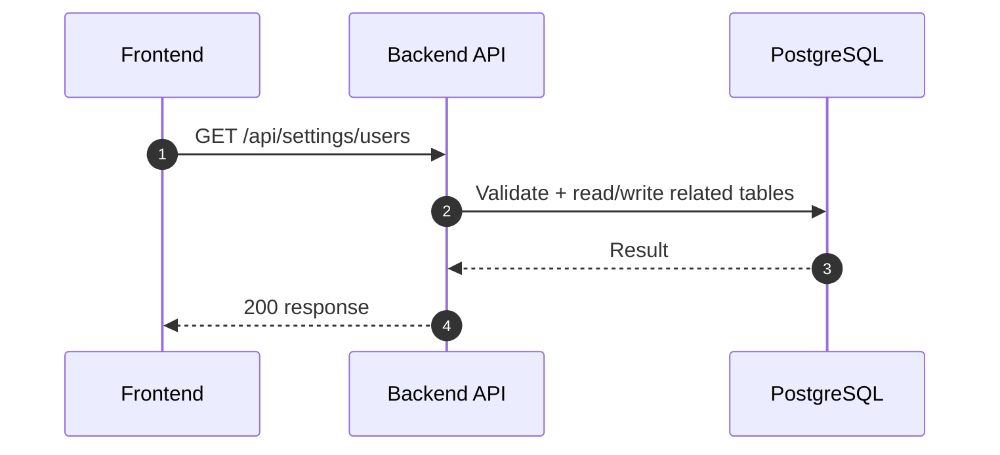
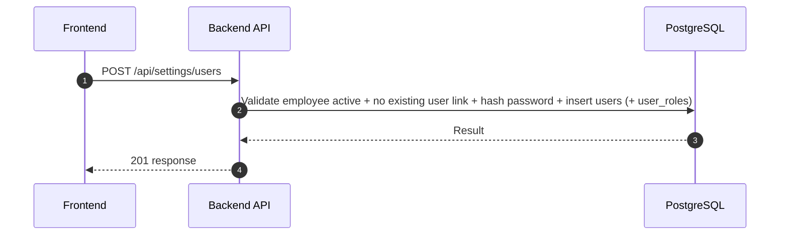
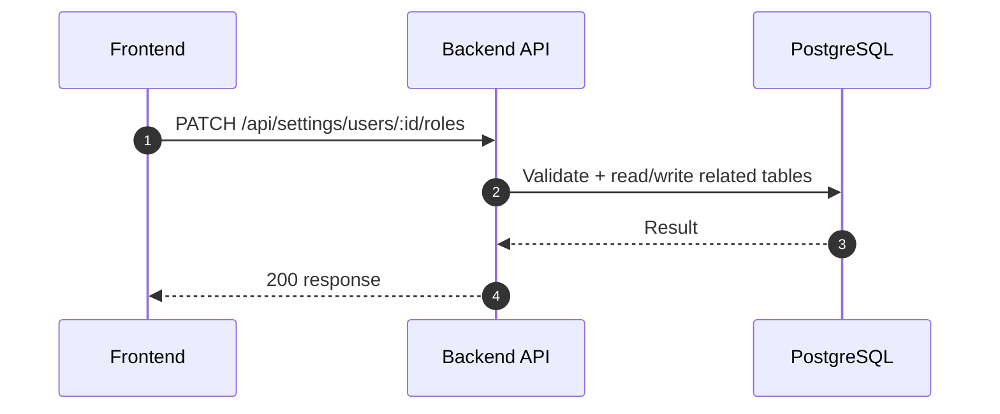
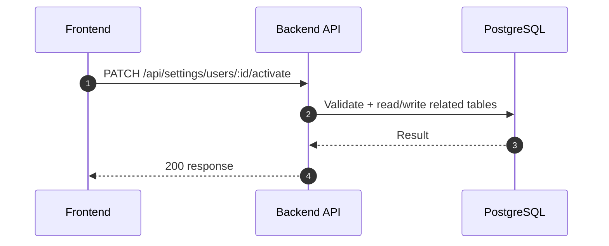
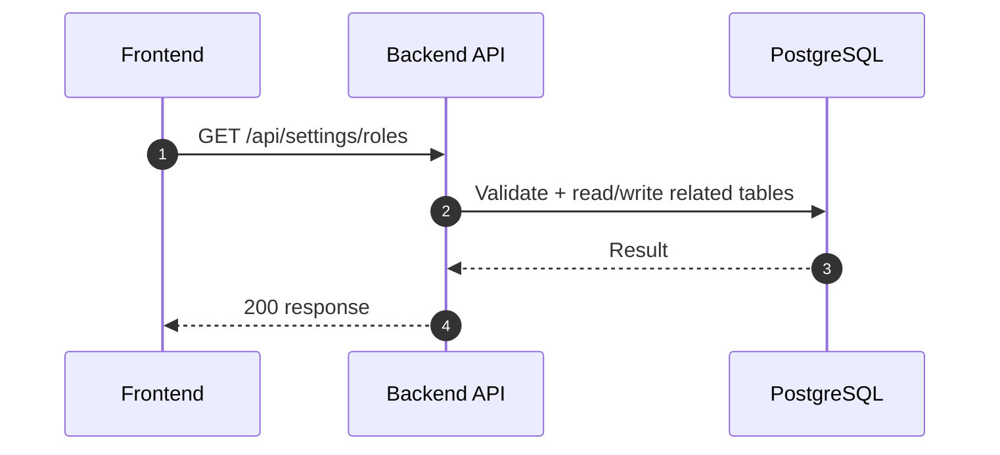
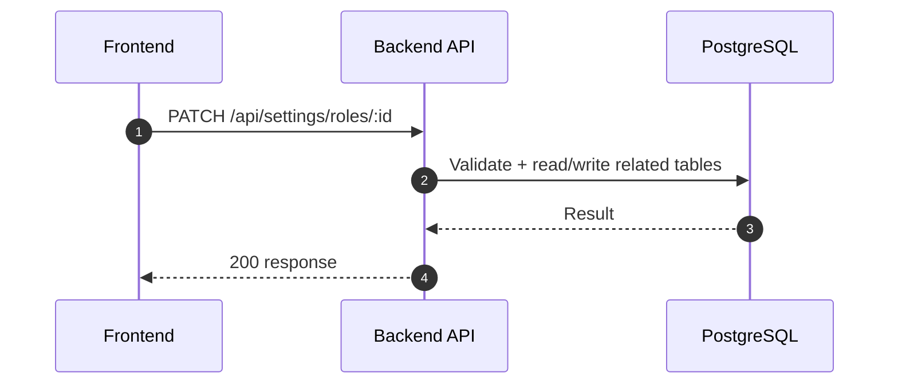
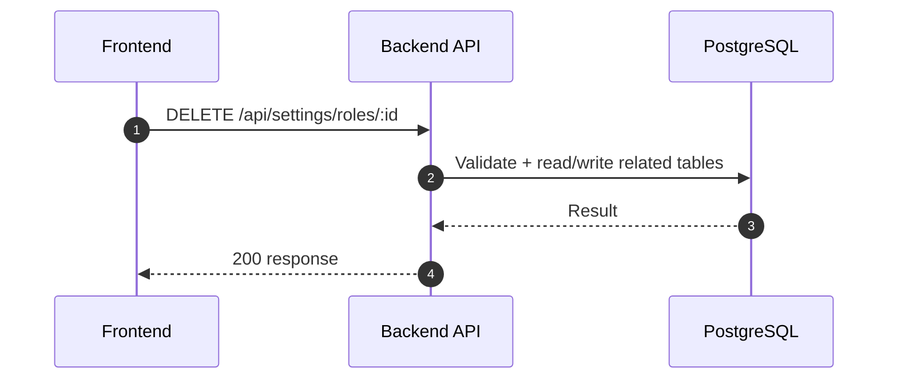
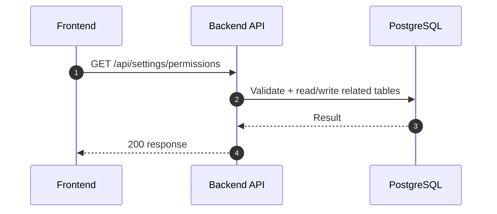
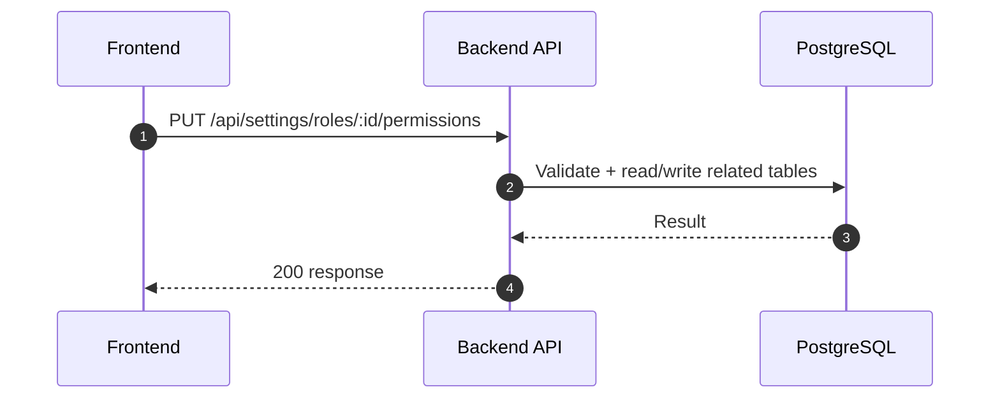

# Settings Module (R1) - User Role Permission (Normalized)

อ้างอิง: `Documents/Release_1.md`

## API Inventory
- `GET /api/settings/users`
- `POST /api/settings/users`
- `PATCH /api/settings/users/:id/roles`
- `PATCH /api/settings/users/:id/activate`
- `GET /api/settings/roles`
- `POST /api/settings/roles`
- `PATCH /api/settings/roles/:id`
- `DELETE /api/settings/roles/:id`
- `GET /api/settings/permissions`
- `PUT /api/settings/roles/:id/permissions`

## Endpoint Details

### API: `GET /api/settings/users`

**Purpose**
- ดึงข้อมูล สำหรับ `GET /api/settings/users`

**FE Screen**
- อ้างอิงตามโมดูลของไฟล์นี้

**Params**
- Path Params: ไม่มี
- Query Params: รองรับตาม requirement ของ endpoint (pagination/filter/date range ถ้ามี)

**Request Headers**
```json
{
  "Authorization": "Bearer <access_token>"
}
```

**Request Body**
```json
{}
```

**Response Body (200)**
```json
{
  "data": {}
}
```

**Sequence Diagram**


### API: `POST /api/settings/users`

**Purpose**
- สร้าง user account ใหม่โดย admin (ไม่มี self-registration); ผูก `employeeId` บังคับ; optional `roleIds`

**FE Screen**
- `/settings/users` — ฟอร์มสร้างผู้ใช้ + employee picker (อ้าง `Documents/Requirements/Release_1.md` Feature 1.15)

**Params**
- Path Params: ไม่มี
- Query Params: ไม่มี

**Request Headers**
```json
{
  "Authorization": "Bearer <access_token>"
}
```

**Request Body**
```json
{
  "email": "newuser@company.com",
  "password": "<initial_password>",
  "mustChangePassword": true,
  "employeeId": "emp_uuid",
  "roleIds": ["role_uuid_optional"]
}
```

**Response Body (201)**
```json
{
  "data": {
    "id": "user_uuid",
    "email": "newuser@company.com",
    "employeeId": "emp_uuid",
    "isActive": true,
    "roles": []
  },
  "message": "Success"
}
```

**Sequence Diagram**


### API: `PATCH /api/settings/users/:id/roles`

**Purpose**
- อัปเดตบางส่วน สำหรับ `PATCH /api/settings/users/:id/roles`

**FE Screen**
- อ้างอิงตามโมดูลของไฟล์นี้

**Params**
- Path Params: มี (`id`/ตัวแปร path ตาม endpoint)
- Query Params: รองรับตาม requirement ของ endpoint (pagination/filter/date range ถ้ามี)

**Request Headers**
```json
{
  "Authorization": "Bearer <access_token>"
}
```

**Request Body**
```json
{}
```

**Response Body (200)**
```json
{
  "data": {},
  "message": "Success"
}
```

**Sequence Diagram**


### API: `PATCH /api/settings/users/:id/activate`

**Purpose**
- อัปเดตบางส่วน สำหรับ `PATCH /api/settings/users/:id/activate`

**FE Screen**
- อ้างอิงตามโมดูลของไฟล์นี้

**Params**
- Path Params: มี (`id`/ตัวแปร path ตาม endpoint)
- Query Params: รองรับตาม requirement ของ endpoint (pagination/filter/date range ถ้ามี)

**Request Headers**
```json
{
  "Authorization": "Bearer <access_token>"
}
```

**Request Body**
```json
{}
```

**Response Body (200)**
```json
{
  "data": {},
  "message": "Success"
}
```

**Sequence Diagram**


### API: `GET /api/settings/roles`

**Purpose**
- ดึงข้อมูล สำหรับ `GET /api/settings/roles`

**FE Screen**
- อ้างอิงตามโมดูลของไฟล์นี้

**Params**
- Path Params: ไม่มี
- Query Params: รองรับตาม requirement ของ endpoint (pagination/filter/date range ถ้ามี)

**Request Headers**
```json
{
  "Authorization": "Bearer <access_token>"
}
```

**Request Body**
```json
{}
```

**Response Body (200)**
```json
{
  "data": {}
}
```

**Sequence Diagram**


### API: `POST /api/settings/roles`

**Purpose**
- สร้าง/ดำเนินการ สำหรับ `POST /api/settings/roles`

**FE Screen**
- อ้างอิงตามโมดูลของไฟล์นี้

**Params**
- Path Params: ไม่มี
- Query Params: รองรับตาม requirement ของ endpoint (pagination/filter/date range ถ้ามี)

**Request Headers**
```json
{
  "Authorization": "Bearer <access_token>"
}
```

**Request Body**
```json
{}
```

**Response Body (201)**
```json
{
  "data": {},
  "message": "Success"
}
```

**Sequence Diagram**


### API: `PATCH /api/settings/roles/:id`

**Purpose**
- อัปเดตบางส่วน สำหรับ `PATCH /api/settings/roles/:id`

**FE Screen**
- อ้างอิงตามโมดูลของไฟล์นี้

**Params**
- Path Params: มี (`id`/ตัวแปร path ตาม endpoint)
- Query Params: รองรับตาม requirement ของ endpoint (pagination/filter/date range ถ้ามี)

**Request Headers**
```json
{
  "Authorization": "Bearer <access_token>"
}
```

**Request Body**
```json
{}
```

**Response Body (200)**
```json
{
  "data": {},
  "message": "Success"
}
```

**Sequence Diagram**


### API: `DELETE /api/settings/roles/:id`

**Purpose**
- ลบข้อมูล สำหรับ `DELETE /api/settings/roles/:id`

**FE Screen**
- อ้างอิงตามโมดูลของไฟล์นี้

**Params**
- Path Params: มี (`id`/ตัวแปร path ตาม endpoint)
- Query Params: รองรับตาม requirement ของ endpoint (pagination/filter/date range ถ้ามี)

**Request Headers**
```json
{
  "Authorization": "Bearer <access_token>"
}
```

**Request Body**
```json
{}
```

**Response Body (200)**
```json
{
  "message": "Deleted successfully"
}
```

**Sequence Diagram**


### API: `GET /api/settings/permissions`

**Purpose**
- ดึงข้อมูล สำหรับ `GET /api/settings/permissions`

**FE Screen**
- อ้างอิงตามโมดูลของไฟล์นี้

**Params**
- Path Params: ไม่มี
- Query Params: รองรับตาม requirement ของ endpoint (pagination/filter/date range ถ้ามี)

**Request Headers**
```json
{
  "Authorization": "Bearer <access_token>"
}
```

**Request Body**
```json
{}
```

**Response Body (200)**
```json
{
  "data": {}
}
```

**Sequence Diagram**


### API: `PUT /api/settings/roles/:id/permissions`

**Purpose**
- อัปเดตข้อมูล สำหรับ `PUT /api/settings/roles/:id/permissions`

**FE Screen**
- อ้างอิงตามโมดูลของไฟล์นี้

**Params**
- Path Params: มี (`id`/ตัวแปร path ตาม endpoint)
- Query Params: รองรับตาม requirement ของ endpoint (pagination/filter/date range ถ้ามี)

**Request Headers**
```json
{
  "Authorization": "Bearer <access_token>"
}
```

**Request Body**
```json
{}
```

**Response Body (200)**
```json
{
  "data": {},
  "message": "Success"
}
```

**Sequence Diagram**


---

## Coverage Lock Addendum (2026-04-16)

### User Management Contracts
- `GET /api/settings/users`
  - Query: `page`, `limit`, `search`, `isActive`, `roleId`, `employeeId`
  - list item อย่างน้อยต้องมี `id`, `email`, `isActive`, `mustChangePassword`, `employee`, `roles[]`, `lastLoginAt`
- `POST /api/settings/users`
  - request: `email`, `password`, `mustChangePassword`, `employeeId`, `roleIds?`
  - response ต้องคืน created user พร้อม `employee` summary และ `roles`
- `PATCH /api/settings/users/:id/roles`
  - request body: `{ "roleIds": ["role_1", "role_2"] }`
  - semantics: replace assignment ทั้งชุด ไม่ใช่ append ทีละ role
  - response ต้องคืน `roles[]` ล่าสุดและ `updatedAt`
- `PATCH /api/settings/users/:id/activate`
  - request body: `{ "isActive": false }`
  - response ต้องคืน `isActive`, `revokedSessionCount`
  - side effect: revoke active refresh sessions ทั้งหมดของ user เมื่อ deactivate สำเร็จ

### Role / Permission Contracts
- `GET /api/settings/roles`
  - item อย่างน้อยต้องมี `id`, `name`, `description`, `isSystem`, `permissionCount`, `userCount`, `permissionIds[]`
- `POST /api/settings/roles`
  - request body อย่างน้อย: `{ "name": "custom_role", "description": "..." }`
  - `cloneFromRoleId` ยังไม่อยู่ใน R1 contract; ห้ามถือเป็น field บังคับหรือ default behavior
- `GET /api/settings/permissions`
  - item ต้องมี `id`, `module`, `resource`, `action`, `code`
- `PUT /api/settings/roles/:id/permissions`
  - request body: `{ "permissionIds": ["perm_001"] }`
  - response ต้องคืน `permissionIds[]`, `permissionCount`, `auditLogIds[]`
- `DELETE /api/settings/roles/:id`
  - ถ้า role ยังมี users ผูกอยู่ให้ตอบ `409` พร้อม `userCount` และ `blockedByUserIds?`

### Picker / Cross-Reference Rules
- employee picker สำหรับหน้า `/settings/users` ให้ reuse `GET /api/hr/employees?hasUserAccount=false&status=active`
- role picker ให้ใช้ `GET /api/settings/roles` และ filter ฝั่ง BE ได้เฉพาะ role ที่ยังใช้งานได้
