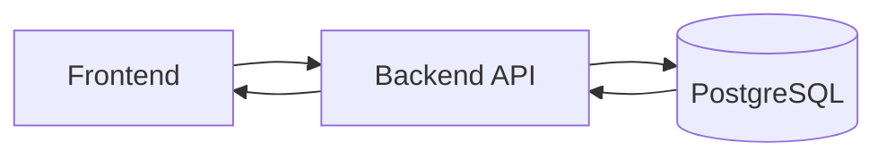

# SD_Flow Template v2 (Normalized)

ใช้ template เดียวกันสำหรับทุก endpoint ใน `Documents/SD_Flow`

## Endpoint Section Template

### API: `<METHOD /path>`

**Purpose**
- อธิบาย business intent แบบสั้น 1-2 บรรทัด

**FE Screen**
- หน้าที่เรียก endpoint เช่น `/finance/invoices`

**Params**
- Path Params:
  - `<name>` (`type`, required/optional) คำอธิบาย
- Query Params:
  - `<name>` (`type`, required/optional) คำอธิบาย

**Request Headers**
```json
{
  "Authorization": "Bearer <access_token>"
}
```

**Request Body**
```json
{}
```

**Response Body (200/201)**
```json
{
  "data": {}
}
```

**Sequence Flow**

