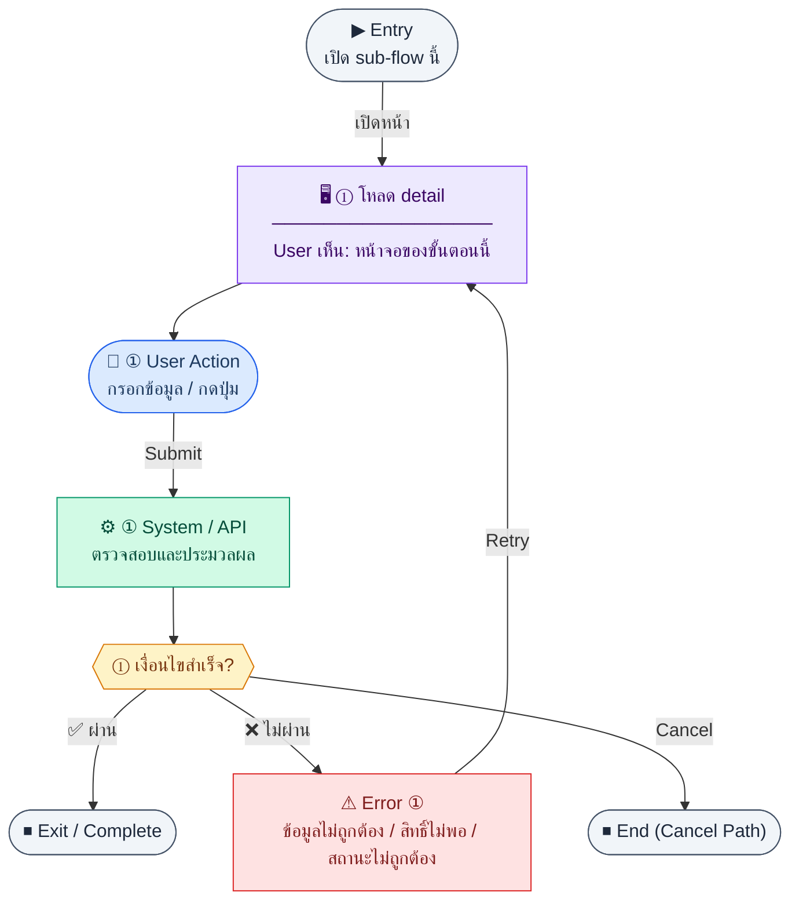
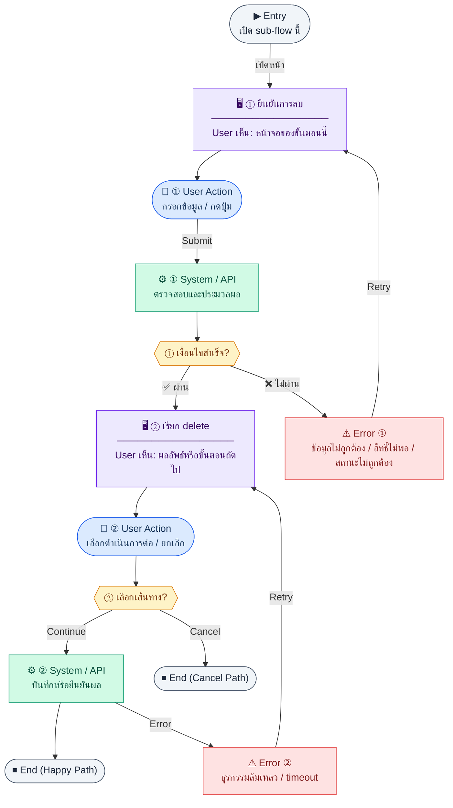

# EmployeeDetail

คู่มือแปลง UX → spec: [`../../UX_TO_UI_SPEC_WORKFLOW.md`](../../UX_TO_UI_SPEC_WORKFLOW.md)

**Route:** `/hr/employees/:id`

---

## Metadata

| Key | Value |
|-----|--------|
| **UX flow** | [`R1-02_HR_Employee_Management.md`](../../../UX_Flow/Functions/R1-02_HR_Employee_Management.md) |
| **UX sub-flow / steps** | สรุปใน Appendix — แตกตามหัวข้อ Sub-flow / Step ในเอกสาร UX |
| **Design system** | [`design-system.md`](../../design-system.md) — §3 Page layout, §5 forms, §6 DataTable ตามประเภทหน้า |
| **Global FE behaviors** | [`_GLOBAL_FRONTEND_BEHAVIORS.md`](../../../UX_Flow/_GLOBAL_FRONTEND_BEHAVIORS.md) |
| **Preview** | [`EmployeeDetail.preview.html`](./EmployeeDetail.preview.html) · [`../_Shared/preview-base.css`](../_Shared/preview-base.css) · [`MD_TO_PREVIEW_HTML_MANUAL.md`](../MD_TO_PREVIEW_HTML_MANUAL.md) |

---

## เป้าหมายหน้าจอ

แสดงข้อมูลเชิงลึกของพนักงานคนหนึ่ง

## ผู้ใช้และสิทธิ์

อ่าน Actor(s) และ permission gate ใน Appendix / เอกสาร UX — กรณี 401/403/409 อ้าง Global FE behaviors

## โครง layout (สรุป)

ระบุตามประเภทหน้าใน Appendix: list / detail / form / แท็บ — ใช้ pattern ใน design-system.md

## เนื้อหาและฟิลด์

สกัดจาก **User sees** / **User Action** / ช่องกรอกใน Appendix เป็นตารางฟิลด์เต็มเมื่อปรับแต่งรอบถัดไป; ขณะนี้ใช้บล็อก UX ด้านล่างเป็นข้อมูลอ้างอิงครบถ้วน

## การกระทำ (CTA)

สกัดจากปุ่มใน Appendix (`[...]`) และ Frontend behavior

## สถานะพิเศษ

Loading, empty, error, validation, dependency ขณะลบ — ตาม **Error** / **Success** ใน Appendix

## หมายเหตุ implementation (ถ้ามี)

เทียบ `erp_frontend` เมื่อทราบ path ของหน้า

## Preview HTML notes

| หัวข้อ | ใส่อะไร |
|--------|--------|
| **Shell** | โดยมาก `app` (ยกเว้นหน้า login / standalone) |
| **Regions** | ดูลำดับ **User sees** ใน Appendix |
| **สถานะสำหรับสลับใน preview** | `default` · `loading` · `empty` · `error` ตาม UX |
| **ข้อมูลจำลอง** | จำนวนแถว / สถานะ badge ตามประเภทหน้า |
| **ลิงก์ CSS** | [`../_Shared/preview-base.css`](../_Shared/preview-base.css) |

---

## Appendix — UX excerpt (reference)

## Sub-flow C — HR: รายละเอียดพนักงาน (`GET /api/hr/employees/:id`)

### ชื่อ Flow & ขอบเขต

**Flow name:** `HR Employee — Detail view`

**Actor(s):** HR ที่มีสิทธิ์ดู, หรือ manager ตาม BR (ถ้ามี)

**Entry:** คลิกแถวจาก list

**Exit:** แก้ไข, terminate, หรือกลับ list

**Out of scope:** ประวัติ audit แบบเต็ม (ถ้าไม่มี API)

---

### Scenario Flow

### สัญลักษณ์ Node (Color Legend)

| สี | Node shape | หมายถึง |
|----|-----------|---------|
| 🟣 ม่วง | สี่เหลี่ยม `["…"]` | **Screen / UI State** |
| 🔵 น้ำเงิน | วงกลม `(["…"])` | **User Action** |
| 🟢 เขียว | สี่เหลี่ยม `["…"]` | **System / API** |
| 🟡 เหลือง | เพชร `{{"…"}}` | **Decision** |
| 🔴 แดง | สี่เหลี่ยม `["…"]` | **Error / Edge case** |
| ⚫ เทา | วงรี `(["…"])` | **Start / End** |

---

### Step C1 — โหลด detail

**Goal:** แสดงข้อมูลเชิงลึกของพนักงานคนหนึ่ง

**User sees:** skeleton แล้วตามด้วยการ์ดข้อมูล

**User can do:** กลับ, แก้ไข (ถ้ามีปุ่ม)

**User Action:**
- ประเภท: `กดปุ่ม`
- ปุ่ม / Controls ในหน้านี้:
  - `[Edit Employee]` → เข้าโหมดแก้ไข
  - `[Terminate Employee]` → ไป flow ยืนยันการเลิกจ้าง/ลบ
  - `[Back to List]` → กลับหน้ารายการ

**Frontend behavior:**

- เรียก `GET /api/hr/employees/:id`
- เก็บ `id` จาก route param

**System / AI behavior:** ตรวจสิทธิ์และคืน record

**Success:** 200

**Error:** 404 (ไม่พบ), 403 (ห้ามดูคนนี้)

**Notes:** ถ้า user พยายามแก้ไขจาก URL โดยตรง — FE ต้องซ่อนปุ่มและ BE ต้อง 403

---

---

## Sub-flow F — HR: ลบ/เลิกจ้าง (`DELETE /api/hr/employees/:id`)

### ชื่อ Flow & ขอบเขต

**Flow name:** `HR Employee — Delete / terminate path`

**Actor(s):** `hr_admin`, `super_admin`

**Entry:** ปุ่มอันตรายในหน้า detail (หรือ action ใน list)

**Exit:** รายการลดลงหรือสถานะเป็น inactive ตาม BE semantics

**Out of scope:** cascade ลบข้อมูลทางการเงิน (ต้องอ้าง BR compliance)

---

### Scenario Flow

### สัญลักษณ์ Node (Color Legend)

| สี | Node shape | หมายถึง |
|----|-----------|---------|
| 🟣 ม่วง | สี่เหลี่ยม `["…"]` | **Screen / UI State** |
| 🔵 น้ำเงิน | วงกลม `(["…"])` | **User Action** |
| 🟢 เขียว | สี่เหลี่ยม `["…"]` | **System / API** |
| 🟡 เหลือง | เพชร `{{"…"}}` | **Decision** |
| 🔴 แดง | สี่เหลี่ยม `["…"]` | **Error / Edge case** |
| ⚫ เทา | วงรี `(["…"])` | **Start / End** |

---

### Step F1 — ยืนยันการลบ

**Goal:** กันการลบโดยไม่ตั้งใจ

**User sees:** modal ยืนยันพิมพ์ชื่อ/รหัส

**User can do:** ยืนยันหรือยกเลิก

**User Action:**
- ประเภท: `กรอกข้อมูล / กดปุ่ม`
- ช่องที่ต้องกรอก:
  - `confirmEmployeeCode` *(required)* : พิมพ์รหัสหรือชื่อพนักงานเพื่อยืนยัน
  - `terminationDate` *(required)* : วันที่มีผลสิ้นสุดการจ้าง
  - `reason` *(required)* : เหตุผลการเลิกจ้าง
- ปุ่ม / Controls ในหน้านี้:
  - `[Confirm Termination]` → ยืนยันการดำเนินการ
  - `[Cancel]` → ปิด modal

**Frontend behavior:** ไม่เรียก API จนกว่ายืนยัน

**System / AI behavior:** —

**Success:** ผู้ใช้ยืนยัน

**Error:** ยกเลิก → ปิด modal

**Notes:** flow นี้คือ soft terminate ตาม BR/SD ไม่ใช่ hard delete; request body ต้องคง shape `{ "terminationDate": "...", "reason": "..." }`

---

### Step F2 — เรียก delete

**Goal:** terminate พนักงานแบบ soft-delete ตาม contract

**User sees:** loading บน modal

**User can do:** รอ

**User Action:**
- ประเภท: `กดปุ่ม`
- ปุ่ม / Controls ในหน้านี้:
  - `[Delete Employee]` → เรียก `DELETE /api/hr/employees/:id`
  - `[Retry Delete]` → ลองใหม่เมื่อ API ล้มเหลว

**Frontend behavior:**

- `DELETE /api/hr/employees/:id` พร้อม body `{ "terminationDate": "...", "reason": "..." }`
- เมื่อ 200: navigate กลับ `GET /api/hr/employees` list และ invalidate cache

**System / AI behavior:** ตรวจ FK / soft-delete

**Success:** 200 พร้อม `data.status = terminated`, `data.endDate = terminationDate`

**Error:** 409 ถ้ามีข้อมูลอ้างอิง (เช่น payroll ที่ lock)

**Notes:** แสดงเหตุผลจาก body error ให้ user แก้ที่อื่นก่อน (เช่น ปิดงานที่ assign ให้คนนี้)

---

## Coverage Checklist

| Endpoint | Covered in UX file | Notes |
|----------|-------------------|-------|
| `GET /api/hr/employees/me` | Sub-flow A, Steps A1–A3 | `Documents/SD_Flow/HR/employee.md` |
| `GET /api/hr/employees` | Sub-flow B, Steps B1–B2; Sub-flow F, Step F2 | `employee.md` — list + invalidate หลังลบ |
| `GET /api/hr/employees/:id` | Sub-flow C, Step C1; Sub-flow E, Step E1 | `employee.md` — detail + pre-fill แก้ไข |
| `POST /api/hr/employees` | Sub-flow D, Steps D1–D2 | `employee.md` — สร้างพนักงาน |
| `PATCH /api/hr/employees/:id` | Sub-flow E, Step E2 | `employee.md` — partial update |
| `DELETE /api/hr/employees/:id` | Sub-flow F, Steps F1–F2 | `employee.md` — ลบ/เลิกจ้าง |
| `GET /api/hr/departments` | Sub-flow D, Step D1 | `Documents/SD_Flow/HR/organization.md` — shared selector dependency with `R1-03` |
| `GET /api/hr/positions` | Sub-flow D, Step D1 | `organization.md` — shared selector dependency with `R1-03` |
| `GET /api/auth/me` | Sub-flow A, Step A1 | `Documents/SD_Flow/User_Login/login.md` — permission gate โปรไฟล์ตนเอง |

### Coverage Lock Notes (2026-04-16)
- canonical field name ของวันเริ่มงานคือ `hireDate`
- list/filter ของหน้าพนักงานต้องรองรับ `hasUserAccount` เพื่อเชื่อม flow ไป `/settings/users`
- delete flow ให้ตีความเป็น soft terminate ตามสัญญา SD (`status`, `endDate`) ไม่ใช่ hard delete

---

## หมายเหตุ implementation (erp_frontend / ของเดิม)

(erp_frontend / ของเดิม)

(erp_frontend / ของเดิม)

(erp_frontend / ของเดิม)

## 1) States

- Loading: กลางจอ `h-48` + `common:status.loading`
- ไม่พบข้อมูล: ข้อความ `employee.empty`
- ปกติ: เนื้อหาเต็ม

---

## 2) Layout

- Root: `mx-auto max-w-2xl space-y-4`
- `Breadcrumb` — รายการพนักงาน → ชื่อปัจจุบัน
- **Hero card:** `rounded-xl border bg-card p-6`, responsive `sm:flex-row`
  - Avatar ตัวอักษรแรก: `h-20 w-20 rounded-2xl bg-primary/10 text-2xl font-bold text-primary`
  - ชื่อ `text-xl font-bold`, บรรทัดรอง EN + code
  - `StatusBadge` + ประเภทจ้าง `text-xs`
  - ปุ่ม: outline `แก้ไข` → edit; ถ้า `active` แสดงปุ่ม `terminate` (destructive border, confirm)
- **แท็บ:** `section rounded-xl border bg-card`
  - แถบแท็บ: ปุ่ม `border-b-2` active = `border-primary text-primary`
  - เนื้อหา: `grid gap-4 p-5 sm:grid-cols-2`
  - แท็บ: personal / work / financial — แต่ละช่องใช้ `Field` (label `text-xs text-muted-foreground`, value `text-sm font-medium`)

---

## 3) Actions

- Terminate: `window.confirm` → mutation → navigate `/hr/employees`

---

## 4) Component tree

1. Breadcrumb  
2. Hero (avatar + actions)  
3. Tabbed section + Field grid

---

## 5) Preview

[EmployeeDetail.preview.html](./EmployeeDetail.preview.html) · [`../_Shared/preview-base.css`](../_Shared/preview-base.css)
