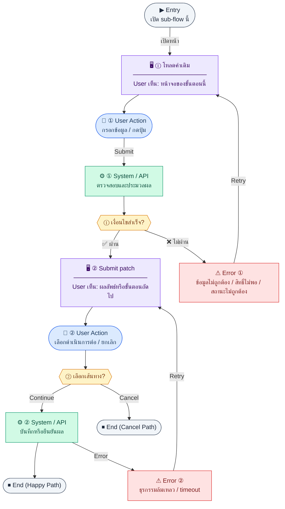

# EmployeeForm

คู่มือแปลง UX → spec: [`../../UX_TO_UI_SPEC_WORKFLOW.md`](../../UX_TO_UI_SPEC_WORKFLOW.md)

**Route:** `/hr/employees/new · .../edit`

---

## Metadata

| Key | Value |
|-----|--------|
| **UX flow** | [`R1-02_HR_Employee_Management.md`](../../../UX_Flow/Functions/R1-02_HR_Employee_Management.md) |
| **UX sub-flow / steps** | สรุปใน Appendix — แตกตามหัวข้อ Sub-flow / Step ในเอกสาร UX |
| **Design system** | [`design-system.md`](../../design-system.md) — §3 Page layout, §5 forms, §6 DataTable ตามประเภทหน้า |
| **Global FE behaviors** | [`_GLOBAL_FRONTEND_BEHAVIORS.md`](../../../UX_Flow/_GLOBAL_FRONTEND_BEHAVIORS.md) |
| **Preview** | [`EmployeeForm.preview.html`](./EmployeeForm.preview.html) · [`../_Shared/preview-base.css`](../_Shared/preview-base.css) · [`MD_TO_PREVIEW_HTML_MANUAL.md`](../MD_TO_PREVIEW_HTML_MANUAL.md) |

---

## เป้าหมายหน้าจอ

ให้เลือกแผนก/ตำแหน่งได้ถูกต้อง

## ผู้ใช้และสิทธิ์

อ่าน Actor(s) และ permission gate ใน Appendix / เอกสาร UX — กรณี 401/403/409 อ้าง Global FE behaviors

## โครง layout (สรุป)

ระบุตามประเภทหน้าใน Appendix: list / detail / form / แท็บ — ใช้ pattern ใน design-system.md

## เนื้อหาและฟิลด์

สกัดจาก **User sees** / **User Action** / ช่องกรอกใน Appendix เป็นตารางฟิลด์เต็มเมื่อปรับแต่งรอบถัดไป; ขณะนี้ใช้บล็อก UX ด้านล่างเป็นข้อมูลอ้างอิงครบถ้วน

## การกระทำ (CTA)

สกัดจากปุ่มใน Appendix (`[...]`) และ Frontend behavior

## สถานะพิเศษ

Loading, empty, error, validation, dependency ขณะลบ — ตาม **Error** / **Success** ใน Appendix

## หมายเหตุ implementation (ถ้ามี)

เทียบ `erp_frontend` เมื่อทราบ path ของหน้า

## Preview HTML notes

| หัวข้อ | ใส่อะไร |
|--------|--------|
| **Shell** | โดยมาก `app` (ยกเว้นหน้า login / standalone) |
| **Regions** | ดูลำดับ **User sees** ใน Appendix |
| **สถานะสำหรับสลับใน preview** | `default` · `loading` · `empty` · `error` ตาม UX |
| **ข้อมูลจำลอง** | จำนวนแถว / สถานะ badge ตามประเภทหน้า |
| **ลิงก์ CSS** | [`../_Shared/preview-base.css`](../_Shared/preview-base.css) |

---

## Appendix — UX excerpt (reference)

## Sub-flow D — HR: สร้างพนักงาน (`POST /api/hr/employees`)

### ชื่อ Flow & ขอบเขต

**Flow name:** `HR Employee — Create`

**Actor(s):** `hr_admin`, `super_admin`

**Entry:** ปุ่ม "เพิ่มพนักงาน"

**Exit:** ไปหน้า detail ของคนที่สร้าง หรืออยู่ที่ฟอร์มพร้อม error

**Out of scope:** สร้าง user account ใน API เดียวกับ employee — **ต้องทำแยกที่ Settings (R1-15)** หลังมีพนักงานแล้ว

---

### Scenario Flow

### สัญลักษณ์ Node (Color Legend)

| สี | Node shape | หมายถึง |
|----|-----------|---------|
| 🟣 ม่วง | สี่เหลี่ยม `["…"]` | **Screen / UI State** |
| 🔵 น้ำเงิน | วงกลม `(["…"])` | **User Action** |
| 🟢 เขียว | สี่เหลี่ยม `["…"]` | **System / API** |
| 🟡 เหลือง | เพชร `{{"…"}}` | **Decision** |
| 🔴 แดง | สี่เหลี่ยม `["…"]` | **Error / Edge case** |
| ⚫ เทา | วงรี `(["…"])` | **Start / End** |

---

### Step D1 — โหลด dropdown อ้างอิง

**Goal:** ให้เลือกแผนก/ตำแหน่งได้ถูกต้อง

**User sees:** ฟอร์มพร้อม dropdown ที่ loading

**User can do:** รอ

**User Action:**
- ประเภท: `กดปุ่ม`
- ปุ่ม / Controls ในหน้านี้:
  - `[Retry Loading Options]` → โหลด departments/positions ใหม่
  - `[Cancel Create]` → กลับหน้ารายการหรือปิด drawer

**Frontend behavior:**

- เรียก `GET /api/hr/departments`, `GET /api/hr/positions` (จากโมดูล organization — ดู UX R1-03) ก่อนหรือคู่ขนานกับเปิดฟอร์ม

**System / AI behavior:** คืนรายการสำหรับ select

**Success:** dropdown พร้อม

**Error:** ถ้า org API fail — แสดง warning และบล็อก submit ที่ต้องมีแผนก

**Notes:** BR ระบุว่า create/edit employee ใช้ departments + positions สำหรับ dropdown

---

### Step D2 — กรอกและ submit สร้าง

**Goal:** ส่งข้อมูลพนักงานใหม่ไปสร้าง record

**User sees:** ฟอร์มหลายส่วน (ข้อมูลส่วนตัว, การจ้างงาน, เงินเดือนฐาน ฯลฯ ตาม BR)

**User can do:** กรอก, บันทึก, ยกเลิก

**User Action:**
- ประเภท: `กรอกข้อมูล / เลือกตัวเลือก`
- ช่องที่ต้องกรอก:
  - `employeeCode` *(required)* : รหัสพนักงาน
  - `firstName` / `lastName` *(required)* : ชื่อและนามสกุล
  - `email` *(required)* : email พนักงาน
  - `departmentId` *(required)* : แผนก
  - `positionId` *(required)* : ตำแหน่ง
  - `hireDate` *(required)* : วันเริ่มงาน
  - `baseSalary` *(optional/required ตาม BR)* : เงินเดือนฐาน
- ปุ่ม / Controls ในหน้านี้:
  - `[Save Employee]` → เรียก `POST /api/hr/employees`
  - `[Cancel]` → ยกเลิกการสร้าง

**Frontend behavior:**

- client-side validation (required, email format ของฟิลด์ที่เกี่ยว, ตัวเลขเงินเดือน ≥ 0)
- `POST /api/hr/employees` พร้อม body ตาม schema BE

**System / AI behavior:**

- validate uniqueness (รหัสพนักงาน/email ถ้ามี), FK ไปแผนก/ตำแหน่ง

**Success:** 201 + `id` ใหม่ → navigate `/hr/employees/:id`

**Error:** 409 (ชน unique), 422 (field), 400

**Notes:** หลังสร้างสำเร็จ แสดง **callout / next step**: ผู้ที่มีสิทธิ์ `super_admin` (หรือตาม BR) ต้องไป **`/settings/users`** เพื่อสร้างบัญชี login และผูกพนักงานคนนี้ (`POST /api/settings/users` — ดู UX **R1-15 Sub-flow D**) การลิงก์แบบ **`/settings/users?employeeId=<newId>`** เป็น optional แต่ช่วยลด dead end

---

---

## Sub-flow E — HR: แก้ไขพนักงาน (`PATCH /api/hr/employees/:id`)

### ชื่อ Flow & ขอบเขต

**Flow name:** `HR Employee — Partial update`

**Actor(s):** `hr_admin`, `super_admin`

**Entry:** จากหน้า detail → "แก้ไข"

**Exit:** บันทึกสำเร็จกลับ detail หรือคงอยู่ในฟอร์มพร้อม error

**Out of scope:** การแก้ role ในระบบ auth (ถ้าแยก endpoint)

---

### Scenario Flow

### สัญลักษณ์ Node (Color Legend)

| สี | Node shape | หมายถึง |
|----|-----------|---------|
| 🟣 ม่วง | สี่เหลี่ยม `["…"]` | **Screen / UI State** |
| 🔵 น้ำเงิน | วงกลม `(["…"])` | **User Action** |
| 🟢 เขียว | สี่เหลี่ยม `["…"]` | **System / API** |
| 🟡 เหลือง | เพชร `{{"…"}}` | **Decision** |
| 🔴 แดง | สี่เหลี่ยม `["…"]` | **Error / Edge case** |
| ⚫ เทา | วงรี `(["…"])` | **Start / End** |

---

### Step E1 — โหลดค่าเดิม

**Goal:** pre-fill ฟอร์มจาก server

**User sees:** loading แล้วค่าเดิม

**User can do:** แก้ไขฟิลด์ที่อนุญาต

**User Action:**
- ประเภท: `กดปุ่ม`
- ปุ่ม / Controls ในหน้านี้:
  - `[Save Changes]` → เปิดใช้งานเมื่อมี dirty fields
  - `[Discard Changes]` → คืนค่าจากข้อมูลเดิม

**Frontend behavior:**

- `GET /api/hr/employees/:id` แล้ว bind form
- แยก "dirty state" — ปุ่มบันทึก enable เฉพาะเมื่อมีการเปลี่ยนแปลง

**System / AI behavior:** —

**Success:** ฟอร์มพร้อมแก้ไข

**Error:** โหลดไม่ได้ → retry

**Notes:** PATCH ส่งเฉพาะฟิลด์ที่เปลี่ยน (ถ้า BE รองรับ partial) เพื่อลด race

---

### Step E2 — Submit patch

**Goal:** อัปเดตข้อมูลพนักงานบางส่วน

**User sees:** loading บนปุ่มบันทึก

**User can do:** รอ

**User Action:**
- ประเภท: `กรอกข้อมูล / เลือกตัวเลือก`
- ช่องที่ต้องกรอก:
  - `email` *(optional)* : แก้ email
  - `departmentId` *(optional)* : เปลี่ยนแผนก
  - `positionId` *(optional)* : เปลี่ยนตำแหน่ง
  - `baseSalary` *(optional)* : ปรับเงินเดือนฐาน
  - `status` *(optional)* : เปลี่ยนสถานะพนักงานเมื่อ BR อนุญาต
- ปุ่ม / Controls ในหน้านี้:
  - `[Update Employee]` → เรียก `PATCH /api/hr/employees/:id`
  - `[Cancel]` → ยกเลิกการแก้ไข

**Frontend behavior:**

- `PATCH /api/hr/employees/:id` พร้อม body ที่ diff จากค่าเดิม

**System / AI behavior:** validate business rules (เช่น terminate ต้องมีวันที่สิ้นสุด — ถ้ามีใน BR)

**Success:** 200 + toast

**Error:** 409/422 พร้อม highlight field

**Notes:** ถ้ามี concurrent edit — แสดง conflict ถ้า BE ส่ง version/etag

---

---

## หมายเหตุ implementation (erp_frontend / ของเดิม)

(erp_frontend / ของเดิม)

(erp_frontend / ของเดิม)

(erp_frontend / ของเดิม)

## 1) States

- Edit + โหลดข้อมูล: กลางจอ loading
- Form: `react-hook-form` + `zod` (`createEmployeeFormSchema`)

---

## 2) Layout (`EmployeeFormPage`)

- Root: `mx-auto max-w-3xl space-y-4`
- `Breadcrumb` — รายการ → สร้าง/แก้ไข
- `PageHeader` — title สร้างหรือแก้ไข
- `form space-y-6`:
  - `EmployeeForm` (sections)
  - แสดง `root` error ถ้ามี (`text-sm text-destructive`)
  - Footer: `flex justify-end gap-3` — Cancel (outline), Save (primary, disabled ขณะ mutation)

---

## 3) `EmployeeForm` — โครง section

ทุก section: `rounded-xl border bg-card` + header `border-b bg-muted/40 px-5 py-3` + `h3 text-sm font-semibold`  
Body: `grid gap-4 p-5 md:grid-cols-2`

### Section ส่วนบุคคล (`sectionPersonal`)

- ฟิลด์ hint รหัส (disabled input จาก `Field` component)
- เลขบัตรประชาชน * (แก้ไข mode อาจ disabled)
- ชื่อ/นามสกุล TH *, EN, ชื่อเล่น
- วันเกิด * (date), เพศ * (select), โทร, อีเมล, ที่อยู่ (textarea `md:col-span-2`)

### Section การทำงาน (`sectionWork`)

- แผนก, ตำแหน่ง (select จาก API)
- ประเภทจ้าง *, วันเริ่ม *, วันสิ้นสุด (optional), managerId (text)

### Section การเงิน (`sectionFinance`)

- เงินเดือน *, ธนาคาร, เลขบัญชี, ชื่อบัญชี
- Checkbox ประกันสังคม (`ssEnrolled`)

สไตล์ input หลัก: `w-full rounded-md border border-input px-3 py-2 text-sm`  
Error ระดับฟิลด์: `mt-1 text-xs text-destructive`

---

## 4) Navigation หลังบันทึก

- Create → `/hr/employees/{id}`  
- Edit → `/hr/employees/{id}`

---

## 5) Component tree

1. Breadcrumb  
2. PageHeader  
3. Form → EmployeeForm (3 sections) → errors → actions

---

## 6) Preview

[EmployeeForm.preview.html](./EmployeeForm.preview.html) · [`../_Shared/preview-base.css`](../_Shared/preview-base.css)
