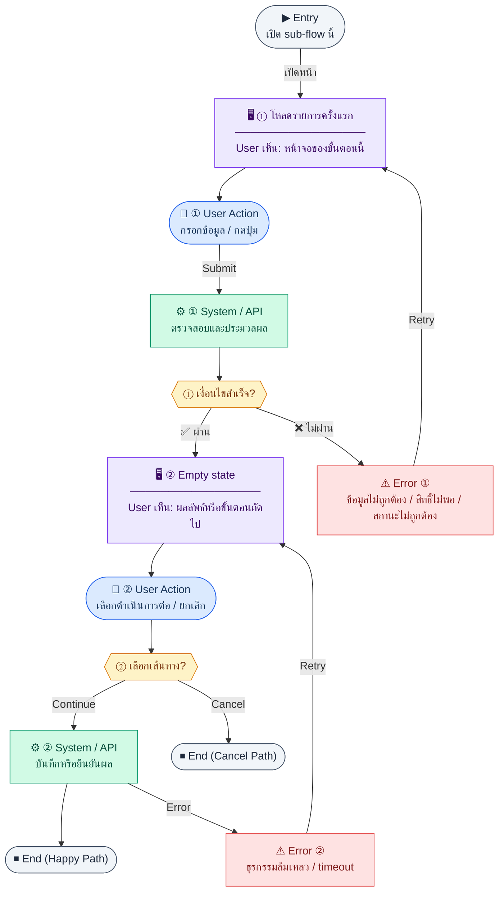

# EmployeeList

คู่มือแปลง UX → spec: [`../../UX_TO_UI_SPEC_WORKFLOW.md`](../../UX_TO_UI_SPEC_WORKFLOW.md)

**Route:** `/hr/employees`

---

## Metadata

| Key | Value |
|-----|--------|
| **UX flow** | [`R1-02_HR_Employee_Management.md`](../../../UX_Flow/Functions/R1-02_HR_Employee_Management.md) |
| **UX sub-flow / steps** | สรุปใน Appendix — แตกตามหัวข้อ Sub-flow / Step ในเอกสาร UX |
| **Design system** | [`design-system.md`](../../design-system.md) — §3 Page layout, §5 forms, §6 DataTable ตามประเภทหน้า |
| **Global FE behaviors** | [`_GLOBAL_FRONTEND_BEHAVIORS.md`](../../../UX_Flow/_GLOBAL_FRONTEND_BEHAVIORS.md) |
| **Preview** | [`EmployeeList.preview.html`](./EmployeeList.preview.html) · [`../_Shared/preview-base.css`](../_Shared/preview-base.css) · [`MD_TO_PREVIEW_HTML_MANUAL.md`](../MD_TO_PREVIEW_HTML_MANUAL.md) |

---

## เป้าหมายหน้าจอ

แสดงตารางพนักงานพร้อม pagination/filter ตาม query ที่ BE รองรับ

## ผู้ใช้และสิทธิ์

อ่าน Actor(s) และ permission gate ใน Appendix / เอกสาร UX — กรณี 401/403/409 อ้าง Global FE behaviors

## โครง layout (สรุป)

ระบุตามประเภทหน้าใน Appendix: list / detail / form / แท็บ — ใช้ pattern ใน design-system.md

## เนื้อหาและฟิลด์

สกัดจาก **User sees** / **User Action** / ช่องกรอกใน Appendix เป็นตารางฟิลด์เต็มเมื่อปรับแต่งรอบถัดไป; ขณะนี้ใช้บล็อก UX ด้านล่างเป็นข้อมูลอ้างอิงครบถ้วน

## การกระทำ (CTA)

สกัดจากปุ่มใน Appendix (`[...]`) และ Frontend behavior

## สถานะพิเศษ

Loading, empty, error, validation, dependency ขณะลบ — ตาม **Error** / **Success** ใน Appendix

## หมายเหตุ implementation (ถ้ามี)

เทียบ `erp_frontend` เมื่อทราบ path ของหน้า

## Preview HTML notes

| หัวข้อ | ใส่อะไร |
|--------|--------|
| **Shell** | โดยมาก `app` (ยกเว้นหน้า login / standalone) |
| **Regions** | ดูลำดับ **User sees** ใน Appendix |
| **สถานะสำหรับสลับใน preview** | `default` · `loading` · `empty` · `error` ตาม UX |
| **ข้อมูลจำลอง** | จำนวนแถว / สถานะ badge ตามประเภทหน้า |
| **ลิงก์ CSS** | [`../_Shared/preview-base.css`](../_Shared/preview-base.css) |

---

## Appendix — UX excerpt (reference)

## Sub-flow B — HR: รายการพนักงาน (`GET /api/hr/employees`)

### ชื่อ Flow & ขอบเขต

**Flow name:** `HR Employee — List + filter + search`

**Actor(s):** `hr_admin`, `super_admin` (และ role ที่ BR อนุญาตให้ดูรายการ)

**Entry:** เมนู HR → พนักงาน

**Exit:** เลือกแถวเพื่อไป detail หรือกดสร้างใหม่

**Out of scope:** export CSV (ถ้าไม่มีใน BR)

---

### Scenario Flow

### สัญลักษณ์ Node (Color Legend)

| สี | Node shape | หมายถึง |
|----|-----------|---------|
| 🟣 ม่วง | สี่เหลี่ยม `["…"]` | **Screen / UI State** |
| 🔵 น้ำเงิน | วงกลม `(["…"])` | **User Action** |
| 🟢 เขียว | สี่เหลี่ยม `["…"]` | **System / API** |
| 🟡 เหลือง | เพชร `{{"…"}}` | **Decision** |
| 🔴 แดง | สี่เหลี่ยม `["…"]` | **Error / Edge case** |
| ⚫ เทา | วงรี `(["…"])` | **Start / End** |

---

### Step B1 — โหลดรายการครั้งแรก

**Goal:** แสดงตารางพนักงานพร้อม pagination/filter ตาม query ที่ BE รองรับ

**User sees:** ตารางว่าง/loading, ช่องค้นหา, filter แผนก/ตำแหน่ง/สถานะ (ตาม BR)

**User can do:** ปรับ filter, พิมพ์ค้นหา, เปลี่ยนหน้า

**User Action:**
- ประเภท: `กรอกข้อมูล / เลือกตัวเลือก`
- ช่องที่ใช้กรอง/ค้นหา:
  - `search` *(optional)* : ค้นหาจากชื่อ, รหัสพนักงาน, email
  - `departmentId` *(optional)* : กรองตามแผนก
  - `positionId` *(optional)* : กรองตามตำแหน่ง
  - `status` *(optional)* : active, inactive, terminated
- ปุ่ม / Controls ในหน้านี้:
  - `[Apply Filters]` → โหลดรายการตามเงื่อนไข
  - `[Create Employee]` → เปิดฟอร์มสร้างพนักงาน
  - `[Open Detail]` → ไปหน้ารายละเอียดของแถวที่เลือก

**Frontend behavior:**

- เรียก `GET /api/hr/employees` พร้อม query string (pagination, `departmentId`, `positionId`, `status` ฯลฯ — ตามสัญญา API จริง)
- debounce ช่องค้นหาเพื่อลด load

**System / AI behavior:** คืนรายการตามสิทธิ์และ scope

**Success:** แสดงแถวข้อมูล

**Error:** 403 → หน้า access denied; 500 → retry

**Notes:** ชัดเจนใน SD ว่า query รองรับอะไร — FE ต้องส่งเฉพาะพารามิเตอร์ที่ BE รับ

---

### Step B2 — Empty state

**Goal:** สื่อสารเมื่อไม่มีข้อมูลจาก filter

**User sees:** empty illustration + คำแนะนำล้าง filter

**User can do:** ล้าง filter หรือสร้างพนักงานใหม่

**User Action:**
- ประเภท: `กดปุ่ม`
- ปุ่ม / Controls ในหน้านี้:
  - `[Clear Filters]` → ล้าง filter เพื่อดูข้อมูลทั้งหมด
  - `[Create Employee]` → เปิดฟอร์มเพิ่มพนักงานคนแรก
  - `[Retry]` → โหลดรายการซ้ำเมื่อเกิด network error

**Frontend behavior:** ไม่เรียก API ซ้ำจนกว่า user เปลี่ยนเงื่อนไข

**System / AI behavior:** —

**Success:** ผู้ใช้เข้าใจว่าไม่มีผลลัพธ์

**Error:** —

**Notes:** แยก "ไม่มีข้อมูลในระบบ" กับ "filter คุมเกินไป" ถ้า API แยก code ได้

---

---

## หมายเหตุ implementation (erp_frontend / ของเดิม)

(erp_frontend / ของเดิม)

(erp_frontend / ของเดิม)

(erp_frontend / ของเดิม)

## 1) Permission

- ไม่มี `hr:employee:view` → `PageHeader` + ข้อความ `employee.list.noPermission`
- มี `hr:employee:create` → ปุ่ม primary ไป `/hr/employees/new`

---

## 2) Layout

- Root: `space-y-6`
- `PageHeader` — title `employee.list.title`, actions ปุ่มสร้าง (ถ้ามีสิทธิ์)
- **สถิติ 4 การ์ด:** `grid gap-4 sm:grid-cols-2 lg:grid-cols-4`
  - การ์ดละ `rounded-xl border bg-card p-4`
  - ตัวเลข `text-2xl font-bold` + สี hard-coded (`text-blue-600`, `text-green-600`, `text-orange-600`, `text-muted-foreground`)
  - ป้าย `text-sm text-muted-foreground`
- **แถว filter:** `flex flex-wrap items-center gap-4`
  - Search: `relative min-w-48 flex-1`, ไอคอน `Search` ซ้าย, `input` `rounded-md border ... pl-9 focus:ring-2`
  - Select สถานะพนักงาน + ประเภทจ้าง (`rounded-md border bg-background px-3 py-2 text-sm`)
- `DataTable` — `onRowClick` → detail, `emptyText` = `employee.empty`

---

## 3) คอลัมน์ตาราง

- code, ชื่อ TH, ประเภทจ้าง (แปล), วันเริ่ม (Thai date), `StatusBadge` สถานะ, เงินเดือน (`formatCurrency`), actions
- Actions: ลิงก์ icon `Eye` → detail, `Edit2` → edit (`stopPropagation` บน container)

---

## 4) Component tree

1. PageHeader  
2. Stat cards (4)  
3. Search + 2 selects  
4. DataTable

---

## 5) Preview

[EmployeeList.preview.html](./EmployeeList.preview.html) · CSS: [`../_Shared/preview-base.css`](../_Shared/preview-base.css)
