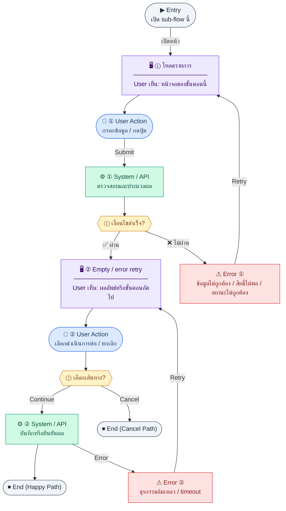
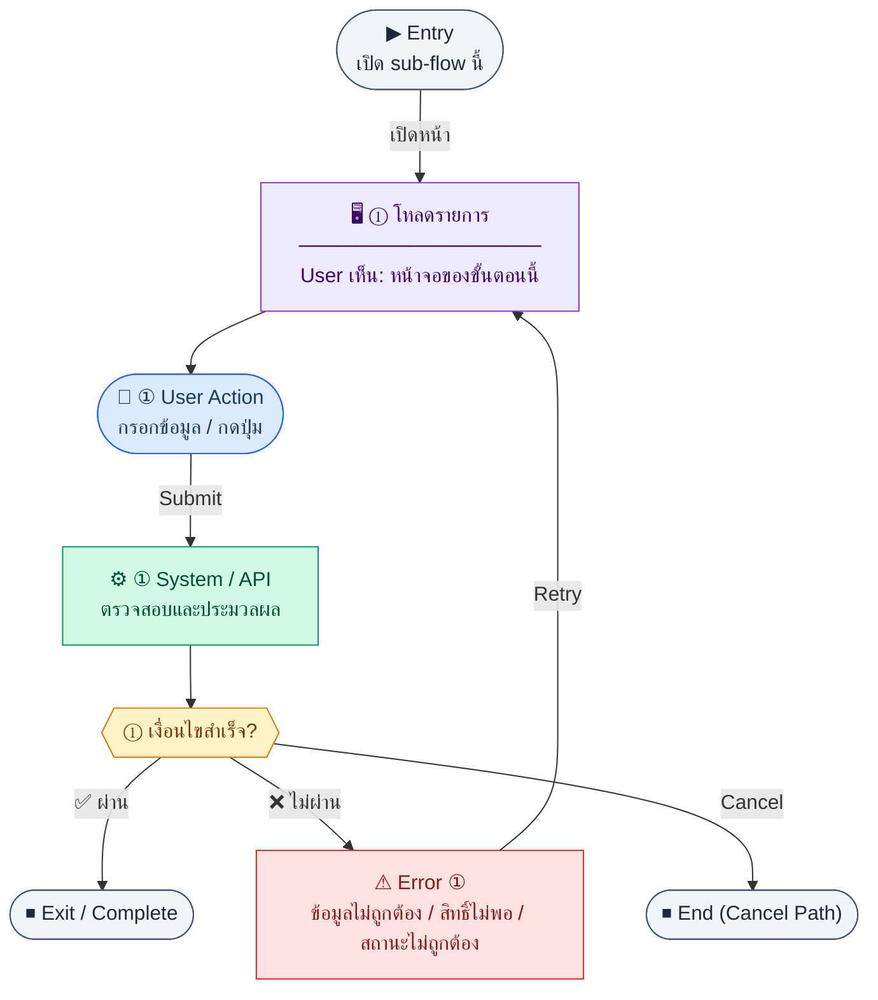
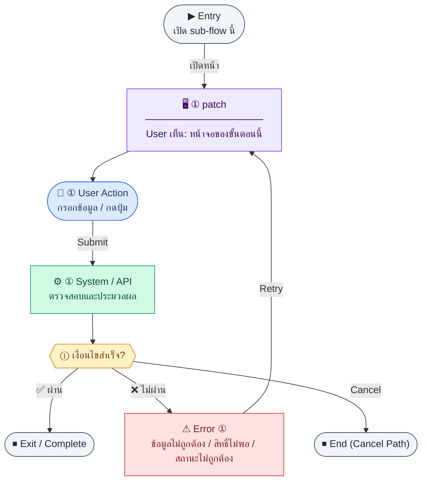
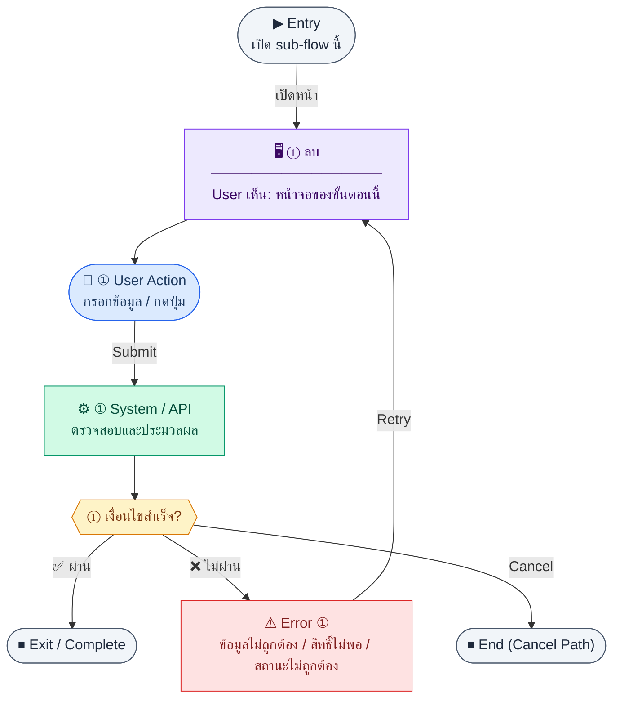

# Organization

คู่มือแปลง UX → spec: [`../../UX_TO_UI_SPEC_WORKFLOW.md`](../../UX_TO_UI_SPEC_WORKFLOW.md)

**Route:** `/hr/organization`

---

## Metadata

| Key | Value |
|-----|--------|
| **UX flow** | [`R1-03_HR_Organization_Management.md`](../../../UX_Flow/Functions/R1-03_HR_Organization_Management.md) |
| **UX sub-flow / steps** | สรุปใน Appendix — แตกตามหัวข้อ Sub-flow / Step ในเอกสาร UX |
| **Design system** | [`design-system.md`](../../design-system.md) — §3 Page layout, §5 forms, §6 DataTable ตามประเภทหน้า |
| **Global FE behaviors** | [`_GLOBAL_FRONTEND_BEHAVIORS.md`](../../../UX_Flow/_GLOBAL_FRONTEND_BEHAVIORS.md) |
| **Preview** | [`Organization.preview.html`](./Organization.preview.html) · [`../_Shared/preview-base.css`](../_Shared/preview-base.css) · [`../MD_TO_PREVIEW_HTML_MANUAL.md`](../MD_TO_PREVIEW_HTML_MANUAL.md) |
| **ฟอร์มย่อย (โมดัล)** | [`DepartmentForm.md`](./DepartmentForm.md) · [`PositionForm.md`](./PositionForm.md) |

---

## เป้าหมายหน้าจอ

ซ่อน/แสดงปุ่มสร้าง แก้ไข ลบ ตาม permission

## ผู้ใช้และสิทธิ์

อ่าน Actor(s) และ permission gate ใน Appendix / เอกสาร UX — กรณี 401/403/409 อ้าง Global FE behaviors

## โครง layout (สรุป)

ระบุตามประเภทหน้าใน Appendix: list / detail / form / แท็บ — ใช้ pattern ใน design-system.md

## เนื้อหาและฟิลด์

สกัดจาก **User sees** / **User Action** / ช่องกรอกใน Appendix เป็นตารางฟิลด์เต็มเมื่อปรับแต่งรอบถัดไป; ขณะนี้ใช้บล็อก UX ด้านล่างเป็นข้อมูลอ้างอิงครบถ้วน

## การกระทำ (CTA)

สกัดจากปุ่มใน Appendix (`[...]`) และ Frontend behavior

## สถานะพิเศษ

Loading, empty, error, validation, dependency ขณะลบ — ตาม **Error** / **Success** ใน Appendix

## หมายเหตุ implementation (ถ้ามี)

เทียบ `erp_frontend` เมื่อทราบ path ของหน้า

## Preview HTML notes

| หัวข้อ | ใส่อะไร |
|--------|--------|
| **Shell** | โดยมาก `app` (ยกเว้นหน้า login / standalone) |
| **Regions** | `PageHeader` → **`control-panel`** (สลับสถานะรายการ + dark mode ตาม [`MD_TO_PREVIEW_HTML_MANUAL.md`](../MD_TO_PREVIEW_HTML_MANUAL.md)) → grid 2 คอลัมน์ → **โมดัล** แยก layer (`#modalDept` / `#modalPos`) เปิดจากปุ่มเพิ่ม |
| **สถานะสำหรับสลับใน preview** | `default` · `loading` · `empty` · `error` ตาม UX — ใช้ radio ใน `control-panel` |
| **ข้อมูลจำลอง** | จำนวนแถว / สถานะ badge ตามประเภทหน้า; ฟอร์มโมดัลย่อยสอดคล้อง [`DepartmentForm.preview.html`](./DepartmentForm.preview.html) / [`PositionForm.preview.html`](./PositionForm.preview.html) |
| **ลิงก์ CSS** | [`../_Shared/preview-base.css`](../_Shared/preview-base.css) — `.control-panel`, `.modal-backdrop`, `.skeleton-stack` |

---

## Appendix — UX excerpt (reference)

## ส่วนกลาง — Permission gate & การใช้ข้อมูลข้ามโมดูล

### ชื่อ Flow & ขอบเขต

**Flow name:** `HR Organization — เข้าถึงเมนูและข้อมูลอ้างอิงสำหรับฟอร์มอื่น`

**Actor(s):** `hr_admin`, `super_admin` สำหรับ CRUD; พนักงานทั่วไปอาจ **อ่าน** บางส่วนผ่าน dropdown ในฟอร์มอื่น (ตาม BR)

**Entry:** เมนู HR → องค์กร หรือเปิดฟอร์มพนักงานที่ต้องโหลด dropdown

**Exit:** จัดการแผนก/ตำแหน่งสำเร็จ หรือส่งค่าไป bind ฟอร์ม employee/leave config

**Out of scope:** org chart visualization แบบกราฟ (ถ้าไม่มีใน scope)

---

### Step G1 — ตรวจสิทธิ์ก่อนแสดง UI แก้ไข

**Goal:** ซ่อน/แสดงปุ่มสร้าง แก้ไข ลบ ตาม permission

**User sees:** หน้า organization แบบ read-only หรือเต็มรูปแบบ

**User can do:** ดูอย่างเดียวหรือจัดการ

**User Action:**
- ประเภท: `กดปุ่ม`
- ปุ่ม / Controls ในหน้านี้:
  - `[Open Organization]` → เข้าเมนูองค์กร
  - `[Back]` → กลับหน้าก่อนหน้าเมื่อไม่มีสิทธิ์จัดการ

**Frontend behavior:**

- ใช้ permission จาก `GET /api/auth/me` / login response
- ไม่พึ่งการซ่อนปุ่มอย่างเดียว — ต้องรับ 403 จาก API อย่างสง่างาม

**System / AI behavior:** API enforce role

**Success:** UI สอดคล้องกับสิทธิ์จริง

**Error:** —

**Notes:** BR ระบุว่า employee create/edit ดึง departments + positions — ดังนั้น **read path** ของ org endpoints ถูกเรียกบ่อยจากฟอร์มอื่น

---

---

## Sub-flow D1 — รายการแผนก (`GET /api/hr/departments`)

### ชื่อ Flow & ขอบเขต

**Flow name:** `HR Departments — List`

**Actor(s):** HR ที่มีสิทธิ์, super_admin

**Entry:** แท็บ "แผนก" ในหน้า Organization

**Exit:** เลือกแผนกเพื่อดูรายละเอียดหรือสร้างใหม่

**Out of scope:** drag-drop ลำดับชั้นแบบ tree (ถ้าไม่มี API)

---

### Scenario Flow

### สัญลักษณ์ Node (Color Legend)

| สี | Node shape | หมายถึง |
|----|-----------|---------|
| 🟣 ม่วง | สี่เหลี่ยม `["…"]` | **Screen / UI State** |
| 🔵 น้ำเงิน | วงกลม `(["…"])` | **User Action** |
| 🟢 เขียว | สี่เหลี่ยม `["…"]` | **System / API** |
| 🟡 เหลือง | เพชร `{{"…"}}` | **Decision** |
| 🔴 แดง | สี่เหลี่ยม `["…"]` | **Error / Edge case** |
| ⚫ เทา | วงรี `(["…"])` | **Start / End** |

---

### Step 1 — โหลดรายการ

**Goal:** แสดงรายการแผนกทั้งหมดพร้อมตัวกรองที่ BE รองรับ

**User sees:** ตาราง/การ์ด, loading

**User can do:** ค้นหา/กรอง (ถ้ามี query)

**User Action:**
- ประเภท: `กรอกข้อมูล / เลือกตัวเลือก`
- ช่องที่ใช้กรอง/ค้นหา:
  - `search` *(optional)* : ค้นหาจากชื่อหรือ code แผนก
- ปุ่ม / Controls ในหน้านี้:
  - `[Apply Filters]` → โหลดรายการแผนก
  - `[Create Department]` → เปิดฟอร์มสร้าง
  - `[Open Department]` → ไปหน้า detail

**Frontend behavior:**

- `GET /api/hr/departments` (+ query ตามสัญญา SD/BE)
- cache สั้น ๆ (stale-while-revalidate) เพื่อลดการกระพริบเมื่อสลับแท็บ

**System / AI behavior:** คืนรายการ

**Success:** 200

**Error:** 401 → refresh flow auth; 403 → access denied

**Notes:** ข้อมูลแผนกถูกอ้างอิงจาก leave approval config ตาม BR — แสดง `code` แผนกให้ชัดเพื่อให้ HR map กับนโยบายการลา

---

### Step 2 — Empty / error retry

**Goal:** จัดการสถานะว่างและเครือข่าย

**User sees:** empty state หรือ inline error + ปุ่ม retry

**User can do:** retry

**User Action:**
- ประเภท: `กดปุ่ม`
- ปุ่ม / Controls ในหน้านี้:
  - `[Retry]` → โหลดรายการแผนกใหม่
  - `[Create Department]` → เพิ่มแผนกใหม่เมื่อยังไม่มีข้อมูล
  - `[Clear Filters]` → ล้างเงื่อนไขค้นหา

**Frontend behavior:** เรียก `GET /api/hr/departments` ซ้ำด้วย backoff ง่าย ๆ

**System / AI behavior:** —

**Success:** ได้ข้อมูลหรือยืนยันว่าว่างจริง

**Error:** timeout

**Notes:** —

---

---

## Sub-flow D2 — รายละเอียดแผนก (`GET /api/hr/departments/:id`)

### Scenario Flow

### สัญลักษณ์ Node (Color Legend)

| สี | Node shape | หมายถึง |
|----|-----------|---------|
| 🟣 ม่วง | สี่เหลี่ยม `["…"]` | **Screen / UI State** |
| 🔵 น้ำเงิน | วงกลม `(["…"])` | **User Action** |
| 🟢 เขียว | สี่เหลี่ยม `["…"]` | **System / API** |
| 🟡 เหลือง | เพชร `{{"…"}}` | **Decision** |
| 🔴 แดง | สี่เหลี่ยม `["…"]` | **Error / Edge case** |
| ⚫ เทา | วงรี `(["…"])` | **Start / End** |

---

### Step 1 — เปิดรายละเอียด

**Goal:** ดู metadata แผนก (ชื่อ, รหัส, parent ถ้ามี ฯลฯ ตาม schema)

**User sees:** skeleton แล้วรายละเอียด

**User can do:** แก้ไข, ลบ (ถ้ามีสิทธิ์)

**User Action:**
- ประเภท: `กดปุ่ม`
- ปุ่ม / Controls ในหน้านี้:
  - `[Edit Department]` → เข้าโหมดแก้ไข
  - `[Delete Department]` → เปิด modal ลบ
  - `[Back to List]` → กลับหน้ารายการ

**Frontend behavior:** `GET /api/hr/departments/:id`

**System / AI behavior:** validate ownership/visibility

**Success:** 200

**Error:** 404

**Notes:** ถ้า user แก้ URL เป็น id ที่ไม่มี — แสดง not found

---

---

## Sub-flow D3 — สร้างแผนก (`POST /api/hr/departments`)

### Scenario Flow

### สัญลักษณ์ Node (Color Legend)

| สี | Node shape | หมายถึง |
|----|-----------|---------|
| 🟣 ม่วง | สี่เหลี่ยม `["…"]` | **Screen / UI State** |
| 🔵 น้ำเงิน | วงกลม `(["…"])` | **User Action** |
| 🟢 เขียว | สี่เหลี่ยม `["…"]` | **System / API** |
| 🟡 เหลือง | เพชร `{{"…"}}` | **Decision** |
| 🔴 แดง | สี่เหลี่ยม `["…"]` | **Error / Edge case** |
| ⚫ เทา | วงรี `(["…"])` | **Start / End** |

---

### Step 1 — ฟอร์มสร้าง

**Goal:** สร้างแผนกใหม่ถูกต้องตาม constraint (เช่น `code` unique ตาม BR)

**User sees:** ฟอร์มฟิลด์ที่จำเป็น

**User can do:** บันทึก, ยกเลิก

**User Action:**
- ประเภท: `กรอกข้อมูล / เลือกตัวเลือก`
- ช่องที่ต้องกรอก:
  - `code` *(required)* : รหัสแผนก
  - `name` *(required)* : ชื่อแผนก
  - `managerId` *(optional/conditional)* : ผู้จัดการแผนก
  - `parentDepartmentId` *(optional)* : แผนกแม่
- ปุ่ม / Controls ในหน้านี้:
  - `[Save Department]` → เรียก `POST /api/hr/departments`
  - `[Cancel]` → ปิดฟอร์ม

**Frontend behavior:**

- validate ฝั่ง client (required, ความยาว `code`)
- `POST /api/hr/departments`

**System / AI behavior:** enforce unique `code`, FK parent ถ้ามี

**Success:** 201 → navigate ไป detail หรือ refresh list

**Error:** 409 ชื่อ/รหัสซ้ำ

**Notes:** หลังสร้างแผนก ให้ไปตั้ง **สายอนุมัติการลา** สำหรับ `departmentId` นี้ผ่าน **`/hr/leaves`** (แท็บ/ส่วน “สายอนุมัติ” — ดู UX **R1-04 Sub-flow H**) และ API `GET/POST /api/hr/leaves/approval-configs` ตาม BR Feature 1.4

---

---

## Sub-flow D4 — แก้ไขแผนก (`PATCH /api/hr/departments/:id`)

### Scenario Flow

### สัญลักษณ์ Node (Color Legend)

| สี | Node shape | หมายถึง |
|----|-----------|---------|
| 🟣 ม่วง | สี่เหลี่ยม `["…"]` | **Screen / UI State** |
| 🔵 น้ำเงิน | วงกลม `(["…"])` | **User Action** |
| 🟢 เขียว | สี่เหลี่ยม `["…"]` | **System / API** |
| 🟡 เหลือง | เพชร `{{"…"}}` | **Decision** |
| 🔴 แดง | สี่เหลี่ยม `["…"]` | **Error / Edge case** |
| ⚫ เทา | วงรี `(["…"])` | **Start / End** |

---

### Step 1 — โหลด + แก้ไข

**Goal:** อัปเดตบางฟิลด์โดยไม่ส่งทั้ง record ถ้าไม่จำเป็น

**User sees:** ฟอร์ม pre-filled

**User can do:** แก้ไขและบันทึก

**User Action:**
- ประเภท: `กรอกข้อมูล / เลือกตัวเลือก`
- ช่องที่ต้องกรอก:
  - `name` *(optional)* : ชื่อแผนก
  - `managerId` *(optional)* : ผู้จัดการแผนก
  - `parentDepartmentId` *(optional)* : แผนกแม่
- ปุ่ม / Controls ในหน้านี้:
  - `[Save Changes]` → เรียก `PATCH /api/hr/departments/:id`
  - `[Cancel]` → ยกเลิกการแก้ไข

**Frontend behavior:**

- `GET /api/hr/departments/:id` แล้ว `PATCH /api/hr/departments/:id`

**System / AI behavior:** ตรวจผลกระทบต่อ employee ที่อ้างอิง (ถ้ามี)

**Success:** 200

**Error:** 422

**Notes:** ถ้าเปลี่ยน `code` ที่ถูกอ้างอิงใน integration — แสดงคำเตือนก่อนบันทึก (product copy)

---

---

## Sub-flow D5 — ลบแผนก (`DELETE /api/hr/departments/:id`)

### Scenario Flow

### สัญลักษณ์ Node (Color Legend)

| สี | Node shape | หมายถึง |
|----|-----------|---------|
| 🟣 ม่วง | สี่เหลี่ยม `["…"]` | **Screen / UI State** |
| 🔵 น้ำเงิน | วงกลม `(["…"])` | **User Action** |
| 🟢 เขียว | สี่เหลี่ยม `["…"]` | **System / API** |
| 🟡 เหลือง | เพชร `{{"…"}}` | **Decision** |
| 🔴 แดง | สี่เหลี่ยม `["…"]` | **Error / Edge case** |
| ⚫ เทา | วงรี `(["…"])` | **Start / End** |

---

### Step 1 — ยืนยัน + ลบ

**Goal:** ลบแผนกเมื่อไม่มี dependency หรือตามนโยบาย soft-delete

**User sees:** modal ยืนยัน

**User can do:** ยืนยัน

**User Action:**
- ประเภท: `กรอกข้อมูล / กดปุ่ม`
- ช่องที่ต้องกรอก:
  - `confirmDepartmentCode` *(required)* : พิมพ์ code หรือชื่อแผนกเพื่อยืนยัน
- ปุ่ม / Controls ในหน้านี้:
  - `[Confirm Delete]` → เรียก `DELETE /api/hr/departments/:id`
  - `[Cancel]` → ปิด modal

**Frontend behavior:** `DELETE /api/hr/departments/:id` แล้ว invalidate `GET /api/hr/departments`

**System / AI behavior:** 409 ถ้ามีพนักงานหรือ child dept

**Success:** 200 message deleted

**Error:** 409 พร้อมข้อความธุรกิจ

**Notes:** แมปตรงกับ SD endpoint name เพื่อ audit

---

# กลุ่ม 2 — ตำแหน่ง (Positions)

---

## Sub-flow P1 — รายการตำแหน่ง (`GET /api/hr/positions`)

### Scenario Flow

### สัญลักษณ์ Node (Color Legend)

| สี | Node shape | หมายถึง |
|----|-----------|---------|
| 🟣 ม่วง | สี่เหลี่ยม `["…"]` | **Screen / UI State** |
| 🔵 น้ำเงิน | วงกลม `(["…"])` | **User Action** |
| 🟢 เขียว | สี่เหลี่ยม `["…"]` | **System / API** |
| 🟡 เหลือง | เพชร `{{"…"}}` | **Decision** |
| 🔴 แดง | สี่เหลี่ยม `["…"]` | **Error / Edge case** |
| ⚫ เทา | วงรี `(["…"])` | **Start / End** |

---

### Step 1 — โหลดรายการ

**Goal:** แสดงตำแหน่งทั้งหมดสำหรับ HR จัดการและสำหรับ dropdown ในฟอร์มอื่น

**User sees:** ตารางตำแหน่ง

**User can do:** ค้นหา/กรอง

**User Action:**
- ประเภท: `กรอกข้อมูล / เลือกตัวเลือก`
- ช่องที่ใช้กรอง/ค้นหา:
  - `search` *(optional)* : ค้นหาชื่อตำแหน่งหรือ code
- ปุ่ม / Controls ในหน้านี้:
  - `[Create Position]` → เปิดฟอร์มสร้าง
  - `[Open Position]` → ไปหน้า detail
  - `[Retry]` → โหลดรายการใหม่

**Frontend behavior:** `GET /api/hr/positions`

**System / AI behavior:** คืนรายการ

**Success:** 200

**Error:** network

**Notes:** Employee form ใช้ endpoint เดียวกัน — ออกแบบ component แชร์เพื่อไม่ duplicate logic

---

---

## Sub-flow P2 — รายละเอียดตำแหน่ง (`GET /api/hr/positions/:id`)

### Scenario Flow

### สัญลักษณ์ Node (Color Legend)

| สี | Node shape | หมายถึง |
|----|-----------|---------|
| 🟣 ม่วง | สี่เหลี่ยม `["…"]` | **Screen / UI State** |
| 🔵 น้ำเงิน | วงกลม `(["…"])` | **User Action** |
| 🟢 เขียว | สี่เหลี่ยม `["…"]` | **System / API** |
| 🟡 เหลือง | เพชร `{{"…"}}` | **Decision** |
| 🔴 แดง | สี่เหลี่ยม `["…"]` | **Error / Edge case** |
| ⚫ เทา | วงรี `(["…"])` | **Start / End** |

---

### Step 1 — เปิด detail

**Goal:** ดูรายละเอียดตำแหน่ง

**User sees:** รายละเอียด

**User can do:** แก้ไข/ลบ

**User Action:**
- ประเภท: `กดปุ่ม`
- ปุ่ม / Controls ในหน้านี้:
  - `[Edit Position]` → เข้าโหมดแก้ไข
  - `[Delete Position]` → เปิด modal ลบ
  - `[Back to List]` → กลับหน้ารายการ

**Frontend behavior:** `GET /api/hr/positions/:id`

**System / AI behavior:** —

**Success:** 200

**Error:** 404

**Notes:** —

---

---

## Sub-flow P3 — สร้างตำแหน่ง (`POST /api/hr/positions`)

### Scenario Flow

### สัญลักษณ์ Node (Color Legend)

| สี | Node shape | หมายถึง |
|----|-----------|---------|
| 🟣 ม่วง | สี่เหลี่ยม `["…"]` | **Screen / UI State** |
| 🔵 น้ำเงิน | วงกลม `(["…"])` | **User Action** |
| 🟢 เขียว | สี่เหลี่ยม `["…"]` | **System / API** |
| 🟡 เหลือง | เพชร `{{"…"}}` | **Decision** |
| 🔴 แดง | สี่เหลี่ยม `["…"]` | **Error / Edge case** |
| ⚫ เทา | วงรี `(["…"])` | **Start / End** |

---

### Step 1 — submit สร้าง

**Goal:** เพิ่มตำแหน่งใหม่

**User sees:** ฟอร์ม

**User can do:** บันทึก

**User Action:**
- ประเภท: `กรอกข้อมูล / เลือกตัวเลือก`
- ช่องที่ต้องกรอก:
  - `code` *(required)* : รหัสตำแหน่ง
  - `name` *(required)* : ชื่อตำแหน่ง
  - `level` *(optional)* : ระดับตำแหน่ง
- ปุ่ม / Controls ในหน้านี้:
  - `[Save Position]` → เรียก `POST /api/hr/positions`
  - `[Cancel]` → ยกเลิก

**Frontend behavior:** `POST /api/hr/positions`

**System / AI behavior:** validate unique / level fields ตาม schema

**Success:** 201

**Error:** 409/422

**Notes:** —

---

---

## Sub-flow P4 — แก้ไขตำแหน่ง (`PATCH /api/hr/positions/:id`)

### Scenario Flow

### สัญลักษณ์ Node (Color Legend)

| สี | Node shape | หมายถึง |
|----|-----------|---------|
| 🟣 ม่วง | สี่เหลี่ยม `["…"]` | **Screen / UI State** |
| 🔵 น้ำเงิน | วงกลม `(["…"])` | **User Action** |
| 🟢 เขียว | สี่เหลี่ยม `["…"]` | **System / API** |
| 🟡 เหลือง | เพชร `{{"…"}}` | **Decision** |
| 🔴 แดง | สี่เหลี่ยม `["…"]` | **Error / Edge case** |
| ⚫ เทา | วงรี `(["…"])` | **Start / End** |

---

### Step 1 — patch

**Goal:** อัปเดตตำแหน่ง

**User sees:** ฟอร์มแก้ไข

**User can do:** บันทึก

**User Action:**
- ประเภท: `กรอกข้อมูล / เลือกตัวเลือก`
- ช่องที่ต้องกรอก:
  - `name` *(optional)* : ชื่อตำแหน่ง
  - `level` *(optional)* : ระดับตำแหน่ง
- ปุ่ม / Controls ในหน้านี้:
  - `[Save Changes]` → เรียก `PATCH /api/hr/positions/:id`
  - `[Cancel]` → ยกเลิก

**Frontend behavior:** `PATCH /api/hr/positions/:id`

**System / AI behavior:** —

**Success:** 200

**Error:** 422

**Notes:** —

---

---

## Sub-flow P5 — ลบตำแหน่ง (`DELETE /api/hr/positions/:id`)

### Scenario Flow

### สัญลักษณ์ Node (Color Legend)

| สี | Node shape | หมายถึง |
|----|-----------|---------|
| 🟣 ม่วง | สี่เหลี่ยม `["…"]` | **Screen / UI State** |
| 🔵 น้ำเงิน | วงกลม `(["…"])` | **User Action** |
| 🟢 เขียว | สี่เหลี่ยม `["…"]` | **System / API** |
| 🟡 เหลือง | เพชร `{{"…"}}` | **Decision** |
| 🔴 แดง | สี่เหลี่ยม `["…"]` | **Error / Edge case** |
| ⚫ เทา | วงรี `(["…"])` | **Start / End** |

---

### Step 1 — ลบ

**Goal:** ลบตำแหน่งเมื่อปลอดภัย

**User sees:** modal

**User can do:** ยืนยัน

**User Action:**
- ประเภท: `กรอกข้อมูล / กดปุ่ม`
- ช่องที่ต้องกรอก:
  - `confirmPositionName` *(required)* : พิมพ์ชื่อตำแหน่งเพื่อยืนยัน
- ปุ่ม / Controls ในหน้านี้:
  - `[Confirm Delete]` → เรียก `DELETE /api/hr/positions/:id`
  - `[Cancel]` → ยกเลิก

**Frontend behavior:** `DELETE /api/hr/positions/:id`

**System / AI behavior:** 409 ถ้ามีพนักงานอ้างอิง

**Success:** 200

**Error:** 409

**Notes:** แนะนำ copy ว่าให้ย้ายพนักงานไปตำแหน่งอื่นก่อน

---

## Coverage Checklist

| Endpoint | Covered in UX file | Notes |
|----------|-------------------|-------|
| `GET /api/hr/departments` | Sub-flow D1, Steps 1–2 | `Documents/SD_Flow/HR/organization.md` |
| `GET /api/hr/departments/:id` | Sub-flow D2, Step 1; Sub-flow D4, Step 1 | `organization.md` — detail + pre-load ก่อน PATCH |
| `POST /api/hr/departments` | Sub-flow D3, Step 1 | `organization.md` — สร้างแผนก |
| `PATCH /api/hr/departments/:id` | Sub-flow D4, Step 1 | `organization.md` — แก้ไขแผนก |
| `DELETE /api/hr/departments/:id` | Sub-flow D5, Step 1 | `organization.md` — ลบแผนก |
| `GET /api/hr/positions` | Sub-flow P1, Step 1 | `organization.md` |
| `GET /api/hr/positions/:id` | Sub-flow P2, Step 1 | `organization.md` — detail ตำแหน่ง |
| `POST /api/hr/positions` | Sub-flow P3, Step 1 | `organization.md` — สร้างตำแหน่ง |
| `PATCH /api/hr/positions/:id` | Sub-flow P4, Step 1 | `organization.md` — แก้ไขตำแหน่ง |
| `DELETE /api/hr/positions/:id` | Sub-flow P5, Step 1 | `organization.md` — ลบตำแหน่ง |
| `GET /api/auth/me` | ส่วนกลาง, Step G1 | `Documents/SD_Flow/User_Login/login.md` — permission gate (ข้ามโมดูล) |

โครง sub-flow ใช้หัวข้อมาตรฐานจาก `Documents/UX_Flow/_TEMPLATE.md`

## Coverage Lock Notes (2026-04-16)

### In-scope endpoints
- `GET /api/hr/departments`
- `GET /api/hr/departments/:id`
- `POST /api/hr/departments`
- `PATCH /api/hr/departments/:id`
- `DELETE /api/hr/departments/:id`
- `GET /api/hr/positions`
- `GET /api/hr/positions/:id`
- `POST /api/hr/positions`
- `PATCH /api/hr/positions/:id`
- `DELETE /api/hr/positions/:id`

### Source endpoints / pickers
- manager picker ให้ยึด `GET /api/hr/employees?status=active`
- position form ต้องส่ง `departmentId` ชัดเจนทุกครั้ง

### UX lock
- delete flow ของ department/position ต้องแสดง dependency blockers จาก payload conflict (`childDepartmentCount`, `activeEmployeeCount` หรือรายการที่เทียบเท่า)
- organization list/detail ต้องแยกให้เห็น hierarchy summary กับ dependency summary ชัด ไม่ให้ FE เดาเองจาก raw rows

---

## หมายเหตุ implementation (erp_frontend / ของเดิม)

(erp_frontend / ของเดิม)

(erp_frontend / ของเดิม)

(erp_frontend / ของเดิม)

## 1) Permission

- ไม่มี `hr:department:view` → `PageHeader` + `org.noPermission`
- `canEdit` = `hr:department:edit` — ควบคุมปุ่มเพิ่ม/แก้ไข/ลบและ hint read-only

---

## 2) Modals (ร่วมกัน)

- **`ModalBackdrop`:** fullscreen `fixed inset-0 z-50`, backdrop `bg-black/40`, dialog `max-w-lg rounded-xl border bg-card p-5 shadow-lg`, ปิดด้วย X
- **DepartmentFormModal** — สร้าง/แก้ไข: รหัส, ชื่อ, แผนกแม่, ผู้จัดการ (select จากพนักงาน active), ปุ่ม Cancel / Save — spec แยก [`DepartmentForm.md`](./DepartmentForm.md)
- **DepartmentDetailModal** — รายละเอียดเป็น `dl` key-value
- **PositionFormModal** — รหัส, ชื่อ, แผนก (`departmentId`), level — spec แยก [`PositionForm.md`](./PositionForm.md)
- **PositionDetailModal** — `dl` key-value

---

## 3) Layout หลัก

- Root: `space-y-4`
- `PageHeader` `org.title`
- Render modals ตาม state `deptModal` / `posModal`
- **Grid 2 คอลัมน์ (xl):** `grid max-w-5xl gap-4 xl:grid-cols-2`

### คอลัมน์แผนก (`section`)

- Header: `border-b bg-muted/40` + ชื่อ `org.departments` + ปุ่ม retry เมื่อ error
- Toolbar: search + filter parent, ปุ่ม `Plus` `org.addDept` (ถ้า canEdit)
- Read-only hint: `org.hintReadOnly`
- รายการ: `divide-y` แต่ละแถว hover `hover:bg-muted/30`, ไอคอน `Building2`, ปุ่ม view / edit / delete
- Pagination ล่าง: prev/next + `org.pageOf`

### คอลัมน์ตำแหน่ง

- โครงคล้ายแผนก: search + filter แผนก, ปุ่มเพิ่มตำแหน่ง, รายการ code+name, meta level/แผนก, actions

---

## 4) Error / empty

- `renderFetchState`: loading กลาง card, error แสดงข้อความตาม HTTP + ปุ่ม retry `RefreshCw`
- แถว action error แยก `deptActionError` / `posActionError`

---

## 5) Component tree

1. PageHeader  
2. (Optional modals)  
3. Two-column org sections  
4. Pagination per section

---

## 6) Preview

[Organization.preview.html](./Organization.preview.html) · [`DepartmentForm.preview.html`](./DepartmentForm.preview.html) · [`PositionForm.preview.html`](./PositionForm.preview.html) · [`../_Shared/preview-base.css`](../_Shared/preview-base.css)
