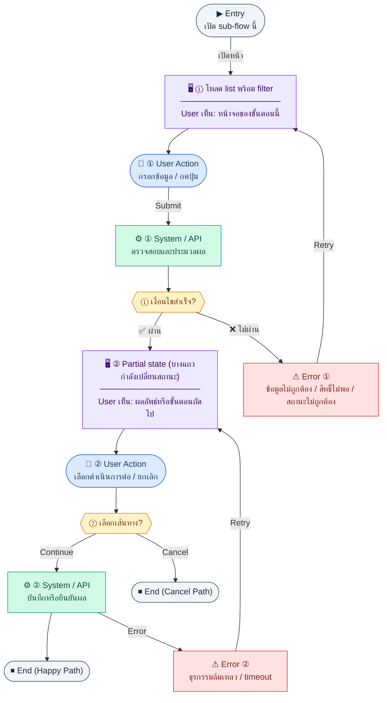

# LeaveList

คู่มือแปลง UX → spec: [`../../UX_TO_UI_SPEC_WORKFLOW.md`](../../UX_TO_UI_SPEC_WORKFLOW.md)

**Route:** `/hr/leaves`

---

## Metadata

| Key | Value |
|-----|--------|
| **UX flow** | [`R1-04_HR_Leave_Management.md`](../../../UX_Flow/Functions/R1-04_HR_Leave_Management.md) |
| **UX sub-flow / steps** | สรุปใน Appendix — แตกตามหัวข้อ Sub-flow / Step ในเอกสาร UX |
| **Design system** | [`design-system.md`](../../design-system.md) — §3 Page layout, §5 forms, §6 DataTable ตามประเภทหน้า |
| **Global FE behaviors** | [`_GLOBAL_FRONTEND_BEHAVIORS.md`](../../../UX_Flow/_GLOBAL_FRONTEND_BEHAVIORS.md) |
| **Preview** | [`LeaveList.preview.html`](./LeaveList.preview.html) · [`../_Shared/preview-base.css`](../_Shared/preview-base.css) · [`MD_TO_PREVIEW_HTML_MANUAL.md`](../MD_TO_PREVIEW_HTML_MANUAL.md) |

---

## เป้าหมายหน้าจอ

ให้ผู้ใช้เลือกประเภทลาที่ถูกต้องและรู้ผลกระทบเชิงเงินเดือน (paid/unpaid) ถ้า BR เปิดเผยในข้อมูล type

## ผู้ใช้และสิทธิ์

อ่าน Actor(s) และ permission gate ใน Appendix / เอกสาร UX — กรณี 401/403/409 อ้าง Global FE behaviors

## โครง layout (สรุป)

ระบุตามประเภทหน้าใน Appendix: list / detail / form / แท็บ — ใช้ pattern ใน design-system.md

## เนื้อหาและฟิลด์

สกัดจาก **User sees** / **User Action** / ช่องกรอกใน Appendix เป็นตารางฟิลด์เต็มเมื่อปรับแต่งรอบถัดไป; ขณะนี้ใช้บล็อก UX ด้านล่างเป็นข้อมูลอ้างอิงครบถ้วน

## การกระทำ (CTA)

สกัดจากปุ่มใน Appendix (`[...]`) และ Frontend behavior

## สถานะพิเศษ

Loading, empty, error, validation, dependency ขณะลบ — ตาม **Error** / **Success** ใน Appendix

## หมายเหตุ implementation (ถ้ามี)

เทียบ `erp_frontend` เมื่อทราบ path ของหน้า

## Preview HTML notes

| หัวข้อ | ใส่อะไร |
|--------|--------|
| **Shell** | โดยมาก `app` (ยกเว้นหน้า login / standalone) |
| **Regions** | ดูลำดับ **User sees** ใน Appendix |
| **สถานะสำหรับสลับใน preview** | `default` · `loading` · `empty` · `error` ตาม UX |
| **ข้อมูลจำลอง** | จำนวนแถว / สถานะ badge ตามประเภทหน้า |
| **ลิงก์ CSS** | [`../_Shared/preview-base.css`](../_Shared/preview-base.css) |

---

## Appendix — UX excerpt (reference)

## Sub-flow A — โหลดประเภทการลา (`GET /api/hr/leaves/types`)

### ชื่อ Flow & ขอบเขต

**Flow name:** `HR Leave — Master data ประเภทการลา`

**Actor(s):** พนักงาน (สร้างคำขอ), HR (ดูทั้งหมด/อนุมัติ)

**Entry:** เปิดหน้าสร้างคำขอลาหรือเปิด filter ประเภทในรายการ

**Exit:** dropdown/checkbox ของประเภทลาพร้อม

**Out of scope:** การแก้ไข master ประเภทลา — อยู่ที่ **Sub-flow F** (`POST`/`PATCH` types)

---

### Scenario Flow

### สัญลักษณ์ Node (Color Legend)

| สี | Node shape | หมายถึง |
|----|-----------|---------|
| 🟣 ม่วง | สี่เหลี่ยม `["…"]` | **Screen / UI State** |
| 🔵 น้ำเงิน | วงกลม `(["…"])` | **User Action** |
| 🟢 เขียว | สี่เหลี่ยม `["…"]` | **System / API** |
| 🟡 เหลือง | เพชร `{{"…"}}` | **Decision** |
| 🔴 แดง | สี่เหลี่ยม `["…"]` | **Error / Edge case** |
| ⚫ เทา | วงรี `(["…"])` | **Start / End** |

---

### Step A1 — โหลด types ก่อนเปิดฟอร์ม

**Goal:** ให้ผู้ใช้เลือกประเภทลาที่ถูกต้องและรู้ผลกระทบเชิงเงินเดือน (paid/unpaid) ถ้า BR เปิดเผยในข้อมูล type

**User sees:** dropdown ประเภทลา (loading → รายการ)

**User can do:** เลือกประเภท

**User Action:**
- ประเภท: `เลือกตัวเลือก`
- ฟิลด์/ข้อมูลที่ใช้:
  - `leaveTypeId` *(required)* : เลือกประเภทลาที่ต้องการยื่น
- ปุ่ม / Controls ในหน้านี้:
  - `[เลือกประเภทลา]` → เปลี่ยนค่าบน dropdown
  - `[ลองใหม่]` → โหลดรายการประเภทลาอีกครั้งเมื่อรายการล้มเหลว
  - `[ปิดฟอร์ม]` → ยกเลิกการยื่นลา

**Frontend behavior:**

- เรียก `GET /api/hr/leaves/types` พร้อม Bearer
- เรียกคู่ขนาน `GET /api/hr/leaves/balances?employeeId={self}&year={current}` เพื่อดึงโควต้าของผู้ใช้เอง
- แสดง badge "มี/ไม่มีเงิน" ถ้า field `paidLeave` มากับ response (ตาม BR Gap A)
- แสดงข้อความ `เหลือ X วัน` ต่อประเภทลาใน dropdown (map จาก balances ตาม `leaveTypeId`)
- ถ้า remaining = 0 ให้แสดง badge `หมดโควต้า` แต่ยังไม่ block submit เพราะ BR บังคับตรวจตอน approve

**System / AI behavior:** คืนรายการ `leave_types`

**Success:** 200 และ UI พร้อมเลือก

**Error:** 401 → auth recovery; 500 → retry; balances load fail ให้แสดง fallback `ไม่สามารถดึงยอดคงเหลือได้` และให้ส่งคำขอได้ต่อ

**Notes:** BR ระบุ `paidLeave` มีผลกับ payroll — UX ควรเตือนเมื่อเลือกประเภทที่ไม่ได้รับค่าจ้าง

---

### Step A2 — Cache และ refresh

**Goal:** ลดการกระพริบเมื่อผู้ใช้เปิดปิดฟอร์มบ่อย

**User sees:** รายการ types โผล่ทันทีจาก cache แล้ว sync เบื้องหลัง

**User can do:** เปลี่ยนประเภทลา

**User Action:**
- ประเภท: `เลือกตัวเลือก / กดปุ่ม`
- ฟิลด์/ข้อมูลที่ใช้:
  - `leaveTypeId` *(required)* : เปลี่ยนประเภทลาที่เลือกบนฟอร์ม
- ปุ่ม / Controls ในหน้านี้:
  - `[Refresh Types]` → บังคับดึงข้อมูลล่าสุดหากสงสัยว่า cache เก่า
  - `[เลือกประเภทลา]` → ใช้รายการจาก cache ได้ทันที
  - `[ปิดฟอร์ม]` → ออกจากการยื่นลา

**Frontend behavior:**

- SWR: แสดง cached แล้ว revalidate `GET /api/hr/leaves/types`

**System / AI behavior:** คืนข้อมูลล่าสุด

**Success:** UI ตรงกับ server

**Error:** silent fail + badge "ข้อมูลอาจไม่ล่าสุด"

**Notes:** **silent/background state** ตามที่ร้องขอใน requirements เอกสารนี้

---

---

## Sub-flow B — รายการคำขอลา (`GET /api/hr/leaves`)

### ชื่อ Flow & ขอบเขต

**Flow name:** `HR Leave — List requests (scope ตาม role)`

**Actor(s):** `employee` เห็นของตน; `hr_admin` / approver เห็นตาม scope ที่ BE กำหนด

**Entry:** เมนู HR → การลา

**Exit:** เปิดรายละเอียดแถวเพื่ออนุมัติหรือดูสถานะ

**Out of scope:** ปฏิทินรวมแบบ Gantt (ถ้าไม่มี)

---

### Scenario Flow

### สัญลักษณ์ Node (Color Legend)

| สี | Node shape | หมายถึง |
|----|-----------|---------|
| 🟣 ม่วง | สี่เหลี่ยม `["…"]` | **Screen / UI State** |
| 🔵 น้ำเงิน | วงกลม `(["…"])` | **User Action** |
| 🟢 เขียว | สี่เหลี่ยม `["…"]` | **System / API** |
| 🟡 เหลือง | เพชร `{{"…"}}` | **Decision** |
| 🔴 แดง | สี่เหลี่ยม `["…"]` | **Error / Edge case** |
| ⚫ เทา | วงรี `(["…"])` | **Start / End** |

---

### Step B1 — โหลด list พร้อม filter

**Goal:** แสดงคำขอลาตามช่วงวันที่/สถานะ/พนักงาน

**User sees:** ตาราง, filter bar, loading

**User can do:** ปรับ filter แล้วค้นหา

**User Action:**
- ประเภท: `กรอกข้อมูล / เลือกตัวเลือก`
- ช่องที่ต้องกรอก:
  - `leaveTypeId` *(required)* : ประเภทลา
  - `startDate` *(required)* : วันเริ่มลา
  - `endDate` *(required)* : วันสิ้นสุดลา
  - `days` *(required, read-only if system คำนวณ)* : จำนวนวันที่ลา
  - `reason` *(required เมื่อ backdate; optional กรณีปกติ)* : เหตุผลการลา
  - `attachment` *(conditional)* : แนบไฟล์ถ้า leave type บังคับเอกสาร
- ปุ่ม / Controls ในหน้านี้:
  - `[Submit Leave Request]` → ตรวจ validation ก่อนส่ง
  - `[Reset]` → ล้างค่าฟอร์ม
  - `[Cancel]` → กลับหน้า list โดยไม่บันทึก

**Frontend behavior:**

- `GET /api/hr/leaves` พร้อม query (เช่น `dateFrom`, `dateTo`, `status`, `employeeId` — ตาม canonical contract)
- reset pagination เมื่อ filter เปลี่ยน

**System / AI behavior:** enforce "พนักงานเห็นเฉพาะของตน" ตาม BR

**Success:** 200

**Error:** 403 เมื่อพยายาม filter คนอื่นโดยไม่มีสิทธิ์

**Notes:** แสดงสถานะชัด (รออนุมัติ / อนุมัติ / ปฏิเสธ / ยกเลิก) เพื่อลดการกด action ผิด

---

### Step B2 — Partial state (บางแถวกำลังเปลี่ยนสถานะ)

**Goal:** หลังอนุมัติ/ปฏิเสธ แถวหนึ่งอาจ stale

**User sees:** optimistic หรือ row-level loading

**User can do:** รอ

**User Action:**
- ประเภท: `กดปุ่ม`
- ข้อมูลที่จะส่ง:
  - `leaveTypeId`, `startDate`, `endDate`, `days` *(required)* : ค่าจากฟอร์มที่ผ่าน validation แล้ว
  - `reason` *(required เมื่อเป็น backdated leave; optional กรณีอื่น)* : เหตุผลประกอบคำขอ
  - `attachment` *(conditional)* : ไฟล์แนบตามกติกาประเภทลา
- ปุ่ม / Controls ในหน้านี้:
  - `[Confirm Submit]` → เรียก `POST /api/hr/leaves`
  - `[Back to Edit]` → กลับไปแก้ฟอร์มก่อนส่ง

**Frontend behavior:**

- หลัง `PATCH .../approve|reject` สำเร็จ: invalidate หรือ patch row ใน store
- ถ้า optimistic rollback เมื่อ API fail

**System / AI behavior:** state machine ฝั่ง server

**Success:** ตารางสะท้อนสถานะจริง

**Error:** 409 ถ้าสถานะเปลี่ยนไปแล้ว (คนอื่นอนุมัติก่อน)

**Notes:** แสดง toast "ข้อมูลเปลี่ยนแล้ว" และ refetch `GET /api/hr/leaves`

---

---

## Sub-flow C — สร้างคำขอลา (`POST /api/hr/leaves`)

### ชื่อ Flow & ขอบเขต

**Flow name:** `HR Leave — Create request`

**Actor(s):** พนักงาน (เป็นหลัก)

**Entry:** ปุ่ม "ขอลา"

**Exit:** คำขอถูกสร้างเป็นสถานะรออนุมัติ

**Out of scope:** แนบไฟล์หมอ (ถ้าไม่มีใน API)

---

### Scenario Flow

### สัญลักษณ์ Node (Color Legend)

| สี | Node shape | หมายถึง |
|----|-----------|---------|
| 🟣 ม่วง | สี่เหลี่ยม `["…"]` | **Screen / UI State** |
| 🔵 น้ำเงิน | วงกลม `(["…"])` | **User Action** |
| 🟢 เขียว | สี่เหลี่ยม `["…"]` | **System / API** |
| 🟡 เหลือง | เพชร `{{"…"}}` | **Decision** |
| 🔴 แดง | สี่เหลี่ยม `["…"]` | **Error / Edge case** |
| ⚫ เทา | วงรี `(["…"])` | **Start / End** |

---

### Step C1 — กรอกฟอร์ม

**Goal:** ส่งช่วงวันที่ จำนวนวัน ประเภทลา เหตุผล

**User sees:** ฟอร์ม + date picker + สรุปจำนวนวัน

**User can do:** กรอกและส่ง

**User Action:**
- ประเภท: `กดปุ่ม / กรอกข้อมูล`
- ช่องที่ต้องกรอก:
  - `approvalNote` *(optional)* : หมายเหตุถึงผู้ขอลา ถ้า product ต้องการ
- ปุ่ม / Controls ในหน้านี้:
  - `[Approve Request]` → ยืนยันอนุมัติ
  - `[Cancel]` → ปิด modal โดยไม่เปลี่ยนสถานะ

**Frontend behavior:**

- validate วันที่สิ้นสุด ≥ วันเริ่ม, จำนวนวัน > 0, ประเภทลาเลือกแล้ว
- แสดงคำเตือนถ้า type เป็น unpaid (จาก `GET /api/hr/leaves/types`)
- เมื่อเลือกประเภทลา แสดง inline text `คงเหลือ: X วัน (อ้างอิง balance ล่าสุด)` ใต้ฟิลด์ประเภทลา

**System / AI behavior:** ยังไม่สร้าง

**Success:** พร้อม submit

**Error:** validation client

**Notes:** BR ระบุการหา approver จาก `departmentId` + `leave_approval_configs` — UX อาจแสดง "ผู้อนุมัติโดยประมาณ" ถ้า BE ส่งกลับมาใน response หลัง create (optional field); BR ตรวจ balance จริงที่ approve ดังนั้นค่าคงเหลือในฟอร์มมีไว้ลดการยื่นเกินสิทธิ์

---

### Step C2 — Submit สร้าง

**Goal:** บันทึกคำขอลา

**User sees:** loading บนปุ่มส่ง

**User can do:** รอ

**User Action:**
- ประเภท: `กรอกข้อมูล / กดปุ่ม`
- ช่องที่ต้องกรอก:
  - `reason` *(required)* : เหตุผลที่ใช้ reject คำขอ
- ปุ่ม / Controls ในหน้านี้:
  - `[Confirm Reject]` → ส่งเหตุผลและเปลี่ยนสถานะ
  - `[Cancel]` → ปิด modal โดยไม่ reject

**Frontend behavior:**

- `POST /api/hr/leaves` พร้อม body ตาม schema

**System / AI behavior:**

- validate ชนกับวันลาที่มีอยู่, โควต้า (ถ้ามี), วันหยุด (ถ้า integrate ภายหลัง)

**Success:** 201 + navigate ไป detail หรือกลับ list พร้อม highlight แถวใหม่

**Error:** 422 พร้อม field errors; ถ้า BE ส่งรหัส `INSUFFICIENT_BALANCE` ให้แสดงข้อความพร้อม `remaining` ที่ตอบกลับ

**Notes:** หลังสร้าง อาจ trigger notification ไป approver (นอกขอบเขต SD นี้แต่ควรมี placeholder copy)

---

---

## Sub-flow D — อนุมัติคำขอ (`PATCH /api/hr/leaves/:id/approve`)

### ชื่อ Flow & ขอบเขต

**Flow name:** `HR Leave — Approve`

**Actor(s):** HR Admin / manager ตาม approval chain (ตาม BR)

**Entry:** ปุ่มอนุมัติในแถวหรือหน้า detail

**Exit:** สถานะ approved

**Out of scope:** multi-level approval UI แบบละเอียด (ถ้า BE ซ่อนเป็น step เดียว)

---

### Scenario Flow

### สัญลักษณ์ Node (Color Legend)

| สี | Node shape | หมายถึง |
|----|-----------|---------|
| 🟣 ม่วง | สี่เหลี่ยม `["…"]` | **Screen / UI State** |
| 🔵 น้ำเงิน | วงกลม `(["…"])` | **User Action** |
| 🟢 เขียว | สี่เหลี่ยม `["…"]` | **System / API** |
| 🟡 เหลือง | เพชร `{{"…"}}` | **Decision** |
| 🔴 แดง | สี่เหลี่ยม `["…"]` | **Error / Edge case** |
| ⚫ เทา | วงรี `(["…"])` | **Start / End** |

---

### Step D1 — ยืนยันการอนุมัติ

**Goal:** กัน mis-click และบันทึกเหตุผลเสริม (ถ้ามี)

**User sees:** modal สั้น ๆ

**User can do:** ยืนยัน/ยกเลิก

**User Action:**
- ประเภท: `เลือกตัวเลือก / กดปุ่ม`
- ช่องที่ใช้กรอง/ดูข้อมูล:
  - `includeInactive` *(optional)* : รวมประเภทลาที่ปิดใช้งานแล้ว
  - `search` *(optional)* : ค้นหาจากชื่อหรือ code
- ปุ่ม / Controls ในหน้านี้:
  - `[Create Leave Type]` → เปิดฟอร์มสร้าง
  - `[Edit]` → เปิดฟอร์มแก้ไขแถวที่เลือก
  - `[Show Inactive]` → toggle แสดงรายการที่ปิดใช้งานแล้ว

**Frontend behavior:** เปิด modal, ยังไม่เรียก API

**System / AI behavior:** —

**Success:** ผู้ใช้ยืนยัน

**Error:** ยกเลิก

**Notes:** —

---

### Step D2 — เรียก approve

**Goal:** เปลี่ยนสถานะเป็น approved

**User sees:** loading บน modal/ปุ่ม

**User can do:** รอ

**User Action:**
- ประเภท: `กรอกข้อมูล / เลือกตัวเลือก`
- ช่องที่ต้องกรอก:
  - `code` *(required)* : รหัสประเภทลา
  - `name` *(required)* : ชื่อประเภทลา
  - `paidLeave` *(required)* : ระบุว่าได้รับค่าจ้างหรือไม่
  - `carryOver` *(optional)* : อนุญาตยกยอดหรือไม่
  - `requireAttachment` *(optional)* : บังคับแนบเอกสารหรือไม่
  - `isActive` *(optional เมื่อแก้ไข)* : เปิด/ปิดใช้งาน
- ปุ่ม / Controls ในหน้านี้:
  - `[Save Leave Type]` → ส่ง `POST` หรือ `PATCH`
  - `[Cancel]` → ปิดฟอร์มโดยไม่บันทึก

**Frontend behavior:**

- `PATCH /api/hr/leaves/:id/approve` (body ตาม BE เช่น comment ว่างได้)

**System / AI behavior:** ตรวจสิทธิ์ approver, ตรวจสถานะปัจจุบันต้องเป็น pending

**Success:** 200 + refresh `GET /api/hr/leaves` หรือ optimistic update

**Error:** 409 conflict state; 403 ไม่ใช่ approver

**Notes:** คำขอที่อนุมัติและเป็น unpaid จะถูก payroll นำไปหัก — ควรมีข้อความยืนยันใน modal สำหรับ unpaid type

**Notes (โควต้า):** ก่อนกดยืนยัน แสดง **วันลาคงเหลือ** สำหรับประเภท/ปีของคำขอ — ดึงจาก `GET /api/hr/leaves/balances?employeeId=&year=&leaveTypeId=` หรือจากฟิลด์ optional ใน response ของ `GET /api/hr/leaves/:id` (ถ้า BE ส่ง) ถ้าไม่มีแถว balance หรือ `remaining` ไม่พอ ให้ชี้ไปที่ Sub-flow G (HR จัดสรรโควต้า)

---

---

## Sub-flow E — ปฏิเสธคำขอ (`PATCH /api/hr/leaves/:id/reject`)

### ชื่อ Flow & ขอบเขต

**Flow name:** `HR Leave — Reject`

**Actor(s):** approver ที่มีสิทธิ์

**Entry:** ปุ่มปฏิเสธ

**Exit:** สถานะ rejected พร้อมเหตุผล

**Out of scope:** การอุทธรณ์ (appeal)

---

### Scenario Flow

### สัญลักษณ์ Node (Color Legend)

| สี | Node shape | หมายถึง |
|----|-----------|---------|
| 🟣 ม่วง | สี่เหลี่ยม `["…"]` | **Screen / UI State** |
| 🔵 น้ำเงิน | วงกลม `(["…"])` | **User Action** |
| 🟢 เขียว | สี่เหลี่ยม `["…"]` | **System / API** |
| 🟡 เหลือง | เพชร `{{"…"}}` | **Decision** |
| 🔴 แดง | สี่เหลี่ยม `["…"]` | **Error / Edge case** |
| ⚫ เทา | วงรี `(["…"])` | **Start / End** |

---

### Step E1 — บังคับเหตุผล

**Goal:** ให้ผู้ขอลาเข้าใจเหตุผล

**User sees:** modal ช่องเหตุผล (required)

**User can do:** กรอกและยืนยัน

**User Action:**
- ประเภท: `เลือกตัวเลือก / กดปุ่ม`
- ช่องที่ใช้กรอง/ดูข้อมูล:
  - `year` *(required)* : ปีที่ต้องการดูยอดโควต้า
  - `employeeId` *(optional)* : จำกัดเฉพาะพนักงาน
  - `leaveTypeId` *(optional)* : จำกัดเฉพาะประเภทลา
- ปุ่ม / Controls ในหน้านี้:
  - `[Search]` → โหลดรายการตาม filter
  - `[Bulk Allocate]` → เปิด flow จัดสรรเป็นชุด
  - `[Edit Allocation]` → เปิดฟอร์มแก้ allocated ของแถวที่เลือก

**Frontend behavior:** ไม่ enable ยืนยันจนกว่ามีเหตุผลขั้นต่ำ N ตัวอักษร (product)

**System / AI behavior:** —

**Success:** พร้อม reject

**Error:** validation

**Notes:** —

---

### Step E2 — เรียก reject

**Goal:** อัปเดตสถานะเป็น rejected

**User sees:** loading

**User can do:** รอ

**User Action:**
- ประเภท: `กรอกข้อมูล / เลือกตัวเลือก`
- ช่องที่ต้องกรอก:
  - `employeeId` *(required เมื่อสร้างใหม่)* : พนักงานที่ต้องการจัดสรร
  - `leaveTypeId` *(required เมื่อสร้างใหม่)* : ประเภทลาที่จะจัดสรร
  - `year` *(required เมื่อสร้างใหม่)* : ปีของโควต้า
  - `allocated` *(required)* : จำนวนวันที่จัดสรร
- ปุ่ม / Controls ในหน้านี้:
  - `[Save Allocation]` → สร้างหรือแก้ `allocated`
  - `[Cancel]` → ปิดฟอร์ม

**Frontend behavior:** `PATCH /api/hr/leaves/:id/reject` พร้อม `{ reason }` ตามสัญญา BE

**System / AI behavior:** บันทึกผู้ปฏิเสธและเวลา

**Success:** 200

**Error:** 409/403

**Notes:** หลัง reject อาจส่ง notification ไปพนักงาน (placeholder)

---

---

## Sub-flow F — HR: จัดการประเภทการลา (`POST` / `PATCH` `/api/hr/leaves/types`)

### ชื่อ Flow & ขอบเขต

**Flow name:** `HR Leave — Master ประเภทลา (CRUD ฝั่ง admin)`

**Actor(s):** `hr_admin` (หรือ permission ตาม BR)

**Entry:** แท็บ/ส่วน "ประเภทการลา" ในหน้า `/hr/leaves`

**Exit:** สร้างหรือแก้ไขประเภทลาสำเร็จ

**Out of scope:** พนักงานทั่วไปไม่เห็นฟอร์มนี้

### Scenario Flow

### สัญลักษณ์ Node (Color Legend)

| สี | Node shape | หมายถึง |
|----|-----------|---------|
| 🟣 ม่วง | สี่เหลี่ยม `["…"]` | **Screen / UI State** |
| 🔵 น้ำเงิน | วงกลม `(["…"])` | **User Action** |
| 🟢 เขียว | สี่เหลี่ยม `["…"]` | **System / API** |
| 🟡 เหลือง | เพชร `{{"…"}}` | **Decision** |
| 🔴 แดง | สี่เหลี่ยม `["…"]` | **Error / Edge case** |
| ⚫ เทา | วงรี `(["…"])` | **Start / End** |

---

### Step F1 — โหลดรายการประเภท

**Frontend behavior:** `GET /api/hr/leaves/types` และถ้าต้องแก้ประเภทที่ปิดใช้งานแล้วให้ส่ง `includeInactive=true`

**User sees:** ตาราง name, code, paid/unpaid, แนบเอกสาร, สถานะ active

**User Action:**
- ประเภท: `กรอกข้อมูล / เลือกตัวเลือก`
- ช่องที่ต้องกรอก:
  - `year` *(required)* : ปีที่จะจัดสรร
  - `leaveTypeIds` *(required)* : ชุดประเภทลาที่จะกระจาย
  - `employeeIds` *(required)* : รายชื่อพนักงานเป้าหมาย
  - `allocated` หรือค่าตั้งต้นต่อประเภท *(conditional ตาม contract BE)* : จำนวนวันที่จะจัดสรร
- ปุ่ม / Controls ในหน้านี้:
  - `[Run Bulk Allocation]` → เรียก bulk allocate
  - `[Download Error Rows]` *(optional)* → ใช้เมื่อ BE ส่งรายการที่จัดสรรไม่สำเร็จ
  - `[Cancel]` → ยกเลิก

### Step F2 — สร้างหรือแก้ไข

**Frontend behavior:**

- สร้าง: `POST /api/hr/leaves/types` (ฟิลด์ตาม BR: `paidLeave`, `carryOver`, `requireAttachment`, ฯลฯ)
- แก้ไข / ปิดใช้งาน: `PATCH /api/hr/leaves/types/:id` (แนะนำ soft-disable ด้วย `isActive`)

**Notes:** เปลี่ยน `paidLeave` มีผลต่อ payroll (Gap A) — แสดงคำเตือนก่อนบันทึก

---

**User Action:**
- ประเภท: `เลือกตัวเลือก / กดปุ่ม`
- ช่องที่ใช้กรอง/ดูข้อมูล:
  - `departmentId` *(optional)* : กรองตามแผนก
- ปุ่ม / Controls ในหน้านี้:
  - `[Add Approval Level]` → เพิ่มลำดับผู้อนุมัติ
  - `[Edit]` → แก้ config แถวที่เลือก
  - `[Delete]` → ลบ config ที่ไม่ใช้งานแล้ว

---

## Sub-flow G — HR: โควต้าการลา (`/api/hr/leaves/balances`)

### ชื่อ Flow & ขอบเขต

**Flow name:** `HR Leave — จัดสรรและดูยอดโควต้า`

**Actor(s):** `hr_admin`

**Entry:** แท็บ "โควต้าการลา" ใน `/hr/leaves`

**Exit:** มีแถว `leave_balances` สำหรับพนักงาน/ปี/ประเภท หรืออัปเดต `allocated` แล้ว

### Scenario Flow

### สัญลักษณ์ Node (Color Legend)

| สี | Node shape | หมายถึง |
|----|-----------|---------|
| 🟣 ม่วง | สี่เหลี่ยม `["…"]` | **Screen / UI State** |
| 🔵 น้ำเงิน | วงกลม `(["…"])` | **User Action** |
| 🟢 เขียว | สี่เหลี่ยม `["…"]` | **System / API** |
| 🟡 เหลือง | เพชร `{{"…"}}` | **Decision** |
| 🔴 แดง | สี่เหลี่ยม `["…"]` | **Error / Edge case** |
| ⚫ เทา | วงรี `(["…"])` | **Start / End** |

---

### Step G1 — ดูรายการ balance

**Frontend behavior:** `GET /api/hr/leaves/balances` พร้อม filter `year`, `employeeId`, `leaveTypeId`

**User sees:** ตาราง allocated / used / remaining

**User Action:**
- ประเภท: `เลือกตัวเลือก / กดปุ่ม`
- ช่องที่ใช้กรอง/ดูข้อมูล:
  - `year` *(required)* : ปีที่ต้องการดูโควต้า
  - `employeeId` *(optional)* : กรองพนักงาน
  - `leaveTypeId` *(optional)* : กรองประเภทลา
- ปุ่ม / Controls ในหน้านี้:
  - `[Search]` → โหลดรายการยอดโควต้า
  - `[Bulk Allocate]` → เปิด flow จัดสรรเป็นชุด

### Step G2 — สร้างแถวหรือแก้ allocated

**Frontend behavior:**

- สร้าง: `POST /api/hr/leaves/balances` (employee + leaveType + year + `allocated`)
- ปรับโควต้า: `PATCH /api/hr/leaves/balances/:id` — **เฉพาะ `allocated`** (ตาม BR)

**User Action:**
- ประเภท: `กรอกข้อมูล / เลือกตัวเลือก`
- ช่องที่ต้องกรอก:
  - `employeeId` *(required เมื่อสร้างใหม่)* : พนักงาน
  - `leaveTypeId` *(required เมื่อสร้างใหม่)* : ประเภทลา
  - `year` *(required เมื่อสร้างใหม่)* : ปี
  - `allocated` *(required)* : จำนวนวันที่จัดสรร
- ปุ่ม / Controls ในหน้านี้:
  - `[Save Allocation]` → บันทึกหรือแก้ allocated
  - `[Cancel]` → ปิดฟอร์ม

### Step G3 — จัดสรรเป็นชุด (ต้นปี / พนักงานใหม่)

**Frontend behavior:** `POST /api/hr/leaves/balances/bulk-allocate` พร้อมปี + ชุดประเภท + รายการ `employeeIds` (หรือตามสัญญา BE)

**Notes:** ใช้หลัง onboarding หรืองบประมาณวันลาประจำปี

---

**User Action:**
- ประเภท: `กรอกข้อมูล / เลือกตัวเลือก`
- ช่องที่ต้องกรอก:
  - `year` *(required)* : ปีจัดสรร
  - `leaveTypeIds` *(required)* : ประเภทลาที่จะจัดสรร
  - `employeeIds` *(required)* : พนักงานเป้าหมาย
  - `allocated` หรือค่าตั้งต้นต่อประเภท *(conditional)* : จำนวนวันที่แจก
- ปุ่ม / Controls ในหน้านี้:
  - `[Run Bulk Allocation]` → ส่งคำสั่งจัดสรรเป็นชุด
  - `[Cancel]` → ยกเลิก

---

## Sub-flow H — HR: สายอนุมัติตามแผนก (`/api/hr/leaves/approval-configs`)

### ชื่อ Flow & ขอบเขต

**Flow name:** `HR Leave — ตั้งค่า leave_approval_configs`

**Actor(s):** `hr_admin`

**Entry:** แท็บ "สายอนุมัติ" ใน `/hr/leaves` หรือหลังสร้างแผนก (ลิงก์จาก R1-03)

**Exit:** แต่ละแผนกมีลำดับ `approverLevel` และ `approverId` ที่ถูกต้อง

### Scenario Flow

### สัญลักษณ์ Node (Color Legend)

| สี | Node shape | หมายถึง |
|----|-----------|---------|
| 🟣 ม่วง | สี่เหลี่ยม `["…"]` | **Screen / UI State** |
| 🔵 น้ำเงิน | วงกลม `(["…"])` | **User Action** |
| 🟢 เขียว | สี่เหลี่ยม `["…"]` | **System / API** |
| 🟡 เหลือง | เพชร `{{"…"}}` | **Decision** |
| 🔴 แดง | สี่เหลี่ยม `["…"]` | **Error / Edge case** |
| ⚫ เทา | วงรี `(["…"])` | **Start / End** |

---

### Step H1 — โหลด config

**Frontend behavior:** `GET /api/hr/leaves/approval-configs?departmentId=` หรือโหลดทั้งหมดแล้วกรองตามแผนก

**User sees:** ตาราง department, level, ชื่อผู้อนุมัติ (จาก employee)

**User Action:**
- ประเภท: `เลือกตัวเลือก / กดปุ่ม`
- ช่องที่ใช้กรอง/ดูข้อมูล:
  - `departmentId` *(optional)* : กรองตามแผนก
- ปุ่ม / Controls ในหน้านี้:
  - `[Add Approval Level]` → เพิ่มผู้อนุมัติ
  - `[Edit]` → แก้ config ที่เลือก
  - `[Delete]` → ลบ config ที่ไม่ใช้แล้ว

### Step H2 — เพิ่ม / แก้ / ลบ

**Frontend behavior:**

- เพิ่ม: `POST /api/hr/leaves/approval-configs`
- แก้: `PATCH /api/hr/leaves/approval-configs/:id`
- ลบ: `DELETE /api/hr/leaves/approval-configs/:id`

**Notes:** คู่ `(departmentId, approverLevel)` ต้องไม่ซ้ำ; หลังเพิ่มแผนกใหม่ต้องทำขั้นตอนนี้ก่อนให้คำขอลาหา approver ได้ (ไม่พึ่ง seed อย่างเดียว)

---

## Coverage Checklist

| Endpoint | Covered in UX file | Notes |
|----------|-------------------|-------|
| `GET /api/hr/leaves/types` | Sub-flow A, F | พนักงานโหลด dropdown; HR จัดการ master ใน F |
| `POST /api/hr/leaves/types` | Sub-flow F | สร้างประเภทลา |
| `PATCH /api/hr/leaves/types/:id` | Sub-flow F | รวม `isActive` |
| `GET /api/hr/leaves/balances` | Sub-flow G, D | HR ตารางโควต้า; approver ดูยอดก่อนอนุมัติ |
| `POST /api/hr/leaves/balances` | Sub-flow G | สร้างแถวโควต้า |
| `PATCH /api/hr/leaves/balances/:id` | Sub-flow G | ปรับ `allocated` |
| `POST /api/hr/leaves/balances/bulk-allocate` | Sub-flow G | จัดสรรชุด |
| `GET /api/hr/leaves/approval-configs` | Sub-flow H | รายการสายอนุมัติ |
| `POST /api/hr/leaves/approval-configs` | Sub-flow H | เพิ่มระดับอนุมัติ |
| `PATCH /api/hr/leaves/approval-configs/:id` | Sub-flow H | แก้ผู้อนุมัติ |
| `DELETE /api/hr/leaves/approval-configs/:id` | Sub-flow H | ลบแถว config |
| `GET /api/hr/leaves` | Sub-flow B, Steps B1–B2 | `leaves.md` — รายการคำขอ + invalidate หลัง approve/reject |
| `POST /api/hr/leaves` | Sub-flow C, Steps C1–C2 | `leaves.md` — สร้างคำขอ |
| `PATCH /api/hr/leaves/:id/approve` | Sub-flow D, Steps D1–D2 | `leaves.md` — อนุมัติ |
| `PATCH /api/hr/leaves/:id/reject` | Sub-flow E, Steps E1–E2 | `leaves.md` — ปฏิเสธพร้อมเหตุผล |

เชื่อมผลกับ payroll เมื่อ unpaid/approved — ดู UX R1-05 / SD `payroll.md`

### Coverage Lock Notes (2026-04-16)
- reject flow ใช้ input เดียวคือ `reason` และ bind กับ `PATCH /api/hr/leaves/:id/reject`
- create/approve/reject/list ต้องอ้าง endpoint ตาม `Documents/SD_Flow/HR/leaves.md` โดยไม่ข้าม sub-flow
- selector sources ต้อง explicit:
  - employee options -> `GET /api/hr/employees`
  - approver options -> endpoint options ฝั่ง settings/users ที่ระบบกำหนด
  - leave types -> `GET /api/hr/leaves/types`
- create/detail/list read model ต้องแสดง `attachmentUrl`, `approvalConfigStatus`, `approverPreview[]` ตาม payload จริงของ BE
- ถ้า `approvalConfigStatus = unconfigured` ให้แสดง warning + block expectation เรื่อง auto-routing แต่ยังคง form context เดิมไว้เพื่อให้ผู้ใช้แก้หรือประสาน HR admin ได้
- ถ้า leave type กำหนด `requireAttachment=true` และยังไม่มี `attachmentUrl` ให้ผูก validation กับ field แนบเอกสารตรง ๆ ไม่ใช้ generic submit error

---

## หมายเหตุ implementation (erp_frontend / ของเดิม)

(erp_frontend / ของเดิม)

(erp_frontend / ของเดิม)

(erp_frontend / ของเดิม)

## 1) Permission

- View: `hr:leave:view` **หรือ** `hr:leave:view_self`
- Create: `hr:leave:create` — แสดงฟอร์มคำขอ
- Approve: `hr:leave:approve` — ปุ่มอนุมัติ/ปฏิเสธในแถว pending
- Assign employee ในฟอร์ม: ต้องมี `hr:leave:view` (ใช้เลือก `employeeId` แทนตัวเอง)

---

## 2) Layout

- Root: `space-y-6`
- `PageHeader` `leave.title`

### ฟอร์มสร้างคำขอ (`canCreate`)

- `section rounded-xl border bg-card p-4`
- หัวข้อ `leave.form.title`
- `form grid gap-3 md:grid-cols-2`:
  - เลือกประเภทลา (select จาก API) `md:col-span-2`
  - วันเริ่ม / วันสิ้นสุด (date)
  - (Optional) รหัสพนักงานเป้าหมาย `md:col-span-2`
  - เหตุผล textarea `md:col-span-2`
  - ปุ่ม submit primary full width แถวล่าง `md:col-span-2`
- แสดง `formError` แดงด้านบนฟอร์ม

### Filter

- Select สถานะ + reset page เมื่อเปลี่ยน (ค่า option: pending, approved, rejected, cancelled — ข้อความ raw ใน code)

### ตาราง

- `DataTable` — พนักงาน, ประเภท, ช่วงวันที่+จำนวนวัน, `StatusBadge`, actions (อนุมัติ / ปฏิเสธ + `prompt` เหตุผล)
- Error list: `leave.loadError`

### Pagination

- แสดง `org.pageOf` + ปุ่ม prev/next `rounded-md border`

---

## 3) Component tree

1. PageHeader  
2. (Optional) Create form card  
3. Status filter  
4. DataTable  
5. Pagination row

---

## 4) Preview

[LeaveList.preview.html](./LeaveList.preview.html) · [`../_Shared/preview-base.css`](../_Shared/preview-base.css)
