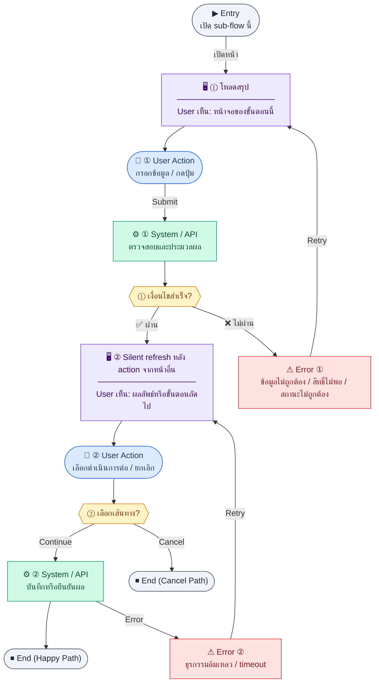

# Payroll

คู่มือแปลง UX → spec: [`../../UX_TO_UI_SPEC_WORKFLOW.md`](../../UX_TO_UI_SPEC_WORKFLOW.md)

**Route:** `/hr/payroll`

---

## Metadata

| Key | Value |
|-----|--------|
| **UX flow** | [`R1-05_HR_Payroll.md`](../../../UX_Flow/Functions/R1-05_HR_Payroll.md) |
| **UX sub-flow / steps** | สรุปใน Appendix — แตกตามหัวข้อ Sub-flow / Step ในเอกสาร UX |
| **Design system** | [`design-system.md`](../../design-system.md) — §3 Page layout, §5 forms, §6 DataTable ตามประเภทหน้า |
| **Global FE behaviors** | [`_GLOBAL_FRONTEND_BEHAVIORS.md`](../../../UX_Flow/_GLOBAL_FRONTEND_BEHAVIORS.md) |
| **Preview** | [`Payroll.preview.html`](./Payroll.preview.html) · [`../_Shared/preview-base.css`](../_Shared/preview-base.css) · [`MD_TO_PREVIEW_HTML_MANUAL.md`](../MD_TO_PREVIEW_HTML_MANUAL.md) |

---

## เป้าหมายหน้าจอ

แสดงรายการ run หรือ aggregate ตามที่ API คืน

## ผู้ใช้และสิทธิ์

อ่าน Actor(s) และ permission gate ใน Appendix / เอกสาร UX — กรณี 401/403/409 อ้าง Global FE behaviors

## โครง layout (สรุป)

ระบุตามประเภทหน้าใน Appendix: list / detail / form / แท็บ — ใช้ pattern ใน design-system.md

## เนื้อหาและฟิลด์

สกัดจาก **User sees** / **User Action** / ช่องกรอกใน Appendix เป็นตารางฟิลด์เต็มเมื่อปรับแต่งรอบถัดไป; ขณะนี้ใช้บล็อก UX ด้านล่างเป็นข้อมูลอ้างอิงครบถ้วน

## การกระทำ (CTA)

สกัดจากปุ่มใน Appendix (`[...]`) และ Frontend behavior

## สถานะพิเศษ

Loading, empty, error, validation, dependency ขณะลบ — ตาม **Error** / **Success** ใน Appendix

## หมายเหตุ implementation (ถ้ามี)

เทียบ `erp_frontend` เมื่อทราบ path ของหน้า

## Preview HTML notes

| หัวข้อ | ใส่อะไร |
|--------|--------|
| **Shell** | โดยมาก `app` (ยกเว้นหน้า login / standalone) |
| **Regions** | ดูลำดับ **User sees** ใน Appendix |
| **สถานะสำหรับสลับใน preview** | `default` · `loading` · `empty` · `error` ตาม UX |
| **ข้อมูลจำลอง** | จำนวนแถว / สถานะ badge ตามประเภทหน้า |
| **ลิงก์ CSS** | [`../_Shared/preview-base.css`](../_Shared/preview-base.css) |

---

## Appendix — UX excerpt (reference)

## Sub-flow A — ภาพรวม payroll ทุกรอบ (`GET /api/hr/payroll`)

### ชื่อ Flow & ขอบเขต

**Flow name:** `HR Payroll — Global summary / landing`

**Actor(s):** `hr_admin`, `finance_manager` (ตาม BR ว่าใครเห็น payroll), `super_admin`

**Entry:** เมนู HR → Payroll

**Exit:** เลือกรอบ (run) เพื่อเข้า detail workflow

**Out of scope:** การผูกบัญชีแยกรายละเอียดทุก journal line ใน UX นี้ (อธิบายเฉพาะจุดที่กระทบผู้ใช้)

---

### Scenario Flow

### สัญลักษณ์ Node (Color Legend)

| สี | Node shape | หมายถึง |
|----|-----------|---------|
| 🟣 ม่วง | สี่เหลี่ยม `["…"]` | **Screen / UI State** |
| 🔵 น้ำเงิน | วงกลม `(["…"])` | **User Action** |
| 🟢 เขียว | สี่เหลี่ยม `["…"]` | **System / API** |
| 🟡 เหลือง | เพชร `{{"…"}}` | **Decision** |
| 🔴 แดง | สี่เหลี่ยม `["…"]` | **Error / Edge case** |
| ⚫ เทา | วงรี `(["…"])` | **Start / End** |

---

### Step A1 — โหลดสรุป

**Goal:** แสดงรายการ run หรือ aggregate ตามที่ API คืน

**User sees:** การ์ด/ตารางสรุป, loading

**User can do:** คลิกเข้า run, กดสร้างรอบใหม่ (ถ้ามีสิทธิ์)

**User Action:**
- ประเภท: `เลือกตัวเลือก / กดปุ่ม`
- ช่องที่ใช้กรอง/ดูข้อมูล:
  - `status` *(optional)* : กรองตาม `draft / processed / approved / paid`
  - `period` *(optional)* : ค้นหาตามงวดจ่าย
- ปุ่ม / Controls ในหน้านี้:
  - `[Create Payroll Run]` → เปิดฟอร์มสร้างรอบใหม่
  - `[Open Run]` → เข้าหน้า detail ของรอบที่เลือก
  - `[Refresh]` → โหลด summary ล่าสุด

**Frontend behavior:**

- `GET /api/hr/payroll` พร้อม Bearer
- แสดงสถานะ run ตาม workflow BR ของ Release 1: `draft / processed / approved / paid`

**System / AI behavior:** คืนข้อมูลสรุปจาก `payroll_runs` และ aggregate

**Success:** 200

**Error:** 403 → access denied template

**Notes:** BR อธิบายความเชื่อมกับ leave unpaid deduction และ (ใน Release 2) attendance — ใน R1 UX อาจแสดง tooltip ว่า "ข้อมูลลาที่อนุมัติแล้วมีผลต่อการคำนวณ"

---

### Step A2 — Silent refresh หลัง action จากหน้าอื่น

**Goal:** ถ้า user เปิดหลายแท็บและมีคนอื่น process run แล้ว ให้ sync

**User sees:** badge "มีการอัปเดต" หรือ auto refetch เมื่อ focus

**User can do:** กดรีเฟรช

**User Action:**
- ประเภท: `กดปุ่ม`
- ปุ่ม / Controls ในหน้านี้:
  - `[Refresh]` → บังคับดึงข้อมูลล่าสุดเมื่อมี badge อัปเดต
  - `[Open Updated Run]` → เปิดรอบที่เพิ่งเปลี่ยนสถานะ

**Frontend behavior:** revalidate `GET /api/hr/payroll` on window focus (optional)

**System / AI behavior:** —

**Success:** ตัวเลขตรงกับ server

**Error:** network → snackbar

**Notes:** **silent/background** state ตาม brief

---

---

## หมายเหตุ implementation (erp_frontend / ของเดิม)

(erp_frontend / ของเดิม)

(erp_frontend / ของเดิม)

(erp_frontend / ของเดิม)

## 1) Permission

- `hr:payroll:view` — ดูตาราง payslips + payroll runs
- `hr:payroll:run` — แสดงส่วนสร้าง run + ปุ่ม workflow ในแถว run (process / approve / mark paid)
- ไม่มี view → ข้อความ `payroll.noPermission` เท่านั้น

---

## 2) Layout

- Root: `space-y-8`
- `PageHeader` `payroll.title`

### ส่วนสร้าง run (ถ้า `canRun`)

- `section rounded-xl border bg-card p-4`
- หัวข้อ `payroll.runs.createTitle`
- แสดง `runError` ถ้ามี (`text-sm text-destructive`)
- แถวควบคุม: input เดือน (number 1–12), ปี (number), ปุ่ม primary `payroll.runs.create`

### ตาราง Payroll runs (`canView`)

- `h3 text-sm font-semibold` `payroll.runs.title`
- แสดง load error ถ้ามี
- `DataTable` — คอลัมน์ period, status (`StatusBadge`), จำนวน payslip, actions (ลิงก์ข้อความ primary ตามสถานะ draft/processing/approved)

### ตาราง Payslips (`canView`)

- `h3` `payroll.payslipsTitle`
- `DataTable` — period, employee, base/net salary, status badge

---

## 3) Component tree

1. PageHeader  
2. (Optional) Create run card  
3. Runs DataTable  
4. Payslips DataTable

---

## 4) Preview

[Payroll.preview.html](./Payroll.preview.html) · [`../_Shared/preview-base.css`](../_Shared/preview-base.css)
