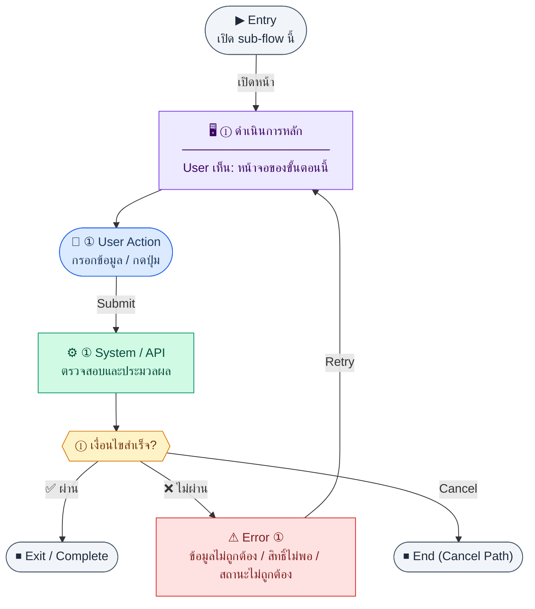

# InvoiceDetail

คู่มือแปลง UX → spec: [`../../UX_TO_UI_SPEC_WORKFLOW.md`](../../UX_TO_UI_SPEC_WORKFLOW.md)

**Route:** `/finance/invoices/:id`

---

## Metadata

| Key | Value |
|-----|--------|
| **UX flow** | [`R1-06_Finance_Invoice_AR.md`](../../../UX_Flow/Functions/R1-06_Finance_Invoice_AR.md) |
| **UX sub-flow / steps** | สรุปใน Appendix — แตกตามหัวข้อ Sub-flow / Step ในเอกสาร UX |
| **Design system** | [`design-system.md`](../../design-system.md) — §3 Page layout, §5 forms, §6 DataTable ตามประเภทหน้า |
| **Global FE behaviors** | [`_GLOBAL_FRONTEND_BEHAVIORS.md`](../../../UX_Flow/_GLOBAL_FRONTEND_BEHAVIORS.md) |
| **Preview** | [`InvoiceDetail.preview.html`](./InvoiceDetail.preview.html) · [`../_Shared/preview-base.css`](../_Shared/preview-base.css) · [`MD_TO_PREVIEW_HTML_MANUAL.md`](../MD_TO_PREVIEW_HTML_MANUAL.md) |

---

## เป้าหมายหน้าจอ

ตรวจสอบหัวเอกสาร รายการ และสถานะก่อนส่งลูกค้าหรือก่อนบันทึกการชำระ

## ผู้ใช้และสิทธิ์

อ่าน Actor(s) และ permission gate ใน Appendix / เอกสาร UX — กรณี 401/403/409 อ้าง Global FE behaviors

## โครง layout (สรุป)

ระบุตามประเภทหน้าใน Appendix: list / detail / form / แท็บ — ใช้ pattern ใน design-system.md

## เนื้อหาและฟิลด์

สกัดจาก **User sees** / **User Action** / ช่องกรอกใน Appendix เป็นตารางฟิลด์เต็มเมื่อปรับแต่งรอบถัดไป; ขณะนี้ใช้บล็อก UX ด้านล่างเป็นข้อมูลอ้างอิงครบถ้วน

## การกระทำ (CTA)

สกัดจากปุ่มใน Appendix (`[...]`) และ Frontend behavior

## สถานะพิเศษ

Loading, empty, error, validation, dependency ขณะลบ — ตาม **Error** / **Success** ใน Appendix

## หมายเหตุ implementation (ถ้ามี)

เทียบ `erp_frontend` เมื่อทราบ path ของหน้า

## Preview HTML notes

| หัวข้อ | ใส่อะไร |
|--------|--------|
| **Shell** | โดยมาก `app` (ยกเว้นหน้า login / standalone) |
| **Regions** | ดูลำดับ **User sees** ใน Appendix |
| **สถานะสำหรับสลับใน preview** | `default` · `loading` · `empty` · `error` ตาม UX |
| **ข้อมูลจำลอง** | จำนวนแถว / สถานะ badge ตามประเภทหน้า |
| **ลิงก์ CSS** | [`../_Shared/preview-base.css`](../_Shared/preview-base.css) |

---

## Appendix — UX excerpt (reference)

## Sub-flow 4 — รายละเอียดใบแจ้งหนี้ (`GET /api/finance/invoices/:id`)

**Goal:** ตรวจสอบหัวเอกสาร รายการ และสถานะก่อนส่งลูกค้าหรือก่อนบันทึกการชำระ

**User sees:** header, รายการบรรทัด, ยอดรวม, badge สถานะ, actions ตามสิทธิ์ (เปลี่ยนสถานะ, รับชำระ, เปิด PDF — ถ้ามี)

**User can do:** ดูข้อมูล, นำทางกลับรายการ, เปิด flow ชำระเงิน/สถานะ

**Frontend behavior:**

- mount หน้า → `GET /api/finance/invoices/:id`
- ถ้ามีแท็บ “ประวัติการชำระ” ให้โหลดคู่หรือหลัง detail ตาม `GET /api/finance/invoices/:id/payments` (sub-flow 6)

**System / AI behavior:** คืน header + items + ข้อมูลลูกค้า (ตาม BR “detail + items + customer”)

**Success:** แสดงข้อมูลครบและสอดคล้องกับ list

**Error:** 404 → หน้า not found; 403 → ไม่มีสิทธิ์ดูเอกสารนี้

**Notes:** `GET /api/finance/invoices/:id`

---

### Scenario Flow

### สัญลักษณ์ Node (Color Legend)

| สี | Node shape | หมายถึง |
|----|-----------|---------|
| 🟣 ม่วง | สี่เหลี่ยม `["…"]` | **Screen / UI State** |
| 🔵 น้ำเงิน | วงกลม `(["…"])` | **User Action** |
| 🟢 เขียว | สี่เหลี่ยม `["…"]` | **System / API** |
| 🟡 เหลือง | เพชร `{{"…"}}` | **Decision** |
| 🔴 แดง | สี่เหลี่ยม `["…"]` | **Error / Edge case** |
| ⚫ เทา | วงรี `(["…"])` | **Start / End** |

---

---

## หมายเหตุ implementation (erp_frontend / ของเดิม)

(erp_frontend / ของเดิม)

(erp_frontend / ของเดิม)

(erp_frontend / ของเดิม)

## 1) States

- Loading / not found: กลางจอ `h-48` — ข้อความ hard-code ไทย "กำลังโหลด..." / "ไม่พบใบแจ้งหนี้" (ในโค้ดปัจจุบัน)

---

## 2) Layout

- Root: `space-y-6`
- `PageHeader` — title = `invoiceNumber`, actions = ปุ่ม outline กลับ `common:action.back` (`navigate(-1)`)
- **สรุปยอด:** `grid grid-cols-2 gap-6 rounded-lg border bg-card p-6`
  - คู่ label `text-xs text-muted-foreground` + value `text-sm font-medium`: ลูกค้า, สถานะ (`StatusBadge` ไม่ส่ง variant), วันออก, ครบกำหนด
- **ตารางรายการ:** `rounded-lg border bg-card`, thead `bg-muted/50`, แถวรายการ, tfoot แสดง subtotal / VAT / total (`formatCurrency`)

---

## 3) Preview

[InvoiceDetail.preview.html](./InvoiceDetail.preview.html) · [`../_Shared/preview-base.css`](../_Shared/preview-base.css)
