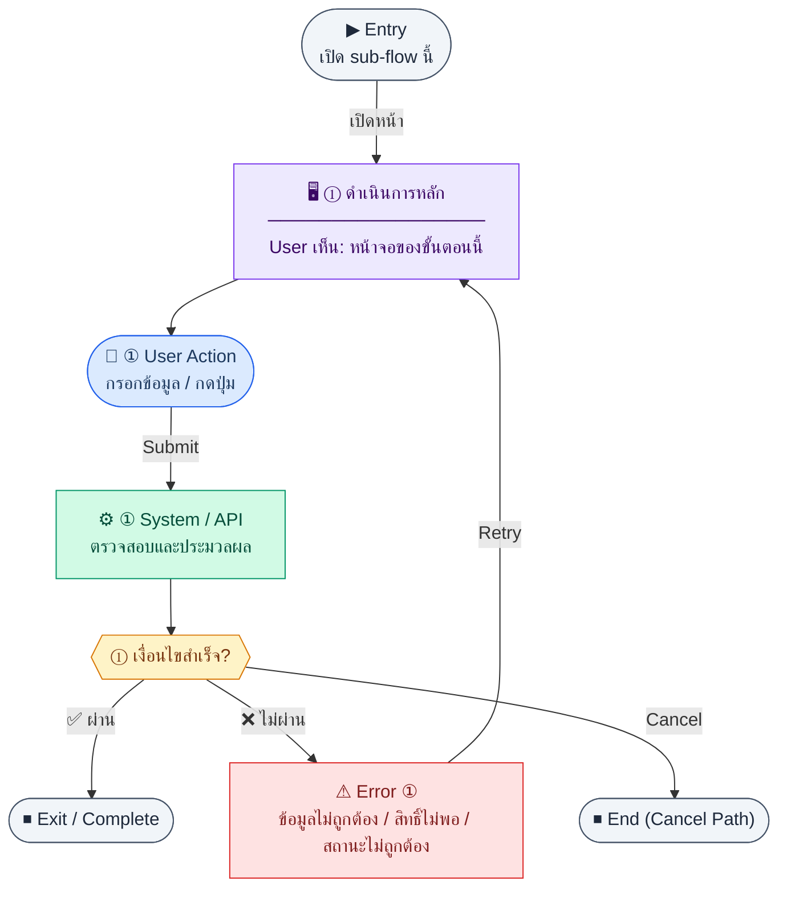

# InvoiceForm

คู่มือแปลง UX → spec: [`../../UX_TO_UI_SPEC_WORKFLOW.md`](../../UX_TO_UI_SPEC_WORKFLOW.md)

**Route:** `/finance/invoices/new`

---

## Metadata

| Key | Value |
|-----|--------|
| **UX flow** | [`R1-06_Finance_Invoice_AR.md`](../../../UX_Flow/Functions/R1-06_Finance_Invoice_AR.md) |
| **UX sub-flow / steps** | สรุปใน Appendix — แตกตามหัวข้อ Sub-flow / Step ในเอกสาร UX |
| **Design system** | [`design-system.md`](../../design-system.md) — §3 Page layout, §5 forms, §6 DataTable ตามประเภทหน้า |
| **Global FE behaviors** | [`_GLOBAL_FRONTEND_BEHAVIORS.md`](../../../UX_Flow/_GLOBAL_FRONTEND_BEHAVIORS.md) |
| **Preview** | [`InvoiceForm.preview.html`](./InvoiceForm.preview.html) · [`../_Shared/preview-base.css`](../_Shared/preview-base.css) · [`MD_TO_PREVIEW_HTML_MANUAL.md`](../MD_TO_PREVIEW_HTML_MANUAL.md) |

---

## เป้าหมายหน้าจอ

บันทึก invoice ใหม่พร้อมรายการสินค้า/บริการและภาษีตามฟิลด์ที่ระบบรองรับ โดยเคารพ company setting เรื่อง `vatRegistered`

## ผู้ใช้และสิทธิ์

อ่าน Actor(s) และ permission gate ใน Appendix / เอกสาร UX — กรณี 401/403/409 อ้าง Global FE behaviors

## โครง layout (สรุป)

ระบุตามประเภทหน้าใน Appendix: list / detail / form / แท็บ — ใช้ pattern ใน design-system.md

## เนื้อหาและฟิลด์

สกัดจาก **User sees** / **User Action** / ช่องกรอกใน Appendix เป็นตารางฟิลด์เต็มเมื่อปรับแต่งรอบถัดไป; ขณะนี้ใช้บล็อก UX ด้านล่างเป็นข้อมูลอ้างอิงครบถ้วน

## การกระทำ (CTA)

สกัดจากปุ่มใน Appendix (`[...]`) และ Frontend behavior

## สถานะพิเศษ

Loading, empty, error, validation, dependency ขณะลบ — ตาม **Error** / **Success** ใน Appendix

## หมายเหตุ implementation (ถ้ามี)

เทียบ `erp_frontend` เมื่อทราบ path ของหน้า

## Preview HTML notes

| หัวข้อ | ใส่อะไร |
|--------|--------|
| **Shell** | โดยมาก `app` (ยกเว้นหน้า login / standalone) |
| **Regions** | ดูลำดับ **User sees** ใน Appendix |
| **สถานะสำหรับสลับใน preview** | `default` · `loading` · `empty` · `error` ตาม UX |
| **ข้อมูลจำลอง** | จำนวนแถว / สถานะ badge ตามประเภทหน้า |
| **ลิงก์ CSS** | [`../_Shared/preview-base.css`](../_Shared/preview-base.css) |

---

## Appendix — UX excerpt (reference)

## Sub-flow 3 — สร้างใบแจ้งหนี้ (`POST /api/finance/invoices`)

**Goal:** บันทึก invoice ใหม่พร้อมรายการสินค้า/บริการและภาษีตามฟิลด์ที่ระบบรองรับ โดยเคารพ company setting เรื่อง `vatRegistered`

**User sees:** ฟอร์มหัวเอกสาร (ลูกค้า, วันออก, ครบกำหนด, หมายเหตุ), ตารางรายการแบบ dynamic rows, สรุปยอด, ปุ่มบันทึก

**User can do:** เพิ่ม/ลบแถวรายการ, กรอก quantity, unitPrice, taxRate, กดบันทึก

**Frontend behavior:**

- validate ฝั่ง client: ฟิลด์บังคับ, วันที่ due ≥ issue (ถ้าเป็น business rule), แต่ละแถวมี description, quantity > 0, ราคา ≥ 0, taxRate ตามที่อนุญาต (เช่น 0 หรือ 7 ตาม BR)
- ก่อนเปิดฟอร์มหรือก่อน submit ให้โหลด company settings/flag ที่บอกว่าองค์กร `vatRegistered` หรือไม่; ถ้า registered ต้องแสดง VAT ต่อบรรทัด/สรุปภาษีให้ครบตาม BR Release 2
- ถ้า `vatRegistered = false` ให้ซ่อนหรือ disable ฟิลด์ VAT ที่ไม่เกี่ยวข้อง และอธิบายว่าเอกสารนี้จะไม่ feed เข้า VAT summary
- submit → `POST /api/finance/invoices` ด้วย body ตาม BR (customerId, issueDate, dueDate, notes, items[])
- ระหว่าง submit ปิด double-submit, แสดง loading บนปุ่ม

**System / AI behavior:** สร้าง `invoices` + `invoice_items`, auto `invoiceNo` (`INV-{YEAR}-{SEQ:4}`), คำนวณ lineTotal และ totalAmount ตามกฎ BR

**Success:** 201 + ได้ `id` → navigate ไป `/finance/invoices/:id` หรือแสดง toast แล้วไป detail

**Error:** 400 validation (แสดง field errors); ถ้าองค์กรจด VAT แต่ line/item ยังไม่ครบ VAT ให้ชี้ field ที่ขาดแบบ inline; 409 ซ้ำเลขที่ (หายากถ้า gen ฝั่ง server); 403 permission; network → ข้อความ + retry

**Notes:** `POST /api/finance/invoices` — SD_Flow `invoices.md`; กติกา VAT รายละเอียดเชื่อมกับ `R2-03_Thai_Tax_VAT_WHT.md` และ company settings ใน Release 2

---

### Scenario Flow

### สัญลักษณ์ Node (Color Legend)

| สี | Node shape | หมายถึง |
|----|-----------|---------|
| 🟣 ม่วง | สี่เหลี่ยม `["…"]` | **Screen / UI State** |
| 🔵 น้ำเงิน | วงกลม `(["…"])` | **User Action** |
| 🟢 เขียว | สี่เหลี่ยม `["…"]` | **System / API** |
| 🟡 เหลือง | เพชร `{{"…"}}` | **Decision** |
| 🔴 แดง | สี่เหลี่ยม `["…"]` | **Error / Edge case** |
| ⚫ เทา | วงรี `(["…"])` | **Start / End** |

---

---

## หมายเหตุ implementation (erp_frontend / ของเดิม)

(erp_frontend / ของเดิม)

(erp_frontend / ของเดิม)

(erp_frontend / ของเดิม)

## 1) Layout

- Root: `mx-auto max-w-3xl space-y-6`
- `PageHeader` `invoice.create`
- `form space-y-6 rounded-xl border bg-card p-6`

### ฟิลด์หัวฟอร์ม (`grid gap-4 sm:grid-cols-2`)

- ลูกค้า: `select` เต็มความกว้าง `sm:col-span-2`, disabled ขณะโหลดรายชื่อลูกค้า
- ครบกำหนด: `input type="date"`
- หมายเหตุ: `textarea` 2 แถว `sm:col-span-2`

### รายการสินค้า (dynamic lines)

- หัวแถว: ชื่อ section + ปุ่มข้อความ primary `invoice.form.addLine`
- แต่ละบรรทัด: `grid gap-2 rounded-lg border p-3 sm:grid-cols-12`
  - description, qty, unitPrice, vatRate (%), ปุ่มลบข้อความ destructive
- Validation client: ต้องมี customer + dueDate + อย่างน้อย 1 บรรทัดที่มี description

### Errors & actions

- `formError` ใต้บรรทัด
- แสดง error จาก mutation เพิ่มถ้ามี
- ปุ่ม: Submit primary, Cancel outline (`navigate(-1)`)

---

## 2) Navigation

- สำเร็จ → `/finance/invoices/{id}`

---

## 3) Preview

[InvoiceForm.preview.html](./InvoiceForm.preview.html) · [`../_Shared/preview-base.css`](../_Shared/preview-base.css)
