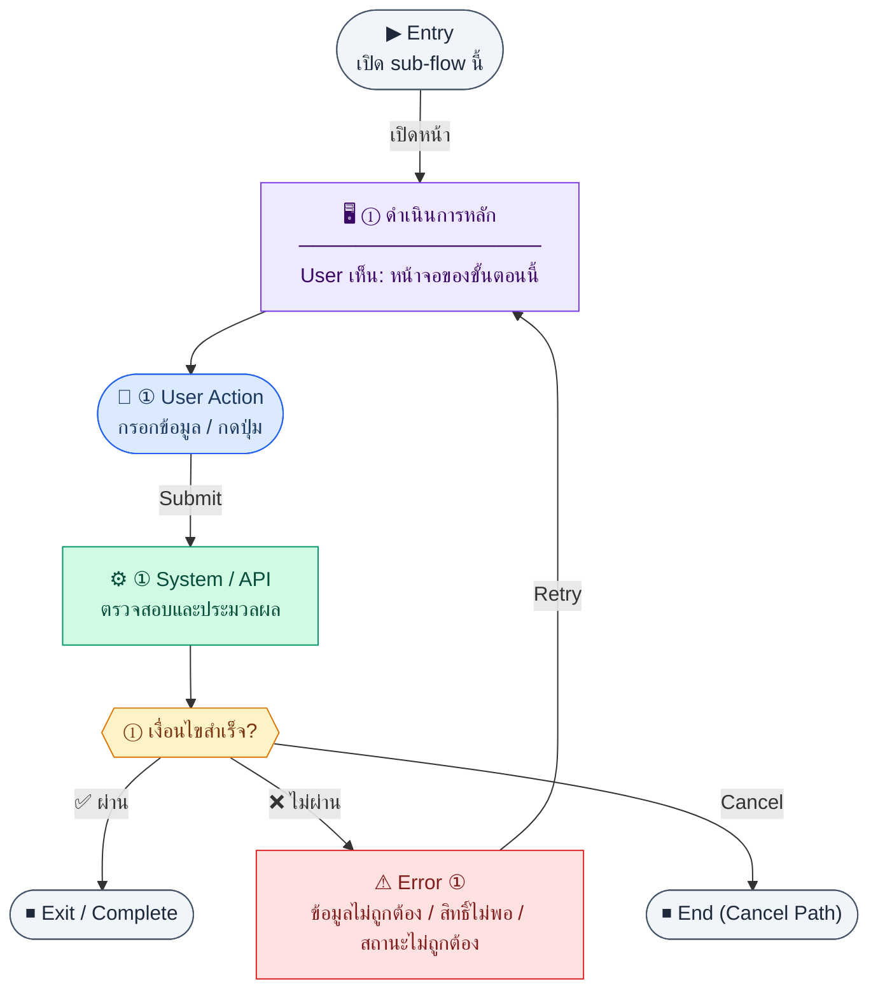

# InvoiceList

คู่มือแปลง UX → spec: [`../../UX_TO_UI_SPEC_WORKFLOW.md`](../../UX_TO_UI_SPEC_WORKFLOW.md)

**Route:** `/finance/invoices`

---

## Metadata

| Key | Value |
|-----|--------|
| **UX flow** | [`R1-06_Finance_Invoice_AR.md`](../../../UX_Flow/Functions/R1-06_Finance_Invoice_AR.md) |
| **UX sub-flow / steps** | สรุปใน Appendix — แตกตามหัวข้อ Sub-flow / Step ในเอกสาร UX |
| **Design system** | [`design-system.md`](../../design-system.md) — §3 Page layout, §5 forms, §6 DataTable ตามประเภทหน้า |
| **Global FE behaviors** | [`_GLOBAL_FRONTEND_BEHAVIORS.md`](../../../UX_Flow/_GLOBAL_FRONTEND_BEHAVIORS.md) |
| **Preview** | [`InvoiceList.preview.html`](./InvoiceList.preview.html) · [`../_Shared/preview-base.css`](../_Shared/preview-base.css) · [`MD_TO_PREVIEW_HTML_MANUAL.md`](../MD_TO_PREVIEW_HTML_MANUAL.md) |

---

## เป้าหมายหน้าจอ

ค้นหา กรอง และเลือก invoice เพื่อเปิดรายละเอียดหรือสร้างใหม่

## ผู้ใช้และสิทธิ์

อ่าน Actor(s) และ permission gate ใน Appendix / เอกสาร UX — กรณี 401/403/409 อ้าง Global FE behaviors

## โครง layout (สรุป)

ระบุตามประเภทหน้าใน Appendix: list / detail / form / แท็บ — ใช้ pattern ใน design-system.md

## เนื้อหาและฟิลด์

สกัดจาก **User sees** / **User Action** / ช่องกรอกใน Appendix เป็นตารางฟิลด์เต็มเมื่อปรับแต่งรอบถัดไป; ขณะนี้ใช้บล็อก UX ด้านล่างเป็นข้อมูลอ้างอิงครบถ้วน

## การกระทำ (CTA)

สกัดจากปุ่มใน Appendix (`[...]`) และ Frontend behavior

## สถานะพิเศษ

Loading, empty, error, validation, dependency ขณะลบ — ตาม **Error** / **Success** ใน Appendix

## หมายเหตุ implementation (ถ้ามี)

เทียบ `erp_frontend` เมื่อทราบ path ของหน้า

## Preview HTML notes

| หัวข้อ | ใส่อะไร |
|--------|--------|
| **Shell** | โดยมาก `app` (ยกเว้นหน้า login / standalone) |
| **Regions** | ดูลำดับ **User sees** ใน Appendix |
| **สถานะสำหรับสลับใน preview** | `default` · `loading` · `empty` · `error` ตาม UX |
| **ข้อมูลจำลอง** | จำนวนแถว / สถานะ badge ตามประเภทหน้า |
| **ลิงก์ CSS** | [`../_Shared/preview-base.css`](../_Shared/preview-base.css) |

---

## Appendix — UX excerpt (reference)

## Sub-flow 1 — รายการใบแจ้งหนี้ (`GET /api/finance/invoices`)

**Goal:** ค้นหา กรอง และเลือก invoice เพื่อเปิดรายละเอียดหรือสร้างใหม่

**User sees:** ตารางรายการ (เลขที่, ลูกค้า, วันที่, ครบกำหนด, สถานะ, ยอดรวม), ตัวกรองช่วงวันที่ / สถานะ / ลูกค้า, pagination, ปุ่ม “สร้างใบแจ้งหนี้”, empty state เมื่อไม่มีข้อมูล

**User can do:** ปรับ query ตัวกรอง, เปลี่ยนหน้า, เรียงคอลัมน์ (ถ้า product รองรับ), คลิกแถวไปหน้ารายละเอียด, เปิดหน้าสร้างใหม่

**Frontend behavior:**

- โหลดหน้าแล้วเรียก `GET /api/finance/invoices` พร้อม query ตาม BR: `page`, `limit`, `search`, `status`, `customerId`, `issueDateFrom`, `issueDateTo` (และซิงค์กับ state ใน URL ถ้ามี)
- แสดง skeleton/loading ระหว่าง fetch ครั้งแรก; ระหว่างเปลี่ยนหน้า/กรอง อาจใช้ inline loading บนตาราง
- ถ้าไม่มีสิทธิ์ `read` ให้ redirect หรือแสดง empty พร้อมข้อความ 403 ตาม pattern แอป

**System / AI behavior:** API ตรวจ auth + permission, อ่าน `invoices` (+ join ลูกค้า) คืนรายการแบบ paginated

**Success:** ได้รายการและ meta pagination ครบ, UI แสดงข้อมูลสอดคล้อง response

**Error:** 401 → เคลียร์ session ไป login; 403 → ข้อความไม่มีสิทธิ์; 5xx/timeout → banner error + ปุ่ม “ลองอีกครั้ง” เรียก `GET /api/finance/invoices` ซ้ำด้วยพารามิเตอร์เดิม

**Notes:** Endpoint หลักสำหรับ sub-flow นี้คือ `GET /api/finance/invoices` ตาม `Documents/SD_Flow/Finance/invoices.md`

---

### Scenario Flow

### สัญลักษณ์ Node (Color Legend)

| สี | Node shape | หมายถึง |
|----|-----------|---------|
| 🟣 ม่วง | สี่เหลี่ยม `["…"]` | **Screen / UI State** |
| 🔵 น้ำเงิน | วงกลม `(["…"])` | **User Action** |
| 🟢 เขียว | สี่เหลี่ยม `["…"]` | **System / API** |
| 🟡 เหลือง | เพชร `{{"…"}}` | **Decision** |
| 🔴 แดง | สี่เหลี่ยม `["…"]` | **Error / Edge case** |
| ⚫ เทา | วงรี `(["…"])` | **Start / End** |

---

---

## หมายเหตุ implementation (erp_frontend / ของเดิม)

(erp_frontend / ของเดิม)

(erp_frontend / ของเดิม)

(erp_frontend / ของเดิม)

## 1) Permission

- ปุ่มสร้างแสดงเมื่อ `finance:invoice:create` → `/finance/invoices/new`

---

## 2) Layout

- Root: `space-y-6`
- `PageHeader` — `invoice.list.title`, actions = ปุ่ม primary `invoice.create`
- `DataTable`:
  - คอลัมน์: เลขที่, ลูกค้า, ครบกำหนด (Thai date), ยอดรวม (ขวา), `StatusBadge` สถานะ
  - `onRowClick` → `/finance/invoices/:id`
  - `emptyText` = `invoice.empty`

---

## 3) StatusBadge mapping

- draft → default, sent → warning, paid → success, overdue/cancelled → destructive

---

## 4) Preview

[InvoiceList.preview.html](./InvoiceList.preview.html) · [`../_Shared/preview-base.css`](../_Shared/preview-base.css)
