# VendorForm

คู่มือแปลง UX → spec: [`../../UX_TO_UI_SPEC_WORKFLOW.md`](../../UX_TO_UI_SPEC_WORKFLOW.md)

**Route:** `/finance/vendors/new`

---

## Metadata

| Key | Value |
|-----|--------|
| **UX flow** | [`R1-07_Finance_Vendor_Management.md`](../../../UX_Flow/Functions/R1-07_Finance_Vendor_Management.md) |
| **UX sub-flow / steps** | สรุปใน Appendix — แตกตามหัวข้อ Sub-flow / Step ในเอกสาร UX |
| **Design system** | [`design-system.md`](../../design-system.md) — §3 Page layout, §5 forms, §6 DataTable ตามประเภทหน้า |
| **Global FE behaviors** | [`_GLOBAL_FRONTEND_BEHAVIORS.md`](../../../UX_Flow/_GLOBAL_FRONTEND_BEHAVIORS.md) |
| **Preview** | [`VendorForm.preview.html`](./VendorForm.preview.html) · [`../_Shared/preview-base.css`](../_Shared/preview-base.css) · [`MD_TO_PREVIEW_HTML_MANUAL.md`](../MD_TO_PREVIEW_HTML_MANUAL.md) |

---

## เป้าหมายหน้าจอ

เพิ่ม vendor ใหม่ให้ใช้ใน AP และเอกสารอื่น

## ผู้ใช้และสิทธิ์

อ่าน Actor(s) และ permission gate ใน Appendix / เอกสาร UX — กรณี 401/403/409 อ้าง Global FE behaviors

## โครง layout (สรุป)

ระบุตามประเภทหน้าใน Appendix: list / detail / form / แท็บ — ใช้ pattern ใน design-system.md

## เนื้อหาและฟิลด์

สกัดจาก **User sees** / **User Action** / ช่องกรอกใน Appendix เป็นตารางฟิลด์เต็มเมื่อปรับแต่งรอบถัดไป; ขณะนี้ใช้บล็อก UX ด้านล่างเป็นข้อมูลอ้างอิงครบถ้วน

## การกระทำ (CTA)

สกัดจากปุ่มใน Appendix (`[...]`) และ Frontend behavior

## สถานะพิเศษ

Loading, empty, error, validation, dependency ขณะลบ — ตาม **Error** / **Success** ใน Appendix

## หมายเหตุ implementation (ถ้ามี)

เทียบ `erp_frontend` เมื่อทราบ path ของหน้า

## Preview HTML notes

| หัวข้อ | ใส่อะไร |
|--------|--------|
| **Shell** | โดยมาก `app` (ยกเว้นหน้า login / standalone) |
| **Regions** | ดูลำดับ **User sees** ใน Appendix |
| **สถานะสำหรับสลับใน preview** | `default` · `loading` · `empty` · `error` ตาม UX |
| **ข้อมูลจำลอง** | จำนวนแถว / สถานะ badge ตามประเภทหน้า |
| **ลิงก์ CSS** | [`../_Shared/preview-base.css`](../_Shared/preview-base.css) |

---

## Appendix — UX excerpt (reference)

## Sub-flow 4 — สร้าง Vendor (`POST /api/finance/vendors`)

**Goal:** เพิ่ม vendor ใหม่ให้ใช้ใน AP และเอกสารอื่น

**User sees:** ฟอร์ม `/finance/vendors/new` — code, name, taxId, ที่อยู่, ผู้ติดต่อ, โทร, email, paymentTermDays

**User can do:** กรอกและกดบันทึก, กดยกเลิกกลับ list

**Frontend behavior:**

- validate: name บังคับ, email/phone format, paymentTermDays เป็นตัวเลข ≥ 0
- `POST /api/finance/vendors` พร้อม body ตาม schema จริงของ API
- BR: `code` unique — ถ้าว่างระบบอาจ auto `VEND-{SEQ}`; แสดง helper text ให้ผู้ใช้รู้ว่าเว้นว่างได้หรือไม่ตาม product

**System / AI behavior:** insert `vendors`, enforce unique `code`

**Success:** 201 → redirect `/finance/vendors/:id/edit` หรือ list พร้อม toast

**Error:** 400 validation; 409 duplicate code; 403

**Notes:** `POST /api/finance/vendors`

---

### Scenario Flow

### สัญลักษณ์ Node (Color Legend)

| สี | Node shape | หมายถึง |
|----|-----------|---------|
| 🟣 ม่วง | สี่เหลี่ยม `["…"]` | **Screen / UI State** |
| 🔵 น้ำเงิน | วงกลม `(["…"])` | **User Action** |
| 🟢 เขียว | สี่เหลี่ยม `["…"]` | **System / API** |
| 🟡 เหลือง | เพชร `{{"…"}}` | **Decision** |
| 🔴 แดง | สี่เหลี่ยม `["…"]` | **Error / Edge case** |
| ⚫ เทา | วงรี `(["…"])` | **Start / End** |

```mermaid
flowchart TD
    classDef screen   fill:#ede9fe,stroke:#7c3aed,color:#3b0764
    classDef user     fill:#dbeafe,stroke:#2563eb,color:#1e3a5f
    classDef system   fill:#d1fae5,stroke:#059669,color:#064e3b
    classDef decision fill:#fef3c7,stroke:#d97706,color:#78350f
    classDef error    fill:#fee2e2,stroke:#dc2626,color:#7f1d1d
    classDef terminal fill:#f1f5f9,stroke:#475569,color:#1e293b

    START(["▶ Entry\nเปิด sub-flow นี้"]):::terminal
    SCR1["🖥 ① ดำเนินการหลัก\n─────────────────\nUser เห็น: หน้าจอของขั้นตอนนี้"]:::screen
    U1(["👤 ① User Action\nกรอกข้อมูล / กดปุ่ม"]):::user
    SYS1["⚙ ① System / API\nตรวจสอบและประมวลผล"]:::system
    D1{{"① เงื่อนไขสำเร็จ?"}}:::decision
    ERR1["⚠ Error ①\nข้อมูลไม่ถูกต้อง / สิทธิ์ไม่พอ / สถานะไม่ถูกต้อง"]:::error

    START -->|"เปิดหน้า"| SCR1
    SCR1 --> U1
    U1 -->|"Submit"| SYS1
    SYS1 --> D1
    ENDMAIN(["⏹ Exit / Complete"]):::terminal
    D1 -- "✅ ผ่าน" --> ENDMAIN
    D1 -- "❌ ไม่ผ่าน" --> ERR1
    ERR1 -->|"Retry"| SCR1
    ENDCANCEL(["⏹ End (Cancel Path)"]):::terminal
    D1 -- "Cancel" --> ENDCANCEL
```

---

---

## หมายเหตุ implementation (erp_frontend / ของเดิม)

(erp_frontend / ของเดิม)

(erp_frontend / ของเดิม)

(erp_frontend / ของเดิม)

## 1) Layout

- Root: `mx-auto max-w-2xl space-y-6`
- `PageHeader` — title สร้าง/แก้ไข, actions = ลิงก์กลับรายการ `vendor.backToList`
- แสดง `error` ในกล่อง destructive ถ้ามี
- `form space-y-4 rounded-xl border bg-card p-6`
  - สร้างใหม่: input รหัส (optional placeholder auto)
  - แก้ไข: แสดงรหัสเป็น `font-mono`
  - ฟิลด์: ชื่อ *, taxId, email, phone, ที่อยู่, ผู้ติดต่อ, ธนาคาร/เลขบัญชี/ชื่อบัญชี, payment term (number), notes (textarea) — ตามโค้ดไฟล์เต็ม
- ท้ายฟอร์ม: ปุ่ม submit primary เดี่ยว (`vendor.submit`) — ไม่มีปุ่มยกเลิกในโค้ดปัจจุบัน (กลับผ่านลิงก์ใน header)

---

## 2) Navigation

- สำเร็จ → `/finance/vendors`

---

## 3) Preview

[VendorForm.preview.html](./VendorForm.preview.html) · [`../_Shared/preview-base.css`](../_Shared/preview-base.css)
